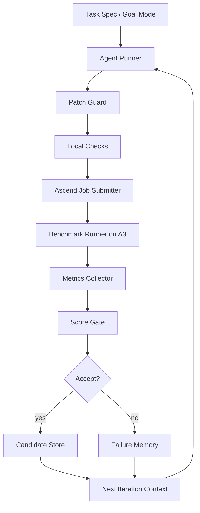

# vLLM Ascend TileRT-like 自演进优化闭环实施方案

版本：2026-05-25

适用目标：

- 硬件：Ascend A3 优先，A2 作为后续兼容路径。
- 框架：`vllm-ascend` 为第一落地载体。
- 模型：DeepSeek-V3.2-W8A8 + MTP 为第一目标模型。
- 场景：single-request decode low-latency，目标逼近或达到 400+ token/s。
- 方法：Codex/Claude Code 负责小步代码优化，Ascend 集群负责真实验证，自动评分系统负责接受/拒绝。

当前状态：

- 已有本地最小闭环骨架：`/Users/linyi/code/Documents/code/ascend_tilert_loop/`
- 已实现模块：
  - `orchestrator.py`：单轮 agent -> experiment -> score -> history。
  - `run_experiment.py`：运行评测命令并保存 JSON 指标。
  - `score.py`：正确性、token/s、p99 TPOT 等接受规则。
  - `hooks.py`：Claude Code hook 级安全拦截。
  - `agent_prompt.md`、`configs/example.json`、`history/`。
- 已通过本地单测：13 个测试覆盖 score、experiment、orchestrator、hook。

---

## 1. 总体结论

这个系统可以开展，但必须按“工程化闭环”而不是“放任 agent 自己跑”的方式执行。

核心原则：

1. **先建立可复现 baseline，再优化。**
   没有稳定 baseline，所有 token/s 提升都不可相信。

2. **每轮只允许一个优化假设。**
   否则无法判断性能收益来自哪个改动。

3. **真实 Ascend 机器只跑标准 job。**
   Agent 不直接 SSH，不改系统，不改驱动，不改 CANN，不直接控制集群。

4. **所有实验结果必须机器可读。**
   每轮至少输出 `metrics.json`、`score.json`、`diff.patch`、`summary.json`。

5. **接受规则比 agent 判断优先。**
   Agent 说“优化成功”不算数，只有 correctness + benchmark + score gate 通过才算。

6. **先半自动，再自主长跑。**
   先人工审查 10-20 轮，确认评测和回滚可靠，再启动 8-35 小时 autonomous run。

---

## 2. 目标拆解

### 2.1 一级目标

建立一个持续迭代自优化系统，使 agent 可以围绕 vLLM Ascend 上的 DeepSeek-V3.2-W8A8 + MTP decode 路径不断提出小步 patch，并由 A3 集群自动验证、评分、保留最佳候选。

### 2.2 二级目标

性能目标：

- 主指标：single-request decode `tokens_per_sec >= 400`。
- 延迟指标：`tpot_ms` 降低，`p99_tpot_ms` 不恶化超过 5%。
- 稳定性：目标性能连续 3 次重复实验通过。
- 正确性：logits/token/MTP accept 行为保持一致。

系统目标：

- 支持 bounded iteration。
- 支持 patch allowlist。
- 支持 baseline 对比。
- 支持失败分类和记忆。
- 支持 long-run 停止条件。
- 支持定期报告。

### 2.3 非目标

第一阶段不做：

- 多租户平台。
- Web UI。
- 任意模型泛化。
- 任意硬件泛化。
- 自动修改集群系统环境。
- 自动合并主干。
- 自动推送远端分支。

这些都可以后续增加，但不能阻塞第一版闭环。

---

## 3. 系统架构



### 3.1 控制层

职责：

- 读取 goal、baseline、stop policy。
- 调用 agent 产生 patch。
- 检查改动范围。
- 调用 Ascend validation harness。
- 解析结果。
- 保存 history。
- 决定继续、停止、切换策略。

对应现有模块：

- `ascend_tilert_loop/orchestrator.py`
- `ascend_tilert_loop/score.py`

### 3.2 实验层

职责：

- 在 A3 真实环境运行固定 benchmark。
- 做 correctness check。
- 采集性能和 profiler。
- 输出标准 JSON。

后续需要补：

- `cluster/submit_job.py`
- `cluster/collect_metrics.py`
- `cluster/parse_profiler.py`

### 3.3 反馈层

职责：

- 保存每轮 diff、metrics、profile、score、agent log。
- 生成下一轮 context。
- 汇总 best candidate 和失败模式。

当前已有：

- `history/iter-YYYYMMDD-HHMMSS/`

后续建议增加：

- `memory/best.json`
- `memory/failures.jsonl`
- `reports/daily_report.md`

---

## 4. Goal Mode 设计

当前代码只有 `target_tokens_per_sec`，还没有完整 goal mode。建议升级为：

```json
{
  "goal_mode": "reach_target",
  "goal": {
    "primary_metric": "tokens_per_sec",
    "target": 400.0,
    "stable_success_runs": 3,
    "min_relative_improvement": 0.01,
    "stop_after_no_improvement": 8,
    "max_correctness_failures": 3,
    "max_hours": 35
  }
}
```

### 4.1 支持模式

`baseline_freeze`

- 不接受优化 patch。
- 只运行 benchmark 和 profile。
- 用于 Phase 0。

`reach_target`

- 目标是达到指定 token/s。
- 连续 N 次稳定达标后停止。
- 用于 400+ token/s 目标。

`maximize`

- 不设固定上限。
- 只要持续提升就继续。
- 连续 N 轮无提升停止。

`diagnose`

- 不以接受 patch 为主。
- 目标是定位瓶颈并生成 profiler 报告。
- 用于性能下降或大幅波动时。

### 4.2 接受规则

硬门槛：

- `correct == true`
- `tokens_per_sec >= baseline_tokens_per_sec * (1 - allowed_regression)`
- `p99_tpot_ms <= baseline_p99_tpot_ms * 1.05`
- `unauthorized_paths == []`
- `benchmark_exit_code == 0`

软评分：

```text
score =
  tokens_per_sec / baseline_tokens_per_sec
  + 0.02 * graph_hit_rate
  + 0.01 * max(accept_len_mean - 1, 0)
  - 0.001 * d2h_sync_count
  - 0.02 * correctness_risk_level
```

注意：score 只用于排序，不能覆盖硬门槛。

---

## 5. 性能收益分析

### 5.1 基本性能模型

single-request decode 的有效 token/s 可近似为：

```text
effective_token_per_sec =
  accepted_tokens_per_decode_step / decode_step_latency
```

其中：

```text
decode_step_latency =
  host_overhead
  + graph_launch_or_replay_overhead
  + attention_latency
  + moe_latency
  + lmhead_sampler_latency
  + communication_exposed_latency
  + synchronization_stall
```

TileRT-like 思路本质上是在同时做两件事：

1. 降低单步 latency。
2. 通过 MTP/spec 提高每步 accepted tokens。

所以只优化 kernel 还不够，必须同时优化：

- persistent runtime
- graph replay
- device-side state
- MTP acceptance path
- compute/comm overlap

### 5.2 收益来源矩阵

| 优化方向 | 目标瓶颈 | 预期收益 | 风险 | 第一验证指标 |
|---|---|---:|---|---|
| 清理 D2H sync | CPU/NPU 同步阻塞 | 2%-10% | 逻辑分支改错 | `d2h_sync_count` |
| FULL graph replay | launch overhead | 5%-20% | shape 不稳定 | `graph_hit_rate` |
| persistent buffer | 分配和地址变化 | 3%-8% | buffer 生命周期错误 | allocation count |
| DSA/MLA overlap | attention pipeline 空洞 | 5%-15% | stream/event 顺序错误 | timeline idle |
| MoE + MC2 overlap | 通信暴露 | 8%-25% | expert routing/通信错误 | `hccl_ms_per_step` |
| device sampler | logits/sampling host 往返 | 3%-12% | 采样一致性 | token diff |
| MTP verifier device-side | accept path 同步 | 5%-20% | accepted length 错误 | `accept_len_mean` |
| MTP 接受率提升 | 每步 token 数 | 10%-100%+ | 质量/一致性风险 | accept histogram |

这些收益不能简单相加。真实收益通常受最长瓶颈限制，必须看 profiler timeline。

### 5.3 优先级判断

优先做：

1. D2H sync
2. graph replay hit rate
3. MTP accept path
4. MoE/MC2 overlap
5. DSA/MLA overlap
6. sampler device-side

原因：

- D2H 和 graph 问题通常会直接吞掉所有 kernel 优化收益。
- MTP accept length 是 token/s 倍增项。
- MoE/MC2 是大 MoE 模型 decode 的核心瓶颈。
- DSA/MLA 是 DeepSeek-V3.2 的模型特化关键路径。

---

## 6. 标准评测协议

### 6.1 输入矩阵

第一阶段建议固定 3 组：

| Case | Prompt Len | Output Len | 并发 | 用途 |
|---|---:|---:|---:|---|
| S | 128 | 512 | 1 | 快速迭代 |
| M | 512 | 1024 | 1 | 主指标 |
| L | 2048 | 1024 | 1 | 长上下文稳定性 |

第一版 score 以 M 为主，S/L 作为安全验证。

### 6.2 重复次数

每个 patch：

- quick check：1 次。
- candidate check：3 次。
- release candidate：5 次。

取：

- mean token/s
- min token/s
- p50/p99 TPOT
- stddev

如果 stddev > 3%，不能判定小幅收益。

### 6.3 指标 JSON

建议标准：

```json
{
  "run_id": "iter-0007-case-M-repeat-2",
  "hardware": {
    "device": "Atlas 800 A3",
    "npu_count": 16,
    "memory_gb_per_npu": 64
  },
  "software": {
    "cann": "x.y.z",
    "torch_npu": "x.y.z",
    "vllm_ascend_commit": "abcdef",
    "docker_image": "quay.io/ascend/vllm-ascend:tag"
  },
  "workload": {
    "model": "DeepSeek-V3.2-W8A8",
    "prompt_len": 512,
    "output_len": 1024,
    "concurrency": 1,
    "num_speculative_tokens": 3
  },
  "correct": true,
  "tokens_per_sec": 417.2,
  "tpot_ms": 2.39,
  "p50_tpot_ms": 2.31,
  "p99_tpot_ms": 3.1,
  "accept_len_mean": 2.71,
  "accept_len_min": 1,
  "accept_len_max": 4,
  "accept_len_histogram": {
    "1": 110,
    "2": 220,
    "3": 490,
    "4": 204
  },
  "d2h_sync_count": 0,
  "graph_hit_rate": 0.98,
  "graph_capture_count": 1,
  "graph_replay_count": 1023,
  "npu_util_mean": 0.82,
  "hbm_bw_util_mean": 0.76,
  "hccl_ms_per_step": 0.18,
  "mc2_ms_per_step": 0.11,
  "kernel_top_bottlenecks": [
    {"name": "moe_dispatch", "ms": 0.42},
    {"name": "mla_forward", "ms": 0.37},
    {"name": "lmhead_sampler", "ms": 0.19}
  ]
}
```

---

## 7. Phase 0：基线冻结计划

目标：不优化，只建立可信 baseline。

### 7.1 准备项

必须记录：

- A3 服务器型号。
- NPU 数量。
- HCCN 拓扑。
- CANN 版本。
- driver 版本。
- torch-npu 版本。
- vllm/vllm-ascend commit。
- Docker image tag 和 digest。
- 模型权重路径和 checksum。
- benchmark 脚本 commit。

### 7.2 命令模板

建议先用 vLLM Ascend 文档中的 DeepSeek-V3.2 A3 配置作为起点：

```bash
export HCCL_OP_EXPANSION_MODE="AIV"
export OMP_PROC_BIND=false
export OMP_NUM_THREADS=10
export VLLM_USE_V1=1
export HCCL_BUFFSIZE=200
export VLLM_ASCEND_ENABLE_MLAPO=1
export PYTORCH_NPU_ALLOC_CONF=expandable_segments:True
export VLLM_ASCEND_ENABLE_FLASHCOMM1=1

vllm serve /root/.cache/modelscope/hub/models/vllm-ascend/DeepSeek-V3.2-W8A8 \
  --host 0.0.0.0 \
  --port 8000 \
  --data-parallel-size 2 \
  --tensor-parallel-size 8 \
  --quantization ascend \
  --seed 1024 \
  --served-model-name deepseek_v3_2 \
  --enable-expert-parallel \
  --max-num-seqs 16 \
  --max-model-len 8192 \
  --max-num-batched-tokens 4096 \
  --trust-remote-code \
  --no-enable-prefix-caching \
  --gpu-memory-utilization 0.92 \
  --compilation-config '{"cudagraph_mode": "FULL_DECODE_ONLY"}' \
  --speculative-config '{"num_speculative_tokens": 3, "method": "deepseek_mtp"}'
```

### 7.3 产物

```text
history/baseline/
  env.json
  run_command.sh
  metrics_case_s_repeat_1.json
  metrics_case_m_repeat_1.json
  metrics_case_l_repeat_1.json
  profiler_case_m/
  baseline_summary.json
  baseline_report.md
```

### 7.4 验收

Phase 0 完成条件：

- case M 至少跑 5 次。
- correctness 全通过。
- token/s stddev <= 3%。
- profile 能定位前三个耗时模块。
- 所有指标能被 `score.py` 读取。

---

## 8. Phase 1：半自动优化计划

目标：人审策略，agent 执行小步 patch，验证自动化。

### 8.1 每轮流程

```text
1. 人选择本轮主题
2. 生成 task prompt
3. agent 修改代码
4. patch guard 检查路径
5. 本地单测/静态检查
6. 提交 A3 benchmark
7. 收集 metrics/profile
8. score gate
9. 人审 accepted patch
10. 写入 memory
```

### 8.2 任务队列

P1-D2H-001：扫描 decode 热路径同步点

- 输入：`rg "\.item\(|cpu\(|to\(\"cpu\"|numpy\(" vllm_ascend`
- 输出：候选同步点列表。
- 验收：按模块分类，标出 hot path。

P1-D2H-002：替换非必要 `.item()`

- 目标：device tensor 不在 decode loop 内做 host scalar。
- 验收：correctness 通过，D2H sync count 下降。

P1-GRAPH-001：统计 graph capture/replay 命中

- 目标：给 ACL graph path 增加可解析日志或 counter。
- 验收：metrics JSON 中有 graph hit rate。

P1-GRAPH-002：固定 decode shape bucket

- 目标：减少动态 shape 造成的 capture miss。
- 验收：graph hit rate >= 0.95。

P1-BUF-001：persistent decode state 设计

- 目标：把 token/draft/accepted/sampling state 固定在 NPU buffer。
- 验收：热路径不重新分配关键 buffer。

P1-DSA-001：DSA dual-stream timeline 验证

- 目标：确认 aux stream 与 main stream 重叠。
- 验收：timeline idle 降低。

P1-MOE-001：MoE/MC2 暴露时间分析

- 目标：拆分 dispatch、GMM、combine、MC2 的耗时。
- 验收：metrics 中出现 `mc2_ms_per_step`。

P1-MTP-001：MTP accept path profile

- 目标：定位 accepted token 获取是否触发 host sync。
- 验收：accept_len_mean 稳定，D2H 不增加。

---

## 9. Phase 2：自主长跑计划

目标：在稳定 harness 上运行 8-35 小时自优化。

### 9.1 启动条件

必须满足：

- Phase 0 baseline 已冻结。
- Phase 1 至少 10 轮闭环通过。
- 至少 3 个 rejected patch 被正确拒绝。
- 至少 1 个 accepted patch 被正确保存。
- stop policy 已验证。
- 集群 job 失败能被正确分类。

### 9.2 长跑配置

```json
{
  "goal_mode": "reach_target",
  "max_hours": 8,
  "max_iterations": 40,
  "target_tokens_per_sec": 400.0,
  "stable_success_runs": 3,
  "stop_after_no_improvement": 8,
  "min_relative_improvement": 0.01,
  "max_correctness_failures": 3,
  "allowed_paths": [
    "vllm_ascend/",
    "tests/ut/",
    "tests/e2e/"
  ]
}
```

### 9.3 策略切换

如果连续 4 轮同主题无收益：

- 从 D2H 切到 graph。
- 从 graph 切到 MTP。
- 从 MTP 切到 MoE。
- 从 MoE 切到 DSA。
- 全部无收益则进入 diagnose 模式。

### 9.4 停止条件

立即停止：

- correctness 连续失败 3 次。
- 非白名单路径改动。
- benchmark harness 自身失败。
- p99 TPOT 恶化超过 10%。
- 出现系统级命令尝试。

正常停止：

- 达到 400+ token/s，连续 3 次复现。
- 连续 8 轮无 1% 以上提升。
- 达到 max_hours。
- 达到 max_iterations。

---

## 10. Agent Prompt 策略

### 10.1 Prompt 必须包含

- 本轮唯一优化主题。
- 禁止事项。
- 允许改动路径。
- baseline 摘要。
- 最近失败摘要。
- 目标 metrics。
- 要求最小 patch。
- 要求输出 hypothesis。

### 10.2 示例

```text
本轮主题：减少 decode hot path 中的 D2H sync。

你只能修改：
- vllm_ascend/
- tests/ut/
- tests/e2e/

禁止：
- 修改 benchmark/score/harness
- 修改驱动/CANN/系统配置
- 大规模重构

当前 baseline：
- tokens_per_sec: 382.4
- p99_tpot_ms: 3.4
- d2h_sync_count: 7
- graph_hit_rate: 0.91

最近失败：
- iter-0008: 将 seq_lens_cpu 移除导致 attention metadata 错误
- iter-0009: 修改 sampling path 后 token mismatch

任务：
1. 找一个最小 D2H sync 优化点。
2. 修改代码。
3. 添加或更新最小测试。
4. 输出 hypothesis、风险、验证方式。
```

---

## 11. Cluster Adapter 设计

### 11.1 `submit_job.py`

输入：

```bash
python -m ascend_tilert_loop.cluster.submit_job \
  --repo /workspace/vllm-ascend \
  --commit abcdef \
  --patch history/iter-0007/diff.patch \
  --config configs/a3_deepseek_v32_mtp.json \
  --output history/iter-0007/experiment
```

职责：

- 创建临时 workspace。
- 应用 patch。
- 启动容器或调度系统 job。
- 等待完成。
- 拉取日志。
- 返回 exit code。

### 11.2 `collect_metrics.py`

职责：

- 解析 benchmark 日志。
- 解析 profiler 摘要。
- 合成标准 metrics JSON。
- 如果 correctness 失败，也必须输出 JSON，并标记 `correct=false`。

### 11.3 失败分类

必须区分：

- `agent_patch_invalid`
- `build_failed`
- `unit_test_failed`
- `serve_start_failed`
- `benchmark_timeout`
- `correctness_failed`
- `performance_regressed`
- `profiler_parse_failed`
- `cluster_infra_failed`

只有 cluster infra failure 不应该惩罚 patch。

---

## 12. 数据与记忆设计

每轮目录：

```text
iter-0007/
  task.md
  agent_prompt.md
  agent_stdout.log
  agent_stderr.log
  changed_paths.json
  diff.patch
  local_checks.json
  experiment/
    stdout.log
    stderr.log
    metrics.json
    profiler_summary.json
    metadata.json
  score.json
  decision.json
  next_context.md
```

`decision.json`：

```json
{
  "accepted": true,
  "reason": "tokens_per_sec improved by 3.2%, p99 stable",
  "failure_type": null,
  "best_so_far": true,
  "next_strategy": "continue_d2h_cleanup"
}
```

`memory/best.json`：

```json
{
  "iteration": "iter-0007",
  "tokens_per_sec": 417.2,
  "p99_tpot_ms": 3.1,
  "diff": "history/iter-0007/diff.patch",
  "summary": "Removed hot-path scalar sync in MTP accept bookkeeping."
}
```

---

## 13. 风险清单

### 13.1 技术风险

Graph capture 不稳定：

- 表现：同一 patch 有时 capture miss。
- 缓解：固定 shape bucket，记录 graph key，增加 replay counter。

MTP accept 逻辑错误：

- 表现：token mismatch 或 accepted length 异常。
- 缓解：增加 deterministic prompt 和 accepted histogram。

Stream/event 顺序错误：

- 表现：偶现错误或 hang。
- 缓解：先小范围 dual-stream，开启 debug barrier，对比 eager。

Benchmark 波动：

- 表现：小 patch 看似提升/退化。
- 缓解：重复 3-5 次，低于 1% 不接受。

Agent 大范围重构：

- 表现：diff 过大，归因困难。
- 缓解：max changed lines、allowed paths、one-topic prompt。

### 13.2 管理风险

目标过早设为 400：

- 缓解：先以 baseline +10%、+20% 阶梯推进。

评测环境不可用：

- 缓解：cluster infra failure 不计入 patch 失败。

无人审查 accepted patch：

- 缓解：每天固定 review best candidate。

---

## 14. 立即开工步骤

### Day 0：准备

1. 确认 A3 机器访问方式。
2. 确认 vLLM Ascend Docker image。
3. 确认 DeepSeek-V3.2-W8A8 权重路径。
4. 确认 benchmark 命令能手动跑通。
5. 确认 profiler 数据能导出。

### Day 1：Phase 0 baseline

1. 写 `configs/a3_deepseek_v32_mtp.json`。
2. 写 `cluster/submit_job.py` 最小版。
3. 写 `cluster/collect_metrics.py` 最小版。
4. 跑 case S/M/L。
5. 生成 `baseline_summary.json`。

### Day 2：闭环 smoke test

1. 用 no-op agent command 跑 1 轮。
2. 用故意错误 patch 跑 1 轮，验证 rejected。
3. 用白名单外改动跑 1 轮，验证 blocked。
4. 用 metrics below target 跑 1 轮，验证 rejected。

### Day 3-4：Phase 1 半自动

1. 启动 D2H sync 主题。
2. 每天 5-10 轮。
3. 人审每个 accepted patch。
4. 形成第一份收益报告。

### Day 5+：Phase 2 长跑

1. 启动 8 小时 autonomous run。
2. 每 2 小时报告。
3. 如果稳定，再扩到 35 小时。

---

## 15. 成功标准

### MVP 成功

- 自动闭环能跑 10 轮。
- history 完整。
- 错误 patch 可拒绝。
- 白名单外改动可拦截。
- benchmark JSON 可解析。
- best candidate 可复现。

### 性能阶段成功

- token/s 比 baseline 提升 >= 10%。
- p99 TPOT 不恶化。
- correctness 连续通过。
- profiler 能解释收益来源。

### 目标阶段成功

- single-request decode >= 400 token/s。
- 连续 3 次复现。
- 至少 2 种 prompt len 有效。
- diff 可审查、可合入。
- 对收益来源有明确解释。

---

## 16. 下一步具体开发项

优先级最高：

1. 给现有 `ascend_tilert_loop` 增加 `goal_mode`。
2. 增加 `cluster/submit_job.py`。
3. 增加 `cluster/collect_metrics.py`。
4. 增加 `memory/best.json` 和 `failures.jsonl`。
5. 增加 `reports/generate_report.py`。

建议实施顺序：

```text
Task 1: GoalMode 数据结构和停止条件
Task 2: Baseline freeze config
Task 3: Cluster job adapter
Task 4: Metrics collector
Task 5: Memory store
Task 6: Report generator
Task 7: 8-hour autonomous run controller
```

---

## 17. 最小可执行验收命令

本地：

```bash
cd /Users/linyi/code/Documents/code
PYTHONDONTWRITEBYTECODE=1 python -B -m unittest discover tests
python -m ascend_tilert_loop.orchestrator \
  --config ascend_tilert_loop/configs/example.json \
  --iterations 1
```

A3 接入后：

```bash
python -m ascend_tilert_loop.orchestrator \
  --config ascend_tilert_loop/configs/a3_deepseek_v32_mtp.json \
  --iterations 1
```

长跑：

```bash
python -m ascend_tilert_loop.orchestrator \
  --config ascend_tilert_loop/configs/a3_deepseek_v32_mtp_longrun.json \
  --iterations 40
```

---

## 18. 总结

这套方案的可行性来自三个现实基础：

1. vLLM Ascend 已经具备 A3、DeepSeek-V3.2、MTP、FULL_DECODE_ONLY graph、MoE/MLA/DSA 等关键基础能力。
2. TileRT-like 的关键思想可以在 Ascend 上重构为 persistent buffer、graph replay、device-side state、MTP accept path、multi-stream overlap。
3. 当前本地已经有最小闭环骨架，可以继续扩展为真实集群 harness。

最重要的下一步不是继续讨论 400 token/s，而是先完成：

- A3 baseline freeze。
- cluster adapter。
- metrics collector。
- 10 轮半自动闭环验证。

完成这四项后，才真正具备启动 8-35 小时自演进优化的工程条件。
