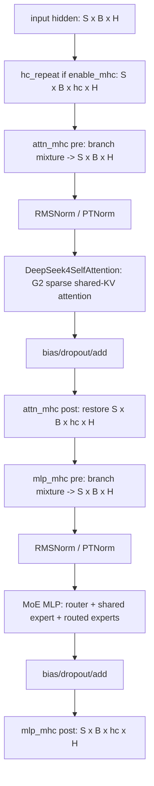
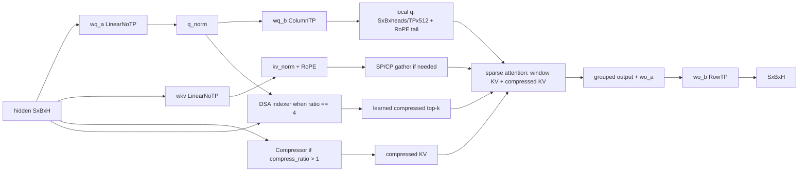
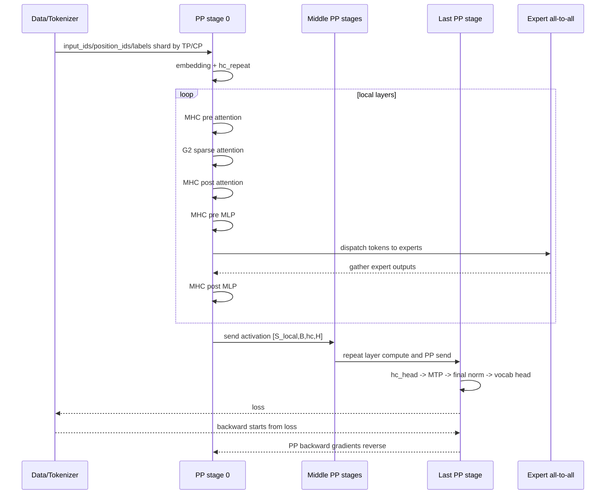

# MindSpeed-LLM DeepSeek V4 Flash/Pro 架构与 TP/PP/EP/CP 切分分析

日期：2026-05-29  
仓库：`/Users/linyi/code/Documents/code/MindSpeed-LLM`

## 结论摘要

DeepSeek V4 Flash 和 Pro 在 Hugging Face 配置上属于同一类 `DeepseekV4ForCausalLM`，主干都是 DeepSeek4 的 MoE + G2 稀疏共享 KV attention + MHC + MTP 结构。Flash 是本仓库当前明确给出训练实践脚本的版本；Pro 的模型结构参数可以按官方配置映射到同一套 `deepseek4_spec`，但本地 `examples/mcore/deepseek4_flash` 只覆盖 Flash，Pro 需要补脚本、权重转换参数和并行切分验证。

本地 README 标注 DeepSeekV4-Flash 当前是 preview：定长预训练/续训 OK，TP/PP/EP OK，CP 仍为 DOING；全参微调为 DOING。代码层面已经存在 `DeepSeek4SFTTrainer`、`DeepSeek4Model`、MTP、MHC、DSA indexer、G2 attention 等模块，因此“能否支持 Pro SFT”的核心工作不是重写模型，而是把 Pro 的 hidden/layer/expert/head/o-group/MoE FFN 等参数映射到现有模块，并重新验证 PP/VPP/MHC tensor shape、EP group 和权重转换。

## 官方结构参数对比

来源：
- Flash config: https://huggingface.co/deepseek-ai/DeepSeek-V4-Flash-Base/blob/main/config.json
- Pro config: https://huggingface.co/deepseek-ai/DeepSeek-V4-Pro-Base/blob/main/config.json
- Transformers DeepSeek-V4 文档: https://huggingface.co/docs/transformers/main/model_doc/deepseek_v4

| 项 | DeepSeek V4 Flash Base | DeepSeek V4 Pro Base | MindSpeed 参数映射 |
|---|---:|---:|---|
| architecture | `DeepseekV4ForCausalLM` | `DeepseekV4ForCausalLM` | `DeepSeek4Model` + `deepseek4_spec` |
| hidden size | 4096 | 7168 | `--hidden-size` |
| hidden layers | 43 | 61 | `--num-layers` 加 noop 对齐 PP |
| attention heads | 64 | 128 | `--num-attention-heads` |
| KV heads | 1 | 1 | 共享 KV/GQA 风格 |
| head dim | 512 | 512 | `--qk-head-dim 512` |
| RoPE head dim | 64 | 64 | `--rope-head-dim 64` / `--qk-pos-emb-head-dim 64` |
| q LoRA rank | 1024 | 1536 | `--q-lora-rank` |
| o LoRA rank | 1024 | 1024 | `--o-lora-rank` |
| output groups | 8 | 16 | `--o-groups` |
| routed experts | 256 | 384 | `--num-experts` |
| shared experts | 1 | 1 | `--moe-shared-expert-intermediate-size` |
| experts per token | 6 | 6 | `--moe-router-topk 6` |
| MoE intermediate | 2048 | 3072 | `--moe-ffn-hidden-size` |
| index heads | 64 | 64 | `--index-n-heads` |
| index head dim | 128 | 128 | `--index-head-dim` |
| index topk | 512 | 1024 | `--index-topk` |
| MHC | `hc_mult=4`, `sinkhorn_iters=20` | 同 Flash | `--enable-mhc --hc-mult 4` |
| MTP | 1 next-token-pred layer | 1 next-token-pred layer | `--mtp-num-layers 1` |
| compress ratios | 43 层列表 | 61 层列表 | `--compress-ratios ...` |
| vocab | 129280 | 129280 | `--vocab-size 129280` |
| quantization | FP8 weights, BF16 compute config | FP8 weights, BF16 compute config | 训练前通常需反量化到 BF16 |

注意：早期 DeepSeek-V3/DeepSeek2 的 MLA 参数习惯里常见 `kv_lora_rank`、`v_head_dim` 等字段；DeepSeek V4 HF 配置公开字段中核心 attention 是 `head_dim/q_lora_rank/o_lora_rank/o_groups/index_*`。MindSpeed Flash 脚本仍带 `--kv-lora-rank 512 --v-head-dim 128`，但本地 DeepSeek4 attention 实现的主路径实际直接用 `linear_kv: hidden -> head_dim`。

## MindSpeed DeepSeek4 模型拓扑

本地模型入口是 `mindspeed_llm/core/models/deepseek4/deepseek4_model.py`。训练侧 SFT trainer 会构建 `DeepSeek4Model`，并把 `deepseek4_spec.layer_spec` 和 `deepseek4_spec.mtp_spec` 注入模型。

关键代码：
- `DeepSeek4SFTTrainer.model_provider`: `mindspeed_llm/tasks/posttrain/sft/sft_trainer.py:234`
- `DeepSeek4Model`: `mindspeed_llm/core/models/deepseek4/deepseek4_model.py:43`
- layer spec / mtp spec: `mindspeed_llm/tasks/models/spec/deepseek4_spec.py:31`

每层结构可以抽象为：



最后一个 PP stage 上，如果开启 MHC，会通过 `hc_head` 把 `[S,B,hc,H]` 再聚合成 `[S,B,H]`，然后进入 MTP、final layernorm、output head。

## G2 Attention / DSA / Compressor

DeepSeek4 attention 的核心文件是 `mindspeed_llm/tasks/models/transformer/deepseek4/g2_attention.py`。

### 子模块组成

`get_deepseek4_self_attn_submodules()` 指定：

- `linear_q = LinearNoTP`：`H -> q_lora_rank`，不按 TP 切，TP 组内复制。
- `linear_kv = LinearNoTP`：`H -> head_dim`，共享 KV，不按 TP 切。
- `linear_q_up_proj = ColumnParallelLinear`：`q_lora_rank -> num_heads * head_dim`，按 TP 切 head。
- `linear_o_down_proj = ColumnParallelLinear`：相当于 `wo_a`，按 TP 切 output groups。
- `linear_o_up_proj = RowParallelLinear`：相当于 `wo_b`，聚合 TP 分片回 hidden。
- `core_attention = G2CoreAttention`。
- `dsa_indexer` 和 `compressor`：在 compress ratio 大于 1 时使用。

### 前向数据流



本地实现中的几个关键点：

1. 原始 KV 是共享的：`linear_kv` 输出 `head_dim`，不是每个 attention head 各自一份 KV。
2. query 是 per-head 的：`wq_b` 通过 Column TP 输出本 rank 的 `num_heads / TP` 个 head。
3. RoPE 只施加到 head dim 的末尾 `rope_head_dim=64` 部分。
4. 稀疏 attention 始终保留局部窗口，Flash 脚本中 `--g2-window-size 128`。
5. `compress_ratio=4` 时会构建 DSA indexer，学习从 compressed KV 中选 top-k；`compress_ratio=128` 时使用静态压缩索引。
6. `DeepSeek4MTPSelfAttention` 继承主 attention，但显式关闭 `indexer` 并把 `compress_ratio` 置为 0，所以 MTP 层不是完整 G2 压缩 attention 路径。

### Compressor

Compressor 文件：`mindspeed_llm/tasks/models/transformer/deepseek4/compressor.py`

它做的是“多 token 到一个 compressed KV”的压缩：

- `wkv: H -> head_dim`，`wgate: H -> head_dim`，均为 `LinearNoTP`。
- 按 `compress_ratio` 分块，把每个块内的 KV 按 gate softmax 加权求和。
- 当 `compress_ratio == 4` 时启用 overlap，压缩块会使用相邻 token 的重叠信息。
- 压缩后的 KV 继续做 RMSNorm 和 RoPE。
- 若开启 SP/CP，会先 gather 再做 overlap transform，最后 shard 回本 rank。

### DSA Indexer

DSA indexer 文件：`mindspeed_llm/tasks/models/transformer/dsa_indexer.py`

它不是主 attention，而是为稀疏 attention 生成索引：

- query 输入来自 attention 的低秩 `q_compressed`。
- key 可以来自原始 hidden 的投影，也可以复用 compressor 得到的 compressed KV。
- `weights_proj` 生成每个 token/head 的索引权重。
- fused 路径使用 lightning indexer；非 fused 路径会算 `bf16_index`，再 top-k。
- CP 下支持 Ulysses gather 和 KV-allgather 路径。

## MHC 模块

MHC 是 DeepSeek4 在本仓库里最容易影响 PP tensor shape 的模块。它的本地实现位于：

- `mindspeed_llm/tasks/models/transformer/deepseek4/mhc/mhc.py`
- `mindspeed_llm/features_manager/transformer/mhc_feature.py`

### MHC 做什么

开启 `--enable-mhc` 后，embedding 输出先被 `hc_repeat()` 扩展：

```text
[S, B, H] -> [S, B, hc_mult, H]
```

默认 `hc_mult=4`。每层 attention 和 MLP 外面各有一组 MHC：

- `pre`：把 `[S,B,hc,H]` flatten 成 `[S,B,hc*H]`，经过 `hc_fn` 得到 `pre/post/comb`。
- `pre` 输出：用 `pre` 权重把多分支聚合为 `[S,B,H]`，交给 attention 或 MLP 正常计算。
- `post` 输出：用 `post` 和 `comb` 把模块输出 `[S,B,H]` 与残差分支 `[S,B,hc,H]` 重新组合回 `[S,B,hc,H]`。
- 最终 `hc_head`：在最后一个 stage 上把 `[S,B,hc,H]` 聚合回 `[S,B,H]`。

MHC 的 `pre/post/comb` 来自 `hc_split_sinkhorn`：

```text
pre  : [B, S, hc]
post : [B, S, hc]
comb : [B, S, hc, hc]
```

其中 `comb` 做 Sinkhorn 归一化，起到分支间重分配/混合矩阵的作用。

### 为什么 PP 要专门适配 MHC

普通 Megatron PP stage 间传递 `[S,B,H]`。DeepSeek4 开启 MHC 后，层间真实激活是 `[S,B,hc,H]`。因此 `MHCFeature` 会 patch：

- `megatron.core.pipeline_parallel.schedules.get_tensor_shapes`
- 如果开启 VPP，还 patch `forward_backward_pipelining_with_interleaving`

`get_tensor_shapes_in_mhc()` 还会同时考虑：

- CP：`seq_length / context_parallel_size`
- SP：`seq_length / tensor_parallel_size`
- MHC：多一个 `hc_mult` 维度

最终 PP 通信 shape 是：

```text
without MHC: [S_local, B, H]
with MHC   : [S_local, B, hc_mult, H]
```

## MoE / Router / Expert 切分

DeepSeek V4 每层都是 MoE 层，Flash/Pro 的主要差异在专家数量和 FFN 中间维：

- Flash：256 routed experts，1 shared expert，top-6，MoE intermediate 2048。
- Pro：384 routed experts，1 shared expert，top-6，MoE intermediate 3072。

Flash 脚本启用的关键 MoE 参数：

```text
--moe-grouped-gemm
--moe-token-dispatcher-type alltoall
--moe-layer-freq 1
--first-k-dense-replace -1
--moe-router-topk 6
--moe-router-group-topk 1
--moe-router-num-groups 1
--moe-router-score-function sqrtsoftplus
--moe-router-enable-expert-bias
--seq-aux
--n-hash-layers 3
```

执行时序：

1. Router 对每个 token 选 top-6 expert。
2. Token dispatcher 通过 all-to-all 把 token 发到拥有对应 expert 的 rank。
3. 本地 expert 用 grouped GEMM 执行 FFN。
4. all-to-all 把 expert 输出发回 token 原 rank。
5. shared expert 路径不按 routed expert top-k 选择，它作为共享 MLP 分支参与输出。

EP 切分时 routed expert 数必须能被 EP 整除。若开启 expert tensor parallel，专家权重还会继续按 ETP 切。当前 Flash 脚本使用 `--expert-tensor-parallel-size 1`，所以每个 EP rank 拥有完整 expert 的 FFN 权重分片集合。

## TP 切分规则

TP 主要切 attention 的 per-head/up-proj/out-proj 与常规模型并行权重。DeepSeek4 attention 里需要特别注意哪些矩阵切、哪些矩阵不切：

| 模块 | Flash shape | Pro shape | TP 策略 |
|---|---:|---:|---|
| `wq_a / linear_q` | `4096 -> 1024` | `7168 -> 1536` | `LinearNoTP`，TP 内复制 |
| `wkv / linear_kv` | `4096 -> 512` | `7168 -> 512` | `LinearNoTP`，TP 内复制 |
| `wq_b / linear_q_up_proj` | `1024 -> 64*512` | `1536 -> 128*512` | Column TP，按 head 切 |
| local heads | `64 / TP` | `128 / TP` | `num_heads % TP == 0` |
| `wo_a / linear_o_down_proj` | grouped | grouped | Column TP，要求 `o_groups % TP == 0` |
| `wo_b / linear_o_up_proj` | group/rank -> hidden | group/rank -> hidden | Row TP，输入为并行张量 |
| output lm head | `H -> vocab` | `H -> vocab` | Column TP / segmented Column TP |

因此推荐约束：

- Flash：`TP` 应整除 `num_heads=64` 和 `o_groups=8`，实际建议 `TP in {1,2,4,8}`；本地 README 明确写到支持 `TP=2`。
- Pro：`TP` 应整除 `num_heads=128` 和 `o_groups=16`，实际建议 `TP in {1,2,4,8,16}`；但是否上到 16 要看单卡内存、通信拓扑和 FlashAttention/sparse kernel 支持。
- 开启 `--sequence-parallel` 后，attention 输入的序列维还会按 TP 切，DeepSeek4 attention 会在 KV/压缩 KV 需要全局视角时做 `gather_from_sp_cp()`。

## PP / VPP / DualPipeV 切分规则

### Flash 的本地基线

Flash 官方 config 是 43 层。MindSpeed Flash 脚本采用：

```text
--num-layers 44
--noop-layers 43
--pipeline-model-parallel-size 4
```

也就是把逻辑层数补到 44 层，最后一层设为 noop，便于 `PP=4` 均分，每个 PP stage 11 个逻辑层：

| PP stage | 逻辑层范围 | 真实层 |
|---:|---|---|
| 0 | 0-10 | 11 层 |
| 1 | 11-21 | 11 层 |
| 2 | 22-32 | 11 层 |
| 3 | 33-43 | 10 层 + layer 43 noop |

这是当前最稳的 Flash PP 思路。

### Pro 的 PP 补层策略

Pro 官方 config 是 61 层。为了 PP 均分，建议按目标 PP 选择 noop：

| 目标 PP | 推荐 `--num-layers` | 推荐 noop | 每 stage 层数 | 说明 |
|---:|---:|---|---:|---|
| 2 | 62 | `61` | 31 | 最少 noop，但 VPP 可选空间小 |
| 4 | 64 | `61,62,63` | 16 | 更适合常规 PP/VPP |
| 8 | 64 | `61,62,63` | 8 | 大规模训练常见，但通信更重 |

如果需要 VPP，要求：

```text
(num_layers / PP) % num_layers_per_virtual_pipeline_stage == 0
num_layers_per_virtual_pipeline_stage < num_layers / PP
```

本仓库还额外提供了 noop 检查，避免某个 PP 或 VPP stage 全是 noop。

### PP 算法适配情况

本仓库对 DeepSeek4/MHC 相关 PP 适配可以分成三类：

1. 普通 PP 1F1B：Flash 示例直接使用，MHC 通过 `get_tensor_shapes_in_mhc` 修正 stage 间 shape。
2. Interleaved PP / VPP：当设置 `--num-layers-per-virtual-pipeline-stage` 时，`MHCFeature` patch Megatron 的 interleaving schedule，支持 `[S,B,hc,H]` 激活在 VPP chunk 间传递。
3. DualPipeV：仓库存在 DualPipeV feature patch，DeepSeek4Model 也有 MTP/embedding 相关处理；但 DeepSeek4 Flash 示例没有启用 `--schedules-method dualpipev`，所以应视为代码路径存在、需要单独验证的高级 PP 策略，而不是当前 README 承诺的 Flash preview 基线。

## EP 切分规则

EP 是 MoE 的专家并行。切分对象是 routed experts，不是 shared expert，也不是 attention heads。

基本约束：

```text
num_experts % expert_model_parallel_size == 0
data_parallel_size * context_parallel_size % expert_model_parallel_size == 0
data_parallel_size = world_size / (TP * PP * CP)
```

本仓库 `parallel_state.py` 会按上述关系重建 EP group，并构造：

- tensor-and-expert group：大小 `TP * EP`
- expert group：大小 `EP`
- data-modulo-expert group：用于非 expert 参数归约

Flash 示例：

```text
world = 8 nodes * 16 NPUs = 128
TP=1, PP=4, CP=1
data_parallel_size = 128 / (1*4*1) = 32
EP=32
256 experts / 32 = 8 experts per EP rank
```

Pro 可选 EP：

| EP | Pro local experts/rank | 备注 |
|---:|---:|---|
| 24 | 16 | 专家较多，单 rank expert 负载高 |
| 32 | 12 | 容易映射到 128 卡、256 卡配置 |
| 48 | 8 | 384 experts 的自然因子 |
| 64 | 6 | 需要 DP*CP 足够大 |
| 96 | 4 | 通信压力上升 |
| 128 | 3 | 大规模拓扑下才建议 |

注意：EP 不是越大越好。Top-6 routing 下，EP 越大，all-to-all 通信越细碎；如果每个 rank 只剩少数 expert，专家 GEMM 也可能变小，吞吐不一定提升。

## CP 切分规则

CP 切的是 sequence/context 维，目标是长序列省显存和注意力计算压力。

DeepSeek4 attention 里 CP 的影响点：

1. `q_len_global = q_len * cp_size`，RoPE 和 sparse index 必须使用全局位置。
2. KV、compressed KV、DSA indexer 的 key/score 在需要全局视野时会 `gather_from_sp_cp()`。
3. `kvallgather_cp_algo` 下会对 RoPE/indices 做 `permute_cp_shard()`。
4. MHC 的 PP tensor shape 会先除以 CP，再除以 SP/TP，最后追加 `hc_mult` 维。

本地支持/限制：

- README 对 DeepSeekV4-Flash 标注 CP 为 DOING。
- MHC/DSA validation 允许 `ulysses_cp_algo` 和 `kvallgather_cp_algo`。
- Flash 脚本默认 `CP=1`，但 `CP_TYPE='ulysses_cp_algo'`。
- `kvallgather_cp_algo` 要求 causal mask，且定长 SBHD 场景下 `seq_length % (2 * CP) == 0`。

推荐：

- 4K SFT/预训练：先用 `CP=1`，避免把调试复杂度引入 Pro 适配。
- 32K/64K/128K：优先尝试 Ulysses CP；如果 sparse attention kernel 与 KV allgather 路径更匹配，再验证 `kvallgather_cp_algo`。
- CP 与 TP/SP 同开时，需要重点检查 packed/变长数据和 position_ids，因为 DeepSeek4 目前 README 仍把 pack/变长标为 DOING。

## DeepSeek V4 Pro SFT 参数落地建议

Pro 若沿用当前 Flash SFT 脚本骨架，应至少替换：

```bash
--hidden-size 7168
--ffn-hidden-size 7168
--num-attention-heads 128
--num-experts 384
--moe-ffn-hidden-size 3072
--moe-shared-expert-intermediate-size 3072
--q-lora-rank 1536
--o-lora-rank 1024
--qk-head-dim 512
--rope-head-dim 64
--qk-pos-emb-head-dim 64
--o-groups 16
--index-n-heads 64
--index-head-dim 128
--index-topk 1024
--moe-router-topk-scaling-factor 2.5
--n-hash-layers 3
--compress-ratios 128 128 4 128 ... 0  # 使用 Pro config 的 61 层列表
```

PP 方面建议：

- 如果目标是快速跑通：`PP=2, num_layers=62, noop_layers=61`。
- 如果目标是均衡吞吐：`PP=4, num_layers=64, noop_layers=61,62,63`。
- 如果要 VPP：例如 `PP=4, num_layers=64, num_layers_per_virtual_pipeline_stage=8`，每个 PP stage 两个 virtual chunks。

TP/EP 组合建议：

| 目标 | 示例 |
|---|---|
| 保守跑通 | `TP=1, PP=4, EP=32, CP=1` |
| Pro 显存更稳 | `TP=2 or 4, PP=4, EP` 按 `DP*CP` 重新选 |
| 长序列 | 先固定 TP/PP/EP，逐步加 `CP=2/4/8` |

不要直接把 Flash 的 `EP=32` 或某些 POC 脚本里的 EP 值机械套到 Pro。应先算：

```text
DP = world / (TP * PP * CP)
EP 必须整除 DP*CP
384 % EP == 0
```

## 一次训练 step 的执行过程



## 风险与验证清单

1. Flash README 明确是 preview；全参微调和 CP 仍标为 DOING，Pro 更需要实测。
2. Pro 的 `o_groups=16`，Flash 是 8；TP 适配必须重新确认 `o_groups % TP == 0`。
3. Pro 的 `moe_intermediate_size=3072`，不能沿用 Flash 的 2048。
4. Pro 官方 config 的 `index_topk=1024`，Flash 是 512；DSA indexer 显存和 top-k kernel 压力会明显更高。
5. MHC 会改变 PP activation shape；任何新 PP/VPP/DualPipeV 组合都必须先跑单 step shape/通信验证。
6. CP + packed/变长数据是高风险组合，本地 README 尚未把 pack/变长标为 OK。
7. 权重转换要同步 Pro 的 `num_layers/noop_layers/TP/PP/EP`，否则 checkpoint shard 形状会对不上。

## 源码索引

- DeepSeek4 spec: `/Users/linyi/code/Documents/code/MindSpeed-LLM/mindspeed_llm/tasks/models/spec/deepseek4_spec.py`
- DeepSeek4 model: `/Users/linyi/code/Documents/code/MindSpeed-LLM/mindspeed_llm/core/models/deepseek4/deepseek4_model.py`
- DeepSeek4 G2 attention: `/Users/linyi/code/Documents/code/MindSpeed-LLM/mindspeed_llm/tasks/models/transformer/deepseek4/g2_attention.py`
- Compressor: `/Users/linyi/code/Documents/code/MindSpeed-LLM/mindspeed_llm/tasks/models/transformer/deepseek4/compressor.py`
- DSA indexer: `/Users/linyi/code/Documents/code/MindSpeed-LLM/mindspeed_llm/tasks/models/transformer/dsa_indexer.py`
- MHC: `/Users/linyi/code/Documents/code/MindSpeed-LLM/mindspeed_llm/tasks/models/transformer/deepseek4/mhc/mhc.py`
- MHC feature patch: `/Users/linyi/code/Documents/code/MindSpeed-LLM/mindspeed_llm/features_manager/transformer/mhc_feature.py`
- Flash SFT example: `/Users/linyi/code/Documents/code/MindSpeed-LLM/examples/mcore/deepseek4_flash/tune_deepseek4_flash_4k_A3_ptd.sh`
- Flash README: `/Users/linyi/code/Documents/code/MindSpeed-LLM/examples/mcore/deepseek4_flash/README.md`
