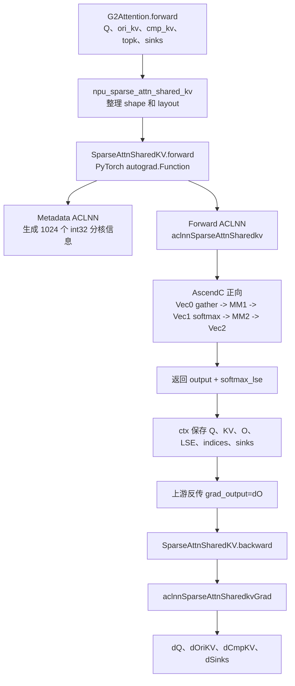
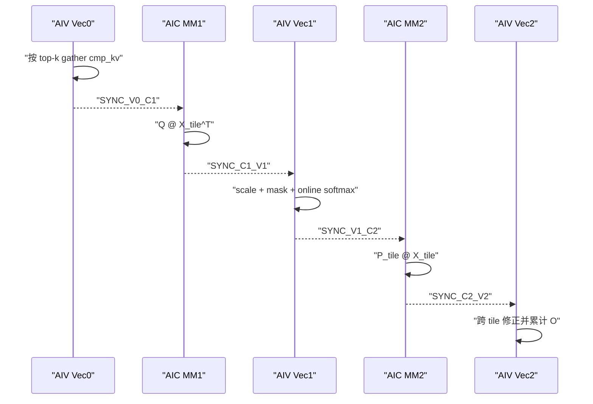
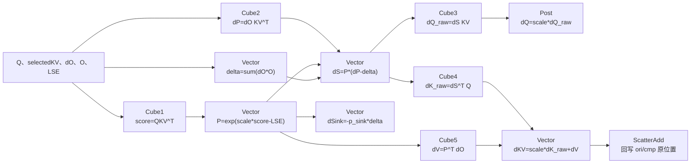

# MindSpeed-LLM DeepSeek V4 Flash 预训练 代码执行流程全面分析

## 一、启动脚本概览 (pretrain_deepseek4_flash_4k_A3_ptd.sh)

**并行策略**: `TP=2, PP=2, VPP=11, EP=64, CP=1, DP=8` (8 nodes × 16 NPUs = 128 NPUs)
**启动命令**: `torch.distributed.launch pretrain_deepseek4.py [~150 args]`

---

## 二、执行时序图（按函数调用链路展开）

```
┌────────────────────────────────────────────────────────────────────────┐
│ 1. SHELL 启动层                                                         │
│ ./pretrain_deepseek4_flash_4k_A3_ptd.sh                               │
│  ├── export HCCL_*/ACL_*/NPU_* 环境变量                                 │
│  └── python -m torch.distributed.launch pretrain_deepseek4.py --args   │
└────────────┬───────────────────────────────────────────────────────────┘
             ▼
┌────────────────────────────────────────────────────────────────────────┐
│ 2. IMPORT 层 (pretrain_deepseek4.py)                                    │
│ import mindspeed_llm.megatron_adaptor  ← 触发 adaptor 链                │
│  ├── mindspeed_llm/__init__.py:                                        │
│  │   backend = os.environ["TRAINING_BACKEND"]  → "mcore"               │
│  │   from mindspeed_llm.tasks import megatron_adaptor_v2               │
│  │                                                                      │
│  ├── tasks/megatron_adaptor_v2.py:                                     │
│  │   FeatureAdaptor.execute():                                         │
│  │   ├── FeatureAdaptor.get_mindspeed_llm_args()                       │
│  │   │   └── training/arguments.py: process_args_v2()  ← 解析150+参数   │
│  │   ├── MindSpeedFeaturesManager.init_features()                      │
│  │   │   └── features_manager/__init__.py: set_default_features_list() │
│  │   └── FeatureAdaptor.execute_adaptations()                          │
│  │       └── features_manager/*: 按序执行各 Feature.init()              │
│  └── main() 入口                                                       │
└────────────┬───────────────────────────────────────────────────────────┘
             ▼
┌────────────────────────────────────────────────────────────────────────┐
│ 3. pretrain() — training/training.py:430                              │
│  ├── initialize_megatron()           ← 分布式初始化、参数解析             │
│  ├── set_jit_fusion_options()        ← NPU JIT 融合配置                 │
│  │   └── torch_npu.npu.set_option()  ← NPU 编译选项设置                  │
│  ├── build_train_args()                                                │
│  │   ├── model_provider() → DeepSeek4Model 构建                         │
│  │   │   ├── deepseek4_spec.layer_spec  ← tasks/models/spec/            │
│  │   │   │   deepseek4_spec.py: ModuleSpec(TransformerLayer,           │
│  │   │   │   CustomTransformerLayerSubmodules(...))                     │
│  │   │   ├── DeepSeek4Model.__init__()                                 │
│  │   │   │   ├── LanguageModelEmbedding                                 │
│  │   │   │   ├── apply_g2_rotary_embedding (position_embedding_type=g2)│
│  │   │   │   ├── TransformerBlock(decoder) ← 构建 N 层 TransformerLayer │
│  │   │   │   ├── MultiTokenPredictionBlock(mtp)                        │
│  │   │   │   ├── TENorm(final_layernorm)                                │
│  │   │   │   ├── MHC(hc_head) ← 输出层 MHC                              │
│  │   │   │   └── ColumnParallelLinear(output_layer)                     │
│  │   │   └── setup_model_and_optimizer() → DDP wrap + AdamW              │
│  │   └── build_train_valid_test_data_iterators() → GPTDataset           │
│  └── train()                         ← 训练主循环                       │
└────────────┬───────────────────────────────────────────────────────────┘
             ▼
┌────────────────────────────────────────────────────────────────────────┐
│ 4. train() 主循环 — training/training.py:581                           │
│  while iteration < args.train_iters:                                   │
│    ├── update_num_microbatches()                                       │
│    └── train_step()  ← megatron.training.training.train_step           │
│        └── forward_backward_func() ← Pipeline Schedule                │
│            ├── [PP schedule 调度]  distributed-data-parallel           │
│            │   ├── forward_step() → pretrain_deepseek4.py:217          │
│            │   │   ├── get_batch() → GPTDataset                         │
│            │   │   │   ├── get_batch_on_this_tp_rank()                  │
│            │   │   │   ├── generate_mtp_batch_list() ← MTP batch 生成   │
│            │   │   │   └── get_batch_on_this_cp_rank()                  │
│            │   │   └── model.forward(tokens, positions, attn_mask)      │
│            │   ├── loss_func() → CrossEntropy + DP allreduce            │
│            │   └── backward_step() → 反向传播                            │
│            ├── optimizer.step() → 分布式 AdamW                           │
│            └── grad_norm / checkpoint save                              │
└────────────┬───────────────────────────────────────────────────────────┘
             ▼
┌────────────────────────────────────────────────────────────────────────┐
│ 5. DeepSeek4Model.forward() — core/models/deepseek4/deepseek4_model.py │
│                                                                         │
│  input_ids [S,B] + position_ids [S,B] + attention_mask [1,1,S,S]        │
│  │                                                                      │
│  ├── [PP=first stage] embedding(input_ids, position_ids)                │
│  │   ├── word_embeddings(input_ids) → [S,B,D]                          │
│  │   └── position_embeddings(position_ids) → [S,B,D]                   │
│  │                                                                      │
│  ├── [G2 RoPE] rotary_pos_emb = apply_g2_rotary_embedding()            │
│  │   └── 多分辨率 rope 压缩，生成 [compress_ratios] 对应的 freq 张量     │
│  │                                                                      │
│  ├── decoder(hidden_states, attn_mask, rotary_pos_emb)                 │
│  │   └── TransformerBlock.forward()                                    │
│  │       └── for layer in self.layers:                                 │
│  │           └── TransformerLayer.forward()            ◄── 核心!        │
│  │                                                                      │
│  ├── [MTP] mtp(hidden_states) ← MultiTokenPredictionBlock              │
│  ├── final_layernorm(hidden_states) ← TENorm (RMSNorm)                  │
│  ├── hc_head(hidden_states) ← MHC (输出投影)                            │
│  └── output_layer(hidden_states) → ColumnParallelLinear → logits       │
└────────────┬───────────────────────────────────────────────────────────┘
             ▼
┌────────────────────────────────────────────────────────────────────────┐
│ 6. TransformerLayer.forward() — core/transformer/transformer_layer.py  │
│                                                                         │
│  hidden_states [S,B,D]                                                  │
│  │                                                                      │
│  ├── [1] input_layernorm(hidden_states) ← PTNorm (fused RMSNorm)       │
│  │   └── torch_npu.npu_rms_norm()  ← CANN 融合算子                      │
│  │                                                                      │
│  ├── [2] attn_mhc(hidden_states) ← MHC Pre + Post + Sinkhorn           │
│  │   └── MHC.forward()  (详见 6a)                                      │
│  │                                                                      │
│  ├── [3] self_attention(hidden_states, attn_mask, rope)                │
│  │   └── DeepSeek4SelfAttention.forward()  (详见 6b)                    │
│  │                                                                      │
│  ├── [4] self_attn_bda ← AddOpWithBias (residual add)                  │
│  │                                                                      │
│  ├── [5] pre_mlp_layernorm(hidden_states) ← PTNorm                     │
│  │                                                                      │
│  ├── [6] mlp_mhc(hidden_states) ← MHC (同 step 2)                       │
│  │                                                                      │
│  ├── [7] mlp(hidden_states) ← MoELayer (256 experts, topk=6)           │
│  │   └── alltoall dispatch + GroupedMLP → expert compute               │
│  │                                                                      │
│  └── [8] mlp_bda ← AddOpWithBias                                      │
└────────────────────────────────────────────────────────────────────────┘
```

### 6a. MHC (Multi-Head Combining) 子流程

```
MHC.forward(x)
│
├── [Step 1] hc_fn(x) → LinearNoTP → mixes [B,S, (2+hc_mult)*hc_mult]
│
├── [Step 2] hc_split_sinkhorn_triton(mixes, hc_scale, hc_base)
│   └── HcSplitSinkhornFunction.apply() ← torch.autograd.Function
│       ├── forward:
│       │   └── hc_split_sinkhorn() → Triton Kernel (sinkhorn_triton_kernel.py)
│       │       ├── _hc_split_sinkhorn_kernel_part1: 加载 mixes 并计算 logits
│       │       ├── _hc_split_sinkhorn_kernel_part2: 做 20 轮 Sinkhorn 归一化
│       │       └── 输出: pre [BS,hc_mult], post [BS,hc_mult], comb [BS,hc_mult²]
│       └── backward:
│           └── hc_split_sinkhorn_backward() → Triton Kernel
│
├── [Step 3] MHCPostTriton.apply(x, residual, h_post, h_res)
│   └── MHCPostTriton.forward()
│       ├── hc_post_bmm1_forward(x, h_post) → Triton kernel (post_bmm1.py)
│       ├── hc_post_bmm2_forward(h_res, residual) → Triton kernel (post_bmm2.py)
│       └── add_fwd(bmm1, bmm2) → Triton kernel (add.py)
│
└── [Step 4] MhcPreBmm.apply(pre, x_unflatten)
    └── MhcPreBmm.forward()
        └── hc_pre_bmm_forward(pre, x) → Triton kernel (pre_bmm.py)
```

### 6b. DeepSeek4SelfAttention 子流程

```
DeepSeek4SelfAttention.forward(hidden_states, attn_mask, rotary_pos_emb)
│
├── [Q Proj]   linear_q(x) → q_latent [S,B,q_lora_rank]  ← LinearNoTP
├── [KV Proj]  linear_kv(x) → kv [S,B,head_dim]          ← LinearNoTP
│
├── [Q Norm]   q_layernorm(q_latent) → q_normed           ← PTNorm
├── [KV Norm]  kv_layernorm(kv) → kv_normed               ← PTNorm
│
├── [Q Up]     linear_q_up_proj(q_normed) → q [S,B,n_heads*head_dim] ← ColumnParallelLinear
│   ├── 切分为 rope/nope 两部分
│   └── apply_rotary_emb(q_rope, rotary_pos_emb)
│
├── [KV RoPE]  apply_rotary_emb(kv_rope, rotary_pos_emb)
│
├── [DSA Indexer]  dsa_indexer(q_full, kv, ...)
│   └── DSAIndexer.forward()  (详见 6c)
│
├── [Compressor]  compressor(kv, q_full, position_ids)
│   └── Compressor.forward()  (详见 6d)
│
├── [Core Attn]  core_attention(q, kv, attn_sink, topk_idxs)
│   └── G2CoreAttention.forward()
│       ├── if use_triton_sfa:
│       │   └── SparseFlashAttentionTriton.apply() ← CANN Triton kernel
│       └── else:
│           └── sparse_flash_attn() ← PyTorch matmul + softmax + topk mask
│
├── [O Down]  linear_o_down_proj(attn_output) → [S,B,o_lora_rank*n_groups]
│   └── ColumnParallelLinear
│
└── [O Up]    linear_o_up_proj(o_down) → [S,B,dim]
    └── RowParallelLinear (含 all-reduce)
```

### 6c. DSA Indexer 子流程

```
DSAIndexer.forward(q, kv_rope, kv_nope, position_ids)
│
├── [wq_b]  linear projection → q_index [S,B,n_head,index_dim]
├── [wk]    linear projection → k_index [S,B,n_head,index_dim]
│
├── [k_norm]  k_norm(k_index) ← RMSNorm
│
├── [np.abs + einsum]
│   └── weights_proj(kv) → weights [S,B,index_dim]
│
├── [Lightning Indexer]  npu_lightning_indexer(q, k, weights) ★ AscendC 算子
│   └── torch_npu.npu_lightning_indexer(           ← CANN 自定义算子
│       │   query=q, key=k, weights=weights,
│       │   topk=512, num_heads=64
│       │   )
│       └── 返回: topk_indices [S,B,K], topk_score [S,B,K]
│
├── [Fused Lightning Indexer] npu_sparse_lightning_indexer_grad_kl_loss ★ CANN
│   └── 梯度 + KL loss 融合反向
│       └── torch_npu.npu_sparse_lightning_indexer_grad_kl_loss(...)
│           (在 dsa_indexer.py:944)
│
└── [Compressor KV]  compressor(kv, q, pos_ids)
    └── 输出: compressed_kv [S,B,compressed_dim]
```

### 6d. Compressor 子流程

```
Compressor.forward(kv, q, position_ids)
│
├── [wkv]   wkv(kv) → kv_proj [B,S,coff*head_dim]   ← LinearNoTP (fp32)
├── [wgate] wgate(kv) → gate [B,S,coff*head_dim]    ← LinearNoTP (fp32)
│
├── [Overlap Transform] overlap_transform(kv_proj) / overlap_transform(gate)
│   └── 处理 sliding window overlap
│
├── [RoPE] apply_rotary_emb(kv_proj_rope, position_ids)
├── [Rotate] rotate_activation(kv_proj, rotary_pos_emb)
│
├── [Gate] gate = gate.sigmoid()
├── [Norm] norm(kv_proj * gate) ← RMSNorm
│
└── [Update] 如果训练模式: 更新 kv_state / score_state
    └── 返回: compressed_kv [B,S,head_dim]
```

---

## 三、模块/类关系图

```
                    ┌──────────────────────────┐
                    │     pretrain_deepseek4.py │
                    │  (main entry)             │
                    └─────────────┬────────────┘
                                  │ calls
                    ┌─────────────▼────────────┐
                    │ training/training.py     │
                    │ pretrain() → train()     │
                    └─────────────┬────────────┘
                                  │ orchestrates
          ┌───────────────────────┼───────────────────────┐
          ▼                       ▼                       ▼
┌─────────────────┐   ┌──────────────────┐   ┌───────────────────┐
│ initialize_      │   │ model_provider() │   │ train_valid_test  │
│ megatron()       │   │ → DeepSeek4Model │   │ _datasets_provider│
│ [Megatron Core]  │   └────────┬─────────┘   │ → GPTDataset      │
└─────────────────┘            │              └───────────────────┘
                               │
          ┌────────────────────┼────────────────────┐
          ▼                    ▼                    ▼
┌─────────────────┐  ┌─────────────────┐  ┌─────────────────┐
│ LanguageModel   │  │ TransformerBlock│  │ ColumnParallel  │
│ Embedding       │  │ (decoder)       │  │ Linear (output) │
└─────────────────┘  └────────┬────────┘  └─────────────────┘
                              │
              ┌───────────────┼───────────────┐
              ▼               ▼               ▼
    ┌─────────────────┐ ┌──────────┐ ┌──────────────────┐
    │ TransformerLayer │ │   MHC    │ │ DeepSeek4Self    │
    │ (×44 layers)     │ │ (×2/L)   │ │ Attention        │
    └────────┬─────────┘ └────┬─────┘ └────────┬─────────┘
             │                │                 │
    ┌────────┼────────┐       │     ┌──────────┼──────────┐
    ▼        ▼        ▼       ▼     ▼          ▼          ▼
┌───────┐┌──────┐┌───────┐ ┌───────┐ ┌───────┐ ┌───────┐ ┌───────┐
│PTNorm ││MoE   ││AddBias│ │Sinkhorn│ │DSA    │ │G2Core │ │Compr- │
│RMSNorm││Layer ││       │ │Triton │ │Indexer│ │Attn   │ │essor  │
└───┬───┘└──┬───┘└───────┘ └───┬───┘ └───┬───┘ └───┬───┘ └───┬───┘
    │       │                   │         │         │         │
    ▼       ▼                   ▼         ▼         ▼         ▼
┌─────────────────────────────────────────────────────────────────┐
│                    OPERATOR LAYER                                │
│  CANN AscendC │ Triton Kernels │ torch_npu Fused │ PyTorch Ops │
└─────────────────────────────────────────────────────────────────┘
```

---

## 四、算子执行列表

### A. Triton 算子（CANNTriton，运行在 Ascend NPU 上）

| # | 算子名称 | 文件位置 (MindSpeed-LLM) | 功能描述 | 调用入口 |
|---|---------|------------------------|---------|---------|
| 1 | `_hc_split_sinkhorn_kernel_part1` | `mindspeed_llm/tasks/models/transformer/deepseek4/mhc/sinkhorn_triton_kernel.py:11` | HC-Split Sinkhorn 归一化 Part1: 计算 logits 和逐元素操作 | `hc_split_sinkhorn()` → `hc_split_sinkhorn_triton()` |
| 2 | `_hc_split_sinkhorn_kernel_part2` | `mindspeed_llm/tasks/models/transformer/deepseek4/mhc/sinkhorn_triton_kernel.py:100+` | HC-Split Sinkhorn 归一化 Part2: 20 轮迭代归一化 | 同上 |
| 3 | `hc_pre_bmm_fwd_kernel` | `mindspeed_llm/tasks/models/transformer/deepseek4/mhc/pre_bmm.py:14` | MHC Pre-BMM 前向: H × X → Y (批量矩阵乘法) | `MhcPreBmm.apply()` → `hc_pre_bmm_forward()` |
| 4 | `hc_pre_bmm_bwd_fused_kernel` | `mindspeed_llm/tasks/models/transformer/deepseek4/mhc/pre_bmm.py:53` | MHC Pre-BMM 反向: dY×H, dY×X (融合梯度计算) | `MhcPreBmm.backward()` |
| 5 | `hc_post_bmm1_fwd_kernel` | `mindspeed_llm/tasks/models/transformer/deepseek4/mhc/post_bmm1.py:14` | MHC Post-BMM1 前向: H_post × X → Y | `MHCPostTriton.apply()` → `hc_post_bmm1_forward()` |
| 6 | `hc_post_bmm1_bwd_kernel` | `mindspeed_llm/tasks/models/transformer/deepseek4/mhc/post_bmm1.py:60+` | MHC Post-BMM1 反向 | 同上 backward |
| 7 | `hc_post_bmm2_fwd_kernel` | `mindspeed_llm/tasks/models/transformer/deepseek4/mhc/post_bmm2.py:14` | MHC Post-BMM2 前向: H_res × R → Y | `MHCPostTriton.apply()` → `hc_post_bmm2_forward()` |
| 8 | `hc_post_bmm2_bwd_kernel` | `mindspeed_llm/tasks/models/transformer/deepseek4/mhc/post_bmm2.py:60+` | MHC Post-BMM2 反向 | 同上 backward |
| 9 | `_rmsnorm_without_weight_kernel` | `mindspeed_llm/tasks/models/transformer/deepseek4/rmsnorm_without_weight_triton_kernel.py:8` | 无权重 RMSNorm scaling factor 前向 | `rmsnorm_without_weight_triton()` |
| 10 | `_rmsnorm_without_weight_backward_kernel` | `mindspeed_llm/tasks/models/transformer/deepseek4/rmsnorm_without_weight_triton_kernel.py:56` | 无权重 RMSNorm scaling factor 反向梯度 | `rmsnorm_without_weight_backward()` |
| 11 | `SparseFlashAttentionTriton` | `mindspeed_llm/tasks/models/transformer/deepseek4/g2_attention.py:20-80` | G2 稀疏 Flash Attention (Triton 实现) | `G2CoreAttention` via `--use-triton-sfa` |
| 12 | `layernorm_gated` Triton | `mindspeed_llm/ops/triton/layernorm_gated.py` | Gated LayerNorm Triton 融合 | 通用 Triton 算子库 |

### B. AscendC/CANN 自定义算子（mindspeed.ops 包，对应 CANN 代码仓）

| # | 算子名称 | 调用位置 (MindSpeed-LLM) | CANN API | 算子类型 | 功能描述 |
|---|---------|------------------------|---------|---------|---------|
| 1 | **npu_lightning_indexer** | `dsa_indexer.py:792,1036` | `torch_npu.npu_lightning_indexer(query, key, weights, topk, ...)` | AscendC | DSA Indexer: 利用 Query×Key 交互选出 Top-K token pair |
| 1b | 同上 (mindspeed包装) | `dsa_indexer.py:824,1290` | `mindspeed.ops.npu_lightning_indexer.npu_lightning_indexer(...)` | AscendC | 同上，mindspeed 封装版本 |
| 2 | **npu_sparse_lightning_indexer_grad_kl_loss** | `dsa_indexer.py:944` | `torch_npu.npu_sparse_lightning_indexer_grad_kl_loss(...)` | AscendC | 融合反向: Lightning Indexer 梯度 + KL 散度 loss |
| 2b | 同上 (mindspeed包装) | `g2_attention.py:428`, `dsa_indexer.py:1360` | `mindspeed.ops.npu_sparse_lightning_indexer_grad_kl_loss.npu_sparse_lightning_indexer_grad_kl_loss(...)` | AscendC | 同上，在 attention 层调用融合 loss 计算 |

**CANN 代码仓位置**: `https://gitcode.com/cann` 下的 `mindspeed` 或 `torch_npu` 子项目，算子的 AscendC 实现通常在：
- `mindspeed/ops/npu_lightning_indexer.cpp` (算子注册)
- `mindspeed/ops/npu_lightning_indexer_kernel.cc` (AscendC kernel 实现)
- `mindspeed/ops/npu_sparse_lightning_indexer_grad_kl_loss.cpp/cc` (梯度+loss融合算子)

### C. torch_npu 融合算子（CANN Runtime 提供）

| # | 算子名称 | 调用位置 | API 接口 | 功能描述 |
|---|---------|---------|---------|---------|
| 1 | **npu_rms_norm** | `PTNorm.forward()` | `torch_npu.npu_rms_norm(x, gamma, eps)` | 融合 RMSNorm 前向 |
| 2 | **npu_fused_rotary_pos_emb** | RoPE forward | `torch_npu.npu_fused_rotary_pos_emb(...)` | 融合 RoPE 位置编码 |
| 3 | **npu_swiglu** | MLP forward | `torch_npu.npu_swiglu(...)` | 融合 SwiGLU 激活函数 |
| 4 | **npu_fusion_attention** | FlashAttention | `torch_npu.npu_fusion_attention(...)` | 昇腾融合 Flash Attention |
| 5 | **npu_fused_ring_attention_update** | Ring CP forward | `torch_npu.npu_fused_ring_attention_update(...)` | Ring Attention 融合 |
| 6 | **npu_grouped_matmul** | MoE experts | `torch_npu.npu_grouped_matmul(...)` | MoE Expert 分组 GEMM |
| 7 | **npu_moe_permute** | MoE dispatch | `torch_npu.npu_moe_permute(...)` | MoE Token 排列/重排 |
| 8 | **npu_alltoall** (HCCL) | MoE alltoall | `torch.distributed.all_to_all_single(...)` (走 HCCL 后端) | MoE 全交换通信 |

### D. MindSpeed 核心融合算子（C++ 扩展，setup.py 编译）

| # | 算子名称 | 文件位置 | 功能描述 |
|---|---------|---------|---------|
| 1 | **ascendspeed_te_ops** | `mindspeed_llm/te/ops/csrc/*.cpp` + `cann/*.cpp` | Transformer Engine 自定义算子集（编译为 `ascendspeed_te_ops.so`） |

### E. 标准 PyTorch 算子（走 NPU 后端）

| # | 算子 | 调用上下文 |
|---|------|----------|
| 1 | `torch.matmul` / `F.linear` | LinearNoTP, ColumnParallelLinear, RowParallelLinear (GEMM) |
| 2 | `F.softmax` / `F.log_softmax` | Attention softmax, CrossEntropy loss |
| 3 | `F.relu` / `F.silu` | 激活函数 |
| 4 | `torch.nn.functional.cross_entropy` | Loss 计算 |
| 5 | `torch.cat` / `rearrange` (einops) | 张量重塑/拼接 |
| 6 | `all_reduce` / `all_gather` / `reduce_scatter` (HCCL) | 分布式通信（DP/TP/EP 同步） |
| 7 | `torch.optim.AdamW` | 优化器权重更新 |

---

## 五、关键执行路径汇总

```
Shell → torch.distributed.launch → pretrain_deepseek4.py:main()
  → import megatron_adaptor_v2 (Feature system init)
  → training.pretrain(dataset_provider, model_provider, ModelType, forward_step)
    → initialize_megatron()
    → build_train_args()
      → model_provider()
        → deepseek4_spec.layer_spec (ModuleSpec 定义)
        → DeepSeek4Model.__init__()
          → 每层: MHC(Pre) → RMSNorm → DeepSeek4SelfAttention → MHC(Post)
            → DSA Indexer (AscendC) → Compressor → G2CoreAttention (Triton/PyTorch)
            → MoELayer (256 experts, topk=6, alltoall+GroupedMLP)
          → MTP Block → Final Norm → MHC Head → Output Linear
      → DDP wrap → AdamW optimizer
    → train() loop:
      → train_step() → pipeline schedule → forward_step()
        → get_batch() → DeepSeek4Model.forward()
          → Embedding → TransformerBlock(×44) → MTP → Output
        → loss_func() → backward() → optimizer.step()
      → save_checkpoint()
```

---

## 六、从 shell 参数到算子的映射速查

| Shell 参数 | 对应代码模块 | 核心算子 |
|-----------|------------|---------|
| `--use-triton-sinkhorn` | `mhc/sinkhorn.py` | `_hc_split_sinkhorn_kernel` (Triton) |
| `--use-triton-mhc` | `mhc/mhc_triton.py` | `hc_pre_bmm/post_bmm1/post_bmm2` (Triton) |
| `--use-triton-rmsnorm-without-weight` | `rmsnorm_without_weight.py` | `_rmsnorm_without_weight_kernel` (Triton) |
| `--use-triton-sfa` | `g2_attention.py` | `SparseFlashAttentionTriton` (Triton) |
| `--enable-dsa-indexer` | `dsa_indexer.py` | `npu_lightning_indexer` (AscendC) |
| `--use-fused-lightning-indexer-loss` | `dsa_indexer.py:944` | `npu_sparse_lightning_indexer_grad_kl_loss` (AscendC) |
| `--multi-latent-attention` | `g2_attention.py` | MLA Q/KV low-rank 投影 |
| `--use-g2-attention` | `g2_attention_kernel.py` | G2 Sparse Flash Attention |
| `--moe-grouped-gemm` | `megatron.core` MoE | `npu_grouped_matmul` (CANN) |
| `--moe-permutation-async-comm` | `megatron.core` MoE | `npu_moe_permute` + HCCL alltoall |
| `--use-fused-rmsnorm` | PTNorm | `torch_npu.npu_rms_norm` (CANN) |
| `--use-fused-swiglu` | MLP | `torch_npu.npu_swiglu` (CANN) |
| `--use-fused-rotary-pos-emb` | RoPE | `torch_npu.npu_fused_rotary_pos_emb` (CANN) |
| `--enable-mhc` | `mhc/mhc.py` | MHC Sinkhorn + Triton BMM 全套 |

---

## 七、跨代码仓 AscendC 算子调用链与源码分析

### 7.0 代码仓拓扑

```
/Users/linyi/code/Documents/code/
├── MindSpeed-LLM/        ← 训练框架（Python 调用方）
│   └── mindspeed_llm/tasks/models/transformer/deepseek4/
│       ├── dsa_indexer.py        ← Lightning Indexer 调用
│       ├── g2_attention.py        ← Sparse LI Grad KL Loss 调用
│       └── mhc/sinkhorn.py       ← MHC Sinkhorn (Triton，非 AscendC)
│
├── MindSpeed/            ← 算子 Python Bridge + C++ 胶水层
│   └── mindspeed/
│       ├── ops/npu_lightning_indexer.py                    ← Python → C++ bridge
│       ├── ops/npu_sparse_lightning_indexer_grad_kl_loss.py← Python → C++ bridge
│       ├── op_builder/npu_lightning_indexer_builder.py     ← JIT 编译配置
│       ├── op_builder/npu_sparse_lightning_indexer_grad_kl_loss_builder.py
│       └── ops/csrc/cann/
│           ├── npu_lightning_indexer.cpp                    ← C++ 扩展 (torch→ACLNN)
│           └── npu_sparse_lightning_indexer_grad_kl_loss.cpp
│
└── ops-transformer/      ← AscendC 算子实现（Host API + Device Kernel）
    ├── attention/lightning_indexer/
    │   ├── op_host/op_api/aclnn_lightning_indexer.cpp      ← ACLNN Host 封装
    │   ├── op_kernel/lightning_indexer.cpp                  ← Kernel 入口 + 分发
    │   ├── op_kernel/arch35/lightning_indexer_kernel.h      ← arch35 AscendC 设备端
    │   ├── op_kernel/arch35/lightning_indexer_service_cube.h ← Cube 单元 matmul
    │   └── op_kernel/arch35/lightning_indexer_service_vector.h ← Vector 单元 topk
    │
    ├── attention/sparse_lightning_indexer_grad_kl_loss/
    │   ├── op_kernel/sparse_lightning_indexer_grad_kl_loss.cpp ← Kernel 入口
    │   ├── op_kernel/arch35/sparse_lightning_indexer_grad_kl_loss_kernel_base.h
    │   └── op_kernel/arch35/sparse_lightning_indexer_grad_kl_loss_cube_block.h
    │
    └── mhc/              ← MHC AscendC 算子（备用实现，当前用 Triton）
        ├── mhc_pre/op_kernel/arch35/       ← MHC Pre-BMM AscendC 实现
        ├── mhc_post/op_kernel/arch35/      ← MHC Post-BMM AscendC 实现
        ├── mhc_sinkhorn/op_kernel/arch35/  ← MHC Sinkhorn AscendC 实现
        ├── mhc_pre_sinkhorn/op_kernel/arch35/ ← Pre-Sinkhorn 实现
        └── mhc_sinkhorn_backward/op_kernel/arch35/ ← Sinkhorn 反向
```

### 7.1 完整调用链：Python → ACLNN → AscendC

以 `npu_lightning_indexer` 为例，一根到底的调用链：

```
Step 1: Python 训练层 (MindSpeed-LLM)
  dsa_indexer.py:792
  └── torch_npu.npu_lightning_indexer(query, key, weights, ...)

Step 2: Python Bridge (MindSpeed)
  ops/npu_lightning_indexer.py:15
  └── op.npu_lightning_indexer(query, key, weights, ...)
      op = op_builder.load()  ← JIT 编译/加载 .so

Step 3: JIT Builder (MindSpeed)
  op_builder/npu_lightning_indexer_builder.py:17
  └── sources() → ['ops/csrc/cann/npu_lightning_indexer.cpp']
      编译为 TORCH_EXTENSION_NAME=npu_lightning_indexer 的 .so

Step 4: C++ Extension (MindSpeed)
  ops/csrc/cann/npu_lightning_indexer.cpp:75
  └── ACLNN_CMD(aclnnLightningIndexer, query, key, weights, ...)
      ↓ 调用 ACLNN Host API

Step 5: ACLNN Host API (ops-transformer)
  attention/lightning_indexer/op_host/op_api/aclnn_lightning_indexer.cpp
  └── aclnnLightningIndexerGetWorkspaceSize()  ← 计算 workspace
  └── aclnnInnerLightningIndexer()             ← 下发 Kernel

Step 6: AscendC Device Kernel (ops-transformer)
  attention/lightning_indexer/op_kernel/lightning_indexer.cpp:40
  └── __global__ __aicore__ void lightning_indexer(...)
      ├── arch22: LightningIndexerKernel  ← Da Vinci 架构
      └── arch35: LightningIndexerKernel  ← AIC/AIV 混合架构
```

### 7.2 Lightning Indexer AscendC Kernel 源码剖析

**功能**：对 Query×Key 交互结果做加权 Top-K 选择，选出注意力计算中最强关联的 token pair。

#### 7.2.1 Kernel 入口 (lightning_indexer.cpp:40-66)

```cpp
// 模板参数决定数据类型、布局、page attention 模式
template <int DT_Q, int DT_K, int DT_OUT, int PAGE_ATTENTION,
          int LAYOUT_T, int K_LAYOUT_T, int DT_W_FLAG>
__global__ __aicore__ void lightning_indexer(
    __gm__ uint8_t *query,    // Query 张量 [B,S1,N,D] / [T,N,D]
    __gm__ uint8_t *key,      // Key 张量   [B,S2,N,D] / [T,N,D]
    __gm__ uint8_t *weights,  // 加权系数
    __gm__ uint8_t *actualSeqLengthsQ, // 变长序列 Q 的累积长度
    __gm__ uint8_t *actualSeqLengthsK, // 变长序列 K 的累积长度
    __gm__ uint8_t *blocktable,       // Page Attention BlockTable
    __gm__ uint8_t *sparseIndices,  // 输出: TopK token pair 索引 [B,S,N,K]
    __gm__ uint8_t *sparseValues,   // 输出: TopK attention scores
    __gm__ uint8_t *workspace,
    __gm__ uint8_t *tiling)
```

**模板参数含义**：
| 参数 | 取值 | 含义 |
|------|------|------|
| `DT_Q/DT_K` | `DT_FLOAT16 / DT_BF16` | Query/Key 数据类型 |
| `DT_OUT` | `DT_INT32` | 输出索引类型（int32） |
| `PAGE_ATTENTION` | 0/1 | 是否启用 Page Attention 模式 |
| `LAYOUT_T` | BSND/TND | 输入张量布局格式 |
| `DT_W_FLAG` | 0/1 | Weights 是否使用 fp32 |
| `K_LAYOUT_T` | BSND/TND | Key 张量布局格式 |

#### 7.2.2 计算流程 (arch35/lightning_indexer_kernel.h)

Kernel 核心是 `LightningIndexerKernel::Process()`，分为 Cube 和 Vector 两个流水线阶段：

```
Process() 计算流水线:
│
├── [Cube 阶段] LightningIndexerServiceCube
│   ├── ComputeMm1()  ← MatMul: Query [M,D] × Key^T [D,S2]
│   │   ├── M_BASIC_BLOCK=256, D_BASIC_BLOCK=128, S2_BASIC_BLOCK=128
│   │   ├── LoadKeyToL0b()    ← Key 从 GM→L1→L0B (3 buffer 乒乓)
│   │   ├── LoadQueryToL0a()  ← Query 从 GM→L1→L0A (2 buffer 乒乓)
│   │   ├── ComputeL0c()      ← L0A×L0B→L0C (Cube 单元 matmul)
│   │   └── Fixp()            ← L0C→L1 (fixpipe 搬移)
│   │   输出: scores [M, S2]  ← Query×Key^T 的注意力得分
│   │
│   └── [流水线] 5 buffer MatMul pipeline:
│        Key(3 buf) + Query(2 buf) → 乒乓预取 + 计算overlap
│        EVENT_ID 驱动: MTE1→MTE2→Cube→Fixpipe
│
├── [Vector 阶段] LightningIndexerServiceVector
│   ├── ProcessVec1()  ← Vector 单元处理
│   │   ├── 加载 cube 输出的 scores → UB
│   │   ├── 可选: 减去最大值稳定数值
│   │   └── scores × weights → weighted_scores (如果有权重)
│   │
│   └── ProcessTopK()  ← Vector 单元 TopK 选择
│       ├── vf_topk.h: 从 S2 维度选 topk=512 个最大值
│       ├── 记录 topk_indices [M, K]  (int32)
│       ├── 记录 topk_values  [M, K]  (fp16/bf16)
│       └── 写入 GM: sparseIndices, sparseValues
│
└── [Multi-Core 并行]
    ├── BS 维度切分: 每个 core 处理 batch×seq 的子集
    ├── S1 方向按 M_BASIC_SIZE=256 循环
    ├── S2 方向按 S2_BASIC_SIZE=128 循环
    └── CrossCore 同步: CrossCoreSetFlag + CrossCoreWaitFlag
```

**关键数据结构**：
```cpp
struct RunInfo {
    uint32_t bIdx;        // batch 索引
    uint32_t n2Idx;       // key head 索引
    uint32_t gS1Idx;      // group S1 索引
    uint32_t s2LoopEnd;   // S2 循环终止位置
    uint32_t actS1Size;   // 实际 S1 长度（变长序列）
    uint32_t actS2Size;   // 实际 S2 长度
};

struct ConstInfo {
    uint64_t queryGmBase;    // Query GM 基地址
    uint64_t keyGmBase;      // Key GM 基地址
    uint32_t numHeads;       // 注意力头数
    uint32_t headDim;        // 每头维度 D=128
    uint32_t sparseCount;    // TopK 数量 K=512
    uint32_t preTokens;      // 前向可见 token 数
    uint32_t nextTokens;     // 后向可见 token 数
    uint32_t cmpRatio;       // 压缩比
};
```

### 7.3 Sparse Lightning Indexer Grad KL Loss 算子剖析

**功能**：融合反向传播——同时计算 Lightning Indexer 的梯度（d_query_index, d_key_index, d_weights）和 KL 散度 loss。

#### C++ Extension 层 (npu_sparse_lightning_indexer_grad_kl_loss.cpp)

```cpp
// MindSpeed 中 C++ bridge 调用 ACLNN
ACLNN_CMD(
    aclnnSparseLightningIndexerGradKLLoss,
    query, key, query_index, key_index, weights,
    sparse_indices, softmax_max, softmax_sum,
    query_rope, key_rope,           // ← MLA 架构的 RoPE 信息
    actual_seq_qlen, actual_seq_klen,
    scale_value, layout_ptr, sparse_mode,
    pre_tokens, next_tokens, deterministic,
    cmp_ratio,
    d_query_index, d_key_index, d_weights, loss  // ← 输出 4 个 tensor
);
```

#### Kernel 入口 (sparse_lightning_indexer_grad_kl_loss.cpp:59-100)

```cpp
// 多维度模板特化，支持不同精度和布局组合
template< bool HasRope, int TopKRange, int LayoutT_QT,
          int LayoutT_KT, int SparseMode, bool Deterministic>
__global__ __aicore__ void sparse_lightning_indexer_grad_kl_loss(
    __gm__ uint8_t *query,           // [B,N,S,D] 注意力 Query
    __gm__ uint8_t *key,             // [B,N,S,D] 注意力 Key
    __gm__ uint8_t *queryIndex,      // Indexer 的 Query 输入
    __gm__ uint8_t *keyIndex,        // Indexer 的 Key 输入
    __gm__ uint8_t *weight,          // Indexer 权重
    __gm__ uint8_t *sparseIndices,   // 从 LI forward 来的 topk 索引
    __gm__ uint8_t *softmaxMax,     // Attention softmax max 值
    __gm__ uint8_t *softmaxMum,     // Attention softmax sum 值
    __gm__ uint8_t* queryRope,      // RoPE 后的 Query (MLA)
    __gm__ uint8_t* keyRope,        // RoPE 后的 Key (MLA)
    __gm__ uint8_t *dQueryIndex,    // 输出: queryIndex 梯度
    __gm__ uint8_t *dKeyIndex,      // 输出: keyIndex 梯度
    __gm__ uint8_t *dWeight,        // 输出: weight 梯度
    __gm__ uint8_t *loss)           // 输出: KL loss 标量
```

**架构分派**：
```
__CCE_AICORE__ == 310 (arch35, 昇腾 910B/950):
  ├── Cube Block: SparseLightningIndexerGradKLLossKernelBase
  │   └── arch35/sparse_lightning_indexer_grad_kl_loss_cube_block.h
  │   └── arch35/sparse_lightning_indexer_grad_kl_loss_vector_block.h
  └── Vector Block (VF 子模块):
      └── arch35/vf/vf_process_vec0~6.h

__CCE_AICORE__ != 310 (arch22, 昇腾 910A):
  └── arch22/sparse_lightning_indexer_grad_kl_loss_base.h
```

**计算步骤**（融合 4 路输出）：
```
1. 根据 sparse_indices 还原 attention 的稀疏 pattern
2. 计算 d_query_index = ∂loss/∂(queryIndex)
   → 通过 chain rule: loss → attention grad → indexer forward grad
3. 计算 d_key_index = ∂loss/∂(keyIndex)  (同上)
4. 计算 d_weights = ∂loss/∂(weights)       (同上)
5. 计算 KL loss = sum(softmax_sum - log_softmax * target_distr)
   → 使用 softmaxMax/softmaxMum 避免重复计算 softmax
6. 可选: RoPE 支路梯度传播 (MLA 架构专用)
```

### 7.4 ACLNN Host API 层

以 Lightning Indexer 为例，Host 侧负责 tiling 参数计算和 workspace 分配：

**aclnn_lightning_indexer.cpp (ops-transformer)**：
```cpp
// 1. GetWorkspaceSize: 计算 Kernel 需要的工作空间大小
aclnnStatus aclnnLightningIndexerGetWorkspaceSize(
    const aclTensor *query, ..., uint64_t *workspaceSize,
    aclOpExecutor **executor)

// 2. 实际下发: 将 kernel 提交到 Ascend 硬件队列
aclnnStatus aclnnInnerLightningIndexer(
    void *workspace, uint64_t workspaceSize,
    aclOpExecutor *executor, const aclrtStream stream)
```

**Tiling 计算**（Host 侧推理 shape 和切分策略）：
- 输入 shape: `query [B,S,N,D]`, `key [B,S2,N,D]`
- 计算每个 core 负责的 M(seq_len)×S2(key_len) 块大小
- 确定是否需要跨 core 同步
- 输出 sparse_indices shape: `[B,S,N,sparse_count]`

### 7.5 MindSpeed JIT Builder 机制

算子通过 JIT 编译，不是预编译库：

```python
# npu_lightning_indexer_builder.py
class NPULightningIndexerOpBuilder(MindSpeedOpBuilder):
    OP_NAME = "npu_lightning_indexer"

    def sources(self):
        return ['ops/csrc/cann/npu_lightning_indexer.cpp']

    # 首次调用时:
    #   1. torch.utils.cpp_extension.load() → 编译 .cpp → .so
    #   2. 加载 .so → 导出 PYBIND11_MODULE 中的函数
    # 后续调用:
    #   直接调用已加载的函数指针
```

**编译依赖**：
- `ASCEND_TOOLKIT_HOME` 环境变量 → 链接 CANN 头文件和 ACLNN 库
- `torch_npu` 包路径 → 链接 `torch_npu/csrc/framework/utils/OpAdapter.h`
- `inc/aclnn_common.h` → `ACLNN_CMD()` 宏封装

### 7.6 MHC AscendC 算子（ops-transformer 备用实现）

当前 DeepSeek V4 使用 **Triton** 实现 MHC（见 `mindspeed_llm/tasks/models/transformer/deepseek4/mhc/` 下的 `pre_bmm.py`, `post_bmm1.py`, `post_bmm2.py`, `sinkhorn_triton_kernel.py`），但 ops-transformer 中有完整的 **AscendC 版本**：

| MHC 算子 | ops-transformer 位置 | AscendC Kernel 文件 | 对应 Triton 位置 |
|---------|---------------------|-------------------|-----------------|
| `mhc_pre` | `mhc/mhc_pre/` | `op_kernel/arch35/mhc_pre_kernel_base.h` | `pre_bmm.py` |
| `mhc_post` | `mhc/mhc_post/` | `op_kernel/arch35/mhc_post.h` | `post_bmm1.py + post_bmm2.py` |
| `mhc_sinkhorn` | `mhc/mhc_sinkhorn/` | `op_kernel/arch35/mhc_sinkhorn.h` | `sinkhorn_triton_kernel.py` |
| `mhc_pre_sinkhorn` | `mhc/mhc_pre_sinkhorn/` | `op_kernel/arch35/mhc_pre_sinkhorn_cube_compute_arch35.h` | `sinkhorn_triton_kernel.py` (Part1) |
| `mhc_pre_backward` | `mhc/mhc_pre_backward/` | `op_kernel/arch35/mhc_pre_backward_kernel.h` | `pre_bmm.py` (bwd) |
| `mhc_post_backward` | `mhc/mhc_post_backward/` | `op_kernel/arch35/mhc_post_backward_kernel.h` | `post_bmm1.py + post_bmm2.py` (bwd) |
| `mhc_sinkhorn_backward` | `mhc/mhc_sinkhorn_backward/` | `op_kernel/arch35/mhc_sinkhorn_backward_simd.h` | `sinkhorn_triton_kernel.py` (bwd) |
| `mhc_pre_sinkhorn_backward` | `mhc/mhc_pre_sinkhorn_backward/` | `op_kernel/arch35/mhc_pre_sinkhorn_backward_one_stage.h` | 同上 |

**MHC AscendC 算子结构**（以 mhc_sinkhorn 为例）：

```
mhc_sinkhorn/
├── op_host/
│   ├── op_api/
│   │   ├── aclnn_mhc_sinkhorn.cpp/h   ← ACLNN API 注册
│   │   └── mhc_sinkhorn.cpp/h         ← 算子参数封装
│   ├── mhc_sinkhorn_def.cpp           ← 算子定义（输入输出描述）
│   ├── mhc_sinkhorn_infershape.cpp    ← 输出 shape 推理
│   ├── mhc_sinkhorn_tiling.cpp/h      ← Tiling 策略（Host→Device）
│   └── op_tiling/                      ← 架构特定 tiling
├── op_kernel/
│   ├── mhc_sinkhorn_apt.cpp           ← Adaptor（适配不同 DTYPE）
│   └── arch35/
│       ├── mhc_sinkhorn.h             ← AscendC 设备端主 kernel
│       ├── mhc_sinkhorn_struct.h      ← 数据结构定义
│       └── mhc_sinkhorn_tiling_key.h  ← Tiling key 定义
├── op_graph/
│   └── mhc_sinkhorn_proto.h           ← 图 IR 定义
├── examples/
│   └── test_aclnn_mhc_sinkhorn.cpp     ← 单算子测试
└── test/                               ← 单元测试
```

**MHC Sinkhorn AscendC kernel 核心逻辑** (`mhc_sinkhorn.h`):
```
输入: mixes [BS, feat_dim], hc_scale [3], hc_base [(2+hc_mult)*hc_mult]
处理:
  1. 将 mixes 按 feat_dim 拆分为 pre/post/comb 三路
  2. pre = scale_pre * mixes_pre + base_pre  → 逐元素
  3. post = scale_post * mixes_post + base_post
  4. comb = scale_comb * (mixes_comb + base_comb) → 矩阵 reshape
  5. 20 轮 Sinkhorn 迭代归一化:
     comb = softmax(comb/eps, dim=-1) 交替行/列归一化
输出: pre [BS,hc_mult], post [BS,hc_mult], comb [BS,hc_mult²]
```

### 7.7 两层实现的对应关系总结

| 层级 | Lightning Indexer | Sparse LI Grad KL Loss | MHC (当前用 Triton) |
|------|------------------|----------------------|-------------------|
| **MindSpeed-LLM 调用** | `dsa_indexer.py:792` | `dsa_indexer.py:944` / `g2_attention.py:428` | `mhc/mhc.py` → `sinkhorn.py` |
| **MindSpeed Python Bridge** | `ops/npu_lightning_indexer.py` | `ops/npu_sparse_lightning_indexer_grad_kl_loss.py` | N/A (Triton 直接调用) |
| **MindSpeed C++ Bridge** | `ops/csrc/cann/npu_lightning_indexer.cpp` | `ops/csrc/cann/npu_sparse_lightning_indexer_grad_kl_loss.cpp` | N/A |
| **ACLNN Host API** | `op_host/op_api/aclnn_lightning_indexer.cpp` | `op_host/sparse_lightning_indexer_grad_kl_loss_*.cpp` | `mhc/*/op_host/op_api/aclnn_mhc_*.cpp` |
| **AscendC Kernel** | `op_kernel/arch35/lightning_indexer_kernel.h` | `op_kernel/arch35/*_kernel_base.h` | `mhc/*/op_kernel/arch35/*.h` |
| **计算单元** | Cube(MatMul) + Vector(TopK) | Cube + Vector (融合梯度+loss) | Vector (Sinkhorn) + Cube (BMM) |

### 7.8 CANN 昇腾推理/训练 API 速查

| API 层级 | 作用 | 示例 |
|---------|------|------|
| **torch_npu** | PyTorch 原生 API 包装 | `torch_npu.npu_lightning_indexer()` |
| **mindspeed.ops** | MindSpeed 包装的算子 | `mindspeed.ops.npu_lightning_indexer.npu_lightning_indexer()` |
| **MindSpeedOpBuilder** | JIT 编译 C++ 扩展为 .so | `op_builder.load()` → pybind11 模块 |
| **ACLNN_CMD** | C++ 宏：调用 ACLNN Host API | `ACLNN_CMD(aclnnLightningIndexer, ...)` |
| **aclnn*GetWorkspaceSize** | 计算算子工作空间 | `aclnnLightningIndexerGetWorkspaceSize()` |
| **aclnnInner*** | 下发 Kernel 到 NPU Stream | `aclnnInnerLightningIndexer(workspace, executor, stream)` |
| **__global__ __aicore__** | AscendC 设备端 Kernel 入口 | `lightning_indexer` 函数 |
| **KERNEL_TASK_TYPE_DEFAULT** | 寄存器 AIC/AIV 核类型 | `KERNEL_TYPE_MIX_AIC_1_2` |
| **AscendC MatMul API** | Cube 单元矩阵乘 | `matmul::Matmul<...>` |
| **AscendC Vector API** | Vector 单元逐元素操作 | `AscendC::Add/Mul/Relu/...` |
| **CrossCoreSetFlag/WaitFlag** | 跨 core 同步 | 多 core 协作时使用 |

---

## 八、数据流与并行策略完整视图

```
[数据加载]                    [TP=2, PP=2, VPP=11, EP=64, CP=1, DP=8]
     │                                    │
     ▼                                    ▼
GPTDataset ────► get_batch_on_this_tp_rank ──► get_batch_on_this_cp_rank
     │                                    │
     ▼                                    ▼
[模型前向 / 44层 TransformerLayer]      [Pipeline: Layer 0-21 on PP0, 22-43 on PP1]
     │
     ├── Embedding (DP shared)
     ├── For each layer (within its PP stage):
     │   ├── RMSNorm (TP shard)         ← torch_npu.npu_rms_norm
     │   ├── MHC(attn) (BS parallel)    ← Triton Sinkhorn + BMM
     │   ├── DeepSeek4SelfAttention:
     │   │   ├── Q/KV Proj (TP shard)   ← LinearNoTP / ColumnParallelLinear
     │   │   ├── DSA Indexer            ← AscendC npu_lightning_indexer
     │   │   ├── Compressor (BS parallel)← LinearNoTP + RMSNorm + RoPE
     │   │   ├── G2CoreAttention        ← Triton SparseFlashAttention
     │   │   └── O Proj (TP shard)      ← ColumnParallelLinear + RowParallelLinear
     │   ├── MHC(mlp) (BS parallel)     ← Triton Sinkhorn + BMM
     │   └── MoELayer:
     │       ├── Router (TP shard)      ← TopKRouter
     │       ├── alltoall (EP=64)       ← HCCL alltoall (expert dispatch)
     │       └── GroupedMLP (EP shard)  ← npu_grouped_matmul (256 experts)
     ├── MTP Block (if enabled)
     ├── FinalNorm                      ← RMSNorm
     ├── MHC(head)                      ← Output projection
     └── OutputLinear                   ← ColumnParallelLinear → logits

[Loss + Backward]
     ├── CrossEntropy
     ├── DP allreduce (loss)
     ├── Pipeline backward schedule
     ├── DDP gradient sync
     ├── Distributed AdamW step
     └── swap_optimizer (CPU offload)
```

---

## 九、SparseAttention 前向/反向算子深度分析（V4 Pro 训练关键瓶颈）

> 本章基于三个代码仓的源码实证：MindSpeed-LLM（调用层）、MindSpeed（bridge/autograd）、ops-transformer（AscendC kernel）。

### 9.0 先厘清"到底跑哪条算子"

`g2_attention.py:sparse_attention()` 有两条分支，由 `--use-sparse-flash-attn` 决定：

```python
def sparse_attention(self, query, ori_kv, cmp_kv, cmp_sparse_indices, sinks, ...):
    if self.use_sparse_flash_attn:                       # ← 脚本设了此 flag
        from mindspeed.ops.npu_sparse_attn_shared_kv import npu_sparse_attn_shared_kv
        if self.kv_allgather:                            # CP>1 时 (本脚本 CP=1，不走)
            output = fused_sparse_attn_shared_kv_kvallgather(...)
        else:
            output = npu_sparse_attn_shared_kv(...)       # ★ 生产路径：AscendC
    else:
        output = self.core_attention(query, kv, self.attn_sink, topk_idxs, ...)
        #         └── G2CoreAttention → SparseFlashAttentionTriton (Triton)
    return output
```

**关键结论**：
- 脚本 `DSA_ARGS` 设了 `--use-sparse-flash-attn` 但**没有** `--use-triton-sfa` → 生产路径走 **AscendC `npu_sparse_attn_shared_kv`**，不是 Triton。
- Triton 的 `SparseFlashAttentionTriton`（`g2_attention_kernel.py`）是**对标/备用实现**，代码完整可读，适合理解算法语义和定位瓶颈本质。
- MindSpeed 训练封装要求 forward 返回 LSE，并调用 `npu_sparse_attn_shared_kv_grad`。ops-transformer 的 README 仍标注“仅推理、不返 LSE”，但当前正向内核源码已经包含 `ProcessLse()` 和 `returnSoftmaxLse` 分支，说明文档与代码版本不同步。**当前真正缺失的是生产符号 `aclnnSparseAttnSharedkvGrad` 的精确内核源码**；第十一章使用公式完全一致、结构更接近的 `SparseFlashMlaGrad` 作反向旁证。

### 9.1 算子三件套与 shape（来自脚本参数）

| 维度 | 取值 | 来源 |
|------|------|------|
| Seq (S1) | 4096 | `--seq-length 4096` |
| Q heads (N1) | 64 | `--num-attention-heads 64` |
| KV heads (N2) | **1** | shared-KV（MQA）`num_heads_kv=1` |
| QK head_dim (D) | **512** | `--qk-head-dim 512`（MLA up-proj 维度） |
| 模型配置中的 V head_dim | 128 | `--v-head-dim 128`；**注意：它不是 `SparseAttnSharedKV` 算子的 V 维。本算子使用同一个 KV 同时充当 K/V，实际 K=V=D=512** |
| topk (K) | 512 | `--index-topk 512` |
| window | 128 | `--g2-window-size 128` |
| 有效选取列 | ~640 | window(128)+topk(512)，匹配 `CONFIG_MAP[640]` |
| cmp_ratio | 4 / 128 交替 | `--compress-ratios 0 0 4 128 4 128 ...` |

算子三件套（MindSpeed `npu_sparse_attn_shared_kv.py`）：
1. `npu_sparse_attn_shared_kv_metadata` → `aclnnSparseAttnSharedkvMetadata`（AICPU 分核，输出 `metadata[1024]`）
2. `npu_sparse_attn_shared_kv` → `aclnnSparseAttnSharedkv`（forward，AIC/AIV mix）
3. `npu_sparse_attn_shared_kv_grad` → `aclnnSparseAttnSharedkvGrad`（backward）

### 9.2 前向算子结构（forward）

#### 9.2.1 Triton 参考实现（语义清晰，`_attn_fwd` / `_inner_fwd`）

grid=`(batch, n_ctx)`，每个 program 处理一个 (batch, query) 位置，对 64 个 head 分块（`BLOCK_H=32`），在 topk 维度按 `BLOCK_N=64` 分块做 online-softmax：

```
_inner_fwd 五段式流水线 (AIC/AIV 1:2 mix mode):
  for i in range(cdiv(TOPK, BLOCK_N)):           # 640/64 ≈ 10 步
    Step1 [Vector] 按 topk 索引 gather KV → k_buf  ★稀疏 gather
          k_idx = load(idx_base + off*stride_in)  # 离散索引
          kv = load(kv_base + k_idx*stride_kvs)   # ← 随机访存
          al.sync_block_set("vector","cube",0)
    Step2 [Cube]   QK = dot(q_full, trans(kv))     # [BLOCK_H,512]×[512,BLOCK_N]
    Step3 [Vector] online-softmax (m_i/l_i/alpha)  # 含 -inf mask 非法列
    Step4 [Cube]   PV = dot(p_full, kv)            # [BLOCK_H,BLOCK_N]×[BLOCK_N,512]
    Step5 [Vector] acc = acc*alpha + PV
  # sink 修正: l_i += exp2(sink - m_i); out = acc / l_i
```

**关键瓶颈点（代码里明确暴露）**：gather KV 时存在 **address conflict**，代码注释保留了 3 个 workaround 方案（dummy_idx plan1/2/3），当前用 plan2 `dummy_idx = (KV_CTX-1) - arange(HALF_N)`——说明离散索引访存的 bank conflict 是已知性能坑。

#### 9.2.2 AscendC 生产实现（`sparse_attn_sharedkv_scfa_kernel.h`）

- `SparseAttnSharedkvScfa` 模板类，中间计算 `T=float`（高精度），`headDim=512` 硬编码常量。
- 三场景（README）：仅 ori_kv = Sliding Window；ori+cmp = SWA+Compressed；ori+cmp+indices = SWA+Sparse Compressed（**V4 训练用第三种**）。
- Cube/Vector 跨核同步：`SYNC_V0_C1 / C1_V1 / V1_C2 / C2_V2`（4 级 flag），`PRELOAD_NUM=2` 双缓冲预取。
- `metadata` 由 AICPU 预先算好分核结果，避免设备端动态分核开销。

### 9.3 反向算子结构代理（backward，`sparse_flash_attention_grad`）

> **精确性说明**：本节原先使用 K/V 分离、V 维为 128 的通用 `sparse_flash_attention_grad` 作结构代理。实际 `SparseAttnSharedkvGrad` 使用共享的 `K=V`，且 D=512；因此本节只用于理解“五个矩阵乘、稀疏 gather/scatter、AIC/AIV 协同”的共性，不应把其中的维度、workspace 和优化开关逐项等同于生产算子。实际 SharedKV 语义与更接近的开源旁证见第十一章。

反向是标准 FlashAttention 反向的稀疏版，**5 个 matmul（C1-C5）+ 稀疏 Gather + 稀疏 Scatter**，AIC/AIV 1:2 mix：

```
ProcessNotFirst() 一个 tile 的反向计算图 (sparse_flash_attention_grad_kernel.h):

  [V0] GatherKV：按 topk 索引把选中的 K/V 块聚到 selectedKWorkSpaceGm  ★稀疏gather
  [C1] IterateMmDyV   : dY · V        → 供 dP/delta
  [C2] IterateMmQK    : Q · K^T  (重算 S，FA 不存 S)
  [V2] ProcessVec2/3  : simpleSoftmax + dropout + cast + nd2nz → 得 dS, P
  [C3] IterateMmDsK   : dS · K        → dQ
  [C4] IterateMmDsQ   : dS^T · Q       → dK (中间 mm4ResWorkSpaceGm)
  [C5] IterateMmPDy   : P^T · dY       → dV (中间 mm5ResWorkSpaceGm)
  [V5] ScatterAdd     : dK/dV 按 topk 索引散射回完整 KV 位置  ★稀疏scatter+atomic
```

#### 9.3.1 稀疏 GatherKV（`block_vec.h:219`）

```cpp
for (i = curBlk; i < ...; i += 2) {              // 成对处理，凑连续搬运
    keyOffset1 = topkIndicesGm[gmOffset+i]   * selectedBlockSize;
    keyOffset2 = topkIndicesGm[gmOffset+i+1] * selectedBlockSize;
    s2OrgStride = keyOffset2 - keyOffset1 - selectedBlockSize;  // 计算两块间隔
    // 若两块相邻可一次 DataCopyPad blockCount=2，否则退化为单块两次
    DataCopyPad(gatherTensor, keyGm[... keyOffset1*N2*D], intriParamsKey, ...);
    DataCopyPad(selectedKWorkSpaceGm[...], gatherTensor, outParamK);  // 落 workspace
}
```
- **比 Triton 聪明**：成对合并（pair-merge）尽量把两个相邻 topk 块凑成一次连续 DataCopy，减少非连续访存次数。
- **代价**：仍是按索引的随机 GM→GM 搬运，且多落一次 workspace（`selectedKWorkSpaceGm`），matmul 再从 workspace 读回 → 额外 GM round-trip。

#### 9.3.2 稀疏 ScatterAdd（`block_vec.h:489`）

```cpp
SetAtomicAdd<CALC_TYPE>();                        // ★ fp32 原子加
for (loop ...) {                                  // UB_ROW_SIZE=8 行一批
    DataCopy(dkInTensor, mm4ResWorkSpaceGm[...]); // 读回 dK
    Muls(dkInTensor, scaleValue);
    DataCopy(dvInTensor, mm5ResWorkSpaceGm[...]); // 读回 dV
    for (row = 0; row < 8; row++) {
        s2Idx = topkIndicesGm[...].GetValue(row);
        if (s2Idx >= 0) {                         // 跳过 padding 列
            DataCopy(dkOutGm[s2Idx*HEAD_DIM_ALIGN], dkInTensor[row*...]);  // 散射
            DataCopy(dvOutGm[s2Idx*dSizeV],         dvInTensor[row*...]);  // 散射
        }
    }
}
SetAtomicNone();
```
- 另有 `ScatterAddDeter`（确定性版）：用额外 workspace + 规约替代原子加，避免不确定累加顺序。
- **代价核心**：64 个 Q head 共享 1 个 KV（MQA），所有 head 的 dK/dV 都要原子累加到同一批 KV 位置 → 原子写竞争极重，且 fp32 原子加在 NPU 上慢、访存 2×（vs bf16）。

### 9.4 为什么是 V4 Pro 训练的关键瓶颈（底层逻辑）

| # | 瓶颈根因 | 证据 | 影响 |
|---|---------|------|------|
| 1 | **QK head_dim=512** 超大 | `--qk-head-dim 512`；kernel `headDim=512` 硬编码 | C2(QK)/C3(dS·K)/C4(dS^T·Q) 收缩维=512，是常规 128 的 4×，Cube 负载重 |
| 2 | **稀疏离散访存** | GatherKV 按索引 DataCopy；Triton 有 address-conflict workaround | MTE2/MTE3 受限，访存不连续、合并差 |
| 3 | **反向 ≈ 2.5× 前向 FLOPs** | 5 个 matmul C1-C5 | 反向天然是大头 |
| 4 | **MQA 原子散射竞争** | N2=1，64 head 累加同位置；`SetAtomicAdd<float>` | dK/dV scatter 原子竞争 + fp32 双倍访存 |
| 5 | **workspace 往返** | GatherKV 落 selectedKWorkSpaceGm；dK/dV 落 mm4/mm5 WorkSpace 再 scatter | 额外 GM round-trip |
| 6 | **每层重复** | 44 层、cmp_ratio=4 的层都带 indexer+SFA | 累积放大 |

### 9.5 优化空间与可行性评估

> 优先级原则：先 profile 定 bound（Cube-bound vs MTE-bound），再对症下药。

| 优化项 | 改法 | 预期收益 | 可行性 | 风险/前提 |
|--------|------|---------|:------:|----------|
| **O1 确定性散射替代原子** | 参考通用代理算子的 `ScatterAddDeter`，用 workspace 规约替代 `SetAtomicAdd` | 消除 64-head 原子竞争 | **中**（代理算子已有，SharedKVGrad 需确认或移植） | 需额外 workspace；生产二进制未暴露同名开关 |
| **O2 dK/dV head 内先聚后散** | 64 head 在 UB/L1 先累加成 1 份再 scatter，原子次数 64→1 | 直接砍原子竞争量级 | **中高** | 需 UB 容量容纳 head 聚合，改 kernel |
| **O3 bf16 散射/workspace** | scatter 中间量 fp32→bf16 | 访存减半 | **中** | 精度风险，需对齐 loss 曲线 |
| **O4 Gather 与 matmul 融合** | 减少 selectedKWorkSpaceGm 往返 | 省一次 GM round-trip | **中**（Cube 不能按索引 load，只能优化 overlap） | 已有 ping-pong，空间有限 |
| **O5 head_dim 512 拆 nope+rope** | QK 的 nope(448)/rope(64) 分离，部分 matmul 跳过 rope | 减小收缩维 | **中**（代码已分 dRopeSize） | 需保证数值等价 |
| **O6 topk/window 调参** | 评估 K=512 是否可降；block 粒度去重 | 线性减计算与访存 | **高**（纯配置/算法） | 影响精度，需消融实验 |
| **O7 address-conflict 消除** | Triton 路径 dummy_idx 三方案择优 | 减 bank conflict | **中**（仅 Triton 路径相关） | 生产走 AscendC，优先级低 |
| **O8 mla-fa-without-pad** | 确认 `--mla-fa-without-pad` 生效 | 去 padding 计算 | **高**（已是 flag） | 确认与 SFA 组合无冲突 |

### 9.6 落地建议（闭环路径）

1. **先量化定位**（必须）：用 `g2_attention_kernel.py` 末尾自带的 `test_performance_profile()`（已配 `torch_npu.profiler`，shape b=1/m=4096/h=64/d=512/n=5120/topk=640）跑 profiling，拆出 forward vs backward、Cube(matmul) vs MTE(gather/scatter) 时间占比。
   - 命令：NPU 机 `python mindspeed_llm/tasks/models/transformer/deepseek4/g2_attention_kernel.py`，看 `profiling/` trace。
2. **若 MTE-bound**：优先 O1（确定性散射）+ O2（head 聚合）+ O3（bf16）。
3. **若 Cube-bound**：优先 O5（nope/rope 拆分）+ O8（去 pad）+ O6（降 topk）。
4. **验证闭环**：每项改动跑 `tests/poc/deepseek4_flash/` ST，对齐 loss/吞吐/显存三指标（参考 `tests/README.md` 的 Acc./Throu./Mem.）。

### 9.7 待补充（当前检出缺口）

- **生产版 `aclnnSparseAttnSharedkvGrad` 的精确内核源码不在当前检出中**。带 LSE 的 forward 路径已能从当前源码确认；反向可由 `SparseFlashMlaGrad` 的同语义实现作强旁证。若要精确到生产 grad 的 tiling key、buffer 地址和指令时序，仍需补拉对应 CANN 源码版本。
- `fused_sparse_attn_shared_kv_kvallgather`（CP>1 路径）本脚本 CP=1 未触发，未展开；后续开 CP 需单独分析其 kvallgather 通信叠加。

---

## 十、Top 耗时算子实测剖析（profiling 驱动，访存 bound 实证）

> 实测 profiling（V4 Pro pretrain）Top4 耗时算子：
> | 排名 | 算子 | 占比 | 类别 |
> |------|------|:----:|------|
> | 1 | `sparseAttnSharedkvGrad` | **15%** | 稀疏注意力反向 |
> | 2 | `SparseLightningIndexerGradKlLoss` | **10%** | DSA indexer 反向 |
> | 3 | `GroupedMatmul` | 9% | MoE 专家 GEMM |
> | 4 | `MatmulV3` | 8% | 通用 GEMM |
>
> 本章聚焦 Top2，逐层打开 kernel，量化"访存 bound、MAC 低"的根因。
> 说明：生产 `sparseAttnSharedkvGrad` 为 CANN 二进制，源码不在检出；本章以 `sparse_flash_attention_grad` 做通用结构旁证。两者都有重算、五个矩阵乘、稀疏 gather/scatter 等共性，但 SharedKV 是 `K=V=D=512`，不能把本章的 `V=128`、workspace 排布和优化开关逐行等同于生产算子。第十一章使用更接近的 `SparseFlashMlaGrad` 开源实现校正这一点。

### 10.1 根因一（最关键）：稀疏 per-query 选择把 matmul M 维压到 gSize=64

**证据**（`sparse_flash_attention_grad_block_cube.h`）：

```cpp
constexpr static uint32_t CUBE_BASEM = 128;       // 行99：Cube 基本块 M=128
constexpr static uint32_t CUBE_BASEK = 128;       // 行101
// IterateMmDyV 行293-301：
MMParam param = {
    (uint32_t)constInfo.commonConstInfo.gSize,    // singleM ← 只有 gSize！
    (uint32_t)runInfo.commonRunInfo.s2RealSize,   // singleN ← 选中KV数(tile)
    (uint32_t)realK,                               // singleK ← 128
    false, true, true, k == 0
};
```

- topk 索引是**逐 query 位置**生成的（每个 query 选自己的 ~640 个 KV），**不同 query 位置的选中集不同 → 无法合并进 M 维**。
- M 维只能放 MQA group 大小 `gSize = N1/N2 = 64/1 = 64`。
- Cube `CUBE_BASEM=128` → **M 方向只填 50%**，单此一项 Cube MAC 利用率上限 ≈ 50%。
- 对比稠密 FA：稠密反向可把 query seqlen（如 128/256）放 M 维，Cube 满载；稀疏因 per-query 选择丧失了这个维度的 batch 能力。这是稀疏注意力**先天**的效率代价。

### 10.2 反向 5 个 matmul 的实际维度与 MAC

每个 (query 位置 s1, 选中 KV 集 ~K=640) 的反向计算（`block_cube.h` IterateMm*）：

| matmul | 计算 | M | N | K | 说明 |
|--------|------|:--:|:--:|:--:|------|
| C1 IterateMmDyV | dY·V^T → dP | gSize=64 | s2RealSize(≤640) | dSizeV=128 | V head_dim 仅128 |
| C2 IterateMmQK | Q·K^T → S(重算) | 64 | ≤640 | **512** | QK head_dim=512 |
| C3 IterateMmDsK | dS·K → dQ | 64 | **512** | ≤640 | 输出 dQ |
| C4 IterateMmDsQ | dS^T·Q → dK | ≤640 | **512** | 64 | K 累加 |
| C5 IterateMmPDy | P^T·dY → dV | ≤640 | 128 | 64 | V 累加 |

**MAC 估算**（单 query 位置，K=640，D_qk=512，D_v=128，g=64）：
```
C1: 64×640×128  ≈ 5.2M
C2: 64×640×512  ≈ 21.0M
C3: 64×512×640  ≈ 21.0M
C4: 640×512×64  ≈ 21.0M
C5: 640×128×64  ≈ 5.2M
单 query 合计 ≈ 73.4M MAC
全量: × S1(4096) × layer 数 → 反向主体
```
注意 C2/C3/C4 的 K 或 N 维是 **512**（QK head_dim），是常规 128 的 4×；但所有 matmul 的"短边"恒为 g=64 → **每个 matmul 都有一个维度卡在 64**，Cube 难以打满。

### 10.3 根因二：稀疏 Gather/Scatter 的访存量与 MAC 不匹配

**GatherKV**（`block_vec.h:219`，反向每 tile 先做）：
- 按 topk 索引把 ~640 个 K/V 块从 GM 随机搬到 `selectedKWorkSpaceGm`
- 每个块搬 `(dSize 512 + dRope 64)` 个 bf16 → 单 query 读 ≈ 640 × 576 × 2B ≈ **737 KB**（随机访存，合并差）
- 成对 merge（pair-merge）只能缓解相邻块，离散索引整体仍是非连续 DataCopyPad

**ScatterAdd**（`block_vec.h:489`，反向每 tile 末做）：
```cpp
SetAtomicAdd<CALC_TYPE>();   // CALC_TYPE = float（fp32 原子加！）
for (row...) {
    s2Idx = topkIndicesGm[...].GetValue(row);
    if (s2Idx >= 0) {
        DataCopy(dkOutGm[s2Idx*HEAD_DIM_ALIGN], ...);  // dK 散射 fp32
        DataCopy(dvOutGm[s2Idx*dSizeV], ...);          // dV 散射 fp32
    }
}
```
- 写出 dK/dV：640 × (512+128) × **4B(fp32)** ≈ **1.6 MB**，且**原子加**
- **MQA 雪上加霜**：64 个 Q-head 的 dK/dV 都要原子累加到**同一批** KV 位置 → 原子写竞争 ×64

**算术强度（AI = MAC / Byte）粗估**（单 query，反向）：
```
MAC  ≈ 73.4M × 2 (乘加) ≈ 147 MFLOP
访存 ≈ Gather 737KB + Scatter 1.6MB + dQ/中间 workspace 往返 ≈ 2.5~3 MB
AI   ≈ 147M / 3M ≈ 49 FLOP/Byte (理论)
```
但实际：① M=64 使 Cube 实际吞吐打 5 折；② gather/scatter 随机访存带宽利用率低（远低于 HBM 峰值）；③ fp32 原子加串行化。三者叠加 → **实测落到访存 bound、MAC 利用率低**，与你的观测一致。**根因不是算得多，是"算得少且每次算都要等大量随机搬运"**。

### 10.4 Top2：SparseLightningIndexerGradKlLoss 剖析

**结构**（`sparse_lightning_indexer_grad_kl_loss_kernel_base.h`）：indexer 反向 = q_index@k_index logits → ReLU → 加权 → 与 attention softmax 分布算 KL → 回传 d_query_index/d_key_index/d_weights。

关键原语（grep 实证）：
- `gatherSYRes`（行130）：按 sparse_indices **gather** attention 的 softmax 结果 → 稀疏随机访存
- `reluRes` / `reduceSumRes`（行73/130）：ReLU + ReduceSum，**Vector 密集**
- `ComputeMm3 / ComputeMm4`（行235-236）：matmul，但 index head_dim=128（`--index-head-dim 128`），比 attention 的 512 小
- `reluGradResL1Buf` 单 buffer + `CROSS_CORE_SYNC_BOTH`（行89）：跨核同步开销

**判断**：LI grad 的 matmul 规模（D=128）远小于 attention（D=512），但它有 **gather(softmax 结果) + ReLU + ReduceSum + KL** 这一串 **Vector/访存密集** 操作，且同样受 per-query 稀疏选择制约 → 同样是**访存/Vector bound、MAC 低**。它和 Top1 是同一类病根：稀疏 + 逐 query。

### 10.5 优化空间与可行性（基于 profiling 证据更新）

> 既然实测访存 bound + MAC 低，优化主轴是**提高 M 维填充 + 降随机访存 + 去 fp32 原子**，而非堆算力。

| 优化项 | 改法 | 直击根因 | 收益 | 可行性 |
|--------|------|---------|:----:|:------:|
| **P1 head 聚合后单次散射** | 64 head 的 dK/dV 在 UB/L1 先 reduce 成 1 份再 scatter | 根因二(原子×64) | 原子写 64→1，反向 dK/dV 段大降 | **中高**（改 kernel，UB 容量是约束） |
| **P2 确定性散射** | 参考通用代理算子的 `ScatterAddDeter`，以 workspace 规约替代 `SetAtomicAdd` | 根因二(原子串行) | 去原子竞争 | **中**（生产 SharedKVGrad 需确认或移植） |
| **P3 bf16 散射/workspace** | dK/dV 中间量 fp32→bf16 | 根因二(访存量) | scatter 访存减半 | **中**（精度需对齐 loss） |
| **P4 M 维填充：相邻 query 共享选中集** | 对相邻 query 做 topk 集合并/对齐，使多 query 能进同一 M 块 | 根因一(M=64) | 提 Cube 利用率，潜在最大收益 | **低中**（改算法语义，需精度验证） |
| **P5 Gather 合并度提升** | 强化 pair-merge/block 选取粒度，提升连续搬运比例 | 根因二(随机访存) | 提带宽利用率 | **中** |
| **P6 LI grad: gather+ReduceSum 融合** | softmax gather 与 KL reduce 融合，减 workspace 往返 | Top2 访存 | 减 LI grad 访存 | **中** |
| **P7 降 topk K** | K=512 是否可降（消融） | 两者线性减 | 计算+访存同降 | **高**（配置，需精度消融） |

### 10.6 落地闭环（必须先量化再动手）

1. **拆 bound 证据**：用 `g2_attention_kernel.py:test_performance_profile()`（已配 profiler，训练 shape）跑出 forward/backward、Cube/MTE/Vector 占比、以及 `aic_mac_ratio`（MAC 利用率）。命令：NPU 机 `python mindspeed_llm/tasks/models/transformer/deepseek4/g2_attention_kernel.py` → 看 `profiling/`。
2. **验证 M=64 假设**：在 profiling 里确认 Cube 的 M 维填充（aic_mte/aic_cube 比），若 Cube 空泡多 → 证实根因一。
3. **优先级**：先上 **P2（零成本）+ P1（高收益）+ P3**，对症根因二（访存/原子）；P4/P7 需精度消融，放第二批。
4. **三指标闭环**：每改一项跑 `tests/poc/deepseek4_flash/` ST，对齐 loss/吞吐/显存。

### 10.7 一句话结论

Top1/Top2 同根：**稀疏 + 逐 query 选择 → matmul M 维被压到 gSize=64（Cube 半载）+ 大量按 topk 索引的随机 gather/scatter + fp32 原子累加（MQA 下 ×64 竞争）**。所以是"访存 bound、MAC 低"。优化主轴是**减少/合并随机访存 + 去 fp32 原子 + 提 M 维填充**，而不是优化算力。`ScatterAddDeter` 是通用代理算子中可见的实现，生产 SharedKVGrad 是否存在同名开关仍需以对应 CANN 版本为准；SharedKV 的实际开源旁证与梯度合并过程见下一章。

---

## 十一、`SparseAttnSharedKV` 正向与反向 Grad 逐行导读（新手版）

> 本章目标不是只给结论，而是建立一套“以后可以自己读 NPU 算子”的方法：先看数学，再看 PyTorch autograd 封装，再看 ACLNN bridge，最后进入 AscendC 的 Cube、Vector、搬运与同步。

### 11.0 先说明源码边界：哪些是实锤，哪些是旁证

| 可信级别 | 内容 | 是否能逐行确认 |
|---|---|:---:|
| A | MindSpeed Python `SparseAttnSharedKV.forward/backward` | 是 |
| A | MindSpeed C++ 对 `aclnnSparseAttnSharedkv`、`aclnnSparseAttnSharedkvGrad` 的调用 | 是 |
| A | `ops-transformer/experimental/attention/sparse_attn_sharedkv` 正向 AscendC 内核 | 是 |
| B | `ops-transformer/attention/sparse_flash_mla_grad` 的 Shared-KV/MLA 反向内核 | 是，但算子名不同，是高度接近的结构旁证 |
| C | 生产环境中 `aclnnSparseAttnSharedkvGrad` 二进制内部的精确 tiling 和指令顺序 | 否，当前检出没有对应源码 |

因此下面采用两种标记：

- **源码事实**：可以指到当前仓库中的具体文件和行。
- **实现推断**：由严格梯度公式及 `SparseFlashMlaGrad` 旁证得到，但不能声称是生产二进制的逐字实现。

还有一个版本差异需要留意：

- `SparseAttnSharedkv/README.md:77` 仍写着“不支持返回 LSE”。
- 当前正向内核已经有 `ProcessLse()`，MindSpeed 训练封装也明确传入 `returnSoftmaxLse=True`。
- 这说明 README 与训练集成所使用的 CANN/源码版本不同步。分析训练路径时，应以实际封装和内核代码为准。

### 11.1 先用一句数学公式理解 SharedKV

对一个 query 位置和一个 KV head，令：

- $Q\in\mathbb{R}^{G\times D}$：同组的 query heads，DeepSeek4 中 $G=64$、$D=512$。
- $X\in\mathbb{R}^{L\times D}$：当前 query 真正选中的 KV。
- $X$ 同时充当 K 和 V，这就是 **SharedKV**。
- $s\in\mathbb{R}^{G}$：每个 query head 的 attention sink logit。

正向计算是：

$$
Z = scale\cdot QX^T
$$

$$
LSE_i=\log\left(e^{s_i}+\sum_j e^{Z_{ij}}\right)
$$

$$
P_{ij}=e^{Z_{ij}-LSE_i}
$$

$$
O=PX
$$

这里最容易误解的地方有两个：

1. **K 和 V 是同一个张量 $X$**，不是常规 Attention 中独立的 K、V。
2. sink 只进入 softmax 分母，没有对应的 value，因此输出仍是 $PX$，不会再加一个 `p_sink * V_sink`。

`X` 不是完整序列，而是两部分拼接：

$$
X = concat(X_{ori-window}, X_{cmp-selected})
$$

- `ori_kv`：当前 query 附近的滑动窗口，默认过去 127 个加当前 token，共最多 128 个。
- `cmp_kv`：压缩后的 KV。
- 当 `cmp_ratio=4` 时，按 `cmp_sparse_indices` 为每个 query 选 top-k，通常 512 个。
- 当 `cmp_ratio=128` 时，不走 top-k 稀疏 gather，而是使用 causal 范围内的压缩 KV。

### 11.2 训练调用链全景



源码入口：

| 层次 | 文件 |
|---|---|
| 模型调用 | `MindSpeed-LLM/mindspeed_llm/tasks/models/transformer/deepseek4/g2_attention.py:234-260` |
| Python autograd | `MindSpeed/mindspeed/ops/npu_sparse_attn_shared_kv.py:8-126` |
| C++ ACLNN bridge | `MindSpeed/mindspeed/ops/csrc/cann/npu_sparse_attn_shared_kv.cpp:9-110` |
| 正向入口 | `ops-transformer/experimental/attention/sparse_attn_sharedkv/op_kernel/sparse_attn_sharedkv.cpp:27-72` |
| 正向主流水 | `.../arch22/sparse_attn_sharedkv_scfa_kernel.h` |
| 正向 Cube | `.../arch22/sparse_attn_sharedkv_scfa_block_cube.h` |
| 正向 Vector | `.../arch22/sparse_attn_sharedkv_scfa_block_vector.h` |
| 反向结构旁证 | `ops-transformer/attention/sparse_flash_mla_grad/op_kernel/arch22/` |

### 11.3 新手必须先懂的 AscendC 术语

| 术语 | 可以先理解成 | 在本算子中的职责 |
|---|---|---|
| GM | NPU 全局显存/HBM | 放输入、输出和大 workspace |
| UB | Vector 核的片上小缓存 | softmax、mask、cast、逐元素运算 |
| L1 | Cube 前的片上缓存 | 暂存矩阵块 |
| L0A/L0B | Cube 左、右矩阵缓存 | 喂给矩阵乘单元 |
| L0C | Cube 累加结果缓存 | 保存 fp32 GEMM 累加值 |
| AIC/Cube | 矩阵乘核心 | 做 `QK^T`、`PV` 及反向的五个矩阵乘 |
| AIV/Vector | 向量核心 | gather、softmax、mask、归一化、scatter |
| MTE2 | GM 到片上搬运 | 读输入/workspace |
| MTE3 | 片上到 GM 搬运 | 写输出/workspace |
| `SetFlag/WaitFlag` | 生产者-消费者信号量 | 防止 Cube 和 Vector 读到尚未准备好的数据 |
| tiling | 把大矩阵切成硬件能处理的小块 | 决定每核处理的 B、S1、S2、head 范围 |

正向入口中的：

```cpp
KERNEL_TASK_TYPE_DEFAULT(KERNEL_TYPE_MIX_AIC_1_2);
```

表示混合任务采用 **1 个 AIC 搭配 2 个 AIV**。代码中也能看到：

- AIC block：`0-23`
- AIV block：`0-47`
- `aiCoreIdx = vectorBlockIdx / 2`

也就是两个 Vector 核服务同一个 Cube 核，通常沿 M 方向各处理一部分行。

### 11.4 Python 包装层逐行解释

#### 11.4.1 外层便利函数：把模型张量整理成算子张量

对应 `npu_sparse_attn_shared_kv.py:108-126`。

```python
cu_seq_lens_q = cu_seq_lens_ori_kv = cu_seq_lens_cmp_kv = None
```

- 这条便利路径不支持 TND packed sequence。
- 本次训练传普通稠密 BSND 布局，因此 sequence length 辅助张量均为 `None`。

```python
ori_sparse_indices = None
```

- `ori_kv` 不做离散 top-k。
- 它使用连续 sliding window，因此只需窗口左右边界。

```python
max_seq_len_q, batch_size, num_heads_q, head_dim = query.size()
```

- 此时模型传入的 query 还是 `[S, B, N, D]`。
- 典型值是 `[4096, B, 64, 512]`。

```python
num_heads_kv = 1
```

- KV 只有一个 head。
- 64 个 query heads 共享它，所以 $G=N_q/N_{kv}=64$。

```python
topk = 0 if cmp_ratio != 4 else cmp_sparse_indices.size(-1)
```

- `cmp_ratio=4` 是 SCFA，使用稀疏 top-k。
- 其他压缩率走连续 compressed attention，不需要 top-k 索引。

```python
layout_q = layout_kv = 'BSND'
```

- 告诉底层每个维度是什么。
- 注意，这里是“整理后的布局”，不是传入便利函数时的原布局。

```python
query = query.permute(1, 0, 2, 3).contiguous()
```

- `[S,B,N,D] -> [B,S,N,D]`。
- `contiguous()` 很重要，因为底层根据 stride/连续地址搬运。

```python
ori_kv = ori_kv.permute(1, 0, 2).unsqueeze(2).contiguous()
```

- `[S,B,D] -> [B,S,1,D]`。
- `unsqueeze(2)` 明确补出 `Nkv=1`。

```python
cmp_sparse_indices = cmp_sparse_indices.unsqueeze(2).contiguous()
```

- `[B,S,K] -> [B,S,1,K]`。
- 这个 `1` 同样是 KV head 维。

最后：

```python
output = SparseAttnSharedKV.apply(...)
return output.transpose(0, 1).contiguous()
```

- `apply()` 进入自定义 autograd。
- 算子返回 `[B,S,N,D]`，再转回模型使用的 `[S,B,N,D]`。

#### 11.4.2 `forward()`：为什么先算 metadata

对应 `npu_sparse_attn_shared_kv.py:10-76`。

```python
op = op_builder.load()
```

- JIT 加载 MindSpeed C++ 扩展。
- Python 本身不做注意力计算，只负责调度。

```python
metadata = op.npu_sparse_attn_shared_kv_metadata(...)
```

- metadata 是长度 1024 的 int32 张量。
- 它记录每个 AI Core 应处理的 B/N2、M、S2 起止位置。
- 先在 host/AICPU 侧分好任务，设备内核就不需要每次动态抢任务。

传给 metadata 的空 tensor：

```python
torch.tensor([]).npu()  # sequsedOriKv / sequsedCmpKv / sequsedQ / sequsedKv
```

- 是为推理接口保留的参数槽。
- 当前训练路径不用，但 ACLNN 函数签名固定，仍需占位。

真正的正向调用：

```python
result, softmax_lse = op.npu_sparse_attn_shared_kv(...)
```

关键参数：

- `query/ori_kv/cmp_kv`：参与计算的数据。
- `cmp_sparse_indices`：压缩 KV 的离散选择。
- `sinks`：每个 Q head 一个 sink logit。
- `metadata`：分核结果。
- `softmax_scale`：通常 $1/\sqrt{512}$。
- `ori_mask_mode=4`：sliding window。
- `cmp_mask_mode=3`：compressed causal。
- `returnSoftmaxLse=True`：训练反向必须使用。

保存反向上下文：

```python
ctx.save_for_backward(
    query, ori_kv, cmp_kv, result, softmax_lse,
    ori_sparse_indices, cmp_sparse_indices,
    cu_seq_lens_q, cu_seq_lens_ori_kv, cu_seq_lens_cmp_kv,
    sinks
)
```

其中最值得注意的是保存了 `result=O` 和 `softmax_lse=LSE`：

- 不保存完整注意力矩阵 P，节省 $O(S\times K)$ 显存。
- 反向用 `Q、KV、LSE` 重算 P。
- 反向用 `O` 快速计算 $\delta=\sum_d dO_d\cdot O_d$。

标量属性不能放进 `save_for_backward`，所以单独挂在 `ctx`：

```python
ctx.softmax_scale = softmax_scale
ctx.cmp_ratio = cmp_ratio
...
```

最后只返回 `result`，LSE 对用户不可见，但已保存在 ctx 中供 backward 使用。

### 11.5 C++ bridge 逐行解释

#### 11.5.1 metadata bridge

对应 `npu_sparse_attn_shared_kv.cpp:9-23`。

```cpp
at::Tensor metadata = at::empty(
    1024,
    at::TensorOptions(...).dtype(at::kInt)
);
```

- 在 NPU 上分配 1024 个 int32。
- 这里只分配内存，内容由 ACLNN metadata 算子填充。

```cpp
ACLNN_CMD(aclnnSparseAttnSharedkvMetadata, ..., metadata);
```

- `ACLNN_CMD` 封装了 workspace 查询、executor 创建、stream 上执行等标准 ACLNN 流程。
- C++ bridge 的作用类似“参数适配器”，不是实际算子。

#### 11.5.2 forward bridge

对应 `npu_sparse_attn_shared_kv.cpp:25-64`。

```cpp
at::Tensor attnOutput = at::empty(query.sizes(), query.options());
```

- 输出 shape 和 query 完全相同。
- 这也再次证明 SharedKV 的输出 D 是 512，不是模型配置中另一个 `v_head_dim=128`。

```cpp
lse_sizes.back() = 1;
softmaxLseOut = at::empty(lse_sizes, ...Float);
```

- LSE 只需要每个 `[B,S,N]` 一项。
- shape 是 `[B,S,N,1]`，dtype 为 fp32。

```cpp
ori_kv_stride = tmp_kv.stride(0);
cmp_kv_stride = tmp_kv.stride(0);
```

- 把 batch 维 stride 传给 ACLNN。
- 设备端据此计算不同 batch 的起始地址。

```cpp
ACLNN_CMD(aclnnSparseAttnSharedkv, ..., attnOutput, softmaxLseOut);
```

- 到这里才进入 CANN 算子。
- `attnOutput` 和 `softmaxLseOut` 是预分配输出。

#### 11.5.3 backward bridge

对应 `npu_sparse_attn_shared_kv.cpp:66-103`。

```cpp
const at::Tensor &cmpKv = cmpKvOptional.value_or(at::Tensor());
```

- 把 C++ optional 统一转换成 Tensor。
- 没有该输入时使用 undefined/empty Tensor，便于 ACLNN 宏统一处理。

```cpp
at::Tensor dQuery = at::empty(query.sizes(), query.options());
at::Tensor dOriKv = at::empty(oriKv.sizes(), oriKv.options());
at::Tensor dSinks = at::empty(sinks.sizes(), sinks.options());
```

- 梯度 shape 与对应输入相同。

```cpp
if (cmpRatio > 1) {
    dCmpKv = at::empty(cmpKv.sizes(), cmpKv.options());
}
```

- 只有存在 compressed KV 的场景才分配 `dCmpKv`。

```cpp
ACLNN_CMD(aclnnSparseAttnSharedkvGrad,
    query, oriKv, cmpKv, dOut, out, lse,
    oriSparseIndices, cmpSparseIndices,
    ..., sinks, scaleValue, ...,
    dQuery, dOriKv, dCmpKv, dSinks);
```

反向输入可以分成四组：

1. 重算 P：`query、oriKv、cmpKv、indices、mask、scale、lse`
2. 计算 softmax 梯度：`dOut、out`
3. 计算 sink 梯度：`sinks、lse、dOut、out`
4. 输出：`dQuery、dOriKv、dCmpKv、dSinks`

### 11.6 正向 AscendC：从入口到流水线

#### 11.6.1 内核入口只做三件事

`sparse_attn_sharedkv.cpp:27-72` 的宏可以压缩理解为：

```cpp
GET_TILING_DATA_WITH_STRUCT(...);
op.Init(...);
op.Process();
```

1. 读取 host 侧生成的 tiling。
2. 绑定所有 GM 地址、workspace、片上 buffer。
3. 执行主循环。

模板按 dtype 和模式选择：

- fp16 或 bf16。
- `SCFA_TEMPLATE`：包含 sparse compressed gather。
- `SWA_TEMPLATE`：连续 sliding/compressed 场景。

#### 11.6.2 `InitTilingData()`：把 tiling 变成内核常量

`sparse_attn_sharedkv_scfa_kernel.h:191-237`：

```cpp
constInfo.qHeadNum = constInfo.gSize =
    tilingData->baseParams.nNumOfQInOneGroup;
```

- `gSize=64`。
- 内核把同一个 KV head 对应的 64 个 query heads 当作 M 维。

```cpp
constInfo.kvHeadNum = 1;
constInfo.headDim = 512;
```

- 当前模板明确固定 SharedKV 的关键维度。

```cpp
constInfo.mBaseSize = constInfo.gSize;
constInfo.s2BaseSize = tilingData->baseParams.s2BaseSize;
```

- M 基本块是一组 query heads。
- S2 按 tiling 给出的长度分块。

#### 11.6.3 `Init()`：建立 GM 和 workspace 地图

`sparse_attn_sharedkv_scfa_kernel.h:390-494`。

输入输出 GM：

```text
queryGm        Q
oriKvGm        原始滑窗 KV
cmpKvGm        压缩 KV
sinksGm        sink logits
attentionOutGm O
softmaxLseGm   LSE
topKGm         compressed top-k indices
```

workspace：

```text
mm1ResGm   : QK^T 的 fp32 结果
vec1ResGm  : softmax 后、cast 回 fp16/bf16 的 P
mm2ResGm   : P@KV 的 fp32 tile 结果
vec2ResGm  : 跨 S2 tile 的未归一化输出累加
kvMergeGm  : 按 top-k gather 后的连续 compressed KV
```

为什么要有 `kvMergeGm`：

- top-k 对应的 `cmp_kv` 地址不连续。
- Cube 更擅长读取规则矩阵，不能高效地边做 MM 边随机索引。
- 所以 Vector 先 gather 成连续矩阵，再交给 Cube。
- 代价是多一次 `cmpKv GM -> UB -> kvMerge GM -> L1` 往返。

#### 11.6.4 `ProcessBalance()`：每个核到底算哪些 query

`sparse_attn_sharedkv_scfa_kernel.h:669-780`。

metadata 提供：

```text
bN2Start / bN2End : batch × KV-head 范围
gS1Start / gS1End : 展平后的 query/head 范围
s2Start / s2End   : KV tile 范围
```

滑窗边界：

```cpp
oriMaskRight = actOriS2 - actS1 + s1End + oriWinRight;
oriMaskLeft  = max(
    actOriS2 - actS1 + s1End - oriWinLeft,
    0
);
```

当 Q/KV 序列等长、`oriWinLeft=127`、`oriWinRight=0` 时，可直观理解为：

```text
当前 query 位置 i 可看 ori_kv[max(0, i-127) : i+1]
```

随后分别计算：

- `oriSplitNum`：滑窗 KV 需要几个 S2 tile。
- `cmpSplitNum`：compressed selected KV 需要几个 S2 tile。
- `s2SplitNum = oriSplitNum + cmpSplitNum`。

#### 11.6.5 `PreloadPipeline()`：正向的核心流水

`sparse_attn_sharedkv_scfa_kernel.h:783-825`。



它不是完成一个 tile 后才开始下一个 tile，而是用环形 `extraInfo[3]` 交错执行：

- 当前 tile 做 gather/MM1。
- 更早的 tile 做 softmax/MM2。
- 再早的 tile 做输出累计。

这就是软件流水，目的是让 Cube、Vector 和搬运尽量同时忙碌。

### 11.7 正向每个阶段逐行解释

#### 11.7.1 Vec0：按索引 gather compressed KV

`sparse_attn_sharedkv_scfa_block_vector.h:519-706`。

```cpp
realS2Idx = topkGm_.GetValue(topkBase + topkIdx);
```

- 从 top-k 张量读出真实 compressed KV token 下标。
- `-1` 或超过 causal 上限的下标视为无效。

```cpp
keyOffset = GetKeyGmOffset(realS2Idx, ...);
```

- 根据 BSND、TND 或 PageAttention 布局，把逻辑 token 下标换成 GM 地址。

```cpp
CopyInKv(..., realS2Idx1, realS2Idx2, ...);
```

- 一次尝试处理两个索引。
- 两块地址顺序合法且 stride 可表示时，用一次 `DataCopyPad(blockCount=2)`。
- 否则退化为两次 `CopyInSingleKv()`。

```cpp
DataCopyPad(kvMergeGm_, kvMergUb_, ...);
```

- 把 UB 中聚合好的 KV 写入连续 workspace。
- 后续两个 Cube matmul 都复用该 KV。

#### 11.7.2 Cube MM1：`Q @ X_tile^T`

`sparse_attn_sharedkv_scfa_block_cube.h:330-567`。

关键切分常量：

```cpp
M_SPLIT_SIZE = 128;
N_SPLIT_SIZE = 128;
K_L1_SPLIT_SIZE = 256;
K_L0_SPLIT_SIZE = 128;
D_SPLIT_SIZE = 256;
```

实际 D=512，所以：

- L1 的 K 维循环 2 次，每次 256。
- 每个 256 再切两个 128 送入 L0。
- `Mmad` 在 L0C 中累加 fp32。

原始滑窗 KV：

- BSND 下可按连续窗口直接 `DataCopy`。

压缩稀疏 KV：

- 从 Vec0 已整理好的 `kvMergeGm` 读取。

最终：

```cpp
Fixpipe(mm1ResGm[...], cL0Tensor, fixParams);
```

- 把 L0C 中的 fp32 `QK^T` 写到 GM workspace。
- Vector 核随后读取它做 softmax。

#### 11.7.3 Vec1：scale、sink、online softmax、LSE

`sparse_attn_sharedkv_scfa_block_vector.h:314-486`。

先复制并广播 sinks：

```cpp
DataCopyPad(sinksUb, sinksGm, ...);
Brcb(sinksBrcbUb, sinksUb, ...);
```

- `sinks` 原 shape 只有 `[Nq]`。
- 广播后可与每个 query/head 行的 softmax 状态对齐。

softmax 初始状态：

```cpp
softmaxSumDefault = 1;
softmaxMaxDefault = sink;
```

含义是还没有处理任何 KV tile 时，分母中已经有：

$$
e^{sink-sink}=1
$$

读取 MM1 并缩放：

```cpp
DataCopy(mmResUb, mm1ResGm, ...);
Muls(mmResUb, mmResUb, softmaxScale, ...);
```

在线 softmax：

```cpp
SoftmaxFlashV2(
    logits,
    newSum,
    newMax,
    probabilities,
    expCorrection,
    oldSum,
    oldMax,
    ...
);
```

它维护三类状态：

- `max`：到目前为止所有 tile 和 sink 的最大 logit。
- `sum`：相对这个 max 的指数和。
- `expCorrection = exp(oldMax-newMax)`：旧输出换到新 max 标尺的修正系数。

概率 cast：

```cpp
Cast(tmpMMResCastTensor, mmResUb, CAST_ROUND, ...);
DataCopy(vec1ResGm, tmpMMResCastTensor, ...);
```

- softmax 在 fp32 计算。
- 给 MM2 的 P 转回 bf16/fp16，提高 Cube 吞吐。

最后一个 S2 tile 写 LSE：

```cpp
Log(outLSE, sum);
Add(outLSE, outLSE, max);
```

即：

$$
LSE=\log(sum)+max
$$

#### 11.7.4 Cube MM2：`P_tile @ X_tile`

`sparse_attn_sharedkv_scfa_block_cube.h:570-850`。

矩阵形状：

```text
P_tile : [M, S2_tile]
X_tile : [S2_tile, 512]
结果   : [M, 512]
```

这里再次从同一个 KV 读右矩阵，所以：

- 在 MM1 中它是 K。
- 在 MM2 中它是 V。
- 这正是 SharedKV。

S2 作为 K 维按 256/128 切分，输出 D=512 按 N=128 切分。

#### 11.7.5 Vec2：跨 S2 tile 合并输出

`sparse_attn_sharedkv_scfa_block_vector.h:878-953`。

如果不是第一个 tile：

```cpp
oldOut *= exp(oldMax - newMax);
newOut = currentPV + oldOut;
```

代码对应：

```cpp
RowMuls(bmm2ResPreUb, bmm2ResPreUb, expUb, ...);
Add(bmm2ResUb, bmm2ResUb, bmm2ResPreUb, ...);
```

最后一个 tile：

```cpp
RowDivs(output, accumulatedPV, softmaxSum, ...);
```

得到最终归一化输出 $O$。

非最后一个 tile 则把中间结果写回 `vec2ResGm`，供下一轮继续累计。

### 11.8 backward Python：逐行看 autograd 如何接住梯度

对应 `npu_sparse_attn_shared_kv.py:79-105`。

```python
def backward(ctx, grad_output):
```

- `grad_output` 就是上游传来的 $dO$。
- shape 与 `result=O` 相同。

```python
query, ori_kv, cmp_kv, result, softmax_lse, ... = ctx.saved_tensors
```

- 取回正向保存的输入、输出和 LSE。
- 没有保存 P，也没有保存完整 score。

```python
query_grad, ori_kv_grad, cmp_kv_grad, sinks_grad = \
    op.npu_sparse_attn_shared_kv_grad(...)
```

- 一次 fused backward 返回所有可导张量的梯度。
- indices、mask、layout、整数超参数都不可导。

`backward()` 必须按 `forward()` 的 24 个参数原顺序返回 24 个槽位：

| forward 参数位置 | 参数 | backward 返回 |
|---:|---|---|
| 1 | query | `query_grad` |
| 2 | ori_kv | `ori_kv_grad` |
| 3 | cmp_kv | `cmp_kv_grad` |
| 4-8 | seq lens、ori/cmp indices | `None` |
| 9 | sinks | `sinks_grad` |
| 10-24 | scale、ratio、mask、窗口、shape、layout | `None` |

这里的 `None` 不是“算漏了”，而是告诉 PyTorch：该输入不需要或不存在梯度。

### 11.9 SharedKV 反向公式：一步一步推

令上游梯度：

$$
G=dO
$$

#### 第一步：Value 路径对共享 KV 的梯度

因为：

$$
O=PX
$$

所以把 X 暂时当作 V：

$$
dX_V=P^TG
$$

同时：

$$
dP=GX^T
$$

#### 第二步：softmax 梯度

标准 softmax 每一行的梯度：

$$
dZ=P\odot(dP-\delta)
$$

其中：

$$
\delta=\sum_j P_jdP_j
$$

利用 $O=PX$，可以改写为：

$$
\delta=\sum_d G_d\cdot O_d
$$

这就是为什么 backward 输入里要带正向输出 `out`：

- 直接逐元素计算 `dO * O` 再按 D reduce。
- 不需要再用 P 和 dP 做一次额外行规约。

#### 第三步：Query 梯度

由于：

$$
Z=scale\cdot QX^T
$$

所以：

$$
dQ=scale\cdot dZX
$$

#### 第四步：Key 路径对共享 KV 的梯度

把 X 暂时当作 K：

$$
dX_K=scale\cdot dZ^TQ
$$

#### 第五步：SharedKV 的关键合并

同一个 X 同时走过 K 路径和 V 路径，因此：

$$
\boxed{dX=dX_K+dX_V}
$$

即：

$$
\boxed{dX=scale\cdot dZ^TQ+P^TG}
$$

这正是 SharedKV 与普通 K/V 分离 Attention 的根本差别。

#### 第六步：sink 梯度

sink 概率：

$$
p_{sink}=e^{sink-LSE}
$$

sink 没有 value，等价于该位置的 $dP_{sink}=0$，因此：

$$
\boxed{dSink=-p_{sink}\cdot\delta}
$$

再对 batch 和 query 位置累加到每个 head 的 sink 参数。

本章使用一个无第三方依赖的有限差分小例子验证了整组公式：

```text
max finite-difference error = 6.472e-11
dX = value-path + key-path 通过
dSink = -p_sink * sum(dO * O) 通过
```

### 11.10 用 `SparseFlashMlaGrad` 旁证实际反向流水

`SparseFlashMlaGrad/README.md:20-65` 给出的公式与上节完全一致：

```text
selectedKv = concat(oriKv, Gather(cmpKv, topkIndices))
P          = exp(scale * Q @ selectedKv^T - LSE)
dP         = dO @ selectedKv^T
dS         = P * (dP - SoftmaxGrad(dO, O))
dQ         = dS @ selectedKv * scale
dKV        = dS^T @ Q * scale + P^T @ dO
```

其 AscendC 内核把反向拆成五个 Cube：

| Cube | 源码注释公式 | 数学意义 |
|---|---|---|
| Cube1 | `s = q * k^T` | 重算 logits |
| Cube2 | `dp = dy * v^T` | 计算 dP |
| Cube3 | `dq = ds * k` | 计算 dQ，scale 在 post 阶段乘 |
| Cube4 | `dk = ds^T * q` | Key 路径 dKV |
| Cube5 | `dv = p^T * dy` | Value 路径 dKV |

`cube12Process()`：

```cpp
cube1Process(...);  // QK^T
cube2Process(...);  // dO X^T
```

`VecOp::Process()`：

```cpp
CalRowsumAndSftCopyIn(...); // delta=sum(dO*O)，读取 LSE
CalSoftmax(...);            // P=exp(scale*score-LSE)
CalSoftmaxGrad(...);        // dS=P*(dP-delta)
CalDsinks(...);             // dSink
```

`cube345Process()`：

```cpp
cube5Process(...); // P^T dO
cube4Process(...); // dS^T Q
cube3Process(...); // dS X
```

最后 `ScatterAdd()` 把 Key/Value 两条路径合并：

```cpp
Muls(dk, dk, scale);
Add(dk, dk, dv);
DataCopy(dOriKvOut or dCmpKvOut, dk);
```

这三行直接对应：

$$
dKV=scale\cdot dK+dV
$$

#### 11.10.1 `SparseFlashMlaGrad::Init()`：确认它确实是 SharedKV

`smlag_basic.h:149-206`：

```cpp
dimDqk = tilingData->opInfo.D;
dimDv = dimDqk;
```

这是非常关键的源码证据：

- 普通 Attention 可能有 `Dqk != Dv`。
- 这个反向模板直接令 `Dv=Dqk`。
- Cube1/2/3/4/5 都围绕同一个 512 维 KV 工作。

```cpp
if ASCEND_IS_AIC {
    cubeBlockIdx = GetBlockIdx();
}
if ASCEND_IS_AIV {
    cubeBlockIdx = GetBlockIdx() / 2;
    subBlockIdx = GetBlockIdx() % 2;
}
```

- 一个 Cube 核对应两个 Vector 子核。
- `subBlockIdx=0/1` 用来拆分 gather、scatter 或 M 方向处理。

```cpp
selectedBlockSize = tilingData->opInfo.selectedBlockSize;
s1BasicSize = tilingData->splitCoreParams.s1BasicSize;
```

- `selectedBlockSize` 是每个稀疏索引代表多少个连续 token。
- `s1BasicSize` 是当前核一次处理多少个 query 位置。

#### 11.10.2 `Process()`：AIC 和 AIV 跑相同任务表

`smlag_basic.h:209-295` 可分成三段。

第一段，AIC 路径：

```cpp
if ASCEND_IS_AIC {
    cubeOp.Init(...);
    for each assigned query block:
        for each KV head:
            for each selected-KV tile:
                UpdateGmOffset(task, loop);
                CubeCompute(cubeOp);
}
```

- `UpdateGmOffset()` 只计算本任务的 GM 地址和边界。
- `CubeCompute()` 发起五个矩阵乘中的一部分。

第二段，AIV 路径：

```cpp
if ASCEND_IS_AIV {
    vecOp.Init(...);
    for the same task order:
        UpdateGmOffset(task, loop);
        VecCompute(vecOp);
}
```

- AIC 和 AIV 必须遍历完全相同的 task 顺序。
- 它们靠 task 奇偶、ping-pong buffer 和跨核 flag 对齐。

第三段，post：

```cpp
SparseFlashMlaGradPost opCast;
opCast.Init(dq, d_ori_kv, d_cmp_kv, workspace, ...);
opCast.Process();
```

- 主流水先把高精度梯度写进 fp32 workspace。
- post 再做 scale、cast 和最终输出整理。
- `post.h:183-196` 可见 dQ 在这里乘 `scaleValue` 后 cast 回输入 dtype。

#### 11.10.3 `CubeCompute()`：为什么当前任务和上一任务交错

`smlag_basic.h:298-312`：

第一项任务只有前半段：

```cpp
cube12Process(current);
signal Vector;
```

从第二项任务开始：

```cpp
cube12Process(current);  // 当前任务重算 score、计算 dP
signal Vector(current);

wait Vector(previous);   // 等上一任务的 dS、P 已写好
cube345Process(previous);// 上一任务计算 dV、dK、dQ
```

这是一条两级流水：

```text
时间 T0: task0 Cube1/2
时间 T1: task1 Cube1/2  || task0 Vector
时间 T2: task2 Cube1/2  || task1 Vector || task0 Cube3/4/5
```

最后循环结束后，还要额外 flush 一次尚未完成的 `cube345Process(lastTask)`。

#### 11.10.4 `VecCompute()`：夹在 Cube1/2 与 Cube3/4/5 中间

`smlag_basic.h:315-324`：

```cpp
CrossCoreWaitFlag(VEC_WAIT_CUBE);
vecOp.Process(current);
CrossCoreSetFlag(CUBE_WAIT_VEC);
mmPingPongIdx = 1 - mmPingPongIdx;
```

逐行含义：

1. 等 Cube1/2 把 score 和 dP 写入 workspace。
2. Vector 重算 P，计算 delta、dS、dSink。
3. 通知 Cube：dS 和 P 已经准备好，可以做 Cube3/4/5。
4. 切换 ping-pong buffer，让下一任务写另一块 workspace。

这解释了反向中最重要的数据依赖：

```text
Cube1/2
   ↓ score、dP
Vector
   ↓ P、dS
Cube3/4/5
```

#### 11.10.5 反向完整执行图



### 11.11 反向 Vector 关键代码逐行解释

#### 11.11.1 `CalRowsumAndSftCopyIn()`：计算 delta

`sparse_flash_mla_grad_vec_op.h:493-519`：

```cpp
DataCopyPad(attentionGrad, dO);
DataCopyPad(attention, O);
Cast(..., fp32);
SoftmaxGradFront(rowSum, attentionGrad, attention, ...);
```

这里的 `SoftmaxGradFront` 负责得到每行：

$$
\delta=\sum_d dO_d\cdot O_d
$$

然后读取 LSE 并广播到每个 S2 元素。

#### 11.11.2 `CalSoftmax()`：从 score 和 LSE 重算 P

`sparse_flash_mla_grad_vec_op.h:558-647`：

```cpp
DataCopyPad(pTensor, mm1WorkspaceGm, ...);
Muls(pTensor, pTensor, scaleValue, ...);
Sub(pTensor, pTensor, lseTensor, ...);
Exp(pTensor, pTensor, ...);
```

即：

$$
P=e^{scale\cdot score-LSE}
$$

不再执行一次完整 softmax reduce，因为 LSE 已经由正向保存。

sink 概率同理：

```cpp
sinkTensor = exp(sinkTensor - lseTensor);
```

#### 11.11.3 `CalSoftmaxGrad()`：计算 dS

`sparse_flash_mla_grad_vec_op.h:650-693`：

```cpp
dPTensor = mm2Workspace;       // dP
dSinkSumTensor = dPTensor * P; // 为 dSink 准备 P*dP
dPTensor -= rowSum;            // dP-delta
pTensor *= dPTensor;           // dS=P*(dP-delta)
```

随后把 dS cast 到 T1，写入 `dsWorkspaceGm`，供 Cube3/4 使用。

#### 11.11.4 `CalDsinks()`：为什么要原子加

`sparse_flash_mla_grad_vec_op.h:695-729`：

```cpp
dSinkSumTensor *= sinkProbability;
ReduceSum(...);
dSink = -reducedValue;
SetAtomicAdd<float>();
DataCopyPad(dSinksGm, sinkTensor, ...);
```

- 每个 query 位置都会产生一份 dSink。
- 最终参数只有 `[Nq]`，所以必须跨 S1/batch 累加。
- 这里使用 fp32 atomic add 保证多个核可并发更新同一个 head。

#### 11.11.5 `GatherKV()`：为什么随机访存昂贵

`sparse_flash_mla_grad_vec_op.h:732-847`：

- 从 `topkIndicesGm` 取真实 token 下标。
- 尝试成对合并两个选中块。
- GM 读到 UB gather buffer。
- 再写到 `selectedKWorkspaceGm`。
- Cube1、2、3 从连续 workspace 读取。

收益是 Cube 输入规整；代价是额外 GM round-trip 和不连续 MTE2 访问。

#### 11.11.6 `ScatterAdd()`：SharedKV 合并与热点

`sparse_flash_mla_grad_vec_op.h:909-1008`：

```cpp
DataCopy(dkInUb, mm4ResWorkspaceGm, ...);
Muls(dkInUb, dkInUb, scale);
DataCopy(dvInUb, mm5ResWorkspaceGm, ...);
Add(dkInUb, dkInUb, dvInUb, ...);
```

- `mm4` 是 Key 路径。
- `mm5` 是 Value 路径。
- 先给 dK 乘 scale，再与 dV 相加，得到最终 dKV。

目标地址：

```cpp
isCmp ? topkIndices[index] : oriWinStart + localIndex
```

- ori 部分回写到连续滑窗位置。
- cmp 部分按 top-k 索引散射。

使用：

```cpp
SetAtomicAdd<float>();
DataCopy(dOriKvOutGm or dCmpKvOutGm, ...);
```

原因：

- 不同 query 的滑窗高度重叠。
- 不同 query 的 top-k 可能选择同一个 compressed token。
- 64 个 Q heads 共享同一个 KV head。
- 多个核可能同时给同一 KV 行累加梯度。

因此这里是反向最明显的写竞争热点。

### 11.12 为什么反向需要五个矩阵乘

对 SharedKV 来说，五个矩阵乘并非重复浪费，而是五个不同 Jacobian 方向：

| 计算 | 目的 | 可否省掉 |
|---|---|---|
| `QX^T` | 重算 P | 除非正向保存巨大的 P，否则不能省 |
| `dO X^T` | 得到 dP | 不能省 |
| `dS X` | 得到 dQ | 不能省 |
| `dS^T Q` | 得到 Key 路径 dX | 不能省 |
| `P^T dO` | 得到 Value 路径 dX | 不能省 |

可优化的是：

- 五个 MM 如何切 tile、如何流水。
- selected KV 是否重复落 GM workspace。
- dK/dV 是否能在片上更早合并。
- scatter 前能否先对相同 KV index 做局部归并。

不能简单地因为 K=V 就删掉 Cube4 或 Cube5，因为“张量相同”不等于“梯度路径相同”。

### 11.13 用一个小 shape 跟完整执行过程

假设只看一个 batch、一个 query 位置：

```text
Q             [64, 512]
ori window    [128, 512]
cmp top-k     [512, 512]
selected KV   [640, 512]
score/P/dP/dS [64, 640]
O/dO/dQ       [64, 512]
dSelectedKV   [640, 512]
```

正向：

```text
1. gather cmp_kv[512个离散索引] -> 连续 [512,512]
2. 与 ori window 拼成逻辑 selected KV [640,512]
3. MM1: [64,512] x [512,640] -> score [64,640]
4. 加 sink 做在线 softmax，保存 LSE [64]
5. MM2: [64,640] x [640,512] -> O [64,512]
```

反向：

```text
1. 重算 score 和 P
2. dP = [64,512] x [512,640] -> [64,640]
3. delta = reduce(dO * O, D) -> [64]
4. dS = P * (dP-delta) -> [64,640]
5. dQ = [64,640] x [640,512] -> [64,512]
6. dK = [640,64] x [64,512] -> [640,512]
7. dV = [640,64] x [64,512] -> [640,512]
8. dSelectedKV = scale*dK + dV
9. 前128行累加回 ori_kv，后512行按 top-k scatter 回 cmp_kv
10. dSink 对所有 query/batch 累加
```

### 11.14 性能瓶颈应该怎样正确理解

#### 正向

1. compressed KV top-k 是随机读。
2. gather 后还要写 `kvMergeGm`，Cube 再读一次。
3. QK 和 PV 的 D 都是 512。
4. M 维主要是 64 个共享 KV 的 Q heads，小于常见 Cube base M=128。
5. 在线 softmax 和跨 tile 累加需要 AIC/AIV 频繁同步。

#### 反向

1. 正向的 QK 必须重算。
2. 共有五个 GEMM-like contraction，且 SharedKV 的 K/V 维都是 512。
3. gather workspace 会被多次读取。
4. dK/dV 先各自产生，再合并成 dKV。
5. ori 窗口重叠和 cmp top-k 重复导致 scatter atomic 竞争。
6. 64 个 query heads 对一个 KV head 汇聚梯度，进一步放大归约压力。

#### 相对便宜的部分

- `dSink` 只有每 head 一个标量输出。
- mask/indices 本身不求导。
- LSE 让 P 的重算不必再次做整行 max/sum reduce。

### 11.15 阅读这类算子的推荐顺序

对于初学者，不建议一上来从 1000 行 AscendC 模板顺读。更有效的顺序是：

1. 从 README 或 golden 写出数学公式。
2. 确认真实 shape，尤其是 head 数和 D。
3. 看 Python autograd 保存了什么、返回了什么。
4. 看 C++ bridge 分配了哪些输出。
5. 从设备入口找到 `Init()` 和 `Process()`。
6. 先只认出两类函数：搬运和计算。
7. 给每个 workspace 标注“谁写、谁读”。
8. 最后再看 ping-pong、event ID、对齐和尾块。

本算子的最小心智模型可以记成：

```text
Forward:
gather X -> QX^T -> online softmax(+sink) -> PX -> O/LSE

Backward:
recompute P -> dP -> dS -> dQ + dK + dV -> dKV -> scatter
```

### 11.16 本章结论

1. `SparseAttnSharedKV` 的真实算子维度是 `K=V=D=512`，不能套用普通 MLA 中 V=128 的分析。
2. 正向开源内核完整展示了 `Vec0 gather -> Cube MM1 -> Vec1 online softmax -> Cube MM2 -> Vec2 accumulate` 的 AIC/AIV 流水。
3. 训练反向通过保存 `O` 和 `LSE`，避免保存完整 P，并在 backward 中重算 P。
4. SharedKV 的梯度必须合并两条路径：

   $$
   dKV=scale\cdot dS^TQ+P^TdO
   $$

5. `dSink=-exp(sink-LSE)\cdot sum(dO*O)`，并跨 query/batch 累加。
6. 当前仓库没有生产符号 `aclnnSparseAttnSharedkvGrad` 的精确内核源码；`SparseFlashMlaGrad` 是公式、输出和五 Cube 流程都高度一致的最佳开源旁证。
7. 真正的性能热点不是某一条 `Mmad`，而是“小 M 的五个矩阵乘 + 随机 gather + fp32 atomic scatter + 共享 KV 归约”组合在一起。
