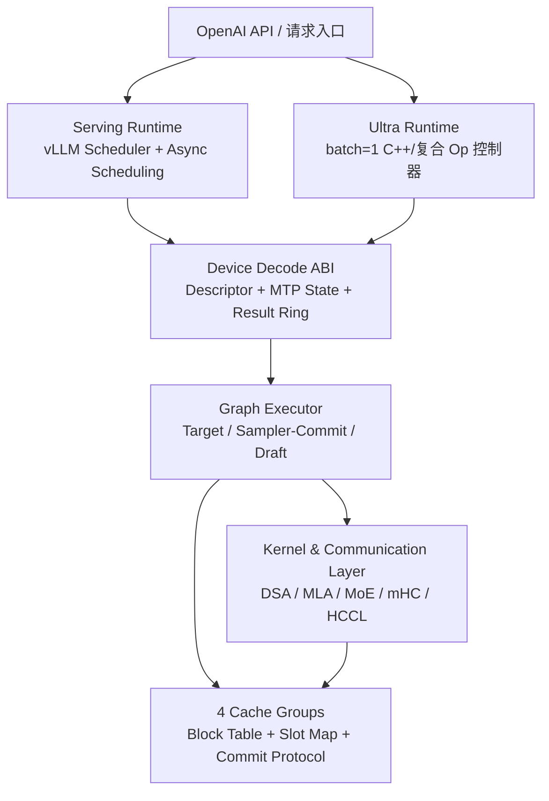
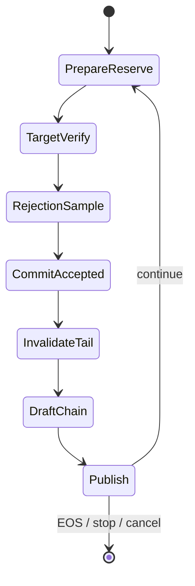

# 基于 vLLM / vLLM-Ascend 的 DeepSeek V4 极致时延推理方案

> 目标硬件：昇腾 910B3 / 910C  
> 推荐路线：方案 B，统一执行底座 + Serving / Ultra 双 Runtime 前端  
> 文档状态：方案设计与可行性评估，待 Phase 0 实测基线校准  
> 原始分析：`20260611-010803-vllm-ascend-deepseek-v4-runtime算子协同优化-方案设计.md`

---

## 1. 执行摘要

### 1.1 核心结论

建议采用“共享设备执行底座 + 两种 Runtime 前端”的架构，而不是在一个运行模式中同时追求完整 vLLM 动态能力和 batch=1 极致时延：

1. **Serving 模式**
   - 保留 vLLM scheduler、continuous batching、异步调度、分页缓存和主要服务能力。
   - 优化重点是去除 decode 关键路径中的阻塞式 D2H、Python 元数据构造、无效同步和图外采样/提交。
   - CPU 仍是请求级和资源级控制面；设备侧维护一个迭代窗口内的乐观状态。

2. **Ultra 模式**
   - 面向 batch=1、固定或少量 shape bucket、固定采样模板、固定并行拓扑。
   - 将 MTP target verify、rejection sampling、accepted-prefix commit、draft chain 和结果发布组合成设备主导的执行闭环。
   - vLLM 负责请求入口、模型装载和资源生命周期，不再逐 token 驱动 decode。

3. **共享执行底座**
   - 两种模式共享设备侧 decode descriptor、MTP 状态机、V4 多 cache group 提交协议、采样/验证算子、结果 ring buffer、图 bucket 和性能计数器。
   - 避免形成两套不可维护的模型实现和 KV cache 语义。

### 1.2 对原报告的关键校正

原报告的方向大体正确：需要压缩 host gate、launch gap、MTP 控制流和通信暴露时间。但部分论据把其他模型、其他硬件或示例数据直接外推到了 DeepSeek V4，需要校正：

- `ascend_tilert_loop` 当前面向 DeepSeek-V3.2-W8A8 + MTP，不是 DeepSeek V4；README 中的 400 tok/s、2.5 ms、accept_len 1.0 是方案脚手架/示例指标，不能作为现有 V4 基线。
- TokenSpeed 的 DeepSeek V4 多步 MTP，以及 SWA、compressed KV、compressor state、CSA indexer state 四类逻辑 paged-cache 设计可作为状态机参考，但其运行硬件是 NVIDIA B200，不能直接继承性能收益。
- TileRT 展示了固定宽度 MTP、持久 buffer 和复合 decode op 的架构价值，但仍有 `.cpu()`、`.item()` 等 host 参与，不能描述为严格“零 D2H”。
- vLLM-Ascend 已具备 NPU sampler、NPU rejection sampler 和异步 speculative decode 基础。优化目标不是简单“把采样从 CPU 搬到 NPU”，而是将采样、验证、状态提交和图执行连成无阻塞关键路径。
- 官方 DeepSeek V4 配置当前以 `num_speculative_tokens=1`、`method=mtp`、`enforce_eager=true` 为主。MTP3、draft graph capture 和平均接收长度 2.7 都必须作为待验证实验，而不是基线能力。
- xlite 当前没有 DeepSeek V4 / MLA / DSA 架构适配，并且配置层与 speculative decoding 存在不兼容约束。它更适合被视为 Ultra Runtime 候选底盘，而不是短周期可直接启用的开关。

### 1.3 收益判断

在没有同机同配置 profile 前，不建议承诺绝对 tok/s 或毫秒值。以“冻结后的当前基线”为 100，初步可采用以下条件区间：

| 模式 | 可实现区间 | 上行情形 | 主要前提 |
|---|---:|---:|---|
| Serving | 端到端 TPOT 改善 12%～28% | 30%～40% | host/launch 暴露占比高，MTP1 图路径稳定 |
| Ultra | 端到端 TPOT 改善 20%～40% | 45%～55% | batch=1 固定 shape，全链路设备闭环，MTP3 接收收益成立 |
| xlite/C++ Runtime 相对前序优化的增量 | Serving 0%～8%；Ultra 3%～15% | 约 20% | 前序优化后 host 暴露仍大于 8% |

这些区间不能相加。所有收益必须通过 Phase 0 的 exposed-time 分解重新计算。

### 1.4 首要决策

最优先的工作不是立即重写 Runtime，而是回答四个问题：

1. 910B3 / 910C 在实际环境中分别被 CANN 和 vLLM-Ascend 识别为何种 SOC、A2/A3 平台和通信拓扑？
2. 当前 V4 MTP1 的每步时间中，device compute、device communication、launch gap、host gate 各占多少？
3. `enforce_eager=true` 下 target、draft、sampler、commit 分别有多少次 graph replay 和 eager launch？
4. 多步 MTP 的接收长度提升，是否大于其 target、draft、verify 和 cache commit 的增量成本？

只有这四项数据齐备，才能决定是否进入 xlite 或设备常驻循环。

---

## 2. 范围、目标与非目标

### 2.1 优化目标

主指标：

- Decode TPOT：mean、P50、P95、P99。
- Inter-token latency：尤其关注尾时延和周期性尖峰。
- 单用户 batch=1 token/s。
- MTP 每迭代实际输出 token 数 `E[L_emit]`。

约束指标：

- TTFT 不显著回退。
- greedy 输出与冻结基线逐 token 一致。
- 非 greedy 分布无统计显著回退。
- 显存增量、graph bucket 数、capture 时间可控。
- Serving 模式不能破坏 scheduler、公平性、取消请求和 stop 条件。

### 2.2 两种运行模式

#### Mode S：Serving

建议基准工作点：

- 并发：1、2、4、8。
- decode batch：动态。
- continuous batching：开启。
- async scheduling：开启。
- prefix caching：作为独立实验，不与主基线混合。
- MTP：先 MTP1，再验证 MTP3。
- PD 分离：不纳入第一阶段主时延基线，后续单独评估。

#### Mode U：Ultra

建议工作点：

- batch=1。
- 固定模型、固定并行拓扑、固定最大输出长度档位。
- 固定 sampling profile：greedy、top-p 两类模板。
- 固定 MTP 宽度和固定 graph bucket。
- 禁用运行中 EPLB 重平衡、动态 graph shape、逐步 scheduler 介入。
- host 只在请求边界、取消信号和结果消费时参与。

### 2.3 非目标

第一阶段不同时解决：

- 任意模型的通用 Runtime。
- 任意 batch 和任意采样参数的单一全图。
- 完整 PD、高并发和 Ultra batch=1 的统一最优配置。
- 在没有硬件和模型实测的前提下承诺 400 tok/s。

---

## 3. 证据基线与适用边界

### 3.1 本地代码基线

| 仓库 | Commit | 用途 |
|---|---|---|
| vLLM-Ascend | `0b5223c5cb08aa6b4f2a1ec4a12568ac9ff6bb3e` | 主实现与优化落点 |
| vLLM | `2131b597b18d051dced4c4a605d362fa37f46ed1` | scheduler、spec decode、model runner 上游语义 |
| TokenSpeed | `a11724ba8c8c6236bc1824c7448a300d4f5f8664` | V4 多步 MTP、多 cache group 和 C++ scheduler 参考 |
| TileRT | `242f7b30e46226bae1d9709d10d03c445167aef6` | 固定宽度 MTP、持久 buffer 和复合 op 参考 |

主要源码观察点：

- `vllm_ascend/worker/model_runner_v1.py`
- `vllm_ascend/compilation/acl_graph.py`
- `vllm_ascend/attention/attention_v1.py`
- `vllm_ascend/attention/dsa_v1.py`
- `vllm_ascend/models/layer/attention/layer.py`
- `vllm_ascend/ops/dsa.py`
- `vllm_ascend/sample/sampler.py`
- `vllm_ascend/sample/rejection_sampler.py`
- `vllm_ascend/spec_decode/llm_base_proposer.py`
- `vllm_ascend/spec_decode/utils.py`
- `vllm_ascend/xlite/xlite.py`
- 上游 `vllm/v1/worker/gpu_model_runner.py`

关键结论的源码锚点：

| 结论 | 源码证据，基于本文锁定 commit |
|---|---|
| Ascend 已有 NPU sampler | `vllm_ascend/sample/sampler.py:45`，`AscendSampler` |
| rejection sampling 已有 NPU 实现 | `vllm_ascend/sample/rejection_sampler.py:34`，`AscendRejectionSampler` |
| NPU runner 继承上游 async spec 基础 | `vllm_ascend/worker/model_runner_v1.py:255`；上游 `gpu_model_runner.py:631` |
| batch change 已有 accepted-length 修正 | `model_runner_v1.py:1050-1059`，`update_num_computed_tokens_for_batch_change` |
| `deepcopy` 不是无条件 steady decode 热点 | `model_runner_v1.py:1931-1948`，分支与 `_draft_token_ids is None`、prefill 相关 |
| DSA metadata 存在 host scalar 路径 | `vllm_ascend/attention/dsa_v1.py:612,621,881` |
| draft graph 受 `enforce_eager` 门控 | `vllm_ascend/spec_decode/llm_base_proposer.py:175` |
| 已存在 merged draft 结构 | `vllm_ascend/spec_decode/llm_base_proposer.py:965` |
| ACLGraph replay 存在条件式 stream barrier | `vllm_ascend/compilation/acl_graph.py:270` |
| V4 已有 multistream 与持久 top-k/hidden buffer | `dsa_v1.py:1430-1486`；`deepseek_v4.py:885-947` |
| xlite 暂不兼容 speculative decoding | `vllm_ascend/ascend_config.py:568-570` |
| xlite 仍构造 CPU list / block table | `vllm_ascend/xlite/xlite.py:768-771` |
| xlite 无 DeepSeek V4 adapter | `vllm_ascend/xlite/xlite.py:624-638` 的 `strategy_map` |
| A2/A3 MoE 通信选择条件不同 | `vllm_ascend/ascend_forward_context.py:233-312` |

### 3.2 外部资料

- [DeepSeek V4 Flash on Ascend](https://docs.vllm.ai/projects/ascend/en/releases-v0.20.2rc/tutorials/models/DeepSeek-V4-Flash.html)
- [DeepSeek V4 Pro on Ascend](https://docs.vllm.ai/projects/ascend/en/releases-v0.20.2rc/tutorials/models/DeepSeek-V4-Pro.html)
- [DeepSeek V4 支持路线 Issue #8690](https://github.com/vllm-project/vllm-ascend/issues/8690)
- [vLLM-Ascend Release Notes](https://docs.vllm.ai/projects/ascend/en/main/user_guide/release_notes.html)
- [V4 Flash graph/eager 性能问题 #10209](https://github.com/vllm-project/vllm-ascend/issues/10209)
- [V4 Flash PD 高并发挂起问题 #10095](https://github.com/vllm-project/vllm-ascend/issues/10095)
- [多步 speculative decoding 在混合 CP batch 退化问题 #10267](https://github.com/vllm-project/vllm-ascend/issues/10267)

这些 Issue 是特定版本和环境的故障证据，不代表所有部署必然复现；它们说明 V4 支持仍在快速演进。任何版本结论必须绑定 commit、镜像、CANN 和 torch_npu 版本。

### 3.3 910B3 / 910C 映射要求

当前本地 vLLM-Ascend 官方文档给出的最低部署规模是：

| 模型 | A3 官方配置 | A2 官方配置 | 对时延方案的影响 |
|---|---|---|---|
| DeepSeek-V4-Flash-w8a8-mtp | 1 个 Atlas 800 A3，128G × 8 | 1 个 Atlas 800 A2，64G × 8 | 单节点，Runtime/launch 优化更可能形成可观端到端收益 |
| DeepSeek-V4-Pro-w4a8-mtp | 2 个 Atlas 800 A3 节点 | 4 个 Atlas 800 A2 节点 | 多节点，跨节点通信更可能限制 Runtime 优化上限 |

因此，若 910B3 实机最终映射到 A2 类平台、910C 实机映射到 A3 类平台，则 Pro 在两者上都不是“单节点 batch=1”问题。Pro 的 Ultra 模式仍可优化单请求时延，但必须把跨节点 collective 纳入主关键路径，而不是只优化 Python Runtime。

vLLM-Ascend 的公开配置和代码通常以 Atlas A2 / A3 平台抽象组织，而不是直接以“910B3 / 910C”作为全部分支条件。构建配置中还会出现：

- A2 示例：`SOC_VERSION=ascend910b1`
- A3 示例：`SOC_VERSION=ascend910_9391`

因此不能仅凭市场型号推断算子、图和通信能力。Phase 0 必须记录：

```text
npu-smi info
芯片产品名、SOC version、卡数与每卡芯片数
Driver / Firmware
CANN
torch / torch_npu
vLLM / vLLM-Ascend commit
HCCL 拓扑与 RankTable
NUMA / CPU affinity
容器镜像 digest
模型权重格式与量化配置
```

报告后续统一使用：

- **平台 A2-实测**：实际被 vLLM-Ascend 判定为 A2 的 910B3 环境。
- **平台 A3-实测**：实际被 vLLM-Ascend 判定为 A3 的 910C 环境。

如果实机识别结果不同，应以实机能力矩阵替换本文命名。

---

## 4. 对原分析逻辑的逐项校对

| 原分析方向 | 校对结论 | 修正后的工程表述 |
|---|---|---|
| Python Runtime 是主要瓶颈 | 部分成立 | 必须先测 exposed host/launch time；设备计算或通信占主导时，重写 Runtime 收益很小 |
| sampler 在 CPU | 不成立 | vLLM-Ascend 已有 NPU sampler 和 NPU rejection sampler；问题是图外 launch、metadata gate、结果提交与同步 |
| MTP 状态由 CPU 完全控制 | 不准确 | 上游已有 async speculative decode 和乐观 seq_len 修正；V4 DSA 路径仍存在 GPU/NPU 到 CPU 的修正等待和 CPU metadata 构造 |
| 每步 `deepcopy` 是核心热点 | 证据不足 | 相关分支具有条件，且部分注释指向 prefill；应通过栈采样和 trace 决定优先级 |
| ACLGraph 只差参数更新 | 过度简化 | replay 路径可能存在显式 stream synchronize；V4 官方配置仍使用 `enforce_eager=true`，需确认 target/draft 实际图覆盖率 |
| MTP3 已可直接获得 2.7 接收长度 | 未证实 | 官方 V4 主要配置是 MTP1；MTP3 接收长度、正确性、CP 混合批次和 graph 支持均需实测 |
| xlite 可作为低成本适配层 | 不成立 | 当前无 DeepSeek V4 / MLA / DSA，且 speculative decoding 不兼容；需要 C++/算子级改造和 V4 多 cache group ABI |
| TileRT 已实现零 host decode loop | 部分成立 | 核心 decode 被压入复合 op，但结果路径仍有 `.cpu()` 和 `.item()`；正确目标是“关键路径无阻塞 D2H” |
| 400 tok/s 可作为近期目标 | 不能据此成立 | 本地示例不等于 V4 实测；应使用相对冻结基线和逐阶段收益门槛 |
| 910B3/910C 可直接套用 A2/A3 结论 | 风险较高 | 必须先做 SOC、拓扑和能力指纹，尤其是 MC2、融合通信和图支持 |

### 4.1 仍然成立的核心判断

原报告中以下判断值得保留：

- batch=1 极致时延需要减少 Python 调度和小算子 launch gap。
- MTP 的收益不只由接收率决定，还受 target、draft、verify、cache commit 和通信成本影响。
- 持久设备 buffer、固定 shape 和复合算子是降低运行时开销的有效方向。
- 需要将 Runtime 优化与算子、通信、多流调度协同设计。
- Serving 与 Ultra 需要不同的动态能力和状态所有权。

---

## 5. 时延模型与收益估算方法

### 5.1 基本模型

对一次 speculative decode 迭代：

$$
TPOT = \frac{T_{iter}}{E[L_{emit}]}
$$

其中：

$$
T_{iter} =
T_{device\_compute} +
T_{device\_comm} +
T_{launch\_gap} +
T_{host\_gate} -
T_{overlap}
$$

注意不能把 trace 中各类耗时简单相加。应测量每一类在关键路径上的 **exposed time**。

### 5.2 MTP 宽度判断

对宽度 `k`：

$$
TPOT(k)=
\frac{
T_{target}(k)+T_{draft}(k)+T_{verify}(k)+T_{runtime}(k)
}{
E[L_{emit}(k)]
}
$$

MTP3 相对 MTP1 有收益的必要条件：

$$
\frac{E[L_{emit}(3)]}{E[L_{emit}(1)]}
>
\frac{T_{iter}(3)}{T_{iter}(1)}
$$

因此“接收长度更高”不等于“TPOT 更低”。若 DSA、MoE、多 cache group commit 或 draft chain 增量过大，MTP1 可能优于 MTP3。

### 5.3 Runtime 优化上限

设基线关键路径中可被 Runtime 优化的暴露占比为 `R`，可消除比例为 `p`：

$$
Speedup = \frac{1}{1-Rp}
$$

示例：

- 基线归一化为 100。
- host gate + launch gap 的暴露时间为 25。
- 其中可消除 60%。
- 设备计算/通信再优化 10%。

则：

$$
T_{new}=100-25\times 0.6-75\times 0.1=77.5
$$

总体 TPOT 改善约 22.5%，等价吞吐提升约 29%。这说明报告必须明确“时延下降”和“吞吐提升”的口径，不能混用百分比。

### 5.4 分项收益区间

以下为在对应瓶颈确实存在时的端到端 TPOT 改善区间：

| 优化项 | Serving | Ultra | 成立条件 |
|---|---:|---:|---|
| 配置、绑核、消除显式同步、稳定图命中 | 5%～18% | 5%～20% | runtime/launch 暴露占比 15%～30% |
| DSA metadata 设备化、取消 `.item()` / `.tolist()` gate | 4%～12% | 6%～18% | DSA metadata 在关键路径阻塞 |
| sampler + verify + commit 图内组合 | 5%～15% | 8%～25% | 小算子 launch gap 明显 |
| MTP1 到 MTP3 | -5%～20% | -5%～30% | 接收长度增益大于迭代成本增益 |
| DSA / MoE / 通信优化 | 5%～20% | 5%～25% | 设备算子或通信已成为主瓶颈 |
| xlite/C++ Runtime 增量 | 0%～8% | 3%～15% | 前序优化后 host 暴露仍大于 8% |
| 常驻设备 decode loop | 0%～5% | 5%～20% | 固定 shape、可取消、错误恢复均可接受 |

负收益必须被保留在评估中，尤其是 MTP3、过多 graph bucket 和复杂多流。

### 5.5 分平台规划区间

下表是项目排期和资源决策使用的先验区间，不是性能承诺。基线必须是同模型、同权重、同并行、同请求集下的冻结版本；Phase 0 完成后应使用实测 Amdahl 模型替换。

| 场景 | Serving TPOT 预计改善 | Ultra TPOT 预计改善 | 判断依据 |
|---|---:|---:|---|
| Flash，910C 候选 / A3-实测，单节点 | 15%～30% | 22%～45% | 单节点且 batch=1 时，host/launch 和小算子更容易暴露 |
| Flash，910B3 候选 / A2-实测，单节点 | 10%～25% | 18%～38% | 通信和算子能力边界可能压低 Runtime 占比 |
| Pro，910C 候选 / A3-实测，2 节点 | 8%～22% | 15%～32% | 节点间通信提高不可消除部分 |
| Pro，910B3 候选 / A2-实测，4 节点 | 5%～18% | 10%～25% | 多节点固定通信成本最可能成为主瓶颈 |

表中上界需要同时满足：

- MTP1 图路径稳定。
- 关键路径无 accepted-count / corrected-seq-len 阻塞 D2H。
- Ultra 可使用固定 shape 和设备状态闭环。
- MTP3 的 `E[L_emit]` 收益覆盖增量计算。

若 Profile 显示 device compute + exposed communication 已超过 90%，应将上述区间下调，并把资源转向 DSA、MoE 和通信。

### 5.6 建议承诺口径

项目对外只承诺：

1. 在同一模型、同一量化、同一硬件、同一请求集和同一正确性约束下的相对改善。
2. P50 与 P99 同时报告。
3. 同时报告 `E[L_emit]`，避免把接收率变化误认为 Runtime 改善。
4. 以三次以上稳定运行的中位数为结论，CV 应低于 2%～3%。

---

## 6. 方案 B 总体架构



### 6.1 共享执行底座

共享层必须包含：

- 统一 `DeviceDecodeDescriptor`。
- 统一 `DeviceMTPState`。
- V4 多 cache group 的 reserve、write、commit、invalidate 语义。
- NPU sampler 和 rejection sampler 的组合接口。
- target / draft 共用的 top-k index、hidden state 和位置 buffer。
- graph bucket 与 replay 参数更新。
- 异步 `DecodeResultRing`。
- 设备侧性能计数器和错误状态。

### 6.2 Serving Runtime

Serving 模式中：

- vLLM scheduler 仍是请求和资源分配的最终权威。
- 设备可以在一个迭代窗口内使用 optimistic seq_len。
- 下一步需要的 corrected seq_len、accepted count 和 stop flag 保持在设备侧。
- CPU 镜像异步追赶，但不得成为下一步 target verify 的阻塞 gate。
- batch 变化、请求取消、cache page 不足时，回到 scheduler 慢路径。

### 6.3 Ultra Runtime

Ultra 模式中：

- 请求开始前完成 page reserve、graph bucket 选择、采样模板绑定和设备状态初始化。
- decode loop 内不进行 Python 对象构造、动态 page 分配和阻塞式结果读取。
- 每个复合迭代在固定最大 MTP 宽度下使用 mask/predication。
- host 通过异步结果 ring 消费 token，不控制下一次设备迭代。
- stop、EOS、max_tokens 和取消通过设备 flag 或低频控制信号处理。

### 6.4 为什么不是两套模型实现

若 Serving 与 Ultra 各自维护 KV cache、MTP 语义和采样实现，会产生：

- 正确性难以对齐。
- V4 多 cache group 的 bug 修复需要重复。
- 模型版本升级成本翻倍。
- Ultra 的优化难以回流 Serving。

因此差异应集中在“谁驱动迭代”和“允许多少动态行为”，而不是模型数学语义。

---

## 7. 设备 Decode ABI 设计

### 7.1 `DeviceDecodeDescriptor`

建议采用结构化、版本化、固定地址的 SoA descriptor：

```cpp
struct DeviceDecodeDescriptor {
  uint32_t abi_version;
  uint32_t mode;              // SERVING or ULTRA
  uint32_t batch_size;
  uint32_t verify_width;      // 1 or 3 initially
  uint32_t graph_bucket_id;
  uint32_t cache_group_count; // Derived from the active KV cache config

  DeviceSpan<int32_t> request_ids;
  DeviceSpan<int32_t> committed_seq_lens;
  DeviceSpan<int32_t> optimistic_seq_lens;
  DeviceSpan<int32_t> positions;
  DeviceSpan<int32_t> query_start_loc;

  CacheGroupDescriptor* cache_groups;
  SamplingDescriptor sampling;
  DeviceMTPState* mtp_state;
  DecodeResultRing* result_ring;
  DevicePerfCounters* perf;
};
```

实现时不要求直接使用上述 C++ 布局，但必须满足：

- 地址在 graph 生命周期内稳定。
- batch 变化通过有效长度和 mask 表达。
- CPU 不逐步重建 Python list。
- cache group 数量和 ABI version 显式存在。
- Serving 与 Ultra 共享同一语义。

### 7.2 `CacheGroupDescriptor`

每个 cache group 至少包含：

```cpp
struct CacheGroupDescriptor {
  DeviceSpan<int32_t> block_table;
  DeviceSpan<int32_t> slot_mapping;
  DeviceSpan<int32_t> logical_page_base;
  DeviceSpan<int32_t> reserved_tail;
  uint32_t page_size;
  uint32_t max_blocks_per_request;
};
```

DeepSeek V4 的不同缓存组不能假设完全相同的 token-to-slot 更新方式。TokenSpeed 给出的参考布局包含 SWA、compressed KV、compressor state、CSA indexer state 四类逻辑状态，但实际 group 数量和分组方式应从当前 vLLM `kv_cache_config` / cache spec 自动生成，不能在 ABI 中硬编码为 4。

### 7.3 `DeviceMTPState`

```cpp
struct DeviceMTPState {
  DeviceSpan<int32_t> committed_len;
  DeviceSpan<int32_t> reserved_len;
  DeviceSpan<int32_t> accepted_len;
  DeviceSpan<int32_t> emitted_len;
  DeviceSpan<int64_t> rng_state;
  DeviceSpan<int32_t> next_draft_tokens;
  DeviceSpan<uint8_t> stop_flags;
  DeviceSpan<uint8_t> cancel_flags;
  DeviceSpan<int32_t> error_codes;
};
```

关键约束：

- `committed_len` 只表示已接受前缀。
- `reserved_len` 可以领先，但未提交区域不能对后续请求可见。
- rejected tail 必须被覆盖或失效，不能错误复用。
- RNG 状态提交必须与 accepted prefix 原子一致。

### 7.4 `DecodeResultRing`

结果 ring 的目的不是消灭所有 D2H，而是消灭下一迭代前的阻塞 D2H：

```cpp
struct DecodeResult {
  int32_t request_id;
  int32_t accepted_count;
  int32_t token_ids[MAX_EMIT];
  int32_t stop_reason;
  uint64_t device_timestamp;
};
```

- NPU 写入固定深度 ring。
- host 使用异步 memcpy 或映射内存消费。
- ring 高水位可以触发背压。
- Ultra 模式中 ring 未满时，不阻塞下一设备迭代。

---

## 8. MTP 正确状态机

### 8.1 状态转换



### 8.2 每阶段语义

1. **PrepareReserve**
   - 为最大 verify width 预留逻辑位置和 cache slot。
   - 预留不等于提交。

2. **TargetVerify**
   - target 对 draft token 序列执行验证。
   - 产生 target probability / logits 和新 cache 写入。

3. **RejectionSample**
   - 在设备侧计算 accepted prefix 和 fallback token。
   - 更新待提交 RNG 状态。

4. **CommitAccepted**
   - 所有活动 cache group 同步提交 accepted prefix。
   - `committed_len += accepted_count`。

5. **InvalidateTail**
   - 未接受的 reserve tail 标记无效。
   - 如果 buffer 将被下一步覆盖，可通过 epoch/version 避免显式清零。

6. **DraftChain**
   - 从“已提交前缀”继续生成下一轮 draft。
   - 不能从被拒绝位置继续。

7. **Publish**
   - 将 accepted token、stop reason 和计数写入结果 ring。
   - Serving 模式异步更新 CPU 镜像。

### 8.3 图内控制流

ACLGraph 内应使用固定最大宽度和 mask：

- MTP1：`MAX_VERIFY=1`。
- MTP3：`MAX_VERIFY=3`。
- `accepted_count` 决定有效写入和状态提交。
- 避免根据设备值在 Python 中分支。
- 不用 `.item()` 读取 accepted count 再决定下一 launch。

### 8.4 Serving 的资源安全

设备状态领先 CPU 时，scheduler 必须遵守：

- 只在安全 reserve 窗口内乐观推进。
- page 不足时停止设备自主推进。
- 请求取消后通过 cancel flag 使下一迭代不再写新状态。
- CPU reconciliation 校验 request epoch，避免 batch 重排后写错请求。

---

## 9. ACLGraph 与执行组合方案

### 9.1 当前边界

当前 V4 官方示例使用：

```text
num_speculative_tokens=1
method=mtp
enforce_eager=true
FULL_DECODE_ONLY
async scheduling
```

这意味着不能仅看到 `FULL_DECODE_ONLY` 就认定完整 MTP decode 已进入图。必须在 trace 中区分：

- target model graph replay。
- draft model eager / graph。
- sampler / rejection sampler。
- accepted state commit。
- DSA metadata build。
- graph replay 前后的 stream synchronize。

### 9.2 分级图方案

#### G0：冻结官方 MTP1 基线

- 不改语义。
- 建立 graph hit、eager launch、同步点和 D2H 计数。

#### G1：修复同步与图命中

- 定位 `acl_graph.py` replay 路径中的显式 `current_stream().synchronize()`。
- 当前代码中的该 barrier 仅在特定 `FULL` runtime mode 下触发，官方 `FULL_DECODE_ONLY` 基线不应预设命中该分支；必须以 trace 和配置判定。
- 仅在事件依赖足以保证正确性时，替换为 event/stream ordering。
- 验证 ENPU 或其他 replay 模式的适用性，不能仅凭开关启用。

#### G2：MTP1 组合图

优先实现两段或三段 replay：

1. target verify。
2. sampler + rejection + commit。
3. merged draft，可在能力允许时与第 2 段合并。

目标不是追求“一次 replay”形式，而是消除 replay 之间的 host gate。

#### G3：MTP3 merged draft

现有 merged draft 结构已经具备在一次 callable 中循环多个 draft step 的基础。需要补齐：

- V4 MTP3 正确性。
- draft graph capture。
- 所有活动 cache group 的 accepted-prefix commit。
- CP 混合 batch 的退化/回退处理。
- graph bucket 显存控制。

#### G4：Ultra 复合迭代

将以下固定宽度流程组合：

```text
target verify
-> rejection sample
-> commit accepted prefix
-> build next draft chain
-> publish result
```

G4 可以是一个 graph replay，也可以是一个自定义复合 op 内部调用多个预编译子图。是否“一图到底”由稳定性和可观测性决定。

### 9.3 Graph bucket 设计

Serving 建议：

- batch bucket：1、2、4、8，必要时 16。
- verify width：1、3 分开。
- context 不以精确长度建 bucket，使用固定 metadata buffer 和有效长度。

Ultra 建议：

- batch 固定 1。
- greedy / top-p 使用独立 sampling template。
- MTP1 / MTP3 分图。

停止条件：

- graph 额外显存超过模型可用 HBM 的 10%。
- capture/warmup 时间不可接受。
- fallback 率超过 0.1%。

---

## 10. 关键技术方案

### 10.1 Phase 0：可观测性先行

需要新增或补齐：

- 每次 decode 迭代的 host enqueue 时间。
- graph replay 数、graph key、fallback 原因。
- eager op 数和小于 50 μs 的 op 数。
- 阻塞 D2H 次数、字节数和调用栈。
- `.item()`、`.tolist()`、`.cpu()` 的关键路径采样。
- stream synchronize、event wait、HCCL wait。
- target、sampler/verify/commit、draft 的分段设备时间。
- `accepted_count` 和 `emitted_count` 分布。

建议输出一份逐迭代 trace schema：

```json
{
  "request_id": 1,
  "iteration": 42,
  "batch": 1,
  "graph_replays": 2,
  "eager_launches": 7,
  "blocking_d2h": 1,
  "host_gate_us": 110,
  "launch_gap_us": 85,
  "target_us": 1800,
  "verify_commit_us": 120,
  "draft_us": 410,
  "comm_exposed_us": 330,
  "accepted_count": 1,
  "emitted_count": 2
}
```

字段只是建议，实际值必须来自 trace，不能预填示例值作为结果。

### 10.2 DSA metadata 设备化

当前 DSA 路径中存在 CPU mirror、Python list、`max().item()`、`tolist()` 等潜在 gate。改造目标：

- `seq_lens`、`query_start_loc`、`max_seq_len` 保持设备 tensor。
- 使用固定长度 tensor + valid count 替代 Python list。
- block table、slot mapping 使用持久 buffer。
- graph replay 只更新 tensor 内容，不重建对象。
- Serving batch change 通过 descriptor 和 request epoch 处理。

可行性：高。  
风险：部分底层算子接口可能要求 host scalar，需要扩展自定义 op 或提供设备 scalar 入口。

验证方式：

- DSA metadata 构造阶段阻塞 D2H 降为 0。
- graph key 不因 Python list 内容变化而抖动。
- 长上下文和 batch change 输出一致。

### 10.3 sampler / verify / commit 组合

已有 AscendSampler 和 AscendRejectionSampler，应在其上扩展：

- 将 logits 后处理、top-k/top-p、rejection sampling、accepted count、RNG commit 组成单个复合调用。
- 直接写 `DeviceMTPState` 和 `DecodeResultRing`。
- 不把 accepted count 读回 host 再构造下一步 metadata。
- greedy 和 top-p 分模板，避免所有采样分支进入同一图。

可行性：中高。  
风险：随机数可复现性、不同 sampling 参数的图泛化、stop token 判断。

### 10.4 corrected seq_len 去阻塞

上游 async speculative decode 已有 optimistic CPU seq_len 和设备修正机制。V4 路径的优化重点是：

- 下一步 DSA metadata 直接读取设备 corrected seq_len。
- CPU corrected seq_len 仅用于 reconciliation 和 scheduler 慢路径。
- 用 event dependency 代替同步等待。
- batch 变化时使用 request epoch 和 index map 做重排。

可行性：中。  
风险：scheduler 分配与设备已提交状态短暂不一致，必须有 reserve 上界。

### 10.5 异步输出

- token 结果异步写 ring。
- host tokenizer/streaming 线程消费 ring。
- result ring 满时再背压。
- EOS 和 stop reason 可优先通知，但不要求逐 token 阻塞。

Serving 可先做 2～4 深度的 ring；Ultra 可做 8～32 深度。

### 10.6 多流与同步

vLLM-Ascend 的 DSA 路径已有 Q/KV、compressed/indexer 等重叠基础。优化原则：

- 先消除无条件 stream synchronize。
- 每个跨流 buffer 声明 producer/consumer event。
- 禁止通过 host sync 保障隐含顺序。
- 对 batch=1 小任务，验证多流 launch 和 event 开销是否超过重叠收益。

多流不是越多越好。若 exposed compute 无法被覆盖，应合并回单流。

### 10.7 A2-实测平台通信

代码路径显示，A2 的 EP 通信方法受专家数、EP world size 和 token capacity 等条件限制，未必进入 MC2。

重点实验：

- all-gather、MC2 候选路径的小 token microbenchmark。
- EP/TP 组合对 batch=1 latency 的影响。
- rank placement、NUMA、HCCL buffer 和绑核。
- MoE token 极少时的通信固定成本。

不能预设融合通信一定更快。小消息下同步和 setup 成本可能主导。

### 10.8 A3-实测平台通信

A3 可以进一步验证 MC2 / FUSED_MC2，但需注意：

- draft/MTP 路径可能禁用部分 fused 路径。
- Pro 模型跨节点通信可能成为首要瓶颈。
- graph、通信流和 DSA 多流之间可能产生额外同步。

对 Pro 的优先顺序：

1. 拆分节点内与节点间 exposed communication。
2. 校验 RankTable 和拓扑。
3. 再做 Runtime 重写。

若节点间通信占迭代关键路径超过 40%，应优先通信与并行策略。

### 10.9 xlite / C++ Ultra Runtime

xlite 的可利用价值：

- C++ scheduler/runtime 框架。
- 持久 buffer 和低 Python 开销。
- 可作为 Ultra 前端载体。

必须补齐：

- DeepSeek V4 架构注册。
- MLA / DSA / mHC。
- V4 动态多 cache group。
- MTP1 / MTP3 状态机。
- NPU sampler、rejection sampler 和 RNG。
- graph executor 与结果 ring。
- 取消 `.cpu().tolist()`、`query_lens.tolist()`、`cached_lens.tolist()` 等路径。

依赖风险：

- `xlite._C` 源码或完整扩展接口若不可获得，无法进行深度改造。
- 当前配置对 speculative decoding 的限制需解除。
- 该路线不是短周期 P0/P1 项目。

Go 条件：

- P2 后 host + launch 暴露仍大于 8%。
- Ultra 是明确产品需求。
- 可获得并维护 C++/AscendC 扩展源码。

No-Go 条件：

- P2 后设备计算/通信超过 92%。
- 只需要 Serving 模式。
- xlite 源码、测试和发布链路不可控。

### 10.10 常驻设备 decode loop

仅作为后期实验：

- 设备循环消费 descriptor。
- 内部调用 target/draft 子图。
- host 通过 ring 和 cancel flag 交互。

主要风险：

- graph/算子内长时间占用影响多请求公平性。
- 请求取消、错误恢复和 watchdog。
- HCCL collective 的跨 rank 一致退出。
- 调试与性能可观测性下降。

除非 G4 后仍有明显 launch gap，否则不建议进入。

---

## 11. 可行性矩阵

| 方案 | 可行性 | 研发复杂度 | 主要风险 | 建议 |
|---|---|---:|---|---|
| 基线指纹、trace 和分段计时 | 高 | 低 | 指标口径不一致 | 立即执行 |
| 清理 DSA metadata 阻塞 D2H | 高 | 中 | 底层接口需要 host scalar | P1 主线 |
| ACLGraph 同步与命中优化 | 中高 | 中 | 版本问题、图正确性 | P1 主线 |
| MTP1 sampler/verify/commit 组合 | 中高 | 中高 | RNG、stop、图泛化 | P2 主线 |
| Serving 设备 descriptor + 乐观状态 | 中 | 高 | scheduler/cache 一致性 | P2 主线 |
| V4 MTP3 全图 | 中低 | 高 | CP、接收率、cache commit | P3 条件执行 |
| A2/A3 专项通信融合 | 中 | 高 | 强依赖拓扑和版本 | Profile 驱动 |
| xlite V4 Ultra 适配 | 中低 | 很高 | 源码依赖、架构缺口 | P5 Go/No-Go |
| 常驻设备 decode loop | 低 | 很高 | 公平性、恢复、collective | 研究项 |

---

## 12. 验证方案

### 12.1 测试矩阵

| 维度 | 取值 |
|---|---|
| 硬件 | 910B3 实机、910C 实机，分别记录平台识别 |
| 模型 | DeepSeek V4 Flash、DeepSeek V4 Pro |
| Runtime | Serving、Ultra |
| MTP | off、1、3 |
| 上下文 | 2K、32K、128K |
| 输出长度 | 256、1024 |
| 并发 | 1、2、4、8 |
| 采样 | greedy、代表性 top-p |
| 图模式 | eager、官方图配置、组合图 |
| 并行 | 固定 TP/EP 基线 + 1～2 个候选 |

Pro 的硬件规模与官方要求不同于 Flash，必须分开报告，不能在同一图表中混为“910C 性能”。

### 12.2 性能指标

- TTFT：P50/P95/P99。
- TPOT：mean/P50/P95/P99。
- 每步 latency distribution。
- `accepted_count`、`emitted_count`、接收长度分布。
- graph replay 数、graph hit/fallback。
- host critical path。
- device idle gap。
- H2D/D2H 次数、字节数、阻塞次数。
- DSA、MoE、HCCL exposed time。
- CPU 利用率、调度线程迁移和 NUMA miss。
- HBM 使用量和 graph pool 增量。

### 12.3 正确性

必测：

- greedy 与冻结基线逐 token 一致。
- MTP off / MTP1 / MTP3 结果一致性。
- 所有活动 cache group 在 reject tail 后无污染。
- 长上下文跨 page 边界。
- batch add/remove、取消、EOS、stop string、max_tokens。
- graph fallback 后状态连续。
- 1 小时稳定性和压力测试。

可增加：

- GSM8K / GPQA：推理质量回归。
- MBPP：代码生成。
- BFCL 或内部 function calling 集：服务行为。

### 12.4 通过门槛

每一阶段同时满足：

- greedy token exact match。
- 无非法 slot 写入，canary buffer 无破坏。
- MTP 接收长度相对基线下降不超过 2%，或统计置信区间无显著下降。
- P99 不回退超过 3%。
- graph fallback 率低于 0.1%。
- 三次以上重复运行 CV 低于 2%～3%。
- HBM 增量低于约定门槛，默认 10%。

### 12.5 性能归因要求

每项优化必须同时提交：

1. 前后 trace。
2. 单项 microbenchmark。
3. E2E TPOT。
4. `E[L_emit]`。
5. 正确性结果。
6. 是否与其他优化重叠。

禁止用“单算子加速 50%”直接推导“端到端加速 50%”。

---

## 13. 分阶段执行计划

### Phase 0：冻结基线与证据补全，1～2 周

任务：

- 固化两类硬件环境指纹。
- 跑通 Flash / Pro 官方配置。
- 建立 Serving batch=1/2/4/8 基线。
- 确认 target、draft、sampler、commit 的 eager/graph 覆盖。
- 建立 MTP off / MTP1 数据。
- 对所有 `.item()`、`.tolist()`、`.cpu()` 和 synchronize 做关键路径定位。

交付：

- `baseline-manifest.yaml`
- 性能基线报告。
- trace 数据集和分析脚本。
- 瓶颈 Pareto 图。

退出条件：

- 能解释至少 95% 的单步 wall time。
- 同配置重复运行 CV 小于 3%。

#### 首 10 个工作日执行清单

| 工作日 | 动作 | 输出 |
|---|---|---|
| D1 | 采集 910B3/910C 的 `npu-smi`、SOC、CANN、torch_npu、容器和拓扑 | 两份 environment manifest |
| D2 | 锁定 vLLM/vLLM-Ascend commit、模型权重 checksum 和官方启动参数 | 可复现 baseline bundle |
| D3 | 跑 Flash 官方兼容基线和 batch=1 latency 基线 | B0/B1 结果 |
| D4 | 跑 Pro 官方兼容基线，分解节点内/节点间通信 | Pro communication breakdown |
| D5 | 插入 target、draft、sampler、commit、metadata 的 NVTX/Profiler 标记 | 第一版 step trace |
| D6 | 统计 graph replay、eager launch、fallback、同步和阻塞 D2H | Runtime Pareto |
| D7 | 建立 MTP off/MTP1 的 `T_iter`、`E[L_emit]` 和 TPOT 对照 | MTP1 收益事实表 |
| D8 | 定位 DSA `.item()`/`.tolist()`/CPU mirror 的 exposed time | DSA metadata 优先级 |
| D9 | 做 A2/A3 通信 microbenchmark 和 rank placement 对照 | 通信候选矩阵 |
| D10 | 评审 P1 backlog，以预期端到端收益/人周排序 | P1 Go/No-Go 清单 |

基线建议分三层保存：

- **B0 官方兼容基线**：尽量保持官方配置，用于确认支持性。
- **B1 极低时延基线**：同一模型语义下固定 batch=1、固定请求集和必要的服务参数。
- **B2 实验图基线**：用于比较 eager、现有 graph 和组合 graph，不作为生产默认。

### Phase 1：无悔优化，2～3 周

任务：

- 清理 ACLGraph replay 不必要同步。
- 固定 CPU affinity、NUMA、HCCL 和 graph warmup。
- 设备化 DSA metadata，移除关键路径 `.item()` / `.tolist()`。
- 持久化 block table、slot map、seq_len 等 buffer。
- 增加 graph fallback 原因计数。

预期：

- Serving / Ultra 共享收益。
- TPOT 改善 5%～18%，取决于基线 runtime 暴露。

退出条件：

- 阻塞 D2H 次数显著下降。
- graph 命中稳定。
- 无正确性回退。

### Phase 2：共享设备状态与 MTP1 组合执行，3～5 周

任务：

- 定义 `DeviceDecodeDescriptor` v1。
- 实现 `DeviceMTPState` 和 request epoch。
- sampler + rejection + commit 复合路径。
- 异步 `DecodeResultRing`。
- Serving 一迭代 optimistic state 与异步 reconciliation。
- MTP1 target / commit / draft 两到三段无 host gate 执行。

预期：

- 相对 Phase 1 再改善 5%～15%。
- Ultra batch=1 的收益通常高于 Serving。

退出条件：

- Serving batch change/cancel/page boundary 全部通过。
- 下一步迭代前无 accepted-count 阻塞 D2H。

### Phase 3：MTP3 与固定宽度图，4～6 周

任务：

- 实现 verify width=3 的动态多 cache group reserve/commit。
- merged draft graph。
- fixed-width mask/predication。
- CP 混合 batch 兼容或明确回退。
- MTP1 / MTP3 自适应选择实验。

Go 条件：

$$
\frac{E[L_{emit}(3)]}{E[L_{emit}(1)]}
>
\frac{T_{iter}(3)}{T_{iter}(1)}
$$

且 P99 不回退超过 3%。

No-Go：

- 接收长度不足以覆盖额外计算。
- graph 显存或 fallback 不可控。
- CP / cache 正确性无法稳定。

### Phase 4：硬件专项算子与通信，4～8 周

910B3/A2-实测：

- DSA 小 batch 算子。
- EP all-gather 与 MC2 能力判定。
- 小消息 HCCL 和 rank placement。
- MoE dispatch/combine 固定成本。

910C/A3-实测：

- MC2 / FUSED_MC2 候选。
- Pro 跨节点通信。
- DSA 多流与通信流协同。
- draft 路径融合限制。

退出条件：

- 每项优化有 exposed-time 归因。
- 不以单算子峰值替代端到端结果。

### Phase 5：Ultra Runtime 原型，6～12 周

任务：

- 评估 xlite 源码和扩展可维护性。
- 实现 V4 架构、DSA、动态多 cache group 和 MTP ABI。
- batch=1 固定图 decode controller。
- 结果 ring、取消和错误恢复。
- 与 Serving 共用权重和设备执行底座。

Go 条件：

- Phase 2 后 host/launch 暴露仍大于 8%。
- Ultra 的商业目标明确。
- 预计增量 TPOT 改善至少 8%。

否则停止 xlite 路线，继续优化 vLLM-Ascend 主路径。

---

## 14. 具体代码落点建议

以下是建议落点，不代表现有文件已经具备全部接口。

### 14.1 vLLM-Ascend

| 模块 | 建议工作 |
|---|---|
| `vllm_ascend/worker/model_runner_v1.py` | trace、设备 descriptor 接入、CPU reconciliation、移除 host gate |
| `vllm_ascend/compilation/acl_graph.py` | replay 同步、graph hit/fallback、参数更新与 bucket |
| `vllm_ascend/attention/dsa_v1.py` 等 DSA metadata builder | 设备 seq_len、固定 tensor buffer、移除 list/scalar D2H |
| `vllm_ascend/sample/sampler.py` | graph-friendly sampling descriptor、结果直写 |
| `vllm_ascend/sample/rejection_sampler.py` | accepted-prefix、RNG、commit 组合 |
| 新增 `vllm_ascend/runtime/decode_descriptor.py` | Python 侧 ABI 声明与持久 buffer 管理 |
| 新增 C++/AscendC extension | sampler/verify/commit、result ring、device scalar 接口 |

### 14.2 上游 vLLM

尽量减少上游侵入。可能需要：

- scheduler 暴露安全 reserve window。
- batch change 的 request epoch / index map。
- async result reconciliation hook。
- Ultra executor 的可插拔请求生命周期。

先在 vLLM-Ascend 侧原型验证，再决定是否形成上游通用接口。

### 14.3 测试

建议新增：

```text
tests/unit/runtime/test_device_decode_descriptor.py
tests/unit/runtime/test_mtp_state_machine.py
tests/unit/runtime/test_cache_group_commit.py
tests/e2e/models/test_deepseek_v4_mtp1.py
tests/e2e/models/test_deepseek_v4_mtp3.py
tests/e2e/runtime/test_async_result_ring.py
benchmarks/deepseek_v4/latency_matrix.py
benchmarks/deepseek_v4/trace_analyzer.py
```

状态机单测至少覆盖：

- accept 0/1/2/3。
- EOS 出现在 accepted prefix。
- reject tail 覆盖。
- page boundary。
- cancel 与 batch reorder。
- graph fallback。

---

## 15. 里程碑与资源建议

### 15.1 90 天里程碑

| 时间 | 里程碑 | 可验收结果 |
|---|---|---|
| 第 1～2 周 | 基线冻结 | 两平台、两模型的完整 trace 和 Pareto |
| 第 3～5 周 | P1 完成 | DSA metadata 与 graph 同步优化，正确性通过 |
| 第 6～10 周 | P2 完成 | MTP1 无 host gate，Serving/Ultra 共用 ABI |
| 第 11～13 周 | P3 Go/No-Go | MTP3 是否进入产品路径有数据结论 |

Phase 4/5 可与 P3 后半段并行，但不应抢占 P0/P1 的关键人力。

### 15.2 建议角色

- Runtime / scheduler：1～2 人。
- ACLGraph / torch_npu：1 人。
- DSA / MoE / AscendC：2 人。
- HCCL / 并行策略：1 人。
- 性能与正确性平台：1 人。

xlite Ultra 路线开启后，至少再需要 1 名 C++ Runtime 工程师。

---

## 16. 决策门槛

### 16.1 是否进入 MTP3

进入条件：

- TPOT 公式实测成立。
- 接收长度稳定。
- graph 与 cache correctness 通过。

否则保持 MTP1，不以“更高 MTP 宽度”作为目标本身。

### 16.2 是否进入 xlite

进入条件：

- Phase 2 后 exposed host + launch time > 8%。
- 预计增量改善 > 8%。
- 有源码、维护者和发布链路。

否则 xlite 只保留为研究分支。

### 16.3 是否进入常驻 loop

进入条件：

- G4 后 launch gap 仍 > 5%。
- batch=1 Ultra 是独立产品。
- 取消、watchdog、collective 退出可验证。

否则不做。

### 16.4 是否优先通信

- 若 device communication exposed time > 30%，通信与并行策略高于 Runtime 重写。
- 对 Pro，若跨节点通信 > 40%，优先拓扑、EP/TP、通信融合和必要的 PD 架构。

---

## 17. 风险与回退

| 风险 | 影响 | 缓解 |
|---|---|---|
| V4 graph 支持随版本变化 | 图方案失效 | 锁定 commit/镜像；保留 eager fallback |
| MTP3 接收收益不足 | TPOT 变差 | MTP1 为默认；公式门槛决定启用 |
| 多 cache group 提交错误 | 静默正确性问题 | epoch、canary、逐 token 对照和 page-boundary 测试 |
| 设备状态领先 scheduler | 资源冲突 | 有界 reserve、request epoch、慢路径 reconciliation |
| graph bucket 过多 | HBM 增长 | 少量 batch/verify bucket；有效长度 mask |
| 多流引入额外同步 | P99 变差 | exposed-time 验证；允许回退单流 |
| A2/A3 能力推断错误 | 选错算子/通信 | 以实机 SOC 和 feature probe 为准 |
| xlite 源码依赖不可控 | 项目延期 | P5 前置 Go/No-Go，不纳入短期承诺 |
| 常驻 loop 难以取消 | 服务不可控 | 低频检查 cancel flag、watchdog、硬超时 |

---

## 18. 最终推荐路线

### P0/P1：先修当前 vLLM-Ascend

优先级：

1. 冻结实机基线和版本指纹。
2. 量化 host gate、launch gap、设备计算和通信。
3. 清理 ACLGraph replay 同步。
4. 去除 DSA metadata 的阻塞 D2H 和 Python list。
5. 验证官方 MTP1 的真实图覆盖。

### P2：建立共享设备执行底座

实现：

- descriptor。
- MTP 状态机。
- 动态多 cache group commit。
- sampler/verify/commit 组合。
- 异步结果 ring。

这是方案 B 的核心资产，Serving 和 Ultra 都依赖它。

### P3：用数据决定 MTP3

不预设接收长度和收益。只在 TPOT 条件成立时进入产品路径。

### P4：按平台 profile 优化 DSA/MoE/通信

910B3 与 910C 分开报告，Flash 与 Pro 分开报告。

### P5：仅在 Runtime 仍显著暴露时做 xlite Ultra

xlite 是第二前端候选，不是对 vLLM-Ascend 的整体替换。若前序优化已经使设备计算/通信占比超过 92%，继续重写 Runtime 的回报不足。

---

## 19. 验收输出模板

最终每个平台、模型和模式应形成一张表：

| 版本 | TPOT P50 | TPOT P99 | tok/s | E[L_emit] | host gate | launch gap | compute | comm | HBM | 正确性 |
|---|---:|---:|---:|---:|---:|---:|---:|---:|---:|---|
| Baseline | | | | | | | | | | |
| P1 | | | | | | | | | | |
| P2 MTP1 | | | | | | | | | | |
| P3 MTP3 | | | | | | | | | | |
| P4 kernel/comm | | | | | | | | | | |
| P5 Ultra | | | | | | | | | | |

所有百分比从表内数据计算，不再从其他硬件、其他模型或示例 JSON 外推。

---

## 20. 结论

DeepSeek V4 在昇腾 910B3 / 910C 上的极致时延优化，最可行的工程路线不是直接重写整个 vLLM，也不是把其他平台的“设备闭环”结果照搬过来，而是：

1. 先把现有 vLLM-Ascend 的真实关键路径测清。
2. 在当前路径上消除 DSA metadata、ACLGraph 同步和 MTP 状态提交中的阻塞。
3. 建立 Serving/Ultra 共用的设备 decode ABI 和正确状态机。
4. 用 MTP 的 TPOT 条件决定 MTP3，而不是用接收长度单指标决定。
5. 用实机识别和 profile 分别指导 910B3、910C 的算子与通信优化。
6. 只有在前序阶段后 Runtime 仍显著暴露时，才投入 xlite/C++ Ultra Runtime。

该路线的优势是每个阶段都能独立产生可验证收益，并具有清晰的停止条件。短期收益主要来自现有 vLLM-Ascend 的同步、metadata 和图路径；中期核心资产是共享设备执行底座；长期上限由 V4 的设备计算、MoE/通信和 MTP 接收效率共同决定。
