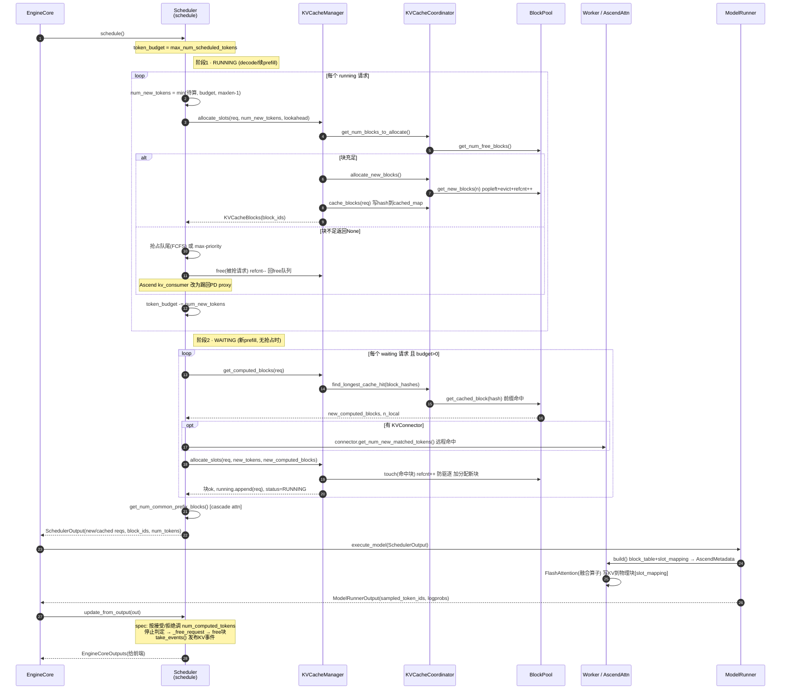

# vLLM / vLLM-Ascend — KV Cache + 调度 实现与架构分析

> 代码基线：`vllm @ 2131b597b`、`vllm-ascend @ 0b5223c5`（均 2026-06-10）
> 分析对象：V1 引擎的 KV Cache 管理与 Scheduler，以及 vLLM-Ascend 的适配/扩展策略
> 关注点：整体架构、关键模块实现、核心优化、时序串联

---

## 0. 一句话结论

- **vLLM V1 把"调度"做成了一个无 prefill/decode 概念的统一 token 预算分配器**：每个请求只有 `num_computed_tokens` 和 `num_tokens_with_spec`，每步把 token 喂给请求让其"追平"，天然覆盖 chunked prefill / prefix caching / spec decode。
- **KV Cache 管理是三层解耦**：`Scheduler → KVCacheManager → KVCacheCoordinator → SingleTypeKVCacheManager + BlockPool`。Scheduler 只看到 `KVCacheBlocks`（block_id 的不透明封装），不碰物理内存。
- **vLLM-Ascend 不重写这套架构，而是用 `monkey-patch + 子类` 两种手段做最小侵入适配**：算子/内存层 patch，调度策略层子类（`RecomputeScheduler` / `SchedulerDynamicBatch` / `ProfilingChunkScheduler`）。这是整个仓库的"底层逻辑"。

---

## 1. 整体架构设计

### 1.1 V1 控制面分层（vLLM 原生）

```
EngineCore (主循环)
   │  step(): schedule() → execute_model() → update_from_output()
   ▼
Scheduler                         vllm/v1/core/sched/scheduler.py
   │  - waiting / running 队列 + 调度策略 (FCFS / PRIORITY)
   │  - token_budget 分配、抢占、chunked prefill
   │  - 产出 SchedulerOutput（每请求调度多少 token + block_ids）
   ▼
KVCacheManager                    vllm/v1/core/kv_cache_manager.py
   │  - Scheduler 与物理块之间的门面（facade）
   │  - get_computed_blocks() 前缀缓存命中
   │  - allocate_slots() 槽位分配 + 抢占判定
   ▼
KVCacheCoordinator                vllm/v1/core/kv_cache_coordinator.py
   │  - 协调多个 KV cache group（混合模型：FullAttn + SWA/Mamba）
   │  - find_longest_cache_hit() 跨 group 最长命中
   ▼
SingleTypeKVCacheManager          vllm/v1/core/single_type_kv_cache_manager.py
   │  - 单一注意力类型（Full / SlidingWindow / Mamba / CrossAttn）的块账本
   ▼
BlockPool                         vllm/v1/core/block_pool.py
      - num_gpu_blocks 个 KVCacheBlock 的真正持有者
      - free_block_queue（双向链表，LRU 驱逐序）
      - cached_block_hash_to_block（前缀缓存哈希表）
```

> 关键设计：**逻辑块 (block_id) 与物理内存解耦**。Scheduler/Manager 全程只操作 `block_id`，真正的 NPU/GPU KV 张量在 worker 侧。两者通过 `SchedulerOutput.scheduled_*.block_ids` 在每步对齐。

### 1.2 数据结构骨架

| 结构 | 位置 | 作用 |
|------|------|------|
| `KVCacheBlock(block_id, ref_cnt, block_hash, prev/next)` | `kv_cache_utils.py` | 单个逻辑块；双向链表节点 |
| `FreeKVCacheBlockQueue` | `kv_cache_utils.py` | 空闲块队列，head=最先驱逐，实现 LRU |
| `BlockHashToBlockMap` | `block_pool.py:34` | `{block_hash → KVCacheBlock\|dict}`，前缀缓存查找 |
| `KVCacheBlocks` | `kv_cache_manager.py:25` | 跨 group 的 block 元组，Scheduler↔Manager 接口，隐藏内部结构 |
| `SchedulerOutput` | `sched/output.py` | 每步调度结果：new/cached reqs、num_scheduled_tokens、block_ids |

`null_block`（block_id=0）是占位块：`BlockPool.__init__` 取走第一个块并标 `is_null`，用于 sliding-window 等被跳过位置的占位，避免空洞。

---

## 2. KV Cache 关键模块实现

### 2.1 BlockPool — 物理块的唯一所有者（`block_pool.py`）

核心三件事：

1. **分配** `get_new_blocks(n)`（:333）：从 `free_block_queue.popleft_n(n)` 取块；若启用 caching，对每个块 `_maybe_evict_cached_block`（把它从前缀缓存哈希表中摘除），再 `ref_cnt += 1`。
2. **缓存** `cache_full_blocks()`（:211）：请求产生满块后，给块写 `block_hash`，插入 `cached_block_hash_to_block`，供后续请求前缀命中。哈希在 `Request` 创建/追加 token 时就预算好。
3. **释放/驱逐**：
   - `free_blocks(ordered_blocks)`（:419）：`ref_cnt -= 1`，归零的块回 free 队列。**逆序释放**（尾块先入队 = 先被驱逐），保留长前缀。
   - `touch(blocks)`（:402）：前缀命中时给共享块 `ref_cnt += 1` 并从 free 队列摘除，防止被驱逐。

> 优化点：`free_block_queue` 用双向链表，O(1) 摘/插任意块；`BlockHashToBlockMap` 用 union type（单块直存 KVCacheBlock，重复块才升级为 dict）降低 GC 压力（见 :48 NOTE）。

### 2.2 前缀缓存命中 — `find_longest_cache_hit`（`kv_cache_coordinator.py`）

- 单一类型（`UnitaryKVCacheCoordinator`）：逐块比对 `block_hash` 直到 miss。
- 混合模型（`HybridKVCacheCoordinator`）：**不动点迭代** —— 每种注意力类型要么接受当前候选长度、要么缩短它；任一缩短则重启全类型检查，直到长度不再下降。FullAttention 排在最前（左到右扫描给出更紧的初始上界）。
- 命中长度必须对齐到所有 group block_size 的 **LCM**（不支持部分块命中）。

> 注意 `get_computed_blocks` 里 `max_cache_hit_length = num_tokens - 1`（`kv_cache_manager.py:221`）：即使整段命中，也要重算最后一个 token 以拿到 logits 采样下一个 token。

### 2.3 allocate_slots — 调度与内存的交汇点（`kv_cache_manager.py:238`）

这是整套机制最关键的一个函数。它的块布局（源码注释）：

```
| < comp > | < new_comp > | < ext_comp > | < new > | < lookahead > |
            └ 前缀命中(本地)  └ connector命中  └待算    └ spec预留
```

三阶段：
1. `remove_skipped_blocks`：先释放 sliding-window 外的块（减少驱逐）。
2. `get_num_blocks_to_allocate` 预估需要的块数；`> 可用块` 直接返回 `None`（→ Scheduler 触发抢占）。
3. `allocate_new_blocks` 真正分配 + `cache_blocks` 提交可缓存 token（spec 草稿 token 因可能被拒，用 `min(..., request.num_tokens)` 排除）。

新增 admission 门控参数：
- `full_sequence_must_fit`：整序列必须放得下才准入（防 chunked prefill 只看首 chunk 过度准入）。
- `reserved_blocks`：为在飞行中的 prefill 预留块，避免 async KV-connector load 抢占它依赖的块。

---

## 3. 调度关键实现（`sched/scheduler.py: schedule()`）

`schedule()` 单步两阶段，全程维护 `token_budget = max_num_scheduled_tokens`：

### 阶段一：调度 RUNNING 队列（decode + 续 prefill）
```
for request in self.running:
    num_new_tokens = num_tokens_with_spec + placeholders - num_computed_tokens
    num_new_tokens = min(num_new_tokens, long_prefill_threshold, token_budget,
                         max_model_len-1-num_computed)
    while allocate_slots(...) is None:          # 块不够
        preempt 最低优先级请求 (FCFS=pop队尾 / PRIORITY=max(priority,arrival))
    token_budget -= num_new_tokens
```

### 阶段二：调度 WAITING 队列（新 prefill）
```
仅当本步无抢占 且 未 PAUSED：
for request in waiting:
    if running 已满 → break
    new_computed_blocks, n_local = get_computed_blocks(request)   # 本地前缀命中
    if connector: ext_tokens = connector.get_num_new_matched_tokens()  # 远程命中
    num_new_tokens = num_tokens - num_computed_tokens             # 可被 chunk
    new_blocks = allocate_slots(..., new_computed_blocks, ...)
    if None → break
    running.append(request); status = RUNNING
```

> 核心理念（源码注释 woosuk）：**调度器没有 prefill/decode 之分**。它只是让每个请求的 `num_computed_tokens` 去追 `num_tokens_with_spec`。chunked prefill = "新请求一次只追一部分"；decode = "每步追 1 个"；spec = "每步追 1+k 个"。

### 抢占（preemption）
- FCFS：`self.running.pop()` 抢队尾（最晚到达）。
- PRIORITY：抢 `max(priority, arrival_time)`。
- 被抢请求 `free()` 释放全部块、`num_computed_tokens=0`、回 waiting 队头，**下次重算（recompute）**。V1 不做 swap-to-CPU，只做 recompute（更简单、配合 prefix cache 损失可控）。

---

## 4. vLLM-Ascend 适配策略（仓库"顶层设计"）

vLLM-Ascend **不 fork 调度/KV 核心**，靠两条腿：

### 4.1 Monkey-patch（算子 / 内存 / 兼容层）
`patch/platform/__init__.py` 在 import 时按顺序打补丁：

| Patch | 作用 |
|-------|------|
| `patch_kv_cache_coordinator.py` | 替换 `get_kv_cache_coordinator`，注入 `AscendHybridKVCacheCoordinator`（处理 DeepSeek-V4 双 FullAttn + SWA、CP 混合前缀缓存、MLA compress_ratio 影响 block_size） |
| `patch_kv_cache_utils.py` | 重写 `resolve_kv_cache_block_sizes`，恢复 PR#40860 前 `block_size*dcp*pcp` 行为 |
| `patch_kv_cache_interface.py` | KV cache spec 接口适配（MLA） |
| `patch_scheduler.py` | 给 `Scheduler` 挂 `_mamba_block_aligned_split`（Mamba 状态需块对齐缓存） |
| `patch_balance_schedule.py` | DP 负载均衡调度 |
| `patch_mla_prefill_backend.py` / `patch_camem_allocator.py` | MLA 算子 / NPU 内存分配器 |

> patch 的精髓在于处理"import 时序"陷阱：`recompute_scheduler.py:63` 的 `register_ascend_mla_spec_in_manager()` 专门解决 `spec_manager_map` 在子进程 unpickle 时键缺失的 KeyError；`patch_kv_cache_coordinator.py:343` 还要回填 `kv_cache_manager` 里已 `from ... import` 的旧绑定。这类细节是 patch 路线必须付出的"颗粒度"成本。

### 4.2 Scheduler 子类（调度策略扩展）

| 子类 | 文件 | 扩展点 |
|------|------|--------|
| `RecomputeScheduler` / `AsyncRecomputeScheduler` | `recompute_scheduler.py` | **PD 分离**：kv_consumer 侧块不足时把请求踢回 PD proxy（`recomputed_reqs`），而非本地抢占；MTP kv_consumer 填 placeholder token 保证 full graph 命中；hybrid 模型 producer 侧砍最后一个 prompt token 对齐 graph |
| `SchedulerDynamicBatch` | `scheduler_dynamic_batch.py` | **动态 batch**：`BudgetRefiner` 查 `profile_table.csv`，按当前 decode 请求数/上下文长度动态调 `token_budget`；强制 decode-first chunked prefill（把 prefill 请求挪到 running 队尾）；仅 910B3 |
| `ProfilingChunkScheduler` | `scheduler_profiling_chunk.py` | **profiling 驱动 chunk**：启动时 `collective_rpc` 实测各 chunk 尺寸 prefill 延迟，拟合二次模型，运行时按 `num_computed_tokens` 预测最优 chunk |

`RecomputeScheduler.schedule()` 与 vLLM 原生 `schedule()` 结构几乎逐行对应，只在抢占分支插入 PD-consumer 的 `recomputed_reqs` 路径（`recompute_scheduler.py:334-346`）——这正是"最小侵入"的代价：必须跟随上游 `schedule()` 重构同步更新（`scheduler_profiling_chunk.py:18` 明确标注了这一维护负担）。

### 4.3 Worker 侧：逻辑块 → 物理 NPU 内存（`attention/attention_v1.py`）

- `AscendAttentionBackend.get_kv_cache_shape` → `(2, num_blocks, block_size, num_kv_heads, head_size)`，K/V 合一张量。
- `AscendAttentionMetadataBuilder.build()`（:272）把 Scheduler 给的 `block_table_tensor` + `slot_mapping`（token→物理槽）打包成 `AscendMetadata`，喂给融合 FlashAttention 算子。
- `swap_blocks` / `copy_blocks`（:111/:125）= 块的物理搬运（用于 connector / cascade）。
- `get_supported_kernel_block_sizes() → [128]`：NPU 算子约束块大小，这是 Ascend 与 GPU 的硬差异之一。

---

## 5. 时序执行图：把 KV Cache 与调度串起来

下面是**单步 `EngineCore.step()`** 的完整时序（以 vLLM-Ascend `RecomputeScheduler` 为例，原生 vLLM 去掉 PD/Ascend 注解即是）。



### 时序要点解读

1. **第 4-11 步（allocate_slots）是调度与 KV 的交汇**：调度器问"块够不够"，够则分配并把满块写入前缀缓存，不够则返回 `None` 触发抢占。一次 `allocate_slots` 同时完成"预算检查 + 物理分配 + 前缀缓存提交"三件事。
2. **抢占是惰性的**：只在 RUNNING 阶段块不足时发生；一旦发生，本步**跳过 WAITING 阶段**（`if not preempted_reqs`），避免抖动。
3. **前缀缓存命中发生在 WAITING 阶段进入时**（第 14-17 步）：`get_computed_blocks → find_longest_cache_hit → get_cached_block`，命中块经 `touch` 提 ref_cnt 防驱逐。
4. **物理写入在 worker 侧**（第 25-26 步）：调度器给的是 `block_table`（逻辑块表）+ `slot_mapping`（token→物理槽），算子据此把新 KV 写进物理块。调度器全程不碰 NPU 内存。
5. **闭环在 `update_from_output`**：采样结果回灌 → spec 接受/拒绝修正 `num_computed_tokens` → 停止请求 `free()` 归还块 → `take_events()` 发布 KV 事件（供外部前缀缓存协调）。下一步 `schedule()` 据更新后的 `num_computed_tokens` 继续追平。

---

## 6. 核心优化总结

| 优化 | 机制 | 收益 |
|------|------|------|
| **统一 token 预算调度** | 无 prefill/decode 概念，`num_computed_tokens` 追平 | chunked prefill / spec / prefix cache 统一，代码极简 |
| **前缀缓存 (Prefix Caching)** | `block_hash → block` 哈希表 + LCM 对齐命中 | 共享前缀零重算；混合模型用不动点迭代跨 group 命中 |
| **LRU 驱逐 + 逆序释放** | 双向链表 free 队列，尾块先驱逐 | 长前缀块保留更久，命中率高 |
| **GC 友好的数据结构** | `KVCacheBlocks` 预构空元组复用；union-type 块映射 | 减少高频路径 GC |
| **Recompute 而非 swap** | 抢占即释放 + 回队头重算 | 无 CPU-GPU 拷贝，配合 prefix cache 损失可控 |
| **admission 门控** | `full_sequence_must_fit` / `reserved_blocks` | 防 chunked prefill 过度准入、防 async load 抢飞行块 |
| **Cascade attention 预留** | `get_num_common_prefix_blocks` | 为共享前缀的批量 attention 优化铺路 |
| **Ascend: 动态 batch** | `BudgetRefiner` 查表调 budget + decode-first | 按 SLO 动态平衡吞吐/延迟（910B3） |
| **Ascend: profiling chunk** | 启动实测拟合二次延迟模型 | 运行时预测最优 prefill chunk 尺寸 |
| **Ascend: PD 分离 recompute** | kv_consumer 块不足踢回 PD proxy | 分离架构下解码节点不本地抢占 |
| **Ascend: Mamba 块对齐** | `_mamba_block_aligned_split` | Mamba 状态可块对齐缓存，命中前缀 |

---

## 7. vLLM vs vLLM-Ascend 差异速查

| 维度 | vLLM 原生 | vLLM-Ascend |
|------|-----------|-------------|
| 调度核心 | `Scheduler.schedule()` | 不改核心，提供 3 个子类（recompute/dynamic/profiling） |
| KV Coordinator | `Hybrid/Unitary/NoPrefix` | patch 注入 `AscendHybridKVCacheCoordinator`（DSV4/CP/MLA） |
| block_size 约束 | 灵活 | 算子约束 `[128]`（`get_supported_kernel_block_sizes`） |
| KV 张量形状 | 后端各异 | `(2, num_blocks, block_size, num_kv_heads, head_size)` |
| 适配方式 | — | `monkey-patch`(算子/内存) + `子类`(调度) |
| 维护风险 | — | 子类 `schedule()` 须跟随上游逐行同步（已在源码注释中标注） |

---

## 8. 阅读路线建议（按依赖顺序）

1. `vllm/v1/core/block_pool.py` — 物理块账本（最底层，先看）
2. `vllm/v1/core/kv_cache_manager.py:238` `allocate_slots` — 调度↔内存交汇
3. `vllm/v1/core/kv_cache_coordinator.py:582` `find_longest_cache_hit` — 前缀缓存核心
4. `vllm/v1/core/sched/scheduler.py:340` `schedule` — 两阶段调度主循环
5. `vllm-ascend/.../patch/platform/__init__.py` — 看 Ascend 改了哪些点
6. `vllm-ascend/.../core/recompute_scheduler.py` — 对照原生 schedule 看 PD 扩展
7. `vllm-ascend/.../attention/attention_v1.py:272` `build` — 逻辑块落到物理 NPU 内存
