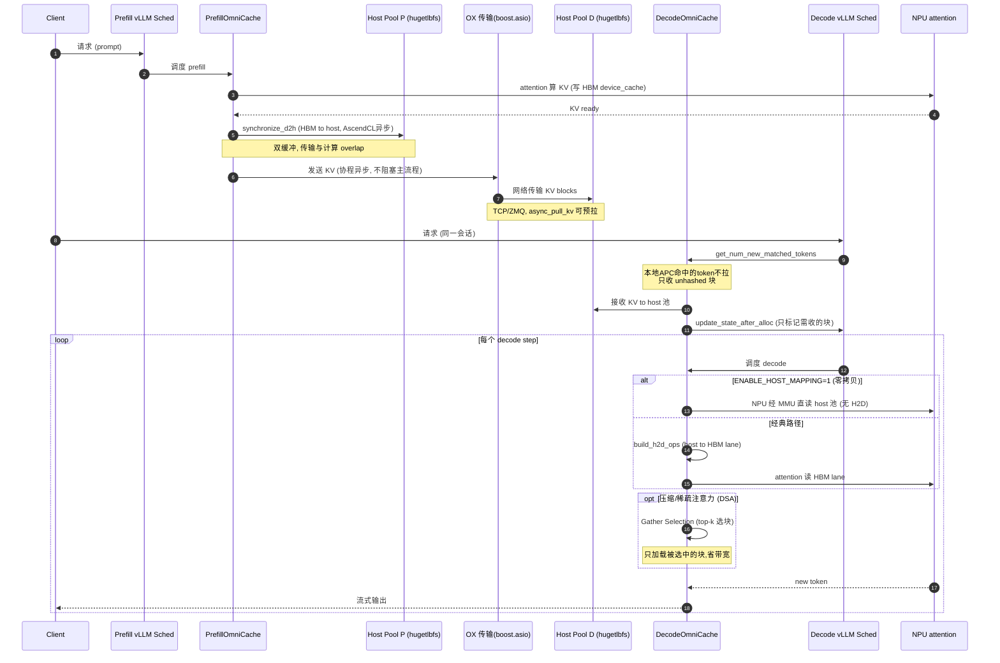

# OmniCache — 昇腾 KV Cache 优化深度分析

> 代码：本目录 `omni-cache/`（约 17.8K 行 Python + OX(boost.asio) C++ 传输后端 + Ascend tensor_register C++ 扩展）
> 定位：面向 vLLM 的 **PD 分离（Prefill/Decode disaggregation）KV Cache 管理插件**，跑在华为昇腾 NPU + CANN
> 分析方法：自底向上读核心代码（base/memory_pool/zero_copy/transfer_engine/gather_selection/connector），所有结论标 `file`

---

## 0. 一句话本质

OmniCache 用 **hugetlbfs 主机内存池 + NPU MMU 零拷贝映射 + OX 异步网络传输** 三件套，把 PD 分离里"KV Cache 在 P/D 两侧反复挤占 HBM"这个核心矛盾拆掉：
- **HBM 不再是 KV 的常驻地**，主机大内存池才是 → 序列长度 / 并发数大幅放开；
- **host 内存被 NPU 直接寻址**（`aclrtHostRegister MAPPED`）→ Decode 侧省掉 H2D 拷贝；
- **持久化 host 池**让多轮对话的 APC（Automatic Prefix Cache）命中率大幅提升；
- 叠加 **Gather Selection 稀疏加载 + 压缩注意力**，长序列 decode 只搬"被 top-k 选中"的块。

---

## 1. 解决的核心问题（为什么要做）

PD 分离架构（Prefill 节点算首 token、Decode 节点续生成）本身能解耦两类负载，但带来三个新痛点，OmniCache 逐个对症：

| 痛点 | 传统做法的代价 | OmniCache 的抓手 |
|------|---------------|-----------------|
| **HBM 内存墙** — P/D 两侧都要常驻 KV，挤占 HBM，限制 seq_len 与并发 | KV 全程占 HBM | 主机 hugetlbfs 池作中间层，HBM 只留"工作集" |
| **PD 传输开销** — P 算完的 KV 要搬到 D | 走慢速通道、阻塞主流程 | D2H→OX(协程异步)→H2D 全链路流水线，OX 用 boost.asio coroutine |
| **H2D 拷贝开销** — D 侧收到 KV 还要拷进 HBM 才能算 | 每块都 memcpy | `ENABLE_HOST_MAPPING`：NPU MMU 直接映射 host 内存，零 H2D |
| **多轮对话重复 prefill** — 历史 KV 丢了要重算 | APC 命中率受 HBM 容量限制 | host 池持久化，APC 池容量大、命中率高 |
| **长序列 decode 带宽** — 全量 KV 参与 attention | 内存带宽 / 算力浪费 | Gather Selection 按 top-k 只加载相关块 + 压缩注意力 |

---

## 2. 整体架构（顶层设计）

```
                    ┌──────────── Prefill 节点 (kv_producer) ───────────┐
请求 → vLLM Sched → │ PrefillOmniCache                                  │
                    │   ① attention 算 KV → 写 HBM device_cache         │
                    │   ② synchronize_d2h: HBM → host hugetlbfs 池      │
                    │   ③ OX 发送(boost.asio 协程) ───────────┐         │
                    └─────────────────────────────────────────┼─────────┘
                                                               │ OX (TCP/ZMQ)
                    ┌──────────── Decode 节点 (kv_consumer) ───┼─────────┐
                    │ DecodeConnectorScheduler                 ▼         │
请求 → vLLM Sched → │   ④ get_num_new_matched_tokens: 与本地APC拉通     │
                    │   ⑤ update_state_after_alloc: 只收 unhashed 块    │
                    │ DecodeOmniCache                                    │
                    │   ⑥ OX 接收 → host hugetlbfs 池                    │
                    │   ⑦ host_mapping: NPU MMU 映射(零H2D) 或 H2D拷贝   │
                    │   ⑧ Gather Selection: top-k 选块 → attention      │
                    └───────────────────────────────────────────────────┘
```

### 2.1 代码模块地图

| 模块 | 路径 | 职责 |
|------|------|------|
| **cache/core** | `cache/core/base.py` | `BaseOmniCache` 抽象基类；P/D 工厂 `create_omni_cache`；KV spec 解析 |
| **cache/memory** | `cache/memory/memory_pool.py` | `KVCacheMemoryPool`：hugetlbfs mmap、2MB 对齐、host↔device 映射 |
| **cache/prefill** | `cache/prefill/prefill_omni_cache.py` | P 侧：device_cache 初始化、D2H、MoME 状态 |
| **cache/decode** | `cache/decode/decode_omni_cache.py` | D 侧：H2D ops、HBM lane 池、gather 入口、fake compress metadata |
| **cache/transfer_engine** | `transfer_engine/{prefill,decode,synchronize,buffers}.py` | D2H/H2D 调度、双缓冲、流水线同步 |
| **device_backend/ascend** | `tensor_register_lib/zero_copy_npu.cpp` | **零拷贝核心**：`aclrtHostRegister MAPPED` |
| **connector** | `connector/{connector,scheduler,prefill,decode}.py` + `backends/ox/*.cpp` | vLLM KVConnector 接入 + OX 网络后端 |
| **gather_selection** | `gather_selection/core/*.py` | 压缩注意力下按 top-k 动态选块加载 |
| **attention** | `attention/{backends,metadata}/*.py` | MLA/DSA/compress/SWA 等 attention 扩展与元数据 |

---

## 3. 关键实现优化（逐个拆，带代码证据）

### 3.1 ⭐ 零拷贝：host 内存被 NPU 直接寻址（最核心）

`device_backend/ascend/tensor_register_lib/zero_copy_npu.cpp`：

```cpp
mlock(host_ptr, size);                          // 锁页，防换出
aclrtHostRegister(host_ptr, size,
                  ACL_HOST_REGISTER_MAPPED,     // ★ 关键 flag
                  &dev_ptr);                    // 返回 NPU 可寻址地址
// 然后把 dev_ptr 包成一个 PrivateUse1(NPU) 的 torch.Tensor
```

- **原理**：`ACL_HOST_REGISTER_MAPPED` 让 CANN 把这段 hugepage host 内存登记进 NPU 的 MMU 页表，NPU 算子可以**直接对 host 物理内存发起读**，不需要先 `aclrtMemcpy` 到 HBM。
- **效果**：Decode 侧 attention 直接从 host 池读 K/V（`memory_pool.py:248` 注释明确：DSA + `ENABLE_HOST_MAPPING` 时 `get_block` 返回空，**不做 H2D memcpy**）。
- **代价**：host 内存带宽 < HBM，所以配合 Gather Selection 只读"被选中"的块来摊薄。

### 3.2 ⭐ hugetlbfs 主机内存池

`cache/memory/memory_pool.py` + `MEMMAP_PATH=/dev/hugepages/omni_cache`：

- mmap 一块大 hugepage 文件做 KV 池，`HUGE_PAGE_SIZE` 2MB 对齐（`_init_memory_layout`，`aligned_rank_size` 向上取整到 2MB，保证每个 rank 张量起始地址 2MB 对齐 → 满足 NPU register 对齐要求）。
- 多进程共享：`mmap` 文件 + `rank_stride=aligned_rank_size`，TP/DP 各 rank 在同一文件不同偏移，跨进程零拷贝共享。
- 按注意力类型切分张量布局：`_get_dsa_shapes`(3 分量：k_nope/k_rope/indexer)、`_get_mla_shapes`(2 分量)、`_get_hybrid_shapes`，`head_size_ratio` 决定各分量在块内的字节占比。

### 3.3 ⭐ Gather Selection：稀疏选择性加载

`gather_selection/__init__.py` 模块注释一针见血：

> dynamically select relevant KV cache blocks based on top-k indices, reducing memory bandwidth and computation for long sequence decoding.

- 用于 **压缩/稀疏注意力**（DSA = Dynamic Sparse Attention，DeepSeek MLA + indexer；Pangu V2）。
- decode 每步由 indexer 算出 top-k 相关块索引，`SelectionBuffers` 预分配选择缓冲（`GATHER_SELECTION_POOL_SIZE=8192`，`base.py:142`），只把这些块从 host 拉进 HBM lane 参与 attention。
- `s_max_block_num`（`base.py:259`）：DSA 下所有 head 共享同一份 top-k 索引（head_num 硬编码 1），按 `pool_size/(head*block_size)` 算最大块数。
- 效果：长序列 decode 的内存带宽和算力从 O(seq_len) 降到 O(top_k)。

### 3.4 ⭐ HBM Lane 池化 + 双缓冲流水线

`cache/decode/decode_omni_cache.py`：`reserve_hbm_lane_for_request` / `get_hbm_lane_for_request` / `release_hbm_lane_for_request`（:384-433）

- HBM 里只开少量"lane"（工作缓冲区，`construct_hbm_buffer`，`base.py:337`），请求按需 reserve 一条 lane，用完释放复用 → HBM 占用与请求数解耦，只与**并发活跃数**相关。
- `transfer_engine/buffers.py`(470 行) + `synchronize.py`(669 行)：D2H/H2D 用 AscendCL stream 异步 + 双缓冲，传输与计算 overlap。

### 3.5 ⭐ APC 拉通：只传"本地没命中"的块

`connector/scheduler/decode.py`：

- `get_num_new_matched_tokens`（:54）：`count = prompt_tokens - num_computed_tokens`，**本地 APC 已命中的 token 不再从远端拉**。
- `update_state_after_alloc`（:131）：只把 `get_unhashed_block_ids`（block_hash 为 None = 本地未缓存）的块加入 `_reqs_need_recv` → **APC 命中部分零传输**。
- `async_pull_kv`（:45）：ZMQ PUB 异步预拉 KV，把传输从调度关键路径挪开。
- host 池持久化 → APC 池容量不受 HBM 限制 → 多轮对话命中率高（README 核心卖点的代码落地）。

### 3.6 压缩注意力（strided compress）

`attention/metadata/compress.py:47` `compute_compress_outlen`：

```python
return min(T, T // ratio + B)   # 压缩后长度 ≈ token数/压缩比 + batch
```

- strided 压缩：KV 按 ratio 抽样/聚合，配合 `build_fake_block_table_kernel_compress`（Triton 算子）构造"伪块表"让 attention 算子按压缩后布局读。
- `attention/backends/` 下 `mla_ext` / `dsa_ext` / `compress_ext` / `stride_compress_ext` 是按模型/压缩模式分流的后端插件（`OMNI_CACHE_ATTN_PLUGINS` 控制）。

### 3.7 工程化细节（owner 意识体现）

- **零拷贝 numpy 视图**：`torch_to_numpy_zero_copy`（多处用于 CPU 元数据），避免 host 元数据反复拷贝。
- **__slots__ + 预分配连续 buffer**：`RequestWindowState`（`base.py:87`）只存 base+state_idx，`logic_to_phys`/`logic_valid` 全在预分配大 buffer 上切视图 → 零 GC、零碎片。
- **DSA-split 双 host 池**：`ENABLE_OMNI_CACHE_DSA_SPLIT`（`base.py:226`）为窄头 DSA 再开一个 host 池，OX 拉完主池后把 DSA slot 拷到副池，读路径分离。
- **Pangu V2 block_size 强制 128**（`base.py:200`）：P(TP=8 可能报 64)/D 必须对齐 OX 传输布局，否则块语义错位——这种跨节点一致性的"颗粒度对齐"是 PD 分离最易踩的坑。

---

## 4. 全链路时序图（PD 分离一次请求）



---

## 5. 能达到的效果（量纲与机理）

> 注：仓库未附 benchmark 数据，以下为**从代码机理推导的收益方向**，非实测数字。

| 优化 | 机理 | 收益方向 |
|------|------|---------|
| host 池作 KV 常驻地 | HBM 只留工作集(lane) | **序列长度 / 并发数** 大幅放开（HBM 容量不再是硬上限） |
| 零拷贝 host mapping | 省掉每块 H2D memcpy | Decode 侧 **TTFT/TPOT 降低**、HBM 占用降低 |
| APC + host 持久化 | 历史 KV 不丢、命中不重传 | 多轮对话 **首 token 延迟大降**、重复 prefill 算力省 |
| Gather Selection + 压缩 | 长序列只搬/算 top-k 块 | 长上下文 decode **内存带宽 / 算力** 从 O(L) 降到 O(topk) |
| OX 协程异步 + 双缓冲 | 传输与计算 overlap | PD 传输 **不占主流程**、吞吐提升 |
| HBM lane 池化 | HBM 占用 ∝ 活跃并发 | 同样 HBM 撑 **更大 batch** |

**适用场景**：长序列 / 高并发 / 多轮对话 / 稀疏注意力模型（DeepSeek MLA+DSA、Pangu V2）下的 PD 分离部署，HBM 受限时收益最大。

---

## 6. 与 vLLM 原生 / vLLM-Ascend 的关系

- **接入方式**：标准 vLLM V1 `KVConnector` 插件（`kv_connector="OmniCacheConnector"`，`kv_role=producer/consumer`），不改 vLLM 调度核心 —— 与 [vLLM-Ascend 的 patch+子类策略](20260612-004952-vllm-vs-vllm-ascend-kvcache与调度-对比分析-分析.md) 互补：vLLM-Ascend 管"单机调度/算子适配"，OmniCache 管"跨 P/D 节点的 KV 流转"。
- **分工**：vLLM Scheduler 负责块的逻辑分配（`get_num_new_matched_tokens` / `update_state_after_alloc` 是 connector 回调点）；OmniCache 负责块的**物理流转**（HBM↔host↔网络）和**稀疏加载**。
- **依赖**：直接 import `omni_npu.worker.npu_model_runner.NPUModelRunner`（`base.py:34`），与昇腾 NPU runner 深度绑定。

---

## 7. 阅读路线建议

1. `cache/core/base.py` — `BaseOmniCache` + 工厂，建立全局认知（先看）
2. `device_backend/ascend/tensor_register_lib/zero_copy_npu.cpp` — 零拷贝核心（最关键，30 行看懂原理）
3. `cache/memory/memory_pool.py` — hugetlbfs 池布局
4. `cache/transfer_engine/prefill.py` + `decode.py` — D2H/H2D 链路
5. `connector/scheduler/decode.py` — vLLM 接入 + APC 拉通
6. `gather_selection/core/gather_selection.py` — 稀疏选块加载
7. `attention/metadata/compress.py` + `attention/backends/*_ext.py` — 压缩注意力
8. `connector/backends/ox/ox.cpp` — OX 协程网络传输（C++，进阶）

---

## 附：关键环境变量开关（部署抓手）

| 变量 | 默认 | 作用 |
|------|------|------|
| `ENABLE_OMNI_CACHE` | 0 | 总开关 |
| `ENABLE_HOST_MAPPING` | 1(D)/0(P) | **零拷贝**：1=NPU 直读 host，0=经典 H2D |
| `USE_OMNI_INPUT_BATCH` | 0 | 用 OmniCache 自管 input_batch（gather 用） |
| `ENABLE_OMNI_CACHE_DSA_SPLIT` | 0 | DSA 双 host 池分离 |
| `OMNI_CACHE_ATTN_PLUGINS` | — | 选 attention 后端（mla/dsa/compress/...） |
| `async_pull_kv` (kv_config) | false | ZMQ 异步预拉 KV |
| `OMNI_CACHE_PACKED_HBM` | — | HBM 紧致打包布局 |
