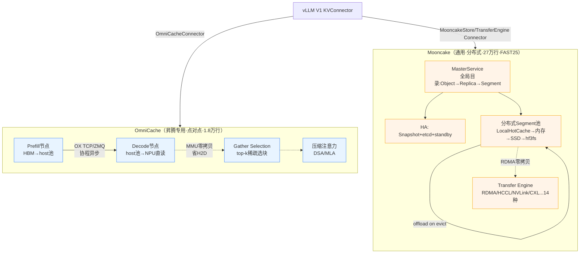

# OmniCache vs Mooncake — KV Cache 池化 / PD 分离 对比分析

> 代码基线：`omni-cache @ a57a8f0`、`Mooncake @ 94c58aa4`（均 2026-06-10）
> 对比维度：定位、架构、内存池、传输、缓存策略、稀疏/压缩、容错、vLLM 接入、昇腾适配
> 方法：两边均读到对等颗粒度（OmniCache 读 base/memory_pool/zero_copy/transfer/gather/connector；Mooncake 读 master_service/eviction/local_hot_cache/ascend_transport/storage_backend）
> 关联：[OmniCache 深度分析](20260612-012537-omni-cache-昇腾kvcache优化-深度分析-分析.md)

---

## 0. 一句话结论

**两者都做"PD 分离的 KV Cache 池化"，但根本不是一个量级、一个定位的东西：**

- **OmniCache** = 昇腾专用、**单点对单点**的 vLLM KV 传输插件（~1.8 万行 Python + OX/C++）。强在**昇腾零拷贝 + 稀疏加载**，本质是"把 HBM 压力卸到本机大内存 + NPU 直读"。
- **Mooncake** = 通用、**分布式**的 KVCache 中心化存储与传输基础设施（~27 万行 C++，FAST'25 论文，Kimi 生产平台）。强在**分布式 Store + 14 种传输后端 + 副本/驱逐/HA 一整套对象存储语义**。

> 类比：OmniCache 是"昇腾上把 KV 搬到本机内存的高速管道"；Mooncake 是"KV 的分布式 Redis/对象存储 + RDMA 传输层"。前者是点优化，后者是平台底座。

---

## 1. 定位与边界对比

| 维度 | OmniCache | Mooncake |
|------|-----------|----------|
| 本质 | vLLM 的 KV 传输 **Connector 插件** | KVCache-centric **分离式架构 + 分布式 Store** |
| 规模 | ~17.8K 行 Python + OX C++ | ~270K 行 C++（store + transfer-engine） |
| 拓扑 | **P 点 → D 点**（点对点，p_node_list 配置） | **多对多分布式**（master + 多 client + 多 segment） |
| 硬件 | **昇腾 NPU 专用**（强绑定 `omni_npu`） | **通用**：CUDA / 昇腾 / 海光 / CXL / NVLink，14 种 transport |
| 出身 | 华为昇腾生态 | Moonshot/Kimi，FAST'25，已进 PyTorch 生态 & vLLM 官方 |
| 复用性 | vLLM + 昇腾 | vLLM / SGLang / RL 训练 / 多模态，跨框架 |

---

## 2. 架构对比

### OmniCache：点对点 + 本机内存池
```
P 节点                          D 节点
HBM → host池(hugetlbfs) → OX → host池(hugetlbfs) → NPU直读(MMU零拷贝)
            ↑ 本机                      ↑ 本机           ↑ gather选块
```
- KV 的"家"是**每个节点本机的 hugetlbfs 池**；
- 传输是**自研 OX**（boost.asio 协程，TCP/ZMQ）做 P→D 的点对点搬运；
- 没有"全局 KV 目录"概念，谁的 KV 在谁本机。

### Mooncake：中心化目录 + 分布式段池 + 多级存储
```
              ┌─────────── MasterService（全局元数据/目录）───────────┐
              │  Object→Replica→Segment 映射, 副本管理, 驱逐, 任务调度  │
              └───────────────────────────┬───────────────────────────┘
   Client A ──┐         Client B ──┐       │ etcd/HA snapshot
   (vLLM P)   │ Put/Get  (vLLM D)  │ Put/Get
              ▼                    ▼
   ┌── 分布式 Segment 池（多机内存）──┐
   │  LocalHotCache(本地热) → 内存 →  │ ← offload on evict
   │  SSD(io_uring) → hf3fs 分布式FS  │
   └──────────────────────────────────┘
        ↑ Transfer Engine: RDMA/HCCL/TCP/CXL/NVLink... 14 种后端
```
- KV 是**全局对象**（key → Object → 多 Replica → 跨机 Segment），MasterService 维护目录；
- 传输是 **Transfer Engine** 抽象层，按硬件选 RDMA/HCCL/NVLink；
- **多级存储**：本地热缓存 → 内存段 → SSD → 分布式文件系统，驱逐时 `offload` 下沉。

---

## 3. 内存池 / 缓存策略对比（核心差异）

| 能力 | OmniCache | Mooncake |
|------|-----------|----------|
| 内存载体 | hugetlbfs mmap（本机 2MB 大页池） | Segment 段（多机内存）+ `LocalHotCache`（io_uring/memfd） |
| 分配器 | 自管布局（按 head_size_ratio 切 DSA/MLA 分量） | `offset_allocator` + Meta `cachelib_memory_allocator` |
| 全局目录 | ❌ 无（本机自管） | ✅ MasterService（Object/Replica/Segment 三层） |
| 副本 | ❌ 无 | ✅ `Replica`（584 处引用），多副本容错/就近读 |
| 驱逐策略 | ❌ 无显式（池满即压力） | ✅ `EvictionStrategy`（LRU，`eviction_strategy.h`），可插拔 |
| 驱逐下沉 | ❌ 无 | ✅ `offload`（146 处），驱逐到 SSD/hf3fs 而非丢弃 |
| 命中提升 | APC（vLLM 层） | ✅ `promotion`（125 处）+ `promotion_on_hit` |
| 一致性 | 进程间 mmap 共享 | ✅ `Lease` 租约（29 处）+ etcd |

> 底层逻辑差异：OmniCache 的池是**单机被动缓冲区**（满了就靠 vLLM 调度抢占）；Mooncake 的池是**主动管理的分布式缓存**，有完整的"准入-驻留-驱逐-下沉-提升"生命周期，更接近一个 KV 专用的分布式对象存储。

---

## 4. 传输层对比

| 维度 | OmniCache (OX) | Mooncake (Transfer Engine) |
|------|----------------|---------------------------|
| 实现 | 自研 `ox.cpp`（boost.asio 协程） | 14 种 transport 插件，统一 `Transport` 抽象 |
| 协议 | TCP / ZMQ | RDMA / HCCL / TCP / CXL / NVLink / NVMe-oF / EFA / MACA... |
| 昇腾路径 | OX over TCP | `HeterogeneousRdmaTransport`（异构RDMA）+ `hccl_transport` + `ubshmem_transport` + `ascend_direct_transport` |
| 零拷贝 | **NPU MMU 直读 host**（`aclrtHostRegister MAPPED`）—— 算子层零拷贝 | RDMA 网卡 DMA 零拷贝 —— 网络层零拷贝；`registerLocalMemory` 注册 RDMA MR |
| 异步 | 协程 + `async_pull_kv`(ZMQ预拉) | `submitTransfer` + `transferLoop` 后台线程 + 批量聚合(`aggTransport`) |
| 流管理 | AscendCL stream 双缓冲 | `StreamPool` 流池化复用 |

> 关键区别：**两者的"零拷贝"不在同一层**。OmniCache 是**计算侧零拷贝**（NPU 算子直接读 host 内存，省 H2D）；Mooncake 是**网络侧零拷贝**（RDMA 网卡 DMA，省 CPU 参与）。OmniCache 在昇腾上跑 TCP-OX，Mooncake 在昇腾上能跑 RDMA/HCCL —— **Mooncake 的传输后端更全、更底层；OmniCache 的零拷贝更贴近 NPU 计算。**

---

## 5. 稀疏 / 压缩 加载对比

| 能力 | OmniCache | Mooncake |
|------|-----------|----------|
| 稀疏加载 | ✅ **Gather Selection**：top-k 选块，只搬被选中的块 | ❌ 不涉及（Store 是 KV 块的通用存储，不感知 attention 稀疏性） |
| KV 压缩 | ✅ strided compress（`T//ratio+B`）+ DSA 三分量布局 | ❌ 不涉及（块语义对它透明） |
| 模型耦合 | 深度耦合 MLA/DSA/Pangu V2 注意力 | 模型无关（存什么块都行） |

> 这是 OmniCache 的**差异化护城河**：它不只是"搬 KV"，还**理解 KV 的注意力语义**，长序列 decode 只搬/算 top-k 块。Mooncake 作为通用 Store **故意不碰这层**——它要对所有模型/框架通用，attention 稀疏性留给上层引擎。**这是"专用深度"vs"通用广度"的典型取舍。**

---

## 6. 容错 / 高可用对比

| 维度 | OmniCache | Mooncake |
|------|-----------|----------|
| 副本 | ❌ | ✅ 多 Replica |
| Master HA | ❌（无中心节点） | ✅ `hot_standby_service` + Snapshot + etcd OpLog + k8s lease |
| 故障恢复 | 重新 prefill | ✅ `RestoreState` / `TryRestoreStateFromSnapshot` 状态恢复 |
| 数据迁移 | ❌ | ✅ Copy/Move/Drain 任务 + `BatchEvictDiskReplica` |

> Mooncake 是按"生产级分布式系统"做的（Kimi 线上跑），有完整 HA/快照/迁移；OmniCache 是"单链路传输插件"，没有这层——它的容错就是 vLLM 的重算。

---

## 7. vLLM 接入对比

| 维度 | OmniCache | Mooncake |
|------|-----------|----------|
| 接入点 | `OmniCacheConnector`（V1 KVConnector） | `MooncakeStoreConnector` + `MooncakeTransferEngineConnector` |
| 模式 | producer/consumer 点对点 | Store（写全局池）/ TransferEngine（点对点搬） 两种 |
| 昇腾分配器 | `omni_npu` runner 内建 | `allocator_ascend_npu.py` |
| 官方地位 | 昇腾生态插件 | **vLLM 官方集成**（2026-05 博客）、SGLang、vLLM-Omni |

> 有意思的拉通点：**vLLM-Omni 同时支持 `MooncakeStoreConnector` 和 `MooncakeTransferEngineConnector`**（README 2026-02-24）。也就是说在昇腾 omni-modality 场景下，OmniCache 和 Mooncake 是**可替换/可竞争**的两个 KV 后端选择。

---

## 8. 架构对比图



---

## 9. 选型建议（什么时候用谁）

| 场景 | 推荐 | 理由 |
|------|------|------|
| 昇腾单 P / 单 D 集群、长序列 / 稀疏注意力模型 | **OmniCache** | NPU 零拷贝 + gather 稀疏，贴 DSA/MLA/Pangu |
| 大规模分布式、跨实例 KV 共享、需要副本/HA | **Mooncake** | 分布式 Store + 多级存储 + 容错 |
| 多框架（vLLM/SGLang/RL）、异构硬件 | **Mooncake** | 通用 Transfer Engine + 跨框架集成 |
| 多轮对话、APC 命中为王、单机大内存 | **OmniCache** | host 池持久化 APC + 零拷贝读 |
| 需要 KV 落 SSD / 分布式 FS 做冷热分层 | **Mooncake** | offload-on-evict 多级存储 |
| 想要最全的 RDMA/网络传输后端 | **Mooncake** | 14 种 transport |

> 一句话：**OmniCache 是昇腾上的"深度专用件"，Mooncake 是跨平台的"通用基础设施"。** 二者在昇腾 PD 分离场景**有重叠、可竞争**，但 Mooncake 的能力面（分布式/副本/多级存储/多后端）是 OmniCache 的超集，而 OmniCache 在"NPU 计算侧零拷贝 + attention 稀疏加载"上有 Mooncake 故意不做的深度。

---

## 10. 关键差异速记（3 句话）

1. **拓扑**：OmniCache 点对点 + 本机池；Mooncake 中心目录 + 分布式段池 + 多级存储。
2. **零拷贝层级**：OmniCache 在**计算侧**（NPU MMU 直读 host，省 H2D）；Mooncake 在**网络侧**（RDMA DMA，省 CPU）。
3. **取舍**：OmniCache 理解 attention 语义（gather/压缩）换深度；Mooncake 对块透明换通用性 + 分布式 + 容错。

---

## 附：证据索引

| 结论 | 证据位置 |
|------|---------|
| OmniCache 零拷贝 | `omni-cache/.../zero_copy_npu.cpp` `aclrtHostRegister MAPPED` |
| OmniCache hugetlbfs 池 | `omni-cache/.../memory_pool.py` |
| OmniCache gather 稀疏 | `omni-cache/.../gather_selection/__init__.py` |
| Mooncake 分布式目录 | `Mooncake/.../master_service.h`（Object/Replica/Segment、Copy/Move/Drain） |
| Mooncake 驱逐/下沉 | `eviction_strategy.h`、`offload`(146处)、`storage_backend.h`(SSD/io_uring) |
| Mooncake 本地热缓存 | `local_hot_cache.h`（io_uring/memfd 跨进程） |
| Mooncake 昇腾传输 | `.../transport/ascend_transport/`（HeterogeneousRdma/hccl/ubshmem/direct） |
| Mooncake HA | `master_service.h`（Snapshot/RestoreState/etcd/standby） |
| 二者均接 vLLM-Omni | Mooncake README 2026-02-24 |
