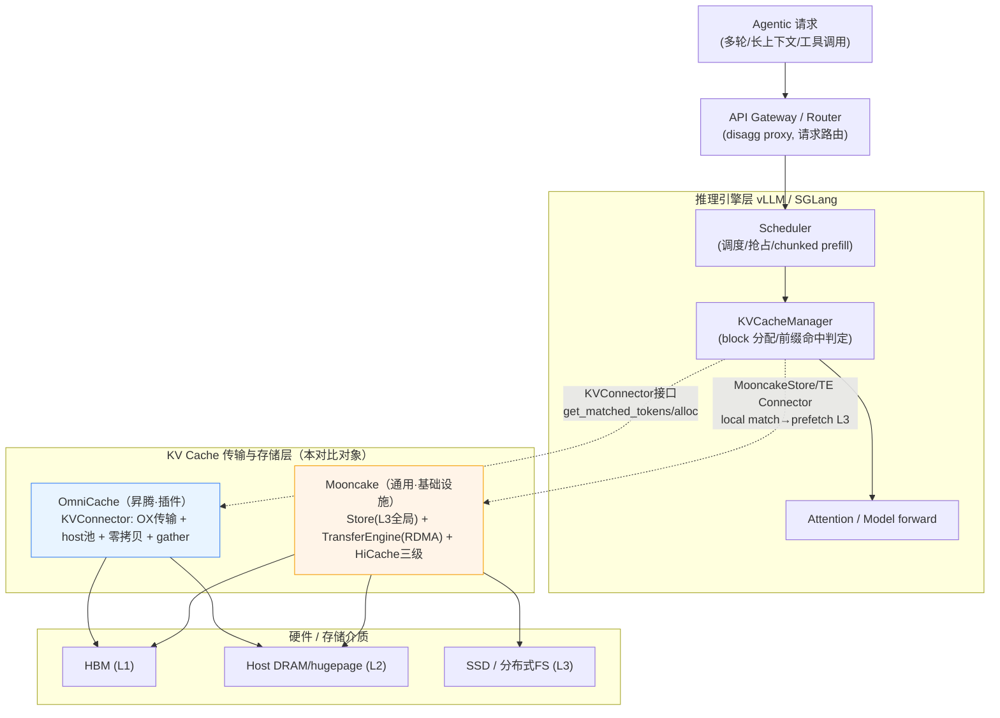

# Mooncake vs OmniCache — 面向 Agentic Workload 的 KV Cache 性能优化对比

> 代码基线：`Mooncake @ 94c58aa4`、`omni-cache @ a57a8f0`（均 2026-06-10）
> 视角：大模型推理集群性能优化，**面向 Agentic workload 负载特征**
> 维度：核心功能 / 关键技术优化 / 量化收益（标注出处）/ 在 e2e 推理系统中的位置与关系
> 关联：[OmniCache 深度分析](20260612-012537-omni-cache-昇腾kvcache优化-深度分析-分析.md)、[OmniCache vs Mooncake 通用对比](20260612-013306-omnicache-vs-mooncake-kvcache池化对比-分析.md)

---

## 0. 先对齐：Agentic workload 的 KV 负载特征（对比的"标尺"）

不先定义负载特征，对比就是空谈。Agentic（Agent/多轮工具调用/Coding）的 KV 行为有 5 个硬特征，每个都直接拷打 KV 系统：

| Agentic 特征 | 对 KV 系统的要求 | 谁更扛得住（预判） |
|------------|----------------|------------------|
| **超长上下文**（工具结果/代码/历史不断累积） | KV 容量要远超单卡 HBM | 二者都卸载到 host；Mooncake 还有 L3 分布式 |
| **高 prefix 复用**（system prompt/工具定义/历史在多轮间重复） | 全局前缀缓存 + 高命中率 | **Mooncake**（HiRadixTree 全局共享）vs OmniCache（本机 APC） |
| **多轮 / 长会话**（一个 session 反复进出） | KV 持久化、跨步不丢、命中即省 prefill | 二者都强调 APC/持久化 |
| **高并发会话爆炸**（成百上千 agent 并发） | 跨实例 KV 共享、负载均衡、过载保护 | **Mooncake**（分布式 Store + early-reject + 调度） |
| **工具调用打断 / KV 频繁换入换出** | 冷热分层、驱逐下沉而非丢弃 | **Mooncake**（L1/L2/L3 + offload-on-evict） |

> 底层逻辑：Agentic 负载的胜负手是 **"KV 复用率"和"容量弹性"**——上下文越长、prefix 复用越多、并发越大，谁能把"已经算过的 KV"以最低成本喂回来，谁就赢。这正是两者分野的地方。

---

## 1. 定位与体量（一句话拉开差距）

| | OmniCache | Mooncake |
|--|-----------|----------|
| 本质 | 昇腾 PD 分离的 **KV 传输插件 + host 存储层** | KVCache-centric **分离式架构 + 分布式 KV Store + 传输引擎** |
| 体量 | ~17.8K 行 Python + OX/C++ | ~270K 行 C++（store+transfer）+ 论文(FAST'25) |
| 出身 | 华为昇腾生态 | Moonshot/Kimi 生产平台，已进 vLLM 官方/PyTorch 生态/SGLang |
| Agentic 适配 | host 池 APC（本机） | **HiCache 三级缓存 + HiRadixTree**，设计文档首句即锚定"Agentic Coding" |

---

## 2. 核心功能对比

| 功能域 | OmniCache | Mooncake |
|--------|-----------|----------|
| **KV 传输** | OX（host-to-host，ZMQ/TCP，协程异步） | Transfer Engine：RDMA/HCCL/NVLink/CXL/TCP **14 种后端** + 多 NIC 带宽聚合 + 拓扑感知路由 + 自动 failover |
| **KV 存储** | 本机 hugetlbfs 池（单机） | 分布式 Segment 池 + **三级**（L1 GPU/L2 host/L3 分布式存储） |
| **前缀缓存** | vLLM 本机 APC（block hash） | **HiRadixTree 全局前缀树**（跨实例共享，L1/L2/L3 统一） |
| **全局目录** | ❌ 无（点对点寻址） | ✅ MasterService（Object/Replica/Segment） |
| **驱逐 / 冷热分层** | ❌（池满即压力） | ✅ EvictionStrategy + **offload-on-evict**（下沉 SSD/hf3fs）+ promotion-on-hit |
| **过载保护** | ❌ | ✅ **prediction-based early rejection**（保 SLO） |
| **稀疏 / 压缩加载** | ✅ **Gather Selection + 压缩注意力**（对标 DSA/MLA） | ❌（对块透明，通用） |
| **零拷贝** | NPU MMU 直读 host（**计算侧**） | RDMA DMA（**网络侧**）+ page-first 布局 + GPU-assisted I/O |
| **容错 / HA** | ❌（靠重算） | ✅ Snapshot + etcd + hot-standby + 多副本 |
| **可观测性** | Prometheus reuse_rate + KV dump | 全套 metric manager + benchmark 套件 |

---

## 3. 关键技术优化点（各自的"护城河"）

### OmniCache 的差异化优化
1. **NPU MMU 零拷贝**（`zero_copy_npu.cpp`）：`aclrtHostRegister MAPPED`，NPU 算子直读 host 内存，**Decode 侧省掉 H2D memcpy**——这是它在昇腾上独有的、Mooncake 没做的"计算侧零拷贝"。
2. **Gather Selection 稀疏加载**：长序列 decode 按 top-k 只搬"被选中"的块，带宽 O(L)→O(topk)，深度耦合 DSA/MLA。
3. **压缩注意力**：strided compress（`T//ratio+B`）+ DSA 三分量布局。

> OmniCache 的优化是**"贴着昇腾 NPU + 特定注意力(MLA/DSA)往深里做"**——专用深度。

### Mooncake 的核心优化
1. **HiCache 三级缓存（L1 GPU / L2 host / L3 分布式）+ HiRadixTree**：把 RadixAttention 的前缀树从"仅 GPU"扩到三级，**跨实例全局共享 prefix**——这是 Agentic 高复用场景的"核武器"。local match→prefetch from L3→write-back 三段式工作流。
2. **Transfer Engine**：14 种传输后端 + 多 NIC 带宽聚合 + 拓扑感知路由 + layer-wise overlapping（传输与计算并发）+ GPU-assisted I/O kernel。
3. **KVCache-centric 调度器 + early rejection**：过载下预测性早拒，保 SLO；这是 Agentic 并发爆炸场景的关键。
4. **offload-on-evict 冷热分层**：驱逐不丢，下沉 SSD/hf3fs，命中再 promote——对工具调用频繁换入换出友好。

> Mooncake 的优化是**"把 KV 做成跨集群的分布式分层缓存系统"**——通用广度 + 系统完备。

---

## 4. 量化收益（标注出处，不编数字）

### Mooncake（有公开实测 / 论文数据）
| 指标 | 数值 | 出处 |
|------|------|------|
| 长上下文吞吐提升 | **最高 +525%**（vs baseline，满足 SLO） | FAST'25 / README |
| Kimi 线上多处理请求 | **+75%** | README（生产数据） |
| TE 传输带宽 | **87 GB/s**(4×200G) / **190 GB/s**(8×400G)，**2.4x/4.6x** vs TCP | README（40GB=128k token KVCache） |
| **cache hit 降 TTFT** | **-84%**（vs 全重算，DeepSeek-R1-671B，PD 分离，QA 场景） | 蚂蚁实测（README） |
| 拓扑感知降 TTFT | **-25%**（vs TCP，vLLM+TE） | README |
| Kimi K2 吞吐 | prefill **224k** / decode **288k** tok/s（128×H200，PD+大规模 EP） | README（2025-07-20） |
| HiCache multi-turn | "substantial improvement over non-HiCache"（multi-turn benchmark） | hicache-design.md |
| RL 权重传输 | Kimi-K2(1T) **53s→7.2s（7x）** | README（SGLang P2P，零拷贝 RDMA） |

> Mooncake 的收益**有论文 + 生产 + 第三方(蚂蚁)三重背书**，且 multi-turn/Agentic 场景有专门 HiCache benchmark。

### OmniCache（仅功能验证级 benchmark，无吞吐压测公开数）
| 指标 | 数值 | 出处 |
|------|------|------|
| N-in-flight 正确性 | N=2~16 全 PASS，0 跨话题污染 | `examples/pangu_v2_pd/README.md` |
| 吞吐（同一表） | 0.06→0.38 req/s（N=2→16） | 同上 |
| 容量/并发收益 | "much longer sequence / higher concurrency"（**定性**，无数字） | README |
| APC 命中收益 | "dramatically improves APC hit rate in multi-turn"（**定性**，无数字） | README |

> **诚实结论**：OmniCache 仓内**没有吞吐/TTFT/命中率的量化对比数据**，N-in-flight 表是**正确性回归**（防并发 KV 串话），不是性能压测，且 N=16 就撞单 decode DP 的 `max_num_seqs=16` 天花板。它的收益目前只能从机理推导（零拷贝省 H2D、host 池放大容量、gather 省带宽），**未经公开实测背书**。

---

## 5. 在 e2e 推理系统中的位置与关系

### 位置与关系拆解
1. **同一层、不同段位**：二者都位于"推理引擎 ↔ 硬件存储"之间的 **KV 传输/存储层**，都通过 vLLM 的 **KVConnector 接口**接入（`get_num_new_matched_tokens` / `update_state_after_alloc` 是共同的回调点）。
2. **引擎本体的活两者都不抢**：调度、block 分配、前缀命中判定仍归 vLLM Scheduler/KVCacheManager。它们是"KV 的搬运工 + 仓库"，不是"大脑"。
3. **覆盖深度不同**：
   - OmniCache 只到 **L1(HBM) + L2(host)** 两级，单机；
   - Mooncake 做到 **L1/L2/L3 三级** + 跨集群全局，且自带 router/调度/过载保护，**能力面是 OmniCache 超集**。
4. **可竞争可替换**：在昇腾 PD 分离场景，vLLM-Omni 同时支持 `MooncakeStoreConnector` 和 OmniCache，是同一接口下的两个 KV 后端选择。

---

## 6. 面向 Agentic：结论与选型

### 谁更适合 Agentic？
| Agentic 痛点 | OmniCache | Mooncake | 赢家 |
|-------------|-----------|----------|------|
| 超长上下文容量 | host 池(L2)，单机 | L1/L2/L3 三级，跨集群 | **Mooncake**（容量弹性更大） |
| 跨轮/跨会话 prefix 复用 | 本机 APC | **HiRadixTree 全局共享** | **Mooncake**（跨实例命中，单机命中只在本机） |
| 高并发会话爆炸 | 无过载保护 | early-reject + 调度保 SLO | **Mooncake** |
| 工具调用频繁换入换出 | 无冷热分层 | offload-on-evict + promotion | **Mooncake** |
| 昇腾 NPU + MLA/DSA 稀疏深度优化 | **零拷贝 + gather** | 不做 | **OmniCache** |

### 一句话定调
> **面向 Agentic workload，Mooncake 是更对路的"系统级答案"**——它的 HiCache 三级缓存 + HiRadixTree 全局前缀复用 + 过载调度，精准命中 Agentic 的"长上下文 + 高复用 + 并发爆炸"三大特征，且有论文/生产/第三方三重量化背书。
>
> **OmniCache 的价值在特定场景**：昇腾 NPU 上跑 MLA/DSA 稀疏模型、追求计算侧零拷贝省 HBM、单机/小规模 PD 分离时，它的"专用深度"有意义；但它缺全局共享、冷热分层、过载保护，**面向大规模 Agentic 集群是短板**，且收益未经公开实测背书。

### 一个不回避的边界
- 二者**不必二选一**：理论上可以在昇腾集群里用 Mooncake 做 L3 全局 Store + 用 OmniCache 的零拷贝/gather 做 NPU 本地优化（同为 KVConnector，但需工程整合，目前无现成方案）。
- 本文"收益"对 Mooncake 引用实测、对 OmniCache 标注"机理推导/无公开数"——**不是贬低 OmniCache，是它仓内确实没放性能数**，这是事实陈述。

---

## 附：证据索引
| 结论 | 出处 |
|------|------|
| Mooncake 525%/75%/87-190GB/s | `Mooncake/README.md` |
| Mooncake 84% TTFT(蚂蚁) / 25% TTFT | `Mooncake/README.md` |
| HiCache 三级缓存锚定 Agentic Coding | `Mooncake/docs/source/design/hicache-design.md` |
| Mooncake xPyD/multi-turn benchmark 套件 | `Mooncake/docs/source/performance/*.md`、`FAST25-release/xypd_benchmarks` |
| OmniCache N-in-flight 正确性表 | `omni-cache/examples/pangu_v2_pd/README.md` |
| OmniCache 零拷贝 | `omni-cache/.../zero_copy_npu.cpp` |
| OmniCache gather 稀疏 | `omni-cache/.../gather_selection/` |
| KVConnector 共同接口 | 两仓 connector `get_num_new_matched_tokens`/`update_state_after_alloc` |
