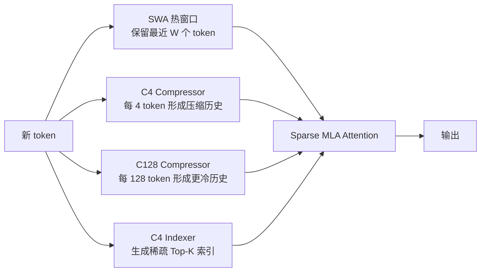
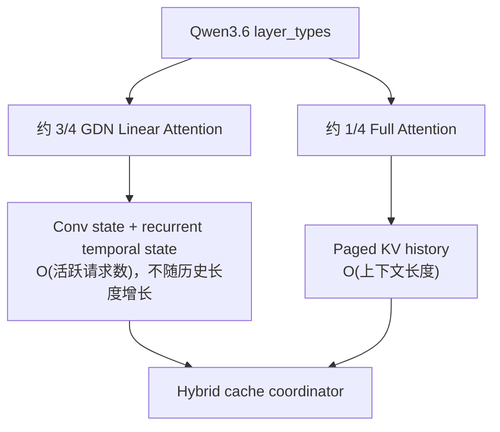
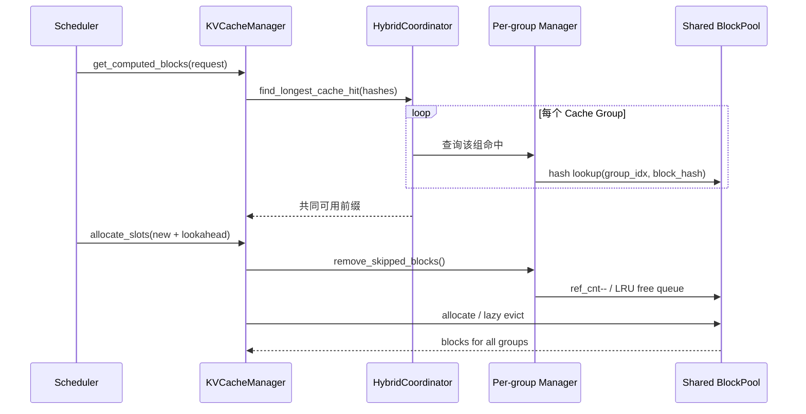
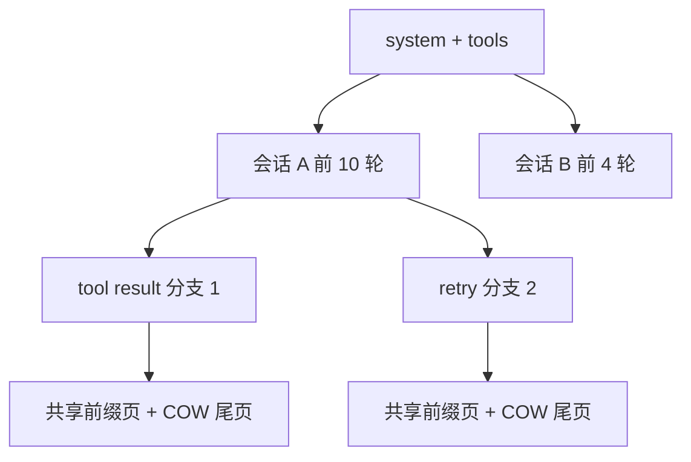
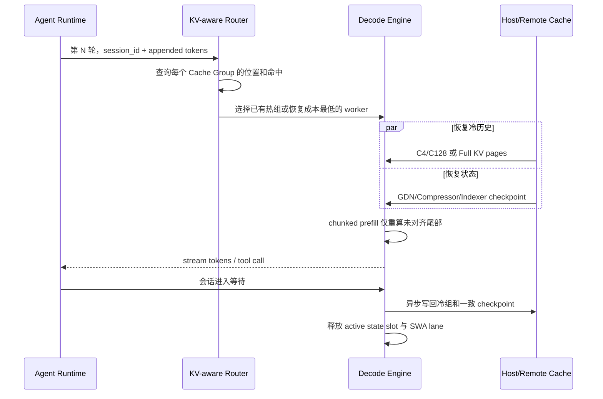
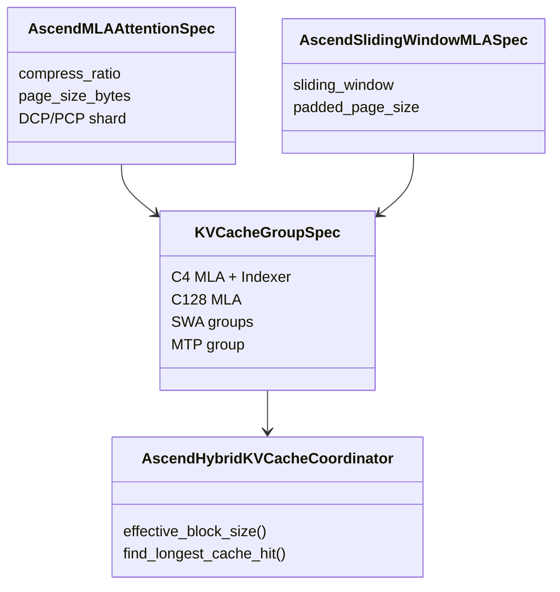

# DeepSeek V4 与 Qwen3.6 Agentic 推理 KV Cache 源码分析

> 分析对象：工作区 `/Users/linyi/code/Documents/code` 下的推理引擎、缓存系统与相关算子库  
> 代码快照：2026-06-13 本地各仓库当前提交  
> 分析重点：超大上下文、超多轮交互、非 Full Attention、吞吐与并发  
> 证据规则：`[V-*]`、`[S-*]` 等编号均指向文末的本地源码位置；“推导”和“建议”不冒充已有实现

## 1. 核心结论

1. **DeepSeek V4 的 KV Cache 不能再按“一份历史 KV”管理。** 本地 vLLM、SGLang 和 TokenSpeed 都把它拆成 SWA 热窗口、C4/C128 压缩历史、C4 Indexer KV、Compressor/Indexer 状态以及可选 MTP Cache。不同组的 token stride、生命周期和页大小都不同。[V-DS1][V-DS2][S-DS1][T-DS1]
2. **Qwen3.6 的本地服务路径是 Full Attention 与 Gated Delta Networks 混合。** 本地 SGLang 文档明确把 Qwen3.6 定义为 GDN backbone；vLLM 的 Qwen3.5/Qwen3-Next 实现是该模型族的服务代码路径，默认每 4 层有 1 层 Full Attention，其余为 GDN Linear Attention。[S-Q1][V-Q1][V-Q2]
3. **两类模型的并发瓶颈不同。**
   - DeepSeek V4：长上下文仍会使 C4/C128 历史组线性增长，主要问题是多组 HBM 容量、分配碎片、统一命中边界和稀疏页访问带宽。
   - Qwen3.6：GDN 状态不随上下文长度增长，但按“活跃请求数 × GDN 层数”增长；Full Attention 层仍保留线性历史。因此长会话更省历史容量，但高活跃并发会被每请求 recurrent state slot 限制。[V-Q3][V-Q4]
4. **Agentic 负载必须同时优化两种并发。**
   - 活跃并发：当前正在 prefill/decode、必须占 HBM slot 的请求数。
   - 驻留会话并发：处于工具调用、人工等待或下一轮到来前，状态被保留在 CPU/远端存储的会话数。
   单纯提高 `max_num_seqs` 只处理前者，不能解决大量长会话驻留。
5. **现有引擎最明显的共性限制是“用统一 token 命中表示异构状态”。** vLLM 多组命中最终取共同最短前缀；Ascend DeepSeek V4 甚至因 SWA 组命中为 0 而使 decode node 无前缀命中。更合理的接口应保留每组独立命中和恢复代价，在调度时做 group-aware 决策。[V-H3][A-H1]
6. **当前最值得优先做的优化不是扩大单一 KV 池，而是按 Cache Group 建立语义化的容量、命中、迁移和路由。** 对 DeepSeek V4，应优先迁移冷的压缩历史页，保留热 SWA 和小状态；对 Qwen3.6，应把 Full KV 与对应 GDN checkpoint 作为一致的会话恢复点。

## 2. 本地仓库范围与角色

本次分析以当前 working tree 为准，提交号用于固定基线：

| 仓库 | 分支 | 提交 |
|---|---|---|
| MindSpeed | `master` | `180f280d15` |
| MindSpeed-LLM | `master` | `49475df371` |
| Mooncake | `main` | `60452b6ecf` |
| TileRT | `main` | `242f7b30e4` |
| dynamo | `main` | `462a605b30` |
| evalscope | `main` | `aee6b841e1` |
| omni-cache | `master` | `a57a8f0cc7` |
| ops-transformer | `master` | `96fdc9eccb` |
| sgl-kernel-npu | `main` | `b2fce2cdd1` |
| sglang | `main` | `f7041c9dee` |
| speculators | `main` | `fda60c707b` |
| tokenspeed | `main` | `2aea1aafb9` |
| vllm | `main` | `0d29612292` |
| vllm-ascend | `main` | `8afdf356f6` |

| 仓库 | 本分析中的角色 | KV Cache 结论 |
|---|---|---|
| `vllm` | 通用服务引擎、PagedAttention、Hybrid KV Manager | DeepSeek V4 多组 Cache 与 Qwen GDN 状态的主参考实现 |
| `sglang` | Radix Cache、混合模型状态池、DeepSeek V4 专用后端 | 前缀树复用、Full KV/GDN 双资源管理、DSV4 稀疏 prefill/decode |
| `tokenspeed` | Cache Group 原生 scheduler、host L2 cache | DSV4 组定义最显式；Qwen/Mamba 状态已有异步 L2 路径 |
| `vllm-ascend` | vLLM 的 Ascend 补丁和 DeepSeek V4 NPU backend | 多组 CP、NPU Cache tuple、Lightning Indexer、简单 KV offload |
| `sgl-kernel-npu` | SGLang NPU 算子库 | 提供页式 MLA、GDN state update、L1/L2 copy，不负责全局分配策略 |
| `omni-cache` | Ascend PD 与 HBM/host 分层 Cache | 按 Attention/Mamba/SWA/DSA 组恢复，显式管理每请求 HBM lane |
| `dynamo` | KV-aware router、PD/disaggregated serving | 能按设备/主机/磁盘命中打分，但当前接口未表达模型内 Cache Group 语义 |
| `Mooncake` | 远端对象存储与高速传输 | 可作为共享 L3/L4，会话 Cache 的布局与一致性仍需引擎 connector 定义 |
| `ops-transformer` | KV gather/scatter、稀疏 Attention 算子 | 算子层，不拥有分配、淘汰和会话策略 |
| `MindSpeed` | 训练/Context Parallel 相关 Cache | 不是在线多租户 Paged KV Manager |
| `MindSpeed-LLM` | 模型与推理入口 | Context Parallel 与 `use_kv_cache` 有互斥约束，不是本文主服务实现 |
| `TileRT` | 专用编译/算子路径 | 有固定/预分配 Cache 路径，但不是 DSV4/Qwen3.6 通用调度器 |
| `speculators` | Draft/speculative model | Target KV 的所有权仍在主推理引擎 |
| `evalscope` | 推理评测 | 适合构造多轮、cache hit、TTFT/ITL 验证，不实现 Cache |

上述分类来自各仓库中的 allocator、cache spec、scheduler、connector 和 kernel 代码，而不是按项目名称推测。[R-1]

## 3. 两种非 Full Attention 的状态语义

### 3.1 DeepSeek V4：多时间尺度稀疏 MLA

本地 vLLM `DeepseekV4Config` 的默认最大位置长度为 1,048,576。[V-DS0] 在这个量级下，即使 C4/C128 已降低历史斜率，Cache Group 的分层和回收仍是容量设计的主问题。

本地实现呈现三类 Attention 路径：



vLLM 的 DSV4 Attention 在不同 stream 上重叠 q/KV 写入、Indexer 和 Compressor；Attention spec 分别注册 SlidingWindow MLA、压缩 MLA 与 Indexer Cache。[V-DS2][V-DS3] SGLang 同样为 SWA、C4、C128、Indexer 和 state 建立专用池。[S-DS1]

#### Cache Group 与生命周期

| 组 | 内容 | 随上下文增长 | 每请求必须常驻 | 主要回收策略 |
|---|---|---:|---:|---|
| SWA | 最近窗口的 MLA KV | 否，达到窗口后平台化 | 是 | 释放窗口前的 skipped blocks |
| C4 MLA | 每 4 token 的压缩历史 | 是 | 热会话通常是 | 前缀页 LRU、host/remote offload |
| C128 MLA | 每 128 token 的冷历史 | 是，但斜率很小 | 可按后端策略 | 优先保留或低成本恢复 |
| C4 Indexer | 稀疏检索 K 与 scale | 是 | decode 检索需要 | 与对应 C4 页保持一致 |
| Compressor state | C4/C128 rolling state | 否 | 是 | 每请求 state slot/checkpoint |
| Indexer state | Indexer rolling state | 否 | 是 | 每请求 state slot/checkpoint |
| MTP/draft | speculative lookahead 状态 | 否或小幅增长 | 启用时是 | 独立额度，回滚时一致恢复 |

#### 单层历史容量斜率

vLLM 的 DeepSeek V4 FP8 MLA 物理格式为每个存储行 584 B，即 448 B NoPE、128 B RoPE 和 8 B scale。[V-M1]

因此，不计页 padding 和 state：

```text
C4 MLA 历史       = 584 / 4   = 146 B / 原始 token / 层
C128 MLA 历史     = 584 / 128 = 4.5625 B / 原始 token / 层
C4 Indexer FP8    = 132 / 4   = 33 B / 原始 token / Indexer 层
C4 + Indexer FP8  = 179 B / 原始 token / 相关层
```

Indexer 的 FP8 行由 128 B key 加 4 B scale 构成。[V-DS4] SGLang 的 FP4 Indexer 实际按 `dim/2 + 4` 分配，而 vLLM 当前 FP4 分支仍分配与 FP8 相同的空间，源码注释明确指出只使用其中一半。[S-DS1][V-DS4] 这意味着 vLLM 的 FP4 Indexer 在当前实现下没有兑现全部 HBM 节省。

总容量不能用一个“每 token KV bytes”常数表达，而应按层数求和：

```text
M_DSV4(context, active)
  ≈ L_swa  × M_swa_window(active)
  + L_c4   × ceil(context / 4)   × 584
  + L_c128 × ceil(context / 128) × 584
  + L_idx  × ceil(context / 4)   × indexer_row_bytes
  + active × state_bytes_per_request
  + speculative_buffers
  + page_padding_and_graph_workspace
```

### 3.2 Qwen3.6：Full Attention + GDN

本地 SGLang Qwen3.6 文档明确说明 35B-A3B 与 27B 都基于 GDN，并支持 262,144 token，扩展可超过 1M。[S-Q1] vLLM 当前模型注册仍以 `Qwen3_5ForConditionalGeneration` 和 `Qwen3_5MoeForConditionalGeneration` 命名；其 config 默认每 4 层插入一层 Full Attention，其余为 Linear Attention，并分别实例化 `QwenGatedDeltaNetAttention` 与 `Qwen3NextAttention`。[V-Q1][V-Q2][V-Q5]



GDN 状态尺寸由源码直接计算：

```text
conv_dim = key_dim × num_key_heads × 2
         + value_dim × num_value_heads

conv_state =
  [conv_dim / TP, conv_kernel - 1 + speculative_tokens]

temporal_state =
  [num_value_heads / TP, value_dim, key_dim]
```

对应代码在 `MambaStateShapeCalculator.gated_delta_net_state_shape`。[V-Q3] 以本地默认 config 的 16 K heads、32 V heads、K/V dim 128、kernel 4 为例：

```text
conv state elements / TP rank     = 8192 / TP × (3 + speculative_tokens)
temporal elements / TP rank       = 32 / TP × 128 × 128
```

默认不启用 speculative 时，每个 GDN 层、每个请求、每个 TP rank 为 `548,864 / TP` 个元素。conv state 与 temporal state 的 dtype 可分别配置，所以实际字节数必须分项计算。[V-Q6]

更准确地说，vLLM 分别解析 conv state 与 temporal state 的 dtype；当 `mamba_ssm_cache_dtype=auto` 时，temporal state 与 conv state 使用同一 dtype，而不是固定 FP32。[V-Q8] 因而字节公式是：

```text
state_bytes_per_GDN_layer_per_request
  = 8192 / TP × (3 + speculative_tokens) × sizeof(conv_dtype)
  + 32 / TP × 128 × 128 × sizeof(temporal_dtype)
```

仅作为本地默认 config 的量级示例：BF16、`auto`、无 speculative 时约为 `1.047 MiB / TP / GDN 层 / 请求`。默认 32 层且每 4 层 1 个 Full Attention，即 24 个 GDN 层，对应约 `25.1 MiB / TP / 活跃请求`；512 个活跃请求仅 GDN state 就约 `12.6 GiB / TP`。这不是所有 Qwen3.6 checkpoint 的固定值，实际部署必须读取模型 config 重算。

#### 关键含义

1. 上下文从 128K 增到 1M 时，GDN state 本身不增长，Full Attention 层历史仍增长。
2. 活跃请求从 64 增到 512 时，所有 GDN 层 state 近似按 8 倍增长。
3. 推测解码会增加 conv state 的长度，并要求额外 slot 或 ping-pong buffer。
4. 因此 Qwen3.6 的调度 admission 应同时检查 Full KV block 与 GDN state slot，不能只看剩余 KV token block。

## 4. vLLM：统一 BlockPool 上的 Hybrid KV

### 4.1 内存规划

vLLM 为每类 Attention 定义 `KVCacheSpec`：

- MLA 的 `storage_block_size = block_size / compress_ratio`。[V-M1]
- Sliding Window 的最大入场块数只覆盖 `window - 1 + max_batched_tokens`，且运行时先释放 skipped blocks，所以长上下文不会让 SWA 无限增长。[V-M2]
- Mamba/GDN state 的 `all` 模式按序列块增长，`align` 只需要 `2 + speculative_blocks` 个 state page，`none` 为 `1 + speculative_blocks`。[V-M3]

DeepSeek V4 又固定了不同逻辑组的 block size：Full MLA 256、SWA 64、C4 state 4、C128 state 8，并把 C4 Indexer/C4 Attention、C128 Attention 和 SWA 分组。[V-DS5]

### 4.2 分配与回收时序



`BlockPool` 共享 free queue 与 hash map，hash 记录 `group_idx`，分配不足时按 free queue 懒淘汰。[V-H1] `allocate_slots` 在申请新块前先让 Sliding Window manager 释放 skipped blocks，并执行“整次请求是否能容纳”的 admission gate。[V-H2]

### 4.3 前缀复用的收益与损失

Hybrid coordinator 用 fixed-point 方式不断缩短候选命中，直到所有组都能支持同一长度。[V-H3] 这保证了执行正确性，但有三个吞吐代价：

1. 某个组命中短会掩盖其他组更长的命中。
2. 不同 block size 需要 LCM 对齐，可能把本可复用的尾部丢掉。
3. Sliding Window manager 的 common prefix 直接返回 0，不支持 cascade attention；这对 DeepSeek V4 的统一命中尤其不利。[V-H4]

vLLM 已提供独立 group hit API，但主调度路径仍按共同最短长度工作。[V-H3] 因此下一步应把“共同可执行前缀”和“每组可恢复前缀”同时交给 scheduler，而不是只保留一个整数。

### 4.4 Qwen GDN prefix cache

Qwen 路径明确不支持 Mamba cache `all` 模式，只能使用 `align`；启用 prefix cache 时，`align` 又强制开启 chunked prefill。[V-Q4][V-Q7]

`align` 模式本质上在可对齐边界保存一个 recurrent state checkpoint，而不是给每个历史 block 保存一份 state。优点是 state HBM 开销低；代价是：

- 只能从 state checkpoint 与 Full KV 同时有效的边界恢复。
- 边界之后的少量 token 需要重算。
- 同一步生成的新 state 不能安全共享给并发分支，需要下一轮或独立 buffer。

这与 Agentic 的 append-only 多轮非常匹配，但对任意位置分叉的搜索树不如 `all` 灵活。[V-H5]

## 5. SGLang：Radix Cache 与模型专用内存池

### 5.1 DeepSeek V4

SGLang 的 DSV4 pool 为以下对象分配独立区域：[S-DS1]

- SWA ring pages
- C4/C128 compressed pages
- C4 Indexer K/scale pages
- C4/C128 compressor state
- Indexer state

它既支持 unified layout，也支持分离 pool。统一布局把 SWA 与 compressed KV 放入同一底层张量，减少碎片和 kernel 参数；分离布局则更适合不同生命周期的独立容量控制。

decode 同时读取 SWA、C4 与 C128；sparse prefill 使用 `SparsePrefillChunkCache` 重用 workspace，并把压缩历史与 SWA 直接反量化到 workspace，源码明确避免 `torch.cat`。[S-DS2] 这减少了长上下文 prefill 的临时峰值和内存拷贝。

SGLang 的 state ring 还暴露了 speculative 约束：C4/C128 state buffer 在启用 speculative 时扩大；C128 online 模式可以把 state 数降到 1，但与 MTP 不兼容。[S-DS1]

### 5.2 Qwen3.6 与 Mamba Radix Cache

SGLang 将 Full Attention token pool 与 Mamba/GDN state pool 分开：

- `HybridLinearKVPool` 只为 Full Attention layer 建 KV pool。[S-Q2]
- `HybridReqToTokenPool` 为每个活跃请求分配一个 Mamba state slot，并维护 speculative/overlap 所需的额外 buffer。[S-Q3]
- `MambaRadixCache` 同时管理 Full KV 节点和 Mamba state 节点，各自有 lock、LRU 和淘汰路径。[S-Q4]

完成请求时，它把 Full KV 与一个 Mamba value 挂到 radix 节点；未完成请求合并时，源码选择“转让 state slot”而不是复制，以避免 forward stream 尚未结束时的数据竞争。[S-Q4]

SGLang 对 Qwen3.6 提供两种策略：

- `no_buffer`：内存更低，不做 overlap。
- `extra_buffer`：用更多 Mamba state 内存换 overlap scheduling 与 branching point caching，要求 FLA backend 和 page size 64。[S-Q1]

这正是 Qwen3.6 的核心吞吐权衡：**state slot 是按请求计费的资源，额外 buffer 提高流水并行，但会直接降低最大活跃并发。**

### 5.3 Radix 前缀复用

普通 `RadixCache` 在 page 边界匹配前缀，把 finished/unfinished request 的页挂入树，并对重复页减引用，淘汰时按 LRU/策略回收。[S-R1]

Agentic 负载中，system prompt、tool schema、仓库上下文和前几轮对话通常形成大段共享前缀，Radix Tree 比“只缓存完整请求”更适合：



但对 Qwen3.6，Radix token 节点还必须能关联同一边界的 GDN state；只命中 Full KV 而没有匹配 state，不能从该点直接继续 decode。

## 6. TokenSpeed：Cache Group 原生调度与 Host L2

TokenSpeed 对 DeepSeek V4 的 cache spec 把语义写得最直接：[T-DS1]

- SWA：sliding state
- Compressor state：sliding state
- Compressed KV：full history，`entry_stride` 为 4 或 128
- C4 Indexer state：sliding state

`PagedCacheSpec` 又把 full-history 页数按总 token 计算，把 sliding-state 页数按 live request、窗口、scheduled tokens 和碎片计算。[T-M1] C++ `PagedCacheGroup` 在 checkpoint/release 时能释放旧的 owned/borrowed page，并推进逻辑 base。[T-M2]

调度器为每个 group 注册 allocator，并定义哪些历史组是 prefix cache 的 required groups。[T-S1] 这比把所有状态压成一个 KV 数量更接近正确抽象。

### 6.1 已有优势

1. 分组容量模型清晰，可按 group 做 admission。
2. 状态组与历史组生命周期分离。
3. Mamba/GDN 已有 pinned host mirror、异步 writeback/loadback/prefetch/backup，可作为 Qwen3.6 大量驻留会话的 L2。[T-Q1][T-Q2]

### 6.2 当前限制

DeepSeek V4 pool 明确设置 `supports_hierarchical_kv_cache=False`。[T-DS2] 因此 DSV4 最需要的冷历史分层目前没有复用 TokenSpeed 的层级 Cache 能力。优化方向不是重写调度器，而是：

1. 给 DSV4 history group 实现 host/remote executor。
2. 把 C4 MLA 与 C4 Indexer 作为一致性 bundle。
3. state group 保持 HBM 或 pinned host 小对象快速恢复。
4. 让 scheduler 按 group transfer bytes 和预计等待时间决定 prefetch。

## 7. Agentic 超长多轮负载的正确 Cache 生命周期

### 7.1 负载特征

Agentic 请求通常不是连续长 decode，而是：

1. 读取大上下文并推理。
2. 发起工具调用。
3. 等待外部系统。
4. 追加工具结果，再次推理。
5. 多轮循环，期间可能分叉、重试、压缩上下文或人工介入。

这会制造大量“长历史、短增量、长空闲”的会话。若所有历史一直驻留 HBM，resident concurrency 极低；若每轮全部重算，TTFT 和计算成本极高。

### 7.2 推荐执行时序



### 7.3 模型相关的迁移优先级

**DeepSeek V4**

1. HBM 必留：当前 SWA、Compressor/Indexer state、即将使用的 Indexer 与选中历史页。
2. 优先写回：旧 C4 MLA + 对应 Indexer。
3. 可低优先级写回：C128 历史，因为容量斜率小，但恢复时仍可能需要。
4. MTP buffer 不应跨长空闲保留，除非运行时保证恢复到完全相同 speculative frontier。

**Qwen3.6**

1. 活跃时：Full KV + 每层 GDN state slot。
2. 等待时：把 Full KV 页和可恢复边界的 GDN checkpoint 写回 host/remote。
3. 恢复时：先占 state slot，再异步预取 Full KV，最后重算 checkpoint 后的小尾部。
4. 分支时：Full KV 页可 copy-on-write；GDN state 必须在分支点复制或从共同 checkpoint 重放。

## 8. 分布式 KV：Dynamo、Mooncake 与 OmniCache

### 8.1 Dynamo

Dynamo router 为每个 worker 计算 device、host、disk 三层 block overlap，并用不同 tier weight 转成 cached-token score，再结合负载、队列、ISL 和输出长度调度。[D-1][D-2] 全局 indexer 通过 worker KV event 更新 radix tree。[D-3]

**源码支持的能力**

- KV locality-aware routing
- host/disk tier score
- prefill/decode 分离与独立扩缩容
- pinned worker 与负载权衡

**由接口推导出的限制**

当前 router 的核心对象仍是统一 token block overlap；indexer 配置一个 block size。虽然 vLLM block event 带 `group_idx`，Dynamo 展示的 score 没有按 DSV4 C4/C128/SWA/Indexer 或 Qwen Full/GDN state 分别计费。[V-H1][D-1][D-3]

因此可能出现：

- worker 命中很多 C128 token block，但缺少更关键的 C4 Indexer/state。
- Full KV 命中很高，但 Qwen GDN state slot 已满或 checkpoint 不匹配。
- 以 token 数估算收益，忽略不同组每 token 字节和恢复带宽差异。

建议把路由分数改为：

```text
score(worker)
  = Σ_group(hit_bytes_group × tier_weight_group)
  - Σ_group(missing_bytes_group / estimated_bandwidth_group)
  - state_slot_pressure_penalty
  - queue_and_compute_penalty
```

### 8.2 Mooncake

Mooncake Store 支持内存、NoF、local disk、disk 多层位置选择；高水位触发批量淘汰，淘汰考虑 lease/soft-pin，并可立即 offload 或 eviction 时 offload。[M-1][M-2] Transfer Engine 提供批量异步传输接口。[M-3]

它适合作为共享冷 Cache，但本地源码没有替推理引擎定义以下模型语义：

- Cache Group ID 与 layout version
- TP/PP/CP shard 坐标
- DSV4 C4 MLA 与 Indexer 的原子一致性
- Qwen Full KV 与 GDN checkpoint 的恢复边界

因此 Mooncake 是数据面，不应被当成模型级 KV manager。connector 的 key 至少应包含：

```text
model_revision / cache_layout_version / session_or_prefix_hash
/ group_id / layer_tuple / logical_block / dtype
/ tp_rank / pp_rank / cp_rank
```

### 8.3 OmniCache

OmniCache 是本地 Ascend 场景中更接近模型语义的分层实现。decode transfer engine 按 group 类型处理：[O-1]

- Attention group：page H2D
- SWA：只恢复最新窗口
- Mamba：每请求恢复一个 state slot
- DSA：结合 host mapping 与 indexer 路径

它给每请求分配一个 HBM lane；无空闲 lane 时直接报错。[O-1] HBM buffer 对 SWA 预留窗口 ring，对 Mamba 按 `max_requests` 预留 state slot，对 Attention 按请求 offset 管理。[O-2] H2D 采用 packed fake HBM IDs，D2H 使用预分配 pinned buffer、分 stage/group 异步写回并按 TP 切分字节。[O-3]

这说明 OmniCache 能显著提高驻留会话并发，但活跃并发仍受 HBM lane 数硬限制。下一步应由 scheduler 把 lane 当成一等 admission resource，并支持：

1. 基于下一轮到达概率的 lane 保留。
2. 工具等待立即异步 demote，而不是超时后才清理。
3. group 级恢复优先级和带宽预算。
4. DSA buffer 中源码 `FIXME` 所示的 block 数/未 padding page size 准确性修正。[O-2]

## 9. Ascend NPU 专章

### 9.1 vLLM-Ascend 的 DeepSeek V4 Cache 规划

Ascend 扩展了 upstream 设计：

1. 允许多 KV Group 下使用 DCP/PCP。
2. scheduler block size 取所有 group block size 的 LCM，再乘 DCP × PCP。
3. prefix hash block size取 GCD。
4. 按 C4、C128、SWA 分组，并把 SWA page size padding 到 Full MLA 的 bucket。
5. MTP Cache 单独分配。[A-M1]



这种 bucket/shared tensor 方案减少了张量数量，便于 NPU kernel 以 tuple 访问；代价是 SWA 向较大 bucket padding，以及 layer tuple 对齐产生的内部浪费。[A-M1]

### 9.2 NPU 执行流水

DSA backend 将 compressed KV、SWA、compressor state、indexer state/key/scale 组装成 Cache tuple。[A-D1] `dsa_v1.py` 的 prefill/decode 路径使用多 stream 重叠：

- Compressor 与 Cache scatter
- query projection/quantization
- Lightning Indexer
- Top-K Cache 更新与复用
- Attention/communication

Indexer 支持跳过 top-k 并复用 `IndexCache`，减少连续 decode step 的索引开销。[A-D2]

### 9.3 Ascend 当前关键瓶颈

#### 统一 prefix hit 的 correctness/performance 缺口

`AscendHybridKVCacheCoordinator` 源码直接标注：

- DeepSeek V4 有两个 full-attention-like group，但最终只截断第一个，C128 可能保留超出最终命中的 block。
- 因 SWA hit length 为 0，DeepSeek V4 decode node 不能得到 prefix cache hit。[A-H1]

这是超长多轮 Agentic 场景的高优先级问题。建议：

1. SWA 不参与“历史共同前缀”的最短值，而按当前序列尾部单独恢复。
2. C4、C128、Indexer 分别返回 hit length 与 readiness bitmap。
3. scheduler 选取可执行 checkpoint，尾部 SWA 通过重算或 host restore 构造。
4. 最终对所有 full-history group 按各自 effective block size 截断。

#### 简单 KV Offload 的能力边界

`simple_kv_offload` 能把 tuple/list Cache 扁平化，按底层 storage 去重建立 pinned CPU mirror，用独立 NPU stream 异步传输，并通过 shape view 避免大页错误切分。[A-O1] 但它仍是 shape/block 级 offload：

- 没有模型组优先级。
- 没有远端共享索引。
- 没有会话级 state checkpoint 协议。
- NPU stream 不支持 priority，冷热恢复竞争时难以保证 decode deadline。

适合单机 HBM 扩容，不足以单独承担大规模 Agentic resident session。

#### MTP

本地 release note 记录 Qwen3.6-35B-A3B 在 Ascend 启用 MTP 时存在 shape/dtype 崩溃风险；DeepSeek V4 KV Pool 也仍有已知问题。[A-R1] 因此性能规划不能默认把 MTP 收益计入稳定基线，应单独测试 state slot、rollback 和 Cache tuple 一致性。

### 9.4 sgl-kernel-npu 的边界

`sgl-kernel-npu` 是 kernel/data movement 层，不是全局 Cache manager：

- `kvcacheio.py` 用 `aclrtMemcpy2dAsync` 批量做 L1/L2 host-device copy，包括 index K。[N-1]
- paged MLA decode 通过 block table 遍历物理页并做 online softmax。[N-2]
- causal conv 根据 `cache_indices` 读取 initial state，并用 `index_copy_` 原位写回 final state。[N-3]
- FLA chunk kernel 计算 GDN recurrent state 并输出 final state。[N-4]

因此 SGLang/OmniCache 必须负责 slot、radix、淘汰、prefetch 与一致性，sgl-kernel-npu 负责让这些动作在 NPU 上高效执行。最有价值的新增 kernel 接口是：

1. group-aware gather/scatter，单次提交 C4 MLA + Indexer bundle。
2. GDN state checkpoint batched H2D/D2H。
3. SWA ring restore，避免恢复完整逻辑序列。
4. 带 event/dependency 的高低优先级传输队列。

## 10. 瓶颈清单

| 优先级 | 瓶颈 | 代码证据 | 对吞吐/并发的影响 |
|---|---|---|---|
| P0 | Ascend DSV4 SWA 使统一 prefix hit 为 0 | `[A-H1]` | 多轮超长会话无法复用已有压缩历史 |
| P0 | Hybrid hit 只返回共同最短前缀 | `[V-H3]` | 任一组短命中拖累全部组，重算增多 |
| P0 | Qwen active concurrency 受每请求 GDN slot 限制 | `[V-Q3][S-Q3]` | context 省下的内存会被高并发 state 吃掉 |
| P1 | TokenSpeed DSV4 禁用 hierarchical cache | `[T-DS2]` | 冷 C4 历史长期占 HBM 或被直接丢弃 |
| P1 | Dynamo 路由不理解模型内 Cache Group | `[D-1][D-3]` | token hit score 与真实恢复成本偏离 |
| P1 | vLLM DSV4 FP4 Indexer 仍按 FP8 空间分配 | `[V-DS4]` | 浪费 Indexer HBM，降低并发 |
| P1 | graph/workspace 按 max context 预分配 | `[V-DS6]` | 1M context 配置即使实际较短也压缩 KV 池 |
| P1 | OmniCache 每请求 HBM lane 是硬上限 | `[O-1][O-2]` | 驻留会话可扩展，活跃会话仍会 admission fail |
| P2 | 不同 group block size 的 LCM 对齐 | `[V-DS5][A-M1]` | prefix 尾部利用率下降，短轮次更明显 |
| P2 | state/MTP buffer 扩张且部分组合不兼容 | `[S-DS1][S-Q1][A-R1]` | 推测吞吐收益可能换来更低并发或稳定性 |
| P2 | 简单 offload 无优先级和语义 bundle | `[A-O1]` | 恢复流量会干扰 decode，存在组不一致风险 |

## 11. 优化设计建议

### 11.1 P0：把 Cache Group 变成端到端一等对象

定义统一 descriptor：

```text
CacheGroupDescriptor {
  model_revision
  layout_version
  group_id
  semantic_type: HISTORY | WINDOW | RECURRENT_STATE | INDEX | DRAFT
  raw_token_stride
  physical_page_tokens
  bytes_per_page
  dtype
  shard: TP/PP/CP rank
  consistency_bundle_id
}
```

该 descriptor 应贯穿 engine allocator、prefix tree、connector、Dynamo router 和 Mooncake key。这样才能正确表达 DSV4 的多组与 Qwen 的 KV/state 配对。

### 11.2 P0：分离可执行命中与独立组命中

建议 coordinator 返回：

```text
PrefixHit {
  executable_checkpoint
  per_group_hit_length
  per_group_blocks
  missing_bytes_by_tier
  restore_or_recompute_cost
}
```

调度器可以选择：

- 等待恢复更长 group hit。
- 立即从较短 checkpoint 开始重算。
- 将请求路由到另一 worker。

这比永远取共同最短值更适合多轮和异构 Cache。

### 11.3 P0：双维度 admission

每个 worker 同时维护：

```text
active_capacity:
  free_history_pages
  free_window_lanes
  free_recurrent_state_slots
  free_speculative_slots

resident_capacity:
  host_bytes
  remote_bytes
  transfer_bandwidth_budget
  session_checkpoint_count
```

请求 admission 使用预测的**边际字节数**，不是 token 数：

```text
marginal_bytes
  = new_history_pages
  + state_slot_bytes
  + SWA/window reservation
  + speculative buffers
  + expected_restore_workspace
```

### 11.4 P1：模型相关的 tiering

**DSV4**

- 独立 quota：SWA、C4、C128、Indexer、state。
- C4 MLA 与 Indexer 使用 bundle 一致迁移。
- C128 容量小，可提高保留优先级，避免频繁远端小读。
- 修复 FP4 Indexer 物理分配。
- graph buffer 按已运行 bucket 或并发上限增长，不按 1M context 无条件顶格。

**Qwen3.6**

- Full KV 与 GDN checkpoint 共同构成 session snapshot。
- idle demotion 必须释放 active state slot。
- branch point 可选择复制 state 或从最近 checkpoint replay。
- `extra_buffer` 只对高复用/高等待收益请求启用，不全局固定开启。

### 11.5 P1：group-aware router

Dynamo 的 worker score 加入：

- 每组 hit bytes
- 每层级实际带宽
- state slot pressure
- 预计重算 FLOPs
- Cache bundle 是否完整
- 会话粘性与迁移抖动惩罚

对于 Qwen，缺少 GDN checkpoint 的 Full KV 命中不能按完整命中计分；对于 DSV4，缺少 C4 Indexer 的 C4 MLA 命中也应降权。

### 11.6 P1：工具等待感知的 demotion

Agent runtime 知道请求进入 tool wait，这比 engine 的 idle timeout 更早、更准确。建议显式发送：

```text
SESSION_SUSPEND(session_id, expected_wait_ms)
SESSION_RESUME(session_id, appended_tokens)
```

engine 可按预计等待选择：

- `< 50 ms`：保持 HBM。
- `50 ms 到数秒`：保留 state，迁移冷 history。
- `更长`：完整写回 host/remote，释放 lane/slot。

阈值应由实测 H2D/D2H 带宽与重算成本自动校准，而不是硬编码。

## 12. 验证与基准建议

### 12.1 必测 workload

1. 128K、256K、1M 初始上下文，随后 100 到 1000 轮，每轮追加 32 到 2K token。
2. tool wait 分布：10 ms、100 ms、1 s、10 s。
3. prefix sharing：0%、50%、90%。
4. branch/retry：每 10 轮产生 2 到 8 个分支。
5. active/resident 比例：1:1、1:10、1:100。
6. MTP on/off 与不同 speculative token 数。

### 12.2 指标

- `TTFT`：首轮与后续轮分开统计。
- `ITL`、output tok/s、request/s。
- active concurrency 与 resident session concurrency。
- 每个 Cache Group 的 HBM/host/remote bytes。
- per-group hit length、共同命中损失、尾部重算 token。
- H2D/D2H/remote 带宽与 decode stream stall。
- state slot、SWA lane、history page 三类 admission failure。
- 每轮工具等待期间的 HBM reclaim bytes。

### 12.3 判定优化有效

优化不能只看总 cache hit rate。至少同时满足：

1. 后续轮 TTFT 下降。
2. 同等 P99 ITL 下 active concurrency 上升。
3. 同等 HBM 下 resident session concurrency 上升。
4. transfer 增长没有让 decode stream stall 抵消收益。
5. DeepSeek V4 各组和 Qwen KV/state 恢复后结果与无 offload 基线一致。

## 13. 最终判断

面向 DeepSeek V4 与 Qwen3.6，KV Cache 的优化单位已经从“token block”升级为“模型语义状态组”：

- DeepSeek V4 需要多时间尺度历史、索引和 rolling state 的协同管理。
- Qwen3.6 需要稀疏 Full KV 历史与按请求 GDN state 的联合 admission 和 checkpoint。
- Agentic 负载需要将 HBM 活跃态与 host/remote 驻留态分离。
- 分布式路由必须看 Cache Group 的完整性、字节和恢复成本，而不只是命中 token 数。

本地代码已经分别具备这些拼图：vLLM 的 Hybrid KV Spec、SGLang 的 Radix/Mamba 双资源池、TokenSpeed 的 group-native scheduler、OmniCache 的 Ascend HBM lane 与分层传输、Dynamo 的多 tier router、Mooncake 的共享存储。当前缺失的是一套贯穿这些组件的 group-aware descriptor、checkpoint 协议和 admission/routing cost model。

---

## 14. 本地源码索引

### vLLM

- `[V-M1]` `vllm/vllm/v1/kv_cache_interface.py:352-412`，MLA compression 与 DSV4 584 B/row
- `[V-M2]` `vllm/vllm/v1/kv_cache_interface.py:459-529`，Sliding Window admission 上限
- `[V-M3]` `vllm/vllm/v1/kv_cache_interface.py:607-647`，Mamba `all/align/none` 内存模型
- `[V-DS0]` `vllm/vllm/transformers_utils/configs/deepseek_v4.py:8-22`，默认 1,048,576 最大位置长度
- `[V-DS1]` `vllm/vllm/v1/core/kv_cache_utils.py:1370-1466`，DSV4 group block size 与分组
- `[V-DS2]` `vllm/vllm/models/deepseek_v4/attention.py:440-617`，多 stream 与 Cache Spec
- `[V-DS3]` `vllm/vllm/models/deepseek_v4/compressor.py:121-169`，C4/C128 compressor state
- `[V-DS4]` `vllm/vllm/models/deepseek_v4/attention.py:661-800`，Indexer 行布局与 FP4 分配
- `[V-DS5]` `vllm/vllm/v1/core/kv_cache_utils.py:1350-1466`，Hybrid manager、block size 与 group
- `[V-DS6]` `vllm/vllm/models/deepseek_v4/sparse_mla.py:132-296`，compressed mapping/graph buffer
- `[V-H1]` `vllm/vllm/v1/core/block_pool.py:130-441`，shared pool、hash、refcount、LRU
- `[V-H2]` `vllm/vllm/v1/core/kv_cache_manager.py:202-410`，prefix hit、skipped block 回收、admission
- `[V-H3]` `vllm/vllm/v1/core/kv_cache_coordinator.py:554-731`，多组 fixed-point 命中
- `[V-H4]` `vllm/vllm/v1/core/single_type_kv_cache_manager.py:687-802`，SWA reachable mask/common prefix
- `[V-H5]` `vllm/vllm/v1/core/single_type_kv_cache_manager.py:955-1209`，Mamba align 与 state 共享约束
- `[V-Q1]` `vllm/vllm/transformers_utils/configs/qwen3_5.py:22-109`，默认 Full/GDN 层模式
- `[V-Q2]` `vllm/vllm/model_executor/models/qwen3_5.py:123-156`，GDN/Full Attention 实例化
- `[V-Q3]` `vllm/vllm/model_executor/layers/mamba/mamba_utils.py:213-234`，GDN state shape
- `[V-Q4]` `vllm/vllm/model_executor/models/qwen3_5.py:443-473`，不支持 Mamba cache `all`
- `[V-Q5]` `vllm/vllm/model_executor/models/registry.py:566-569`，Qwen3.5 dense/MoE 服务注册
- `[V-Q6]` `vllm/vllm/model_executor/models/qwen3_5.py:687-718`，Qwen state dtype/shape 入口
- `[V-Q7]` `vllm/vllm/model_executor/models/config.py:390-447`，prefix cache mode 与 chunked prefill
- `[V-Q8]` `vllm/vllm/model_executor/layers/mamba/mamba_utils.py:84-116`，GDN state dtype 解析

### SGLang

- `[S-Q1]` `sglang/docs_new/cookbook/autoregressive/Qwen/Qwen3.6.mdx:10-27,95-103`，Qwen3.6 GDN、上下文与策略
- `[S-Q2]` `sglang/python/sglang/srt/mem_cache/memory_pool.py:1752-1935`，Hybrid Linear KV pool
- `[S-Q3]` `sglang/python/sglang/srt/mem_cache/memory_pool.py:547-824`，每请求 Mamba slot
- `[S-Q4]` `sglang/python/sglang/srt/mem_cache/mamba_radix_cache.py:421-825`，Full KV/Mamba state 管理
- `[S-DS1]` `sglang/python/sglang/srt/mem_cache/deepseek_v4_memory_pool.py:30-720`，DSV4 专用池
- `[S-DS2]` `sglang/python/sglang/srt/layers/attention/deepseek_v4_backend.py:1121-1413`，decode 与 sparse prefill
- `[S-R1]` `sglang/python/sglang/srt/mem_cache/radix_cache.py:264-564`，Radix match/cache/evict

### TokenSpeed

- `[T-DS1]` `tokenspeed/python/tokenspeed/runtime/configs/deepseek_v4_cache_spec.py:23-247`，DSV4 Cache Group
- `[T-DS2]` `tokenspeed/python/tokenspeed/runtime/layers/attention/kv_cache/deepseek_v4.py:747-968`，DSV4 pool 与层级 Cache 限制
- `[T-M1]` `tokenspeed/python/tokenspeed/runtime/configs/paged_cache_spec.py:28-106`，历史/状态页容量
- `[T-M2]` `tokenspeed/tokenspeed-scheduler/csrc/resource/allocator/paged_cache_group.cpp:31-430`，分配、checkpoint、skipped release
- `[T-S1]` `tokenspeed/tokenspeed-scheduler/csrc/scheduler/scheduler.cpp:70-137`，group allocator 与 prefix cache
- `[T-Q1]` `tokenspeed/python/tokenspeed/runtime/cache/mamba_cache_host.py:54-245`，Mamba pinned host mirror
- `[T-Q2]` `tokenspeed/python/tokenspeed/runtime/cache/executor/memory_executor.py:60-363`，异步 L2 write/load/prefetch

### vLLM-Ascend 与 sgl-kernel-npu

- `[A-M1]` `vllm-ascend/vllm_ascend/patch/platform/patch_kv_cache_utils.py:23-247`，多组 CP、分组和张量 bucket
- `[A-H1]` `vllm-ascend/vllm_ascend/patch/platform/patch_kv_cache_coordinator.py:154-324`，effective block、LCM 和 DSV4 命中限制
- `[A-D1]` `vllm-ascend/vllm_ascend/ops/dsa.py:227-286`，NPU Cache tuple
- `[A-D2]` `vllm-ascend/vllm_ascend/attention/dsa_v1.py:1420-2460`，IndexCache 与多 stream prefill/decode
- `[A-O1]` `vllm-ascend/vllm_ascend/simple_kv_offload/worker.py:39-224`，tuple flatten 与异步 offload
- `[A-R1]` `vllm-ascend/docs/source/user_guide/release_notes.md:1-70`，DSV4/Qwen3.6 已知问题
- `[N-1]` `sgl-kernel-npu/python/sgl_kernel_npu/sgl_kernel_npu/kvcacheio.py:16-67`，L1/L2 copy
- `[N-2]` `sgl-kernel-npu/python/sgl_kernel_npu/sgl_kernel_npu/attention/decode_attention.py:5-166`，paged MLA
- `[N-3]` `sgl-kernel-npu/python/sgl_kernel_npu/sgl_kernel_npu/mamba/causal_conv1d.py:700-812`，state indexed update
- `[N-4]` `sgl-kernel-npu/python/sgl_kernel_npu/sgl_kernel_npu/fla/chunk.py:205-388`，GDN chunk state

### 分布式与分层 Cache

- `[D-1]` `dynamo/lib/kv-router/src/services/selection/scoring.rs:26-182`，device/host/disk score
- `[D-2]` `dynamo/lib/llm/src/kv_router/scheduler.rs:35-246`，KV-aware scheduler
- `[D-3]` `dynamo/lib/kv-router/src/indexer/kv_indexer.rs:22-247`，worker event 与全局 radix index
- `[M-1]` `Mooncake/mooncake-store/src/master_service.cpp:1422-1713,3690-3742,4977-5050`，水位/eviction/offload
- `[M-2]` `Mooncake/mooncake-store/src/client_service.cpp` 与 `real_client.cpp:287-325`，多层位置选择
- `[M-3]` `Mooncake/mooncake-transfer-engine/include/transfer_engine.h:124-155`，批量传输
- `[O-1]` `omni-cache/omni_cache/cache/transfer_engine/decode.py:239-390`，按组 H2D 与 HBM lane
- `[O-2]` `omni-cache/omni_cache/cache/decode/hbm_buffer_utils.py:55-203`，SWA/DSA/Mamba HBM buffer
- `[O-3]` `omni-cache/omni_cache/cache/transfer_engine/synchronize.py:106-430`，异步 H2D/D2H

### 其他仓库分类依据

- `[R-1]` `MindSpeed/mindspeed/core/context_parallel/`；`MindSpeed-LLM/mindspeed_llm/features_manager/context_parallel/context_parallel_feature.py:35-36`；`ops-transformer/scripts/ci/ascend910b/ops_transformer_operator_list.yaml:44-105`；`TileRT/tilert/models/deepseek_v3_2/modules/mla_v2.py:69-113`
