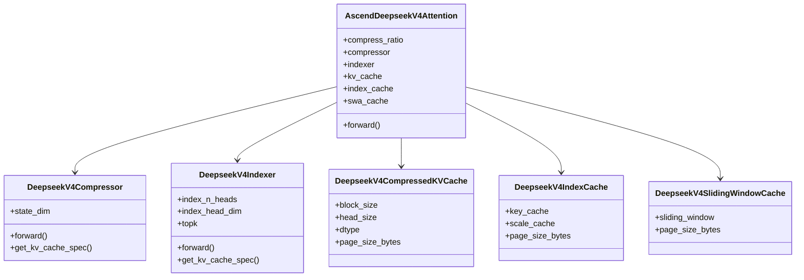
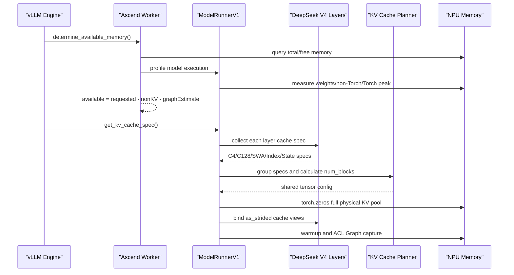
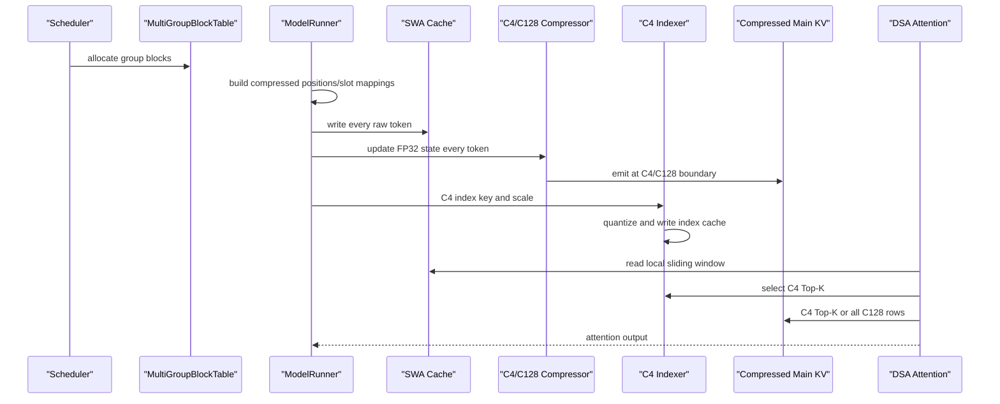
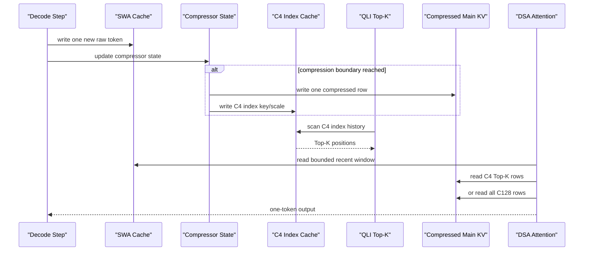

# vLLM / vLLM Ascend：DeepSeek V4 Pro / Flash KV Cache 源码深度分析

> 目标：沿“服务启动、Prefill、Decode”三条执行链，解释 DeepSeek V4 Pro / Flash 非 Full Attention 的 KV Cache 如何规划、分配、写入和读取，并分析 Agentic 长上下文、多轮交互和高并发场景下的真实显存利用率、瓶颈及优化方向。

## 1. 分析基线与结论边界

### 1.1 本地源码版本

| 仓库 | 本地路径 | Commit |
|---|---|---|
| vLLM | `/Users/linyi/code/Documents/code/vllm` | `0d29612292c6b1e312af42ac00cf649af16a438b` |
| vLLM Ascend | `/Users/linyi/code/Documents/code/vllm-ascend` | `8afdf356f6a2496bedfc538253366ef1a8c0d9aa` |

本文只把能够由上述源码直接证明的内容作为确定结论。以下内容需要特别区分：

1. **代码静态结论**：缓存布局、页大小、分配公式、读写频率、调度行为。
2. **公式推导结果**：基于代码常量和数据类型计算的字节数、页内有效率、访问比例。
3. **运行实测结果**：需要目标 DeepSeek V4 Pro / Flash checkpoint、NPU 型号、并行配置和运行日志。当前本地目录没有完整模型配置与 NPU 实测日志，因此不能虚构某个部署的“实际已用 87%”之类数字。

### 1.2 Pro 与 Flash 的源码关系

vLLM 的模型支持表把 DeepSeek V4 Flash 和 Pro 都映射到同一个模型类：

- `vllm/docs/models/supported_models.md:388`
- vLLM Ascend 注册类：`vllm-ascend/vllm_ascend/models/__init__.py:5`
- Ascend 实现类：`AscendDeepseekV4ForCausalLM`

因此，**Pro 和 Flash 并不存在两套独立 KV Cache 代码**。两者共用：

- C4 压缩注意力缓存；
- C128 压缩注意力缓存；
- Sliding Window Attention 缓存；
- C4 Indexer/QLI 索引缓存；
- Compressor 浮点状态缓存；
- MTP 独立缓存组。

二者的真实显存差异主要来自 checkpoint 配置和部署拓扑：

- `compress_ratios` 中 C4、C128、SWA 层的数量；
- 模型权重规模和量化方式；
- TP、DP、DCP、PCP；
- NPU 代际及 KV Cache 数据类型；
- `max_model_len`、并发数、block size；
- 是否启用 prefix cache、MTP、ACL Graph。

本地仓库没有 Pro/Flash 两个完整 checkpoint 的 `config.json`，所以本文不能证明它们各自精确包含多少个 C4/C128/SWA 层。代码注释里的“11 个 C4、10 个 C128、21 个 SWA”只是布局示例，不能替代实际模型配置。

## 2. 核心结论

1. **DeepSeek V4 的容量收益来自分层异构缓存，而不是一种统一 KV Cache。**  
   C4 主缓存约每 4 个原始 token 写一行，C128 约每 128 个 token 写一行，SWA 保留有限窗口，C4 Indexer 保存低字节索引键。长上下文下，C128 的渐进容量非常小，C4 主缓存只读取 Top-K。

2. **Ascend A2/A3 上主 KV Cache 默认仍按模型 dtype 存储。**  
   即使模型是 W4A8 或 W8A8，KV Cache 也不会自动变成 INT8/FP8。以 BF16、`head_size=512` 计算，每个主缓存/SWA 行为 1024 bytes；CUDA DeepSeek V4 FP8 布局为 584 bytes/行。A2/A3 每行约是 CUDA FP8 的 `1.753x`。

3. **`--gpu-memory-utilization=0.9` 不等于 KV Cache 利用率 90%。**  
   它只是设备总显存预算上限。框架先扣除权重、非 Torch 显存、Torch 峰值和估算的 Graph 显存，剩余部分才是 KV Cache 预算。

4. **vLLM Ascend 在启动时一次性 `torch.zeros` 分配完整 KV Cache 池。**  
   物理显存不是随请求懒分配；请求阶段只是在预分配池中分配逻辑 block。因此空载时“KV Cache 物理池已占用，但有效 payload 接近 0”是正常现象。

5. **当前 DeepSeek V4 压缩注意力路径跳过了 ACL Graph 显存 profiling。**  
   代码随后又会在 KV Cache 分配完成后真正 capture graph。这会让首次自动计算的 KV 预算偏乐观，运行时总占用可能高于目标比例，甚至触发 OOM。代码明确打印建议使用实际 capture 结果重新设置 `--kv-cache-memory`。

6. **C128 对超长上下文很省，但对短/中等请求有明显页尾浪费。**  
   A2/A3 一个 C128 物理页容纳 128 个压缩行，相当于 16384 个原始 token。只有 1024 token 的请求，最后一页行容量利用率仅 6.25%；8192 token 时为 50%。

7. **C4 稀疏访问降低主 KV 带宽，但没有消除索引扫描。**  
   Decode 时主 C4 缓存只读取 Top-K 压缩行；然而 QLI 仍需要扫描 C4 的 INT8/FP8 索引键历史，复杂度约为 `O(context/4)`。百万上下文下，瓶颈很可能从主 KV 读取转向索引扫描和 Top-K。

8. **DeepSeek V4 已有 compressed prefix cache 基础能力，但部署配方并未普遍启用。**  
   Pro/Flash 的多个标准服务和 Decode 节点示例明确关闭 prefix cache，而 Flash 的一个 P/D Prefill producer 示例又明确开启。代码用压缩后的逻辑 block size 做 hash，并通过 hybrid coordinator 对齐各组命中；SWA 仍可能把全局命中长度压到 0。因此它不是“完全不支持”，也不是“启用开关即可稳定跨轮复用”。

9. **worker 侧的异构 wrapper 不会原样进入 scheduler manager。**  
   `generate_scheduler_kv_cache_config()` 会把每个 `UniformTypeKVCacheSpecs` 解包成一个代表性底层 spec；Ascend 又为 DeepSeek V4 patch 了专用 coordinator 和 compressed attention manager。因此当前源码链路没有“wrapper 未注册 manager”的静态阻塞，但跨仓版本仍应通过启动测试固定。

## 3. DeepSeek V4 KV Cache 结构

### 3.1 类与缓存关系



关键构造链位于：

- `vllm-ascend/vllm_ascend/models/deepseek_v4.py:711-910`
- `compress_ratio` 读取：同文件 `:790`
- Compressor 构造：`:815-824`
- C4 Indexer 构造：`:826-834`
- IndexCache 构造：`:836-853`
- SWA Cache 构造：`:855-863`
- DSA Attention 构造：`:865-902`

`compress_ratio` 由 `get_dsv4_compress_ratio()` 从模型配置的 `compress_ratios` 数组读取：

- `vllm-ascend/vllm_ascend/utils.py:105-110`

代码中缺失配置或层号越界时返回 0。运行时常见语义是：

| ratio | 层类型 | 持久缓存 |
|---:|---|---|
| 4 | C4 | 压缩主 KV + C4 Index Cache + SWA + Compressor State |
| 128 | C128 | 压缩主 KV + SWA + Compressor State |
| 0/1 | SWA/非压缩路径 | SWA Cache |

### 3.2 Compressor State

源码：

- `vllm-ascend/vllm_ascend/models/deepseek_v4.py:598-666`

Compressor 状态使用 FP32：

- C4：`coff=2`，`state_dim = 2 * coff * head_dim`；
- C128：`state_dim = 2 * head_dim`。

当 `head_dim=512`：

| 类型 | 每个状态行的 state_dim | 每行有效字节 |
|---|---:|---:|
| C4 | 2048 FP32 | 8192 bytes |
| C128 | 1024 FP32 | 4096 bytes |

上游 `CompressorStateCache` 还定义：

- C4：`sliding_window = 2 × 4 = 8` 个状态行；
- C128：`sliding_window = 1 × 128 = 128` 个状态行。

源码：

- `vllm/vllm/models/deepseek_v4/compressor.py:121-169`

所以稳态下每个活跃请求、每个相关层的有效状态上限是：

| 类型 | 状态行数 | 有效状态总量 |
|---|---:|---:|
| C4 Main Compressor | 8 | 64 KiB |
| C4 Indexer Compressor，`head_dim=128` | 8 | 16 KiB |
| C128 Main Compressor | 128 | 512 KiB |

这些状态不随完整上下文继续线性增长，但绝不是每请求只有 4 KiB/8 KiB。
尤其在高并发短请求下，C128 的固定 512 KiB/layer/request 状态窗口及其
block 粒度可能比压缩历史本身更显著。

### 3.3 C4 Indexer

源码：

- `vllm-ascend/vllm_ascend/models/deepseek_v4.py:531-592`

Indexer 只存在于 C4 层。A2/A3 上 key 使用 INT8，scale 使用 FP16；A5 上 key 使用 FP8，scale 使用 FP32。参考实现配置还显示：

- `index_n_heads=64`
- `index_head_dim=128`
- `index_topk=512`

实际 checkpoint 参数仍应以模型配置为准。

## 4. 缓存页布局与单位显存成本

### 4.1 Ascend 页大小公式

Ascend patch 的页大小计算位于：

- `vllm-ascend/vllm_ascend/patch/platform/patch_kv_cache_interface.py:29-89`

压缩主缓存页：

```text
page_bytes = block_size * head_size * dtype_bytes
```

Indexer 页：

```text
page_bytes = block_size * (
    index_head_dim * key_dtype_bytes
    + scale_dim * scale_dtype_bytes
)
```

SWA 页仍使用实际 storage block：

- `vllm-ascend/vllm_ascend/patch/platform/patch_kv_cache_interface.py:214-230`

### 4.2 A2/A3，block size 128 的实际布局

DeepSeek V4 的 block table 特化：

- `vllm-ascend/vllm_ascend/models/layer/attention/layer.py:31-49`

A2/A3 的逻辑 block 数组：

```text
[main=128, swa=128, c4_state=8, c128_state=32]
```

canonical page padding：

```text
index_page = 16640 bytes
main_page  = 131072 bytes
```

按 BF16、`head_size=512` 计算：

| 缓存 | 物理页大小 | 一页覆盖的原始 token | 长上下文摊销 |
|---|---:|---:|---:|
| C4 Main | 131072 B | 128 × 4 = 512 | 256 B/raw token/layer |
| C4 Index | 16640 B | 128 × 4 = 512 | 32.5 B/raw token/layer |
| C128 Main | 131072 B | 128 × 128 = 16384 | 8 B/raw token/layer |
| SWA | 131072 B | 128 | 1024 B/stored token/layer |

其中 SWA 的总容量受 sliding window 上限约束，不会随完整上下文无限增长。

### 4.3 状态页 padding 利用率

Ascend 为共享 tensor 统一 page size，状态页会被 pad 到 canonical page：

| 状态 | 有效字节 | 物理页 | 页内有效率 |
|---|---:|---:|---:|
| A2/A3 C4 Main State | `8×2048×4=65536` | 131072 | 50.00% |
| A2/A3 C4 Index State | `8×512×4=16384` | 16640 | 98.46% |
| A2/A3 C128 State | `32×1024×4=131072` | 131072 | 100.00% |

上表是**单页**利用率。结合状态窗口：

| 状态 | block size | 稳态页数/活跃请求/layer | 物理容量 |
|---|---:|---:|---:|
| C4 Main State | 8 | 1 | 128 KiB |
| C4 Index State | 8 | 1 | 16.25 KiB |
| C128 Main State | 32 | 4 | 512 KiB |

这意味着仅从布局看，A2/A3 的 C4 Main State 有明确的 2 倍物理 padding，可作为容量优化点；C128 虽没有页内 padding，但固定状态窗口本身较大。

### 4.4 A5 布局

A5 强制主 Attention KV 使用 FP8，并将 `head_size` 扩为 `head_size + 128`：

- `vllm-ascend/vllm_ascend/models/layer/attention/layer.py:174-193`

因此：

```text
main_page  = 128 × 640 × 1 = 81920 bytes
index_page = 128 × (128 × 1 + 1 × 4) = 16896 bytes
```

| 缓存 | 长上下文摊销 |
|---|---:|
| C4 Main | 160 B/raw token/layer |
| C4 Index | 33 B/raw token/layer |
| C128 Main | 5 B/raw token/layer |
| SWA | 640 B/stored token/layer |

A5 状态页有效率：

| 状态 | 有效字节 | 物理页 | 页内有效率 |
|---|---:|---:|---:|
| C4 Main State | 65536 | 81920 | 80.00% |
| C4 Index State | 16384 | 16896 | 96.97% |
| C128 State | 65536 | 81920 | 80.00% |

A5 的 C128 state block size 是 16，128 行窗口需要 8 页，物理容量为
`8×81920=640 KiB`，其中有效 FP32 state 为 512 KiB。

### 4.5 与 CUDA vLLM DeepSeek V4 FP8 布局对比

上游 CUDA 实现：

- `vllm/vllm/v1/kv_cache_interface.py:352-384`

其 DeepSeek V4 FP8 row 为 584 bytes，且：

```text
storage_block_size = block_size / compress_ratio
```

长上下文摊销：

| 缓存 | CUDA FP8 |
|---|---:|
| C4 Main | 146 B/raw token/layer |
| C128 Main | 4.5625 B/raw token/layer |
| SWA | 584 B/stored token/layer |

所以主缓存每行对比为：

```text
A2/A3 BF16: 1024 / 584 = 1.753x
A5 FP8:      640 / 584 = 1.096x
```

结论：**A2/A3 上模型权重量化为 W4A8/W8A8，并不等价于 KV Cache 也获得同等量化收益。**

### 4.6 单请求容量公式

令：

```text
L      = 当前原始上下文长度
W      = sliding window 长度
N4     = C4 层数
N128   = C128 层数
Nswa   = 仅 SWA 层数

P4     = ceil(floor(L / 4) / 128)
P128   = ceil(floor(L / 128) / 128)
Pswa   = ceil(min(L, W) / 128)
```

在 A2/A3、BF16、block size 128 下，按已分配页估算单个活跃请求的持久
cache payload：

```text
C4 layer ≈
    P4 × (131072 main + 16640 index)
    + 131072 C4-main-state
    + 16640 C4-index-state
    + Pswa × 131072

C128 layer ≈
    P128 × 131072 main
    + 4 × 131072 C128-state
    + Pswa × 131072

SWA-only layer ≈
    Pswa × 131072
```

这是请求在共享池中的逻辑占用估算，不是额外 `torch.zeros` 分配；物理池已在启动时一次性建立。Admission 阶段还可能因 speculative token、chunk 和
sliding-window recycling 上界多预留 block。

如果仅为展示渐进量级，采用 allocator 注释中的示例层数
`N4=11、N128=10`，并暂时排除 SWA、state、尾页和 MTP：

```text
A2/A3 long-context history
≈ 11 × (256 + 32.5) + 10 × 8
= 3253.5 bytes/raw-token/rank
```

对应：

| 上下文 | C4/C128 历史主体，示例层数 |
|---:|---:|
| 135000 | 约 418.88 MiB/rank |
| 1048576 | 约 3.18 GiB/rank |

这只是源码布局的示例推导，不是 Pro 或 Flash checkpoint 的实测值；实际值必须用模型自身 `compress_ratios`、`sliding_window` 和层数重算。

## 5. 服务启动阶段

### 5.1 执行时序



### 5.2 第一步：设备显存预算

源码：

- `vllm-ascend/vllm_ascend/worker/worker.py:261-316`

```text
requested_memory = total_device_memory × gpu_memory_utilization
```

随后 profile 权重、Torch 峰值和非 Torch 显存：

- `vllm-ascend/vllm_ascend/worker/worker.py:336-463`

自动模式下：

```text
non_kv_memory =
    non_torch_increase
    + torch_peak_increase
    + weights_memory

available_kv_memory =
    requested_memory
    - non_kv_memory
    - estimated_graph_memory
```

若用户显式设置 `--kv-cache-memory-bytes`，框架仍执行 profile，但最终使用手工值：

- `vllm-ascend/vllm_ascend/worker/worker.py:346-362`

因此手工值绕过的是自动 KV 上限，不是模型和 runtime 的真实显存消耗。

### 5.3 第二步：DeepSeek V4 的 ACL Graph 预算缺口

关键代码：

- `vllm-ascend/vllm_ascend/worker/worker.py:378-390`

当模型是 DeepSeek V4 compressed attention 时，代码明确跳过 ACL Graph memory profiling。之后：

- `vllm-ascend/vllm_ascend/worker/worker.py:558-635`

仍会在 KV Cache 分配完成后执行真实 Graph capture，并统计实际 graph memory。代码为下一次运行建议：

```text
suggested_kv_cache_memory =
    configured_kv_cache_memory
    - actual_graph_memory
    - 150 MiB safety margin
```

由执行顺序可得：

1. 第一次自动预算没有扣除真实 graph memory；
2. KV Cache 池先按偏大的预算分配；
3. 随后 graph capture 再申请显存；
4. `gpu_memory_utilization=0.9` 的目标可能被突破；
5. 极端情况下发生 capture OOM 或后续执行 OOM。

这是当前 DeepSeek V4 启动阶段最重要的显存真实性问题。

作为对比，上游 CUDA vLLM 的 graph profiling 链位于：

- `vllm/vllm/v1/worker/gpu_worker.py:371-524`
- Graph profiling：`:416-465`

### 5.4 第三步：收集所有层的 Cache Spec

源码：

- `vllm-ascend/vllm_ascend/worker/model_runner_v1.py:4657-4690`

ModelRunner 遍历静态 forward context，调用各 Attention 模块的 `get_kv_cache_spec()`，收集：

- C4 compressed main cache；
- C4 index key/scale cache；
- C4 compressor/indexer state；
- C128 compressed main cache；
- C128 compressor state；
- SWA cache；
- MTP cache。

### 5.5 第四步：按 Attention 类型分组

Ascend patch：

- `vllm-ascend/vllm_ascend/patch/platform/patch_kv_cache_utils.py:61-92`
- `vllm-ascend/vllm_ascend/patch/platform/patch_kv_cache_utils.py:95-184`

分组键包括：

- MLA/DSV4 的 `compress_ratio`；
- SWA 的 block/window 属性；
- C4/C128/SWA 对应不同 KV Cache group；
- state 与 index 页面按 canonical page size 对齐。

与传统所有层统一 page size 的 Full Attention 不同，DeepSeek V4 必须保留多个异构 group，调度器需要为同一请求同步维护多组 block table。

### 5.6 第五步：计算 block 数

源码：

- `vllm-ascend/vllm_ascend/patch/platform/patch_kv_cache_utils.py:187-247`

核心近似公式：

```text
layer_tuple_page_bytes = sum(canonical_page_sizes)
num_layer_tuples = max(group_layer_bucket_count) + mtp_count

num_blocks =
    available_kv_memory
    // layer_tuple_page_bytes
    // num_layer_tuples
```

这里存在一个静态可见的保守点：

- MTP 只实际使用其对应 page；
- 分母却按所有 canonical page size 的总和收费；
- planner 会生成部分 `shared_by=[]` 的空 tensor；
- 后续物理分配循环不会为这些空 tensor 分配 storage。

因此计划公式可能低估 `num_blocks`，造成部分 KV 预算没有转化为可调度 block。上游 vLLM allocator 则按 page size bucket 精确计算：

- `vllm/vllm/v1/core/kv_cache_utils.py:1196-1244`

### 5.7 第六步：一次性物理分配

入口：

- `vllm-ascend/vllm_ascend/worker/model_runner_v1.py:3700-3813`

具体分配：

- `vllm-ascend/vllm_ascend/worker/model_runner_v1.py:3929-4109`

DeepSeek V4 compressed path对每个有使用者的共享 tensor：

```python
torch.zeros(size, dtype=torch.int8, device=self.device)
```

即：

- 启动时分配完整 raw byte storage；
- 请求到来时不再创建大 tensor；
- 逻辑 cache 通过 view/offset 映射到预分配 storage；
- 初始内容为 0；
- 空 `shared_by` 配置不会实际分配。

KV transfer 模式还会：

1. 申请 `size + 2 MiB`；
2. 对齐可见地址；
3. 保留底层完整 storage。

所以每个 unique shared tensor 最多会产生约 2 MiB 对齐额外占用。

Cache view 绑定：

- `vllm-ascend/vllm_ascend/worker/model_runner_v1.py:4111-4141`

按 page size 反推出 block 数并 reshape：

- `vllm-ascend/vllm_ascend/worker/model_runner_v1.py:4173-4225`

## 6. Prefill 阶段

### 6.1 执行时序



### 6.2 Block Table 与压缩位置

ModelRunner 为各 group 构建压缩后的位置和 slot mapping：

- `vllm-ascend/vllm_ascend/worker/model_runner_v1.py:1219-1262`
- helper：`vllm-ascend/vllm_ascend/utils.py:1477-1543`

对 `compress_ratio > 1`：

```text
compressed_history_len = floor(raw_history_len / ratio)
compressed_total_len   = floor(raw_total_len / ratio)
```

只有新完成一个压缩窗口时，才产生新的 compressed position：

```text
C4:   每完成 4 个 raw tokens 生成 1 行
C128: 每完成 128 个 raw tokens 生成 1 行
```

Block table：

- `vllm-ascend/vllm_ascend/worker/block_table.py:12-268`
- 多组封装：`:271-405`

它根据每组 `compress_ratio` 缩减每请求最大 block 数，并用压缩 position 计算目标 slot。

### 6.3 Attention Metadata

构造入口：

- `vllm-ascend/vllm_ascend/worker/model_runner_v1.py:2942-3240`

每个 KV group 独立生成：

- block table；
- slot mapping；
- sequence length；
- query start location；
- unused slot 使用 `-1` padding。

DSA metadata：

- `vllm-ascend/vllm_ascend/attention/dsa_v1.py:604-860`

压缩输出条件：

```text
(position + 1) % compress_ratio == 0
```

压缩窗口起点：

```text
start_position = position + 1 - compress_ratio
```

这保证 chunked prefill 跨 chunk 时仍由持久 Compressor State 接续，不要求在激活显存中保留完整历史。

### 6.4 Prefill 内核读写链

核心 forward：

- `vllm-ascend/vllm_ascend/attention/dsa_v1.py:1866-2184`

执行顺序：

1. 解包 main cache、state cache、index cache、SWA cache；
2. 每个原始 token 写 SWA：`:1983-1984`；
3. C4 执行 Indexer 选择和索引缓存写入：`:2012-2054`；
4. Compressor 更新 FP32 状态并生成压缩 KV：`:2058-2078`；
5. 压缩行 scatter 到 persistent cache：`:2096-2098`；
6. QLI 对 C4 索引键执行 Top-K：`:2110-2130`；
7. C4 Attention 读取 SWA + Top-K compressed rows：`:2135-2159`；
8. C128 Attention 读取 SWA + 全部 C128 compressed rows：`:2160-2183`。

因此 Prefill 的持久缓存写入频率为：

| 缓存 | 写入频率 |
|---|---|
| SWA | 每个原始 token |
| C4 Main | 每 4 token 一行 |
| C4 Index | 每 4 token 一行 |
| C128 Main | 每 128 token 一行 |
| Compressor State | 每 token 更新，固定大小 |

Chunked Prefill 能限制单次激活峰值，但不会减少最终需要保存的压缩历史，也不会自动提高跨请求复用率。

## 7. Decode 阶段

### 7.1 执行时序



### 7.2 Decode 内核链

核心代码：

- `vllm-ascend/vllm_ascend/attention/dsa_v1.py:2186-2507`

逐步行为：

1. 新 token 写入 SWA：`:2315-2316`；
2. C4 计算 Indexer，或读取 IndexCache：`:2331-2365`；
3. 更新 Compressor State：`:2370-2389`；
4. 仅在压缩边界产生可写 cache row；
5. compressed row scatter：`:2404-2406`；
6. QLI 扫描 C4 索引键并选择 Top-K：`:2418-2438`；
7. 可选 IndexCache 保存/复用 Top-K 结果：`:2440-2441`；
8. C4 读取 SWA + Top-K main KV：`:2464-2485`；
9. C128 读取 SWA + 全部 C128 main KV：`:2486-2506`。

Indexer 细节：

- `vllm-ascend/vllm_ascend/attention/dsa_v1.py:2509-2704`

它包含索引键压缩、量化 scatter 和历史 key scan。

### 7.3 Decode 的容量与访问不是同一件事

假设 C4 `topk=512`：

| 原始上下文 | C4 resident rows | 主 KV 每步读取比例 |
|---:|---:|---:|
| 135000 | 33750 | `512/33750 = 1.52%` |
| 1048576 | 262144 | `512/262144 = 0.195%` |

这解释了 C4 对超长 Decode 的价值：

- 驻留的 C4 main KV 仍随上下文增长；
- 每步真正读取的 main KV 只取 Top-K；
- 主 KV 带宽从 `O(L/4)` 降到近似 `O(K)`。

但 QLI 仍需扫描 C4 index key：

```text
index scan complexity ≈ O(L/4)
```

所以超长上下文下不能只看“main KV 读取 0.195%”就认为 Attention 已完全变成常数开销。Indexer scan、Top-K 和 index cache 带宽会成为下一层瓶颈。

C128 路径没有 C4 Top-K，而是读取全部压缩行：

```text
C128 read complexity ≈ O(L/128)
```

其渐进字节数很低，但短上下文的页尾利用率较差。

### 7.4 IndexCache

构造：

- `vllm-ascend/vllm_ascend/models/deepseek_v4.py:836-853`

运行路径：

- `vllm-ascend/vllm_ascend/attention/dsa_v1.py:1476-1485`
- `vllm-ascend/vllm_ascend/attention/dsa_v1.py:1532-1538`
- Prefill/Decode 主链中的 IndexCache 分支。

测试示例使用频率 4：

- `vllm-ascend/tests/e2e/pull_request/four_card/test_deepseek_v4.py:79-110`

它允许若干 C4 层复用索引选择结果，主要减少 Indexer/Top-K 计算和同步开销。它**不会降低主 KV 历史本身的容量**。

## 8. “真实显存利用率”应拆成四个指标

单一利用率数字无法正确描述该实现。

### 8.1 规划利用率

```text
η_plan =
    planner_denominator_used_bytes
    / available_kv_memory
```

`num_blocks` 使用整数除法，理论余数小于一个完整 layer tuple 的分母。单看该数字通常接近 100%，但它只表示公式“装满了预算”，不代表物理分配或 payload 有效。

### 8.2 物理分配利用率

```text
η_alloc =
    sum(unique_underlying_storage_nbytes)
    / available_kv_memory
```

它可能低于规划值：

- MTP 分母按所有 page 类型收费，但部分 tensor `shared_by=[]`；
- 空 tensor 不进行物理分配；
- page size bucket 和 layer tuple 对齐产生离散余量。

它也可能表现为高于预期：

- KV transfer 每个 storage 最多约 2 MiB 对齐开销；
- ACL Graph 的实际显存没有在 DSV4 初次 KV 预算中扣除；
- allocator reserved memory 与 tensor logical nbytes 不完全相等。

### 8.3 Payload 占用率

```text
η_payload =
    live_requests_useful_cache_bytes
    / physical_kv_pool_bytes
```

启动完成、无请求时：

```text
physical pool 已完整分配
useful payload ≈ 0
η_payload ≈ 0
```

随着并发和上下文增长，payload 才逐步填充 block。这个指标需要 scheduler 的 used/free blocks 和每组有效 token 数才能计算。

### 8.4 Decode 访问利用率

```text
η_access =
    bytes_read_by_attention_this_step
    / useful_resident_cache_bytes
```

C4 main cache 在百万上下文下可能低于 0.2%，但 index key scan 仍接近 100% 扫描其有效索引历史。因此至少要分别监控：

- C4 main KV read bytes；
- C4 index read bytes；
- C128 main KV read bytes；
- SWA read bytes；
- HBM bandwidth；
- Top-K/Indexer kernel duration。

## 9. 页内有效率：C128 的短上下文问题

A2/A3 一个 C128 page 有 128 个压缩行，每行代表 128 个原始 token：

```text
effective_raw_tokens_per_page = 128 × 128 = 16384
```

按单个请求已经分配的全部 C128 页，计算总体行容量利用率：

| 原始上下文 | 压缩行数 | 已分配页总体容量利用率 |
|---:|---:|---:|
| 128 | 1 | 0.78% |
| 1024 | 8 | 6.25% |
| 8192 | 64 | 50.00% |
| 16384 | 128 | 100.00% |
| 135000 | 1054 | 约 91.49% |
| 1048576 | 8192 | 100.00% |

其中 135000 token 会分配 9 页、共 1152 行容量；总体利用率是
`1054/1152=91.49%`，但最后一个尾页本身只有 `30/128=23.44%`。

这带来一个容易被“8 B/raw token”渐进公式掩盖的问题：

- 超长请求：C128 极其高效；
- 高并发短/中请求：每个请求都可能占一个未填满的尾页；
- 1024-token Agentic 短请求仅写 8 行，却可能占 128 行容量；
- scheduler block 粒度决定了尾页无法借给其他请求。

C4 的一页覆盖 512 个原始 token，尾页问题明显小于 C128。

## 10. Agentic 多轮负载分析

### 10.1 单请求内部

长推理链或一次请求内的多轮 tool reasoning 能从 DSV4 结构直接获益：

- SWA 只保留有限局部窗口；
- C4 主历史按 1/4 压缩；
- C128 主历史按 1/128 压缩；
- C4 main decode 只读取 Top-K；
- Compressor State 大小固定；
- chunked prefill 限制激活峰值。

### 10.2 跨请求多轮

官方配方并不统一：

- Flash 标准 A2 示例明确关闭：`vllm-ascend/docs/source/tutorials/models/DeepSeek-V4-Flash.md:147-176`
- Pro 标准 A2 示例明确关闭：`vllm-ascend/docs/source/tutorials/models/DeepSeek-V4-Pro.md:168-210`
- Flash P/D 的 Prefill producer 明确开启：`vllm-ascend/docs/source/tutorials/models/DeepSeek-V4-Flash.md:616-661`
- 同一 P/D 配方的 Decode consumer 明确关闭：同文件 `:698-742`

典型 OpenAI-compatible Agentic 服务每轮会重新提交：

```text
system + 历史消息 + tool results + 当前用户输入
```

当实际部署关闭 prefix caching 时：

1. 上一轮请求结束，逻辑 KV block 被释放；
2. 下一轮重新 Prefill 相同历史；
3. C4/C128/SWA/Index 都重新生成；
4. 长历史的 TTFT 和 Prefill token throughput 成为主要成本；
5. KV 压缩减少了驻留显存，但没有消除重复计算。

当前代码已经实现 compressed prefix cache 的关键基础：

- `CompressAttentionManager` 用 `block_size × compress_ratio` 作为逻辑 hash block；
- 相同完整逻辑块可以命中，不完整或内容变化的逻辑块会拒绝；
- 单元测试：`vllm-ascend/tests/ut/test_compressed_prefix_cache.py:82-147`；
- hybrid coordinator 对多个 cache group 迭代收敛到共同命中长度；
- coordinator 代码注释指出，Decode 节点上 SWA 的命中长度可能为 0，从而令 DeepSeek V4 的全局 prefix hit 为 0：
  `vllm-ascend/vllm_ascend/patch/platform/patch_kv_cache_coordinator.py:310-324`。

因此 Agentic 跨轮复用必须按实际服务拓扑验证，不能只检查
`--enable-prefix-caching` 是否打开。

因此“超大轮次”优化不能只做压缩 Attention，还需要：

- 跨请求 prefix block reuse；
- session-aware routing；
- persistent KV/session cache；
- P/D 分离下的 KV transfer；
- 对系统提示、工具定义和稳定历史的分段复用。

### 10.3 并发场景的主要限制

| 场景 | 容量/性能主限制 |
|---|---|
| 大量短请求 | C128 尾页、固定 state、scheduler block 粒度 |
| 中等上下文高并发 | 多组 cache 同步分配、尾页、SWA 占用 |
| 超长 Prefill | 激活峰值、HBM 写入、Compressor/Indexer 计算 |
| 超长 Decode | C4 index scan、Top-K、SWA + C128 读取 |
| 高频多轮会话 | prefix 未启用或被 SWA/拓扑约束时重复 Prefill |
| MTP Decode | 独立 MTP shard 与 planner 保守收费 |

## 11. Pro / Flash 部署参数能证明什么

Flash 文档：

- `vllm-ascend/docs/source/tutorials/models/DeepSeek-V4-Flash.md`
- W8A8-MTP 至少一台 A3 或 A2 节点：`:16`
- A2 示例：`max_model_len=133120`、`max_num_seqs=32`、TP8、block128、MTP1、`gpu_memory_utilization=0.9`：`:147-176`
- A3 示例：`max_model_len=1048576`、`max_num_seqs=64`、DP4/TP4、block128、MTP1：`:196-224`

Pro 文档：

- `vllm-ascend/docs/source/tutorials/models/DeepSeek-V4-Pro.md`
- W4A8-MTP 需要 2 台 A3 或 4 台 A2 节点：`:18`
- A2 示例：`max_model_len=135000`、`max_num_seqs=16`、DP4/TP8、block128、MTP1：`:168-210`
- A3 示例：`max_model_len=135000`、`max_num_seqs=32`、DP2/TP16、block128：`:323-354`

这些参数只能说明官方经过验证的部署边界，不能直接推出单卡 KV Cache 占用率。尤其：

- `max_num_seqs` 是调度上限，不等于所有序列同时达到 `max_model_len`；
- `gpu_memory_utilization=0.9` 是总预算目标，不是有效 KV payload；
- DP 会复制权重和各自维护 KV 池；
- TP/DCP/PCP 改变每 rank 局部缓存和通信；
- Pro 更大的总体模型/节点需求会改变每 rank 可留给 KV 的显存。

量化配置：

- `vllm/vllm/models/deepseek_v4/quant_config.py:29-46`

主要控制 Linear、Attention weight 和 MoE expert weight dtype；它不直接把 A2/A3 KV Cache 改为 FP8。

## 12. Worker 布局与 Scheduler 管理器如何衔接

Ascend DSV4 grouping 产生 `UniformTypeKVCacheSpecs`：

- `vllm-ascend/vllm_ascend/patch/platform/patch_kv_cache_utils.py:95-184`

worker 需要保留 wrapper，因为同一调度 group 内可能包含不同 page size 的实际层 cache。物理 KV 配置生成后，engine 会构造 scheduler 专用配置：

- 调用入口：`vllm/vllm/v1/engine/core.py:283`
- 转换函数：`vllm/vllm/v1/core/kv_cache_utils.py:1698-1717`

`generate_scheduler_kv_cache_config()` 对每个 `UniformTypeKVCacheSpecs` 执行：

```python
group.kv_cache_spec = next(
    iter(group.kv_cache_spec.kv_cache_specs.values())
)
```

因此 scheduler coordinator 看到的是代表性底层 `MLAAttentionSpec` 或 `SlidingWindowMLASpec`，不是 wrapper 本身。

Ascend 同时 patch 了 DeepSeek V4 coordinator：

- `vllm-ascend/vllm_ascend/patch/platform/patch_kv_cache_coordinator.py:38-55`
- DeepSeek V4 分流：同文件 `:327-355`
- 专用 `AscendHybridKVCacheCoordinator`：同文件 `:58-324`

它调用 Ascend 自己的 manager factory：

- `vllm-ascend/vllm_ascend/core/single_type_kv_cache_manager.py:239-290`

其中 `MLAAttentionSpec` 且 `compress_ratio > 1` 会映射到 `CompressAttentionManager`；manager 在申请 block 前把 token 数除以压缩比：

- `vllm-ascend/vllm_ascend/core/single_type_kv_cache_manager.py:29-58`
- 新 block 分配：同文件 `:130-155`

这形成完整衔接：

```text
worker wrapper layout
→ scheduler config 解包成代表性 spec
→ Ascend DeepSeek V4 coordinator
→ CompressAttentionManager
→ 按 C4/C128 压缩 token 数申请共享 block
```

所以当前源码不能支持“wrapper manager 缺失导致必然启动失败”的结论。仍建议固定 vLLM/vLLM Ascend 匹配版本，因为两仓都在持续修改 KV layout、manager API 和 prefix cache 语义；该建议属于集成风险控制，不是本文已识别的确定 bug。

## 13. 优化建议

### P0：先保证显存预算可解释、可复现

1. **补齐 DeepSeek V4 ACL Graph profiling。**  
   在 KV pool 规划前得到真实 graph memory；短期至少读取首次 capture 日志，用建议值显式设置 `--kv-cache-memory-bytes`，并保留安全余量。

2. **验证并固定 vLLM / vLLM Ascend commit 对。**  
   对 worker wrapper 解包、Ascend coordinator、CompressAttentionManager 和 prefix cache 做最小启动及回归测试，避免 KV Layout Refactor 的跨仓 API 漂移。

3. **新增启动期显存账本。**  
   必须同时打印：
   - total/requested memory；
   - weights/non-Torch/Torch peak；
   - graph estimated/actual；
   - available KV；
   - planner denominator；
   - 各 group page size、layer count、num blocks；
   - unique physical storage nbytes；
   - KV transfer alignment overhead；
   - graph capture 后 allocated/reserved。

### P1：提高物理容量利用率

1. **修正 MTP 的 planner 分母。**  
   只按 MTP 实际需要的 page size 收费，跳过空 tuple slot，避免“预算被占用但没有 storage”。

2. **拆分 C4 Main State page bucket。**  
   A2/A3 当前有效 65536 B、物理 131072 B；增加 65536 B bucket 可把该页利用率从 50% 提高到接近 100%。

3. **为 C128 引入更小的物理子页。**  
   例如 16/32 个 compressed rows，而不是固定 128 行。若内核和 block table 支持，可显著改善短/中请求并发下的尾页浪费。

4. **评估 A2/A3 FP8 KV Cache。**  
   若 Attention/Compressor 内核支持，主缓存由 BF16 转 FP8 有潜力显著降低每行字节。收益必须包含 scale/alignment 后按真实布局复算，不能只按理论减半。

### P1：提高 Agentic 多轮吞吐

1. **重新验证 hybrid prefix caching。**  
   重点验证 C4/C128/SWA/State/Index 多组 cache 的一致性，而不是只验证普通 Full Attention。

2. **引入 session-aware KV 生命周期。**  
   将稳定历史、工具定义和长系统提示保留为可复用 block，并让同一会话优先路由到持有其 KV 的实例。

3. **启用并调优 IndexCache。**  
   C4 层间共享 Top-K 结果能够降低 Indexer 计算，但要用准确率和端到端 latency 评估复用频率。

4. **Prefill/Decode 分离。**  
   Agentic 多轮常呈现重 Prefill、短 Decode 或交替突发。P/D 分离可独立扩容 Prefill，并结合 KV transfer 减少资源互相干扰。

### P2：突破超长上下文 Decode 瓶颈

1. 对 QLI index scan 增加 kernel 级 HBM 读字节、Top-K 时间和 cache hit 指标。
2. 研究分层索引、分块摘要或更大范围的跨层 Top-K 共享，降低 `O(L/4)` 扫描。
3. 按上下文长度分池或分实例，避免短请求被超长请求的 cache/block 策略拖累。
4. 调度 admission 不只看统一 block 数，还应按 C4/C128/SWA 实际 page bytes 和预计长度做 weighted admission。
5. 对百万上下文使用 DCP/PCP 分摊本地 cache；代码已在最大本地上下文公式中除以 context parallel size：
   - `vllm-ascend/vllm_ascend/patch/platform/patch_kv_cache_interface.py:187-195`
   - 多 CP group 支持：`vllm-ascend/vllm_ascend/patch/platform/patch_kv_cache_utils.py:23-58`

## 14. 建议的实测方法

要得到 Pro/Flash 的真实显存利用率，至少固定以下变量：

```text
model checkpoint and config.json
NPU generation and memory size
vLLM/vLLM Ascend commits
TP/DP/DCP/PCP
max_model_len
max_num_seqs
block_size
MTP count
ACL Graph mode
prefix caching mode
KV transfer mode
request context-length distribution
```

### 14.1 启动阶段采样

记录：

1. 模型加载前后 `npu-smi`；
2. `weights_memory`；
3. `non_torch_increase`；
4. `torch_peak_increase`；
5. `available_kv_memory`；
6. 各 shared tensor logical bytes；
7. `torch.npu.memory_allocated/reserved`；
8. ACL Graph capture 前后差值；
9. capture 后的最终 `npu-smi`。

### 14.2 Prefill 压测矩阵

建议长度：

```text
1K, 8K, 16K, 64K, 135K, 512K, 1M
```

建议并发：

```text
1, 4, 8, 16, 32, 64
```

重点观察：

- TTFT；
- Prefill tokens/s；
- 每组 used/free blocks；
- C128 尾页浪费；
- state cache 占比；
- graph reserved memory；
- admission rejection 和 preemption。

### 14.3 Decode 压测

固定上下文长度，输出 256/1024 tokens，采集：

- TPOT；
- C4 QLI kernel duration；
- C4 main attention duration；
- C128 attention duration；
- SWA attention duration；
- HBM read bandwidth；
- IndexCache 命中/复用频率；
- 每 token 新增 cache 行数；
- MTP acceptance rate。

### 14.4 Agentic 多轮压测

至少对比：

| 模式 | 说明 |
|---|---|
| 无 prefix reuse | 每轮重发完整历史 |
| prefix cache | 稳定前缀可复用 |
| session-affinity | 同一会话固定实例 |
| P/D 分离 + KV transfer | Prefill 与 Decode 独立资源池 |

指标：

- 每轮 TTFT 随轮数增长曲线；
- 累积 Prefill token 数；
- prefix hit rate；
- KV block reuse rate；
- 并发会话数；
- 每会话平均驻留 KV bytes；
- P50/P95/P99 latency；
- 集群 aggregate tokens/s。

## 15. 最终判断

DeepSeek V4 的 KV Cache 设计确实适合“超大上下文”：

- C128 把长期历史压缩到极低的渐进字节数；
- C4 用 Top-K 控制主 KV 读取；
- SWA 保留局部精度；
- 固定状态使 chunked prefill 可以跨块连续计算。

但“支持超大上下文”不自动等于“Agentic 多轮高吞吐”：

- 跨轮 prefix reuse 虽有代码支持，但标准/Decode 配方常关闭，且受 SWA 共同命中约束；
- A2/A3 主 KV 仍是 BF16，权重量化没有传递到 KV；
- C128 页粒度对短/中请求不友好；
- C4 Decode 的索引扫描仍随上下文增长；
- DSV4 ACL Graph 没被纳入首次自动 KV 预算；
- MTP planner 可能保守收费；
- worker/scheduler 依赖 wrapper 解包与 Ascend coordinator patch，跨仓版本必须成套验证。

所以，面向“超大上下文 + 超大轮次 + 高并发”的优化优先级应是：

```text
版本兼容与显存账本
→ Graph 真实预算
→ prefix/session KV 复用
→ C128/state 页粒度优化
→ A2/A3 KV 低精度
→ QLI 索引扫描优化
→ 长短请求隔离和 weighted admission
```

真正的“显存利用率”也不能只汇报 `gpu_memory_utilization`，而应同时汇报规划利用率、物理分配利用率、payload 占用率和每步访问利用率。只有这四层指标一起呈现，才能判断增加的是可服务并发，还是仅仅把更多空页预留在了设备上。

## 16. 关键源码索引

### vLLM Ascend

- `vllm_ascend/models/deepseek_v4.py:531-666,711-910`
- `vllm_ascend/attention/dsa_v1.py:604-860,1866-2704`
- `vllm_ascend/models/layer/attention/layer.py:31-49,174-193`
- `vllm_ascend/patch/platform/patch_kv_cache_interface.py:29-89,187-230`
- `vllm_ascend/patch/platform/patch_kv_cache_utils.py:23-247`
- `vllm_ascend/patch/platform/patch_kv_cache_coordinator.py:38-390`
- `vllm_ascend/core/single_type_kv_cache_manager.py:29-290`
- `vllm-ascend/tests/ut/test_compressed_prefix_cache.py:82-206`
- `vllm_ascend/worker/worker.py:261-480,558-635`
- `vllm_ascend/worker/model_runner_v1.py:1219-1262,2942-3240,3700-4225,4657-4690`
- `vllm_ascend/worker/block_table.py:12-405`
- `vllm_ascend/utils.py:105-110,1477-1543`

### vLLM

- `vllm/vllm/v1/kv_cache_interface.py:352-384,488-519`
- `vllm/vllm/v1/core/kv_cache_utils.py:1196-1244,1698-1717`
- `vllm/vllm/v1/core/kv_cache_manager.py:350-440`
- `vllm/vllm/v1/core/single_type_kv_cache_manager.py:101-180,767-793,1311-1407`
- `vllm/vllm/v1/core/kv_cache_coordinator.py:106-119`
- `vllm/vllm/v1/kv_cache_spec_registry.py:106-126`
- `vllm/vllm/v1/worker/gpu_worker.py:371-524`
- `vllm/vllm/models/deepseek_v4/quant_config.py:29-46`
- `vllm/vllm/transformers_utils/configs/deepseek_v4.py:8-22`
