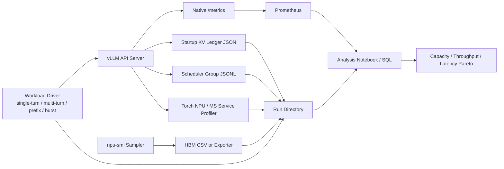

# vLLM / vLLM Ascend KV Cache 显存效率：监控采集与实验验证方案

> 日期：2026-06-14  
> vLLM 源码版本：`0d29612292c6b1e312af42ac00cf649af16a438b`  
> vLLM Ascend 源码版本：`8afdf356f6a2496bedfc538253366ef1a8c0d9aa`  
> 分析对象：DeepSeek V4 Pro / Flash，兼顾普通 Full Attention、MLA、SWA、C4/C128 压缩 Attention  
> 目标：验证 KV Cache 到底消耗了多少 HBM、其中多少真正承载了有效上下文，以及这些字节如何限制 Agentic 多轮负载的吞吐与并发

---

## 1. 结论先行

### 1.1 不能只用 `vllm:kv_cache_usage_perc` 判断“显存利用率”

当前 vLLM 的 `vllm:kv_cache_usage_perc` 来自共享 `BlockPool`：

```python
return 1.0 - (self.get_num_free_blocks() / total_gpu_blocks)
```

源码：

- `vllm/vllm/v1/core/block_pool.py:497-516`
- `vllm/vllm/v1/core/kv_cache_manager.py:181-188`
- `vllm/vllm/v1/core/sched/scheduler.py:2120-2156`
- `vllm/vllm/v1/metrics/loggers.py:524-532`

它表达的是：

> 当前有多少全局 block ID 已不在 free queue 中。

它不表达：

1. KV Tensor 实际从 NPU allocator 分配了多少字节。
2. DeepSeek V4 的 C4、C128、SWA、State、Indexer 分别用了多少。
3. 一个 block ID 被某个较小 KV group 占用后，其他 tensor tuple 对应页面的内部碎片。
4. 页尾有多少未填满。
5. `page_size_padded` 造成了多少 padding。
6. ACL Graph、allocator reserve、2 MiB 对齐造成了多少额外 HBM。
7. Decode 内核实际读取了 resident KV 的多少比例。

因此，完整验证必须同时保留以下四层指标：

| 层次 | 回答的问题 | 核心指标 |
|---|---|---|
| 规划层 | 可用 KV 预算如何被换算成 block | planned bytes、num blocks、planner slack |
| 分配层 | NPU 上真实分配了多少 storage | visible bytes、storage bytes、alignment、allocated/reserved |
| 载荷层 | 已占用页面里有多少有效 KV | active blocks、useful bytes、tail waste、padding waste |
| 访问层 | Decode 真正读取了哪些 KV | kernel time、访问热度、估算/实测读字节、带宽 |

### 1.2 DeepSeek V4 的关键矛盾是“共享 block ID + 异构 page footprint”

vLLM Ascend 的 DeepSeek V4 planner 按 page size bucket 和 layer tuple 构造物理 KV Tensor：

- `vllm-ascend/vllm_ascend/patch/platform/patch_kv_cache_utils.py:187-247`

核心预算公式为：

```text
num_blocks =
    available_memory
    // (sum(page_sizes) * num_layer_tuples)
```

所有 KV group 又共用一个全局 `BlockPool`。某个 C4、C128、SWA 或 State manager 取得一个 block ID 后，这个 block ID 就不能再分配给其他 group。即使该 group 只使用这个全局 slab 中的一小部分页面，剩余页面也不能被另一个 group 同时占用。

所以 DeepSeek V4 的容量验证必须增加：

```text
group_payload_efficiency
  = 该 group 实际有效页面字节
    / 该 group 占用 block ID 导致不可再分配的全局 slab 字节
```

这比单纯观察 block 使用率更能解释：

- 为什么 `kv_cache_usage_perc` 很高，但有效上下文容量没有达到理论值。
- 为什么 C4/C128/SWA 比例变化会改变最大并发。
- 为什么同样的上下文长度，不同层型分布产生不同显存效率。

### 1.3 推荐分三阶段实施

1. **P0：零源码修改基线**
   - 使用现有 Prometheus、KV residency metrics、服务日志、`torch.npu` profiler 和 `npu-smi`。
   - 先确定吞吐、并发、block 占用、prefix hit、preemption、HBM 曲线。

2. **P1：只修改 vLLM Ascend**
   - 增加启动期 KV Memory Ledger。
   - 精确统计 planner bytes、实际 tensor storage、2 MiB 对齐、padding 和 graph memory。
   - 改动小，最适合先落地。

3. **P2：修改 vLLM 调度器**
   - 增加 block owner group、group active blocks、cached-evictable blocks、有效行和页尾浪费。
   - 才能回答 C4/C128/SWA/State 各自的运行时显存效率。

---

## 2. 源码事实与现有观测能力

## 2.1 已有调度与 KV 指标

`SchedulerStats` 已包含：

- running requests
- waiting requests
- KV cache usage
- prefix cache stats
- KV eviction events

源码：`vllm/vllm/v1/metrics/stats.py:170-198`。

调度器在 `make_stats()` 中组装：

```python
SchedulerStats(
    num_running_reqs=len(self.running),
    num_waiting_reqs=len(self.waiting),
    kv_cache_usage=self.kv_cache_manager.usage,
    prefix_cache_stats=prefix_cache_stats,
    kv_cache_eviction_events=eviction_events,
)
```

源码：`vllm/vllm/v1/core/sched/scheduler.py:2120-2156`。

当前可直接使用的 Prometheus 指标：

| 指标 | 用途 | 源码 |
|---|---|---|
| `vllm:num_requests_running` | 当前执行请求数 | `loggers.py:456-464` |
| `vllm:num_requests_waiting` | 排队请求数 | `loggers.py:466-474` |
| `vllm:num_requests_waiting_by_reason` | capacity / deferred 排队 | `loggers.py:476-489` |
| `vllm:kv_cache_usage_perc` | 活跃 block ID 占比 | `loggers.py:524-532` |
| `vllm:num_preemptions` | 累计抢占 | `loggers.py:624-631` |
| `vllm:prompt_tokens` | Prefill token 计数 | `loggers.py:633-640` |
| `vllm:prompt_tokens_cached` | 本地和外部缓存 token | `loggers.py:657-665` |
| `vllm:generation_tokens` | Decode token 计数 | `loggers.py:667-674` |
| `vllm:prefix_cache_queries` | Prefix 查询 token | `loggers.py:547-556` |
| `vllm:prefix_cache_hits` | Prefix 命中 token | `loggers.py:558-565` |
| `vllm:external_prefix_cache_*` | 跨实例 KV 命中 | `loggers.py:571-592` |
| `vllm:time_to_first_token_seconds` | TTFT | `loggers.py:759-790` |
| `vllm:request_time_per_output_token_seconds` | TPOT | `loggers.py:822-850` |
| `vllm:e2e_request_latency_seconds` | E2E | `loggers.py:875-883` |
| `vllm:request_queue_time_seconds` | 排队时间 | `loggers.py:885-893` |
| `vllm:request_prefill_time_seconds` | Prefill 时间 | `loggers.py:905-913` |
| `vllm:request_decode_time_seconds` | Decode 时间 | `loggers.py:915-923` |
| `vllm:request_prefill_kv_computed_tokens` | 实际新计算 KV token，不含 cache hit | `loggers.py:925-935` |

## 2.2 已有 KV block 生命周期采样

vLLM 已有可选参数：

```bash
--kv-cache-metrics
--kv-cache-metrics-sample 0.01
```

源码：

- `vllm/vllm/config/observability.py:48-54`
- `vllm/vllm/engine/arg_utils.py:1337-1343`
- `vllm/vllm/v1/core/sched/scheduler.py:87-91`

采样器记录：

- block birth time
- last access
- 最近四次 access timestamp
- eviction 时的 lifetime、idle time、reuse gap

源码：`vllm/vllm/v1/core/kv_cache_metrics.py:16-96`。

Hook 位于：

- 分配：`vllm/vllm/v1/core/block_pool.py:333-363`
- 淘汰：`block_pool.py:365-390`
- Prefix 复用：`block_pool.py:402-417`

输出：

- `vllm:kv_block_lifetime_seconds`
- `vllm:kv_block_idle_before_evict_seconds`
- `vllm:kv_block_reuse_gap_seconds`

源码：`vllm/vllm/v1/metrics/loggers.py:938-1005`。

现有限制：

1. `KVCacheMetricsCollector.block_metrics` 只以 `block_id` 为 key。
2. 没有记录 owner group。
3. 无法区分 C4、C128、SWA、State、Indexer。
4. 只在 eviction 时输出，对长期不淘汰的热 block 缺少实时视图。

## 2.3 `kv_cache_usage_perc` 的准确语义

`BlockPool.get_usage()` 使用：

```python
total_gpu_blocks = self.num_gpu_blocks - 1
return 1.0 - free_blocks / total_gpu_blocks
```

Prefix caching 开启时，`ref_cnt == 0` 的 cached block 仍在 free queue 中，是可淘汰候选：

- `vllm/vllm/v1/core/block_pool.py:365-390`
- `vllm/vllm/v1/core/block_pool.py:402-417`

所以应将 block 状态拆成：

| 状态 | 判断 | 是否被原生 usage 计为占用 |
|---|---|---|
| active | `ref_cnt > 0` | 是 |
| cached-evictable | `ref_cnt == 0 && block_hash != None` | 否 |
| truly-free | `ref_cnt == 0 && block_hash == None` | 否 |
| null | `is_null` | 从分母剔除 |

物理 KV Tensor 在启动时已经整体分配。即使一个 block 位于 free queue，其对应 HBM 也没有被释放。因此：

```text
kv_cache_usage_perc != KV Tensor 占总 HBM 比例
kv_cache_usage_perc != 有效 KV payload 比例
```

## 2.4 vLLM Ascend 启动内存账本现状

`determine_available_memory()` 已计算：

```text
available KV
  = requested memory
    - weights
    - activation peak
    - non-Torch memory
    - optional graph estimate
```

源码：`vllm-ascend/vllm_ascend/worker/worker.py:336-463`。

其中 DeepSeek V4 DSA compressed attention 会跳过启动阶段的 ACL Graph memory profiling：

```python
if model_type == "deepseek_v4":
    should_profile_npugraph_memory = False
```

源码：`worker.py:378-390`。

但后续仍会执行真实 graph capture，并打印 actual 与 estimate：

- `worker.py:558-596`

这意味着 DeepSeek V4 graph 场景必须记录：

```text
KV 规划时的 graph estimate
真实 graph capture 后的 actual graph bytes
capture 后剩余 HBM
```

否则启动日志里的 available KV 不能独立证明最终不会挤压显存安全边界。

## 2.5 DeepSeek V4 的实际 Tensor 分配

入口：

- `vllm-ascend/vllm_ascend/worker/model_runner_v1.py:3700-3742`
- `model_runner_v1.py:3764-3813`
- `model_runner_v1.py:3929-4020`

物理 tensor 通过 `torch.zeros(..., dtype=torch.int8, device=self.device)` 分配。

启用 KV transfer 时，为保证 2 MiB 对齐，会额外分配：

```python
raw_tensor = torch.zeros(numel + alignment, ...)
return aligned_view[:numel]
```

源码：

- `model_runner_v1.py:3851-3872`
- `model_runner_v1.py:3947-3989`

因此必须同时统计：

```text
view bytes = tensor.numel() * tensor.element_size()
storage bytes = tensor.untyped_storage().nbytes()
alignment overhead = storage bytes - view bytes
```

只统计 view 会低估开启 P/D 或 KV transfer 后的真实 HBM。

---

## 3. DeepSeek V4 专用容量模型

## 3.1 A2/A3 与 A5 block / padding 常量

源码：`vllm-ascend/vllm_ascend/models/layer/attention/layer.py:31-49`。

在 scheduler block size 为 128 时：

| 设备 | MLA | SWA | C4 State | C128 State | 小 page padding | 大 page padding |
|---|---:|---:|---:|---:|---:|---:|
| A2/A3 | 128 | 128 | 8 | 32 | 16,640 B | 131,072 B |
| A5 | 128 | 128 | 8 | 16 | 16,896 B | 81,920 B |

必须按设备类型分别建基线，不能把 A2/A3 的页模型直接用于 A5。

## 3.2 C4 / C128 的有效 block size

Ascend Hybrid KV coordinator 将 attention spec 的 scheduler 有效 block size 乘以 `compress_ratio`：

```python
block_size *= compress_ratio
```

源码：`vllm-ascend/vllm_ascend/patch/platform/patch_kv_cache_coordinator.py:154-164`。

当基础 block size 为 128：

```text
C4 每个 block 覆盖约 128 * 4 = 512 个原始 token
C128 每个 block 覆盖约 128 * 128 = 16,384 个原始 token
SWA 每个 block 覆盖 128 个原始 token
```

运行时预测值：

```text
expected_c4_blocks(L)   = ceil(L / 512)
expected_c128_blocks(L) = ceil(L / 16384)
```

压缩有效行数应依据 DSA metadata 的实际规则计算。当前实现使用：

```python
compressed_seq_len = prefill_seq_len // compress_ratio
```

源码：`vllm-ascend/vllm_ascend/attention/dsa_v1.py:671-673`。

因此 payload 估算要区分：

```text
占用 block：ceil(original_tokens / effective_block_size)
有效 compressed rows：floor(original_tokens / compress_ratio)
未完成压缩窗口：由 state cache 承载
```

## 3.3 物理 page 与 real page

vLLM `AttentionSpec.page_size_bytes` 会优先返回 `page_size_padded`：

- `vllm/vllm/v1/kv_cache_interface.py:159-180`

而 `real_page_size_bytes` 表达未 padding 的实际数据宽度。

DeepSeek V4 Ascend 中：

- C4/C128 main MLA、Indexer、SWA 由不同 spec 计算 page。
- State cache 可被 padding 到 16,640 B 或 131,072 B。
- C4 main state 在 A2/A3、block size 128 下，实际 page 约 65,536 B，但被 padding 到 131,072 B，单页存在约 50% padding。
- C128 main state 对应大 page 时通常能更完整地填充 131,072 B。

相关源码：

- `vllm-ascend/vllm_ascend/models/deepseek_v4.py:113-138`
- `deepseek_v4.py:146-174`
- `deepseek_v4.py:182-210`
- `deepseek_v4.py:598-665`
- `vllm-ascend/vllm_ascend/patch/platform/patch_kv_cache_interface.py:62-89`
- `patch_kv_cache_interface.py:214-260`

## 3.4 Planner slab 与 materialized slab

定义：

```text
planner_slab_bytes
  = sum(canonical_page_sizes) * num_layer_tuples

materialized_slab_bytes
  = sum(unique KVCacheTensor storage bytes) / num_blocks
```

两者不一定完全相同，特别是 MTP tensor 单独追加时，planner 分母可能比真实 materialized tensor 更保守：

- `vllm-ascend/vllm_ascend/patch/platform/patch_kv_cache_utils.py:226-245`

建议把差值命名为：

```text
planner_structural_slack_bytes
  = num_blocks * planner_slab_bytes
    - materialized_visible_bytes
```

不要把它与 allocator reserve 或 2 MiB alignment 混为一类。

---

## 4. 统一指标体系

## 4.1 一级：启动静态账本

建议每个 rank 输出一次 JSON，并同时暴露低基数 Gauge。

| 指标 | 定义 |
|---|---|
| `device_total_hbm_bytes` | 设备 HBM 总容量 |
| `startup_free_hbm_bytes` | Worker 初始化时 free HBM |
| `requested_memory_bytes` | `gpu_memory_utilization` 对应预算 |
| `weights_bytes` | 模型权重 |
| `peak_activation_bytes` | profile run 峰值 activation |
| `non_torch_bytes` | Torch allocator 外的内存增长 |
| `graph_estimated_bytes` | 启动阶段 graph estimate |
| `graph_actual_bytes` | capture 后实际 graph pool |
| `available_kv_bytes` | planner 输入预算 |
| `planner_slab_bytes` | 每个全局 block ID 的规划 slab |
| `num_blocks` | 全局 block 数 |
| `planner_budgeted_bytes` | `planner_slab_bytes * num_blocks` |
| `planner_remainder_bytes` | available 除法后的余数 |
| `materialized_visible_bytes` | 所有唯一 KV view 的可见字节 |
| `materialized_storage_bytes` | 所有唯一底层 storage 字节 |
| `alignment_overhead_bytes` | storage - visible |
| `padding_capacity_bytes` | page size - real page size 的总容量 |
| `torch_allocated_after_kv_bytes` | KV 初始化后 allocator allocated |
| `torch_reserved_after_kv_bytes` | KV 初始化后 allocator reserved |
| `npu_hbm_used_after_kv_bytes` | 外部设备视角的 HBM used |

核心校验：

```text
materialized_storage_bytes >= materialized_visible_bytes

available_kv_bytes
  >= planner_budgeted_bytes

torch_allocated_delta
  ~= materialized_storage_bytes + 同阶段其他新 tensor

npu_hbm_used_delta
  >= torch_reserved_delta
```

最后两个不是严格等式，因为还有 ACL、HCCL、graph、runtime workspace 和 allocator 行为。

## 4.2 二级：BlockPool 运行时账本

新增：

| 指标 | 标签 | 含义 |
|---|---|---|
| `vllm:kv_cache_blocks` | `state=active/cached_evictable/free` | 全局 block 状态 |
| `vllm:kv_cache_active_references` | 无 | 所有 block ref count 之和 |
| `vllm:kv_cache_prefix_sharing_ratio` | 无 | active references / active unique blocks |
| `vllm:kv_cache_group_active_blocks` | `group_id, group_role` | 每个 group 独占的 block ID |
| `vllm:kv_cache_group_cached_blocks` | `group_id, group_role` | 可淘汰 prefix block |
| `vllm:kv_cache_group_slab_bytes` | `group_id, group_role` | 该 group 导致不可分配的 slab 字节 |
| `vllm:kv_cache_group_page_bytes` | `group_id, group_role` | 该 group 实际对应 page capacity |
| `vllm:kv_cache_group_real_page_bytes` | `group_id, group_role` | 去 padding 后容量 |

不得使用以下 Prometheus label：

- request ID
- layer name
- prompt hash
- 完整模型路径
- token length

这些维度会导致时序基数爆炸。请求级信息应写入采样 JSONL。

## 4.3 三级：请求与有效载荷账本

建议仅在以下事件写 JSONL：

- request 第一次 allocate
- block 数变化
- prefix hit
- preemption
- request free
- 每秒一次 sampled snapshot

Schema：

```json
{
  "ts_ns": 0,
  "run_id": "dsv4-c4-ctx64k-c16-r1",
  "rank": 0,
  "request_seq": 17,
  "event": "allocate",
  "phase": "prefill",
  "num_tokens": 65536,
  "num_computed_tokens": 0,
  "prefix_hit_tokens": 0,
  "groups": [
    {
      "group_id": 0,
      "group_role": "c4_full",
      "active_blocks": 128,
      "valid_rows_est": 16384,
      "page_bytes": 0,
      "real_page_bytes": 0,
      "tail_waste_bytes_est": 0
    }
  ]
}
```

`request_seq` 是 run 内递增编号，不输出真实 request ID。

## 4.4 四级：NPU 内核访问指标

只在短窗口 profiler 中采集：

| 阶段 | 建议 marker |
|---|---|
| SWA 写入 | `dsv4.swa_scatter` |
| C4 Indexer | `dsv4.c4.indexer` |
| C4 Compressor | `dsv4.c4.compressor` |
| C4 KV 写入 | `dsv4.c4.kv_scatter` |
| C4 QLI | `dsv4.c4.qli` |
| C4 Sparse Attention | `dsv4.c4.attention` |
| C128 Compressor | `dsv4.c128.compressor` |
| C128 Attention | `dsv4.c128.attention` |

具体代码段：

- Prefill：`vllm-ascend/vllm_ascend/attention/dsa_v1.py:1866-2184`
- Decode：`dsa_v1.py:2186-2507`
- Compressor：Prefill `2058-2098`，Decode `2367-2406`
- QLI：Prefill `2105-2130`，Decode `2413-2438`
- Sparse attention：Prefill `2135-2183`，Decode `2443-2506`

marker 名称必须是静态低基数字符串，不能包含 request ID、seq len 或 layer index，以免破坏 graph 或产生海量事件。

---

## 5. 采集架构



推荐每次实验目录：

```text
runs/<run_id>/
├── manifest.json
├── server.log
├── startup_kv_ledger.json
├── scheduler_kv_samples.jsonl
├── client_result.json
├── prometheus_snapshot.txt
├── npu_memory.csv
└── profiler/
```

`manifest.json` 至少包含：

```json
{
  "run_id": "",
  "date": "",
  "vllm_commit": "",
  "vllm_ascend_commit": "",
  "model": "",
  "model_variant": "pro-or-flash",
  "device_type": "",
  "cann_version": "",
  "world_size": 0,
  "tp": 0,
  "dp": 0,
  "dcp": 0,
  "pcp": 0,
  "block_size": 128,
  "max_model_len": 0,
  "max_num_seqs": 0,
  "max_num_batched_tokens": 0,
  "gpu_memory_utilization": 0.0,
  "kv_cache_memory_bytes": null,
  "prefix_caching": false,
  "kv_transfer": false,
  "mtp": false,
  "graph_mode": "",
  "seed": 42
}
```

---

## 6. 具体源码实施建议

## 6.1 P1：新增 Ascend 启动 Memory Ledger

建议新增：

```text
vllm_ascend/observability/kv_cache_memory.py
```

核心数据结构：

```python
@dataclass
class KVCacheMemoryLedger:
    available_kv_bytes: int
    planner_slab_bytes: int
    num_blocks: int
    planner_budgeted_bytes: int
    planner_remainder_bytes: int
    materialized_visible_bytes: int = 0
    materialized_storage_bytes: int = 0
    alignment_overhead_bytes: int = 0
    graph_estimated_bytes: int = 0
    graph_actual_bytes: int = 0
```

### 插桩点 A：Planner

位置：

```text
vllm_ascend/patch/platform/patch_kv_cache_utils.py:187-247
```

记录：

```python
planner_slab_bytes = layer_tuple_page_bytes * num_layer_tuples
planner_budgeted_bytes = planner_slab_bytes * num_blocks
planner_remainder_bytes = available_memory - planner_budgeted_bytes
planned_tensor_visible_bytes = sum(t.size for t in kv_cache_tensors)
```

还要按 `kv_cache_groups` 输出：

```text
group_id
layer_count
group_role
block_size
compress_ratio
sum_page_size_bytes
sum_real_page_size_bytes
padding_bytes_per_block
```

### 插桩点 B：Tensor allocation

位置：

```text
vllm_ascend/worker/model_runner_v1.py:3764-3813
vllm_ascend/worker/model_runner_v1.py:3929-4020
```

分配前后记录：

```python
allocated_before = torch.npu.memory_allocated()
reserved_before = torch.npu.memory_reserved()

kv_cache_raw_tensors = self._allocate_kv_cache_tensors(...)

allocated_after = torch.npu.memory_allocated()
reserved_after = torch.npu.memory_reserved()
```

底层 storage 去重：

```python
storages = {}
for tensor in flatten_raw_tensors(kv_cache_raw_tensors):
    storage = tensor.untyped_storage()
    key = (storage.data_ptr(), storage.nbytes())
    storages[key] = storage.nbytes()

materialized_storage_bytes = sum(storages.values())
```

view 去重也应使用 `(data_ptr, numel, dtype)` 或明确按 planner tensor 统计，避免一个 raw tensor 被多个 `shared_by` layer 重复累加。

### 插桩点 C：Graph capture

位置：

```text
vllm_ascend/worker/worker.py:558-635
```

把现有日志中的：

- actual graph bytes
- estimated graph bytes
- difference

写入同一 ledger。DeepSeek V4 即使 estimate 为 0，也必须记录 actual。

### 输出方式

使用 feature flag：

```bash
VLLM_ASCEND_KV_CACHE_DIAGNOSTICS=1
VLLM_ASCEND_KV_CACHE_DIAGNOSTICS_DIR=/path/to/runs/<run_id>
```

建议默认只写一次 JSON，不在每个 execute step 写文件。

## 6.2 P2：增加 group owner 与 block 状态

最适合插桩的位置：

```text
vllm/vllm/v1/core/kv_cache_coordinator.py:212-245
vllm/vllm/v1/core/kv_cache_coordinator.py:264-272
vllm/vllm/v1/core/kv_cache_coordinator.py:306-313
```

DeepSeek V4 Ascend 使用 patched coordinator：

```text
vllm-ascend/vllm_ascend/patch/platform/patch_kv_cache_coordinator.py:327-355
```

建议 sidecar：

```python
class KVCacheGroupDiagnostics:
    block_owner_group: dict[int, int]
    active_blocks_by_group: list[int]
    cached_blocks_by_group: list[int]
    active_ref_count_by_group: list[int]
```

`allocate_new_blocks()` 返回每个 manager 的 block list 后：

```python
for group_id, blocks in enumerate(new_blocks_by_group):
    for block in blocks:
        diagnostics.on_allocate(group_id, block)
```

`free()` 前后根据 `ref_cnt` 变化更新：

```text
ref_cnt > 0              -> active
ref_cnt == 0, has hash   -> cached-evictable
ref_cnt == 0, no hash    -> truly-free
```

Prefix hit 的 `touch()` 也要把 cached-evictable 转回 active：

```text
vllm/vllm/v1/core/block_pool.py:402-417
```

更通用的 upstream 方案是扩展 `KVCacheMetricsCollector`：

```python
BlockMetricsState(
    owner_group_id,
    birth_time_ns,
    last_access_ns,
)
```

但 `BlockPool.get_new_blocks()` 当前不知道 group ID，因此 group 信息需要从 coordinator / manager 传入，不能只改 `block_pool.py`。

## 6.3 有效载荷估算

实验版可以每秒扫描一次：

```python
coordinator.get_blocks(request_id)
```

源码：`vllm/vllm/v1/core/kv_cache_coordinator.py:306-313`。

对每个 manager：

1. 对 block ID 去重，得到 active unique blocks。
2. 对共享 prefix block 使用最大有效行数，不能按 request 重复累计。
3. Full compressed group 使用：

```text
valid_rows = floor(num_tokens / compress_ratio)
capacity_rows = active_blocks * physical_rows_per_page
tail_rows = capacity_rows - valid_rows
```

4. SWA / State 以 manager 当前真实持有 block 为准，不只使用静态 window 公式。
5. 精确模式可从 `slot_mapping` 统计每个 block 的最大写入 offset。

生产版不建议每 step 扫描全部 request/block；应在 allocate、touch、free、remove skipped blocks 时增量维护。

## 6.4 Prometheus 与 JSONL 的边界

Prometheus：

- 每秒或 logger interval 聚合一次。
- 只保留 rank、engine、group ID、group role、state。
- 适合告警和趋势。

JSONL：

- 记录 request 生命周期和 per-group delta。
- 默认 1% request 采样，容量边界实验可临时设为 100%。
- 适合离线重建“哪个会话占了哪些 group”。

Profiler：

- 只用于 20 至 100 个稳定 step。
- 不纳入正常吞吐结果。
- 另跑一组 profiler-on 实验，禁止拿 profiler-on 和 profiler-off 的绝对吞吐直接比较。

---

## 7. 不改代码即可执行的基线采集

## 7.1 服务启动

在现有 DeepSeek V4 recipe 上增加：

```bash
--kv-cache-metrics \
--kv-cache-metrics-sample 0.05 \
--profiler-config '{
  "profiler": "torch",
  "torch_profiler_dir": "/data/runs/<run_id>/profiler",
  "torch_profiler_with_stack": false,
  "torch_profiler_with_memory": true
}'
```

`--kv-cache-metrics-sample` 建议：

| 场景 | sample |
|---|---:|
| 长时间性能基线 | 0.01 |
| 容量边界实验 | 0.05 |
| 短时 correctness / residency 验证 | 0.1 至 1.0 |

采样率越高，block allocate/access/evict 的 Python bookkeeping 越多。正式吞吐数据应先验证指标开销。

## 7.2 Prometheus 快照

```bash
curl -s http://127.0.0.1:8000/metrics \
  > runs/<run_id>/prometheus_snapshot.txt
```

推荐使用 Prometheus 1 秒 scrape interval；超大规模部署可用 5 秒。

关键 PromQL：

```promql
# 活跃 KV block 占用峰值
max_over_time(vllm:kv_cache_usage_perc[5m])

# Prefix token 命中率
sum(rate(vllm:prefix_cache_hits[5m]))
/
clamp_min(sum(rate(vllm:prefix_cache_queries[5m])), 1)

# 外部 KV connector 命中率
sum(rate(vllm:external_prefix_cache_hits[5m]))
/
clamp_min(sum(rate(vllm:external_prefix_cache_queries[5m])), 1)

# Decode token/s
sum(rate(vllm:generation_tokens[1m]))

# Preemption/s
sum(rate(vllm:num_preemptions[5m]))

# P99 TTFT
histogram_quantile(
  0.99,
  sum by (le) (rate(vllm:time_to_first_token_seconds_bucket[5m]))
)

# P99 TPOT
histogram_quantile(
  0.99,
  sum by (le) (
    rate(vllm:request_time_per_output_token_seconds_bucket[5m])
  )
)

# 每秒真正新计算的 prefill KV token
sum(rate(vllm:request_prefill_kv_computed_tokens_sum[5m]))
```

## 7.3 NPU HBM 采样

vLLM Ascend 已调用：

```bash
npu-smi info -t memory -i <device_id>
```

并解析 `HBM Capacity(MB)`：

- `vllm-ascend/vllm_ascend/platform.py:75-101`

实验脚本应同时解析当前设备输出中的：

- `HBM Capacity(MB)`
- `HBM Usage(MB)` 或该 CANN / 驱动版本实际提供的 used 字段

采样建议：

```text
启动阶段：每 200 ms
稳态吞吐：每 1 s
长时间 Agentic soak：每 5 s
```

每个 rank 还应记录：

```python
torch.npu.memory_allocated()
torch.npu.memory_reserved()
torch.npu.max_memory_allocated()
torch.npu.memory_stats()
```

当前 worker 已在 `execute_model()` 前调用 `profile_memory()`：

- `vllm-ascend/vllm_ascend/worker/worker.py:465-480`

但只写 debug log。建议不要每 token 暴露 Prometheus，而是独立 1 Hz 采样，减少热路径开销。

## 7.4 Torch NPU profiler

vLLM Ascend 已支持：

```bash
curl -X POST http://localhost:8000/start_profile
curl -X POST http://localhost:8000/stop_profile
```

源码文档：

- `vllm-ascend/docs/source/developer_guide/performance_and_debug/service_profiling_guide.md:30-93`

解析：

```python
from torch_npu.profiler.profiler import analyse
analyse("/path/to/*_ascend_pt/")
```

建议在达到稳定并发后：

1. 等待 60 秒 warmup。
2. 开始 profile。
3. 采集 20 至 100 个 model execution step。
4. 停止 profile。
5. 单独标注此 run 为 `profiled=true`。

## 7.5 MS Service Profiler

解析后可产生：

- `request.csv`
- `kvcache.csv`
- `batch.csv`
- Chrome trace

文档：

- `service_profiling_guide.md:175-190`

支持 domain：

```text
Request
KVCache
ModelExecute
BatchSchedule
Communication
```

文档：`service_profiling_guide.md:204-217`。

还支持通过 YAML 对 Python symbol 插桩，例如：

```yaml
- symbol: vllm.v1.core.kv_cache_manager:KVCacheManager.free
  domain: KVCache
  name: KVCacheManagerFree
```

文档：`service_profiling_guide.md:240-277`。

这可以先用于验证 allocate/free 时序，再决定是否将指标固化到 Prometheus。

---

## 8. 实验计划

## 8.1 Phase 0：采集正确性与开销

目标：证明指标账本自身可信，且不会显著影响吞吐。

### 启动状态点

| 状态 | 采集时机 |
|---|---|
| S0 | Worker 初始化后、加载权重前 |
| S1 | 权重加载完成 |
| S2 | profile run 完成 |
| S3 | KV Tensor 分配完成 |
| S4 | Graph capture 完成 |
| S5 | 服务空闲稳定 60 秒 |

### 校验项

1. `sum(KVCacheTensor.size)` 与唯一 KV view bytes 对齐。
2. unique storage bytes 不小于 view bytes。
3. 开启 KV transfer 后出现可解释的 2 MiB alignment overhead。
4. planner budget 不超过 available KV。
5. graph actual 被纳入最终 HBM 账本。
6. 空闲 10 分钟后 allocated / reserved / npu-smi used 不持续增长。

### 指标开销 A/B

| 组 | KV metrics | JSONL | profiler |
|---|---|---|---|
| A | off | off | off |
| B | sample=0.01 | off | off |
| C | sample=0.05 | 1% request | off |
| D | sample=0.05 | 100% request | off |

验收：

```text
B 相对 A：吞吐下降 < 1%
C 相对 A：吞吐下降 < 3%
```

若超标，降低采样率或把扫描式统计改为增量统计。

## 8.2 Phase 1：单请求长度阶梯

目标：验证每种 attention group 的 block 增长是否符合源码模型。

输入长度：

```text
128
512
1K
8K
16K
64K
135K
512K
1M
```

只运行模型实际支持的上下文长度。

两类输出：

1. `output_len=1`：隔离 Prefill。
2. `output_len=256/1024`：观察 Decode 增长和稳态。

并发固定为 1，重复 3 次。

每个长度核对：

```text
expected C4 blocks
expected C128 blocks
actual blocks by group
pool active blocks
tail waste
padding waste
torch allocated
npu-smi used
```

关键边界：

```text
511 / 512 / 513
16,383 / 16,384 / 16,385
SWA window - 1 / window / window + 1
```

这些边界比只测 1K、8K 更容易发现 off-by-one 和额外 block。

## 8.3 Phase 2：并发容量阶梯

目标：测出不同上下文长度下的最大稳定并发，而不是理论 `KV tokens / max_model_len`。

上下文档位：

```text
1K
8K
64K
135K
512K 或 1M
```

并发：

```text
1, 2, 4, 8, 16, 32, 64
```

再在饱和点附近二分搜索。

每组：

```text
warmup 5 min
measurement 10 min
repeat 3
seed 固定
```

推荐 `vllm bench serve`：

```bash
vllm bench serve \
  --backend openai \
  --model <served-model-name> \
  --endpoint /v1/completions \
  --dataset-name random \
  --num-prompts 1000 \
  --random-input-len <L> \
  --random-output-len 256 \
  --request-rate inf \
  --max-concurrency <C> \
  --ignore-eos \
  --seed 42 \
  --save-result \
  --save-detailed
```

vLLM benchmark 对 `request-rate`、`burstiness`、`max-concurrency` 的语义见：

- `vllm/docs/benchmarking/cli.md:586-631`

稳定容量定义：

```text
无 OOM
measurement window 内 preemption rate 接近 0
waiting queue 不单调增长
P99 TTFT / TPOT 满足既定 SLO
错误率满足 SLO
```

## 8.4 Phase 3：Agentic 多轮长会话

目标：验证“超大轮次 + 上下文持续增长 + prefix reuse”下的真实会话容量。

使用：

```text
vllm/benchmarks/multi_turn/benchmark_serving_multi_turn.py
```

工具支持：

- synthetic conversations
- turn 数分布
- common prefix
- conversation unique prefix
- user / assistant token 分布
- `--max-active-conversations`
- `--request-rate`
- `--warmup-step`

源码与文档：

- `vllm/benchmarks/multi_turn/README.md:28-120`
- `benchmark_serving_multi_turn.py:1380-1448`
- `benchmarks/multi_turn/generate_multi_turn.json:1-34`

建议矩阵：

| 维度 | 取值 |
|---|---|
| 会话轮次 | 8、32、128 |
| active conversations | 1、2、4、8、16、32、64 |
| 单轮用户 token | 128、512、2K |
| 单轮输出 token | 64、256 |
| common prefix | 0、1K、8K |
| 首轮 unique prefix | 0、8K、64K |
| 到达率 | 0、Poisson 目标 RPS |

四个必测模式：

| 模式 | Prefix Cache | Session Affinity | KV Transfer |
|---|---|---|---|
| M0 | off | off | off |
| M1 | on | 单实例自然复用 | off |
| M2 | on | 强 session affinity | off |
| M3 | on | P/D 或跨实例 | on |

重点指标：

```text
active conversations
total context tokens
newly computed prefill KV tokens
prefix hit tokens
external prefix hit tokens
active blocks by group
cached-evictable blocks
preemption
TTFT / TPOT per turn
conversation completion time
HBM per active conversation
```

增加 workload-side 指标：

```text
compute_amplification
  = 实际新计算 prefill KV tokens
    / 对话新增的唯一 token
```

理想多轮复用接近 1。若显著大于 1，说明历史上下文被重复 Prefill。

## 8.5 Phase 4：Prefix Cache 专项

vLLM 自带：

```text
benchmarks/benchmark_prefix_caching.py
```

以及 `prefix_repetition` dataset：

- `vllm/docs/benchmarking/cli.md:924-963`

建议测试：

```text
固定 prefix：512、8K、64K
suffix：128、1K
prefix 数量：1、5、100
重复次数：5、20、100
并发：1、8、32
```

验证：

1. prefix hit token 比例。
2. cached-evictable block 数量。
3. block reuse gap。
4. hit 后 TTFT 降幅。
5. 高并发下 cache churn 和 eviction。
6. SWA group 是否限制共同 prefix hit 长度。
7. P node、D node、KV connector 的命中统计是否一致。

## 8.6 Phase 5：突发 Agentic 流量

使用：

```text
burstiness=1.0：Poisson
burstiness=0.1/0.3：高度突发
burstiness=5.0：平滑
```

保持平均 RPS 相同，比较：

```text
KV usage peak
waiting queue peak
preemption
TTFT P99
cached block eviction
HBM peak
恢复到稳态的时间
```

突发场景通常比平均吞吐更容易暴露：

- block 分配尖峰
- Prefix cache 热数据被驱逐
- allocator / workspace 峰值
- graph capture shape 覆盖不足

## 8.7 Phase 6：内核访问验证

只选择三个代表点：

```text
64K context / concurrency 1
135K context / concurrency 8
容量边界附近 concurrency
```

分别采集 Prefill 与 Decode。

分析：

| 组件 | 需要回答 |
|---|---|
| SWA scatter | 每 step 写入字节是否随 batch 线性增长 |
| Compressor | C4/C128 的时间和写量 |
| Indexer / QLI | 是否扫描过多 index KV |
| Sparse Attention | top-k 后实际读取量 |
| C4 / C128 | resident bytes 与 read bytes 比值 |
| Multi-stream | overlap 是否减少关键路径，而非只移动时间 |

访问效率：

```text
access_efficiency
  = attention 核心有效读取字节
    / 对应 group resident real-page bytes
```

若 profiler 无法直接给出 HBM read bytes，使用两种口径并列：

1. 根据 kernel 参数、top-k、dtype、head size 推导理论读取量。
2. 使用 profiler 的带宽/时长/算子信息估算。

必须标注 estimated，不能伪装成直接测量值。

## 8.8 Phase 7：配置消融

单因素优先：

| 因素 | 候选 |
|---|---|
| block size | 32 / 64 / 128 |
| prefix cache | off / on |
| graph | eager / decode graph |
| KV transfer | off / on |
| MTP | off / on |
| IndexCache | off / freq 1 / freq 4 |
| CP | DCP / PCP 关闭与目标配置 |
| memory budget | `gpu-memory-utilization` 或固定 `kv-cache-memory` 梯度 |
| device | A2/A3 / A5 |

完成单因素后再做关键 2x2：

```text
prefix cache x session affinity
graph x KV budget
KV transfer x alignment overhead
IndexCache x context length
block size x Agentic turn count
```

---

## 9. 核心评价指标与公式

## 9.1 规划效率

```text
eta_plan
  = planner_budgeted_bytes / available_kv_bytes
```

反映整除余数和 planner 保守预算。

## 9.2 物理分配效率

```text
eta_materialization
  = materialized_visible_bytes / materialized_storage_bytes
```

反映 view 对齐和底层 storage 额外分配。

## 9.3 Page padding 效率

```text
eta_page
  = sum(real_page_size_bytes)
    / sum(page_size_bytes)
```

需要按 group 和全局分别计算。

## 9.4 运行时 slab 利用率

```text
active_slab_bytes
  = active_unique_blocks * materialized_slab_bytes

eta_group_slab
  = sum(group_active_real_page_bytes)
    / active_slab_bytes
```

这是 DeepSeek V4 异构 group 最重要的指标之一。

## 9.5 有效载荷效率

```text
eta_payload
  = live_valid_payload_bytes
    / active_slab_bytes
```

它同时包含：

- group slab 内部碎片
- page padding
- 页尾浪费
- SWA / state 的保留窗口

## 9.6 HBM 总体效率

```text
eta_kv_hbm
  = materialized_storage_bytes
    / npu_process_hbm_used_bytes

eta_payload_hbm
  = live_valid_payload_bytes
    / npu_process_hbm_used_bytes
```

若 `npu-smi` 只能给 device-level used，必须保证单进程独占设备，或通过进程级工具补充。

## 9.7 业务容量效率

```text
sessions_per_hbm_gib
  = stable_active_conversations
    / peak_hbm_used_gib

output_tps_per_hbm_gib
  = output_token_per_second
    / peak_hbm_used_gib
```

最终优化不能只提升 `eta_payload`，还要落到：

- 更高稳定会话数
- 更高 output token/s
- 同等 P99 SLO 下更低 HBM

---

## 10. 数据分析流程

## 10.1 时间对齐

所有采集端使用：

```text
wall clock timestamp
monotonic timestamp
run_id
rank
```

服务端和客户端开始实验前做时钟检查。离线分析以客户端 measurement window 为主，裁掉：

- 服务启动
- warmup
- profiler 启停
- benchmark teardown

## 10.2 每组输出

至少生成：

1. HBM 随时间。
2. KV block usage 随时间。
3. active / cached-evictable / free block 堆叠图。
4. C4/C128/SWA/State group active block 堆叠图。
5. running / waiting / preemption。
6. TTFT / TPOT P50、P95、P99。
7. Prefix hit 和 new prefill KV token。
8. throughput-concurrency 曲线。
9. HBM-concurrency 曲线。
10. 吞吐、P99、HBM 三维 Pareto。

## 10.3 重复与统计

- 每个关键点至少 3 次。
- 固定 seed、prompt 集、输出长度。
- 报告 median，同时给 min/max 或 bootstrap CI。
- 容量边界点建议 5 次。
- 任何有 OOM、请求错误或 profiler 干扰的 run 单独标记，不与正常 run 混合。

---

## 11. 验收标准

## 11.1 采集正确性

| 项目 | 标准 |
|---|---|
| planner 与 tensor view | 差异全部可归因于 MTP、空 shared tensor 或 planner slack |
| view 与 storage | 差异全部可归因于 alignment / allocator |
| group blocks 与 pool usage | group active block 去重和等于全局 active block |
| request free | active block 随请求释放或转 cached-evictable |
| prefix hit | hit token、touch、ref count 变化一致 |
| graph | actual graph bytes 被记录 |
| HBM | 各阶段增量方向与 ledger 一致 |

## 11.2 性能结论

一个优化只有同时满足以下条件才算有效：

1. 输出正确性无回退。
2. 监控常开开销在预算内。
3. 同一 P99 TTFT / TPOT SLO 下稳定并发提升。
4. 或同一并发下 output token/s 提升。
5. 无新增 OOM、preemption、错误率和长期 HBM 增长。
6. 结论在至少三个重复 run 中稳定。

建议主指标：

```text
capacity_gain
  = candidate_max_stable_sessions
    / baseline_max_stable_sessions - 1

throughput_gain
  = candidate_output_tps
    / baseline_output_tps - 1

hbm_saving
  = 1 - candidate_peak_hbm
          / baseline_peak_hbm
```

---

## 12. 建议的落地顺序

### Week 1：零代码基线

1. 固化 run manifest 和目录。
2. 接 Prometheus。
3. 接 `npu-smi` 与 `torch.npu` 1 Hz 采样。
4. 跑 Phase 0、1、2。
5. 找到第一个容量拐点。

### Week 2：Ascend 启动账本

1. 实现 planner / tensor storage ledger。
2. 校准 2 MiB alignment。
3. 校准 graph actual。
4. 输出 page padding 与 planner slack。

### Week 3：调度 group 指标

1. 实现 block owner group。
2. 拆 active / cached-evictable / free。
3. 增加 per-group block 和 slab bytes。
4. 跑 DeepSeek V4 长上下文边界。

### Week 4：Agentic 与 profiler

1. 跑 8/32/128 轮多轮矩阵。
2. Prefix / session affinity / P-D 消融。
3. 容量边界点做短时 profiler。
4. 输出吞吐、并发、HBM、P99 Pareto。

---

## 13. 最可能识别出的瓶颈与后续优化方向

### 13.1 全局 block slab 内部碎片

若 `eta_group_slab` 很低：

- 按 page footprint 拆分独立 BlockPool。
- 或为小 page group 建 sub-block allocator。
- 或允许同一全局 slab 的不同 page bucket 被不同 group 安全复用。

这是结构性收益最大、同时改动也最大的方向。

### 13.2 C4 State padding

若 C4 state 的 131,072 B page 长期只有约一半有效：

- 为 state cache 使用独立 page class。
- planner 不再强行将其 pad 到大 page。
- 评估额外 block table / backend 分支成本是否小于节省的 HBM。

### 13.3 MTP planner overcharge

若 `planner_budgeted_bytes - materialized_visible_bytes` 主要来自 MTP：

- 按实际追加 MTP tensor 的 page size 计算 planner denominator。
- 对 MTP 使用独立 pool 或独立 num blocks。

### 13.4 Prefix cache churn

若：

```text
prefix hit 高
但 idle-before-evict 很短
且 burst 后 hit 明显下降
```

说明热 prefix 被 Agentic 新会话挤出。可评估：

- session affinity
- priority-aware eviction
- prefix retention hint
- 外部 KV cache
- P/D 路由的 KV-aware scheduling

### 13.5 C4 QLI 扫描成本

若显存容量足够但 Decode TPOT 随 context 仍显著增长，重点检查：

- QLI index cache 读取量。
- IndexCache 命中与 `index_topk_freq`。
- C4 top-k 计算是否成为 memory-bandwidth bottleneck。
- multi-stream overlap 是否真正缩短关键路径。

### 13.6 Graph 与 KV 预算互相挤压

若 graph actual 显著高于 estimate：

- 优先使用固定 `--kv-cache-memory` 做可重复实验。
- 为 graph actual 保留安全余量。
- 缩减 capture size 集。
- 对 Prefill / Decode 分别评估 graph 收益和 HBM 成本。

---

## 14. 最终建议

第一版不要直接追求“一个绝对的 KV Cache 显存利用率数字”。应固定输出以下四个数字：

```text
1. pool_active_ratio
2. materialized_kv_hbm_ratio
3. live_payload_efficiency
4. access_efficiency
```

其中：

- `pool_active_ratio` 使用原生 `vllm:kv_cache_usage_perc`。
- `materialized_kv_hbm_ratio` 由唯一 tensor storage 与 `npu-smi` / allocator 计算。
- `live_payload_efficiency` 由 group block、real page、页尾与 state 计算。
- `access_efficiency` 由短时 profiler 和理论访问模型计算。

只有四者一起，才能判断一个 DeepSeek V4 KV Cache 优化是在：

- 真正减少 HBM，
- 提高有效上下文容量，
- 降低 Decode 访存，
- 还是仅仅改变了 block 统计口径。

