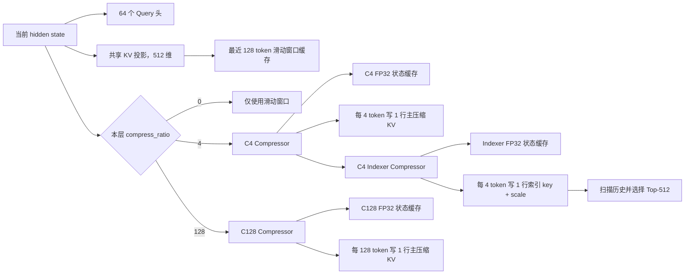
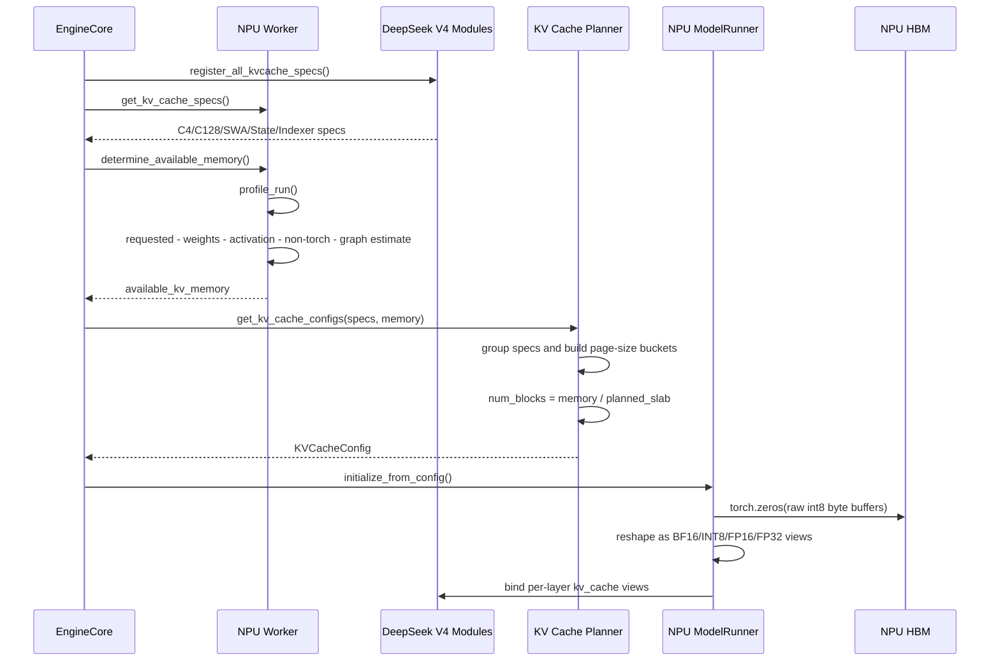
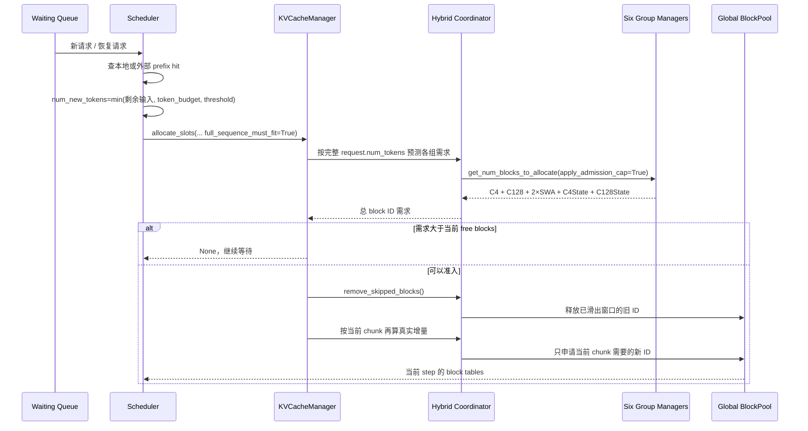
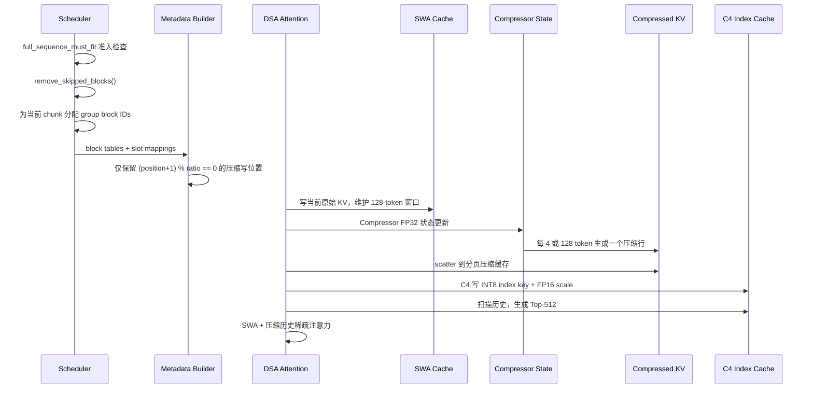
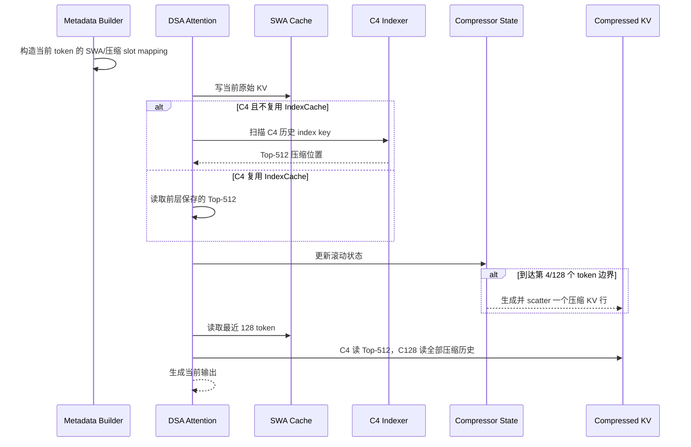
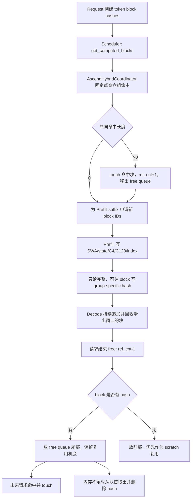
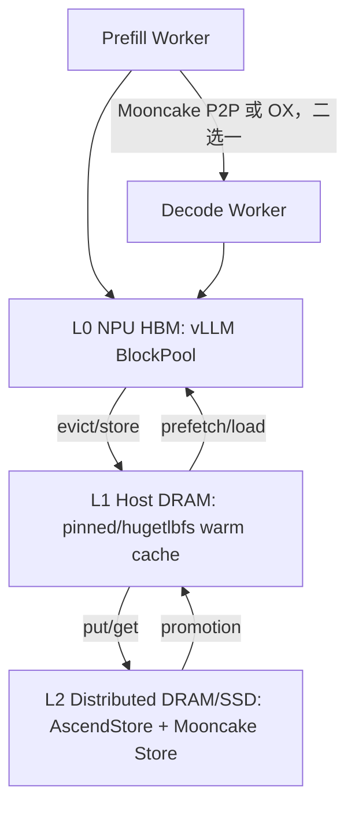

 # DeepSeek V4 Flash KV Cache：显存申请、实际占用与运行管理源码量化分析

> 日期：2026-06-14  
> Hugging Face 模型：[`deepseek-ai/DeepSeek-V4-Flash`](https://huggingface.co/deepseek-ai/DeepSeek-V4-Flash)  
> Hugging Face 配置快照：`553034d7dd9e06c2eeaee68cf85a17d6d4754cf0`  
> vLLM：`0d29612292c6b1e312af42ac00cf649af16a438b`  
> vLLM Ascend：`8afdf356f6a2496bedfc538253366ef1a8c0d9aa`  
> Mooncake：`60452b6ecffe0c17e175cb686c567a74ee61b548`  
> 主量化口径：Ascend A2/A3、KV Cache block size 为 128、BF16 主缓存、上下文并行度为 1、单请求、单 NPU rank  
> 单位：KiB、MiB、GiB 均按 1024 进制

---

## 1. 技术结论

### 1.1 DeepSeek V4 Flash 不是“一份 KV Cache”，而是六类缓存共同组成

DeepSeek V4 Flash 的每层注意力都保留最近 128 个 token 的滑动窗口缓存；不同层再按配置增加：

1. **4 倍压缩主缓存**：每 4 个原始 token 生成一个压缩 KV 行。
2. **4 倍压缩索引缓存**：用于扫描历史并选择 512 个压缩位置。
3. **128 倍压缩主缓存**：每 128 个原始 token 生成一个压缩 KV 行。
4. **滑动窗口缓存**：保留最近 128 个原始 token。
5. **压缩器状态缓存**：保留生成下一个压缩行所需的浮点状态。
6. **可选 MTP 缓存**：启用 Multi-Token Prediction 投机解码时，额外增加一个滑动窗口缓存层。

模型配置的 43 个主层构成为：

| 层类型 | 层数 | 层号 |
|---|---:|---|
| 纯滑动窗口层 | 2 | 0、1 |
| 4 倍压缩层 | 21 | 2、4、...、42 |
| 128 倍压缩层 | 20 | 3、5、...、41 |
| MTP 草稿层配置 | 1 | 配置数组索引 43，是否分配取决于是否启用投机解码 |

依据：

- [Hugging Face config.json](https://huggingface.co/deepseek-ai/DeepSeek-V4-Flash/blob/553034d7dd9e06c2eeaee68cf85a17d6d4754cf0/config.json)
- [HF 参考 Attention 与 Compressor 实现](https://huggingface.co/deepseek-ai/DeepSeek-V4-Flash/blob/553034d7dd9e06c2eeaee68cf85a17d6d4754cf0/inference/model.py)
- [vLLM Ascend DeepSeek V4 构造链](/Users/linyi/code/Documents/code/vllm-ascend/vllm_ascend/models/deepseek_v4.py:711)

### 1.2 1M 上下文有三本不同的显存账

在启用一层 MTP、block size 为 128 的主口径下：

| 口径 | 1M 上下文、单请求、单 rank | 含义 |
|---|---:|---|
| HF 参考连续缓存 | 6.735 GiB | 按参考实现连续张量与 BF16 索引缓存计算，不含 MTP |
| vLLM Ascend 有效页面载荷 | 6.091-6.101 GiB | Decode step 完成后到下一 step 分配 slot 的相位区间 |
| vLLM Ascend 共享块池占用 | 6.639-6.651 GiB | 2,119-2,123 个活动 block ID 锁住的完整物理 slab |
| 910B3 本文配置的准入峰值 | 12.166 GiB | `max-num-batched-tokens=10240` 时完整序列准入上界 |

因此：

- INT8 索引缓存把**有效载荷**从参考实现的 6.735 GiB 降到约 6.091 GiB。
- 共享 block ID 和异构页面组合使**真实块池占用**回升到约 6.639-6.651 GiB。
- 大批次预填充会把滑动窗口和状态缓存的本批次临时页计入准入需求上界，使
  **准入峰值**达到约 12.166 GiB；通过准入后仍只实际申请当前 chunk 的页面。

所以“1M KV Cache 只占 6.1 GiB”只能描述稳定载荷，不能直接用于推导服务最大并发。

### 1.3 最大并发首先受预填充准入峰值约束

以 32 GiB 可用 KV 池为例：

| 场景 | 每请求 block ID | 共享块池占用 | 32 GiB 池的静态上限 |
|---|---:|---:|---:|
| 135K 稳定解码，step 完成后低水位 | 280 | 0.877 GiB | 36 |
| 133K 预填充准入，批次 8192 | 1688 | 5.289 GiB | 5 |
| 1M 稳定解码，step 完成后低水位 | 2119 | 6.639 GiB | 4 |
| 1M 预填充准入，批次 10240 | 3883 | 12.166 GiB | 2 |

该表还未扣除水位线、并发运行请求、投机 token、外部缓存临时块和设备 Graph 额外显存，因此是上限，不是服务承诺值。

### 1.4 Agentic 多轮负载的三个直接瓶颈

1. **跨全部缓存组的前缀命中被 16,384 token 对齐约束。**  
   4 倍压缩组的逻辑块覆盖 512 个原始 token，128 倍压缩组覆盖 16,384 个原始 token，协调器取最小公倍数。短轮次新增的几百到几千 token 不能单独形成完整的跨组缓存单元。

2. **当前源码注释明确指出滑动窗口组可能把 DeepSeek V4 Decode 节点的本地前缀命中压到 0。**  
   这不是压缩注意力理论上的必然限制，而是当前 hybrid prefix matching 实现限制。

3. **1M Decode 的历史读取上界主要来自 4 倍压缩索引扫描。**  
   按每层扫描完整 INT8 key 和 FP16 scale 估算，单输出 token 的逻辑读取上界约 0.838 GiB，其中索引缓存约占 79.5%。主 C4 KV 只读取 Top-512，已经不是主要字节来源。

---

## 2. 口径与名词

### 2.1 本文使用的四种容量

| 名称 | 定义 |
|---|---|
| 页面有效字节 | 某层真实数据结构所需字节 |
| 页面规划字节 | `KVCacheSpec.page_size_bytes`，包括对齐和 padding |
| 物理 slab 字节 | 一个全局 block ID 对应的所有已分配底层张量页面之和 |
| 请求占用字节 | 请求占用的全局 block ID 数乘以物理 slab 字节 |

“KV Cache 使用率”至少有两种：

```text
块池使用率
  = 已占用 block ID / 总 block ID

有效载荷率
  = 请求真正需要的 group 页面字节
    / 请求占用 block ID 锁住的物理 slab 字节
```

vLLM 现有 `kv_cache_usage_perc` 主要表达第一种，不直接表达第二种。

### 2.2 量化假设

主表采用：

- Ascend A2/A3 路径；
- `block_size=128`；
- 主压缩 KV 和滑动窗口 KV 为 BF16；
- C4 Indexer key 为 INT8、scale 为 FP16；
- Compressor state 为 FP32；
- 上下文并行度和预填充上下文并行度均为 1；
- 启用一层 MTP 时使用 44 个滑动窗口缓存层；
- 不考虑 allocator 元数据和每张 tensor 的 2 MiB 地址对齐额外 storage；
- 不把权重、激活、通信 buffer、ACL Graph pool 算入 KV Cache。

由于主 KV 只有一个共享 KV head，基线下这些缓存不会像普通多 KV head 模型那样按 tensor parallel size 简单除法缩小。

---

## 3. 模型参数如何决定缓存结构

### 3.1 官方配置

| 参数 | 值 | 对 KV Cache 的作用 |
|---|---:|---|
| 主层数 | 43 | 决定主注意力缓存层数 |
| MTP 层数 | 1 | 启用投机解码时增加草稿层缓存 |
| 最大上下文 | 1,048,576 | 压缩历史缓存容量上限 |
| hidden size | 4096 | 影响压缩器投影，不直接作为缓存行宽 |
| attention head dim | 512 | 主 KV 和滑动窗口每行 512 元素 |
| attention heads | 64 | Query 头数量 |
| KV heads | 1 | 每层只保存一个共享 KV 行 |
| rotary dim | 64 | 512 维中有 64 维使用旋转位置编码 |
| sliding window | 128 | 每层保留最近 128 个原始 token |
| index head dim | 128 | C4 索引 key 每行 128 元素 |
| index heads | 64 | 索引 Query 头数量，不等于缓存 key 行数 |
| index top-k | 512 | C4 主注意力每次选择 512 个压缩位置 |
| q low-rank size | 1024 | Query 低秩投影维度 |

Hugging Face 模型卡还说明该模型为 284B 总参数、13B 激活参数、支持 1M 上下文。参数权重的 FP4/FP8 混合格式不等于 KV Cache 自动采用相同格式。

来源：

- [DeepSeek V4 Flash 模型卡](https://huggingface.co/deepseek-ai/DeepSeek-V4-Flash)
- [DeepSeek V4 Flash config.json](https://huggingface.co/deepseek-ai/DeepSeek-V4-Flash/blob/553034d7dd9e06c2eeaee68cf85a17d6d4754cf0/config.json)

### 3.2 单层缓存结构



vLLM Ascend 的构造链：

- `compress_ratio`： [deepseek_v4.py:790](/Users/linyi/code/Documents/code/vllm-ascend/vllm_ascend/models/deepseek_v4.py:790)
- 主 Compressor： [deepseek_v4.py:815](/Users/linyi/code/Documents/code/vllm-ascend/vllm_ascend/models/deepseek_v4.py:815)
- C4 Indexer： [deepseek_v4.py:826](/Users/linyi/code/Documents/code/vllm-ascend/vllm_ascend/models/deepseek_v4.py:826)
- IndexCache 计算复用： [deepseek_v4.py:836](/Users/linyi/code/Documents/code/vllm-ascend/vllm_ascend/models/deepseek_v4.py:836)
- 每层 SWA cache： [deepseek_v4.py:855](/Users/linyi/code/Documents/code/vllm-ascend/vllm_ascend/models/deepseek_v4.py:855)

### 3.3 HF 参考实现说明了压缩语义

参考实现的 `Compressor`：

- 使用可学习门控，对连续 token 做加权池化；
- C4 使用重叠窗口；
- 压缩计算和状态使用 FP32；
- C4 每 4 token 写一个压缩行；
- C128 每 128 token 写一个压缩行。

参考：

- [Compressor: inference/model.py:279](https://huggingface.co/deepseek-ai/DeepSeek-V4-Flash/blob/553034d7dd9e06c2eeaee68cf85a17d6d4754cf0/inference/model.py#L279)
- [Indexer: inference/model.py:380](https://huggingface.co/deepseek-ai/DeepSeek-V4-Flash/blob/553034d7dd9e06c2eeaee68cf85a17d6d4754cf0/inference/model.py#L380)
- [Attention cache: inference/model.py:436](https://huggingface.co/deepseek-ai/DeepSeek-V4-Flash/blob/553034d7dd9e06c2eeaee68cf85a17d6d4754cf0/inference/model.py#L436)

参考实现直接预分配：

```text
每层主缓存行数
  = sliding_window + max_seq_len / compress_ratio
```

Indexer 还单独预分配：

```text
max_seq_len / 4 × index_head_dim
```

vLLM Ascend 没有照搬这种“每层连续大张量”，而是把它们转成分页缓存规格。

---

## 4. `KVCacheSpec` 如何把模型结构变成页面

### 4.1 A2/A3 的页面常量

vLLM Ascend 对 DeepSeek V4 约定：

```python
128: [[128, 128, 8, 32], [16640, 131072]]
```

四个 block size 依次是：

1. 压缩主缓存：128 个压缩行；
2. 滑动窗口缓存：128 个原始 token；
3. C4 状态缓存：8 个状态位置；
4. C128 状态缓存：32 个状态位置。

两个标准页面大小为：

- 小页面：16,640 bytes；
- 大页面：131,072 bytes。

源码：[layer.py:31-46](/Users/linyi/code/Documents/code/vllm-ascend/vllm_ascend/models/layer/attention/layer.py:31)

### 4.2 每类页面的逐字节计算

| 缓存类型 | 行/页 | 单行字节 | 真实页字节 | 规划页字节 | 页内有效率 |
|---|---:|---:|---:|---:|---:|
| C4/C128 主压缩 KV | 128 | `512 × 2 = 1024` | 131,072 | 131,072 | 100% |
| C4 Index key + scale | 128 | `128 × 1 + 1 × 2 = 130` | 16,640 | 16,640 | 100% |
| SWA | 128 | `512 × 2 = 1024` | 131,072 | 131,072 | 100% |
| C4 主 Compressor state | 8 | `2048 × 4 = 8192` | 65,536 | 131,072 | 50% |
| C4 Indexer state | 8 | `512 × 4 = 2048` | 16,384 | 16,640 | 98.46% |
| C128 Compressor state | 32 | `1024 × 4 = 4096` | 131,072 | 131,072 | 100% |

这里最容易混淆的是 `512 × 2`。它不是“Key 512 维再加 Value 512 维”，而是：

```text
512
  = config.head_dim
  = DeepSeek V4 多头潜在注意力为每个 token 生成的一行共享压缩 KV 向量宽度

2
  = BF16 每个元素 2 bytes

单行主压缩 KV
  = 1 个共享 KV head × 512 元素 × 2 bytes
  = 1024 bytes
```

DeepSeek V4 的 `wkv` 直接从 hidden state 投影到 `head_dim=512`，主缓存规格也是
`num_kv_heads=1, head_size=512`。因此这 512 维是已经把 Key/Value 信息压进同一个潜在表示后的缓存行，不再按普通注意力的独立 K、V 两份张量计算：

- `head_dim=config.head_dim`： [deepseek_v4.py:732](/Users/linyi/code/Documents/code/vllm-ascend/vllm_ascend/models/deepseek_v4.py:732)
- `wkv: hidden_size -> head_dim`： [deepseek_v4.py:765](/Users/linyi/code/Documents/code/vllm-ascend/vllm_ascend/models/deepseek_v4.py:765)
- 主压缩缓存使用一个 KV head： [layer.py:174](/Users/linyi/code/Documents/code/vllm-ascend/vllm_ascend/models/layer/attention/layer.py:174)

#### `128` 为什么反复出现

本文里至少有三种完全不同的 `128`，必须分开：

| `128` 的位置 | 含义 | 来源 |
|---|---|---|
| `index_head_dim=128` | C4 索引 key 的向量宽度 | 模型配置 |
| `block_size=128` | 主压缩缓存和 SWA 每页的行数 | vLLM 启动参数和页面表 |
| `sliding_window=128` | 每层保留的最近原始 token 数 | 模型配置 |

因此 C4 Index 单行：

```text
128 × 1 + 1 × 2
  = 128 个 INT8 key 元素
  + 1 个 FP16 scale
  = 130 bytes
```

这里的第一项 `128` 是索引向量维度，不是页面行数；页面总大小再乘另一个
`block_size=128`：

```text
128 rows × 130 bytes/row = 16,640 bytes
```

#### `2048` 为什么只出现在 C4 主状态

`Compressor` 为每个状态位置同时保存：

1. `kv_state`；
2. `score_state`。

C4 还使用重叠压缩，`coff=2`，即正常压缩通道和重叠通道各一份。因此：

```text
C4 主状态维度
  = 2                  # kv_state + score_state
    × coff(2)          # 普通通道 + 重叠通道
    × head_dim(512)
  = 2048 个 FP32 元素

单行字节
  = 2048 × 4
  = 8192 bytes
```

源码直接使用 `state_dim=2 * self.coff * self.head_dim`：
[deepseek_v4.py:645-653](/Users/linyi/code/Documents/code/vllm-ascend/vllm_ascend/models/deepseek_v4.py:645)。

用户问题中的 `2040` 应为 `2048`。

#### `1024` 为什么出现在 C128 状态

C128 不使用 C4 的重叠通道，只有一份 `kv_state` 和一份 `score_state`：

```text
C128 主状态维度
  = 2 × head_dim(512)
  = 1024 个 FP32 元素

单行字节
  = 1024 × 4
  = 4096 bytes
```

源码：[deepseek_v4.py:655-661](/Users/linyi/code/Documents/code/vllm-ascend/vllm_ascend/models/deepseek_v4.py:655)。

#### C4 Indexer state 为什么又是 `512`

Indexer 的输入宽度不是主压缩缓存的 512，而是 `index_head_dim=128`。它同样使用：

```text
2 种 state × 2 个重叠通道 × 128
  = 512 个 FP32 元素
```

所以单行 `512 × 4 = 2048 bytes`，8 行真实需要 16,384 bytes，最后放进
16,640-byte 小页面。

公式来自：

- 通用 `AttentionSpec.page_size_bytes`： [kv_cache_interface.py:159-180](/Users/linyi/code/Documents/code/vllm/vllm/v1/kv_cache_interface.py:159)
- Ascend MLA 页面： [patch_kv_cache_interface.py:62-89](/Users/linyi/code/Documents/code/vllm-ascend/vllm_ascend/patch/platform/patch_kv_cache_interface.py:62)
- Indexer 的 INT8 key 和 scale： [deepseek_v4.py:569-580](/Users/linyi/code/Documents/code/vllm-ascend/vllm_ascend/models/deepseek_v4.py:569)
- C4/C128 state_dim： [deepseek_v4.py:645-662](/Users/linyi/code/Documents/code/vllm-ascend/vllm_ascend/models/deepseek_v4.py:645)
- 状态窗口 8/128： [compressor.py:121-169](/Users/linyi/code/Documents/code/vllm/vllm/models/deepseek_v4/compressor.py:121)

### 4.3 哪些缓存使用大页面，哪些使用小页面

Ascend 910B3 在当前 vLLM Ascend 代码中归入 A2 设备路径：

- SoC version `220..225 -> AscendDeviceType.A2`：
  [utils.py:794-798](/Users/linyi/code/Documents/code/vllm-ascend/vllm_ascend/utils.py:794)
- 非 A5 使用 A2/A3 页面表：
  [layer.py:31-46](/Users/linyi/code/Documents/code/vllm-ascend/vllm_ascend/models/layer/attention/layer.py:31)

`block_size=128` 时，页面映射为：

| 缓存类型 | 真实大小 | 统一后的页面 | 原因 |
|---|---:|---:|---|
| C4 主压缩 KV | 131,072 B | **大页面 131,072 B** | 恰好装满 |
| C128 主压缩 KV | 131,072 B | **大页面 131,072 B** | 恰好装满 |
| SWA | 131,072 B | **大页面 131,072 B** | 恰好装满 |
| MTP 的 SWA | 131,072 B | **大页面 131,072 B** | 与普通 SWA 相同 |
| C4 主 Compressor state | 65,536 B | **大页面 131,072 B** | 规划器只使用 C4 Full 给出的两个标准页面，向上 padding |
| C128 Compressor state | 131,072 B | **大页面 131,072 B** | 恰好装满 |
| C4 Index key + scale | 16,640 B | **小页面 16,640 B** | 恰好装满 |
| C4 Indexer state | 16,384 B | **小页面 16,640 B** | 向上 padding 256 B |

这里的“大/小页面”是 DeepSeek V4 KV planner 的两种 canonical page size，
不是操作系统的 2 MiB HugePage，也不是 NPU allocator 的 2 MiB 地址对齐。

### 4.4 每页覆盖多少原始 token

| 缓存类型 | 每页缓存行 | 压缩倍数 | 每页覆盖原始 token |
|---|---:|---:|---:|
| C4 主缓存 | 128 | 4 | 512 |
| C4 索引缓存 | 128 | 4 | 512 |
| C128 主缓存 | 128 | 128 | 16,384 |
| SWA | 128 | 1 | 128 |
| C4 state | 8 | 状态窗口 | 8 |
| C128 state | 32 | 状态窗口 | 32 |

摊到单层、单原始 token 的长期历史载荷：

| 历史缓存 | 字节/原始 token/层 |
|---|---:|
| C4 主缓存 | `131072 / 512 = 256` |
| C4 索引缓存 | `16640 / 512 = 32.5` |
| C128 主缓存 | `131072 / 16384 = 8` |

C128 极其节省长期容量，但一页覆盖 16K token，因此页尾碎片和跨组命中粒度也更大。

---

## 5. 六个 KV Cache group 如何共享一个 block pool

### 5.1 分组结果

Ascend patch 先按压缩倍数和滑动窗口 block size 分组：

- MLAAttentionSpec 按 `compress_ratio` 分为 C4、C128；
- SlidingWindowMLASpec 按 block size 分为 SWA、C4 state、C128 state；
- SWA 的 44 层再拆成两个 22 层 group。

源码：

- [group_and_unify_kv_cache_specs](/Users/linyi/code/Documents/code/vllm-ascend/vllm_ascend/patch/platform/patch_kv_cache_utils.py:61)
- [_get_kv_cache_groups_uniform_groups](/Users/linyi/code/Documents/code/vllm-ascend/vllm_ascend/patch/platform/patch_kv_cache_utils.py:95)

启用一层 MTP 时：

| Group | 层页面组成 | layer tuple 数 |
|---|---|---:|
| C4 Full | 21 个大页 + 21 个小页 | 21 |
| C128 Full | 20 个大页 | 20 |
| SWA-0 | 22 个大页 | 22 |
| SWA-1 | 21 个主层大页 + 1 个 MTP 大页 | 22 |
| C4 State | 21 个大页 + 21 个小页 | 21 |
| C128 State | 20 个大页 | 20 |

为什么是 44 个 SWA 层：

```text
43 个主模型 decoder layer
  + 1 个 MTP draft layer
  = 44 个 SWA cache layer
```

43 个主层无论其压缩倍数是 0、4 还是 128，都会构造一个
`AscendDeepseekV4SWACache`；MTP 使用一层 `DeepseekV2DecoderLayer`，其
`config_layer_idx=43` 对应 `compress_ratio=0`，所以它只增加 SWA，不增加 C4/C128
压缩历史和 Compressor state：

- 每个 decoder layer 构造 SWA： [deepseek_v4.py:855-863](/Users/linyi/code/Documents/code/vllm-ascend/vllm_ascend/models/deepseek_v4.py:855)
- MTP 构造完整 draft decoder layer： [deepseek_v4_mtp.py:88-95](/Users/linyi/code/Documents/code/vllm-ascend/vllm_ascend/models/deepseek_v4_mtp.py:88)

“拆成两个 22 层 group”不是按模型语义人为二分，而是 planner 为了让不同页面类型能
共享同一套全局 block ID 数量而做的 tuple 对齐。

### 5.2 规划器为什么产生 23 个 slot

五类原始 tuple 数为：

```text
C4 Full       = 21
C128 Full     = 20
SWA           = 44
C4 State      = 21
C128 State    = 20
```

即 `_approximate_gcd()` 的输入为 `[21, 20, 44, 21, 20]`，搜索范围从
`lower_bound=21` 到 44。它对候选 `d` 计算：

```text
padding(d)
  = Σ ((d - x mod d) mod d)
```

几个关键候选：

| 候选 tuple 大小 `d` | 五组 padding 分解 | 总 padding |
|---:|---|---:|
| 21 | `0 + 1 + 19 + 0 + 1` | 21 |
| **22** | `1 + 2 + 0 + 1 + 2` | **6** |
| 23 | `2 + 3 + 2 + 2 + 3` | 12 |
| 24 | `3 + 4 + 4 + 3 + 4` | 18 |

所以最优值是 22。源码会在 padding 相同时优先更大的 `d`，但这里 22 本身就是唯一最小值：
[_approximate_gcd](/Users/linyi/code/Documents/code/vllm/vllm/v1/core/kv_cache_utils.py:1469)。

SWA 的拆分数：

```text
num_tuple_groups
  = ceil(44 / 22)
  = 2
```

实现不是简单切前 22/后 22，而是 `layer_tuples[i::2]` 交错取层；每个子组仍正好 22
层。源码：[patch_kv_cache_utils.py:166-181](/Users/linyi/code/Documents/code/vllm-ascend/vllm_ascend/patch/platform/patch_kv_cache_utils.py:166)。

接着进入物理布局 planner：

- 非 MTP 的最长 bucket 为 22；
- MTP 被从 bucket 中单独取出；
- 最终 `num_layer_tuples = 22 + 1 = 23`。

为什么移除 MTP 后仍有一个长度为 22 的普通 bucket：

- 一个 SWA 子组含 22 个普通主层；
- 另一个 SWA 子组原本 22 层，其中 21 个主层加 1 个 MTP；
- planner 把 MTP 单独移出后，这两个普通 SWA bucket 分别为 22 和 21；
- 因此普通 bucket 的最大长度仍为 22，再额外加 1 个 MTP slot，得到 23。

源码：[patch_kv_cache_utils.py:209-245](/Users/linyi/code/Documents/code/vllm-ascend/vllm_ascend/patch/platform/patch_kv_cache_utils.py:209)。

规划器的每个全局 block 预算：

```text
planned_slab
  = 23 × (16640 + 131072)
  = 3,397,376 bytes
  = 3.239990 MiB
```

`num_blocks`：

```text
num_blocks
  = available_kv_memory
    // 3,397,376
```

源码：[patch_kv_cache_utils.py:204-247](/Users/linyi/code/Documents/code/vllm-ascend/vllm_ascend/patch/platform/patch_kv_cache_utils.py:204)

### 5.3 实际分配为什么是 3.208 MiB

23 个小页面 slot 中只有 21 个有 `shared_by`：

- 一个普通空小 slot；
- MTP 只需要大页，不需要小页。

`_allocate_kv_cache_tensors()` 只遍历非空的 `shared_by` 分配张量，因此实际底层页面为：

```text
physical_slab
  = 21 × 16,640
    + 23 × 131,072
  = 3,364,096 bytes
  = 3.208252 MiB
```

规划器保守多算：

```text
33,280 bytes/block
= 0.98% planned_slab
```

Ascend NPU 上的真实创建过程是：

1. planner 生成 44 个普通 `KVCacheTensor` 描述：
   `22 × 2 种页面`；
2. 再生成 1 个 MTP 大页描述；
3. 但 `_allocate_kv_cache_tensors()` 对每个描述只遍历
   `range(len(kv_cache_tensor.shared_by))`；
4. 小页 tuple 21 的 `shared_by=[]`，因此不会执行 `torch.zeros()`；
5. MTP 只有大页描述，不存在对应小页描述。

所以 NPU 实际创建的是 44 个非空底层 storage：

```text
21 个小页面 tensor
  + 22 个普通大页面 tensor
  + 1 个 MTP 大页面 tensor
  = 44 个底层 tensor
```

分配代码：[model_runner_v1.py:3929-3992](/Users/linyi/code/Documents/code/vllm-ascend/vllm_ascend/worker/model_runner_v1.py:3929)。

随后每个底层 raw INT8 storage 再按目标缓存类型 `view/as_strided` 成 BF16、FP32、
INT8 和 FP16 scale 视图；`num_blocks` 由
`raw_tensor.numel() // page_size_bytes` 校验：
[model_runner_v1.py:4173-4225](/Users/linyi/code/Documents/code/vllm-ascend/vllm_ascend/worker/model_runner_v1.py:4173)。

#### 为什么 NPU 进程观测值还可能高于 3.208 MiB/block

如果启用 `kv_transfer_config`，每个非空底层 tensor 会先申请：

```text
kv_cache_tensor.size + 2 MiB
```

然后把起始地址向 2 MiB 对齐并切片。44 个 storage 的“额外申请上界”为：

```text
44 × 2 MiB = 88 MiB
```

这 88 MiB 是每个 worker 的一次性地址对齐 storage 上界，不是每个 block 的开销；
实际 `memory_allocated` 和 `memory_reserved` 还会受 PyTorch NPU allocator 分桶影响。
未启用 KV transfer 时没有这层 `+2 MiB`。

如果没有启用 MTP：

| 模式 | 规划 slab | 实际 slab |
|---|---:|---:|
| MTP 关闭 | 3.099 MiB | 3.083 MiB |
| 1 层 MTP 开启 | 3.240 MiB | 3.208 MiB |

### 5.4 一个 block ID 被不同 group 占用时的有效率

所有 group manager 共用同一个 `BlockPool`：

- [共享 BlockPool 创建](/Users/linyi/code/Documents/code/vllm-ascend/vllm_ascend/patch/platform/patch_kv_cache_coordinator.py:107)
- [所有 manager 注入同一个 pool](/Users/linyi/code/Documents/code/vllm-ascend/vllm_ascend/patch/platform/patch_kv_cache_coordinator.py:125)

当某个 group 占用一个 block ID 时，其他 group 不能同时使用这个 ID。各 group 的有效页面如下：

| 占用者 | 有效页面字节/block ID | 相对 3,364,096 bytes slab |
|---|---:|---:|
| C4 Full | 3,101,952 | 92.21% |
| C128 Full | 2,621,440 | 77.93% |
| 单个 SWA group | 2,883,584 | 85.72% |
| C4 State | 3,101,952 | 92.21% |
| C128 State | 2,621,440 | 77.93% |

这就是“块池使用率高，但有效载荷率仍可能只有 78% 至 92%”的来源。

这里还需要区分“申请动作”和“物理池形状”：

```text
逻辑申请：
  每个 group manager 独立判断自己需要多少 block ID，
  C4 不够时只为 C4 group 申请，不会同时给六个 group 各申请一个。

物理结果：
  所有 manager 从同一个全局 BlockPool 取 ID。
  ID=x 一旦被 C4 占用，x 就从全局 free queue 消失，
  其他 group 不能再使用 x。
  而启动阶段已经为 x 预留了全部 21 小页 + 23 大页的 slab。
```

因此：

- **不是“一层申请一次 block”**；
- C4 Full group 的一个 block ID 同时索引 21 层 C4 主压缩页和 21 层 C4 Index 页；
- C4 State group 的一个 block ID同时索引 21 层主状态页和 21 层 Indexer 状态页；
- 六个 group 分别申请 ID，但共享一个全局 ID 命名空间；
- 这正是 group 只使用 slab 子集、其余页面被同一 ID 锁住的原因。

源码：

- coordinator 对各 manager 的需求求和：
  [kv_cache_coordinator.py:129-180](/Users/linyi/code/Documents/code/vllm/vllm/v1/core/kv_cache_coordinator.py:129)
- 每个 manager 分别调用同一个 `block_pool.get_new_blocks()`：
  [kv_cache_coordinator.py:214-239](/Users/linyi/code/Documents/code/vllm/vllm/v1/core/kv_cache_coordinator.py:214)
- 全局 free queue 出队后 ID 引用计数加一：
  [block_pool.py:333-365](/Users/linyi/code/Documents/code/vllm/vllm/v1/core/block_pool.py:333)

### 5.5 MTP 开启后的权重、KV Cache 和临时 buffer 增量

#### MTP 权重

本文直接解析了官方 revision
`553034d7dd9e06c2eeaee68cf85a17d6d4754cf0` 的 safetensors header。
`mtp.0.*` 一共有 1,575 个张量：

- 权重索引：
  [model.safetensors.index.json](https://huggingface.co/deepseek-ai/DeepSeek-V4-Flash/blob/553034d7dd9e06c2eeaee68cf85a17d6d4754cf0/model.safetensors.index.json)
- `mtp.0.*` 全部位于：
  [model-00046-of-00046.safetensors](https://huggingface.co/deepseek-ai/DeepSeek-V4-Flash/blob/553034d7dd9e06c2eeaee68cf85a17d6d4754cf0/model-00046-of-00046.safetensors)

| 组成 | 官方 checkpoint 字节 |
|---|---:|
| 256 个 routed experts 的 INT8 权重 | 3,221,225,472 B |
| FP8 attention、e/h projection、shared expert 等 | 165,675,008 B |
| FP8 block scale | 201,336,704 B |
| BF16/F32 norm、gate、hc 参数等 | 5,550,572 B |
| **`mtp.0.*` 合计** | **3,593,787,756 B = 3.347 GiB** |

此外，MTP loader 会把主 checkpoint 的 `embed.weight` 映射到 draft embedding。
DeepSeek V4 因 `use_compress=True` 不走 embedding 共享分支：
[llm_base_proposer.py:340-403](/Users/linyi/code/Documents/code/vllm-ascend/vllm_ascend/spec_decode/llm_base_proposer.py:340)。

官方 embedding 为：

```text
shape = 129,280 × 4,096
dtype = BF16
bytes = 1,059,061,760
      = 0.986328 GiB
```

所以官方量化 checkpoint 口径下的全局 MTP 权重增量约：

```text
3.347 GiB MTP core
  + 0.986 GiB 独立 embedding
  = 4.333 GiB
```

语言模型输出头构造时会暂时有一份同样大小的参数，但 MTP 初始化后若与主模型
`lm_head` 相同，会替换成主模型对象：
[llm_base_proposer.py:410-447](/Users/linyi/code/Documents/code/vllm-ascend/vllm_ascend/spec_decode/llm_base_proposer.py:410)。
因此它可能增加启动峰值和 allocator reserved memory，不应计入稳定 allocated 权重。

如果把 MTP 语义权重全部按 BF16 展开，去掉 FP8 block scale、保留 F32 控制参数：

```text
MTP core BF16/F32
  ≈ 6.314 GiB

加独立 BF16 embedding
  ≈ 7.300 GiB 全局权重
```

这仍不是单张 910B3 的驻留量。每卡实际值近似为：

```text
复制权重
  + tensor-parallel 权重 / TP
  + routed expert 权重 / expert-parallel
  + embedding / TP
  + 冗余专家副本
```

已知至少 `e_proj`、`h_proj` 是 `ReplicatedLinear`，BF16 下两者每卡固定约 64 MiB；
其余 attention、MoE 和词表权重按各自 parallel layer/weight loader 切分：
[deepseek_v4_mtp.py:64-95](/Users/linyi/code/Documents/code/vllm-ascend/vllm_ascend/models/deepseek_v4_mtp.py:64)、
[deepseek_v4_mtp.py:252-330](/Users/linyi/code/Documents/code/vllm-ascend/vllm_ascend/models/deepseek_v4_mtp.py:252)。

#### MTP KV Cache

MTP 只新增一层 SWA，大页增量为：

```text
每个全局 block ID
  + 131,072 B
  = +0.125 MiB
```

planner 分母从：

```text
MTP off: 22 × (16,640 + 131,072) = 3,249,664 B
MTP on : 23 × (16,640 + 131,072) = 3,397,376 B
```

固定 KV budget 下：

```text
num_blocks_on / num_blocks_off
  ≈ 22 / 23
  = 95.65%
```

即 MTP 仅从 planner 口径就会让可用全局 block 数下降约 4.35%。

按物理 slab：

```text
MTP off = 21 × 16,640 + 22 × 131,072 = 3,233,024 B
MTP on  = 21 × 16,640 + 23 × 131,072 = 3,364,096 B
```

1M 稳定 Decode 的 2,119 个 block ID 对应：

```text
MTP KV 结构增量
  = 2,119 × 131,072
  = 277,741,568 B
  = 0.258667 GiB
```

这是 step 完成后的低水位。下一 step 的 2,123-ID 高水位会再增加
`4 × 128 KiB = 0.5 MiB`，完整区间见第 7.4 节。

注意 MTP 没有增加第七个 group，通常也不增加稳定阶段的 block ID 数；它增加的是
**每一个已占用全局 ID 背后的 slab 宽度**。

投机 lookahead 还可能在页边界临时触发各 group 多申请 block。若一次 draft `k` 个 token，
某组额外 ID 为：

```text
ceil((当前页内余量不足的 token + k) / 该组有效 block token 数)
```

它只在跨越 8、32、128、512 或 16,384-token 边界时发生，不是每个 decode step 固定新增。

#### MTP 相关临时 buffer

- draft model 会先创建 `B × 512 × int32` Top-K buffer；
- proposer 随后删除 draft buffer并复用 target buffer，稳定增量为 0：
  [llm_base_proposer.py:463-470](/Users/linyi/code/Documents/code/vllm-ascend/vllm_ascend/spec_decode/llm_base_proposer.py:463)；
- target `_mtp_hidden_buffer` 大小为
  `B × hc_mult(4) × hidden_size(4096) × 2`：
  [deepseek_v4.py:1081-1089](/Users/linyi/code/Documents/code/vllm-ascend/vllm_ascend/models/deepseek_v4.py:1081)。

| `max_num_batched_tokens` | `_mtp_hidden_buffer` | Top-K buffer 启动瞬时值 |
|---:|---:|---:|
| 8,192 | 256 MiB | 16 MiB |
| 10,240 | 320 MiB | 20 MiB |

当前 target model 无条件创建 `_mtp_hidden_buffer`，所以“开关 MTP 的差值”不一定能从
`memory_allocated` 中直接看到这 256/320 MiB；但它确实是 DeepSeek V4 服务启动的常驻显存。

---

## 6. 服务启动阶段：显存怎样真正申请

### 6.1 启动时序



Engine 主链：

- [core.py:240-300](/Users/linyi/code/Documents/code/vllm/vllm/v1/engine/core.py:240)

### 6.2 可用 KV Cache 预算

用户未指定 `--kv-cache-memory` 时：

```text
available_kv_memory
  = requested_memory
    - non_kv_cache_memory
    - applied_graph_memory_estimate
```

其中 `non_kv_cache_memory` 包括权重、Torch 峰值增长和非 Torch 内存增长。

源码：[worker.py:336-463](/Users/linyi/code/Documents/code/vllm-ascend/vllm_ascend/worker/worker.py:336)

指定 `--kv-cache-memory` 时：

- 仍执行 `profile_run()` 完成编译；
- 直接返回用户给定的 KV 字节预算；
- 不再尊重 `gpu_memory_utilization` 的自动计算。

### 6.3 DeepSeek V4 Graph 显存风险

当前压缩注意力路径会跳过 ACL Graph 显存 profiling，但 Graph mode 仍保持启用，后续仍会 capture。

源码：[worker.py:378-390](/Users/linyi/code/Documents/code/vllm-ascend/vllm_ascend/worker/worker.py:378)

这意味着：

- KV pool 可能按偏乐观预算分配；
- 真正 capture Graph 后，设备总显存可能超过目标比例；
- 静态公式算出的池容量不等于无 OOM 保证。

部署时应记录首次完整 warmup 后的：

- `torch.npu.memory_allocated()`；
- `torch.npu.memory_reserved()`；
- `npu-smi` 实际 HBM；
- KV raw tensor storage；
- Graph capture 前后增量。

### 6.4 物理池是启动时一次性分配

Runner 使用 `torch.zeros(size, dtype=torch.int8, device=npu)` 申请原始字节，再 reshape 成目标 dtype。

启用 KV transfer 时，每张底层 tensor 还会：

1. 多申请 2 MiB；
2. 对齐首地址；
3. 截取计划大小的 view。

源码：

- [raw byte allocation](/Users/linyi/code/Documents/code/vllm-ascend/vllm_ascend/worker/model_runner_v1.py:3929)
- [2 MiB alignment](/Users/linyi/code/Documents/code/vllm-ascend/vllm_ascend/worker/model_runner_v1.py:3947)
- [reshape and bind](/Users/linyi/code/Documents/code/vllm-ascend/vllm_ascend/worker/model_runner_v1.py:4144)

因此：

> 空载时 NPU 上已经存在完整 KV pool。请求到来时分配的是逻辑 block ID，不是再次向 NPU allocator 申请一块新 HBM。

### 6.5 不同 KV 预算能得到多少 block

按 MTP 开启、每 block 规划 3,397,376 bytes：

| 可用 KV 预算 | `num_blocks` | 实际可见 KV tensor 约占用 |
|---:|---:|---:|
| 16 GiB | 5,056 | 15.841 GiB |
| 32 GiB | 10,113 | 31.685 GiB |
| 48 GiB | 15,170 | 47.529 GiB |
| 64 GiB | 20,227 | 63.372 GiB |
| 80 GiB | 25,284 | 79.216 GiB |

差额来自 planner slack、整除余数；表内未计 2 MiB 对齐 storage 和 allocator 额外开销。

---

## 7. Ascend 910B3 + BF16 场景的单请求实际占用

### 7.1 设备路径和精度口径

当前 vLLM Ascend 并没有单独的 `910B3` 页面表。运行时 SoC version `220..225`
统一映射到 `AscendDeviceType.A2`，因此 910B3 使用 A2/A3 的：

```text
block sizes = [128, 128, 8, 32]
page sizes  = [16,640, 131,072]
```

代码依据：

- 910B 系列 SoC 映射到 A2：
  [utils.py:794-798](/Users/linyi/code/Documents/code/vllm-ascend/vllm_ascend/utils.py:794)
- 非 A5 使用 A2/A3 页面表：
  [layer.py:31-46](/Users/linyi/code/Documents/code/vllm-ascend/vllm_ascend/models/layer/attention/layer.py:31)

“BF16 推理精度”在本节的 KV Cache 口径是：

| 缓存 | 910B3 实际 dtype |
|---|---|
| 主压缩 KV | BF16 |
| SWA，包括 MTP SWA | BF16 |
| C4 Index key | INT8 |
| C4 Index scale | FP16 |
| Compressor state | FP32 |

即使模型权重使用 BF16，也不应把 C4 Index 和 state 强行改成 BF16；这是当前
vLLM Ascend A2 路径明确选择的混合缓存格式：
[deepseek_v4.py:569-580](/Users/linyi/code/Documents/code/vllm-ascend/vllm_ascend/models/deepseek_v4.py:569)、
[deepseek_v4.py:645-661](/Users/linyi/code/Documents/code/vllm-ascend/vllm_ascend/models/deepseek_v4.py:645)、
[deepseek_v4.py:855-863](/Users/linyi/code/Documents/code/vllm-ascend/vllm_ascend/models/deepseek_v4.py:855)。

### 7.2 历史缓存页数

上下文长度为 `L`：

```text
C4 历史 block ID
  P4 = ceil(floor(L / 4) / 128)

C128 历史 block ID
  P128 = ceil(floor(L / 128) / 128)
```

代码先把原始 token 数按压缩比做整数除法，再按 128 个压缩行分页：
[single_type_kv_cache_manager.py:35-58](/Users/linyi/code/Documents/code/vllm-ascend/vllm_ascend/core/single_type_kv_cache_manager.py:35)。
因此只有已经形成的完整 4-token/128-token 压缩行才需要主缓存 slot。在本文 8K、133K、
135K 和 1M 示例上，上式数值分别与 `ceil(L/512)`、`ceil(L/16384)` 相同；但在刚越过
512/16,384 原始 token 边界、尚未形成下一压缩行时，两种写法会相差一页，源码公式优先。

稳定 Decode 不是永远固定在一个 block 数，而是在两个调度相位之间变化。

**低水位**出现在当前 token 已完成、并且长度刚好落在各窗口 block 边界之后：

```text
block_ids_low
  = P4
    + P128
    + 2        # 两个 SWA group，各保留一页
    + 1        # C4 state: 8-token 窗口恰好一页
    + 4        # C128 state: 128-token 窗口 / 32 rows
  = P4 + P128 + 7
```

**高水位**出现在调度器为下一个 token 建立 slot mapping 后。每个滑动窗口 manager
都可能同时持有“仍有有效 token 的旧页”和“即将写入的新页”，因此分别多一页：

```text
2 个 SWA group × 1
  + C4 state × 1
  + C128 state × 1
  = 4 个 block ID
```

对单 token Decode，长期活动 block ID 范围因此是：

```text
P4 + P128 + 7
  到
P4 + P128 + 11
```

这 4 个 block 不是 allocator 随机碎片，而是 `remove_skipped_blocks()` 和
`allocate_new_blocks()` 的执行顺序造成的确定性页尾相位：

1. 先根据已经完成的 token 数释放完全滑出窗口的整页；
2. 再按 `num_tokens_need_slot` 为当前 step 或 lookahead token 补新页；
3. 旧页只有在所有有效 token 都离开后才能释放，所以窗口跨页时短暂同时持有两端。

源码：

- 先回收、后计算本 step 新块：
  [kv_cache_manager.py:389-420](/Users/linyi/code/Documents/code/vllm/vllm/v1/core/kv_cache_manager.py:389)
- 只有完整滑出的 block 才会被替换成 null block：
  [single_type_kv_cache_manager.py:448-501](/Users/linyi/code/Documents/code/vllm/vllm/v1/core/single_type_kv_cache_manager.py:448)
- SWA 跳过 token 公式：
  [single_type_kv_cache_manager.py:767-793](/Users/linyi/code/Documents/code/vllm/vllm/v1/core/single_type_kv_cache_manager.py:767)

MTP 开启时每个 ID 的物理 slab 为 3,364,096 B，所以高低水位最多相差：

```text
4 × 3,364,096
  = 13,456,384 B
  = 12.833 MiB
```

### 7.3 稳定 Decode 的 910B3 实际块池账

以下采用 MTP 开启后的物理 slab：

```text
21 小页 + 23 大页
  = 3,364,096 B/block ID
```

| 上下文 `L` | `P4` | `P128` | 活动 block ID | NPU 块池占用 | 有效页面载荷 |
|---:|---:|---:|---:|---:|---:|
| 8,192 | 16 | 1 | 24-28 | 0.075-0.088 GiB | 0.067-0.077 GiB |
| 133,120 | 260 | 9 | 276-280 | 0.865-0.877 GiB | 0.791-0.802 GiB |
| 135,000 | 264 | 9 | 280-284 | 0.877-0.890 GiB | 0.803-0.813 GiB |
| 1,048,576 | 2,048 | 64 | 2,119-2,123 | 6.639-6.651 GiB | 6.091-6.101 GiB |

1M 的低水位完整推导：

```text
block ID
  = 2048 C4
    + 64 C128
    + 2 SWA
    + 1 C4 state
    + 4 C128 state
  = 2119

物理块池占用
  = 2119 × 3,364,096
  = 7,128,519,424 bytes
  = 6.638951 GiB
```

低水位有效载荷按各 group 实际使用页面计算：

```text
2048 × 3,101,952        # C4 Full
  + 64 × 2,621,440      # C128 Full
  + 2 × 2,883,584       # 两个 SWA group
  + 1 × 3,101,952       # C4 State
  + 4 × 2,621,440       # C128 State
  = 6,539,924,736 B
  = 6.090780 GiB
```

高水位再增加 4 个 ID：

```text
物理块池占用
  = 2123 × 3,364,096
  = 6.651483 GiB

新增有效页面载荷
  = 2 × 2,883,584    # 两个 SWA group
    + 3,101,952      # C4 State
    + 2,621,440      # C128 State
  = 11,490,560 B

高水位有效载荷
  = 6,551,415,296 B
  = 6.101481 GiB
```

这些都是请求稳定 Decode 阶段的 resident cache，不是 Prefill 准入预留。单点监控如果
恰好采在 step 结束后会看到低水位；按调度 step 采集 high-watermark 才会看到 2,123。

### 7.4 MTP 开关对同一请求的 KV 差值

MTP 关闭时物理 slab 为 3,233,024 B；开启时为 3,364,096 B。

| 上下文 | 活动 block ID | MTP off | MTP on | MTP KV 差值 |
|---:|---:|---:|---:|---:|
| 8,192 | 24-28 | 0.072-0.084 GiB | 0.075-0.088 GiB | 3.0-3.5 MiB |
| 133,120 | 276-280 | 0.831-0.843 GiB | 0.865-0.877 GiB | 34.5-35.0 MiB |
| 1,048,576 | 2,119-2,123 | 6.380-6.392 GiB | 6.639-6.651 GiB | 264.875-265.375 MiB |

这个差值来自每个已占用 ID 多一页 128 KiB MTP SWA，不是 block ID 数增加。

### 7.5 与 Hugging Face 连续缓存参考实现的 1M 对照

按 43 主层、无 MTP、batch size 为 1：

| 组件 | 公式 | 字节 |
|---|---|---:|
| 43 层 SWA | `43 × 128 × 512 × 2` | 5,636,096 |
| 21 层 C4 主历史 | `21 × 1M/4 × 512 × 2` | 5,637,144,576 |
| 20 层 C128 主历史 | `20 × 1M/128 × 512 × 2` | 167,772,160 |
| 21 层 C4 BF16 Index | `21 × 1M/4 × 128 × 2` | 1,409,286,144 |
| C4 主状态 | `21 × 8 × 2048 × 4` | 1,376,256 |
| C4 Index 状态 | `21 × 8 × 512 × 4` | 344,064 |
| C128 状态 | `20 × 128 × 1024 × 4` | 10,485,760 |
| **总计** |  | **7,232,045,056 = 6.735 GiB** |

参考实现的 Indexer cache 使用 BF16：
[inference/model.py:419](https://huggingface.co/deepseek-ai/DeepSeek-V4-Flash/blob/553034d7dd9e06c2eeaee68cf85a17d6d4754cf0/inference/model.py#L419)。

vLLM Ascend 910B3 路径把它改成 INT8 key + FP16 scale，所以有效载荷减少；但共享
block slab、C4 state 50% padding 和全局 ID 锁定又吃回了大部分节省。最终判断不能只比较
“连续张量有效字节”，必须比较 NPU 上实际 `num_blocks × physical_slab`。

---

## 8. 为什么存在 Prefill 准入峰值，以及 chunk size 为什么收益不同

### 8.1 先定义“准入峰值”

这里的“Prefill 准入峰值”不是指服务启动后立刻为一个请求预分配全部块，而是：

> 调度器在把一个 waiting 请求放入运行队列前，估算该请求完成整个输入序列时，各缓存
> group 可能需要的最大 block ID 数。如果当前 free blocks 连这个上界都容不下，就不让
> 请求开始 Prefill。

它有两个目的：

1. 避免只检查第一个小 chunk，导致一个超长请求开始后永远无法完成；
2. 降低长 Prefill 在中途反复抢块、被 preempt、重算和再次抢块的概率。

默认开关为 `scheduler_reserve_full_isl=True`：
[scheduler.py:140-144](/Users/linyi/code/Documents/code/vllm/vllm/config/scheduler.py:140)。

但它不是严格的未来容量预留：

- 准入检查只比较预测需求和**当前** free blocks；
- 通过后，真正分配的仍只是当前 chunk；
- 预测出来但尚未使用的块不会从 free queue 中扣除；
- 因此它是 admission gate，而不是 reservation object。

### 8.2 调度和分配的完整代码链



关键源码链：

1. scheduler 先按 `long_prefill_token_threshold` 和 token budget 裁剪当前 chunk：
   [scheduler.py:744-764](/Users/linyi/code/Documents/code/vllm/vllm/v1/core/sched/scheduler.py:744)
2. waiting 请求调用 `allocate_slots(... full_sequence_must_fit=...)`：
   [scheduler.py:826-838](/Users/linyi/code/Documents/code/vllm/vllm/v1/core/sched/scheduler.py:826)
3. 完整序列准入使用 `full_num_tokens=request.num_tokens`：
   [kv_cache_manager.py:372-387](/Users/linyi/code/Documents/code/vllm/vllm/v1/core/kv_cache_manager.py:372)
4. 真正分配前先回收旧窗口，再按本 chunk 重新算：
   [kv_cache_manager.py:389-420](/Users/linyi/code/Documents/code/vllm/vllm/v1/core/kv_cache_manager.py:389)
5. coordinator 把六个 group 的需求相加：
   [kv_cache_coordinator.py:129-180](/Users/linyi/code/Documents/code/vllm/vllm/v1/core/kv_cache_coordinator.py:129)。

### 8.3 为什么状态缓存只有 8/128 token，准入却随 chunk 增长

滑动窗口类缓存的 admission cap：

```text
max_blocks
  = ceil(
      min(sliding_window - 1 + B, max_model_len)
      / block_size
    )
    + 1

B = max_num_batched_tokens
```

源码：[kv_cache_interface.py:488-508](/Users/linyi/code/Documents/code/vllm/vllm/v1/kv_cache_interface.py:488)。

直观过程：

```text
执行 chunk 前：
  保留上一个 chunk 末尾的 window-1 个状态

执行本 chunk：
  本批 B 个 token 都要有 slot mapping，
  算子在 chunk 内逐 token 读旧 state、写新 state

下一次调度前：
  remove_skipped_blocks 才把已经完全滑出的旧 block ID 回收
```

因此 C4 state 虽然稳态只需要 8 个状态位置，Prefill 一个 `B=10,240` 的 chunk
仍可能需要：

```text
ceil((8 - 1 + 10,240) / 8) + 1
  = 1,282 个 block ID
```

峰值主要来自“为整个 chunk 建立地址空间”，不是状态算法真的长期保存 10K token。

### 8.4 压缩历史组与状态组的公式

对“长度足够长、没有 prefix/external hit、waiting 请求第一次准入”的上界，长度为
`L` 的请求可写成：

```text
C4 Full
  = ceil(floor(L / 4) / 128)

C128 Full
  = ceil(floor(L / 128) / 128)

每个 SWA group
  = min(ceil(L / 128), ceil((127 + B) / 128) + 1)

C4 State
  = min(ceil(L / 8), ceil((7 + B) / 8) + 1)

C128 State
  = min(ceil(L / 32), ceil((127 + B) / 32) + 1)
```

压缩 Full manager 会在计算前除以压缩比：
[single_type_kv_cache_manager.py:188-236](/Users/linyi/code/Documents/code/vllm-ascend/vllm_ascend/core/single_type_kv_cache_manager.py:188)。

其中 `B=max_num_batched_tokens`。本章两个示例的 `L` 都远大于滑动窗口 admission cap，
所以后续表格使用右侧 cap；短 prompt 必须使用上述 `min()`，不能直接套用 `B` 的峰值。
压缩 Full 的代码精确口径是先做整数除法再按 128 行分页；在本文两个准入示例中分别
等价于 `ceil(L/512)` 和 `ceil(L/16384)`。

Full 需求随完整历史长度增长；SWA/state 则受 `B` 控制并在 chunk 之间回收。

### 8.5 两个具体准入计算

#### 133,120-token 请求，`B=8,192`

| Group | admission block ID |
|---|---:|
| C4 Full | `ceil(133120/512) = 260` |
| C128 Full | `ceil(133120/16384) = 9` |
| 每个 SWA group | `ceil((127+8192)/128)+1 = 66` |
| C4 State | `ceil((7+8192)/8)+1 = 1026` |
| C128 State | `ceil((127+8192)/32)+1 = 261` |
| **合计** | **1688** |

```text
1688 × 3,364,096
  = 5.288603 GiB
```

#### 1M-token 请求，`B=10,240`

| Group | admission block ID |
|---|---:|
| C4 Full | 2048 |
| C128 Full | 64 |
| 每个 SWA group | 82 |
| C4 State | 1282 |
| C128 State | 325 |
| **合计** | **3883** |

```text
3883 × 3,364,096
  = 12.165666 GiB
```

### 8.6 chunk size 的容量收益怎么计算

固定 `L=1,048,576`：

| `B` | 每个 SWA group | C4 State | C128 State | 总 ID | admission gate 对应显存 |
|---:|---:|---:|---:|---:|---:|
| 512 | 6 | 66 | 21 | 2,211 | 6.927 GiB |
| 1,024 | 10 | 130 | 37 | 2,299 | 7.203 GiB |
| 2,048 | 18 | 258 | 69 | 2,475 | 7.754 GiB |
| 4,096 | 34 | 514 | 133 | 2,827 | 8.857 GiB |
| 8,192 | 66 | 1,026 | 261 | 3,531 | 11.063 GiB |
| 10,240 | 82 | 1,282 | 325 | 3,883 | 12.166 GiB |

忽略取整时，`B` 每增加一个 token 带来的准入斜率约为：

```text
physical_slab × (
    2 / 128       # 两个 SWA group
  + 1 / 8         # C4 state
  + 1 / 32        # C128 state
)

= 3,364,096 × 0.171875
= 578,204 B/token
= 0.5514 MiB/token
```

所以从 `B=2,048` 调到 `10,240`：

```text
ID 增量
  = 3,883 - 2,475
  = 1,408

准入门增量
  = 1,408 × 3,364,096
  = 4.411 GiB/长请求
```

在只有 KV pool 容量约束时，理论可准入并发与每请求 ID 成反比：

| 对比 `B=10,240` | 单请求 ID 降幅 | 理论长请求并发倍率上限 |
|---|---:|---:|
| `B=8,192` | 352 | `3883/3531 = 1.10×` |
| `B=4,096` | 1,056 | `3883/2827 = 1.37×` |
| `B=2,048` | 1,408 | `3883/2475 = 1.57×` |
| `B=512` | 1,672 | `3883/2211 = 1.76×` |

这是容量上限，不是端到端吞吐承诺；权重、激活、ACL Graph、Expert Parallel 通信和
调度公平性都会进一步降低实际并发。

### 8.7 为什么不同 workload 的收益不同

| 场景 | 减小 chunk 的收益 | 主要原因 |
|---|---|---|
| 多个 100K-1M 长请求并发 Prefill | **很高** | C4 state 的 `B/8` 项占主导，直接解除准入门 |
| Agentic 长历史 + 每轮短增量 | **中到高** | 若本地/外部 prefix 真命中，Full 历史新分配少，state/SWA 的 chunk 峰值更突出 |
| 单个大请求、追求 Prefill tokens/s | **可能为负** | 小 chunk 增加迭代次数、调度和 kernel launch，矩阵规模变小 |
| 短 prompt，长度小于 chunk | **很低** | 真实需求先被请求长度限制，降低 `B` 不一定减少 block |
| P/D 分离 Prefill 节点 | **取决于网络重叠** | 小 chunk 易流水化，但会增加传输批次和元数据开销 |
| Decode-only 节点 | **几乎无直接收益** | 正常 Decode 每请求只调度 1 个 token，Prefill chunk 不在热路径 |

还要考虑 Ascend MLA 自己的 context workspace。它把历史上下文限制在最多 128K-token
workspace，并按活跃 Prefill 数切成 context chunk：
[attention/utils.py:16-41](/Users/linyi/code/Documents/code/vllm-ascend/vllm_ascend/attention/utils.py:16)、
[mla_v1.py:494-529](/Users/linyi/code/Documents/code/vllm-ascend/vllm_ascend/attention/mla_v1.py:494)。

因此：

- scheduler chunk 变小首先降低 KV slot 峰值；
- attention backend 仍可能把既有 context 再切片；
- 两种 chunk 是不同层次，不能只调一个参数后把所有收益都归因于算子。

### 8.8 推荐的评估方法

对每个候选 `B` 同时测：

1. `admission_blocks_per_request` 和实际 high-watermark blocks；
2. waiting 请求数量、首次调度等待时间；
3. Prefill tokens/s、单 chunk kernel 时间、迭代次数；
4. preemption/recompute token 数；
5. 910B3 `memory_allocated`、`memory_reserved` 和 NPU profiler HBM 带宽；
6. Agentic 场景下 prefix hit 后真正新增的 C4/C128/SWA/state block。

选择标准不应只是最高 Prefill tokens/s，而应是：

```text
单位 NPU 时间完成的有效请求 token
  + 在目标 P99 TTFT 下可维持的并发会话数
```

---

## 9. Prefill 阶段的 KV Cache 写入



### 9.1 Metadata 只为压缩边界生成位置

Prefill metadata 使用：

```python
mask = ((input_positions + 1) % compress_ratio) == 0
```

只有满足压缩边界的位置才映射到压缩缓存。

源码：[dsa_v1.py:658-669](/Users/linyi/code/Documents/code/vllm-ascend/vllm_ascend/attention/dsa_v1.py:658)

### 9.2 Compressor 写 state 和主压缩缓存

Prefill 调用 `_C_ascend.compressor`：

- 输入 hidden states；
- 使用 FP32 state cache；
- 通过 state block table 访问状态；
- 输出压缩行；
- `cache_mode=1` 写回状态。

随后 `dsa_kv_compress_scatter` 把压缩行写入分页缓存。

源码：

- [dsa_v1.py:2058-2078](/Users/linyi/code/Documents/code/vllm-ascend/vllm_ascend/attention/dsa_v1.py:2058)
- [dsa_v1.py:2096-2098](/Users/linyi/code/Documents/code/vllm-ascend/vllm_ascend/attention/dsa_v1.py:2096)

### 9.3 C4 Indexer 写入并选择 Top-512

Indexer 使用量化 Lightning Indexer：

- Query 动态量化；
- key 来自 INT8 index cache；
- scale 来自 FP16 scale cache；
- `sparse_count=index_topk=512`；
- `cmp_ratio=4`。

源码：[dsa_v1.py:2110-2129](/Users/linyi/code/Documents/code/vllm-ascend/vllm_ascend/attention/dsa_v1.py:2110)

### 9.4 C4 与 C128 的注意力读取不同

C4：

- 最近 128 token 从 SWA cache 读取；
- 历史压缩 KV 只读取 Indexer 选出的 Top-512。

C128：

- 最近 128 token 从 SWA cache 读取；
- 历史压缩 KV 全部参与压缩注意力，但历史只有 `L/128` 行。

源码：

- [C4 Prefill attention](/Users/linyi/code/Documents/code/vllm-ascend/vllm_ascend/attention/dsa_v1.py:2135)
- [C128 Prefill attention](/Users/linyi/code/Documents/code/vllm-ascend/vllm_ascend/attention/dsa_v1.py:2160)

---

## 10. Decode 阶段的读写与带宽



### 10.1 Decode 元数据

Decode 仍按压缩边界筛选新压缩位置，并为 C4 准备 Lightning Indexer metadata。

源码：

- [dsa_v1.py:922-970](/Users/linyi/code/Documents/code/vllm-ascend/vllm_ascend/attention/dsa_v1.py:922)
- [dsa_v1.py:1023-1099](/Users/linyi/code/Documents/code/vllm-ascend/vllm_ascend/attention/dsa_v1.py:1023)

### 10.2 每个 Decode token 的写入

每层每个 token：

1. 必写一行 SWA KV；
2. 必更新 Compressor state；
3. 只有到压缩边界时才新增主压缩 KV；
4. C4 到边界时还新增 index key 和 scale。

源码：

- SWA scatter： [dsa_v1.py:2315-2316](/Users/linyi/code/Documents/code/vllm-ascend/vllm_ascend/attention/dsa_v1.py:2315)
- Compressor： [dsa_v1.py:2369-2389](/Users/linyi/code/Documents/code/vllm-ascend/vllm_ascend/attention/dsa_v1.py:2369)
- 压缩 KV scatter： [dsa_v1.py:2404](/Users/linyi/code/Documents/code/vllm-ascend/vllm_ascend/attention/dsa_v1.py:2404)

### 10.3 一次 target Decode 到底读哪些缓存

先把“调用次数”和“字节数”分开。对一个 target 输出 token，43 个主层执行：

| 层类型 | 层数 | 每层语义读取 |
|---|---:|---|
| 纯 SWA | 2 | 1 次 SWA window |
| C4 | 21 | 1 次 C4 Index 历史扫描 + 1 次 Top-512 主压缩 KV gather + 1 次 SWA window |
| C128 | 20 | 1 次全 C128 压缩历史读取 + 1 次 SWA window |

所以语义上的 attention cache 读取组件数为：

```text
21 Index scans
  + 21 C4 main gathers
  + 20 C128 history reads
  + 43 SWA window reads
  = 105 个缓存读取组件
```

这不是 105 个独立 kernel launch。Ascend DSA 算子可以把 SWA 和压缩历史注意力融合或分块，
一个逻辑组件也可能产生多次 HBM transaction。

MTP draft layer 不属于这 43 层 target pass。每执行一个 MTP draft step，额外运行一层
SWA-only decoder，因此再增加一次 128-token SWA 读取，以及一整层 MTP 权重、激活和 MoE
通信。

### 10.4 1M 上下文的 attention cache 读取字节

`L=1,048,576`：

```text
C4 压缩行数   = L / 4   = 262,144
C128 压缩行数 = L / 128 = 8,192
```

不启用 IndexCache 复用时，target pass 的逻辑上界：

| 组件 | 单层 | 层数 | 每 target token |
|---|---:|---:|---:|
| C4 Index key + scale 全扫描 | `262144 × 130 = 34,078,720 B` | 21 | 715,653,120 B |
| C4 Top-512 主 KV | `512 × 1024 = 524,288 B` | 21 | 11,010,048 B |
| C128 全压缩历史 | `8192 × 1024 = 8,388,608 B` | 20 | 167,772,160 B |
| 主模型 SWA | `128 × 1024 = 131,072 B` | 43 | 5,636,096 B |
| **target attention cache 合计** |  |  | **900,071,424 B = 0.838257 GiB** |

如果本次 target token 后再执行一个 MTP draft step：

```text
MTP SWA
  = 128 × 1024
  = 131,072 B

target + 1 draft
  = 900,202,496 B
  = 0.838379 GiB
```

占比以 target pass 为准：

- C4 Index：79.51%；
- C128 压缩历史：18.64%；
- C4 Top-512 主 KV：1.22%；
- 43 层 SWA：0.63%。

这里没有把权重、MoE expert、激活、通信、片上缓存 miss 和 kernel 重复加载算进去。

### 10.5 Compressor state 的读写

每个 decode token 都要更新 Compressor state。按代码定义的一个状态向量计算：

| State | 每层一次逻辑读取 | 层数 | 合计读取 | 合计写回 |
|---|---:|---:|---:|---:|
| C4 主 state | 8,192 B | 21 | 172,032 B | 172,032 B |
| C4 Index state | 2,048 B | 21 | 43,008 B | 43,008 B |
| C128 主 state | 4,096 B | 20 | 81,920 B | 81,920 B |
| **合计** |  |  | **296,960 B** | **296,960 B** |

这是状态向量的逻辑有效字节，不代表算子一定只产生一次连续 296,960-byte HBM 读取。
state cache 是分页和 `as_strided` 视图，实际 transaction 取决于 compressor kernel。

每个 target token 还固定写 43 行 SWA：

```text
43 × 1024 = 44,032 B
```

压缩历史写入是周期性的：

```text
C4 平均主 KV 写入
  = 21 × 1024 / 4
  = 5,376 B/token

C4 Index 平均写入
  = 21 × 130 / 4
  = 682.5 B/token

C128 平均写入
  = 20 × 1024 / 128
  = 160 B/token
```

在同时落到 128-token 公共边界时会出现一次小突发，但和 0.9 GB 级历史读取相比仍不是
主要 TPOT 项。

### 10.6 对 TPOT 的带宽下界

只看上述 900,071,424-byte target attention cache：

```text
TPOT_KV_lower_bound
  = 0.900071424 GB / 有效 KV 读取带宽(GB/s)
```

| 有效 KV 带宽 | 仅 KV 读取的理论下界 |
|---:|---:|
| 500 GB/s | 1.80 ms/token |
| 1,000 GB/s | 0.90 ms/token |
| 2,000 GB/s | 0.45 ms/token |

这里使用“有效带宽”而不是设备标称 HBM 带宽，因为 43 层串行执行、地址离散、Top-K gather、
算子分块和其他流量会让可用于 KV 的带宽明显低于硬件峰值。

实际 TPOT 至少还要加：

```text
43 层 attention 计算
  + 43 层 MoE/MLP 权重读取与 expert 通信
  + normalization/projection
  + sampler
  + 可选 MTP draft 和 target verification
```

因此上表只能用来判断“KV 带宽能否成为一阶瓶颈”，不能直接预测端到端 TPOT。

### 10.7 IndexCache 的作用和边界

启用 `use_index_cache` 后，部分 C4 层可跳过自己的 Top-K 计算，复用前面 C4 层保存的 Top-K index。

源码：

- 配置和 skip pattern： [deepseek_v4.py:836-853](/Users/linyi/code/Documents/code/vllm-ascend/vllm_ascend/models/deepseek_v4.py:836)
- Decode 复用： [dsa_v1.py:2331-2365](/Users/linyi/code/Documents/code/vllm-ascend/vllm_ascend/attention/dsa_v1.py:2331)

它能减少：

- Indexer Query 投影；
- index key 扫描；
- Top-K 选择。

它不能自动减少：

- 每个 C4 层已构造的 index KV cache；
- C4 主 KV cache；
- 共享 block pool 容量。

1M 时每跳过一层独立 Index scan，逻辑上可少读：

```text
262,144 × 130
  = 34,078,720 B
  = 32.5 MiB/token
```

在 1,000 GB/s 有效带宽下，单层理论节省约 0.034 ms；跳过 10 层约 0.341 GB/token，
理论带宽下界减少约 0.34 ms。

但 Top-K 复用会改变层级选择自由度，必须同时验证：

- 接受率和生成质量；
- TPOT/P99 TPOT；
- Indexer kernel 次数；
- NPU HBM read bytes；
- `topk_indices_buffer` 是否真的复用而非复制。

所以 IndexCache 是 Decode 带宽/计算优化，不是当前实现下的 KV 容量优化。

---

## 11. DeepSeek V4 的 Prefill 产出、Prefix 命中、回收和淘汰

### 11.1 两个概念

- **Prefill cache 管理**：当前请求执行 Prefill 时，如何申请页面、写入六类缓存并保留结果。
- **Prefix cache 命中**：后续请求具有相同 token 前缀时，如何找到并复用已经完成的完整块。

Prefill 产生的数据不会自动成为“永远保留的缓存”。只有完整 block 被赋予 hash；请求释放后，
引用计数降到 0，它才成为 free queue 中“可命中、也可被重新分配淘汰”的候选。

### 11.2 端到端生命周期



### 11.3 Hash 的基础粒度和六组有效粒度

DeepSeek V4 group block sizes包括 128、8、32。启用 prefix cache、CP=1 时：

```text
hash_block_size
  = gcd(128, 128, 128, 128, 8, 32)
  = 8 token

scheduler_block_size
  = lcm(128, 128, 128, 128, 8, 32)
  = 128 token
```

Ascend CP patch 对多 group 同样显式计算 LCM/GCD：
[patch_kv_cache_utils.py:20-56](/Users/linyi/code/Documents/code/vllm-ascend/vllm_ascend/patch/platform/patch_kv_cache_utils.py:20)。

每个 manager 再把基础 hash 聚合到自己的有效 block：

| Group | 物理行数 | 压缩倍数 | 一个可命中块覆盖原始 token |
|---|---:|---:|---:|
| C4 Full | 128 | 4 | 512 |
| C128 Full | 128 | 128 | 16,384 |
| SWA | 128 | 1 | 128 |
| C4 State | 8 | 状态滚动 | 由 manager 的 SWA 规则约束 |
| C128 State | 32 | 状态滚动 | 由 manager 的 SWA 规则约束 |

C4/C128 manager 使用：

```text
logical_block_size
  = physical_block_size × compress_ratio
```

源码：[single_type_kv_cache_manager.py:188-236](/Users/linyi/code/Documents/code/vllm-ascend/vllm_ascend/core/single_type_kv_cache_manager.py:188)。

### 11.4 新请求如何找共同 prefix hit

`KVCacheManager.get_computed_blocks()`：

1. prefix caching 关闭或请求要求跳过时直接返回 0；
2. 最大命中长度设成 `request.num_tokens - 1`；
3. 即使整个 prompt 命中，也至少重算最后一个 token 获得 logits；
4. 调用 Ascend hybrid coordinator。

源码：[kv_cache_manager.py:202-242](/Users/linyi/code/Documents/code/vllm/vllm/v1/core/kv_cache_manager.py:202)。

Ascend coordinator 的算法不是“只看 C4”：

1. 按 spec 类型把相同 group 放到一起；
2. 从候选最长长度开始；
3. 每种 attention/cache type 检查自己能命中的长度；
4. 任一类型缩短候选，就重新检查所有类型；
5. 直到长度不再下降。

这是一个单调递减的固定点过程：
[patch_kv_cache_coordinator.py:217-307](/Users/linyi/code/Documents/code/vllm-ascend/vllm_ascend/patch/platform/patch_kv_cache_coordinator.py:217)。

为了确保所有 group 都落在完整块边界，最终命中长度还要对齐：

```text
lcm(512, 16,384, 128, state effective sizes)
  = 16,384 token
```

所以当前实现中，C4 即使能命中 100K 前缀，C128 只能给出 16K 边界，最终共同命中也会
向下收缩到 16,384 的倍数。

### 11.5 命中后如何接入当前请求

命中块不会复制一份：

1. `block_pool.touch(new_computed_blocks)`；
2. 如果 block 在 free queue 中，先移出；
3. `ref_cnt += 1`；
4. 把这些同一物理 ID 附加到当前请求各 group 的 block table；
5. 已被 SWA 跳过的位置使用 null block 填充；
6. 外部命中但尚未进入本地 HBM 的部分，再申请目标 block。

源码：

- manager 接入命中块：
  [single_type_kv_cache_manager.py:182-250](/Users/linyi/code/Documents/code/vllm/vllm/v1/core/single_type_kv_cache_manager.py:182)
- `touch`：
  [block_pool.py:402-418](/Users/linyi/code/Documents/code/vllm/vllm/v1/core/block_pool.py:402)
- `allocate_slots` 先挂命中块再分配 suffix：
  [kv_cache_manager.py:422-440](/Users/linyi/code/Documents/code/vllm/vllm/v1/core/kv_cache_manager.py:422)。

### 11.6 Prefill 结果什么时候进入 prefix hash

当前 chunk 完成后，`cache_blocks()` 只提交已经 finalized 的 token，并只缓存完整块：

```text
num_tokens_to_cache
  = min(total_computed + num_new_tokens,
        request.num_tokens)
```

draft token 可能被拒绝，因此不会提前写进 prefix hash：
[kv_cache_manager.py:444-456](/Users/linyi/code/Documents/code/vllm/vllm/v1/core/kv_cache_manager.py:444)。

`BlockPool.cache_full_blocks()`：

- 从 request 已生成的 token hashes 取对应 hash；
- 加上 `kv_cache_group_id`，同一 token block 在不同 group 中是不同 key；
- null block 不缓存；
- SWA 不可达或被 mask 的块不缓存；
- 只给 full block 设置 `block_hash`。

源码：[block_pool.py:211-331](/Users/linyi/code/Documents/code/vllm/vllm/v1/core/block_pool.py:211)。

### 11.7 滑动窗口和 state 如何主动回收

每次为新 chunk/token 分配前，先调用 `remove_skipped_blocks()`：

```text
num_skipped_tokens
  = max(0, num_computed_tokens - sliding_window + 1)
```

处理动作：

1. 已完全滑出窗口的 request block 替换为 null block；
2. 没有 prefix hash 的 scratch block 放 free queue 前部；
3. 有 hash 的缓存块放尾部，继续保留命中价值；
4. 当前窗口和当前 state 所需 block 继续持有。

源码：

- 通用回收：
  [single_type_kv_cache_manager.py:448-501](/Users/linyi/code/Documents/code/vllm/vllm/v1/core/single_type_kv_cache_manager.py:448)
- SWA 跳过长度：
  [single_type_kv_cache_manager.py:767-793](/Users/linyi/code/Documents/code/vllm/vllm/v1/core/single_type_kv_cache_manager.py:767)。

### 11.8 请求结束后的“缓存”和“空闲”可以同时成立

请求结束时，各 group manager 对 block `ref_cnt -= 1`：

- `ref_cnt > 0`：仍有其他请求共享，不能释放；
- `ref_cnt == 0` 且有 hash：进入 free queue，但仍可 prefix hit；
- `ref_cnt == 0` 且无 hash：普通空闲 scratch。

所以 vLLM 本地 prefix cache 不是独立于 block pool 的第二份内存。缓存块本身就在 free queue
里，只是在被真正覆盖前仍保留 hash。

### 11.9 淘汰机制

新申请从 free queue 头部取 block：

```python
ret = free_block_queue.popleft_n(num_blocks)
_maybe_evict_cached_block(block)
```

如果取出的 block 仍带 hash：

1. 从 `cached_block_hash_to_block` 删除；
2. 清除 block hash；
3. 可选发送 `BlockRemoved` 事件；
4. 把这个 ID 交给新请求。

源码：[block_pool.py:333-400](/Users/linyi/code/Documents/code/vllm/vllm/v1/core/block_pool.py:333)。

因此本地淘汰更准确地说是：

> free queue 顺序驱动的惰性淘汰；命中通过 `touch` 延长驻留，真正覆盖时才删除 hash。

它不是一个独立后台线程维护的严格全局 LRU。

### 11.10 当前 DeepSeek V4 Prefix 命中的实现边界

当前 Ascend coordinator 已经有六组固定点查找，但源码仍明确记录两个问题：

1. DeepSeek V4 有 C4、C128 两个 full-attention-like 压缩组；
2. 最后统一截断代码只显式截断第一个 full group；
3. SWA group 可能把共同 `hit_length` 降到 0，导致 Decode 节点没有 prefix hit。

来源：[patch_kv_cache_coordinator.py:310-323](/Users/linyi/code/Documents/code/vllm-ascend/vllm_ascend/patch/platform/patch_kv_cache_coordinator.py:310)。

因此 Agentic 多轮场景不能只验证 `enable_prefix_caching=True`，还必须逐组打点：

- C4 hit tokens；
- C128 hit tokens；
- 两个 SWA group hit tokens；
- C4/C128 state hit tokens；
- fixed-point 前后的最终共同 hit length；
- 最后实际跳过的 Prefill token 数。

---

## 12. 多级 KV Cache 的统一分层

### 12.1 先把组件角色分开

| 组件 | 它负责什么 | 它不负责什么 |
|---|---|---|
| vLLM/vLLM Ascend `BlockPool` | NPU HBM 页面分配、引用计数、本地 prefix hash、回收 | 跨节点持久化 |
| Simple CPU Offload | 单机 HBM 与 pinned DRAM 之间 swap | 分布式元数据和共享存储 |
| Mooncake Transfer Engine connector | P/D 节点之间直接搬运已知地址范围 | 长期对象存储、全局淘汰策略 |
| AscendStore + Mooncake Store | 分布式 DRAM/SSD 对象池、lookup、lease、eviction | NPU kernel 内部页面分配 |
| OmniCache | hugetlbfs 主机池、OX P/D 传输、HBM lane/host mapping | 当前代码尚未完整表达 DeepSeek V4 六种 dtype/page family |

不能把这些都简称为“Mooncake/Offload”。Transfer Engine 是数据面，Mooncake Store 是存储层，
vLLM BlockPool 是执行时 allocator，OmniCache 又是另一套 host-pool 数据面。

### 12.2 推荐的三层结构



对于 DeepSeek V4，缓存冷热优先级不应按“整条序列”统一处理：

| 缓存族 | 推荐层级 | 原因 |
|---|---|---|
| C4 Index key + scale | 优先 HBM | 1M 时约占 target KV 读流量 79.5%，每 token 要扫描 |
| 当前 SWA window | HBM | 小而延迟敏感，每层每 token 都读 |
| 当前 Compressor state | HBM | 小、每 token 读写，不能等待换入 |
| C4 主压缩历史 | HBM 或 host warm，按选择块预取 | 全历史容量大，但每层只 gather Top-512 |
| C128 主压缩历史 | HBM/host 分层 | 1M 时每 token 仍顺序读约 160 MiB |
| 长时间不活跃会话的完整 C4/C128 prefix | Host/分布式池 | 容量大、复用间隔长 |

### 12.3 vLLM Ascend Simple CPU Offload

实现流程：

1. 遍历所有 KV cache tensor；
2. 按底层 storage pointer 去重；
3. 依据 tensor shape/stride 构造 `[num_blocks, block_bytes]` 视图；
4. 为每个 unique tensor 创建 pinned CPU mirror；
5. 使用独立 NPU load/store stream。

源码：[simple_kv_offload/worker.py:75-158](/Users/linyi/code/Documents/code/vllm-ascend/vllm_ascend/simple_kv_offload/worker.py:75)。

它不使用 `storage.nbytes()`，因为 KV transfer 路径会为 2 MiB 对齐多申请 storage：
[simple_kv_offload/worker.py:160-224](/Users/linyi/code/Documents/code/vllm-ascend/vllm_ascend/simple_kv_offload/worker.py:160)。

优势：

- 对 vLLM 当前真实 tensor layout 最贴近；
- 能保留 BF16、INT8、FP16 scale、FP32 state 的实际页面；
- 单机部署简单。

局限：

- 它按 unique tensor 和 block ID 生成 swap 地址；
- DeepSeek V4 一个 ID 背后是 44 个底层 tensor；
- 如果策略层只知道“ID 冷了”，容易搬运该 ID 的大量 slab 子页面；
- 高频换入当前 SWA/state 会直接伤害 TPOT。

适合作为单机容量兜底，不适合作为每 token 触发的热路径缓存。

### 12.4 Mooncake P2P connector

Hybrid connector 是 group-aware：

1. 按 group 取得 remote/local block IDs；
2. 合并连续 block ID；
3. 用 `addr_group_idx` 跳过不属于当前 group 的底层 tensor；
4. 批量调用 `batch_transfer_sync_read`。

源码：[mooncake_hybrid_connector.py:545-621](/Users/linyi/code/Documents/code/vllm-ascend/vllm_ascend/distributed/kv_transfer/kv_p2p/mooncake_hybrid_connector.py:545)。

它相对 simple offload 的关键优势是：

- 传输时知道 group；
- 能只搬当前 group 对应的 tensor 地址；
- 可合并连续 block；
- 可直接 NPU-to-NPU；
- MTP layer 在最后 PP stage 只传一次：
  [mooncake_hybrid_connector.py:670-674](/Users/linyi/code/Documents/code/vllm-ascend/vllm_ascend/distributed/kv_transfer/kv_p2p/mooncake_hybrid_connector.py:670)。

但它是 P/D transfer data plane，不等同于一个可跨请求长期保留、自动淘汰的共享 KV Store。

### 12.5 AscendStore + Mooncake Store

AscendStore 为外部 KV 对象构造的 key 包含：

- model；
- tensor/head rank；
- PCP/DCP rank；
- group ID；
- cache role；
- cache family，例如 `c4`、`c128`；
- layer ID 和 chunk hash。

源码：[config_data.py:100-137](/Users/linyi/code/Documents/code/vllm-ascend/vllm_ascend/distributed/kv_transfer/kv_pool/ascend_store/config_data.py:100)。

Mooncake Store 提供：

- memory/disk replica；
- lease 和 soft pin；
- eviction watermark/ratio；
- offload-on-evict；
- disk hit promotion 回 memory。

代码依据：

- replica、soft pin、hard pin 和 preferred segment：
  [replica.h:82-88](/Users/linyi/code/Documents/code/mooncake/mooncake-store/include/replica.h:82)
- lease 授予和刷新：
  [master_service.cpp:716-750](/Users/linyi/code/Documents/code/mooncake/mooncake-store/src/master_service.cpp:716)
- eviction high watermark 和 eviction ratio：
  [master_service.cpp:3690-3715](/Users/linyi/code/Documents/code/mooncake/mooncake-store/src/master_service.cpp:3690)
- memory eviction 时 offload：
  [master_service.cpp:5015-5035](/Users/linyi/code/Documents/code/mooncake/mooncake-store/src/master_service.cpp:5015)
- disk-only hit 的 memory promotion：
  [master_service.cpp:1340-1375](/Users/linyi/code/Documents/code/mooncake/mooncake-store/src/master_service.cpp:1340)

这些是外部对象生命周期；vLLM 本地 `BlockPool` 的 free queue/hash 是另一套生命周期。

### 12.6 DeepSeek V4 的外部池粒度

AscendStore 计算：

```text
family_granularity
  = group_block_size × compress_ratio

cache_transfer_granularity
  = lcm(group block sizes,
        family granularities)
```

源码：

- [config_data.py:121-137](/Users/linyi/code/Documents/code/vllm-ascend/vllm_ascend/distributed/kv_transfer/kv_pool/ascend_store/config_data.py:121)
- [pool_scheduler.py:150-162](/Users/linyi/code/Documents/code/vllm-ascend/vllm_ascend/distributed/kv_transfer/kv_pool/ascend_store/pool_scheduler.py:150)。

DeepSeek V4：

```text
C4    = 128 × 4   = 512 token
C128  = 128 × 128 = 16,384 token
SWA   = 128 token
State = 8 / 32 rows

跨 family LCM = 16,384 token
```

默认 `discard_partial_chunks=True`：

- 8K system prompt 不查询外部池；
- 20K 最多查询前 16K；
- Agent 每轮新增 1K，需要累计跨过下一个 16K 边界才形成新外部 chunk。

源码：[pool_scheduler.py:224-250](/Users/linyi/code/Documents/code/vllm-ascend/vllm_ascend/distributed/kv_transfer/kv_pool/ascend_store/pool_scheduler.py:224)。

SWA group 只保留最后：

```text
ceil(sliding_window / block_size) + 1
```

个 block，避免存储无用旧窗口：
[pool_scheduler.py:186-222](/Users/linyi/code/Documents/code/vllm-ascend/vllm_ascend/distributed/kv_transfer/kv_pool/ascend_store/pool_scheduler.py:186)。

当前 hybrid group 不能启用 layerwise load：
[pool_scheduler.py:72-73](/Users/linyi/code/Documents/code/vllm-ascend/vllm_ascend/distributed/kv_transfer/kv_pool/ascend_store/pool_scheduler.py:72)。
因此大 prefix 仍可能在首 token 前集中加载，不能逐层与 forward 完整重叠。

---

## 13. vLLM/vLLM Ascend、Mooncake、OmniCache 横向对比与组合

### 13.1 横向对比

| 维度 | vLLM HBM BlockPool | Simple CPU Offload | Mooncake P2P | AscendStore + Mooncake Store | OmniCache |
|---|---|---|---|---|---|
| 主介质 | NPU HBM | pinned DRAM | 两端 NPU/注册内存 | 分布式 DRAM/SSD | hugetlbfs Host + HBM lane |
| 调度单位 | 全局 block ID/group table | block ID × unique tensor | group block ranges | 16K 对齐外部 chunk | host block + per-group HBM lane |
| DeepSeek V4 六组 | 原生核心实现 | 能镜像真实 tensor | hybrid group-aware | hybrid group-aware，非 layerwise | 有 DSA/stride 插件，但当前端到端适配不完整 |
| Prefix metadata | 本地 hash + group ID | 复用 vLLM | 请求级 P/D metadata | 全局 key/lease | connector/host pool 自身映射 |
| 淘汰 | free queue 惰性淘汰 | CPU 容量策略 | 不负责持久淘汰 | lease/watermark/DRAM-SSD eviction | host pool/block 生命周期 |
| Decode 热路径 | 最低延迟 | 需 H2D | 预先传完后走 HBM | 命中需 load | 可 H2D，也可 host MMU 读取 |

### 13.2 OmniCache 当前实现做了什么

本地源码 commit：

```text
a57a8f0cc757992495ac79daa48c340bfd60b761
```

项目定位是：

```text
Prefill HBM
  -> hugetlbfs host pool
  -> OX
  -> Decode host pool
  -> HBM 或 NPU MMU host mapping
```

来源：[README.md:14-18](/Users/linyi/code/Documents/code/omni-cache/README.md:14)。

关键机制：

- host pool 使用 mmap hugepage；
- Decode 为请求声明独立 HBM lane；
- SWA 只 H2D 最近窗口块；
- 非 SWA attention group 可按 block 全量装入；
- host mapping 模式下，配置说明为“DSA Indexer 留在 HBM，其余 KV 经 NPU MMU 读 host”。

源码：

- HBM lane 和分组 H2D：
  [decode.py:239-391](/Users/linyi/code/Documents/code/omni-cache/omni_cache/cache/transfer_engine/decode.py:239)
- SWA tail 裁剪：
  [decode.py:355-380](/Users/linyi/code/Documents/code/omni-cache/omni_cache/cache/transfer_engine/decode.py:355)
- host mapping 配置：
  [CONFIG_REFERENCE.md:5-10](/Users/linyi/code/Documents/code/omni-cache/docs/CONFIG_REFERENCE.md:5)。

### 13.3 为什么当前 OmniCache 不能直接宣称完整支持 V4 Flash

代码中已有 DSA、stride compressor、gather selection 和 hybrid group 扩展点，但存在四个
DeepSeek V4 适配缺口。

#### 1. Host pool 固定 BF16

`KVCacheMemoryPool` 明确设置：

```python
self.dtype = torch.bfloat16
self.element_size = 2
```

源码：[memory_pool.py:37-75](/Users/linyi/code/Documents/code/omni-cache/omni_cache/cache/memory/memory_pool.py:37)。

而 V4 需要同时保留：

- BF16 主压缩 KV/SWA；
- INT8 C4 Index；
- FP16 Index scale；
- FP32 state。

如果统一按 BF16 host slot 存放，会改变格式或放大容量；如果只存部分组件，又必须有
family-aware layout metadata。

#### 2. Decode 初始化使用 fake uniform FullAttentionSpec

非 Pangu DSA 路径把 `head_size` 固定为 128，并为所有 layer 构造同一种
`FullAttentionSpec`：
[decode_omni_cache.py:451-522](/Users/linyi/code/Documents/code/omni-cache/omni_cache/cache/decode/decode_omni_cache.py:451)。

这不能自然表达 V4 的：

```text
C4 Full + C128 Full + 2×SWA + C4 State + C128 State
```

#### 3. 压缩 metadata 存在 group/ratio 硬编码

当前 fake block table 使用：

```text
metadata_grp_id == 2 -> block_size × 3
else                 -> block_size × 128
```

并按固定 group 3/4 跳过：
[compress.py:130-177](/Users/linyi/code/Documents/code/omni-cache/omni_cache/attention/metadata/compress.py:130)。

DeepSeek V4 的压缩比是 4 和 128，不能把 `×3` 或固定 group ID 直接复用。

#### 4. 文档和 DSA split 主要针对 Pangu V2

DSA split 文档明确使用 Pangu V2 的 `576 + 128` BF16 slot：
[CONFIG_REFERENCE.md:110-126](/Users/linyi/code/Documents/code/omni-cache/docs/CONFIG_REFERENCE.md:110)。

V4 A2 的 C4 index 是 INT8+FP16 scale，主 KV 是共享 512 维 latent，布局不同。

结论：

> OmniCache 的 host pool、HBM lane、MMU mapping 和异步流水思想对 V4 很有价值，但当前
> commit 不能未经改造就认定为 DeepSeek V4 Flash 六类缓存的完整可用实现。

### 13.4 三者如何协调，而不是重复搬运

推荐所有权：

```text
Scheduler/BlockPool
  = 唯一的本地 block ID 和引用计数 owner

L1 Host Cache
  = Simple Offload 或 OmniCache 二选一作为本机 warm tier

P/D Data Plane
  = Mooncake P2P 或 OmniCache OX 二选一搬同一份请求缓存

L2 Shared Store
  = AscendStore + Mooncake Store 负责跨请求/跨节点持久 prefix
```

不建议：

- Simple CPU Offload 和 OmniCache 同时管理同一批 block 的 host 副本；
- Mooncake P2P 和 OX 对同一请求重复发送；
- 本地 BlockPool、Omni host pool、Mooncake Store 各自独立决定同一 prefix 的有效长度。

### 13.5 可组合的推荐数据流

#### 方案 A：当前代码最接近的生产路径

```text
vLLM HBM BlockPool
  + Mooncake P2P 做 Prefill->Decode
  + AscendStore/Mooncake Store 做跨请求共享 prefix
```

优点：DeepSeek V4 group/cache family 语义最完整。缺点：外部粒度 16K，hybrid layerwise
尚未支持。

#### 方案 B：单机超大并发

```text
vLLM HBM BlockPool
  + Simple CPU Offload
```

只下沉 inactive session 的 C4/C128 完整历史；SWA/state 固定 HBM。需要补 group-aware
冷热策略，避免按全 slab 无差别 swap。

#### 方案 C：OmniCache 改造后的目标

```text
vLLM scheduler/block hash
  -> V4 family-aware Omni host pool
  -> OX P/D
  -> Decode: Index/SWA/state 常驻 HBM
  -> C4/C128 history 按层预取或 host mapping
  -> 冷 prefix 再写 Mooncake Store
```

该方案需要新增：

1. 每个 cache family 独立 dtype、page size 和 block table；
2. 从 vLLM `KVCacheConfig` 动态生成布局，删除固定 group ID；
3. C4 main/index/state 原子化版本和命中长度；
4. C128 16K family 与 C4 512-token family 的独立传输 chunk；
5. per-layer async prefetch，解除当前 hybrid layerwise 限制；
6. 单一 cache key namespace，包含 model revision、group、family、TP/PP/CP rank、dtype/layout version。

### 13.6 V4 的建议分层策略

| 状态 | HBM | Host warm | Mooncake Store |
|---|---|---|---|
| 活跃 Decode | C4 Index、SWA、state、当前需要的 C4/C128 | 预取队列 | 不在热路径同步访问 |
| 短暂停顿会话 | Index 可保留，SWA/state 视容量 | C4/C128 全历史 | 可异步写 |
| 长时间 inactive | 仅保留高复用公共 prefix | 完整会话或淘汰 | DRAM/SSD 持久 |
| 新 Agent turn | 先本地 hash，再 host，再远端 | 命中后预热 HBM | 只补缺失完整 chunk |

核心原则：

> C4 Index、SWA 和 state 是 Decode 延迟层；C4/C128 历史是容量层；远端 Store 是复用层。
> 三类数据不应使用同一淘汰和预取策略。

---

## 14. 面向 Agentic 超长多轮负载的瓶颈拆解

> 本轮按要求暂不继续深化第 14 章。以下保留上一版内容，待第 4 至 13 章的口径确认后再统一重算和修订。

### 14.1 短会话：固定状态和页尾成本更明显

8K 上下文稳定载荷率只有 88.69%，低于 1M 的 91.74%。原因：

- C128 至少分配一页，但只填 64/128 个压缩行；
- SWA 和状态缓存是每请求固定成本；
- 全局 slab 不能被不同 group 共享同一 block ID。

高并发短会话更关注：

- 每请求固定 group block 数；
- 页尾浪费；
- block pool 碎片；
- 调度和状态缓存固定开销。

### 14.2 长会话：C4 Index 扫描成为带宽中心

1M 上下文中：

- 主 C4 KV 已通过 Top-512 把读取压到约 10.5 MiB；
- C4 Index 历史扫描仍约 682.5 MiB；
- C128 历史约 160 MiB。

因此继续压缩主 C4 KV 对 Decode 的收益有限，优先级更高的是：

- IndexCache Top-K 跨层复用；
- Index key 更低比特或分层索引；
- 减少全历史索引扫描；
- 让索引读取与主 attention/投影重叠。

### 14.3 多轮重放：16K 粒度和 SWA 命中限制

典型 Agent request 会把完整对话再次发送：

```text
system prompt
+ 历史工具调用
+ 历史模型回复
+ 本轮新增少量 token
```

理想状态下应只 Prefill 新增尾部。当前 DeepSeek V4 路径的限制：

- 本地 hybrid prefix hit 需要 16K 对齐；
- 外部 pool 默认也以 16K 粒度保存和加载；
- 当前 SWA 命中逻辑可能把 Decode 节点命中压到 0；
- 不满 16K 的新尾部仍需重算。

因此要分别监控：

```text
local_prefix_hit_tokens
external_prefix_hit_tokens
recomputed_prompt_tokens
16K_partial_tail_tokens
```

### 14.4 Prefill 吞吐与并发存在直接交换

1M 场景把 chunk 从 10240 降到 2048：

- admission 占用从 12.166 GiB 降到 7.754 GiB；
- 理论并发显著提升；
- 但 Prefill kernel、通信和调度批次变小。

最优点不能只靠模型 FLOPs 推导，需要以：

- prompt tokens/s；
- time to first token；
- admitted long sessions；
- preemption；
- KV block usage；
- NPU utilization；
- external cache load latency；

联合实验确定。

---

## 15. 优化建议

> 本轮按要求暂不继续深化第 15 章。以下保留上一版建议，后续将基于已确认的 910B3、MTP、Prefill 峰值和多级缓存口径重新排序。

### 15.1 P0：增加 DeepSeek V4 KV Memory Ledger

启动时直接输出：

```text
available_kv_memory
planned_slab_bytes
physical_slab_bytes
num_blocks
page_count_by_size
tensor_storage_bytes
alignment_storage_bytes
group_payload_bytes_per_block
group_payload_efficiency
```

运行时输出：

```text
active_block_ids_by_group
cached_evictable_blocks_by_group
scratch_blocks_by_group
admission_reserved_blocks_by_group
useful_payload_bytes_by_group
```

这是验证本报告静态公式和设备真实 HBM 的最低成本改动。

配套实施方案：

- [vLLM / vLLM Ascend KV Cache 显存效率：监控采集与实验验证方案](/Users/linyi/code/Documents/obsidian_wiki/llm-wikid/raw/infra/20260614-172505-vllm-vllm-ascend-kvcache显存效率-监控采集与实验验证方案-分析.md)

### 15.2 P0：把 Prefill chunk 作为容量控制变量

建议至少测试：

```text
max-num-batched-tokens
= 1024 / 2048 / 4096 / 8192 / 10240
```

为不同队列建立独立配置：

- 低延迟长会话队列：较小 chunk，优先准入并发；
- 离线吞吐队列：较大 chunk，优先 Prefill throughput；
- 短 Agent turn 队列：基于增量 token 自适应 chunk。

### 15.3 P1：让状态缓存支持 chunk 内滚动复用

当前准入峰值的主要增量来自：

- C4 state：10240 chunk 需要 1282 个 block ID；
- C128 state：需要 325 个 block ID；
- 实际跨 chunk 持久状态窗口却只有 8 和 128。

可行方向：

1. 把 chunk 内中间 state 作为算子 scratch；
2. 只把 chunk 末尾状态写回持久 KV Cache；
3. Metadata 不再为本 chunk 每个原始 token 分配长期 state slot；
4. 把 state 的 admission cap 从 `O(chunk_size)` 降到 `O(state_window)`。

这是最可能同时提升 1M 并发和降低 Prefill 峰值的结构性优化，但需要 Compressor kernel、slot mapping 和调度器共同修改。

### 15.4 P1：修复跨组 prefix hit，而不是关闭 SWA 复用

当前注释已经暴露两个问题：

- 两个压缩 full group 的截断处理不完整；
- SWA group 可能把总 hit length 变为 0。

建议：

1. C4/C128 历史按 16K 边界复用；
2. SWA 只加载命中边界前最后 128 token 的尾部；
3. State cache 不从外部复用，或仅恢复边界状态；
4. 允许不同 group 返回不同物理 block 列表，但共享一个一致的 computed token 边界。

### 15.5 P1：降低外部池的跨组最小粒度

当前 LCM 强制 16K。可考虑 family-aware checkpoint：

- C4 每 512 token 存一个 family chunk；
- C128 每 16K token 存一个 family chunk；
- SWA 只存边界尾部；
- 恢复时取各 family 的共同可用 token 边界，而不是要求每个对象都以相同 chunk 切分。

收益：

- 8K system prompt 也可获得 C4/SWA 级复用；
- Agent 每轮新增几百 token 时可更早写回增量；
- 减少 16K partial tail 重算。

代价是 key 数量、metadata lookup 和一致性逻辑更复杂。

### 15.6 P1：支持 hybrid layerwise Mooncake load

当前 hybrid group 明确不支持 layerwise。实现后可：

- 先加载前几层；
- 计算前几层时并行加载后续层；
- 把大 prefix 的集中传输延迟摊进模型前向；
- 改善 P/D 分离和跨节点 Agent 会话迁移的首 token 延迟。

### 15.7 P1：优先优化 C4 Index 路径

现有 `use_index_cache` 已提供安全的 Top-K 跨层复用基础。

建议实验：

- `index_topk_freq=1/2/4`；
- 按层模式复用；
- 记录质量、每 token latency、indexer kernel time、HBM read；
- 不改变 index KV 容量时，先验证计算和带宽收益。

进一步减少 index KV 内存需要模型或量化方案支持，不能仅靠框架无损修改。

### 15.8 P2：改进物理 block allocator

当前一个全局 block ID 对应固定异构 slab。可考虑：

- 每个 group 独立 block pool；
- variable-size page allocator；
- block ID 只做逻辑 handle，映射到 group-specific physical page；
- offload/transfer 只搬 owner group 页面。

潜在收益：

- 消除 C128 group 的约 22% slab 空洞；
- 消除 SWA group 的约 14% slab 空洞；
- CPU offload 不再搬整块无关 tensor；
- 更准确地按 group 做水位线和淘汰。

代价是 block table、prefix hash、P/D connector 和 kernel ABI 均需适配，改动面大于前述优化。

---

## 16. 建议实验矩阵

### 16.1 容量实验

固定：

- DeepSeek V4 Flash checkpoint；
- 同一 NPU 型号；
- 同一 tensor/pipeline/context parallel 配置；
- MTP 开关分别测试；
- block size 128。

变量：

| 变量 | 值 |
|---|---|
| 上下文 | 8K、32K、128K、256K、512K、1M |
| Prefill chunk | 1K、2K、4K、8K、10K |
| 并发长会话 | 1、2、4、8、直到稳定性边界 |
| Prefix cache | off/on |
| IndexCache | off、freq=2、freq=4 |
| Mooncake | off、P2P、KV Pool |

### 16.2 必须采集

1. 启动时 KV planned/physical/storage bytes。
2. 各 group active block IDs。
3. `full_sequence_must_fit` 请求需求和拒绝原因。
4. Prefill 每 chunk 的 block 峰值。
5. Decode 稳态 block 数。
6. Prefix local/external hit token。
7. SWA/state 主动回收 block 数。
8. eviction、preemption、recompute token。
9. Indexer、C4 attention、C128 attention、Compressor kernel time。
10. NPU HBM read/write bandwidth。
11. CPU/Mooncake transfer bytes、延迟和重叠比例。
12. TTFT、TPOT、prompt throughput、output throughput。

### 16.3 静态公式的验收条件

应验证：

```text
startup_visible_kv_bytes
≈ num_blocks × 3,364,096
```

若启用 KV transfer：

```text
storage_bytes
> visible_kv_bytes
```

差值应主要来自每张 tensor 的 2 MiB 地址对齐和 allocator 行为。

稳定 1M 单请求：

```text
active_block_ids
≈ 2119 到 2123
```

Prefill admission、chunk 10240：

```text
reservation upper bound
≈ 3883 block IDs
```

若实测明显偏离，应逐项检查：

- MTP 是否启用；
- block size；
- A5 与 A2/A3 page table；
- context parallel size；
- prefix/external cache hit；
- speculative lookahead；
- 实际 `max_num_batched_tokens`；
- 当前仓库版本。

---

## 17. 限制与结论边界

1. 本文“实际占用”指由当前源码布局可精确推导的 tensor/page/block 字节，不是某台 NPU 上已经采集的 HBM 曲线。
2. allocator reserve、Graph pool、通信 buffer 和 2 MiB 对齐额外 storage 需要运行实测。
3. Decode 0.838 GiB/token 是逻辑读取上界，不等于设备实际 HBM transaction。
4. MTP 是否真正分配缓存取决于服务是否启用投机解码，不能只依据模型 config 的 `num_nextn_predict_layers=1`。
5. A5 使用不同页面表、FP8 主缓存和 FP32 index scale，不能直接复用 A2/A3 数字。
6. context parallel 会改变每 rank 的历史缓存和 transfer 粒度，本文主表按 1 计算。
7. 外部 pool 的实际命中率还取决于 prompt 模板稳定性、tool result 内容、租户隔离 key 和路由策略。

---

## 18. 最终判断

DeepSeek V4 Flash 的 1M KV Cache 容量优势是真实的：C128 历史只有每 token 每层 8 bytes，C4 主历史通过压缩和 Top-512 稀疏读取显著降低主 KV 带宽，Ascend 又把 C4 Index key 从 BF16 降为 INT8。

但服务并发不能只看稳定历史缓存：

1. **统一 block pool 把异构页面绑定到同一个 block ID，实际占用高于有效载荷。**
2. **大 Prefill chunk 会把状态缓存和 SWA 临时页计入完整序列准入，使 1M 请求从约 6.64 GiB 稳态上升到约 12.17 GiB 准入峰值。**
3. **跨组 prefix 和外部 pool 以 16K token 为共同粒度，且当前 SWA 命中路径仍有限制。**
4. **1M Decode 的主要历史读取已经转移到 C4 Index 扫描，而不是主 C4 KV。**

对“超大上下文 + 超大轮次 + Agentic 并发”最优先的三个工程动作是：

1. 建立按 group 的 KV Memory Ledger，先把 planned、physical、payload、admission 四本账在线化；
2. 让 Compressor state 在 Prefill chunk 内滚动复用，降低 `O(chunk_size)` 的状态页峰值；
3. 修复 C4/C128/SWA 的异构 prefix hit，并把 Mooncake 从统一 16K 对齐升级为 family-aware 增量缓存。
