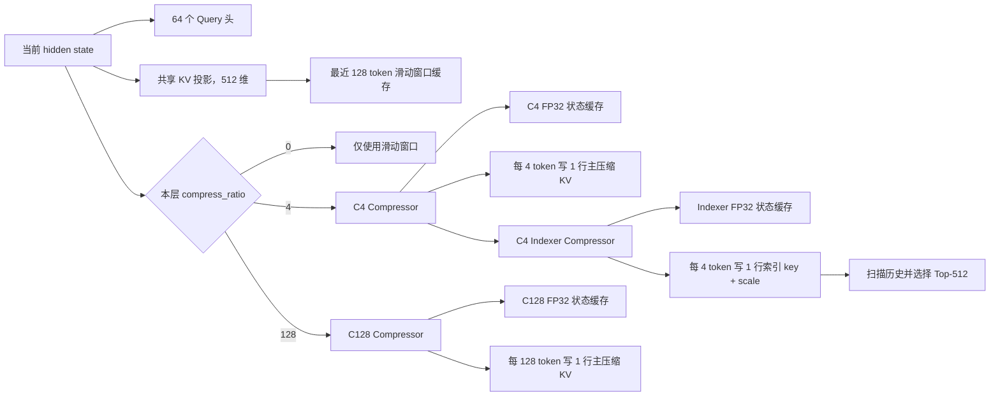
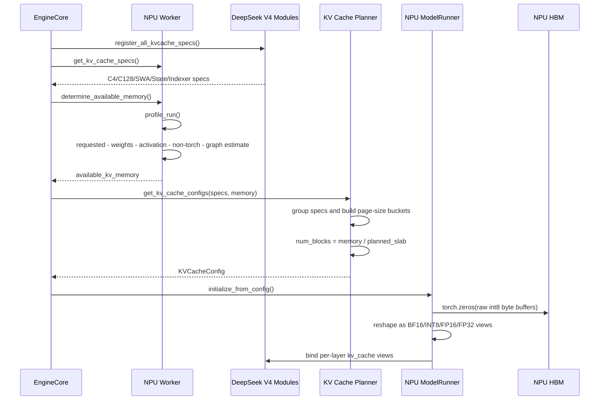
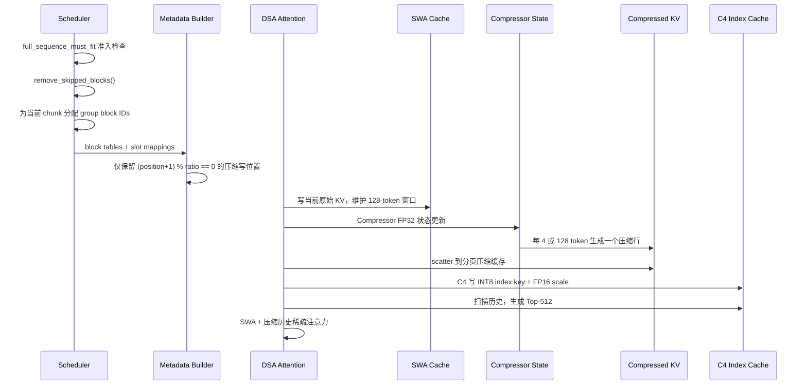
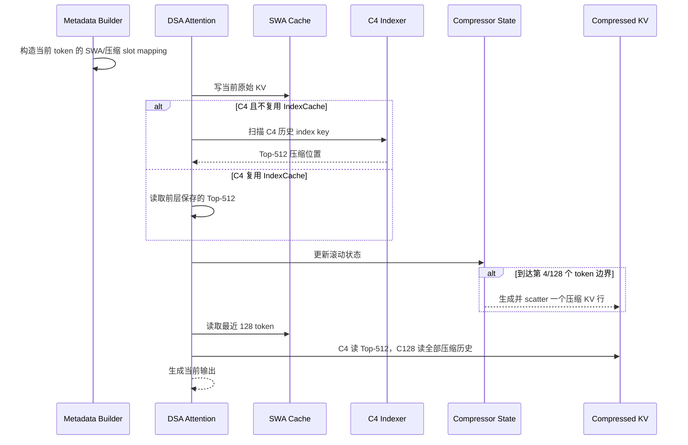

# DeepSeek V4 Flash KV Cache：显存申请、实际占用与运行管理源码量化分析

> 日期：2026-06-14  
> Hugging Face 模型：[`deepseek-ai/DeepSeek-V4-Flash`](https://huggingface.co/deepseek-ai/DeepSeek-V4-Flash)  
> Hugging Face 配置快照：`553034d7dd9e06c2eeaee68cf85a17d6d4754cf0`  
> vLLM：`0d29612292c6b1e312af42ac00cf649af16a438b`  
> vLLM Ascend：`8afdf356f6a2496bedfc538253366ef1a8c0d9aa`  
> Mooncake：`60452b6ecffe0c17e175cb686c567a74ee61b548`  
> 主量化口径：Ascend A2/A3、KV Cache block size 为 128、BF16 主缓存、上下文并行度为 1、单请求、单 NPU rank  
> 单位：KiB、MiB、GiB 均按 1024 进制

---

## 1. 技术结论

### 1.1 DeepSeek V4 Flash 不是“一份 KV Cache”，而是六类缓存共同组成

DeepSeek V4 Flash 的每层注意力都保留最近 128 个 token 的滑动窗口缓存；不同层再按配置增加：

1. **4 倍压缩主缓存**：每 4 个原始 token 生成一个压缩 KV 行。
2. **4 倍压缩索引缓存**：用于扫描历史并选择 512 个压缩位置。
3. **128 倍压缩主缓存**：每 128 个原始 token 生成一个压缩 KV 行。
4. **滑动窗口缓存**：保留最近 128 个原始 token。
5. **压缩器状态缓存**：保留生成下一个压缩行所需的浮点状态。
6. **可选 MTP 缓存**：启用 Multi-Token Prediction 投机解码时，额外增加一个滑动窗口缓存层。

模型配置的 43 个主层构成为：

| 层类型 | 层数 | 层号 |
|---|---:|---|
| 纯滑动窗口层 | 2 | 0、1 |
| 4 倍压缩层 | 21 | 2、4、...、42 |
| 128 倍压缩层 | 20 | 3、5、...、41 |
| MTP 草稿层配置 | 1 | 配置数组索引 43，是否分配取决于是否启用投机解码 |

依据：

- [Hugging Face config.json](https://huggingface.co/deepseek-ai/DeepSeek-V4-Flash/blob/553034d7dd9e06c2eeaee68cf85a17d6d4754cf0/config.json)
- [HF 参考 Attention 与 Compressor 实现](https://huggingface.co/deepseek-ai/DeepSeek-V4-Flash/blob/553034d7dd9e06c2eeaee68cf85a17d6d4754cf0/inference/model.py)
- [vLLM Ascend DeepSeek V4 构造链](/Users/linyi/code/Documents/code/vllm-ascend/vllm_ascend/models/deepseek_v4.py:711)

### 1.2 1M 上下文有三本不同的显存账

在启用一层 MTP、block size 为 128 的主口径下：

| 口径 | 1M 上下文、单请求、单 rank | 含义 |
|---|---:|---|
| HF 参考连续缓存 | 6.735 GiB | 按参考实现连续张量与 BF16 索引缓存计算，不含 MTP |
| vLLM Ascend 有效页面载荷 | 6.091 GiB | 实际属于该请求各缓存组的页面字节 |
| vLLM Ascend 共享块池占用 | 6.639 GiB | 请求占用 block ID 后，被锁住的完整物理 slab |
| 默认 A3 配方的准入峰值 | 12.166 GiB | `max-num-batched-tokens=10240` 时完整序列准入上界 |

因此：

- INT8 索引缓存把**有效载荷**从参考实现的 6.735 GiB 降到约 6.091 GiB。
- 共享 block ID 和异构页面组合使**真实块池占用**回升到约 6.639 GiB。
- 大批次预填充又会为滑动窗口和状态缓存预留本批次临时页，使**准入峰值**达到约 12.166 GiB。

所以“1M KV Cache 只占 6.1 GiB”只能描述稳定载荷，不能直接用于推导服务最大并发。

### 1.3 最大并发首先受预填充准入峰值约束

以 32 GiB 可用 KV 池为例：

| 场景 | 每请求 block ID | 共享块池占用 | 32 GiB 池的静态上限 |
|---|---:|---:|---:|
| 135K 稳定解码，页边界对齐 | 280 | 0.877 GiB | 36 |
| 133K 预填充准入，批次 8192 | 1688 | 5.289 GiB | 5 |
| 1M 稳定解码，页边界对齐 | 2119 | 6.639 GiB | 4 |
| 1M 预填充准入，批次 10240 | 3883 | 12.166 GiB | 2 |

该表还未扣除水位线、并发运行请求、投机 token、外部缓存临时块和设备 Graph 额外显存，因此是上限，不是服务承诺值。

### 1.4 Agentic 多轮负载的三个直接瓶颈

1. **跨全部缓存组的前缀命中被 16,384 token 对齐约束。**  
   4 倍压缩组的逻辑块覆盖 512 个原始 token，128 倍压缩组覆盖 16,384 个原始 token，协调器取最小公倍数。短轮次新增的几百到几千 token 不能单独形成完整的跨组缓存单元。

2. **当前源码注释明确指出滑动窗口组可能把 DeepSeek V4 Decode 节点的本地前缀命中压到 0。**  
   这不是压缩注意力理论上的必然限制，而是当前 hybrid prefix matching 实现限制。

3. **1M Decode 的历史读取上界主要来自 4 倍压缩索引扫描。**  
   按每层扫描完整 INT8 key 和 FP16 scale 估算，单输出 token 的逻辑读取上界约 0.838 GiB，其中索引缓存约占 79.5%。主 C4 KV 只读取 Top-512，已经不是主要字节来源。

---

## 2. 口径与名词

### 2.1 本文使用的四种容量

| 名称 | 定义 |
|---|---|
| 页面有效字节 | 某层真实数据结构所需字节 |
| 页面规划字节 | `KVCacheSpec.page_size_bytes`，包括对齐和 padding |
| 物理 slab 字节 | 一个全局 block ID 对应的所有已分配底层张量页面之和 |
| 请求占用字节 | 请求占用的全局 block ID 数乘以物理 slab 字节 |

“KV Cache 使用率”至少有两种：

```text
块池使用率
  = 已占用 block ID / 总 block ID

有效载荷率
  = 请求真正需要的 group 页面字节
    / 请求占用 block ID 锁住的物理 slab 字节
```

vLLM 现有 `kv_cache_usage_perc` 主要表达第一种，不直接表达第二种。

### 2.2 量化假设

主表采用：

- Ascend A2/A3 路径；
- `block_size=128`；
- 主压缩 KV 和滑动窗口 KV 为 BF16；
- C4 Indexer key 为 INT8、scale 为 FP16；
- Compressor state 为 FP32；
- 上下文并行度和预填充上下文并行度均为 1；
- 启用一层 MTP 时使用 44 个滑动窗口缓存层；
- 不考虑 allocator 元数据和每张 tensor 的 2 MiB 地址对齐额外 storage；
- 不把权重、激活、通信 buffer、ACL Graph pool 算入 KV Cache。

由于主 KV 只有一个共享 KV head，基线下这些缓存不会像普通多 KV head 模型那样按 tensor parallel size 简单除法缩小。

---

## 3. 模型参数如何决定缓存结构

### 3.1 官方配置

| 参数 | 值 | 对 KV Cache 的作用 |
|---|---:|---|
| 主层数 | 43 | 决定主注意力缓存层数 |
| MTP 层数 | 1 | 启用投机解码时增加草稿层缓存 |
| 最大上下文 | 1,048,576 | 压缩历史缓存容量上限 |
| hidden size | 4096 | 影响压缩器投影，不直接作为缓存行宽 |
| attention head dim | 512 | 主 KV 和滑动窗口每行 512 元素 |
| attention heads | 64 | Query 头数量 |
| KV heads | 1 | 每层只保存一个共享 KV 行 |
| rotary dim | 64 | 512 维中有 64 维使用旋转位置编码 |
| sliding window | 128 | 每层保留最近 128 个原始 token |
| index head dim | 128 | C4 索引 key 每行 128 元素 |
| index heads | 64 | 索引 Query 头数量，不等于缓存 key 行数 |
| index top-k | 512 | C4 主注意力每次选择 512 个压缩位置 |
| q low-rank size | 1024 | Query 低秩投影维度 |

Hugging Face 模型卡还说明该模型为 284B 总参数、13B 激活参数、支持 1M 上下文。参数权重的 FP4/FP8 混合格式不等于 KV Cache 自动采用相同格式。

来源：

- [DeepSeek V4 Flash 模型卡](https://huggingface.co/deepseek-ai/DeepSeek-V4-Flash)
- [DeepSeek V4 Flash config.json](https://huggingface.co/deepseek-ai/DeepSeek-V4-Flash/blob/553034d7dd9e06c2eeaee68cf85a17d6d4754cf0/config.json)

### 3.2 单层缓存结构



vLLM Ascend 的构造链：

- `compress_ratio`： [deepseek_v4.py:790](/Users/linyi/code/Documents/code/vllm-ascend/vllm_ascend/models/deepseek_v4.py:790)
- 主 Compressor： [deepseek_v4.py:815](/Users/linyi/code/Documents/code/vllm-ascend/vllm_ascend/models/deepseek_v4.py:815)
- C4 Indexer： [deepseek_v4.py:826](/Users/linyi/code/Documents/code/vllm-ascend/vllm_ascend/models/deepseek_v4.py:826)
- IndexCache 计算复用： [deepseek_v4.py:836](/Users/linyi/code/Documents/code/vllm-ascend/vllm_ascend/models/deepseek_v4.py:836)
- 每层 SWA cache： [deepseek_v4.py:855](/Users/linyi/code/Documents/code/vllm-ascend/vllm_ascend/models/deepseek_v4.py:855)

### 3.3 HF 参考实现说明了压缩语义

参考实现的 `Compressor`：

- 使用可学习门控，对连续 token 做加权池化；
- C4 使用重叠窗口；
- 压缩计算和状态使用 FP32；
- C4 每 4 token 写一个压缩行；
- C128 每 128 token 写一个压缩行。

参考：

- [Compressor: inference/model.py:279](https://huggingface.co/deepseek-ai/DeepSeek-V4-Flash/blob/553034d7dd9e06c2eeaee68cf85a17d6d4754cf0/inference/model.py#L279)
- [Indexer: inference/model.py:380](https://huggingface.co/deepseek-ai/DeepSeek-V4-Flash/blob/553034d7dd9e06c2eeaee68cf85a17d6d4754cf0/inference/model.py#L380)
- [Attention cache: inference/model.py:436](https://huggingface.co/deepseek-ai/DeepSeek-V4-Flash/blob/553034d7dd9e06c2eeaee68cf85a17d6d4754cf0/inference/model.py#L436)

参考实现直接预分配：

```text
每层主缓存行数
  = sliding_window + max_seq_len / compress_ratio
```

Indexer 还单独预分配：

```text
max_seq_len / 4 × index_head_dim
```

vLLM Ascend 没有照搬这种“每层连续大张量”，而是把它们转成分页缓存规格。

---

## 4. `KVCacheSpec` 如何把模型结构变成页面

### 4.1 A2/A3 的页面常量

vLLM Ascend 对 DeepSeek V4 约定：

```python
128: [[128, 128, 8, 32], [16640, 131072]]
```

四个 block size 依次是：

1. 压缩主缓存：128 个压缩行；
2. 滑动窗口缓存：128 个原始 token；
3. C4 状态缓存：8 个状态位置；
4. C128 状态缓存：32 个状态位置。

两个标准页面大小为：

- 小页面：16,640 bytes；
- 大页面：131,072 bytes。

源码：[layer.py:31-46](/Users/linyi/code/Documents/code/vllm-ascend/vllm_ascend/models/layer/attention/layer.py:31)

### 4.2 每类页面的逐字节计算

| 缓存类型 | 行/页 | 单行字节 | 真实页字节 | 规划页字节 | 页内有效率 |
|---|---:|---:|---:|---:|---:|
| C4/C128 主压缩 KV | 128 | `512 × 2 = 1024` | 131,072 | 131,072 | 100% |
| C4 Index key + scale | 128 | `128 × 1 + 1 × 2 = 130` | 16,640 | 16,640 | 100% |
| SWA | 128 | `512 × 2 = 1024` | 131,072 | 131,072 | 100% |
| C4 主 Compressor state | 8 | `2048 × 4 = 8192` | 65,536 | 131,072 | 50% |
| C4 Indexer state | 8 | `512 × 4 = 2048` | 16,384 | 16,640 | 98.46% |
| C128 Compressor state | 32 | `1024 × 4 = 4096` | 131,072 | 131,072 | 100% |

公式来自：

- 通用 `AttentionSpec.page_size_bytes`： [kv_cache_interface.py:159-180](/Users/linyi/code/Documents/code/vllm/vllm/v1/kv_cache_interface.py:159)
- Ascend MLA 页面： [patch_kv_cache_interface.py:62-89](/Users/linyi/code/Documents/code/vllm-ascend/vllm_ascend/patch/platform/patch_kv_cache_interface.py:62)
- Indexer 的 INT8 key 和 scale： [deepseek_v4.py:569-580](/Users/linyi/code/Documents/code/vllm-ascend/vllm_ascend/models/deepseek_v4.py:569)
- C4/C128 state_dim： [deepseek_v4.py:645-662](/Users/linyi/code/Documents/code/vllm-ascend/vllm_ascend/models/deepseek_v4.py:645)
- 状态窗口 8/128： [compressor.py:121-169](/Users/linyi/code/Documents/code/vllm/vllm/models/deepseek_v4/compressor.py:121)

### 4.3 每页覆盖多少原始 token

| 缓存类型 | 每页缓存行 | 压缩倍数 | 每页覆盖原始 token |
|---|---:|---:|---:|
| C4 主缓存 | 128 | 4 | 512 |
| C4 索引缓存 | 128 | 4 | 512 |
| C128 主缓存 | 128 | 128 | 16,384 |
| SWA | 128 | 1 | 128 |
| C4 state | 8 | 状态窗口 | 8 |
| C128 state | 32 | 状态窗口 | 32 |

摊到单层、单原始 token 的长期历史载荷：

| 历史缓存 | 字节/原始 token/层 |
|---|---:|
| C4 主缓存 | `131072 / 512 = 256` |
| C4 索引缓存 | `16640 / 512 = 32.5` |
| C128 主缓存 | `131072 / 16384 = 8` |

C128 极其节省长期容量，但一页覆盖 16K token，因此页尾碎片和跨组命中粒度也更大。

---

## 5. 六个 KV Cache group 如何共享一个 block pool

### 5.1 分组结果

Ascend patch 先按压缩倍数和滑动窗口 block size 分组：

- MLAAttentionSpec 按 `compress_ratio` 分为 C4、C128；
- SlidingWindowMLASpec 按 block size 分为 SWA、C4 state、C128 state；
- SWA 的 44 层再拆成两个 22 层 group。

源码：

- [group_and_unify_kv_cache_specs](/Users/linyi/code/Documents/code/vllm-ascend/vllm_ascend/patch/platform/patch_kv_cache_utils.py:61)
- [_get_kv_cache_groups_uniform_groups](/Users/linyi/code/Documents/code/vllm-ascend/vllm_ascend/patch/platform/patch_kv_cache_utils.py:95)

启用一层 MTP 时：

| Group | 层页面组成 | layer tuple 数 |
|---|---|---:|
| C4 Full | 21 个大页 + 21 个小页 | 21 |
| C128 Full | 20 个大页 | 20 |
| SWA-0 | 22 个大页 | 22 |
| SWA-1 | 21 个主层大页 + 1 个 MTP 大页 | 22 |
| C4 State | 21 个大页 + 21 个小页 | 21 |
| C128 State | 20 个大页 | 20 |

### 5.2 规划器为什么产生 23 个 slot

`_approximate_gcd()` 在 `[21, 20, 44, 21, 20]` 中选择 22，使总 padding 最小。随后：

- 非 MTP 的最长 bucket 为 22；
- MTP 被从 bucket 中单独取出；
- 最终 `num_layer_tuples = 22 + 1 = 23`。

源码：

- [_approximate_gcd](/Users/linyi/code/Documents/code/vllm/vllm/v1/core/kv_cache_utils.py:1469)
- [MTP 单独布局与 num_layer_tuples](/Users/linyi/code/Documents/code/vllm-ascend/vllm_ascend/patch/platform/patch_kv_cache_utils.py:204)

规划器的每个全局 block 预算：

```text
planned_slab
  = 23 × (16640 + 131072)
  = 3,397,376 bytes
  = 3.239990 MiB
```

`num_blocks`：

```text
num_blocks
  = available_kv_memory
    // 3,397,376
```

源码：[patch_kv_cache_utils.py:204-247](/Users/linyi/code/Documents/code/vllm-ascend/vllm_ascend/patch/platform/patch_kv_cache_utils.py:204)

### 5.3 实际分配为什么是 3.208 MiB

23 个小页面 slot 中只有 21 个有 `shared_by`：

- 一个普通空小 slot；
- MTP 只需要大页，不需要小页。

`_allocate_kv_cache_tensors()` 只遍历非空的 `shared_by` 分配张量，因此实际底层页面为：

```text
physical_slab
  = 21 × 16,640
    + 23 × 131,072
  = 3,364,096 bytes
  = 3.208252 MiB
```

规划器保守多算：

```text
33,280 bytes/block
= 0.98% planned_slab
```

分配代码：[model_runner_v1.py:3929-4109](/Users/linyi/code/Documents/code/vllm-ascend/vllm_ascend/worker/model_runner_v1.py:3929)

如果没有启用 MTP：

| 模式 | 规划 slab | 实际 slab |
|---|---:|---:|
| MTP 关闭 | 3.099 MiB | 3.083 MiB |
| 1 层 MTP 开启 | 3.240 MiB | 3.208 MiB |

### 5.4 一个 block ID 被不同 group 占用时的有效率

所有 group manager 共用同一个 `BlockPool`：

- [共享 BlockPool 创建](/Users/linyi/code/Documents/code/vllm-ascend/vllm_ascend/patch/platform/patch_kv_cache_coordinator.py:107)
- [所有 manager 注入同一个 pool](/Users/linyi/code/Documents/code/vllm-ascend/vllm_ascend/patch/platform/patch_kv_cache_coordinator.py:125)

当某个 group 占用一个 block ID 时，其他 group 不能同时使用这个 ID。各 group 的有效页面如下：

| 占用者 | 有效页面字节/block ID | 相对 3,364,096 bytes slab |
|---|---:|---:|
| C4 Full | 3,101,952 | 92.21% |
| C128 Full | 2,621,440 | 77.93% |
| 单个 SWA group | 2,883,584 | 85.72% |
| C4 State | 3,101,952 | 92.21% |
| C128 State | 2,621,440 | 77.93% |

这就是“块池使用率高，但有效载荷率仍可能只有 78% 至 92%”的来源。

---

## 6. 服务启动阶段：显存怎样真正申请

### 6.1 启动时序



Engine 主链：

- [core.py:240-300](/Users/linyi/code/Documents/code/vllm/vllm/v1/engine/core.py:240)

### 6.2 可用 KV Cache 预算

用户未指定 `--kv-cache-memory` 时：

```text
available_kv_memory
  = requested_memory
    - non_kv_cache_memory
    - applied_graph_memory_estimate
```

其中 `non_kv_cache_memory` 包括权重、Torch 峰值增长和非 Torch 内存增长。

源码：[worker.py:336-463](/Users/linyi/code/Documents/code/vllm-ascend/vllm_ascend/worker/worker.py:336)

指定 `--kv-cache-memory` 时：

- 仍执行 `profile_run()` 完成编译；
- 直接返回用户给定的 KV 字节预算；
- 不再尊重 `gpu_memory_utilization` 的自动计算。

### 6.3 DeepSeek V4 Graph 显存风险

当前压缩注意力路径会跳过 ACL Graph 显存 profiling，但 Graph mode 仍保持启用，后续仍会 capture。

源码：[worker.py:378-390](/Users/linyi/code/Documents/code/vllm-ascend/vllm_ascend/worker/worker.py:378)

这意味着：

- KV pool 可能按偏乐观预算分配；
- 真正 capture Graph 后，设备总显存可能超过目标比例；
- 静态公式算出的池容量不等于无 OOM 保证。

部署时应记录首次完整 warmup 后的：

- `torch.npu.memory_allocated()`；
- `torch.npu.memory_reserved()`；
- `npu-smi` 实际 HBM；
- KV raw tensor storage；
- Graph capture 前后增量。

### 6.4 物理池是启动时一次性分配

Runner 使用 `torch.zeros(size, dtype=torch.int8, device=npu)` 申请原始字节，再 reshape 成目标 dtype。

启用 KV transfer 时，每张底层 tensor 还会：

1. 多申请 2 MiB；
2. 对齐首地址；
3. 截取计划大小的 view。

源码：

- [raw byte allocation](/Users/linyi/code/Documents/code/vllm-ascend/vllm_ascend/worker/model_runner_v1.py:3929)
- [2 MiB alignment](/Users/linyi/code/Documents/code/vllm-ascend/vllm_ascend/worker/model_runner_v1.py:3947)
- [reshape and bind](/Users/linyi/code/Documents/code/vllm-ascend/vllm_ascend/worker/model_runner_v1.py:4144)

因此：

> 空载时 NPU 上已经存在完整 KV pool。请求到来时分配的是逻辑 block ID，不是再次向 NPU allocator 申请一块新 HBM。

### 6.5 不同 KV 预算能得到多少 block

按 MTP 开启、每 block 规划 3,397,376 bytes：

| 可用 KV 预算 | `num_blocks` | 实际可见 KV tensor 约占用 |
|---:|---:|---:|
| 16 GiB | 5,056 | 15.841 GiB |
| 32 GiB | 10,113 | 31.685 GiB |
| 48 GiB | 15,170 | 47.529 GiB |
| 64 GiB | 20,227 | 63.372 GiB |
| 80 GiB | 25,284 | 79.216 GiB |

差额来自 planner slack、整除余数；表内未计 2 MiB 对齐 storage 和 allocator 额外开销。

---

## 7. 单请求实际占用量化

### 7.1 历史缓存页数

上下文长度为 `L`：

```text
C4 历史页数
  P4 = ceil(L / (128 × 4))
     = ceil(L / 512)

C128 历史页数
  P128 = ceil(L / (128 × 128))
       = ceil(L / 16384)
```

稳定解码、恰好处于页边界时：

```text
block_ids_aligned
  = P4
    + P128
    + 2        # 两个 SWA group
    + 1        # C4 state group
    + 4        # C128 state，128/32
  = P4 + P128 + 7
```

由于窗口可能跨页，稳定阶段上界可再增加：

- 两个 SWA group 各 1 个；
- C4 state 1 个；
- C128 state 1 个；

即最多多 4 个 block ID，约 12.83 MiB。

### 7.2 稳定 Decode 阶段

| 上下文 L | P4 | P128 | 对齐 block ID | 块池占用 | 有效页面载荷 | 有效载荷率 |
|---:|---:|---:|---:|---:|---:|---:|
| 8,192 | 16 | 1 | 24 | 0.075 GiB | 0.067 GiB | 88.69% |
| 133,120 | 260 | 9 | 276 | 0.865 GiB | 0.791 GiB | 91.49% |
| 135,000 | 264 | 9 | 280 | 0.877 GiB | 0.803 GiB | 91.50% |
| 1,048,576 | 2,048 | 64 | 2,119 | 6.639 GiB | 6.091 GiB | 91.74% |

这些是**请求在稳定解码阶段的 resident 缓存**，不是完整序列准入预留。

### 7.3 HF 参考连续缓存的 1M 计算

按 43 主层、无 MTP、batch size 为 1：

| 组件 | 公式 | 字节 |
|---|---|---:|
| 43 层 SWA | `43 × 128 × 512 × 2` | 5,636,096 |
| 21 层 C4 主历史 | `21 × 1M/4 × 512 × 2` | 5,637,144,576 |
| 20 层 C128 主历史 | `20 × 1M/128 × 512 × 2` | 167,772,160 |
| 21 层 C4 BF16 Index | `21 × 1M/4 × 128 × 2` | 1,409,286,144 |
| C4 主状态 | `21 × 8 × 2048 × 4` | 1,376,256 |
| C4 Index 状态 | `21 × 8 × 512 × 4` | 344,064 |
| C128 状态 | `20 × 128 × 1024 × 4` | 10,485,760 |
| **总计** |  | **7,232,045,056 = 6.735 GiB** |

参考实现注释明确说明 Indexer 当前缓存使用 BF16：

- [inference/model.py:419](https://huggingface.co/deepseek-ai/DeepSeek-V4-Flash/blob/553034d7dd9e06c2eeaee68cf85a17d6d4754cf0/inference/model.py#L419)

vLLM Ascend A2/A3 把 Indexer key 改为 INT8，并额外保存 FP16 scale：

- [patch_kv_cache_interface.py:29-52](/Users/linyi/code/Documents/code/vllm-ascend/vllm_ascend/patch/platform/patch_kv_cache_interface.py:29)

所以有效页面载荷比参考实现低约 9.57%，但共享 slab 物理占用只低约 1.43%。

---

## 8. 为什么 Prefill 准入峰值远高于稳定占用

### 8.1 运行时准入门

调度器对新请求使用 `full_sequence_must_fit`：

1. 计算完整序列在各 group 的最大 block 需求；
2. 应用滑动窗口/压缩组的 admission cap；
3. 如果需求超过 free blocks，返回 `None`，请求继续等待；
4. 真正执行当前 chunk 前，先回收已经滑出窗口的旧块；
5. 再为本 chunk 分配新块。

源码：[kv_cache_manager.py:244-458](/Users/linyi/code/Documents/code/vllm/vllm/v1/core/kv_cache_manager.py:244)

### 8.2 滑动窗口的峰值公式

`SlidingWindowSpec` 的上界：

```text
max_blocks
  = ceil(
      min(sliding_window - 1 + max_num_batched_tokens,
          max_model_len)
      / block_size
    )
    + 1
```

源码：[kv_cache_interface.py:488-508](/Users/linyi/code/Documents/code/vllm/vllm/v1/kv_cache_interface.py:488)

关键含义：

> 虽然状态窗口只有 8 或 128 个 token，但一个 8K/10K 的 Prefill chunk 开始前，需要同时为旧窗口尾部和本批新 token 提供 slot。窗口内旧块只能在下一次调度前被批量回收。

### 8.3 压缩历史组的准入 cap

Ascend 的 `CompressAttentionManager` 在 block 计算前先除以压缩倍数：

- C4 的一个物理页按 512 个原始 token 计；
- C128 的一个物理页按 16,384 个原始 token 计。

源码：[single_type_kv_cache_manager.py:29-58](/Users/linyi/code/Documents/code/vllm-ascend/vllm_ascend/core/single_type_kv_cache_manager.py:29)

Manager 配置的 admission cap 带一个安全余量，但基础 manager 会把真实需求与 cap 取最小值；因此没有 speculative lookahead 时，完整序列需求仍是 `ceil(L/(block_size×ratio))`，不应把安全余量强制加到每个请求：

- [single_type_kv_cache_manager.py:239-292](/Users/linyi/code/Documents/code/vllm-ascend/vllm_ascend/core/single_type_kv_cache_manager.py:239)

### 8.4 两个官方配方口径的峰值

vLLM Ascend DeepSeek V4 Flash 教程使用过：

- `max-num-batched-tokens=8192`；
- A3 W8A8 配方使用 `10240`。

来源：[DeepSeek-V4-Flash.md:149、198](/Users/linyi/code/Documents/code/vllm-ascend/docs/source/tutorials/models/DeepSeek-V4-Flash.md:149)

#### 133,120 上下文，Prefill chunk 8192

| Group | admission block ID |
|---|---:|
| C4 Full | `ceil(133120/512) = 260` |
| C128 Full | `ceil(133120/16384) = 9` |
| 每个 SWA group | `ceil((127+8192)/128)+1 = 66` |
| C4 State | `ceil((7+8192)/8)+1 = 1026` |
| C128 State | `ceil((127+8192)/32)+1 = 261` |
| **合计** | **1688** |

```text
1688 × 3,364,096
= 5.289 GiB 块池占用
```

#### 1M 上下文，Prefill chunk 10240

| Group | admission block ID |
|---|---:|
| C4 Full | 2048 |
| C128 Full | 64 |
| 每个 SWA group | 82 |
| C4 State | 1282 |
| C128 State | 325 |
| **合计** | **3883** |

```text
3883 × 3,364,096
= 12.166 GiB 块池占用
```

### 8.5 降低 Prefill chunk 的容量收益

固定 1M 最大上下文：

| `max-num-batched-tokens` | admission block ID | 每请求块池预留 |
|---:|---:|---:|
| 512 | 2,211 | 6.927 GiB |
| 1,024 | 2,299 | 7.203 GiB |
| 2,048 | 2,475 | 7.754 GiB |
| 4,096 | 2,827 | 8.857 GiB |
| 8,192 | 3,531 | 11.063 GiB |
| 10,240 | 3,883 | 12.166 GiB |

这说明：

- 小 chunk 会提高长上下文可准入并发；
- 大 chunk 一般有利于 Prefill 算子吞吐和通信效率；
- DeepSeek V4 Flash 需要把 `max-num-batched-tokens` 当作**KV 容量参数**共同调优，而不只是计算批次参数。

---

## 9. Prefill 阶段的 KV Cache 写入



### 9.1 Metadata 只为压缩边界生成位置

Prefill metadata 使用：

```python
mask = ((input_positions + 1) % compress_ratio) == 0
```

只有满足压缩边界的位置才映射到压缩缓存。

源码：[dsa_v1.py:658-669](/Users/linyi/code/Documents/code/vllm-ascend/vllm_ascend/attention/dsa_v1.py:658)

### 9.2 Compressor 写 state 和主压缩缓存

Prefill 调用 `_C_ascend.compressor`：

- 输入 hidden states；
- 使用 FP32 state cache；
- 通过 state block table 访问状态；
- 输出压缩行；
- `cache_mode=1` 写回状态。

随后 `dsa_kv_compress_scatter` 把压缩行写入分页缓存。

源码：

- [dsa_v1.py:2058-2078](/Users/linyi/code/Documents/code/vllm-ascend/vllm_ascend/attention/dsa_v1.py:2058)
- [dsa_v1.py:2096-2098](/Users/linyi/code/Documents/code/vllm-ascend/vllm_ascend/attention/dsa_v1.py:2096)

### 9.3 C4 Indexer 写入并选择 Top-512

Indexer 使用量化 Lightning Indexer：

- Query 动态量化；
- key 来自 INT8 index cache；
- scale 来自 FP16 scale cache；
- `sparse_count=index_topk=512`；
- `cmp_ratio=4`。

源码：[dsa_v1.py:2110-2129](/Users/linyi/code/Documents/code/vllm-ascend/vllm_ascend/attention/dsa_v1.py:2110)

### 9.4 C4 与 C128 的注意力读取不同

C4：

- 最近 128 token 从 SWA cache 读取；
- 历史压缩 KV 只读取 Indexer 选出的 Top-512。

C128：

- 最近 128 token 从 SWA cache 读取；
- 历史压缩 KV 全部参与压缩注意力，但历史只有 `L/128` 行。

源码：

- [C4 Prefill attention](/Users/linyi/code/Documents/code/vllm-ascend/vllm_ascend/attention/dsa_v1.py:2135)
- [C128 Prefill attention](/Users/linyi/code/Documents/code/vllm-ascend/vllm_ascend/attention/dsa_v1.py:2160)

---

## 10. Decode 阶段的读写与带宽



### 10.1 Decode 元数据

Decode 仍按压缩边界筛选新压缩位置，并为 C4 准备 Lightning Indexer metadata。

源码：

- [dsa_v1.py:922-970](/Users/linyi/code/Documents/code/vllm-ascend/vllm_ascend/attention/dsa_v1.py:922)
- [dsa_v1.py:1023-1099](/Users/linyi/code/Documents/code/vllm-ascend/vllm_ascend/attention/dsa_v1.py:1023)

### 10.2 每个 Decode token 的写入

每层每个 token：

1. 必写一行 SWA KV；
2. 必更新 Compressor state；
3. 只有到压缩边界时才新增主压缩 KV；
4. C4 到边界时还新增 index key 和 scale。

源码：

- SWA scatter： [dsa_v1.py:2315-2316](/Users/linyi/code/Documents/code/vllm-ascend/vllm_ascend/attention/dsa_v1.py:2315)
- Compressor： [dsa_v1.py:2369-2389](/Users/linyi/code/Documents/code/vllm-ascend/vllm_ascend/attention/dsa_v1.py:2369)
- 压缩 KV scatter： [dsa_v1.py:2404](/Users/linyi/code/Documents/code/vllm-ascend/vllm_ascend/attention/dsa_v1.py:2404)

### 10.3 1M 上下文的逻辑读取上界

以下是代码结构对应的数据量上界，不是 NPU HBM 计数器实测值：

| 组件 | 估算 | 每输出 token |
|---|---|---:|
| 21 层 C4 Index 扫描 | `21 × 262144 × 130` | 715,653,120 B |
| 21 层 C4 Top-512 主 KV | `21 × 512 × 1024` | 11,010,048 B |
| 20 层 C128 全压缩历史 | `20 × 8192 × 1024` | 167,772,160 B |
| 44 层 SWA | `44 × 128 × 1024` | 5,767,168 B |
| **合计** |  | **900,202,496 B = 0.838 GiB** |

比例：

- C4 Index 扫描：79.5%；
- C128 历史：18.6%；
- C4 Top-512 主 KV：1.2%；
- SWA：0.6%。

实际 HBM 流量会受片上缓存、算子分块、重复读取、并行切分和 IndexCache 复用影响，必须用 NPU profiler 验证。

### 10.4 IndexCache 的作用和边界

启用 `use_index_cache` 后，部分 C4 层可跳过自己的 Top-K 计算，复用前面 C4 层保存的 Top-K index。

源码：

- 配置和 skip pattern： [deepseek_v4.py:836-853](/Users/linyi/code/Documents/code/vllm-ascend/vllm_ascend/models/deepseek_v4.py:836)
- Decode 复用： [dsa_v1.py:2331-2365](/Users/linyi/code/Documents/code/vllm-ascend/vllm_ascend/attention/dsa_v1.py:2331)

它能减少：

- Indexer Query 投影；
- index key 扫描；
- Top-K 选择。

它不能自动减少：

- 每个 C4 层已构造的 index KV cache；
- C4 主 KV cache；
- 共享 block pool 容量。

所以这是 Decode 带宽/计算优化，不是当前实现下的 KV 容量优化。

---

## 11. 回收、前缀缓存与淘汰

### 11.1 滑动窗口主动回收

`remove_skipped_blocks()`：

1. 计算已滑出窗口的 token；
2. 把对应 request block 替换为 null block；
3. 未进入 prefix cache 的 scratch block 放到 free queue 前部，优先立即复用；
4. 已缓存 block 放到后部，尽量保留前缀复用价值。

源码：[single_type_kv_cache_manager.py:448-501](/Users/linyi/code/Documents/code/vllm/vllm/v1/core/single_type_kv_cache_manager.py:448)

滑动窗口跳过 token 数：

```text
max(0, num_computed_tokens - sliding_window + 1)
```

源码：[single_type_kv_cache_manager.py:767-793](/Users/linyi/code/Documents/code/vllm/vllm/v1/core/single_type_kv_cache_manager.py:767)

### 11.2 Prefix cache 的 block 生命周期

`BlockPool` 同时维护：

- 全部 block；
- free queue；
- `block_hash -> block` 索引；
- null block。

源码：[block_pool.py:130-178](/Users/linyi/code/Documents/code/vllm/vllm/v1/core/block_pool.py:130)

完整 block 被写入 prefix cache：

- 根据 request token hash 和 group ID 建立 key；
- 不缓存 null block 或被 mask 的不可达 SWA block。

源码：[block_pool.py:211-331](/Users/linyi/code/Documents/code/vllm/vllm/v1/core/block_pool.py:211)

### 11.3 本地淘汰不是单独后台扫描

新分配从 free queue 头部取 block：

```python
ret = free_block_queue.popleft_n(num_blocks)
_maybe_evict_cached_block(block)
```

如果取出的 block 仍带 prefix hash，就在被重新分配时删除 hash。

源码：[block_pool.py:333-400](/Users/linyi/code/Documents/code/vllm/vllm/v1/core/block_pool.py:333)

因此本地策略更准确的描述是：

> free queue 顺序驱动的缓存候选淘汰；被 touch 的命中块会从 free queue 移除并增加引用计数。

不应把它简单描述成独立维护全局时间戳的严格 LRU。

### 11.4 DeepSeek V4 的前缀命中对齐

Compressed manager 使用：

```text
logical_block_size
  = physical_block_size × compress_ratio
```

即：

- C4：512 原始 token；
- C128：16,384 原始 token。

源码：[single_type_kv_cache_manager.py:188-236](/Users/linyi/code/Documents/code/vllm-ascend/vllm_ascend/core/single_type_kv_cache_manager.py:188)

Hybrid coordinator 再取所有 attention type 的最小公倍数：

```text
lcm_block_size = 16,384 token
```

源码：[patch_kv_cache_coordinator.py:203-210](/Users/linyi/code/Documents/code/vllm-ascend/vllm_ascend/patch/platform/patch_kv_cache_coordinator.py:203)

### 11.5 当前 SWA 前缀命中限制

源码注释明确记录：

- DeepSeek V4 有两个 full-attention-like 压缩组；
- 当前截断逻辑只完整处理第一个；
- 由于 SWA，Decode 节点可能得不到 prefix cache hit。

来源：[patch_kv_cache_coordinator.py:310-316](/Users/linyi/code/Documents/code/vllm-ascend/vllm_ascend/patch/platform/patch_kv_cache_coordinator.py:310)

这对 Agentic 多轮负载非常关键：

- 模型结构本身允许复用压缩历史；
- 当前跨组命中协调可能被 SWA group 限制；
- 不能只看 `enable_prefix_caching=True` 就假定多轮历史已完整复用。

---

## 12. Offload：从 NPU 移到 CPU

### 12.1 Simple CPU Offload

Ascend simple offload worker：

1. 遍历所有 KV cache tensor；
2. 按底层 storage 指针去重；
3. 把每张 tensor 暴露为 `[num_blocks, block_bytes]`；
4. 在 CPU pinned memory 中创建镜像；
5. 使用独立 NPU stream 做 load/store。

源码：[simple_kv_offload/worker.py:75-158](/Users/linyi/code/Documents/code/vllm-ascend/vllm_ascend/simple_kv_offload/worker.py:75)

它特意根据 tensor shape 和 stride 算页面，而不是使用 `storage.nbytes()`，原因是 KV transfer 模式会多申请 2 MiB 对齐空间。

源码：[simple_kv_offload/worker.py:160-224](/Users/linyi/code/Documents/code/vllm-ascend/vllm_ascend/simple_kv_offload/worker.py:160)

### 12.2 DMA 粒度

`copy_blocks()` 为所有 sub-tensor 和 block ID 生成地址数组，再调用一次：

```python
torch.ops._C_ascend.swap_blocks_batch(...)
```

源码：[npu_mem_ops.py:71-99](/Users/linyi/code/Documents/code/vllm-ascend/vllm_ascend/simple_kv_offload/npu_mem_ops.py:71)

对 DeepSeek V4 的影响：

- 一个全局 block ID 对应约 3.208 MiB 物理 slab；
- simple offload 的参数包含全部 unique cache tensor；
- 它不如 group-aware Mooncake transfer 容易只搬 C4/C128/SWA 中真正归属该 group 的页面；
- 小粒度频繁换入换出会放大 PCIe/HCCS 带宽和延迟。

### 12.3 适合下沉什么

优先级应为：

1. 冷的 C4/C128 历史完整块；
2. 长时间不活跃会话的完整 prefix；
3. 不应优先下沉当前 SWA 窗口和 Compressor state；
4. 不应为几百 token 的短 Agent turn 频繁做完整 slab swap。

simple offload 更适合容量兜底，不适合在低延迟 Decode 热路径上高频抖动。

---

## 13. Mooncake P2P 与 KV Cache Pool

### 13.1 P/D 分离的 Mooncake P2P

Hybrid connector：

1. 为各缓存组保存 base address、block length、stride；
2. 对连续 block ID 合并传输；
3. 通过 `addr_group_idx` 跳过不属于当前 group 的底层 tensor；
4. 批量执行 `batch_transfer_sync_read`。

源码：[mooncake_hybrid_connector.py:545-621](/Users/linyi/code/Documents/code/vllm-ascend/vllm_ascend/distributed/kv_transfer/kv_p2p/mooncake_hybrid_connector.py:545)

相对 simple CPU offload：

- P2P 是 group-aware；
- 能合并连续 block；
- 可直接 NPU 到 NPU；
- 支持 MTP cache transfer。

MTP transfer：[mooncake_hybrid_connector.py:670-674](/Users/linyi/code/Documents/code/vllm-ascend/vllm_ascend/distributed/kv_transfer/kv_p2p/mooncake_hybrid_connector.py:670)

### 13.2 AscendStore 外部 KV Pool

KV Cache Pool 目标是把片上 HBM、主机 DRAM 和 SSD 组织为共享前缀池：

- [KV Cache Pool Guide](/Users/linyi/code/Documents/code/vllm-ascend/docs/source/developer_guide/Design_Documents/KV_Cache_Pool_Guide.md:1)

Worker 按 group 建立 key metadata：

- model；
- tensor/head rank；
- prefill/decode context parallel rank；
- pipeline rank；
- group ID；
- cache role；
- cache family。

源码：[config_data.py:20-95](/Users/linyi/code/Documents/code/vllm-ascend/vllm_ascend/distributed/kv_transfer/kv_pool/ascend_store/config_data.py:20)

Mooncake backend 支持：

- Ascend protocol；
- 普通 transfer engine；
- A3 Fabric Memory 直接路径；
- multi-buffer batch put/get；
- 可选 SSD offload；
- 每个 tensor parallel rank 使用独立 SSD 目录。

源码：[mooncake_backend.py:61-157](/Users/linyi/code/Documents/code/vllm-ascend/vllm_ascend/distributed/kv_transfer/kv_pool/ascend_store/backend/mooncake_backend.py:61)

### 13.3 外部池最小传输粒度是 16,384 token

Pool scheduler：

```text
family_granularity
  = group_block_size × compress_ratio

cache_transfer_granularity
  = lcm(all group block sizes,
        all family granularities)
```

源码：

- [get_cache_family_granularity](/Users/linyi/code/Documents/code/vllm-ascend/vllm_ascend/distributed/kv_transfer/kv_pool/ascend_store/config_data.py:115)
- [_infer_cache_transfer_granularity](/Users/linyi/code/Documents/code/vllm-ascend/vllm_ascend/distributed/kv_transfer/kv_pool/ascend_store/pool_scheduler.py:150)

DeepSeek V4：

```text
C4    = 128 × 4   = 512
C128  = 128 × 128 = 16,384
SWA   = 128
State = 8 / 32

LCM = 16,384
```

默认 `discard_partial_chunks=True` 时，prompt 长度会向下取整到 16,384 的倍数；少于一个粒度直接不查询外部缓存。

源码：[pool_scheduler.py:224-250](/Users/linyi/code/Documents/code/vllm-ascend/vllm_ascend/distributed/kv_transfer/kv_pool/ascend_store/pool_scheduler.py:224)

Agentic 影响：

- 8K system prompt 无法形成一次完整外部池命中；
- 20K prompt 最多命中前 16K；
- 每轮新增 1K token 时，要累计跨过下一个 16K 边界，外部池才会出现新的完整块；
- 对 100K 以上稳定长会话仍有明显价值。

### 13.4 SWA 传输会被裁剪

Pool scheduler 对滑动窗口 group 只保留最后：

```text
ceil(sliding_window / block_size) + 1
```

个 block。

源码：[pool_scheduler.py:186-222](/Users/linyi/code/Documents/code/vllm-ascend/vllm_ascend/distributed/kv_transfer/kv_pool/ascend_store/pool_scheduler.py:186)

这避免把已经不可能参与注意力的旧 SWA 页面写入外部池。

### 13.5 当前不支持 DeepSeek V4 hybrid layerwise pool

Scheduler 和 Worker 都明确拒绝：

```python
if use_layerwise and num_kv_cache_groups > 1:
    raise NotImplementedError
```

源码：

- [pool_scheduler.py:72-73](/Users/linyi/code/Documents/code/vllm-ascend/vllm_ascend/distributed/kv_transfer/kv_pool/ascend_store/pool_scheduler.py:72)
- [pool_worker.py:127-128](/Users/linyi/code/Documents/code/vllm-ascend/vllm_ascend/distributed/kv_transfer/kv_pool/ascend_store/pool_worker.py:127)

因此当前 DeepSeek V4：

- 可以使用 hybrid group-aware pool；
- 不能使用逐层加载来把网络传输与逐层前向充分重叠；
- 超大 prefix load 更容易形成首 token 前的集中传输延迟。

### 13.6 Mooncake 自身淘汰

当前 Mooncake 配置包含：

- `default_kv_lease_ttl`；
- `default_kv_soft_pin_ttl`；
- `allow_evict_soft_pinned_objects`；
- `eviction_ratio`；
- `eviction_high_watermark_ratio`。

来源：[master.yaml](/Users/linyi/code/Documents/code/Mooncake/mooncake-store/conf/master.yaml:1)

Mooncake 还具有：

- LRU eviction strategy 测试；
- memory replica 和 disk replica；
- SSD offload；
- offload-on-evict 路径。

这些是外部存储池对象淘汰，与 vLLM 本地 `BlockPool` 的 block 再分配淘汰是两套独立生命周期。

---

## 14. 面向 Agentic 超长多轮负载的瓶颈拆解

### 14.1 短会话：固定状态和页尾成本更明显

8K 上下文稳定载荷率只有 88.69%，低于 1M 的 91.74%。原因：

- C128 至少分配一页，但只填 64/128 个压缩行；
- SWA 和状态缓存是每请求固定成本；
- 全局 slab 不能被不同 group 共享同一 block ID。

高并发短会话更关注：

- 每请求固定 group block 数；
- 页尾浪费；
- block pool 碎片；
- 调度和状态缓存固定开销。

### 14.2 长会话：C4 Index 扫描成为带宽中心

1M 上下文中：

- 主 C4 KV 已通过 Top-512 把读取压到约 10.5 MiB；
- C4 Index 历史扫描仍约 682.5 MiB；
- C128 历史约 160 MiB。

因此继续压缩主 C4 KV 对 Decode 的收益有限，优先级更高的是：

- IndexCache Top-K 跨层复用；
- Index key 更低比特或分层索引；
- 减少全历史索引扫描；
- 让索引读取与主 attention/投影重叠。

### 14.3 多轮重放：16K 粒度和 SWA 命中限制

典型 Agent request 会把完整对话再次发送：

```text
system prompt
+ 历史工具调用
+ 历史模型回复
+ 本轮新增少量 token
```

理想状态下应只 Prefill 新增尾部。当前 DeepSeek V4 路径的限制：

- 本地 hybrid prefix hit 需要 16K 对齐；
- 外部 pool 默认也以 16K 粒度保存和加载；
- 当前 SWA 命中逻辑可能把 Decode 节点命中压到 0；
- 不满 16K 的新尾部仍需重算。

因此要分别监控：

```text
local_prefix_hit_tokens
external_prefix_hit_tokens
recomputed_prompt_tokens
16K_partial_tail_tokens
```

### 14.4 Prefill 吞吐与并发存在直接交换

1M 场景把 chunk 从 10240 降到 2048：

- admission 占用从 12.166 GiB 降到 7.754 GiB；
- 理论并发显著提升；
- 但 Prefill kernel、通信和调度批次变小。

最优点不能只靠模型 FLOPs 推导，需要以：

- prompt tokens/s；
- time to first token；
- admitted long sessions；
- preemption；
- KV block usage；
- NPU utilization；
- external cache load latency；

联合实验确定。

---

## 15. 优化建议

### 15.1 P0：增加 DeepSeek V4 KV Memory Ledger

启动时直接输出：

```text
available_kv_memory
planned_slab_bytes
physical_slab_bytes
num_blocks
page_count_by_size
tensor_storage_bytes
alignment_storage_bytes
group_payload_bytes_per_block
group_payload_efficiency
```

运行时输出：

```text
active_block_ids_by_group
cached_evictable_blocks_by_group
scratch_blocks_by_group
admission_reserved_blocks_by_group
useful_payload_bytes_by_group
```

这是验证本报告静态公式和设备真实 HBM 的最低成本改动。

配套实施方案：

- [vLLM / vLLM Ascend KV Cache 显存效率：监控采集与实验验证方案](/Users/linyi/code/Documents/obsidian_wiki/llm-wikid/raw/infra/20260614-172505-vllm-vllm-ascend-kvcache显存效率-监控采集与实验验证方案-分析.md)

### 15.2 P0：把 Prefill chunk 作为容量控制变量

建议至少测试：

```text
max-num-batched-tokens
= 1024 / 2048 / 4096 / 8192 / 10240
```

为不同队列建立独立配置：

- 低延迟长会话队列：较小 chunk，优先准入并发；
- 离线吞吐队列：较大 chunk，优先 Prefill throughput；
- 短 Agent turn 队列：基于增量 token 自适应 chunk。

### 15.3 P1：让状态缓存支持 chunk 内滚动复用

当前准入峰值的主要增量来自：

- C4 state：10240 chunk 需要 1282 个 block ID；
- C128 state：需要 325 个 block ID；
- 实际跨 chunk 持久状态窗口却只有 8 和 128。

可行方向：

1. 把 chunk 内中间 state 作为算子 scratch；
2. 只把 chunk 末尾状态写回持久 KV Cache；
3. Metadata 不再为本 chunk 每个原始 token 分配长期 state slot；
4. 把 state 的 admission cap 从 `O(chunk_size)` 降到 `O(state_window)`。

这是最可能同时提升 1M 并发和降低 Prefill 峰值的结构性优化，但需要 Compressor kernel、slot mapping 和调度器共同修改。

### 15.4 P1：修复跨组 prefix hit，而不是关闭 SWA 复用

当前注释已经暴露两个问题：

- 两个压缩 full group 的截断处理不完整；
- SWA group 可能把总 hit length 变为 0。

建议：

1. C4/C128 历史按 16K 边界复用；
2. SWA 只加载命中边界前最后 128 token 的尾部；
3. State cache 不从外部复用，或仅恢复边界状态；
4. 允许不同 group 返回不同物理 block 列表，但共享一个一致的 computed token 边界。

### 15.5 P1：降低外部池的跨组最小粒度

当前 LCM 强制 16K。可考虑 family-aware checkpoint：

- C4 每 512 token 存一个 family chunk；
- C128 每 16K token 存一个 family chunk；
- SWA 只存边界尾部；
- 恢复时取各 family 的共同可用 token 边界，而不是要求每个对象都以相同 chunk 切分。

收益：

- 8K system prompt 也可获得 C4/SWA 级复用；
- Agent 每轮新增几百 token 时可更早写回增量；
- 减少 16K partial tail 重算。

代价是 key 数量、metadata lookup 和一致性逻辑更复杂。

### 15.6 P1：支持 hybrid layerwise Mooncake load

当前 hybrid group 明确不支持 layerwise。实现后可：

- 先加载前几层；
- 计算前几层时并行加载后续层；
- 把大 prefix 的集中传输延迟摊进模型前向；
- 改善 P/D 分离和跨节点 Agent 会话迁移的首 token 延迟。

### 15.7 P1：优先优化 C4 Index 路径

现有 `use_index_cache` 已提供安全的 Top-K 跨层复用基础。

建议实验：

- `index_topk_freq=1/2/4`；
- 按层模式复用；
- 记录质量、每 token latency、indexer kernel time、HBM read；
- 不改变 index KV 容量时，先验证计算和带宽收益。

进一步减少 index KV 内存需要模型或量化方案支持，不能仅靠框架无损修改。

### 15.8 P2：改进物理 block allocator

当前一个全局 block ID 对应固定异构 slab。可考虑：

- 每个 group 独立 block pool；
- variable-size page allocator；
- block ID 只做逻辑 handle，映射到 group-specific physical page；
- offload/transfer 只搬 owner group 页面。

潜在收益：

- 消除 C128 group 的约 22% slab 空洞；
- 消除 SWA group 的约 14% slab 空洞；
- CPU offload 不再搬整块无关 tensor；
- 更准确地按 group 做水位线和淘汰。

代价是 block table、prefix hash、P/D connector 和 kernel ABI 均需适配，改动面大于前述优化。

---

## 16. 建议实验矩阵

### 16.1 容量实验

固定：

- DeepSeek V4 Flash checkpoint；
- 同一 NPU 型号；
- 同一 tensor/pipeline/context parallel 配置；
- MTP 开关分别测试；
- block size 128。

变量：

| 变量 | 值 |
|---|---|
| 上下文 | 8K、32K、128K、256K、512K、1M |
| Prefill chunk | 1K、2K、4K、8K、10K |
| 并发长会话 | 1、2、4、8、直到稳定性边界 |
| Prefix cache | off/on |
| IndexCache | off、freq=2、freq=4 |
| Mooncake | off、P2P、KV Pool |

### 16.2 必须采集

1. 启动时 KV planned/physical/storage bytes。
2. 各 group active block IDs。
3. `full_sequence_must_fit` 请求需求和拒绝原因。
4. Prefill 每 chunk 的 block 峰值。
5. Decode 稳态 block 数。
6. Prefix local/external hit token。
7. SWA/state 主动回收 block 数。
8. eviction、preemption、recompute token。
9. Indexer、C4 attention、C128 attention、Compressor kernel time。
10. NPU HBM read/write bandwidth。
11. CPU/Mooncake transfer bytes、延迟和重叠比例。
12. TTFT、TPOT、prompt throughput、output throughput。

### 16.3 静态公式的验收条件

应验证：

```text
startup_visible_kv_bytes
≈ num_blocks × 3,364,096
```

若启用 KV transfer：

```text
storage_bytes
> visible_kv_bytes
```

差值应主要来自每张 tensor 的 2 MiB 地址对齐和 allocator 行为。

稳定 1M 单请求：

```text
active_block_ids
≈ 2119 到 2123
```

Prefill admission、chunk 10240：

```text
reservation upper bound
≈ 3883 block IDs
```

若实测明显偏离，应逐项检查：

- MTP 是否启用；
- block size；
- A5 与 A2/A3 page table；
- context parallel size；
- prefix/external cache hit；
- speculative lookahead；
- 实际 `max_num_batched_tokens`；
- 当前仓库版本。

---

## 17. 限制与结论边界

1. 本文“实际占用”指由当前源码布局可精确推导的 tensor/page/block 字节，不是某台 NPU 上已经采集的 HBM 曲线。
2. allocator reserve、Graph pool、通信 buffer 和 2 MiB 对齐额外 storage 需要运行实测。
3. Decode 0.838 GiB/token 是逻辑读取上界，不等于设备实际 HBM transaction。
4. MTP 是否真正分配缓存取决于服务是否启用投机解码，不能只依据模型 config 的 `num_nextn_predict_layers=1`。
5. A5 使用不同页面表、FP8 主缓存和 FP32 index scale，不能直接复用 A2/A3 数字。
6. context parallel 会改变每 rank 的历史缓存和 transfer 粒度，本文主表按 1 计算。
7. 外部 pool 的实际命中率还取决于 prompt 模板稳定性、tool result 内容、租户隔离 key 和路由策略。

---

## 18. 最终判断

DeepSeek V4 Flash 的 1M KV Cache 容量优势是真实的：C128 历史只有每 token 每层 8 bytes，C4 主历史通过压缩和 Top-512 稀疏读取显著降低主 KV 带宽，Ascend 又把 C4 Index key 从 BF16 降为 INT8。

但服务并发不能只看稳定历史缓存：

1. **统一 block pool 把异构页面绑定到同一个 block ID，实际占用高于有效载荷。**
2. **大 Prefill chunk 会把状态缓存和 SWA 临时页计入完整序列准入，使 1M 请求从约 6.64 GiB 稳态上升到约 12.17 GiB 准入峰值。**
3. **跨组 prefix 和外部 pool 以 16K token 为共同粒度，且当前 SWA 命中路径仍有限制。**
4. **1M Decode 的主要历史读取已经转移到 C4 Index 扫描，而不是主 C4 KV。**

对“超大上下文 + 超大轮次 + Agentic 并发”最优先的三个工程动作是：

1. 建立按 group 的 KV Memory Ledger，先把 planned、physical、payload、admission 四本账在线化；
2. 让 Compressor state 在 Prefill chunk 内滚动复用，降低 `O(chunk_size)` 的状态页峰值；
3. 修复 C4/C128/SWA 的异构 prefix hit，并把 Mooncake 从统一 16K 对齐升级为 family-aware 增量缓存。
