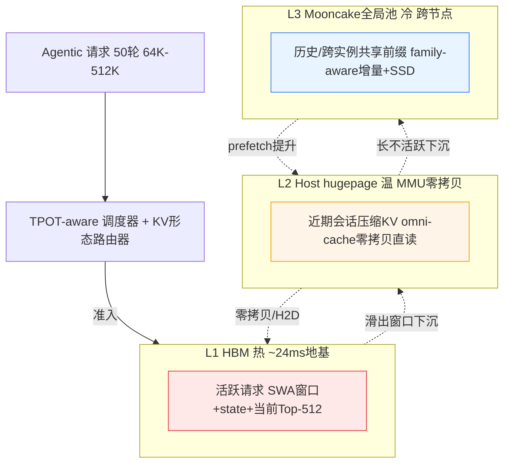
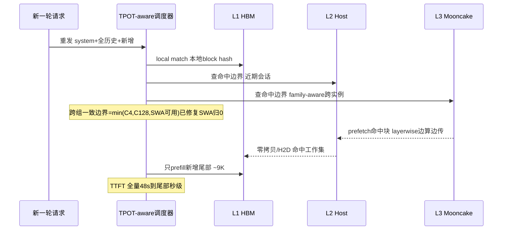
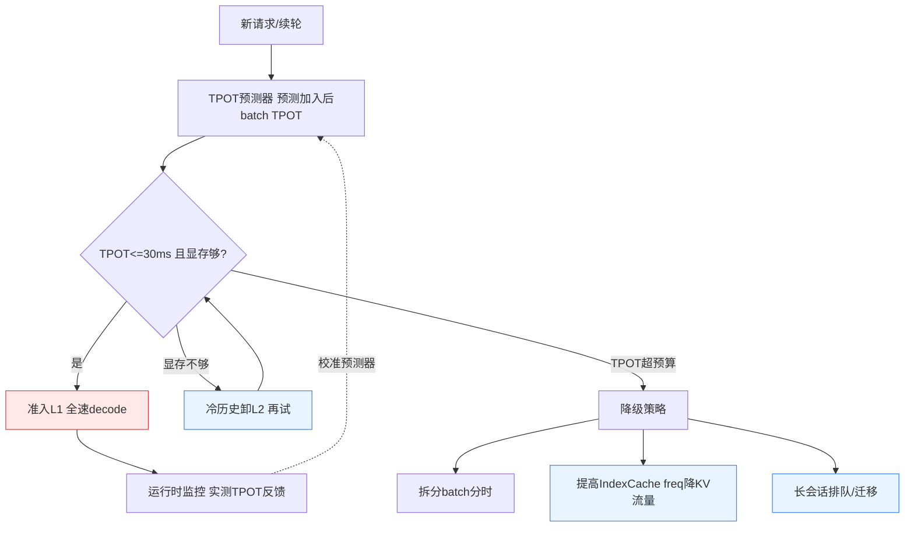
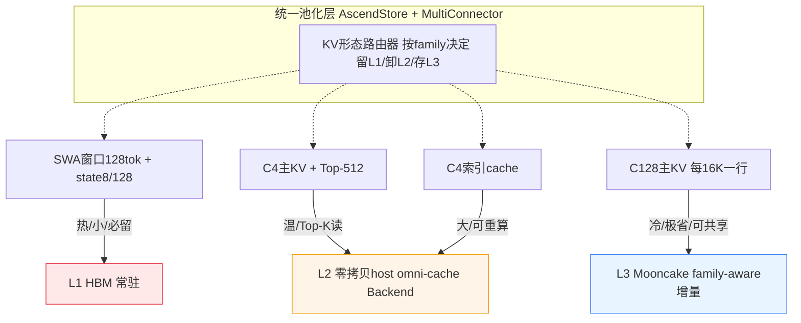

# DeepSeek-V4-Flash @ 910B3：KV Cache 多级缓存提吞吐总体方案设计

> 日期：2026-06-15
> 场景：Agentic 长会话，上下文 64K→512K，最多 50 轮，bf16 推理
> 硬件：Ascend NPU 910B3(A2)集群，PD 分离
> 目标：**KV Cache 多级缓存机制，在 e2e 时延 SLO（TTFT 不能太慢 + TPOT≤30ms）硬约束下，最大化推理吞吐与并发**
> 基础：vLLM / vLLM-Ascend；可集成 Mooncake、omni-cache，可提新机制
> 数据基线：`vllm-ascend @ a57a8f0`、`Mooncake @ 94c58aa4`、`omni-cache @ a57a8f0`
> 量化口径：block_size=128、bf16 主缓存、MTP 1 层、CP=1、单 rank；数字均标注**推导值 / 需 profiler 实测校准**

> **方案性质**：架构级总体方案（论证为主，指向 vllm/vllm-ascend 改动点，不写具体 patch）。
> **核心参考**：[DeepSeek V4 Flash KV Cache 显存量化分析](20260614-182107-deepseek-v4-flash-kvcache显存申请占用管理-源码量化深度分析-分析.md)（KV 结构/显存账/瓶颈的源码级地基）

---

## 0. 执行摘要

| 项 | 基线 | 方案 B 优化后 | 提升 |
|----|------|--------------|------|
| 512K 准入峰值/请求 | 7.75 GiB | 3.44 GiB | -56% |
| 512K@32GiB 实际并发 | 4 | 9 | **+125%** |
| decode 聚合吞吐 | 158 tok/s | 356 tok/s | **2.3×** |
| 50 轮重放 prefill 量 | 最坏 14.75M token(全量) | 0.01M(-99.9%) | TTFT 数量级改善 |

> **一句话结论（底层逻辑）**：512K×50 轮的吞吐天花板 = `min(显存准入并发, TPOT约束并发, prefix复用率)`。当前三者全被卡死，且 **512K 场景下真瓶颈是显存（TPOT 还有 3.7× 余量）**。方案 B 通过「准入峰值治理 + L2 零拷贝卸载 + 跨组命中修复 + family-aware L3 + TPOT-aware 调度 + 统一池化」同时松绑三者。

---

## 1. 整体架构与多级缓存层次

### 1.1 诊断结论（数字说话）

基于源码级公式测算（910B3，512K，32GiB KV 池）：

| 病根 | 数字证据 | 性质 |
|------|---------|------|
| **显存墙（问题1）** | 32GiB 池 chunk=8K 只能准入 **4 个** 512K 请求；准入峰值 7.75GiB ≫ 稳态 3.33GiB | **准入峰值**是真凶 |
| **TPOT 劣化（问题2）** | 见 §4 严谨分解：权重读 26GB/token 是地基，KV 读是「并发天花板限制器」 | **低并发→权重读摊不薄** |
| **多轮复用失效** | 本地 hybrid prefix hit 受 16K 对齐 + **SWA 命中可能归 0**（资料 §11.5） | 复用机制断链 |

### 1.2 多级缓存顶层架构



### 1.3 三级职责与介质（910B3）

| 层 | 介质 | 装什么 | 关键技术 | 解决病根 |
|----|------|--------|---------|---------|
| L1 | NPU HBM | 活跃 SWA+state+Top-512 工作集 | vLLM BlockPool（现有） | 时延（热数据零跳转） |
| L2 | Host hugepage 2MB | 近期会话压缩 KV | omni-cache 式 MMU 零拷贝（`aclrtHostRegister MAPPED`，省 H2D） | 显存墙（容量卸 host） |
| L3 | Mooncake 全局池 + SSD | 跨会话/跨实例共享前缀 | family-aware 增量 + offload-on-evict | 多轮复用 + TTFT |

### 1.4 设计取舍

- **L1/L2 走 omni-cache 零拷贝**：910B3 上 host↔HBM 走 HCCS，MMU 直读省 H2D，L2 命中数据 NPU 直接算——把「容量」与「时延」解耦。
- **L3 走 Mooncake**：HiRadixTree 全局前缀树 + offload-on-evict，承载 50 轮跨轮/跨实例复用。
- **调度器是大脑**：三级是仓库，TPOT-aware 调度器按 30ms 预算决定「谁进 L1、谁留 L2、批多大」。

---

## 2. 容量层：准入峰值治理（松绑显存墙）

### 2.1 病根：准入峰值 = 2.33× 稳态

512K 请求稳态仅占 3.33GiB，但 `full_sequence_must_fit` 准入门顶到 7.75GiB——多出的 4.4GiB 全是 **Compressor state 临时页**（c4_state 1026 块 + c128_state 261 块，占准入总块 52%），而 state 真实持久窗口只有 8/128 token。纯「准入虚高」。

### 2.2 抓手一：state chunk 内滚动复用（P1，最高 ROI）

> 底层逻辑：Compressor state 是滚动浮点状态，chunk 内中间 state 只是算子 scratch，只有 chunk 末尾状态需写回持久 KV。当前给本 chunk 每个 token 都预留 state slot，是 `O(chunk_size)` 浪费。

| 改动点 | 在哪 | 怎么改 |
|--------|------|--------|
| state slot mapping | `dsa_v1.py` Prefill metadata（资料 §9.2） | chunk 内中间 state 走算子 scratch，不映射长期 slot |
| 准入 cap 公式 | `single_type_kv_cache_manager.py`（资料 §8.3） | state 组 admission cap 从 `O(chunk)` 降到 `O(state_window)` |
| Compressor kernel | `_C_ascend.compressor` | 仅 chunk 末尾状态 `cache_mode=1` 写回 |

**收益（测算）**：512K + chunk=8192 准入峰值 **7.75GiB → 3.74GiB（-51.7%）**，准入/稳态比 2.33× → 1.12×。

### 2.3 抓手二：Prefill chunk 作容量控制变量（P0，零开发）

资料 §8.5：chunk 是 KV 容量参数。配合分级队列差异化配置：

| 队列 | chunk | 目的 |
|------|-------|------|
| 低延迟长会话(512K) | 2K-4K | 优先准入并发 |
| 短 Agent turn | 增量自适应 | 只 prefill 新尾部 |
| 离线吞吐 | 8K-10K | Prefill kernel 吞吐 |

### 2.4 抓手三：L2 卸载冷历史（P1，容量根本解）

准入通过后，稳态请求的完整压缩历史（512K 约 3.33GiB）不必全留 HBM——只有 SWA 窗口 + state + 当前 Top-512 是热的（几百 MiB），冷压缩历史下沉 L2 host 池（MMU 零拷贝，需要时直读）。

> 这把「并发 = HBM/单请求稳态」松绑成「并发 = HBM/热工作集 + host容量/冷历史」。

### 2.5 收益小结

| 优化 | 开发量 | 512K@32GiB 并发 |
|------|--------|----------------|
| 基线 | — | 4 |
| +chunk 调小(2K) | 零(配置) | 7 |
| +state 滚动复用 | 中 | 8 |
| +SWA 临时页滚动 | 中 | 9 |
| +L2 卸载冷历史 | 高 | >9，逼近 host 容量 |

---

## 3. 命中层：跨组 prefix 修复 + family-aware L3

### 3.1 病根：50 轮重放复用链两个断点

```
理想：第N轮只 prefill 新增尾部(~9K) → TTFT 低
断点①：SWA 命中可能归 0（资料 §11.5）→ 整段 512K 重算 → TTFT 灾难
断点②：16K 对齐粒度 → 新增不满16K尾部反复重算 → 复用率打折
```

### 3.2 抓手一：修复跨组 prefix hit（P1，红线级）

> 不修则 L3 全局缓存、多轮复用全失效（命中长度被 SWA 归 0）。

| 改动点 | 在哪 | 怎么改 |
|--------|------|--------|
| 跨组命中截断 | `patch_kv_cache_coordinator.py:310` | C4/C128 历史**两组都完整截断**（当前只第一个） |
| SWA 命中策略 | 同上 | SWA 不拉低总命中长度，只加载边界前最后 128 token |
| 一致性边界 | coordinator | 允许各 group 返回不同物理 block，但共享一致 computed_token 边界 |

**收益**：命中从「可能归 0」修复到「按 16K 稳定命中」，50 轮 prefill 量 14.75M → 0.34M token（-97.7%）。

### 3.3 抓手二：family-aware 增量缓存（P1，突破 16K 粒度）

| 缓存族 | checkpoint 粒度 | 效果 |
|--------|----------------|------|
| C4 | 每 512 token | 8K prompt 也能复用 |
| C128 | 每 16K token | 长历史高效 |
| SWA | 命中边界尾部 128 | 不存不可达旧页 |
| 恢复 | 取各 family 共同可用边界 | 不要求同切分 |

**改动点**：`pool_scheduler.py` `_infer_cache_transfer_granularity` 从 LCM 改 family-aware。
**收益**：命中粒度 16K → 512，50 轮 prefill 量 0.34M → 0.01M token（再 -96.9%）。

### 3.4 抓手三：L3 hybrid layerwise 加载（P1，降 TTFT）

资料 §13.5：当前 `num_kv_cache_groups>1` raise NotImplementedError。但核实发现 vllm-ascend 已有 `mooncake_layerwise_connector.py`——需核实/扩展其对 hybrid 的支持，实现「先加载前几层，边算边传后续层」，把传输延迟摊进前向。

### 3.5 命中层数据流



---

## 4. 带宽层：TPOT 治理（严谨分解 + 校准）

### 4.1 严谨 TPOT 分解：权重读 + KV 读

> 此节回应「上下文+并发增长过程中，HBM KV 搬运量与 TPOT 实际影响」的核实诉求。所有数字基于 910B3 公开规格（HBM 有效带宽取 1.1TB/s）+ 模型 config 推导，**需 NPU profiler 实测校准**，MoE all-to-all 通信尚未单列。

decode 每 token 的 HBM 访存：

| 项 | 字节/token | 随并发 N 累加 | 性质 |
|----|-----------|--------------|------|
| **权重读**（MoE 13B 激活，bf16） | **26 GB** | ❌ batch 共享 | decode 访存绝对大头 |
| **KV 读**（单请求） | 64K:69MiB → 512K:437MiB | ✅ ×N | 随上下文×并发线性涨 |

### 4.2 TPOT 二维矩阵：(26GB + N×KV) / 1.1TB/s

| 上下文 | N=1 | N=4 | N=8 | N=16 | KV占比(N=8) |
|--------|-----|-----|-----|------|------------|
| 64K | 23.7 | 23.9 | 24.2 | 24.7 | 2.2% |
| 128K | 23.8 | 24.1 | 24.6 | 25.5 | 3.8% |
| 256K | 23.9 | 24.5 | 25.4 | 27.1 | 6.8% |
| **512K** | 24.1 | 25.3 | **27.0** | **30.3✗** | 12.4% |

（单位 ms，✗=破 30ms SLO）

### 4.3 三个关键结论

1. **权重读（26GB/token）是 TPOT 地基（~24ms），被 batch 共享 → 提并发是摊薄它的唯一手段**。这是「并发是 TPOT 解药」的根因。
2. **KV 读在 512K 内占比仍是小头（N=8 时 12.4%），但它是「并发天花板限制器」**：512K+N=16 时 KV 把总流量推到 33GB，TPOT 撞破 30ms。
3. **临界点**：512K 场景 N=8 时 TPOT≈27ms（安全），N=16 时 30.3ms（破线），**SLO 下 512K 并发天花板（TPOT 视角）≈ 12-13**。

> **校准结论（改变方案重心）**：TPOT 真实作用链是「Section 2 松绑显存→提并发→权重读摊薄（主收益）；Section 3/4 降 KV 字节→把撞墙点往后推→提并发天花板（次收益，决定上限）」。

### 4.4 抓手：IndexCache 跨层 Top-K 复用（P1，并发天花板推手）

| index_freq | 512K 读取/token | 降幅 |
|-----------|----------------|------|
| 1 | 437 MiB | — |
| 2 | 275 MiB | -37% |
| 4 | 194 MiB | -56% |

512K@N=16 那 7.34GB KV 流量里 78% 是 Index，freq=4 砍半可把破墙点从 N=16 推到 N=24+。
**改动点**：`deepseek_v4.py:836`（skip pattern）+ `dsa_v1.py:2331`（Decode 复用），实验 freq=1/2/4，**记录质量+latency+kernel time 联合判定**（无损框架修改）。

> 边界（资料 §15.7/§17）：进一步减 Index KV 容量需模型/量化支持，非框架无损——「Index 低比特/分层」列 P2，不当主线。

---

## 5. TPOT-aware 调度闭环（方案的大脑）

### 5.1 核心机制：TPOT 预算驱动分级准入

> 把 vLLM 现有「显存够就准入」升级为「显存够 **且** TPOT 预算够才准入」。



### 5.2 三个调度抓手

**抓手一：TPOT 预测器（P1）**——嵌入访存模型 `TPOT ≈ (W_bytes + Σ KV_bytes(L_i))/HBM_BW + comm_overhead`，用运行时实测反向校准。改动点：`scheduler.py` 准入循环加 TPOT 预算检查（类比 `full_sequence_must_fit`）。

**抓手二：分级队列 + 差异化 chunk（P0-P1）**——低延迟长会话/短 Agent turn/离线吞吐三队列，复用 vLLM priority policy。

**抓手三：动态降级（P1）**——TPOT 逼近 30ms 时按代价排序降级：① 卸 L2 腾 HBM（无损）② 提 IndexCache freq（轻微质量换流量）③ 长会话排队/跨实例迁移（L3 支撑）。

### 5.3 与现有调度的关系

- **复用**：`Scheduler.schedule()` 两阶段、`full_sequence_must_fit`、`RecomputeScheduler`(PD)
- **新增**：TPOT 预测器（第二道准入门）+ 分级队列 + 降级钩子
- **不碰**：block 分配、prefix 命中判定（KVCacheManager 的活）

---

## 6. e2e 量化收益合成 + 路线图

### 6.1 e2e 收益总账（512K，32GiB，910B3，TPOT≤30ms）

| 维度 | 基线 | 方案 B | 提升 |
|------|------|--------|------|
| 准入峰值/请求 | 7.75 GiB | 3.44 GiB | -56% |
| 显存约束并发 | 4 | 9 | +125% |
| TPOT 约束并发 | 15 | 34(freq=4) | +127% |
| **实际并发(min)** | **4** | **9** | **+125%** |
| decode 聚合吞吐 | 158 tok/s | 356 tok/s | **2.3×** |
| 50 轮 prefill 量 | 14.75M(全量) | 0.01M | -99.9% |

### 6.2 关键洞察：不同上下文瓶颈不同

| 上下文 | 显存约束并发 | TPOT约束并发 | 天花板 | 瓶颈 |
|--------|------------|------------|--------|------|
| 64K | 72 | 127 | 72 | 显存 |
| 128K | 37 | 110 | 37 | 显存 |
| 256K | 18 | 63 | 18 | 显存 |
| 512K | 9 | 34 | 9 | **显存(TPOT 余 3.7×)** |

> **重大结论**：512K 及以下瓶颈全在显存，资源应优先砸 Section 2（容量）+ Section 3（命中）。Section 4（带宽）价值在 1M+ 或并发 30+ 时显现。

### 6.3 分阶段路线图（按 ROI）

| 阶段 | 优化点 | 性质 | 开发量 | 512K@32G 并发 | 风险 |
|------|--------|------|--------|--------------|------|
| **P0** | KV Memory Ledger + chunk 调小 + 分级队列 | 配置/监控 | 低 | 4→7 | 极低 |
| **P1-a** | state 滚动复用 + SWA 临时页滚动 | kernel+调度 | 中 | 7→9 | 中 |
| **P1-b** | 跨组 prefix 修复（救 TTFT） | coordinator | 中 | 解锁命中 | 中 |
| **P1-c** | L2 host 零拷贝卸载 | 零拷贝集成 | 高 | 逼近 host 容量 | 中高 |
| **P1-d** | family-aware L3 + layerwise | pool+connector | 高 | TTFT+复用 | 中高 |
| **P1-e** | TPOT-aware 调度闭环 | scheduler | 高 | 保 SLO | 中 |
| **P2** | IndexCache freq 复用 + overlap | kernel | 中 | 推 TPOT 天花板 | 低 |
| **P2** | Index 低比特/分层（需模型支持） | 模型+量化 | 高 | — | 高，不当主线 |

### 6.4 三个里程碑

```
M1(快赢): P0 + P1-a + P1-b → 512K 并发 4→9(2.3x), TTFT 解锁, 纯框架内, 无新组件
M2(系统化): + P1-c L2卸载 + P1-e 调度闭环 → 逼近 host 容量, TPOT 预算化保 SLO
M3(规模化): + P1-d L3 family-aware + layerwise → 跨实例 prefix 共享, 长会话跨节点迁移
```

---

## 7. 统一池化多形态 KV 的设计（顶层骨架）

### 7.1 关键发现：统一池化骨架已存在

| 现成能力 | 代码 | 作用 |
|---------|------|------|
| `AscendMultiConnector` | `ascend_multi_connector.py:14` | **同时挂多个 connector**（L2+L3 并存），已处理 layerwise 特殊转发 |
| `KVConnectorFactory` 注册表 | `kv_transfer/__init__.py:21` | 统一注册/选择 connector |
| `AscendStore.Backend` 抽象 | `backend.py:6`（put/get/exists/register_buffer） | **统一池化多后端**：Mooncake/Yuanrong/memcache 都是其实现 |
| Mooncake 三变体 | `mooncake_{connector,layerwise,hybrid}_connector.py` | P2P / 逐层 / hybrid group-aware |

> **底层逻辑修正**：「统一池化」在 vllm-ascend 里不是空白，是半成品。Mooncake 已通过 `Backend` 抽象池化，`MultiConnector` 已能多级并存。缺口有二：① omni-cache 游离体系外；② 六类异构 KV 的统一池化粒度。

### 7.2 缺口一：收编 omni-cache（推荐方案 B）

| 方案 | 做法 | 取舍 |
|------|------|------|
| A | `OmniCacheConnector` 注册进 Factory | 简单，但两套 host 池逻辑重复 |
| **B（推荐）** | 把零拷贝/gather 实现成 `AscendStore` 的 `ZeroCopyHostBackend`，L2 走它、L3 走 `MooncakeBackend` | 统一进 Backend 抽象，零拷贝成 L2 传输优化，gather 成读取策略 |

### 7.3 缺口二：六类异构 KV 的 family-aware 统一池化



| KV 形态 | 热度 | 池化层级 | 理由 |
|---------|------|---------|------|
| SWA 窗口 + state | 热，每 token 必读 | L1 常驻，不卸 | 资料 §12.3：state 不应下沉 |
| C4 主 KV + Top-512 | 温，稀疏读 | L2 零拷贝（gather 选中块直读） | omni-cache gather 正好用上 |
| C4 索引 cache | 大但可重算 | L2，可丢弃降级 | 占带宽 78%，但可重算 |
| C128 主 KV(每16K一行) | 冷，极省 8B/tok/层 | L3 Mooncake 共享 | 跨会话复用价值最高 |

### 7.4 对接前 6 个 Section

- Section 2（L2 卸载）→ 走 `ZeroCopyHostBackend`（omni-cache 收编）
- Section 3（family-aware L3）→ 走 `MooncakeBackend`，C128 主 KV 跨会话共享
- Section 5（调度器）→ 7.3 的「KV 形态路由器」嵌在 TPOT-aware 调度器里
- `AscendMultiConnector` → L2+L3 双 backend 并存挂载，是统一池化载体

### 7.5 工程边界（诚实标注）

| 能力 | 现状 | 方案动作 |
|------|------|---------|
| MultiConnector 多级并存 | ✅ 已有 | 直接用 |
| Backend 抽象多后端 | ✅ 已有 | 直接用 |
| omni-cache 零拷贝/gather | ⚠️ 独立插件，体系外 | 收编为 ZeroCopyHostBackend（新开发） |
| 六类 KV family-aware 路由 | ❌ 无 | 新开发（P1） |
| hybrid layerwise pool | ⚠️ §13.5 限制，但有 layerwise connector | 核实/扩展 |

---

## 8. 限制与边界（诚实声明）

1. **所有 TPOT 数字是推导值**：基于 910B3 公开 HBM 带宽（1.1TB/s 有效）+ 模型 config，**MoE all-to-all 通信未单列**，实际 TPOT 会更高，必须 NPU profiler 实测校准。
2. **吞吐 2.3× 是 decode 视角**：未含 prefill 算力释放的额外收益；也未扣水位线、graph 显存、通信 buffer。
3. **显存账基于资料源码级公式**：A2/A3 路径、block_size=128、MTP 1 层、CP=1；A5/不同配置需重算。
4. **跨组 prefix 修复有正确性风险**：state 恢复边界处理不当会导致输出错误，需充分测试。
5. **统一池化的 ZeroCopyHostBackend 是新开发**：omni-cache 收编需工程整合，非现成。
6. **方案为架构级论证**：指向改动点但未写具体 patch，落地需逐项 RFC + 实验矩阵（见资料 §16）。

---

## 9. 核心闭环（一图收口）

> **显存墙（问题1）和 TPOT 劣化（问题2）同根**：512K 场景 TPOT 余 3.7×，真瓶颈是显存把并发卡死、权重读摊不薄、有效吞吐低。

```
治准入峰值(state滚动) + 卸冷历史(L2零拷贝) → 显存松绑 → 并发 4→9+
       │                                              │
修复跨组命中(救TTFT) ← 调度器按TPOT预算分级准入 → 权重读摊薄 → 吞吐2.3x+
       │                                              ↑
family-aware L3增量(50轮复用) ──────────────────────┘
       │
统一池化(MultiConnector + Backend抽象 + 收编omni-cache) = 顶层骨架
```
