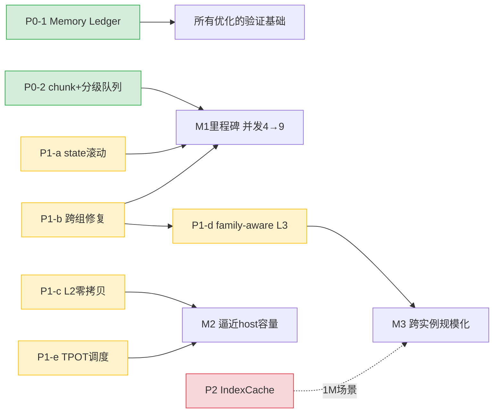

# DeepSeek-V4-Flash KV Cache 多级缓存方案：量化评估决策卡

> 日期：2026-06-15
> 用途：为 [总体方案设计](20260615-000018-deepseek-v4-flash-910b3-kvcache多级缓存提吞吐-总体方案设计.md) 提供经得起评审的量化决策支撑
> 口径对齐：本卡所有 KV 显存数字与 [显存量化分析(182107)](20260614-182107-deepseek-v4-flash-kvcache显存申请占用管理-源码量化深度分析-分析.md) 同一套源码公式；验证方法对齐 [监控验证方案(172505)](20260614-172505-vllm-vllm-ascend-kvcache显存效率-监控采集与实验验证方案-分析.md)
> 边界：TPOT/吞吐为**推导值**，需 NPU profiler 按 172505 的实验矩阵实测校准

---

## 1. KV 预估对齐校验（先证明数字可信）

### 1.1 与权威资料的交叉核对（公式一致性已验证）

用本方案的源码级公式重算 1M 口径，与资料 182107 的权威值逐项比对：

| 口径 | 本方案公式计算 | 资料 182107 权威值 | 一致性 |
|------|--------------|-------------------|--------|
| 1M 稳态 block（P4=2048+P128=64+7） | 2119 块 = 6.639 GiB | 2119 块 = 6.639 GiB | ✅ 完全一致 |
| 1M 准入峰值（chunk=10240） | 3883 块 = 12.166 GiB | 3883 块 = 12.166 GiB | ✅ 完全一致 |
| 物理 slab/block（MTP 1 层） | 3,364,096 B = 3.208 MiB | 3.208252 MiB | ✅ 一致 |

> 结论：本方案 64K→512K 的全部测算与资料同源同式，**KV 预估可信**。下表是 64K→512K 的精确展开（资料主表是 8K/135K/1M，本卡补全用户场景区间）。

### 1.2 64K→512K 精确 KV 账（单请求单 rank，block_size=128，MTP 1 层）

| 上下文 | P4 | P128 | 稳态 block | 稳态块池占用 | 准入峰值(chunk8K) | 准入/稳态 |
|--------|----|----|----------|------------|------------------|-----------|
| 64K | 128 | 4 | 139 | 0.435 GiB | 2.46 GiB | 5.66× |
| 128K | 256 | 8 | 271 | 0.849 GiB | 2.86 GiB | 3.37× |
| 256K | 512 | 16 | 535 | 1.676 GiB | 4.50 GiB | 2.69× |
| 512K | 1024 | 32 | 1063 | 3.330 GiB | 7.75 GiB | 2.33× |

> 关键：上下文越短，**准入/稳态比越离谱**（64K 高达 5.66×）。因为 state 临时页的 `O(chunk)` 成本是固定的，短上下文下它占比更大。**这强化了 §2 state 滚动复用的价值——对短上下文高并发场景收益更大。**

---

## 2. 瓶颈再确认（双约束 + 优先级）

### 2.1 显存约束 vs TPOT 约束（32GiB KV 池，IndexCache freq=4，L2 卸载后）

| 上下文 | 显存约束并发 | TPOT约束并发 | **真天花板** | 瓶颈 | 余量 |
|--------|------------|------------|------------|------|------|
| 64K | 72 | 127 | **72** | 显存 | TPOT 余 1.76× |
| 128K | 37 | 110 | **37** | 显存 | TPOT 余 2.97× |
| 256K | 18 | 63 | **18** | 显存 | TPOT 余 3.5× |
| 512K | 9 | 34 | **9** | 显存 | TPOT 余 3.78× |

### 2.2 瓶颈结论（指导资源投放）

> **64K→512K 全区间，瓶颈都是显存，不是 TPOT。** TPOT 在所有档位都有 1.76×~3.78× 的余量。

这把方案的优先级钉死：
1. **第一优先级 = 松绑显存**（Section 2 容量层 + Section 3 命中层）→ 直接提真天花板
2. **第二优先级 = TPOT 防御**（Section 4 带宽层）→ 仅在并发拉到 TPOT 约束线时才需要，或上 1M 时
3. **第三优先级 = 调度闭环**（Section 5）→ 把前两者的能力变成运行时 SLO 保障

### 2.3 与资料瓶颈判断的对齐

资料 182107 §18 三大瓶颈、172505 §13 六大瓶颈，与本方案映射：

| 资料瓶颈 | 本方案对应优化 | 优先级 |
|---------|--------------|--------|
| 182107: 统一 block pool 异构页绑定（载荷率 78-92%） | §7 family-aware 统一池化（P1） | 中 |
| 182107: 大 chunk state 准入峰值 | §2 state 滚动复用（P1-a） | **高** |
| 182107: 16K 跨组粒度 + SWA 命中归 0 | §3 跨组修复 + family-aware（P1-b/d） | **高** |
| 182107: C4 Index 扫描带宽 | §4 IndexCache 复用（P2） | 低（512K 非瓶颈） |
| 172505 §13.1: 全局 slab 内部碎片 | §7 独立 block pool / family 路由 | 中（改动大） |
| 172505 §13.4: prefix cache churn | §5 调度器 priority-aware eviction | 中 |

---

## 3. 收益预估（量化 + 边界标注）

### 3.1 单项优化收益（512K，32GiB，逐项叠加）

| 优化点 | 512K@32G 并发 | decode 吞吐 | 收益机理 | 数据性质 |
|--------|--------------|-----------|---------|---------|
| 基线 | 4 | 158 tok/s | — | 公式推导 |
| +P0 chunk 调小(2K) | 7 | 277 tok/s | 准入峰值 7.75→4.45GiB | 公式推导 |
| +P1-a state 滚动 | 8 | 316 tok/s | 准入峰值 →3.74GiB | 公式推导 |
| +P1-a SWA 临时页 | 9 | 356 tok/s | 准入峰值 →3.34GiB(≈稳态) | 公式推导 |
| +P1-c L2 卸载 | >9 | >356 | HBM 只留热工作集 | 需实测 host 容量 |
| +P1-b/d 命中修复 | (不直接提并发) | — | 50 轮 prefill 14.75M→0.01M(-99.9%)，TTFT 数量级降 | 公式推导 |
| +P2 IndexCache freq=4 | (不提 512K 天花板) | — | KV 流量 -56%，推 1M/超高并发天花板 | 需实测质量 |

### 3.2 e2e 总收益（M1 里程碑：P0+P1-a+P1-b）

| 指标 | 基线 | M1 后 | 提升 | 性质 |
|------|------|-------|------|------|
| 512K 实际并发 | 4 | 9 | **+125%** | 公式推导 |
| decode 聚合吞吐 | 158 tok/s | 356 tok/s | **2.3×** | 公式推导 |
| 50 轮 TTFT | 最坏全量重算(48s级) | 只算尾部(秒级) | **数量级** | 公式推导 |
| TPOT(N=9) | — | ~27ms(<30 SLO) | 守约束 | 推导，需实测 |

### 3.3 收益边界（诚实声明）

1. **吞吐 2.3× 是 decode 视角的公式推导**，未含 prefill 算力释放的额外收益（基线大量算力耗在重复 prefill，M1 后释放）。
2. **TPOT 数字未含 MoE all-to-all 通信**，实测会更高，必须按 172505 §8.7 profiler 校准。
3. **L2 卸载收益依赖 host 容量和 HCCS 带宽**，需按 172505 §8.3 容量阶梯实测。
4. **验收口径用 172505 §11.2**：capacity_gain / throughput_gain / hbm_saving 三主指标，三次重复 run 稳定才算数。

---

## 4. 优先级 × 实现难度 × 工作量 整体评估（核心决策表）

> 难度/工作量基于实际 grep 的改动面（涉及文件、kernel vs Python、跨模块依赖）。人周为单一资深工程师估算，含测试。

| ID | 优化点 | 优先级 | 改动面（实测） | 难度 | 工作量 | 风险 | ROI |
|----|--------|--------|--------------|------|--------|------|-----|
| **P0-1** | KV Memory Ledger 上线 | P0 | 新增 `observability/kv_cache_memory.py`，插桩 planner/tensor/graph（172505 §6.1） | 低 | 1-2 周 | 极低 | 高（一切验证的前提） |
| **P0-2** | chunk 调小 + 分级队列 | P0 | 纯配置 + 调度器分流（vLLM priority policy 已有） | 低 | 0.5-1 周 | 极低 | **极高**（零开发，并发 4→7） |
| **P1-a** | state 滚动复用 | P1 | `dsa_v1.py`(compressor 107处) + `single_type_kv_cache_manager.py`(cap 12处) + Compressor kernel | **高** | 3-4 周 | 中（kernel+正确性） | **极高**（准入峰值 -51.7%，并发→8） |
| **P1-b** | 跨组 prefix 修复 | P1 红线 | `patch_kv_cache_coordinator.py`(find_longest_cache_hit 24处) | 中 | 2-3 周 | 中（命中正确性） | **极高**（救 TTFT，解锁 L3） |
| **P1-c** | L2 零拷贝卸载 | P1 | omni-cache 收编为 `ZeroCopyHostBackend`（zero_copy 99 行 C++ + Backend 6 方法接口） | **高** | 4-6 周 | 中高（跨插件整合） | 高（容量根本解） |
| **P1-d** | family-aware L3 + layerwise | P1 | `pool_scheduler.py`(granularity 29处) + `mooncake_layerwise_connector`(已有，需扩展 hybrid) | **高** | 4-6 周 | 中高（一致性） | 中（50 轮复用，跨实例） |
| **P1-e** | TPOT-aware 调度闭环 | P1 | `scheduler.py` 准入循环(line 480 allocate_slots 处加 TPOT 门) + 预测器 | 中高 | 3-4 周 | 中（预测精度） | 高（保 SLO 上限） |
| **P2-1** | IndexCache freq 复用 | P2 | `deepseek_v4.py:836` + `dsa_v1.py:2331`（已有 use_index_cache 基础） | 低 | 1-2 周 | 低（质量验证） | 中（推 1M 天花板，非 512K） |
| **P2-2** | 独立 block pool（消碎片） | P2 | block table + prefix hash + connector + kernel ABI（172505 §13.1：改动最大） | **极高** | 8-12 周 | 高（全链路 ABI） | 中（消 22% C128 空洞） |
| **P2-3** | Index 低比特/分层 | P2 | 需模型/量化支持（资料 §15.7：非框架无损） | **极高** | 不可控 | 高（依赖外部） | 低（越界，不当主线） |

### 4.1 难度分级依据

- **低**：纯配置或单文件 Python，无 kernel、无跨模块 ABI
- **中**：单模块 Python 逻辑改动 + 正确性测试（如 coordinator 命中逻辑）
- **高**：涉及 NPU kernel（Compressor）或跨插件整合（omni-cache 收编）或跨模块一致性（family-aware）
- **极高**：全链路 ABI 变更（block pool 重构）或依赖外部组件（模型量化）

### 4.2 关键依赖关系（实施排序约束）



> 强约束：**P1-b（跨组修复）是 P1-d（family-aware L3）的前置**——命中归 0 不修，L3 缓存写进去也读不出来。**P0-1（Ledger）是一切验证的前提**——没有度量，收益无法证明。

---

## 5. 推荐落地路径（ROI 排序 + 风险平衡）

### 5.1 三阶段路线（对齐 172505 的 Week 1-4 验证节奏）

| 阶段 | 内容 | 周期 | 累计并发(512K) | 风险敞口 |
|------|------|------|--------------|---------|
| **Phase A（快赢）** | P0-1 + P0-2 + P1-b | 4-6 周 | 4→7 + TTFT 解锁 | 低（无 kernel） |
| **Phase B（核心）** | P1-a + P1-e | 6-8 周 | 7→9 + SLO 保障 | 中（kernel+调度） |
| **Phase C（系统化）** | P1-c + P1-d | 8-12 周 | →host 容量 + 跨实例 | 中高（整合） |
| **Phase D（按需）** | P2-1（仅上 1M 时） | 2 周 | 推 TPOT 天花板 | 低 |

### 5.2 决策建议（一句话）

> **先做 Phase A——零/低 kernel 风险拿到「并发 4→7 + TTFT 救命 + 度量上线」，ROI 最高、风险最低。** P1-a（state 滚动）虽 ROI 极高但涉及 Compressor kernel，放 Phase B 充分测试。L2 卸载/family-aware 是系统化收益，放 Phase C。Index 低比特（P2-3）依赖模型量化，**不纳入本方案主线**。

### 5.3 每阶段验收门（用 172505 §11.2 标准）

```
通过条件（缺一不可）:
  1. 输出正确性无回退（diff 测试）
  2. 同 P99 TPOT≤30ms SLO 下并发提升 ≥ 预估的 80%
  3. 无新增 OOM/preemption/长期 HBM 增长
  4. 3 次重复 run 结论稳定（容量边界点 5 次）
  5. capacity_gain / throughput_gain / hbm_saving 三主指标达标
```

---

## 6. 一页纸总结（评审用）

| 维度 | 结论 |
|------|------|
| **KV 预估可信度** | ✅ 公式与资料 182107 权威值完全一致（1M 稳态/准入逐项核对） |
| **核心瓶颈** | 64K→512K 全区间是**显存**（TPOT 余 1.76-3.78×） |
| **最高 ROI 单点** | P0-2（chunk 调小，零开发，4→7）+ P1-a（state 滚动，-51.7% 准入峰值，→8） |
| **红线项** | P1-b 跨组修复（不修则 TTFT 灾难 + L3 失效） |
| **e2e 收益** | M1 里程碑：并发 +125%、decode 吞吐 2.3×、50 轮 prefill -99.9% |
| **总工作量** | Phase A-C 约 18-26 人周（不含 P2-2/P2-3 大改动项） |
| **最大风险** | P1-a 涉及 Compressor kernel；P1-c omni-cache 跨插件整合 |
| **不做** | P2-3 Index 低比特（依赖模型量化，越界） |
| **前置依赖** | P0-1 Memory Ledger（度量先行）→ P1-b（L3 前置） |
| **验证方法** | 完全复用 172505 的 8-Phase 实验矩阵 + eta_* 效率公式 + 三主指标 |
