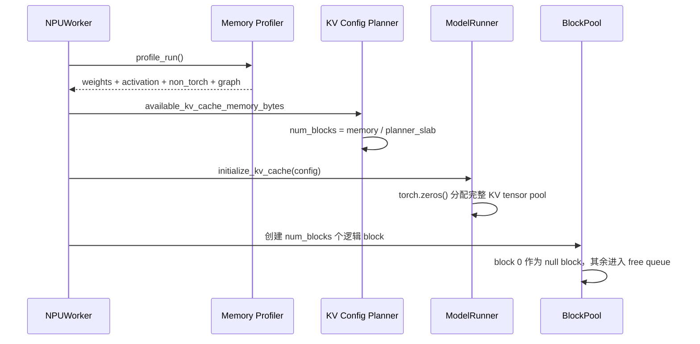

# DeepSeek V4 Flash BF16 + 昇腾 910B3 60 GiB 显存分布与 KV Cache 并发分析

> 分析时间：2026-06-15  
> 代码版本：vLLM `0d29612292c6b1e312af42ac00cf649af16a438b`，vLLM-Ascend `8afdf356f6a2496bedfc538253366ef1a8c0d9aa`  
> 集群：4 机 32 卡，单卡按 60 GiB 预算  
> 模型：DeepSeek V4 Flash，模型权重按 BF16 展开，MTP 1 层开启  
> KV：主 KV 按 BF16 配置，但内部 Index KV 和 Compressor State 严格采用 910B3/A2 代码中的 INT8、FP32 实现  
> 基准参数：`block_size=128`、`max_num_batched_tokens=8192`、`gpu_memory_utilization=0.9`

关联前文：

- [DeepSeek V4 Flash BF16 + 910B3 32 卡超长上下文最大并发分析](/Users/linyi/code/Documents/obsidian_wiki/llm-wikid/raw/infra/20260615-181900-deepseek-v4-flash-bf16-910b3-32卡超长上下文最大并发-分析.md)
- [DeepSeek V4 Flash KV Cache 显存申请、占用与管理源码量化分析](/Users/linyi/code/Documents/obsidian_wiki/llm-wikid/raw/infra/20260614-182107-deepseek-v4-flash-kvcache显存申请占用管理-源码量化深度分析-分析.md)

---

## 1. 先给结论

### 1.1 本文采用的 60 GiB 主口径

本文把 60 GiB 视为每卡可纳入规划的总预算，再按官方 A2 配方显式设置：

```text
gpu_memory_utilization = 0.9
requested_memory       = 60 × 0.9 = 54 GiB
```

在这 54 GiB 内再扣除：

```text
BF16 weight_memory
+ peak_activation_memory
+ non_torch_memory
+ NPU graph memory
```

由于没有本次 910B3 BF16 实机启动日志，本文把后三项合并为一个 **6 GiB 非 KV 运行时参考预算**。因此：

```text
K_rank = 54 GiB - weight_memory - 6 GiB
       = 48 GiB - weight_memory
```

这里的 6 GiB 不是 vLLM 固定常量，而是待实测替换的规划值。vLLM-Ascend 实际会在启动时逐项 profile。

### 1.2 PP=1 的逐卡 KV 池与并发

| 拓扑 | 每卡 BF16 权重 | 每卡 KV 预算 | pool block/rank |
|---|---:|---:|---:|
| TP1 + DP32 + EP32 | 32.480 GiB | 15.520 GiB | 4,905 |
| TP2 + DP16 + EP32 | 26.726 GiB | 21.274 GiB | 6,723 |
| TP4 + DP8 + EP32 | 23.849 GiB | 24.151 GiB | 7,633 |
| TP8 + DP4 + EP32 | 22.410 GiB | 25.590 GiB | 8,087 |

如果只看已经完成 prefill、处于 decode 稳态的请求：

| 拓扑 | 128K | 256K | 512K | 1M |
|---|---:|---:|---:|---:|
| TP1 + DP32 | 544 | 288 | 128 | 64 |
| TP2 + DP16 | 384 | 192 | 96 | 48 |
| TP4 + DP8 | 216 | 112 | 56 | 24 |
| TP8 + DP4 | 116 | 60 | 28 | 12 |

如果要求每个 DP lane 还能容纳一个 `max_num_batched_tokens=8192` 的最坏 prefill 准入峰值，则更适合作为混部服务上限：

| 拓扑 | 128K | 256K | 512K | 1M |
|---|---:|---:|---:|---:|
| **TP1 + DP32** | **384** | **192** | **96** | **32** |
| **TP2 + DP16** | **304** | **144** | **64** | **32** |
| TP4 + DP8 | 176 | 88 | 40 | 16 |
| TP8 + DP4 | 96 | 48 | 24 | 12 |

结论：

1. 在 60 GiB 主口径下，PP=1 的 1M 混部安全上限从前文 64 GiB 卡口径的 64 个下降到 **32 个**。
2. TP1 的容量并发最高，但稠密计算只有单卡，且每层需要 EP32 通信，通常不是吞吐最优。
3. TP2 更适合作为高并发起点；TP4 更适合作为吞吐、通信与容量的折中起点。

### 1.3 引入 Pipeline Parallel 的实验性上限

将 `max_num_seqs` 提高到不限制内存容量，并仍假设每 rank 的非 KV 运行时只占 6 GiB：

| 拓扑 | 128K | 256K | 512K | 1M |
|---|---:|---:|---:|---:|
| PP2 + TP1 + DP16 | 672 | 336 | 160 | 80 |
| **PP4 + TP1 + DP8** | **672** | **344** | **168** | **80** |
| PP8 + TP1 + DP4 | 588 | 300 | 148 | 76 |

因此，纯显存容量的实验性最大值约为：

```text
128K: 672
256K: 344
512K: 168
1M:   80
```

但官方 A2 示例使用 `max_num_seqs=32`。保持这个值时，调度器上限会把结果收紧为：

```text
128K: 512
256K: 336
512K: 168
1M:    80
```

PP4 的 128K 结果需要每 lane 支持约 84 个 running sequence。调高 `max_num_seqs` 会扩大激活、输入 metadata 和图捕获开销，因此“6 GiB 运行时预算”必须重新 profile，不能直接照搬。

### 1.4 16P + 16D 的 PD 分离上限

单纯使用 PP=1 时，16 卡一侧的 Expert Parallel 规模只有 16，每卡专家权重翻倍，容量非常紧：

| 侧内拓扑 | D 侧稳态 | P 侧 B8192 准入安全并发 |
|---|---|---|
| TP2 + DP8 | 40 / 16 / 8 / 0 | 0 / 0 / 0 / 0 |
| TP4 + DP4 | 32 / 16 / 8 / 4 | 12 / 4 / 0 / 0 |
| TP8 + DP2 | 20 / 10 / 4 / 2 | 10 / 4 / 2 / 0 |

如果允许在 P、D 两侧各使用 PP4 + TP1 + DP4，则实验性端到端上限为：

```text
128K: 64
256K: 32
512K: 16
1M:    8
```

PD 分离的主要收益仍是隔离 prefill 对 decode TPOT 的干扰、独立扩缩容和支持 KV 迁移，不是提高固定 32 卡下的纯显存并发。

---

## 2. 60 GiB 到底如何进入 vLLM-Ascend

### 2.1 worker 不是直接用 free memory 乘利用率

初始化时：

```python
self.requested_memory = (
    self.init_snapshot.total_memory
    * self.cache_config.gpu_memory_utilization
)
```

然后检查启动时的 `free_memory` 是否足以满足 `requested_memory`：

- [worker.py:280](/Users/linyi/code/Documents/code/vllm-ascend/vllm_ascend/worker/worker.py:280)
- [worker.py:283](/Users/linyi/code/Documents/code/vllm-ascend/vllm_ascend/worker/worker.py:283)

所以需要区分三种口径：

| 口径 | requested memory |
|---|---:|
| 本文主口径：把 60 GiB 当作总预算，再乘 0.9 | 54.0 GiB |
| 物理卡仍上报 64 GiB，只是启动空闲约 60 GiB，利用率 0.9 | 57.6 GiB |
| 显式 `--kv-cache-memory`，或把 60 GiB 当作已经可给引擎的预算 | 由用户直接控制 |

第二种口径中，60 GiB 只是启动检查的 free memory，公式仍用 64 GiB total memory。前文 64 GiB 分析实际上更接近第二种口径。

本文为了满足“按 60G 计算”，采用更保守的第一种口径。

### 2.2 KV 可用显存由 profile 得到

vLLM-Ascend 的实际公式是：

```text
available_kv_cache_memory_bytes
  = requested_memory
  - weights_memory
  - peak_activation_memory
  - non_torch_memory
  - estimated_NPU_graph_memory
```

源码：

- profile forward：[worker.py:364](/Users/linyi/code/Documents/code/vllm-ascend/vllm_ascend/worker/worker.py:364)
- 非 KV 合计：[worker.py:393](/Users/linyi/code/Documents/code/vllm-ascend/vllm_ascend/worker/worker.py:393)
- 计算 KV 预算：[worker.py:419](/Users/linyi/code/Documents/code/vllm-ascend/vllm_ascend/worker/worker.py:419)
- warmup 后打印实际分项：[worker.py:598](/Users/linyi/code/Documents/code/vllm-ascend/vllm_ascend/worker/worker.py:598)

DeepSeek V4 compressed attention 会跳过启动阶段的 ACL Graph 内存预估，但后续仍执行 Graph capture：

- [worker.py:378](/Users/linyi/code/Documents/code/vllm-ascend/vllm_ascend/worker/worker.py:378)
- [worker.py:582](/Users/linyi/code/Documents/code/vllm-ascend/vllm_ascend/worker/worker.py:582)

因此，本文的 6 GiB 合并预算可能偏乐观，也可能偏保守，只能通过实机日志替换。

### 2.3 `--kv-cache-memory` 可以绕过自动计算

设置 `kv_cache_memory_bytes` 时，worker 仍执行 profile run 以完成编译，但直接返回用户指定的 KV 容量，并忽略 `gpu_memory_utilization`：

- [worker.py:346](/Users/linyi/code/Documents/code/vllm-ascend/vllm_ascend/worker/worker.py:346)

它适合在第一次完整 profile 后，把日志建议值固化为可重复实验参数，不适合在没有 profile 数据时直接顶满显存。

---

## 3. BF16 权重如何计算

### 3.1 Hugging Face 配置依据

[DeepSeek-V4-Flash config.json](https://huggingface.co/deepseek-ai/DeepSeek-V4-Flash/blob/main/config.json) 给出：

```text
hidden_size              = 4096
num_hidden_layers        = 43
num_attention_heads      = 64
num_key_value_heads      = 1
head_dim                 = 512
sliding_window           = 128
num_nextn_predict_layers = 1
max_position_embeddings  = 1,048,576
```

压缩比例为：

```text
[0, 0, 4, 128, 4, 128, ..., 4, 128, 4, 0]
```

即：

- 21 个 Compress-4 层；
- 20 个 Compress-128 层；
- 所有 43 个主层都有 Sliding Window KV；
- MTP 额外增加 1 个 Sliding Window KV。

### 3.2 原始 checkpoint 不是完整 BF16

Hugging Face 原始模型约 160 GB，Routed Expert 使用 FP4 打包，其他大量线性权重使用 FP8。本文读取 46 个 safetensors header，按运行时 BF16 展开：

```text
FP4 expert packed I8:
  packed_numel × 4 bytes
  = 解包后的 BF16 参数字节

FP8 linear weight:
  numel × 2 bytes

BF16 weight:
  numel × 2 bytes

显式 FP32 参数:
  numel × 4 bytes
```

得到：

| 模块 | BF16 等效权重 |
|---|---:|
| 43 层主模型 | 529.693 GiB |
| checkpoint 中 MTP 层 | 12.314 GiB |
| vLLM-Ascend MTP 独立实例化的 embedding + head | 1.973 GiB |
| **总计** | **543.980 GiB** |

按并行属性拆分：

| 权重类型 | 全局权重 |
|---|---:|
| Routed Expert，按 EP 分片 | 528.000 GiB |
| embedding、head、shared expert、`wo_a/wo_b`，按 TP 分片 | 11.508 GiB |
| gate、`wq_a/wkv`、DSA CP 下的 `wq_b`、MTP 投影等复制权重 | 4.472 GiB |

代码依据：

- Expert Parallel 分片：[deepseek_v4.py:371](/Users/linyi/code/Documents/code/vllm-ascend/vllm_ascend/models/deepseek_v4.py:371)
- shared expert：[deepseek_v4.py:402](/Users/linyi/code/Documents/code/vllm-ascend/vllm_ascend/models/deepseek_v4.py:402)
- DSA CP 下 `wq_b` 复制：[deepseek_v4.py:743](/Users/linyi/code/Documents/code/vllm-ascend/vllm_ascend/models/deepseek_v4.py:743)
- `wo_a/wo_b` TP 分片：[deepseek_v4.py:774](/Users/linyi/code/Documents/code/vllm-ascend/vllm_ascend/models/deepseek_v4.py:774)
- embedding 只在首 PP stage：[deepseek_v4.py:1035](/Users/linyi/code/Documents/code/vllm-ascend/vllm_ascend/models/deepseek_v4.py:1035)
- lm_head 只在末 PP stage：[deepseek_v4.py:1226](/Users/linyi/code/Documents/code/vllm-ascend/vllm_ascend/models/deepseek_v4.py:1226)
- MTP 独立 embedding、head 和完整 decoder：[deepseek_v4_mtp.py:45](/Users/linyi/code/Documents/code/vllm-ascend/vllm_ascend/models/deepseek_v4_mtp.py:45)

### 3.3 BF16 MTP 仍有加载风险

当前 MTP loader 只在 `quant_config.get_name() == "fp8"` 时，把目标模型 `embed.weight` 和 `head.weight` 映射到 MTP：

- [deepseek_v4_mtp.py:283](/Users/linyi/code/Documents/code/vllm-ascend/vllm_ascend/models/deepseek_v4_mtp.py:283)

因此 BF16 转换模型必须确认：

1. checkpoint 已显式生成 MTP embedding/head；
2. 或加载器补充 BF16 共享映射；
3. 否则关闭 MTP，并重新计算权重与 KV slab。

本文为保守起见继续计入 MTP 权重和 KV。

---

## 4. KV Cache 并不是所有张量都为 BF16

用户要求按 BF16 KV 计算，实际代码需要更精确地解释为：

- 主压缩 KV 和 A2 的 Sliding Window KV 使用 BF16；
- Compress-4 Index KV 在 A2/910B3 上使用 INT8；
- Compressor State 使用 FP32；
- 页面 padding、全局 block ID 共用和 MTP slot 仍按实现计费。

代码依据：

- A2 Index KV 选择 INT8：[deepseek_v4.py:569](/Users/linyi/code/Documents/code/vllm-ascend/vllm_ascend/models/deepseek_v4.py:569)
- Compressor State 固定 FP32：[deepseek_v4.py:645](/Users/linyi/code/Documents/code/vllm-ascend/vllm_ascend/models/deepseek_v4.py:645)
- A2 Sliding Window KV 选择 BF16：[deepseek_v4.py:855](/Users/linyi/code/Documents/code/vllm-ascend/vllm_ascend/models/deepseek_v4.py:855)

如果强行把所有内部缓存都按 BF16 乘元素数量，会偏离 vLLM-Ascend 的真实页面布局。

### 4.1 A2 block 与页面

`block_size=128` 时：

```text
logical block sizes = [128, 128, 8, 32]
page buckets        = [16,640 B, 131,072 B]
```

源码：[layer.py:31](/Users/linyi/code/Documents/code/vllm-ascend/vllm_ascend/models/layer/attention/layer.py:31)

PP=1、MTP 开启时：

```text
planner bytes/global block ID
  = (16,640 + 131,072) × 23
  = 3,397,376 B

实际非空 tensor bytes/global block ID
  = 21 × 16,640 + 23 × 131,072
  = 3,364,096 B
```

容量计算必须使用 3,397,376 B，因为 `num_blocks` 就按 planner 值整除：

- [patch_kv_cache_utils.py:204](/Users/linyi/code/Documents/code/vllm-ascend/vllm_ascend/patch/platform/patch_kv_cache_utils.py:204)
- [patch_kv_cache_utils.py:230](/Users/linyi/code/Documents/code/vllm-ascend/vllm_ascend/patch/platform/patch_kv_cache_utils.py:230)

---

## 5. 单请求 KV 显存

### 5.1 Decode 稳态 block

令上下文长度为 `L`：

```text
P4   = ceil(floor(L / 4) / 128)
P128 = ceil(floor(L / 128) / 128)

stable_blocks = P4 + P128 + 11
```

`+11` 包括 Sliding Window、Compressor State、边界 block 和 MTP 高水位。

| 上下文 | 稳态 block ID | planner 计费/rank | 实际非空 tensor/rank |
|---|---:|---:|---:|
| 128K | 275 | 0.870 GiB | 0.862 GiB |
| 256K | 539 | 1.705 GiB | 1.689 GiB |
| 512K | 1,067 | 3.376 GiB | 3.343 GiB |
| 1M | 2,123 | 6.717 GiB | 6.651 GiB |

### 5.2 Prefill 准入峰值

当 `max_num_batched_tokens=8192`：

```text
prefill_delta_blocks = 1,408
prefill_delta_memory = 4.455 GiB/rank
```

| 上下文 | 稳态 block | prefill admission block | planner/rank |
|---|---:|---:|---:|
| 128K | 275 | 1,683 | 5.325 GiB |
| 256K | 539 | 1,947 | 6.160 GiB |
| 512K | 1,067 | 2,475 | 7.831 GiB |
| 1M | 2,123 | 3,531 | 11.172 GiB |

调度器在 `full_sequence_must_fit` 分支先检查整个请求的准入上界，再分配当前 chunk：

- [kv_cache_manager.py:372](/Users/linyi/code/Documents/code/vllm/vllm/v1/core/kv_cache_manager.py:372)
- [kv_cache_manager.py:385](/Users/linyi/code/Documents/code/vllm/vllm/v1/core/kv_cache_manager.py:385)

Compressed MLA manager 又把 token 数除以 `compress_ratio`，并为 DSV4 设置 admission cap：

- [single_type_kv_cache_manager.py:35](/Users/linyi/code/Documents/code/vllm-ascend/vllm_ascend/core/single_type_kv_cache_manager.py:35)
- [single_type_kv_cache_manager.py:271](/Users/linyi/code/Documents/code/vllm-ascend/vllm_ascend/core/single_type_kv_cache_manager.py:271)

### 5.3 TP、PP 下一个请求跨卡总占用

KV Cache 没有因为普通 TP 自动按 TP 倍数缩小。一个 DP lane 中的每个 TP rank 都有自己的 KV tensor，因此：

```text
request_KV_across_lane
  = stable_blocks
  × sum(stage_slab_bytes)
  × TP
```

TP1 时，不同 PP 的单请求跨 lane planner 占用：

| PP | stage slab 总和 | 128K | 256K | 512K | 1M |
|---:|---:|---:|---:|---:|---:|
| 1 | 3,397,376 B | 0.870 | 1.705 | 3.376 | 6.717 GiB |
| 2 | 3,545,088 B | 0.908 | 1.780 | 3.523 | 7.009 GiB |
| 4 | 3,988,224 B | 1.021 | 2.002 | 3.963 | 7.886 GiB |
| 8 | 4,726,784 B | 1.211 | 2.373 | 4.697 | 9.346 GiB |

PP 越大，MTP slot 和分组 padding 在多个 stage 重复，单请求跨集群 KV 总字节反而上升。PP 的容量收益来自每卡只保存局部层，并增加 DP lane 数，不是单请求全局 KV 变小。

PP=1 时，TP4 的单个 1M 请求会在一个 lane 的 4 张卡上合计锁住约：

```text
6.717 × 4 = 26.869 GiB planner KV
```

---

## 6. PP=1 显存分布

### 6.1 每卡账本

| 拓扑 | 总预算 | 0.9 外部余量 | BF16 权重 | 激活+非 Torch+Graph | KV 预算 |
|---|---:|---:|---:|---:|---:|
| TP1 + DP32 | 60 | 6 | 32.480 | 6 | 15.520 GiB |
| TP2 + DP16 | 60 | 6 | 26.726 | 6 | 21.274 GiB |
| TP4 + DP8 | 60 | 6 | 23.849 | 6 | 24.151 GiB |
| TP8 + DP4 | 60 | 6 | 22.410 | 6 | 25.590 GiB |

其中“激活+非 Torch+Graph”的 6 GiB 必须由以下日志替换：

```text
model_memory_usage
peak_activation_memory
non_torch_memory
npugraph_memory_bytes
available_kv_cache_memory_bytes
```

不建议在没有日志时，继续把 6 GiB 人工拆成若干看似精确的子项。

### 6.2 32 卡集群总账

| 拓扑 | 集群权重 | 0.9 外部余量 | 运行时预算 | KV 可用预算 | 实际 planner KV 池 | 取整/不均衡余量 |
|---|---:|---:|---:|---:|---:|---:|
| TP1 + DP32 | 1,039.35 | 192 | 192 | 496.65 | 496.63 | 0.02 GiB |
| TP2 + DP16 | 855.22 | 192 | 192 | 680.78 | 680.70 | 0.08 GiB |
| TP4 + DP8 | 763.16 | 192 | 192 | 772.84 | 772.84 | 0.00 GiB |
| TP8 + DP4 | 717.13 | 192 | 192 | 818.87 | 818.81 | 0.07 GiB |

虽然 TP8 的集群 KV 池最大，但：

1. DP lane 从 32 个下降为 4 个；
2. 单请求 KV 在 8 个 TP rank 上复制；
3. 因此最终请求并发反而低于 TP1、TP2。

---

## 7. PP 的 stage 不均衡与真实 block 下限

### 7.1 权重与 KV slab 分布

PP 层划分来自：

- [get_pp_indices()](/Users/linyi/code/Documents/code/vllm/vllm/distributed/utils.py:109)
- [make_layers()](/Users/linyi/code/Documents/code/vllm/vllm/model_executor/models/utils.py:632)

43 层默认划分：

```text
PP2: [22, 21]
PP4: [11, 11, 11, 10]
PP8: [5, 5, 5, 5, 6, 6, 6, 5]
```

TP1 下各 stage BF16 权重：

| PP | stage weights |
|---:|---|
| 2 | 26.499 / 25.517 GiB |
| 4 | 24.262 / 23.274 / 23.302 / 22.502 GiB |
| 8 | 22.624 / 21.637 / 21.665 / 21.637 / 24.924 / 24.924 / 24.924 / 22.651 GiB |

对应 planner slab：

| PP | stage slab |
|---:|---|
| 1 | 3,397,376 B |
| 2 | 1,772,544 / 1,772,544 B |
| 4 | 1,033,984 / 1,033,984 / 1,033,984 / 886,272 B |
| 8 | 每 stage 590,848 B |

### 7.2 所有 rank 统一为最小 block 数

vLLM 会先按每个 worker 的权重、可用显存和本地 KV layer 计算 block 数，然后：

```python
min_num_blocks = min(
    kv_cache_config.num_blocks
    for kv_cache_config in kv_cache_configs
)
```

并把所有 worker 的 tensor 缩小到这个共同 block 数：

- [kv_cache_utils.py:1937](/Users/linyi/code/Documents/code/vllm/vllm/v1/core/kv_cache_utils.py:1937)
- [kv_cache_utils.py:2053](/Users/linyi/code/Documents/code/vllm/vllm/v1/core/kv_cache_utils.py:2053)

结果：

| 拓扑 | 全局 block pool | 集群 KV 可用预算 | 实际 planner KV 池 | stage 不均衡余量 |
|---|---:|---:|---:|---:|
| PP2 + TP1 + DP16 | 13,024 | 703.74 | 688.00 | 15.74 GiB |
| PP4 + TP1 + DP8 | 24,651 | 789.29 | 732.49 | 56.79 GiB |
| PP8 + TP1 + DP4 | 41,936 | 796.06 | 738.44 | 57.63 GiB |

这些余量不能被其他 stage 的 KV Cache 使用，也不能跨 rank 汇总成一个共享池。

### 7.3 `max_num_seqs` 也是硬上限

Scheduler 在接纳 waiting request 前检查：

```python
if len(self.running) == self.max_num_running_reqs:
    break
```

源码：[scheduler.py:582](/Users/linyi/code/Documents/code/vllm/vllm/v1/core/sched/scheduler.py:582)

最终并发必须计算：

```text
C_final
  = min(
      C_memory,
      DP × max_num_seqs
    )
```

官方 A2 DeepSeek V4 配方使用：

```text
max_num_batched_tokens = 8192
max_num_seqs           = 32
gpu_memory_utilization = 0.9
TP                     = 8
```

来源：[DeepSeek-V4-Flash.md:147](/Users/linyi/code/Documents/code/vllm-ascend/docs/source/tutorials/models/DeepSeek-V4-Flash.md:147)

---

## 8. 冷启动、前缀缓存和活跃历史不是同一种占用

### 8.1 启动时 KV tensor 已经整池申请

启动流程：



物理 KV tensor 的完整申请：

- [worker.py:770](/Users/linyi/code/Documents/code/vllm-ascend/vllm_ascend/worker/worker.py:770)
- [model_runner_v1.py:3700](/Users/linyi/code/Documents/code/vllm-ascend/vllm_ascend/worker/model_runner_v1.py:3700)
- [model_runner_v1.py:3929](/Users/linyi/code/Documents/code/vllm-ascend/vllm_ascend/worker/model_runner_v1.py:3929)

因此：

> 冷启动时“没有历史 KV”不等于 NPU 还没有占用 KV 显存。  
> KV tensor pool 已经完整驻留，变化的是 free block 数和 block 引用状态。

### 8.2 冷态

`BlockPool` 创建所有 block，并把除 null block 外的 block 放入 free queue：

- [block_pool.py:149](/Users/linyi/code/Documents/code/vllm/vllm/v1/core/block_pool.py:149)
- [block_pool.py:168](/Users/linyi/code/Documents/code/vllm/vllm/v1/core/block_pool.py:168)
- [block_pool.py:176](/Users/linyi/code/Documents/code/vllm/vllm/v1/core/block_pool.py:176)

此时：

```text
NPU allocated KV bytes: 接近完整池
get_num_free_blocks():  接近 num_blocks - 1
kv_cache_usage_perc:    接近 0
```

### 8.3 请求结束且未启用前缀缓存

请求结束后：

```text
Scheduler._free_request()
  -> _free_blocks()
  -> KVCacheManager.free()
  -> coordinator.free()
  -> BlockPool.free_blocks()
```

源码：

- [scheduler.py:1972](/Users/linyi/code/Documents/code/vllm/vllm/v1/core/sched/scheduler.py:1972)
- [kv_cache_manager.py:460](/Users/linyi/code/Documents/code/vllm/vllm/v1/core/kv_cache_manager.py:460)

block 的 `ref_cnt` 降为 0，重新进入 free queue，可立即复用。

官方 A2 示例显式使用 `--no-enable-prefix-caching`，所以普通请求结束后不会保留可命中的本地前缀缓存。

### 8.4 请求结束且启用前缀缓存

完整 block 会写入 hash map：

- [block_pool.py:211](/Users/linyi/code/Documents/code/vllm/vllm/v1/core/block_pool.py:211)

请求结束后，block 即使仍带有 hash，只要 `ref_cnt=0`，仍会进入 free queue：

- [block_pool.py:419](/Users/linyi/code/Documents/code/vllm/vllm/v1/core/block_pool.py:419)

新请求需要 block 时，free queue 可以直接弹出这些缓存 block，并删除旧 hash：

- [block_pool.py:333](/Users/linyi/code/Documents/code/vllm/vllm/v1/core/block_pool.py:333)
- [block_pool.py:365](/Users/linyi/code/Documents/code/vllm/vllm/v1/core/block_pool.py:365)

因此，结束请求留下的本地 prefix cache 是：

```text
物理数据仍在 tensor 中
hash 仍可能存在
ref_cnt = 0
属于 free/evictable block
不降低 get_num_free_blocks()
```

它会提高命中率，但在容量不足时可被立刻覆盖。不能把“缓存内容仍在”直接等价成“可用并发减少”。

### 8.5 命中后和活跃会话

命中的缓存 block 会执行 `touch()`：

```text
ref_cnt: 0 -> 1
从 free queue 移除
变成 pinned block
```

源码：[block_pool.py:402](/Users/linyi/code/Documents/code/vllm/vllm/v1/core/block_pool.py:402)

以下状态会真正减少新请求可用 block：

1. 正在 prefill 或 decode 的请求；
2. 命中 prefix cache 后仍在运行的请求；
3. 可恢复 streaming session 进入 `WAITING_FOR_STREAMING_REQ`，请求对象和 block 未释放；
4. PD/KV connector 尚未完成发送或接收，Scheduler 延迟 free；
5. 外部策略显式 pin 的本地 block。

Streaming session 依据：

- [scheduler.py:1756](/Users/linyi/code/Documents/code/vllm/vllm/v1/core/sched/scheduler.py:1756)
- [scheduler.py:1885](/Users/linyi/code/Documents/code/vllm/vllm/v1/core/sched/scheduler.py:1885)

PD 延迟释放依据：

- [scheduler.py:1959](/Users/linyi/code/Documents/code/vllm/vllm/v1/core/sched/scheduler.py:1959)
- [scheduler.py:1978](/Users/linyi/code/Documents/code/vllm/vllm/v1/core/sched/scheduler.py:1978)

### 8.6 Sliding Window 会回收旧 block

每次分配新 slot 前，KV manager 会先调用 `remove_skipped_blocks()`：

- [kv_cache_manager.py:394](/Users/linyi/code/Documents/code/vllm/vllm/v1/core/kv_cache_manager.py:394)

Sliding Window 已滑出窗口的 block 会被置为 null，并放回 BlockPool：

- [single_type_kv_cache_manager.py:448](/Users/linyi/code/Documents/code/vllm/vllm/v1/core/single_type_kv_cache_manager.py:448)

所以 1M 长上下文的长期增长主要来自 Compress-4、Compress-128 主压缩 KV；Sliding Window 和 Compressor State 保持有界。

---

## 9. 已有历史 KV 时，还能新增多少并发

### 9.1 精确公式

对一个 DP lane：

```text
N_pool       = 全局 block pool
H_pinned     = 活跃请求、streaming session、延迟释放等持有的 block
E_evictable  = ref_cnt=0 的 prefix-cache block
D_prefill    = 1,408 blocks，B=8192 的 prefill 余量
R_context    = 单请求稳态 block
```

新请求安全并发：

```text
C_new_lane
  = floor(
      (N_pool - H_pinned - D_prefill)
      / R_context
    )
```

注意：

```text
E_evictable 不需要从 N_pool 再扣除
```

因为它已经在 free queue 中，可以在新分配时淘汰。

### 9.2 PP=1 的 pinned 历史占用敏感性

下表表示每个 lane 有 0%、25%、50%、75% block 被不可淘汰历史 KV 引用后，集群还能**新增准入**多少完整请求。每个 lane 仍保留一个 B8192 prefill 峰值。

| 拓扑 | 上下文 | 冷态 | 25% pinned | 50% pinned | 75% pinned |
|---|---|---:|---:|---:|---:|
| TP1 + DP32 | 128K | 384 | 256 | 96 | 0 |
| TP1 + DP32 | 256K | 192 | 128 | 32 | 0 |
| TP1 + DP32 | 512K | 96 | 64 | 0 | 0 |
| TP1 + DP32 | 1M | 32 | 32 | 0 | 0 |
| TP2 + DP16 | 128K | 304 | 208 | 112 | 0 |
| TP2 + DP16 | 256K | 144 | 96 | 48 | 0 |
| TP2 + DP16 | 512K | 64 | 48 | 16 | 0 |
| TP2 + DP16 | 1M | 32 | 16 | 0 | 0 |
| TP4 + DP8 | 128K | 176 | 120 | 64 | 8 |
| TP4 + DP8 | 256K | 88 | 64 | 32 | 0 |
| TP4 + DP8 | 512K | 40 | 32 | 16 | 0 |
| TP4 + DP8 | 1M | 16 | 16 | 8 | 0 |
| TP8 + DP4 | 128K | 96 | 64 | 36 | 8 |
| TP8 + DP4 | 256K | 48 | 32 | 16 | 4 |
| TP8 + DP4 | 512K | 24 | 16 | 8 | 0 |
| TP8 + DP4 | 1M | 12 | 8 | 4 | 0 |

75% pinned 时经常没有足够空间保留 1,408 个 prefill 增量，所以即使还能继续 decode 已有请求，也可能完全无法接纳新的长请求。

### 9.3 一个 1M 多轮会话的具体例子

PP1 + TP4 + DP8：

```text
pool_blocks/lane = 7,633
1M stable_blocks = 2,123
prefill_delta     = 1,408
```

冷态：

```text
floor((7,633 - 1,408) / 2,123)
= 2 个新 1M 请求/lane
= 16 个/集群
```

每 lane 已有 1 个活跃 1M 历史：

```text
floor((7,633 - 2,123 - 1,408) / 2,123)
= 1 个新请求/lane
```

集群状态：

```text
8 个已有历史会话
+ 8 个新准入请求
= 16 个同时驻留请求
```

每 lane 已有 2 个活跃 1M 历史：

```text
floor((7,633 - 2 × 2,123 - 1,408) / 2,123)
= 0
```

此时已有 16 个会话仍可 decode，但无法再启动新的完整 1M prefill。

### 9.4 普通 Agent 多轮和 resumable session 的差别

普通 OpenAI Chat API 多轮请求通常是：

1. 上一轮请求结束并 free；
2. 下一轮以新 request ID 携带完整历史；
3. 开启 prefix caching 时，重新按 token hash 命中；
4. 命中 block 被 `touch()` 后再次变成 pinned。

这种模式下，轮次间空闲期的本地 prefix cache 是可淘汰的。

可恢复 streaming session 使用同一请求对象等待下一段输入，idle 期间仍持有 block。大量 Agent session 同时处于这个状态，会显著降低新增并发。

因此生产容量应分别监控：

```text
running pinned blocks
waiting-for-streaming pinned blocks
connector delayed-free blocks
evictable prefix-cache blocks
```

只看 NPU `memory_allocated` 无法区分这些状态，因为物理 KV tensor pool 一直是整池驻留。

---

## 10. Preemption 与容量耗尽

当 running request 无法获得新 block 时，Scheduler 可以 preempt：

```text
KVCacheManager.free(request)
request.num_computed_tokens = 0
request.status = PREEMPTED
重新进入 waiting queue
```

源码：[scheduler.py:1040](/Users/linyi/code/Documents/code/vllm/vllm/v1/core/sched/scheduler.py:1040)

这意味着：

- 显存容量不会无限超卖；
- 但被抢占请求需要重新计算；
- 多轮长上下文下，preemption 会把节省的显存转化为巨大的重算成本和 TTFT 抖动；
- “能进入 waiting queue”不等于“能同时有效推理执行”。

因此本文并发上限以不依赖持续 preemption 的驻留容量为准。

---

## 11. PD 分离的详细显存账本

### 11.1 16 卡一侧的 PP=1

16 卡一侧：

```text
EP size = DP × TP = 16
routed expert/rank = 528 / 16 = 33 GiB
```

| TP | DP | 每卡权重 | 每卡 KV 预算 | block pool |
|---:|---:|---:|---:|---:|
| 1 | 16 | 48.980 | -0.980 | 无法按本口径启动 |
| 2 | 8 | 43.226 | 4.774 | 1,508 |
| 4 | 4 | 40.349 | 7.651 | 2,418 |
| 8 | 2 | 38.910 | 9.090 | 2,872 |

TP2 虽能加载权重，但 1,508 个 block 小于 1M 稳态所需 2,123，D 侧也无法驻留一个完整 1M 请求。

### 11.2 16 卡一侧引入 PP

| 侧内拓扑 | block pool | D 稳态 128K/256K/512K/1M | P B8192 安全并发 |
|---|---:|---|---|
| PP2 + TP1 + DP8 | 2,574 | 72 / 32 / 16 / 8 | 32 / 16 / 8 / 0 |
| PP2 + TP2 + DP4 | 4,668 | 64 / 32 / 16 / 8 | 44 / 24 / 12 / 4 |
| PP4 + TP1 + DP4 | 5,959 | 84 / 44 / 20 / 8 | **64 / 32 / 16 / 8** |
| PP4 + TP2 + DP2 | 8,566 | 62 / 30 / 16 / 8 | 52 / 26 / 12 / 6 |

PP4 + TP1 + DP4 每一侧的集群账本：

| 项目 | 单侧 16 卡 |
|---|---:|
| 物理预算 | 960.00 GiB |
| 0.9 外部余量 | 96.00 GiB |
| 非 KV 运行时预算 | 96.00 GiB |
| BF16 权重及复制 | 655.36 GiB |
| KV 可用预算 | 112.64 GiB |
| 实际 planner KV 池 | 88.53 GiB |
| PP stage 不均衡余量 | 24.11 GiB |

P、D 两侧合计需要复制两份模型和 MTP，所以总权重约 1,310.71 GiB，远高于 32 卡混部 PP4 + TP1 的约 746.71 GiB。

### 11.3 降低 prefill chunk 的作用

Prefill 增量：

| `max_num_batched_tokens` | delta block | PP=1 每 rank delta |
|---:|---:|---:|
| 1,024 | 176 | 0.557 GiB |
| 2,048 | 352 | 1.114 GiB |
| 4,096 | 704 | 2.227 GiB |
| 8,192 | 1,408 | 4.455 GiB |

在 16 卡一侧 PP=1 时：

- TP8 + DP2 使用 B2048 可以准入 2 个 1M 请求；
- TP4 + DP4 需要下降到约 B1024，才能准入 4 个 1M 请求；
- 代价是 prefill iteration 数增多，TTFT 和调度开销上升。

PP4 + TP1 + DP4 已能在 B8192 下准入 8 个 1M 请求，但仍属于当前支持矩阵未充分验证的实验配置。

---

## 12. 运行时预算敏感性

PP=1、B8192 下，只改变：

```text
R_runtime
  = peak activation
  + non_torch
  + graph
```

### 12.1 `R_runtime=4 GiB`

| 拓扑 | KV/rank | 128K | 256K | 512K | 1M |
|---|---:|---:|---:|---:|---:|
| TP1 | 17.520 | 480 | 224 | 96 | 32 |
| TP2 | 23.274 | 336 | 176 | 80 | 32 |
| TP4 | 26.151 | 192 | 96 | 48 | 24 |
| TP8 | 27.590 | 104 | 52 | 24 | 12 |

### 12.2 `R_runtime=6 GiB`

| 拓扑 | KV/rank | 128K | 256K | 512K | 1M |
|---|---:|---:|---:|---:|---:|
| TP1 | 15.520 | 384 | 192 | 96 | 32 |
| TP2 | 21.274 | 304 | 144 | 64 | 32 |
| TP4 | 24.151 | 176 | 88 | 40 | 16 |
| TP8 | 25.590 | 96 | 48 | 24 | 12 |

### 12.3 `R_runtime=8 GiB`

| 拓扑 | KV/rank | 128K | 256K | 512K | 1M |
|---|---:|---:|---:|---:|---:|
| TP1 | 13.520 | 320 | 160 | 64 | 32 |
| TP2 | 19.274 | 272 | 128 | 64 | 32 |
| TP4 | 22.151 | 160 | 80 | 40 | 16 |
| TP8 | 23.590 | 84 | 44 | 20 | 8 |

1M 的并发呈明显台阶，因为每个请求需要 2,123 个全局 block。多出或减少 2 GiB 不一定刚好跨过一个完整请求阈值。

### 12.4 如果 60 GiB 是已经给引擎的预算

若不是 `60 × 0.9`，而是通过 `--kv-cache-memory` 或其他方式把 60 GiB 直接作为引擎预算，再扣 6 GiB runtime，则 PP=1 的混部安全上限约为：

| 拓扑 | 128K | 256K | 512K | 1M |
|---|---:|---:|---:|---:|
| TP1 | 608 | 320 | 160 | 64 |
| TP2 | 416 | 208 | 96 | 48 |
| TP4 | 232 | 120 | 56 | 24 |
| TP8 | 124 | 60 | 32 | 16 |

这不是本文主结论，因为它几乎不给系统、allocator 波动和未计入的 Graph/通信空间留下余量。

---

## 13. 实机验证必须采集什么

### 13.1 启动阶段

每个 rank 记录：

```text
init_snapshot.total_memory
init_snapshot.free_memory
requested_memory
model_memory_usage
peak_activation_memory
non_torch_memory
npugraph_memory_bytes
available_kv_cache_memory_bytes
kv_cache_config.num_blocks
每个 KVCacheTensor.size
```

特别需要按 PP stage 和 TP rank 保留原始数据，不能只收 rank 0。

### 13.2 运行阶段

已有指标：

- `vllm:kv_cache_usage_perc`
- `vllm:prefix_cache_queries`
- `vllm:prefix_cache_hits`
- `vllm:external_prefix_cache_queries`
- `vllm:external_prefix_cache_hits`
- `vllm:num_preemptions`

定义位置：

- [loggers.py:524](/Users/linyi/code/Documents/code/vllm/vllm/v1/metrics/loggers.py:524)
- [loggers.py:547](/Users/linyi/code/Documents/code/vllm/vllm/v1/metrics/loggers.py:547)
- [loggers.py:625](/Users/linyi/code/Documents/code/vllm/vllm/v1/metrics/loggers.py:625)

建议补充：

```text
num_free_blocks
active_ref_blocks
evictable_hashed_blocks
waiting_for_streaming_blocks
connector_delayed_free_blocks
per-group requested block IDs
per-request stable/admission block high-watermark
PP stage planned bytes and allocated bytes
```

`kv_cache_usage_perc` 来自：

```text
1 - free_blocks / total_blocks
```

源码：[block_pool.py:505](/Users/linyi/code/Documents/code/vllm/vllm/v1/core/block_pool.py:505)

由于 `ref_cnt=0` 的 hashed prefix block 也在 free queue 中，已有指标无法直接显示“有内容但可淘汰”的缓存量，建议单独打点。

### 13.3 实验矩阵

第一组，PP=1：

```text
TP1 DP32
TP2 DP16
TP4 DP8
TP8 DP4
```

第二组，实验性 PP：

```text
PP2 TP1 DP16
PP4 TP1 DP8
PP4 TP2 DP4
```

第三组，PD：

```text
16P + 16D
每侧 PP2 TP2 DP4
每侧 PP4 TP1 DP4
```

每个拓扑测试：

```text
context: 128K / 256K / 512K / 1M
history pinned ratio: 0 / 25% / 50% / 75%
prefix caching: off / on
session mode: ordinary request / resumable streaming
prefill chunk: 1024 / 2048 / 4096 / 8192
```

停止增加并发的条件：

1. 首次 NPU OOM；
2. preemption 持续出现；
3. free block 低于一个 admission 峰值；
4. TTFT 或 TPOT p99 超过 SLO；
5. HCCL all-to-all、Graph capture 或 allocator reserved memory 出现不可接受抖动。

---

## 14. 最终判断

### 14.1 生产混部的建议起点

```text
TP4 + DP8 + EP32 + PP1
```

主口径混部安全并发：

```text
128K: 176
256K:  88
512K:  40
1M:    16
```

它不是容量最大，但比 TP1 保留更多单请求稠密算力，也比 TP8 保留更多 DP lane。

高并发优先时可测试：

```text
TP2 + DP16 + EP32 + PP1
```

对应：

```text
128K: 304
256K: 144
512K:  64
1M:    32
```

### 14.2 纯容量极限

在 `max_num_seqs` 已提高、6 GiB runtime 假设仍成立、PP 路径经过实机验证的前提下：

```text
PP4 + TP1 + DP8
128K/256K/512K/1M
= 672 / 344 / 168 / 80
```

这属于实验性容量上限，不应直接作为生产承诺。

### 14.3 多轮 Agent workload 的真正控制量

生产上需要限制的不是“NPU 中还留着多少旧数据”，而是：

```text
pinned historical block ratio
+ 一个新 prefill admission 峰值
+ max_num_seqs
+ preemption/recompute SLO
```

建议为活跃历史设置独立水位：

```text
H_pinned <= 50% pool
free_blocks >= prefill_delta + one_target_request
```

当 pinned 历史接近 75% 时，很多拓扑已经无法启动新的 512K/1M prefill，即使已有会话仍能继续 decode。

### 14.4 本文数字需要被什么替换

部署后用启动日志中的：

```text
available_kv_cache_memory_bytes
num_blocks
```

替换本文 6 GiB 运行时假设，然后使用：

```text
pool_blocks = 实际 num_blocks

C_new_cluster
  = DP × floor(
      (pool_blocks
       - pinned_history_blocks
       - prefill_delta_blocks)
      / stable_request_blocks
    )

C_final
  = min(C_new_cluster, DP × max_num_seqs)
```

这是与当前 vLLM/vLLM-Ascend 实现最一致的最终容量公式。

---

## 15. 关键源码索引

| 主题 | 源码 |
|---|---|
| 60 GiB 与利用率 | [worker.py:280](/Users/linyi/code/Documents/code/vllm-ascend/vllm_ascend/worker/worker.py:280) |
| 权重、激活、非 Torch、Graph profile | [worker.py:336](/Users/linyi/code/Documents/code/vllm-ascend/vllm_ascend/worker/worker.py:336) |
| DeepSeek V4 KV planner | [patch_kv_cache_utils.py:187](/Users/linyi/code/Documents/code/vllm-ascend/vllm_ascend/patch/platform/patch_kv_cache_utils.py:187) |
| A2 DSV4 block/page | [layer.py:31](/Users/linyi/code/Documents/code/vllm-ascend/vllm_ascend/models/layer/attention/layer.py:31) |
| KV tensor 实际分配 | [model_runner_v1.py:3929](/Users/linyi/code/Documents/code/vllm-ascend/vllm_ascend/worker/model_runner_v1.py:3929) |
| PP rank 取最小 block | [kv_cache_utils.py:2053](/Users/linyi/code/Documents/code/vllm/vllm/v1/core/kv_cache_utils.py:2053) |
| BlockPool 和 free queue | [block_pool.py:130](/Users/linyi/code/Documents/code/vllm/vllm/v1/core/block_pool.py:130) |
| Prefix cache eviction | [block_pool.py:333](/Users/linyi/code/Documents/code/vllm/vllm/v1/core/block_pool.py:333) |
| Prefix hit touch/pin | [block_pool.py:402](/Users/linyi/code/Documents/code/vllm/vllm/v1/core/block_pool.py:402) |
| Request free | [scheduler.py:1972](/Users/linyi/code/Documents/code/vllm/vllm/v1/core/sched/scheduler.py:1972) |
| Streaming session 保留 | [scheduler.py:1756](/Users/linyi/code/Documents/code/vllm/vllm/v1/core/sched/scheduler.py:1756) |
| Preemption | [scheduler.py:1040](/Users/linyi/code/Documents/code/vllm/vllm/v1/core/sched/scheduler.py:1040) |
| `max_num_seqs` 限制 | [scheduler.py:582](/Users/linyi/code/Documents/code/vllm/vllm/v1/core/sched/scheduler.py:582) |
| Hugging Face 模型参数 | [DeepSeek-V4-Flash config.json](https://huggingface.co/deepseek-ai/DeepSeek-V4-Flash/blob/main/config.json) |
