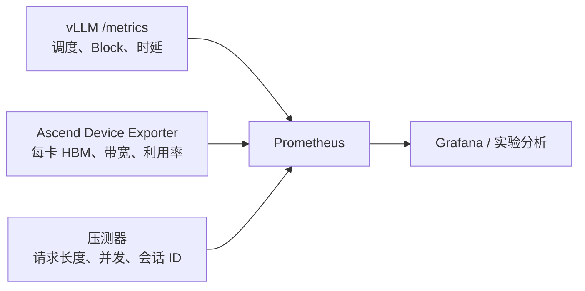

# vLLM / vLLM-Ascend KV Cache 运行时 Metrics 采集与验证

> 分析日期：2026-06-15  
> 代码基线：
> - vLLM：`0d29612292c6b1e312af42ac00cf649af16a438b`
> - vLLM-Ascend：`8afdf356f6a2496bedfc538253366ef1a8c0d9aa`

## 1. 结论先行

不是所有需要的指标都由 vLLM Metrics 默认采集。

运行阶段的指标分成四类：

| 类别 | 是否默认 | 代表指标 | 能回答什么 |
|---|---:|---|---|
| 调度和聚合 KV Cache 指标 | 是 | 运行请求数、等待请求数、KV Cache 使用率、前缀缓存命中、抢占次数、首 Token 时延 | 服务是否接近容量上限 |
| KV Block 生命周期指标 | 否，需开启 | Block 存活时间、淘汰前空闲时间、复用间隔 | 缓存复用和淘汰是否有效 |
| DeepSeek V4 各缓存族与块状态明细 | 否，需补代码 | C4、C128、滑动窗口、状态缓存分别使用多少 Block；active/evictable/free 数量 | 混合 Attention 下显存和 Block 效率 |
| 昇腾 NPU 物理指标 | 否，需外部采集 | 每卡高带宽显存已用量、带宽、利用率、功耗、温度 | 物理显存和硬件瓶颈 |

最关键的语义：

> `vllm:kv_cache_usage_perc` 是 KV Block ID 池的逻辑占用率，不是昇腾 NPU 上 KV Cache 张量的物理显存使用率。

vLLM 在启动时已经按照可用预算创建完整的 KV Cache 张量池。即使刚启动、没有请求，物理高带宽显存通常也已经被这块张量池占用；此时逻辑 Block 使用率仍可接近 0。

因此运行时验证必须同时采集：

1. vLLM 调度和 Block 逻辑指标。
2. 每个昇腾 NPU 的物理显存指标。
3. 请求负载、上下文长度、缓存命中和时延指标。
4. 如需解释 DeepSeek V4 混合 Attention 效率，再补充各 KV Cache Group 的内部指标。

---

## 2. 默认采集链路

### 2.1 `/metrics` 端点

OpenAI 兼容服务会挂载 Prometheus `/metrics`：

- `vllm/entrypoints/serve/instrumentator/metrics.py:19-45`
- `vllm/entrypoints/serve/instrumentator/__init__.py:7-18`

服务启动后可直接检查：

```bash
curl -s http://127.0.0.1:8000/metrics | head
```

官方仓库内的 Prometheus/Grafana 示例也说明 Metrics 默认启用：

- `vllm/examples/observability/prometheus_grafana/README.md`
- `vllm/examples/observability/prometheus_grafana/prometheus.yaml`

### 2.2 不要关闭统计

`disable_log_stats` 默认值为 `False`：

- `vllm/engine/arg_utils.py:528`

API Server 把该配置传入异步推理引擎：

- `vllm/entrypoints/openai/api_server.py:134-143`
- `vllm/entrypoints/openai/api_server.py:342-344`

如果启动时传入：

```bash
--disable-log-stats
```

调度器的 `make_stats()` 会直接返回空值，Prometheus 运行指标也不会正常更新：

- `vllm/v1/core/sched/scheduler.py:2120-2129`

所以生产采集必须确保没有设置 `--disable-log-stats`。

---

## 3. vLLM 默认已经提供的指标

### 3.1 调度压力

源码：

- `vllm/v1/metrics/loggers.py:453-497`
- `vllm/v1/core/sched/scheduler.py:2144-2155`

主要指标：

```text
vllm:num_requests_running
vllm:num_requests_waiting
vllm:num_requests_waiting_by_reason{reason="capacity"}
vllm:num_requests_waiting_by_reason{reason="deferred"}
```

解释：

- `running`：当前由调度器执行的请求数。
- `waiting`：还未进入本轮执行的请求数。
- `capacity`：因当前调度容量不足而等待，但不一定只由 KV Cache 不足引起。
- `deferred`：本轮主动延迟处理的请求。

### 3.2 KV Cache 聚合使用率

指标：

```text
vllm:kv_cache_usage_perc
```

指标注册：

- `vllm/v1/metrics/loggers.py:524-532`

数据来源：

- `vllm/v1/core/kv_cache_manager.py:181-188`
- `vllm/v1/core/block_pool.py:505-516`

核心计算近似为：

```text
usage = 1 - free_blocks / (num_blocks - 1)
```

其中保留一个 Null Block，所以分母使用 `num_blocks - 1`。

该指标回答的是：“统一 Block Pool 中还有多少可分配 Block ID”，不能直接回答：

- 当前 NPU 实际用了多少 GiB KV Cache。
- C4、C128、滑动窗口 Attention 分别用了多少。
- 有多少 Block 正被运行请求引用。
- 有多少历史前缀 Block 已无引用、但仍保留哈希内容并可被淘汰。

### 3.3 前缀缓存

源码：

- `vllm/v1/metrics/loggers.py:547-593`
- `vllm/v1/metrics/loggers.py:1088-1100`

指标：

```text
vllm:prefix_cache_queries
vllm:prefix_cache_hits
vllm:external_prefix_cache_queries
vllm:external_prefix_cache_hits
```

注意：这里统计的是 Token 数量，不是请求数量。

外部缓存指标是否有完整数据，还取决于具体 KV Connector 是否实现相应 Metrics 接口：

- `vllm/distributed/kv_transfer/kv_connector/v1/metrics.py:139-175`

### 3.4 请求、Token 与时延

源码：

- `vllm/v1/metrics/loggers.py:633-935`

建议至少采集：

```text
vllm:prompt_tokens
vllm:prompt_tokens_cached
vllm:generation_tokens
vllm:request_prompt_tokens
vllm:request_generation_tokens
vllm:time_to_first_token_seconds
vllm:inter_token_latency_seconds
vllm:request_time_per_output_token_seconds
vllm:e2e_request_latency_seconds
vllm:request_queue_time_seconds
vllm:request_inference_time_seconds
vllm:request_prefill_time_seconds
vllm:request_decode_time_seconds
vllm:request_prefill_kv_computed_tokens
vllm:num_preemptions
```

这些指标用于判断：

- 首 Token 时延上升来自排队、Prefill，还是缓存未命中。
- 每 Token 时延上升是否和上下文长度、KV Cache 搬运量有关。
- KV Cache 接近满载时是否发生抢占和重计算。

---

## 4. 需要显式开启的 KV Block 生命周期指标

配置默认关闭：

- `vllm/config/observability.py:48-54`

命令行参数：

- `vllm/engine/arg_utils.py:1337-1342`

启动方式：

```bash
vllm serve <model-path> \
  --kv-cache-metrics \
  --kv-cache-metrics-sample 0.01
```

默认采样率为 `0.01`，即大约采样 1% Block。对应指标：

```text
vllm:kv_block_lifetime_seconds
vllm:kv_block_idle_before_evict_seconds
vllm:kv_block_reuse_gap_seconds
```

指标注册：

- `vllm/v1/metrics/loggers.py:938-1009`

采样器实现：

- `vllm/v1/core/kv_cache_metrics.py:46-96`

调度器只在开启后创建采样器：

- `vllm/v1/core/sched/scheduler.py:87-91`

这些指标适合分析：

- Block 创建后多久被淘汰。
- Block 在淘汰前闲置多久。
- 同一前缀 Block 两次复用的间隔。

局限：

- 它们是采样直方图，不是全量统计。
- 很多数据在 Block 淘汰时才形成观测。
- 不能代替当前 free、active、evictable Block 数量。
- 采样率不宜一开始设成 1.0，应先从 0.01 验证开销。

### 4.1 vLLM-Ascend 如何接入这套指标

vLLM-Ascend 没有重新实现一套独立的调度 Metrics，而是复用 vLLM 主链路。

对于 DeepSeek V4 的混合 KV Cache，Ascend 补丁创建 `AscendHybridKVCacheCoordinator` 时，仍把上游的 `KVCacheMetricsCollector` 传入共享 `BlockPool`：

- `vllm-ascend/vllm_ascend/patch/platform/patch_kv_cache_coordinator.py:67-113`
- `vllm-ascend/vllm_ascend/patch/platform/patch_kv_cache_coordinator.py:330-390`

这意味着：

- `--kv-cache-metrics` 对 Ascend Hybrid KV Cache 路径仍然有效。
- Block 生命周期事件仍从共享 `BlockPool` 采集。
- 它仍是 Block 级采样，不会自动拆分成 C4、C128 等 Cache Group 指标。
- 它也不会自动产生每张 910B3 的物理高带宽显存指标。

vLLM-Ascend 的 UCM KV Connector 实现了 `build_prom_metrics()` 转发接口，可由底层 UCM Connector 暴露连接器传输统计：

- `vllm-ascend/vllm_ascend/distributed/kv_transfer/kv_pool/ucm_connector.py:294-324`

但连接器 Metrics 与本地 Block Pool、物理高带宽显存属于三个不同观测面，不能相互替代。

---

## 5. 默认 Metrics 没有覆盖的关键指标

针对 DeepSeek V4 Flash、超长上下文和多轮 Agentic 负载，建议补充以下指标。

### 5.1 Block 状态

```text
kv_total_blocks
kv_free_blocks
kv_active_ref_blocks
kv_evictable_cached_blocks
kv_null_blocks
```

推荐状态定义：

- `active_ref`：`ref_cnt > 0`，当前仍被请求引用。
- `evictable_cached`：`ref_cnt == 0` 且仍有 `block_hash`，保留历史前缀、可立即淘汰。
- `free_empty`：`ref_cnt == 0` 且无有效哈希内容。
- `null`：保留的 Null Block。

默认 `kv_cache_usage_perc` 会把位于 free queue 中的可淘汰历史前缀视为“可用”，因此无法单独观察历史缓存驻留规模。

### 5.2 DeepSeek V4 Cache Group

建议按真实模型配置和 `KVCacheSpec` 类型设置标签，例如：

```text
vllm:kv_cache_group_blocks{
  group_id="0",
  cache_family="c4",
  state="active"
}
```

至少区分：

```text
c4
c128
sliding_window
state
mtp
```

每组建议采集：

- 逻辑 Block 数量。
- 每 Block 规划字节数。
- 每 Block 实际物化字节数。
- 当前 active、evictable、free 数量。
- 当前请求实际持有 Block 数高水位。

这组指标是解释“统一 Block ID 在不同缓存族中是否造成槽位浪费”的核心依据。

### 5.3 延迟释放和外部 KV Cache

建议采集：

```text
vllm:kv_delayed_free_requests{reason="connector"}
vllm:kv_delayed_free_blocks{reason="connector"}
vllm:streaming_waiting_requests
vllm:streaming_waiting_blocks
```

使用 Mooncake 或其他 KV Connector 时，请求已经结束不代表 Block 一定立刻归还本地 Block Pool；还可能等待异步传输或流式操作完成。

### 5.4 启动预算与实际物化

建议按每个 Pipeline Parallel Stage 和 Rank 记录：

```text
vllm:kv_cache_available_bytes
vllm:kv_cache_planned_bytes
vllm:kv_cache_materialized_bytes
vllm:kv_cache_num_blocks
vllm:model_weight_bytes
vllm:activation_peak_bytes
vllm:non_torch_bytes
vllm:graph_reserved_bytes
```

这些数据目前大量存在于启动日志和 Worker 内部计算中，并非默认 Prometheus Gauge。

---

## 6. 推荐的代码补点方式

### 6.1 不要在每轮调度扫描整个 Block Pool

直接遍历所有 Block 统计状态是 `O(num_blocks)`。超长上下文场景可能有数万到数十万个 Block，每个调度步扫描会增加 CPU 开销并影响吞吐。

应在 `BlockPool` 状态变化时维护常数时间计数器：

| 操作 | 计数变化 |
|---|---|
| 分配全新 Block | `free - 1`，`active + 1` |
| 命中缓存并由 `ref_cnt=0` 变为 `1` | `evictable - 1`，`active + 1` |
| 最后一个引用释放 | `active - 1`，`free + 1`；若有哈希则 `evictable + 1` |
| 淘汰历史哈希内容 | `evictable - 1`，`free_empty + 1` |

合适的实现位置：

- `vllm/v1/core/block_pool.py`
- `vllm/v1/core/kv_cache_manager.py`
- `vllm/v1/core/sched/scheduler.py`
- `vllm/v1/metrics/loggers.py`

### 6.2 数据传递

最小实现路径：

1. 在 `SchedulerStats` 增加 Block 状态字段。
2. `Scheduler.make_stats()` 从 `BlockPool` 的增量计数器读取。
3. 在 `PrometheusStatLogger.__init__()` 注册 Gauge。
4. 在 `PrometheusStatLogger.log()` 更新 Gauge。

每个 KV Cache Group 的占用不能只从共享 `BlockPool` 推导，需要在对应的 `SingleTypeKVCacheManager` 或协调器分配、释放路径中分别累计。

### 6.3 标签控制

推荐标签：

```text
model_name
engine
cluster
role
instance
rank
tp_rank
pp_rank
dp_rank
group_id
cache_family
state
```

禁止把以下内容作为 Prometheus 标签：

```text
request_id
session_id
conversation_id
block_id
```

否则会产生高基数时间序列，Prometheus 本身会先成为瓶颈。

---

## 7. 昇腾 NPU 物理指标如何采集

vLLM 默认 Metrics 不提供每张昇腾卡的完整物理高带宽显存和带宽指标。需要通过昇腾设备管理接口或设备 Exporter 单独采集，再与 vLLM 指标按实例和 Rank 关联。

至少采集：

```text
npu_hbm_used_bytes
npu_hbm_total_bytes
npu_utilization
npu_memory_bandwidth_read
npu_memory_bandwidth_write
npu_power
npu_temperature
```

部署关系：



关联维度至少包括：

```text
cluster
node
instance
engine
rank
role
```

在 32 卡场景中，调度器看到的通常是引擎级全局 Block 视图；物理显存却是每 Rank 的本地张量池。两者不能只看一个聚合值，必须同时保留每 Rank 设备指标。

---

## 8. 具体启动和采集配置

### 8.1 vLLM / vLLM-Ascend

建议实验阶段：

```bash
vllm serve <model-path> \
  --kv-cache-metrics \
  --kv-cache-metrics-sample 0.01
```

不要加入：

```bash
--disable-log-stats
```

先检查实际导出的名字：

```bash
curl -s http://127.0.0.1:8000/metrics | \
  grep -E 'vllm:(kv_cache|kv_block|prefix_cache|external_prefix_cache|num_requests|num_preemptions|time_to_first_token|inter_token_latency)'
```

Python Prometheus Client 对 Counter 可能在最终文本中增加 `_total` 后缀。因此查询前要以当前服务 `/metrics` 的实际输出为准。

### 8.2 Prometheus

```yaml
global:
  scrape_interval: 5s
  evaluation_interval: 5s

scrape_configs:
  - job_name: vllm
    metrics_path: /metrics
    static_configs:
      - targets:
          - 10.0.0.1:8000
          - 10.0.0.2:8000

  - job_name: ascend-device
    static_configs:
      - targets:
          - 10.0.0.1:<device-exporter-port>
          - 10.0.0.2:<device-exporter-port>
```

压测时建议 `scrape_interval=5s`。若专门分析瞬时 Prefill 峰值，可以临时降到 1 秒，但要先验证 Exporter、Prometheus 和服务端开销。

---

## 9. 核心 PromQL

以下 Counter 名称需根据实际 `/metrics` 输出确认是否带 `_total`。

### 9.1 KV Cache 逻辑使用率

```promql
max by (instance, model_name, engine) (
  vllm:kv_cache_usage_perc
)
```

### 9.2 运行和等待请求

```promql
sum by (instance, engine) (
  vllm:num_requests_running
)
```

```promql
sum by (instance, engine, reason) (
  vllm:num_requests_waiting_by_reason
)
```

### 9.3 本地前缀 Token 命中率

```promql
sum(rate(vllm:prefix_cache_hits_total[5m]))
/
clamp_min(sum(rate(vllm:prefix_cache_queries_total[5m])), 1)
```

### 9.4 外部缓存 Token 命中率

```promql
sum(rate(vllm:external_prefix_cache_hits_total[5m]))
/
clamp_min(sum(rate(vllm:external_prefix_cache_queries_total[5m])), 1)
```

### 9.5 抢占速率

```promql
sum by (instance, engine) (
  rate(vllm:num_preemptions_total[5m])
)
```

### 9.6 首 Token 时延和每 Token 时延

```promql
histogram_quantile(
  0.99,
  sum by (le, instance) (
    rate(vllm:time_to_first_token_seconds_bucket[5m])
  )
)
```

```promql
histogram_quantile(
  0.99,
  sum by (le, instance) (
    rate(vllm:inter_token_latency_seconds_bucket[5m])
  )
)
```

### 9.7 逻辑 Block 与物理显存联动

推荐在 Grafana 同图展示：

```text
vllm:kv_cache_usage_perc
npu_hbm_used_bytes / npu_hbm_total_bytes
vllm:num_requests_running
vllm:num_requests_waiting
```

典型解释：

| 现象 | 可能原因 |
|---|---|
| 物理显存高、KV 使用率低 | KV 张量池已在启动时完整预分配，属正常现象 |
| KV 使用率高、等待请求增加、抢占增加 | Block Pool 接近容量上限 |
| KV 使用率下降慢、evictable 很高 | 多轮历史前缀大量驻留，但可在需要时淘汰 |
| KV 使用率不高、NPU 带宽满、TPOT 上升 | Decode 受 KV Cache 读取带宽限制 |
| 外部缓存命中高但首 Token 时延仍高 | 外部 KV 拉取、序列化或网络传输成为瓶颈 |

---

## 10. 建议的实施顺序

### 阶段一：零代码改动

采集：

- 默认 vLLM Metrics。
- 开启 `--kv-cache-metrics` 后的生命周期直方图。
- 昇腾 NPU 每卡物理指标。
- 压测器请求长度、并发和会话轮次。

目标：

- 建立 128K、256K、512K、1M 下的容量和时延基线。
- 判断瓶颈属于逻辑 Block 容量、物理显存、设备带宽还是调度排队。

### 阶段二：补 Block 状态指标

新增：

- active、evictable、free Block。
- 延迟释放请求和 Block。
- 当前请求 Block 高水位。

目标：

- 区分“正在执行的 KV Cache”和“保留但可淘汰的历史缓存”。
- 定量分析多轮 Agentic 会话对新请求准入并发的影响。

### 阶段三：补 DeepSeek V4 Group 指标

新增：

- C4、C128、滑动窗口、状态和 MTP 的独立占用。
- 规划字节数与实际物化字节数。
- 每组有效率和统一 Block ID 槽位浪费。

目标：

- 精确定位混合 Attention KV Cache 规格对并发的限制项。
- 验证分组、页面大小和 KV Cache Spec 调整是否真正增加有效并发。

---

## 11. 最小验收标准

采集链路可以用以下检查表验收：

1. `/metrics` 能看到 `kv_cache_usage_perc`、运行和等待请求指标。
2. 未设置 `--disable-log-stats`。
3. 开启 `--kv-cache-metrics` 后能看到三个 Block 生命周期直方图。
4. 每张 910B3 都有独立物理显存和利用率时间序列。
5. 压测记录包含请求输入长度、输出长度、并发、轮次和前缀复用关系。
6. Prometheus 标签能关联到节点、Engine、Rank、并行角色和服务实例。
7. Dashboard 同时展示逻辑 Block 使用率、物理显存、排队、抢占、命中率和时延。
8. 任何并发结论均以稳态窗口为准，而不是只观察服务刚启动的空缓存状态。

最终判断：

> vLLM 默认 Metrics 足以做第一层容量和时延观测，但不足以证明 DeepSeek V4 Flash 混合 Attention 下的 KV Cache 真实显存效率。完整验证至少需要“默认 Metrics + 可选 Block 生命周期 Metrics + 昇腾设备 Metrics”；要解释历史缓存、各 Cache Group 和统一 Block ID 的效率，还需要在 BlockPool、KVCacheManager 和 SchedulerStats 中增加低开销的增量指标。
