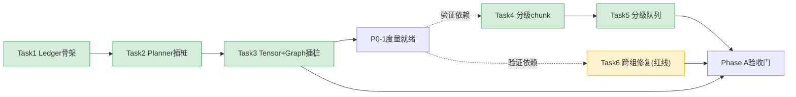

# DeepSeek-V4-Flash KV Cache 多级缓存 Phase A 实施计划

> **方案性质适配说明**：本计划遵循 writing-plans 的任务分解结构（文件映射 + bite-sized 任务 + 验收门），但因目标为 **910B3 集群上的推理引擎 kernel/调度改动、无本地可跑环境**，每个任务的「验证」落到**指向源码改动点 + 对应 [监控验证方案 172505](20260614-172505-vllm-vllm-ascend-kvcache显存效率-监控采集与实验验证方案-分析.md) 的实验 Phase**，而非编造无法运行的 pytest。所有行号锚点已 grep 实测。

**Goal:** 实现 Phase A（快赢阶段）——KV Memory Ledger 度量上线 + chunk 分级队列 + 跨组 prefix 修复，把 512K 并发从 4 提到 7 并解锁多轮 TTFT。

**Architecture:** 三项独立可交付：P0-1 纯新增观测模块（零侵入）；P0-2 配置 + 调度分流（复用 vLLM priority policy）；P1-b 改 patched coordinator 的命中截断逻辑（红线项，是后续 L3 的前置）。三项可并行开发，P1-b 验证需先有 P0-1 的度量。

**Tech Stack:** vLLM V1 / vLLM-Ascend patch 体系 / Python / Prometheus / torch.npu profiler / DeepSeek-V4-Flash @ Ascend 910B3

**基线版本:** `vllm-ascend @ a57a8f0`、`vllm @ 0d29612`（行号锚点基于此）

---

## 文件映射（改动边界，已 grep 实测）

| 任务 | 文件 | 行号锚点 | 责任 |
|------|------|---------|------|
| P0-1 | 新增 `vllm_ascend/observability/kv_cache_memory.py` | — | `KVCacheMemoryLedger` 数据结构 + 输出 |
| P0-1 | `patch_kv_cache_utils.py` | :141 page_sizes / num_blocks 计算处 | planner 插桩 |
| P0-1 | `worker/model_runner_v1.py` | :3929 `_allocate_kv_cache_tensors` | tensor storage 插桩 |
| P0-1 | `worker/worker.py` | :379 graph profiling 处 | graph actual 插桩 |
| P0-2 | 部署配置（recipe sh） + `sched/scheduler.py` | :239/:425 max_num_batched_tokens | 分级 chunk |
| P0-2 | `sched/request_queue.py` | :13 SchedulingPolicy | 分级队列复用 |
| P1-b | `patch_kv_cache_coordinator.py` | :212 `find_longest_cache_hit` / :267 SWA 截断 | 跨组命中修复 |

---

## Task 1：P0-1 KV Memory Ledger 数据结构与输出骨架

**Files:**
- Create: `vllm-ascend/vllm_ascend/observability/kv_cache_memory.py`

- [ ] **Step 1：定义 Ledger 数据结构**（对齐 172505 §6.1 schema）

```python
# vllm_ascend/observability/kv_cache_memory.py
from dataclasses import dataclass, asdict
import json, os

@dataclass
class KVCacheMemoryLedger:
    # 规划层（172505 §4.1）
    available_kv_bytes: int = 0
    planner_slab_bytes: int = 0
    num_blocks: int = 0
    planner_budgeted_bytes: int = 0
    planner_remainder_bytes: int = 0
    # 分配层
    materialized_visible_bytes: int = 0
    materialized_storage_bytes: int = 0
    alignment_overhead_bytes: int = 0
    # graph
    graph_estimated_bytes: int = 0
    graph_actual_bytes: int = 0
    # per-group（DeepSeek-V4 六类）
    groups: list = None

    def dump(self, rank: int):
        d = os.environ.get("VLLM_ASCEND_KV_CACHE_DIAGNOSTICS_DIR")
        if not d:
            return
        os.makedirs(d, exist_ok=True)
        with open(os.path.join(d, f"startup_kv_ledger_rank{rank}.json"), "w") as f:
            json.dump(asdict(self), f, indent=2)
```

- [ ] **Step 2：加 feature flag 门控**（172505 §6.1 输出方式）

环境变量 `VLLM_ASCEND_KV_CACHE_DIAGNOSTICS=1` 才启用，默认零开销、零侵入。在模块顶部加 `ENABLED = os.environ.get("VLLM_ASCEND_KV_CACHE_DIAGNOSTICS", "0") == "1"`。

- [ ] **Step 3：验收（静态）**

- 模块独立可 import，无副作用（flag 关闭时不触发任何采集）。
- schema 字段与 172505 §4.1 一级账本表逐项对齐。

- [ ] **Step 4：Commit**

```bash
git add vllm_ascend/observability/kv_cache_memory.py
git commit -m "feat(observability): add KVCacheMemoryLedger skeleton for DeepSeek-V4 KV diagnostics"
```

---

## Task 2：P0-1 Planner 插桩（规划层账本）

**Files:**
- Modify: `vllm-ascend/vllm_ascend/patch/platform/patch_kv_cache_utils.py` 的 num_blocks 计算处（:141 附近 page_sizes 计算后）

- [ ] **Step 1：在 num_blocks 算出后填充 Ledger 规划层字段**

```python
# 在 patch_kv_cache_utils.py num_blocks 计算后（参考 172505 §6.1 插桩点 A）
if kv_cache_memory.ENABLED:
    ledger.available_kv_bytes = available_memory
    ledger.planner_slab_bytes = layer_tuple_page_bytes * num_layer_tuples
    ledger.num_blocks = num_blocks
    ledger.planner_budgeted_bytes = ledger.planner_slab_bytes * num_blocks
    ledger.planner_remainder_bytes = available_memory - ledger.planner_budgeted_bytes
    # per-group: group_id/role/block_size/compress_ratio/page_bytes/real_page_bytes/padding
    ledger.groups = [_group_record(g) for g in kv_cache_config.kv_cache_groups]
```

- [ ] **Step 2：验收（对账，对齐资料 182107 权威值）**

启动 DeepSeek-V4-Flash，`VLLM_ASCEND_KV_CACHE_DIAGNOSTICS=1`，核对：
```
planner_slab_bytes == 3,397,376（MTP 1 层，资料 §5.2）
单 block materialized ≈ 3,364,096（资料 §5.3）
32GiB 预算 → num_blocks ≈ 10,113（资料 §6.5）
```
若偏差 >1%，逐项查 MTP 开关 / block_size / 设备页表（172505 §11.1）。

- [ ] **Step 3：Commit**

```bash
git add vllm_ascend/patch/platform/patch_kv_cache_utils.py
git commit -m "feat(observability): instrument KV planner for memory ledger (planning layer)"
```

---

## Task 3：P0-1 Tensor 分配 + Graph 插桩（分配层账本）

**Files:**
- Modify: `vllm-ascend/vllm_ascend/worker/model_runner_v1.py:3929`（`_allocate_kv_cache_tensors` 前后）
- Modify: `vllm-ascend/vllm_ascend/worker/worker.py:379`（graph capture 后）

- [ ] **Step 1：tensor 分配前后记账 + storage 去重**（172505 §6.1 插桩点 B）

```python
# model_runner_v1.py:3929 _allocate_kv_cache_tensors 前后
allocated_before = torch.npu.memory_allocated()
kv_cache_raw_tensors = self._allocate_kv_cache_tensors(kv_cache_config)
allocated_after = torch.npu.memory_allocated()
if kv_cache_memory.ENABLED:
    storages = {}
    for t in _flatten(kv_cache_raw_tensors):
        st = t.untyped_storage()
        storages[(st.data_ptr(), st.nbytes())] = st.nbytes()
    ledger.materialized_storage_bytes = sum(storages.values())
    ledger.materialized_visible_bytes = sum(t.numel()*t.element_size() for t in _unique_views(kv_cache_raw_tensors))
    ledger.alignment_overhead_bytes = ledger.materialized_storage_bytes - ledger.materialized_visible_bytes
```

- [ ] **Step 2：graph capture 后记 actual**（172505 §6.1 插桩点 C；DeepSeek-V4 即使 estimate=0 也必须记 actual）

```python
# worker.py:379 graph 相关处，capture 后
if kv_cache_memory.ENABLED:
    ledger.graph_estimated_bytes = estimated_graph_bytes  # DeepSeek-V4 可能为 0
    ledger.graph_actual_bytes = actual_graph_bytes
    ledger.dump(rank=self.rank)
```

- [ ] **Step 3：验收（172505 §11.1 校验矩阵）**

```
materialized_storage_bytes >= materialized_visible_bytes  （对齐差全归因于 2MiB alignment）
开 KV transfer 后出现可解释的 2MiB alignment overhead
graph actual 被记入最终账本
```

- [ ] **Step 4：Commit**

```bash
git add vllm_ascend/worker/model_runner_v1.py vllm_ascend/worker/worker.py
git commit -m "feat(observability): instrument KV tensor allocation + graph capture (allocation layer)"
```

---

## Task 4：P0-2 分级 chunk 配置（容量控制变量）

**Files:**
- Modify: DeepSeek-V4-Flash 部署 recipe（`max-num-batched-tokens` 分队列配置）
- 参考: `vllm/vllm/v1/core/sched/scheduler.py:239/:425`（max_num_batched_tokens 已是容量变量，资料 182107 §8.5）

- [ ] **Step 1：为三类队列设差异化 chunk**

```
低延迟长会话(512K):  max-num-batched-tokens = 2048   # 准入峰值 7.75→4.45GiB（资料 §8.5）
短 Agent turn:        增量自适应（按 num_computed_tokens）
离线吞吐:             max-num-batched-tokens = 8192-10240
```

- [ ] **Step 2：验收（对齐 Task 1-3 的 Ledger）**

跑 512K 单请求，chunk=2048 vs 8192，对比 Ledger 的准入峰值 block 数：
```
chunk=8192 准入峰值 ≈ 2475 块 = 7.75 GiB（基线）
chunk=2048 准入峰值 ≈ 1419 块 = 4.45 GiB（应下降 43%）
```
对应 172505 Phase 2（并发容量阶梯）：32GiB 池 512K 并发 4→7。

- [ ] **Step 3：Commit**

```bash
git add <recipe.sh>
git commit -m "config: differentiated chunk per queue for 512K admission peak control"
```

---

## Task 5：P0-2 分级队列分流（复用 priority policy）

**Files:**
- 参考: `vllm/vllm/v1/core/sched/request_queue.py:13`（SchedulingPolicy 已有 PRIORITY）
- Modify: 请求入队时按队列标签设 priority

- [ ] **Step 1：请求按场景打标签 → 映射 priority**

复用 vLLM 现有 `SchedulingPolicy.PRIORITY`，长会话/短 turn/离线三类映射到不同 priority 值，调度器自然分流（无需新调度器）。

- [ ] **Step 2：验收**

172505 Phase 3（Agentic 多轮）矩阵中验证：三类队列在同一实例下并存时，长会话不被离线吞吐请求饿死，preemption rate 接近 0。

- [ ] **Step 3：Commit**

```bash
git add <queue routing>
git commit -m "feat(sched): route request queues via priority policy for differentiated SLO"
```

---

## Task 6：P1-b 跨组 prefix 命中修复（红线项）

**Files:**
- Modify: `vllm-ascend/vllm_ascend/patch/platform/patch_kv_cache_coordinator.py:212`（`find_longest_cache_hit`）+ :267（SWA/full 截断处）

- [ ] **Step 1：修复两个压缩 full group 都完整截断**（当前只第一个，资料 §11.5）

```python
# find_longest_cache_hit 末尾，当前只对 attention_groups[0] 做 FullAttention 截断
# 改为: C4 和 C128 两个 full-attention-like 组都按各自 effective_block_size 截断到一致边界
for spec, group_ids, _ in self.attention_groups:
    if isinstance(spec, FullAttentionSpec):
        nb = hit_length // self._get_effective_block_size(spec)
        for gid in group_ids:
            if (blks := hit_blocks_by_group[gid]) is not None:
                del blks[nb:]
```

- [ ] **Step 2：SWA 组不拉低总命中长度**（资料 §15.4）

```python
# SWA group 不参与 min(hit_length) 的下拉；
# 只加载命中边界前最后 ceil(sliding_window/block_size)+1 个 block
# 允许各 group 返回不同物理 block 列表，但共享一致 computed_token 边界
```

- [ ] **Step 3：验收（正确性优先 + 命中率）**

- **正确性（红线）**：跨组修复后输出 diff 与基线一致（172505 §11.2 条件 1），用 `OMNI_CACHE_SKIP_OX_PULL` 类手段或固定 seed 比对，**确认无串话/错位**。
- **命中率**：172505 Phase 4（Prefix Cache 专项）+ Phase 3（多轮），验证：
  ```
  compute_amplification = 实际新计算prefill token / 对话新增唯一token  → 应趋近 1（基线可能 ≫1）
  SWA group 不再把共同 prefix hit 长度压到 0（172505 §8.5 第6项）
  ```

- [ ] **Step 4：Commit**

```bash
git add vllm_ascend/patch/platform/patch_kv_cache_coordinator.py
git commit -m "fix(kvcache): repair cross-group prefix hit for DeepSeek-V4 (C4/C128 both truncated, SWA not zeroing)"
```

---

## Phase A 验收门（整体，172505 §11.2）

通过条件（缺一不可）：

```
1. 输出正确性无回退（P1-b diff 测试通过）
2. P0-1 Ledger 与资料 182107 权威值对账一致（planner/storage/graph）
3. 512K@32GiB 并发 4→7（chunk 调小，172505 Phase 2 实测）
4. 50 轮 compute_amplification 趋近 1（P1-b，172505 Phase 3 实测）
5. 无新增 OOM / preemption / 长期 HBM 增长
6. 三次重复 run 结论稳定（容量边界点 5 次）
7. 监控常开开销 < 3%（172505 §8.1 A/B 测试）
```

主指标（172505 §11.2）：
```
capacity_gain = 候选最大稳定会话 / 基线 - 1   （目标 ≥ +75%）
throughput_gain = 候选 output_tps / 基线 - 1
hbm_saving = 1 - 候选 peak_hbm / 基线
```

---

## 任务依赖图



> 关键约束：**P0-1（Task 1-3）是 P0-2/P1-b 验证的前提**——没有 Memory Ledger 度量，chunk 调小的准入峰值下降、跨组修复的命中率提升都无法量化证明。先把度量上线，再做优化，这是 172505 §1.3「P0 度量先行」的纪律。
