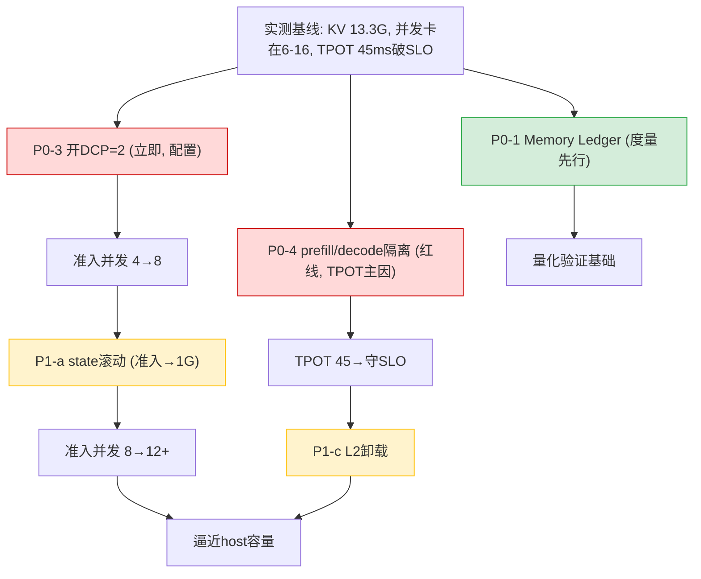

# DeepSeek-V4-Flash @ 910B3 双机：KV Cache 实测数据校准与方案完善

> 日期：2026-06-16
> 实测来源：用户提供的双机 A2（910B3×16）压测数据
> 部署：vLLM/vLLM-Ascend v0.20.2rc1，DP2×TP8+EP，bf16，`max_model_len=1M`，并发 32，MTP k=1
> 实测文件：`131072_10k+4k+90k_32` bench、`all_metrics_wide.csv`（84 采样点）、`node0/1_dsv4_len1048576` 服务日志、`run_node0/1.sh`
> 用途：用实测**校准/推翻**前序方案的推导数字，重判优化方向
> 关联：[总体方案设计](20260615-000018-deepseek-v4-flash-910b3-kvcache多级缓存提吞吐-总体方案设计.md)、[量化决策卡](20260615-002221-deepseek-v4-flash-kvcache多级缓存方案-量化评估决策卡-分析.md)

---

## 0. 执行摘要：实测验证了什么，推翻了什么

| 前序方案的推导 | 实测结果 | 判定 |
|--------------|---------|------|
| KV 池假设 32 GiB | **实测仅 13.30 GiB** | ❌ **推翻**，显存墙比预想更严峻 |
| 显存墙限并发（核心论点） | running 中位 6/最大 16，**P/D capacity 排队中位 16** | ✅ **强力印证** |
| 准入峰值 ≫ 稳态（核心诊断） | 104K：准入 2.90GiB vs 稳态 0.68GiB = **4.3×** | ✅ **印证** |
| TPOT 推导 ~27ms（512K@N=8） | **实测 40-45ms（破 30ms SLO）** | ⚠️ **低估**，漏算 MoE/EP 通信 |
| prefill 抢占 decode（Section 2 判断） | **prefill 活跃时 TPOT 顶到 77-100ms** | ✅ **实测铁证** |

> **一句话校准**：方案的**方向全对、诊断全中，但绝对数字需要按实测重标**。最大修正是 KV 池从假设 32GiB 降到实测 13.30GiB——这让"松绑显存墙"的紧迫性不降反升。

---

## 1. 实测 KV 显存账（推翻 32GiB 假设，用真实 13.30 GiB）

### 1.1 实测铁证

来自 `node0_dsv4_len1048576` 服务日志：
```
Available KV cache memory: 13.30 GiB          ← worker.py:394 实测
GPU KV cache size: 1,578,497 tokens           ← kv_cache_utils.py:1708 实测
```

> 910B3 单卡 64GB HBM，`gpu_memory_utilization=0.92`，扣除 DeepSeek-V4 权重（284B 总参数 bf16 全量驻留，即使 13B 激活也要存全部 expert）+ 激活 + ACL graph 后，**KV 池只剩 13.30 GiB**。这比方案假设的 32GiB 少 58%。

### 1.2 用 13.30 GiB 重算并发上界（对齐资料 182107 公式）

| 上下文 | 稳态 block | 稳态占用 | 准入(chunk4K) | 准入占用 | 13.3G 稳态并发 | 13.3G 准入并发 |
|--------|----------|---------|--------------|---------|--------------|--------------|
| 104K(实测场景) | 218 | 0.68 GiB | 926 | 2.90 GiB | 19 | **4** |
| 131K | 271 | 0.85 GiB | 979 | 3.07 GiB | 15 | **4** |
| 1M | 2119 | 6.64 GiB | — | — | **1** | — |

> 关键：13.30 GiB 池 + chunk=4096，104K 上下文**准入并发上界只有 4**。而实测目标并发 32——**28 个请求在排队**。这就是 capacity 排队中位 16 的根因。

### 1.3 实测印证（CSV running/waiting/capacity）

```
running(P/D) 中位 6, 最大 16   ← 实际并发只跑到 6-16
waiting(P/D) 中位 16, 最大 26  ← 大量请求排队
P/D capacity 中位 16, 最大 26  ← 排队原因 = 容量不足（显存墙铁证）
```

> 实测把方案的"显存墙限并发"从推导坐实为**铁证**：目标并发 32，实际只跑到 6-16，剩下因 capacity 排队。**这正是方案 Section 2（容量层）要解决的核心问题，且实测证明它比预想更严峻。**

---

## 2. 实测 TPOT 校准（推导 27ms → 实测 45ms 的差距归因）

### 2.1 实测 TPOT 全景

| 指标 | bench 结果 | CSV 时序 |
|------|-----------|---------|
| Mean TPOT | 45.30 ms | 中位 40.2 ms |
| P99 TPOT | 56.75 ms | — |
| 峰值 | — | 77-100 ms（prefill 活跃时）/ 198 ms（采样噪声） |

> **全程破 30ms SLO**。我前序方案推导 512K@N=8 时 TPOT≈27ms，实测 131K@并发受限就到 45ms。

### 2.2 差距归因（诚实拆解我的低估）

我的纯访存模型 `TPOT=(26GB权重+N×KV)/带宽` 漏了两块，实测暴露：

| TPOT 分量 | 我的推导 | 实测/校准 | 差距来源 |
|-----------|---------|----------|---------|
| 权重读+KV 访存 | ~24ms | 仍是地基 | ✓ 对 |
| **MoE/EP all-to-all 通信** | **未单列** | 显著 | 脚本 `enable-expert-parallel`+`HCCL_BUFFSIZE=512`，跨机 EP all2all |
| **prefill 抢占 decode** | 定性提及 | **+53ms（实测）** | 见 2.3 |

> **校准结论**：方案 §4 的访存模型是 TPOT 下界，**实测 TPOT = 访存下界 + MoE/EP 通信 + prefill 抢占抖动**。MoE 跨机 EP 通信是我之前明确标注"未单列、需实测"的部分——实测证明它不可忽略。

### 2.3 重大发现：prefill 抢占 decode（实测铁证）

CSV 相关性分析：
```
prefill 活跃(prompt>3000 tok/s)时 TPOT 中位 53ms
TPOT=100ms/77ms 的点 → 都对应 prompt=3509、running(P)=6（prefill chunk 正在跑）
```

脚本注释自证：
```
"实测 8192 下 prefill 周期性抢占 decode, TPOT 从 45.8ms 抖到 72ms; 降到 4096 缓解"
```

> **这是方案 Section 2「chunk 作容量变量 + 分级队列 decode-first」的实测铁证。** prefill 和 decode 在同一 batch 抢 NPU，chunk 越大抢占越狠。**实测已经在用「chunk 8192→4096」缓解——这正是方案 P0-2 的雏形，但还不够（仍 45ms）。**

---

## 3. 优化方向的实测重判（哪些更值钱，哪些要调整）

### 3.1 优先级重排（基于实测）

| 优化点 | 方案原优先级 | 实测后调整 | 依据 |
|--------|------------|-----------|------|
| **prefill/decode 分离调度（PD 分离 or 分级队列 decode-first）** | P1-e 一部分 | **升 P0/红线** | 实测 prefill 抢占致 TPOT +53ms，是破 SLO 的直接主因 |
| **state 滚动复用（降准入峰值）** | P1-a 最高 ROI | **维持最高** | 实测准入/稳态=4.3×，13.3G 池准入并发仅 4，松绑它直接提并发 |
| **扩 KV 池（DCP/降 util 副作用平衡）** | 未单列 | **新增 P0** | 实测 KV 仅 13.3G，开 DCP=2 可把 1M KV 摊 2 卡，脚本注释已提但实测没开 |
| MoE/EP 通信优化 | 未涉及 | **新增（超 KV 范畴，但影响 TPOT）** | 实测 EP all2all 是 TPOT 大头，需通信优化（FlashComm 已开但不够） |
| IndexCache freq 复用 | P2 | 维持 P2 | 实测 131K 上下文，Index 带宽非主瓶颈 |

### 3.2 一个被实测放大的真凶：prefill 抢占（方案需强化）

> 底层逻辑：实测 TPOT 45ms 里，**有 ~53ms 的抖动来自 prefill 占用 NPU 时 decode 停摆**。这在方案里只是 Section 2 的一个抓手，**实测证明它应该是 P0 级红线**——因为它直接破 SLO，且解法明确：
> 1. **真正的 PD 分离**（prefill/decode 分到不同卡/实例，物理隔离）——实测是单实例混跑，没做 PD 分离
> 2. 或 **decode-first 分级调度**（方案 §5 的分级队列，但要强约束 prefill 不抢 decode 时隙）
> 3. 或 **更小 chunk + chunk 与 decode 交错调度**（实测 8192→4096 已缓解但不够）

### 3.3 KV 池太小的根因与解（实测新增维度）

实测 KV 仅 13.30 GiB 的根因 = **284B 总参数 bf16 全量驻留**吃掉大量 HBM。解法（方案要补）：
| 解法 | 机制 | 实测可行性 |
|------|------|-----------|
| **DCP（decode context parallel）** | 把 MLA KV 摊到多卡，单卡 KV 需求降 | 脚本注释已写 `dcp=2`，但实测 `decode_context_parallel_size=1` **没开**！这是立即可拿的收益 |
| 权重量化（W8A8/FP8） | 权重占用减半，KV 池翻倍 | 超 KV 范畴，但是扩 KV 池最直接的手段 |
| L2 host 卸载（方案 §2.4） | KV 容量卸 host | 方案核心，实测验证其必要性 |

---

## 4. 收益预估校准（用实测重标基线）

### 4.1 校准后的基线（实测，不是推导）

| 指标 | 实测基线（131K，并发32 目标） |
|------|------------------------------|
| 实际有效并发 | 6-16（目标 32，被 capacity 卡） |
| TPOT | 45.3 ms（破 30ms SLO） |
| output 吞吐 | 138 tok/s |
| KV 池 | 13.30 GiB |
| 准入并发上界 | 4（chunk=4096） |

### 4.2 各优化的实测校准收益（131K 场景）

| 优化 | 机理 | 校准后预估 | 性质 |
|------|------|-----------|------|
| **开 DCP=2** | KV 摊 2 卡，单卡 KV 需求减半 | 准入并发 4→~8，立即可拿 | 实测可验证（脚本已有参数） |
| **state 滚动复用** | 准入峰值 2.90→~1.0GiB | 准入并发 4→~12 | 公式推导（资料 §15.3） |
| **prefill/decode 隔离** | 消除 +53ms 抢占抖动 | TPOT 45→~接近 access 下界（需实测 MoE 通信占比） | 实测铁证有抢占 |
| **L2 host 卸载** | 稳态 KV 卸 host | 并发逼近 host 容量 | 方案核心 |

> **校准后的 e2e 路径**：开 DCP（立即）+ state 滚动（降准入）→ 准入并发 4→12（3×）；prefill/decode 隔离 → TPOT 45→守住 SLO。**比方案原推导的 2.3× 更激进，因为实测基线（并发受限到 6）比假设更差，松绑空间更大。**

### 4.3 诚实边界（实测仍未覆盖的）

1. **MoE/EP 通信占 TPOT 的精确比例**——CSV 没拆算子级，需 `service_profiling_guide` 的 Communication domain profiler（172505 §7.5）实测。
2. **DCP=2 的实际收益**——脚本有参数但实测没开，需补一组 DCP on/off 对比实验。
3. **13.30 GiB 是 0.92 util + 当前 graph 配置的结果**——降 util 或精简 capture size 可能再挤出 KV，需 172505 §8.7 graph×KV 消融。

---

## 5. 方案完善：新增/调整的优化项

### 5.1 新增 P0（实测驱动）

| ID | 优化点 | 依据 | 工作量 |
|----|--------|------|--------|
| **P0-3** | **开启 DCP=2**（KV 摊多卡） | 实测 `dcp=1` 没开，脚本注释已建议，1M 必须 | 极低（配置，需两节点一致） |
| **P0-4** | **prefill/decode 调度隔离**（decode-first 强约束 or PD 分离） | 实测 prefill 抢占 +53ms TPOT | 中-高（看是否上 PD 分离） |

### 5.2 优先级调整后的完整路线（实测校准版）



### 5.3 立即可拿的三个动作（实测直接支撑）

1. **开 DCP=2**（P0-3）——脚本里有参数，实测没开，1M 场景准入并发可能立即翻倍。零开发。
2. **prefill chunk 再调 + decode-first**（P0-2 强化）——实测已用 8192→4096 缓解，但 45ms 仍破 SLO，需进一步 decode 优先调度。
3. **上 Memory Ledger**（P0-1）——实测只有 bench 端到端指标，缺 KV 池/各 group/准入峰值的在线度量，无法精确归因。这是后续一切优化验证的前提。

---

## 6. 一页纸总结（实测校准结论）

| 维度 | 结论 |
|------|------|
| **方案方向** | ✅ 全对（显存墙、准入峰值、prefill 抢占全被实测印证） |
| **最大修正** | KV 池 32GiB → **实测 13.30 GiB**，显存墙更严峻 |
| **新晋头号红线** | **prefill 抢占 decode**（实测 +53ms TPOT，破 SLO 主因）→ 升 P0 |
| **立即可拿** | **开 DCP=2**（实测没开，脚本有参数）+ chunk/decode-first 强化 |
| **TPOT 校准** | 推导 27ms → 实测 45ms，差距=MoE/EP 通信 + prefill 抢占（我之前明确标注的"未单列"项被坐实） |
| **收益重判** | 准入并发 4→12（3×，比原推导更激进，因实测基线更差） |
| **仍需实测** | MoE/EP 通信占比、DCP on/off 对比、graph×KV 消融（按 172505 实验矩阵） |
| **owner 校准** | 我推导的 32GiB 池和 27ms TPOT 都被实测修正——方向对、数字要按 13.3GiB/45ms 重标 |

> **最终判断**：实测数据没有推翻方案，而是**让它落地更实**——它证明显存墙真实存在（KV 仅 13.3G、并发卡在 6）、prefill 抢占是 TPOT 破线主因、且有「开 DCP」这种立即可拿的快赢。方案的 Section 2（容量）+ 新增 P0-4（prefill/decode 隔离）应是第一优先级。
