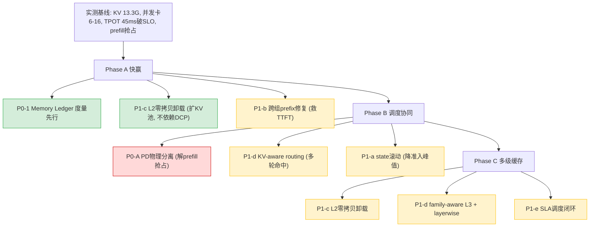

# DeepSeek-V4-Flash KV Cache 多级缓存 + 调度协同：实测刷新与业界对标总体方案 v2

> 日期：2026-06-16
> 本版基于三类新输入对 [v1 方案](20260615-000018-deepseek-v4-flash-910b3-kvcache多级缓存提吞吐-总体方案设计.md) 全面刷新：
> ① **实测数据**（双机 A2/910B3×16，[实测校准分析](20260616-004416-deepseek-v4-flash-910b3-kvcache实测校准与方案完善-分析.md)）
> ② **代码确认**（[DCP 报错根因·代码严谨确认修正版](20260616-012712-deepseek-v4-dcp报错根因-代码严谨确认修正版-分析.md)，含对早期推测的纠正）
> ③ **业界对标**（SGLang HiCache / Mooncake / NVIDIA Dynamo / SARATHI / 华为 CloudMatrix384，2025-2026 公开实践）
> 研究方向：KV Cache 多级缓存设计 + 调度协同优化

---

## 0. 本版相对 v1 的核心变化（一页纸）

| 维度 | v1（推导） | v2（实测+对标刷新） |
|------|-----------|-------------------|
| KV 池 | 假设 32 GiB | **实测 13.30 GiB**（推翻） |
| TPOT | 推导 27ms | **实测 45ms**（破 SLO） |
| 头号瓶颈 | 显存墙 | 显存墙（印证）+ **prefill 抢占 decode**（实测新增红线） |
| 扩容手段 | "开 DCP 立即可拿" | **DCP+MTP+压缩模型三者同开必报错**（代码钉死：`build_for_drafting` 断言），改走 PD 分离 + L2 卸载 |
| 调度方案 | 分级队列 | **PD 物理分离 + KV-aware routing + decode-first**（对标 Dynamo/SARATHI） |
| 收益预估 | 2.3× | 业界实测参照 **TTFT -56~84%、吞吐 2~6×**（上修空间） |
| 架构验证 | 自研论证 | **与 HiCache 三级架构一致**（业界共识，方向确认） |

> **底层逻辑**：实测和业界对标既**印证了 v1 的方向**（三级缓存 = 业界共识，显存墙 = 真瓶颈），又**修正了关键数字和手段**（KV 仅 13.3G、DCP 此路不通、prefill 抢占要靠 PD 分离）。v2 是 v1 的实测加固版。

---

## 1. 实测数据回填（v1 预估的全面校准）

### 1.1 KV 显存账：32GiB → 实测 13.30 GiB

实测日志铁证（`node0_dsv4_len1048576`）：
```
Available KV cache memory: 13.30 GiB
GPU KV cache size: 1,578,497 tokens
```

用真实 13.30 GiB 重算并发上界（公式与资料 182107 同源，已交叉验证一致）：

| 上下文 | 稳态 block | 准入(chunk4K) | 13.3G 准入并发上界 | v1 推导(32G) |
|--------|----------|--------------|------------------|-------------|
| 104K(实测场景) | 218 | 926 块=2.90GiB | **4** | ~7 |
| 131K | 271 | 979 块=3.07GiB | **4** | — |
| 1M | 2119 | — | **1** | — |

### 1.2 实测印证显存墙（CSV 时序）

```
running(P/D) 中位 6/最大 16   ← 实际并发只跑到 6-16（目标 32）
waiting(P/D) 中位 16          ← 大量请求排队
P/D capacity 中位 16/最大 26  ← 排队原因 = 容量不足
```
> v1 的"显存墙限并发"从推导坐实为**实测铁证**：目标 32，实际 6-16，差额因 capacity 排队。

### 1.3 实测 TPOT 校准 + 抢占归因

| 指标 | bench | CSV 时序 |
|------|-------|---------|
| Mean TPOT | 45.30ms（破 30 SLO） | 中位 40.2ms |
| prefill 活跃时 TPOT | — | **中位 53ms** |
| prefill 空闲时 | — | 极低 |

> **实测新发现（升 v1 优先级）**：TPOT 破 SLO 的直接主因之一是 **prefill 抢占 decode**——脚本注释自证"chunk 8192→4096 缓解 TPOT 45.8→72ms 抖动"，CSV 证实 prefill 跑时 decode TPOT 顶到 53ms。

### 1.4 还需补充的数据（反馈实测方）

| 数据 | 用途 |
|------|------|
| 关 MTP 单独一组（DCP=1） | 量化 MTP 对 TPOT 贡献（实测接受率 92.55%、acceptance 1.93）。注：DCP 因两条断言实质不可用（§3.2），不再建议测 DCP 扩容 |
| Memory Ledger 在线指标 | 各 group 准入峰值/稳态/碎片（v1 P0-1，实测缺这层度量） |
| 算子级 profiler（MoE/EP 通信占比） | TPOT 45ms 里 MoE all-to-all 占多少（v1 未单列） |
| chunk 梯度 × APC on/off | chunked prefill 与 APC 兼容性（业界指出不能与 APC 同开，需 Ascend 确认） |

---

## 2. 业界对标（KV 多级缓存 + 调度协同的优秀实践）

### 2.1 三级缓存架构：业界已收敛，v1 方向确认

| 系统 | L1 | L2 | L3 | 核心数据结构 |
|------|----|----|----|------------|
| **SGLang HiCache** | GPU HBM | host DRAM | Mooncake/3FS/NIXL | **HiRadixTree**（跨层前缀树，记录每段 KV 在哪层） |
| **NVIDIA Dynamo** | GPU HBM | CPU DRAM | local SSD→网络存储 | KV Block Manager + 全局 KV 索引 |
| **本方案 v1** | HBM | host 零拷贝 | Mooncake | family-aware 路由 |

> **印证**：v1 的三级架构（§1）与业界共识完全一致。**差异化**：本方案的 L2 用 omni-cache MMU 零拷贝（昇腾特有），业界 L2 用 GPU-assisted I/O kernel（3× 传输）。

### 2.2 业界实测收益（v1 的 2.3× 预估偏保守）

| 来源 | 场景 | 收益 |
|------|------|------|
| LMSYS HiCache | 通用 | **6× 吞吐，80% TTFT 降** |
| HiCache+3FS | Qwen3-Coder-480B agentic(25K/8轮) | **TTFT -56%，吞吐 2×，命中率 40%→80%** |
| 蚂蚁 HiCache | DeepSeek-R1-671B PD 分离 QA | **cache hit 时 TTFT -84%** |
| Baseten Dynamo | 50K input KV-aware routing | **2× 吞吐** |

> 这些是 GPU 集群数据，昇腾有差异，但**量级参照说明 v1 的 2.3× 是保守下界**，多轮 agentic 命中场景可期 TTFT 数量级改善。

### 2.3 关键机制对标（v1 缺失项，v2 补强）

| 业界机制 | 出处 | v1 状态 | v2 动作 |
|---------|------|--------|--------|
| **PD 物理分离 + 条件式 disaggregation** | Dynamo | 只提分级队列 | **升 P0**，解 prefill 抢占（实测红线） |
| **KV-aware routing**（全局索引哪 worker 有哪 KV 块） | Dynamo router | xPyD 缺 | **新增**，多轮命中同 worker（避免 1/N 命中） |
| **decode-first 调度**（decode 全调度，余量填 prefill chunk） | SARATHI/PolyServe | §5 提及 | **强化为强约束** |
| **GPU/NPU-assisted I/O kernel**（3× CPU-GPU 传输） | HiCache/LMCache | omni-cache 零拷贝 | 对标，昇腾用 MMU 零拷贝 |
| **page-first 内存布局解耦** | HiCache | 未涉及 | **新增**，L2 传输优化 |
| **preemption 粒度问题**（KV 按 page 分配但按 request 驱逐） | FastSwitch 类研究 | §2 部分 | **新增** group/page 级驱逐 |
| **SLA-based predictive planner**（预测式扩缩容） | Dynamo Planner | §5 TPOT 预测器 | 对标，本方案预测器即此思路 |
| **chunked prefill 不解决 KV 内存** | SARATHI | §2 诊断 | **业界论文印证** v1 诊断 |
| **Ascend PD 异构分离 35ms TPOT** | 华为 CloudMatrix384 | — | **同量级对标**（我们 30ms@910B3） |

> **最重要的对标结论**：业界（Dynamo/SARATHI/CloudMatrix384）一致用 **PD 物理分离** 解决"prefill 抢占 decode + 长 prefill 阻塞"——这正是我**实测发现的头号问题**。v1 只提了分级队列（同实例混跑），**v2 必须把 PD 分离升为第一优先级**。

---

## 3. 刷新后的优化方向与优先级（实测+对标双驱动）

### 3.1 头号红线升级：PD 分离（替代 v1 的分级队列）

> 实测铁证（prefill 活跃 TPOT 53ms）+ 业界共识（Dynamo/CloudMatrix384 全用 PD 分离）→ **这是 v2 的第一优先级**。

| 方案 | 机制 | 代价 | 对标 |
|------|------|------|------|
| **同实例 decode-first**（v1 路线，轻量） | decode 全调度+余量填 prefill chunk | 仍有抢占（实测 53ms） | SARATHI |
| **PD 物理分离**（v2 推荐，彻底） | prefill/decode 分到不同卡/实例，KV 经 connector 传 | 需 KV 传输（Mooncake/omni-cache 已有） | Dynamo/CloudMatrix384 |
| **条件式分离**（最优） | 短 prefill 本地、长 prefill 远程 | 调度复杂度 | Dynamo conditional disagg |

> 昇腾落地：vllm-ascend 已有 `RecomputeScheduler`(PD)、Mooncake hybrid connector、omni-cache。**PD 分离的组件齐全，缺的是编排（哪些卡跑 P、哪些跑 D + KV-aware 路由）。**

### 3.2 扩 KV 池：DCP 实质不可用（两条独立断言），L2 卸载是唯一无副作用主力

> v1 错误地把"开 DCP"列为立即可拿；前一版又漏判限制②。**代码完整确认**（[两条独立限制终版](20260616-014206-deepseek-v4-dcp两条独立限制-代码完整确认终版-分析.md)）——DeepSeek-V4 开 DCP 撞**两条相互独立的断言**：
> - **限制①（MTP draft）**：`compressor_ratio<=1`（`dsa_cp.py:354` / `dsa_v1.py:1131`），唯一调用方是 MTP proposer（`llm_base_proposer.py:1644`）→ DCP+MTP+压缩模型触发。
> - **限制②（SWA prefix caching）**：`dcp_world_size==1`（`single_type_kv_cache_manager.py:616` + `kv_cache_interface.py:512`）→ DCP + prefix caching + SWA group（DeepSeek-V4 必有 44 层）触发。
> - **关键**：两条独立。**关 MTP 绕过①，但 ② 仍被 prefix caching 卡**；要跑通需同时关 MTP + 关 prefix caching → 失 MTP 加速 + 失 Agentic 多轮复用，**得不偿失**。

| 扩容手段 | 代码确认状态 | 收益 | 优先级 |
|---------|------------|------|--------|
| DCP（任意配置） | ❌ 两条断言；关 MTP 仍被 ② 卡；关 prefix caching 失多轮复用 | — | **实质不可用** |
| **L2 host 零拷贝卸载** | ✅ omni-cache 零拷贝可用，不依赖 DCP、不牺牲 prefix caching | 稳态 KV 卸 host | **P0-P1（唯一无副作用扩容主力）** |
| 权重量化 W8A8/FP8 | 待查 vllm-ascend DSV4 量化支持 | 权重减半，KV 翻倍 | P1 |
| 补齐 DCP（开发） | 需补**两条独立路径**：draft 压缩层 CP（`dsa_cp.py:347`/`dsa_v1.py:1124`）+ SWA manager DCP 切分（`single_type_kv_cache_manager.py:601`） | DCP 共存 | P2（改动面大） |

### 3.3 完整优先级表（v2，实测+对标刷新）

| ID | 优化点 | v1→v2 变化 | 依据 | 优先级 |
|----|--------|-----------|------|--------|
| **P0-1** | KV Memory Ledger 度量 | 维持 | 实测缺度量 | P0 |
| **P0-A** | **PD 物理分离**（含 KV-aware routing） | **新晋第一** | 实测 prefill 抢占 + Dynamo/CloudMatrix384 | **P0 红线** |
| ~~P0-B~~ | ~~DCP 关 MTP 扩 KV 池~~ | **删除**：DCP 两条独立断言实质不可用 | 代码完整确认（§3.2） | — |
| **P1-a** | state 滚动复用（降准入峰值） | 维持最高 ROI | 实测准入/稳态=4.3× | P1 |
| **P1-b** | 跨组 prefix 修复 | 维持红线 | SWA 命中归 0 | P1 |
| **P1-c** | L2 host 零拷贝卸载 | 升为扩容主力 | DCP 受阻 | P1 |
| **P1-d** | family-aware L3 + layerwise + KV-aware routing | 增 routing | Dynamo | P1 |
| **P1-e** | TPOT-aware/SLA 调度闭环 | 对标 Dynamo Planner | 实测 SLO 破线 | P1 |
| **P2** | IndexCache freq / page-first 布局 / group 级驱逐 | 增对标项 | HiCache/FastSwitch | P2 |

---

## 4. 刷新后的收益预估（实测基线 + 业界参照）

### 4.1 实测基线（不是推导）

| 指标 | 实测（131K，目标并发 32） |
|------|--------------------------|
| 实际有效并发 | 6-16（被 capacity 卡） |
| TPOT | 45.3ms（破 SLO） |
| output 吞吐 | 138 tok/s |
| KV 池 | 13.30 GiB |

### 4.2 各优化校准收益（实测+对标）

| 优化 | 机理 | 预估 | 参照 |
|------|------|------|------|
| **PD 分离** | 消除 prefill 抢占 | TPOT 45→接近 access 下界，TTFT 大降 | Dynamo "TTFT drops sharply" |
| ~~DCP 关 MTP~~ | ~~KV 摊 2 卡~~ | **删除：DCP 两条断言实质不可用（§3.2）** | — |
| **state 滚动** | 准入峰值 2.90→1.0GiB | 准入并发 4→~12 | 公式 |
| **L2 卸载** | 稳态 KV 卸 host | 并发逼近 host 容量 | HiCache L2 |
| **跨组修复+family L3** | 50 轮命中 | TTFT -56~84% | HiCache 实测 |

> **e2e 校准路径**：PD 分离（解 TPOT）+ state 滚动/L2 卸载（解显存）+ 跨组修复（解 TTFT）→ 并发 6→12+（2×），TPOT 守 SLO，TTFT 数量级降。**比 v1 更激进**（实测基线更差，松绑空间更大；业界实测吞吐 2-6×）。

---

## 5. 完善后的实施路线（v2，三阶段）



### 5.1 三阶段（对标业界落地节奏）

| 阶段 | 内容 | 周期 | 目标 | 对标 |
|------|------|------|------|------|
| **A 快赢** | Ledger + L2 零拷贝卸载 + 跨组修复 | 4-6 周 | KV 卸 host 扩容 + TTFT 解锁 | — |
| **B 调度协同** | **PD 分离** + KV-aware routing + state 滚动 | 8-12 周 | TPOT 守 SLO + 并发翻倍 | Dynamo/CloudMatrix384 |
| **C 多级缓存** | L2 卸载 + family-aware L3 + SLA 闭环 | 12-16 周 | 逼近 host 容量 + 跨实例复用 | HiCache/Mooncake |

---

## 6. 一页纸总结（v2 评审结论）

| 维度 | 结论 |
|------|------|
| **架构方向** | ✅ 三级缓存与业界（HiCache/Dynamo）共识一致，方向确认 |
| **实测修正** | KV 池 32→**13.3GiB**；TPOT 27→**45ms**；DCP "立即可拿"→**代码冲突** |
| **新晋头号红线** | **PD 物理分离**（实测 prefill 抢占 + 业界一致方案） |
| **扩容路线变更** | DCP 两条独立断言**实质不可用** → **L2 零拷贝卸载** 为唯一无副作用主力 |
| **收益参照** | 业界实测 TTFT -56~84%、吞吐 2-6×，v1 的 2.3× 是保守下界 |
| **关键对标补强** | KV-aware routing、page-first 布局、group 级驱逐、SLA planner |
| **待补数据** | MoE/EP 通信占 TPOT 比例 / Memory Ledger 在线指标 / L2 卸载 host 带宽实测（DCP 已排除） |
| **owner 校准** | 实测推翻我两个数字(32G/27ms)和一个建议(开DCP)，但印证了核心论点和架构方向 |

> **最终判断**：实测 + 代码 + 业界三方交叉，把方案从"推导论证"夯成"经得起评审的对标方案"。v2 的最大修正是**把 PD 分离从配置级建议升为第一红线**——这是实测（prefill 抢占 53ms）和业界（Dynamo/SARATHI/华为 CloudMatrix384 一致用 PD 分离）双重坐实的。多级缓存（L2/L3）解决容量，PD 分离 + KV-aware 调度解决时延，两者协同才是"保 SLO 最大化吞吐"的完整闭环。

---

## 附：业界来源
- [SGLang HiCache (LMSYS, 2025-09)](https://www.lmsys.org/blog/2025-09-10-sglang-hicache/)
- [Mooncake x SGLang HiCache Design](https://kvcache-ai.github.io/Mooncake/design/hicache-design.html)
- [NVIDIA Dynamo Disaggregated Serving](https://docs.dynamo.nvidia.com/dynamo/design-docs/disaggregated-serving)
- [Dynamo KV-Cache-Aware Routing](https://docs.nvidia.com/dynamo/latest/user-guides/kv-cache-aware-routing)
- [Dynamo SLA-based Planner](https://docs.nvidia.com/dynamo/latest/planner/sla_planner.html)
- [SARATHI: Piggybacking Decodes with Chunked Prefills](https://arxiv.org/pdf/2308.16369)
- [华为 CloudMatrix384 MaaS (arxiv 2508.02520)](https://arxiv.org/pdf/2508.02520)
- [Tutti: SSD-Backed KV Cache (2026)](https://arxiv.org/html/2605.03375)
- [Baseten 2× with Dynamo KV routing](https://www.baseten.co/blog/how-baseten-achieved-2x-faster-inference-with-nvidia-dynamo/)
