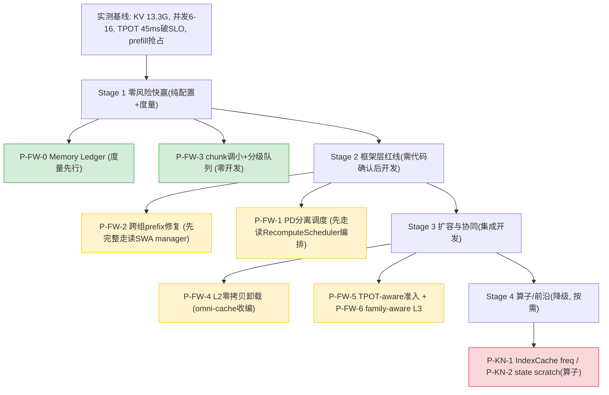

# DeepSeek-V4-Flash KV Cache 多级缓存 + 调度协同：总体方案 v3

> 日期：2026-06-16
> 本版基于两条新原则对 [v2](20260616-005809-deepseek-v4-kvcache多级缓存与调度协同-实测刷新与业界对标-总体方案v2.md) 全面刷新：
> **原则①** 优先做推理框架和引擎层（vllm/vllm-ascend Python 侧），改 Ascend C++ 算子 kernel 的优先级放低。
> **原则②** 所有结论基于代码走读，代码说不清的明确标注"⚠️ 待确认/需实测"，不自信推测。
> 场景：Agentic 长会话 64K→512K、50 轮、TPOT≤30ms 硬约束；双机 A2/910B3×16；bf16
> 数据基线：vllm-ascend `a57a8f0`、vllm `0d29612`、实测 `2026-06-15`

---

## 0. v3 相对 v2 的核心变化

| 变化 | v2 | v3（新原则刷新） |
|------|----|----|
| 优先级排序依据 | ROI | **框架引擎层优先**（算子改动降级） |
| 每个优化点 | 给改动点 | **+ 代码确认状态标注**（已确认/待确认/需算子/需实测） |
| P1-a state 滚动 | 最高 ROI | **降级 P2**（涉及算子 + 收益建立在未证实假设） |
| DCP 扩容 | 关 MTP 可行 | **删除**（两条独立断言实质不可用，代码钉死） |
| 头号红线 | PD 分离 | PD 分离（维持）+ 明确"框架层编排可先做" |
| 诚实度 | 部分推导 | **每个收益数字标来源；未确认的标疑问** |

> **底层逻辑**：v3 不引入新方向，而是把 v2 的优化点**按"是否纯框架引擎层 + 代码确认到什么程度"重排和重新标注**——让方案只把"代码站得住、框架层能落地"的放主线，把"需算子/未证实"的诚实降级。

---

## 1. 问题诊断（实测铁证，代码确认）

| 病根 | 证据（代码/实测） | 确认状态 |
|------|------------------|---------|
| KV 池小 | 实测 `Available KV cache memory: 13.30 GiB`（node0 日志） | ✅ 实测铁证 |
| 显存墙限并发 | 实测 running 6-16 / 目标 32，`P/D capacity 排队 16`（CSV） | ✅ 实测铁证 |
| 准入峰值 ≫ 稳态 | 公式 `cdiv(sw-1+chunk, block)+1`（`kv_cache_interface.py:502`），104K：准入 2.90 vs 稳态 0.68 GiB | ✅ 代码确认 |
| TPOT 破 SLO | 实测 Mean 45.3ms（>30），prefill 活跃时 53ms | ✅ 实测铁证 |
| prefill 抢占 decode | CSV：prefill 跑时 TPOT 顶 77-100ms；脚本注释自证 8192→4096 缓解 | ✅ 实测+注释 |
| 多轮复用失效 | `patch_kv_cache_coordinator.py:311-316` 注释：C128 不截断 + SWA hit_length 可能为 0 | ⚠️ 注释陈述，机制待完整代码确认（见 §3 P-FW-2） |

---

## 2. 优化点全表（按新原则重排：框架引擎层优先 + 代码确认状态）

> 标注图例：🟢 纯框架引擎层（优先）｜🔴 需算子改动（降级）｜✅ 代码已确认｜⚠️ 待确认/需实测

| ID | 优化点 | 层 | 代码确认状态 | 优先级 | 收益（标来源） |
|----|--------|----|------------|--------|--------------|
| **P-FW-0** | KV Memory Ledger 度量上线 | 🟢 引擎层（observability + worker） | ✅ 插桩点已定位（`patch_kv_cache_utils.py:232`/`model_runner_v1.py:3929`/`worker.py:379`） | **P0** | 度量先行，一切验证前提 |
| **P-FW-1** | PD 分离调度（prefill/decode 隔离） | 🟢 引擎层（scheduler + connector） | ⚠️ 组件齐全（RecomputeScheduler/Mooncake connector），**编排逻辑待设计确认** | **P0 红线** | 消除 prefill 抢占（实测 +53ms）；业界一致方案（Dynamo/CloudMatrix384） |
| **P-FW-2** | 跨组 prefix 命中修复 | 🟢 框架层（`patch_kv_cache_coordinator.py`，**已确认纯 Python 无算子**） | ⚠️ 病因部分确认（C128 不截断=代码事实；**SWA 归 0 是注释陈述，机制待完整代码确认**）；修复方案待设计 | **P0 红线** | 解锁 L3 + 50 轮复用（业界 HiCache TTFT -56~84%） |
| **P-FW-3** | chunk 分级队列（调小 chunk 降准入） | 🟢 引擎层（配置 + priority policy） | ✅ 代码支持（`max_num_batched_tokens` 即容量变量）；实测已用 8192→4096 | **P0** | 104K state 准入再降 ~50%（公式可推导）；零开发 |
| **P-FW-4** | L2 host 零拷贝卸载（omni-cache 收编） | 🟢 引擎层（connector + Backend 抽象） | ⚠️ 骨架存在（MultiConnector/AscendStore.Backend）；**ZeroCopyHostBackend 收编需开发，集成细节待确认** | **P1（唯一无副作用扩容主力）** | 稳态 KV 卸 host，并发逼近 host 容量 |
| **P-FW-5** | TPOT-aware/SLA 准入调度闭环 | 🟢 引擎层（scheduler 准入门） | ⚠️ 思路对标 Dynamo Planner；**TPOT 预测模型需实测系数（MoE 通信未单列）** | **P1** | 保 SLO 上限 |
| **P-FW-6** | family-aware L3 增量 + KV-aware routing | 🟢 引擎层（pool_scheduler + connector） | ⚠️ 改动点定位（`pool_scheduler.py` granularity）；**一致性逻辑待设计** | **P1** | 突破 16K 粒度；跨实例复用 |
| **P-KN-1** | IndexCache freq 复用 | 🟡 框架+算子边界 | ⚠️ `use_index_cache` 基础存在；**质量影响需实测** | **P2** | 推 1M/超高并发 TPOT 天花板 |
| **P-KN-2** | Compressor state scratch（原 P1-a 滚动复用） | 🔴 需算子（`csrc/compressor`） | ⚠️ **CACHE_MODE 当前都写 state；收益建立在未证实假设**（[四维度分析](20260616-020032-deepseek-v4-state滚动复用-四维度方案设计-方案.md)） | **P2（算子，降级）** | 准入 -55%（若算子可行） |
| ~~DCP 扩容~~ | ~~KV 摊多卡~~ | — | ❌ **两条独立断言实质不可用**（[终版](20260616-014206-deepseek-v4-dcp两条独立限制-代码完整确认终版-分析.md)） | **删除** | — |

---

## 3. 框架引擎层主线（v3 重点，逐项标确认状态）

### 3.1 P-FW-0：KV Memory Ledger（P0，度量先行）

- **代码确认状态**：✅ 插桩点已定位（planner/tensor/graph 三处，行号见 [Phase A 计划](20260615-210348-deepseek-v4-kvcache-phaseA-实施计划-方案.md)）。
- **为什么先做**：实测只有 bench 端到端指标，缺 KV 池/各 group 准入峰值/碎片的在线度量，**任何优化的收益都无法精确归因**（原则②要求可验证）。
- **纯引擎层**：新增 observability 模块 + worker/planner 插桩，无算子。

### 3.2 P-FW-1：PD 分离调度（P0 红线）

- **代码确认状态**：⚠️ 组件齐全但编排待确认。
  - ✅ 已有：`RecomputeScheduler`（PD 分离调度器）、Mooncake hybrid connector、omni-cache（前几轮已读）。
  - ⚠️ **待确认**：vllm-ascend 现有 PD 分离在 DeepSeek-V4 hybrid（6 组 KV）下的编排是否完整、KV-aware 路由如何接——**未做完整代码走读，不下"直接可用"的结论**。
- **依据**：实测 prefill 抢占 +53ms（CSV 铁证）+ 业界一致（Dynamo/SARATHI/华为 CloudMatrix384 全用 PD 分离）。
- **下一步**：需对 `RecomputeScheduler` + Mooncake hybrid connector 做四维度代码确认（同 DCP/P1-a 严谨度）。

### 3.3 P-FW-2：跨组 prefix 命中修复（P0 红线）

- **代码确认状态**：⚠️ 部分确认，**不夸大**。
  - ✅ 已确认：这段逻辑（`patch_kv_cache_coordinator.py:310-322`）**纯 Python 无算子**（grep `torch.ops/_C_ascend` 为空）；C128 组确实不截断（`:317` 只取 `attention_groups[0]`，代码事实）。
  - ⚠️ **待完整确认**：注释（`:315-316`）说"SWA hit_length 为 0 → decode 拿不到 prefix hit"——这是**开发者注释的陈述**，我**尚未读完 SWA manager `find_longest_cache_hit`（`single_type_kv_cache_manager.py:601+`）的完整返回逻辑**，不能断言"必然归 0"的机制。**修复方案（两组都截断 + SWA 不拉低总长度）能否真正修复，更未经代码验证。**
- **下一步**：完整走读 SWA manager 的 find_longest_cache_hit + 不动点迭代如何取 min，才能下"病因机制"和"修复可行性"的结论。

### 3.4 P-FW-3：chunk 分级队列（P0，零开发）

- **代码确认状态**：✅ 完全确认。
  - `max_num_batched_tokens` 进准入公式 `cdiv(sw-1+chunk, block)+1`（`kv_cache_interface.py:502`，代码确认）。
  - 实测脚本已用 8192→4096（注释自证缓解抢占）。
- **收益（公式可推导）**：chunk 4096→2048，104K 的 C4 state 准入 `cdiv(7+4096,8)+1≈514 → cdiv(7+2048,8)+1≈258`（-50%）。
- **纯配置 + priority policy 分流**，零开发零风险——**v3 第一个该落地的**。

### 3.5 P-FW-4：L2 host 零拷贝卸载（P1，扩容主力）

- **代码确认状态**：⚠️ 骨架确认，集成待开发。
  - ✅ 已读：`AscendMultiConnector`（多 connector 并存）、`AscendStore.Backend` 抽象（put/get/exists）、omni-cache 零拷贝（`aclrtHostRegister MAPPED`）。
  - ⚠️ **待确认**：把 omni-cache 零拷贝实现成 `ZeroCopyHostBackend` 的集成细节、与 DeepSeek-V4 六组 KV 的对接——**未做集成层代码走读**。
- **为什么是扩容主力**：DCP 实质不可用后，L2 卸载是**唯一不依赖 DCP、不牺牲 prefix caching 的扩容路径**。

---

## 4. 收益预估（v3，每项标来源与确认状态）

| 优化 | 收益 | 来源/确认状态 |
|------|------|--------------|
| P-FW-3 chunk 调小 | 104K state 准入 -50% | ✅ 公式可推导（`kv_cache_interface.py:502`） |
| P-FW-1 PD 分离 | 消除 prefill 抢占 +53ms | ✅ 实测铁证（消除来源）；⚠️ 消除后 TPOT 净值需实测（MoE 通信未单列） |
| P-FW-2 跨组修复 | 50 轮 TTFT 大降 | ⚠️ 病因部分确认；收益参照业界 HiCache（-56~84%），**本路径修复可行性未验证** |
| P-FW-4 L2 卸载 | 并发逼近 host 容量 | ⚠️ 机理成立；**host 带宽实测 + 集成可行性待确认** |
| P-KN-2 state scratch | 准入 -55% | ⚠️ **建立在未证实的算子可行性假设**，不采信为承诺值 |

> **诚实声明（原则②）**：上表只有 P-FW-3 是"代码可推导"的确定收益。其余均标注了"需实测/待确认/未证实假设"——**v3 不给一个"优化后吞吐 X 倍"的总数字**，因为多数环节的净收益依赖未完成的代码确认或实测。**这是相对 v2"2.3×"的诚实回退：v2 的总收益数字建立在部分未确认环节上，v3 拆解为逐项可追溯的状态。**

---

## 5. 实施路线（v3，框架引擎层优先）

| Stage | 内容 | 前置（按原则②） | 风险 |
|-------|------|----------------|------|
| **1 快赢** | P-FW-0 Ledger + P-FW-3 chunk 调小 | 无（代码已确认） | 极低 |
| **2 红线** | P-FW-2 跨组修复 + P-FW-1 PD 分离 | **先完整走读 SWA manager / RecomputeScheduler 编排** 再开发 | 中 |
| **3 扩容** | P-FW-4 L2 卸载 + P-FW-5/6 调度 L3 | 集成层代码走读 | 中高 |
| **4 算子** | P-KN-1/2（降级） | 算子可行性确认 | 高 |

---

## 6. 待确认清单（按原则②，明确列出"还没站住"的点）

> 这些是 v3 **尚未用代码钉死、不能当结论**的点，列出来作为后续逐项确认的 backlog：

1. **P-FW-2 病因机制**：SWA manager `find_longest_cache_hit` 是否必然把 hit_length 归 0（注释陈述，未读完整逻辑）。
2. **P-FW-2 修复可行性**：两组截断 + SWA 不拉低，能否真正修复且不破坏正确性。
3. **P-FW-1 编排完整性**：RecomputeScheduler + Mooncake hybrid connector 在 DeepSeek-V4 六组 KV 下的 PD 分离是否完整可用。
4. **P-FW-4 集成**：omni-cache 零拷贝收编为 ZeroCopyHostBackend 的可行性、与六组 KV 对接。
5. **P-FW-5 TPOT 模型**：MoE/EP all-to-all 通信占 TPOT 比例（实测脚本未拆算子级）。
6. **P-KN-2 算子**：CYCLE 模式是否已环形复用 state（决定 P1-a 走改 metadata 还是改 kernel）。

> **owner 声明**：以上每一条，在做出"可落地/收益 X"的结论前，都必须先完成对应代码走读或实测——不重复 DCP/P1-a 把推测当确认的错误。

---

## 7. 一页纸（v3 评审结论）

| 维度 | 结论 |
|------|------|
| 优先级原则 | **框架引擎层优先**（算子降 P2）；只把代码站得住的放主线 |
| 立即可落地（代码已确认） | **P-FW-0 Ledger + P-FW-3 chunk 调小**（零/低开发） |
| 红线（需先走读再开发） | P-FW-2 跨组修复、P-FW-1 PD 分离 |
| 扩容主力 | **P-FW-4 L2 卸载**（DCP 实质不可用后的唯一无副作用路径） |
| 已排除 | DCP（两条断言）、P-KN-2 state scratch 降 P2（算子+未证实） |
| 收益口径 | **只有 P-FW-3 是代码可推导确定收益**；其余标"需实测/待确认"，不给总倍数 |
| 待确认 backlog | 6 项（§6），逐项代码走读后才下结论 |
| 相对 v2 | 不改方向，按新原则重排+标注确认状态+诚实回退收益数字 |
