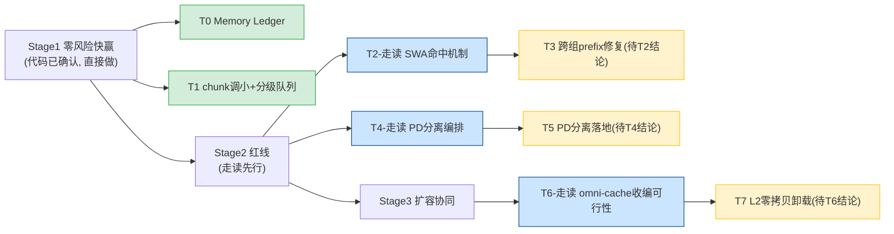

# DeepSeek-V4-Flash KV Cache 实施计划 v3：框架引擎层优先 · 走读先行

> 日期：2026-06-16
> 对应方案：[总体方案 v3](20260616-021015-deepseek-v4-kvcache总体方案v3-框架引擎层优先与代码确认状态刷新.md)
> 替代：旧 [Phase A 计划](20260615-210348-deepseek-v4-kvcache-phaseA-实施计划-方案.md)（含已删除的 DCP 思路、旧编号，本版按新原则重写）
> 两条新原则贯穿全程：
> **①** 框架引擎层（vllm/vllm-ascend Python 侧）优先，算子改动降 P2。
> **②** 代码说不清的不开发——**红线任务前先插入"代码走读确认"任务**，走读结论决定是否/如何开发。

---

## 0. 计划结构（与旧版的关键差异）

> 旧 Phase A 直接给"改哪个文件"。v3 新增一类前置任务：**T-走读**——对 v3 §6 backlog 里"未钉死"的优化点，先做完整代码走读，**走读结论才决定开发任务的形态**。这是原则②的落地：不把推测当可开发结论。



---

## Stage 1：零风险快赢（代码已确认，直接开发）

### T0：KV Memory Ledger 度量上线（P-FW-0）

**确认状态**：✅ 插桩点已 grep 定位。
**层**：🟢 引擎层（observability + worker/planner），无算子。

**改动文件（行号已实测）：**
- 新增 `vllm-ascend/vllm_ascend/observability/kv_cache_memory.py`（`KVCacheMemoryLedger` dataclass + feature flag `VLLM_ASCEND_KV_CACHE_DIAGNOSTICS`）
- 插桩 `patch_kv_cache_utils.py:232`（planner：num_blocks/planner_slab）
- 插桩 `worker/model_runner_v1.py:3929`（tensor storage 去重 + 2MiB alignment）
- 插桩 `worker/worker.py:379`（graph actual，DeepSeek-V4 即使 estimate=0 也记）

**验收（对账资料 182107 权威值）：**
```
planner_slab_bytes ≈ 3,397,376（MTP 1 层）
单 block materialized ≈ 3,364,096
实测 13.30 GiB 池 → num_blocks 应 ≈ 4203（与实测 1,578,497 tokens 自洽）
```
对应实验：[监控验证方案 172505](20260614-172505-vllm-vllm-ascend-kvcache显存效率-监控采集与实验验证方案-分析.md) Phase 0-1。

---

### T1：chunk 调小 + 分级队列（P-FW-3）

**确认状态**：✅ 完全确认（`max_num_batched_tokens` 进准入公式 `kv_cache_interface.py:502`）。
**层**：🟢 引擎层（配置 + priority policy），零开发。

**改动：**
- 部署 recipe：长会话队列 `max-num-batched-tokens=2048`（实测已用 4096）；离线吞吐队列 8192。
- 请求按场景打标签 → 映射 `SchedulingPolicy.PRIORITY`（`request_queue.py:13`，复用现有）。

**验收（公式可推导 + 实测）：**
```
chunk 4096→2048：104K 的 C4 state 准入 cdiv(7+4096,8)+1≈514 → cdiv(7+2048,8)+1≈258（-50%）
对应 172505 Phase 2：观察 P/D capacity 排队是否下降、并发是否上升
```

---

## Stage 2：框架层红线（走读先行，结论决定开发）

### T2-走读：SWA 命中机制完整确认（P-FW-2 前置）

> **原则②落地**：v3 §6 backlog #1/#2——"SWA hit_length 归 0"是注释陈述，机制和修复可行性未钉死。**先走读，不直接开发。**

**走读目标（必须读到代码下结论）：**
1. `vllm/v1/core/single_type_kv_cache_manager.py:601+` `SlidingWindowManager.find_longest_cache_hit` 完整返回逻辑——确认 DeepSeek-V4 场景是否**必然**返回 0。
2. `patch_kv_cache_coordinator.py:258-308` 不动点迭代——确认 SWA 的 0 如何把 `curr_hit_length` 拉到 0（取 min 机制）。
3. C128 不截断（`:317` 只取 `attention_groups[0]`）的实际影响。

**产出**：走读结论文档，明确：①病因是否如注释所说 ②修复方案（两组截断 + SWA 不拉低）是否可行且不破坏正确性。**T3 的形态由此决定。**

### T3：跨组 prefix 命中修复（P-FW-2，待 T2 结论）

**确认状态**：⚠️ 纯 Python 已确认（无算子）；**具体改动待 T2 走读结论**。
**层**：🟢 框架层（`patch_kv_cache_coordinator.py`）。
**改动方向（待 T2 验证后细化）**：C4/C128 两组都截断 + SWA 只加载边界尾部 + 各组共享一致 computed_token 边界。
**验收（正确性优先）**：输出 diff 与基线一致（172505 §11.2）；`compute_amplification` 趋近 1（Phase 3）。

---

### T4-走读：PD 分离编排完整性确认（P-FW-1 前置）

> **原则②落地**：v3 §6 backlog #3——组件齐全但 DeepSeek-V4 六组 KV 下的编排完整性未走读。**先走读。**

**走读目标：**
1. `vllm-ascend/vllm_ascend/core/recompute_scheduler.py` 全文——PD 分离调度在 DeepSeek-V4 hybrid 下的完整性。
2. `distributed/kv_transfer/kv_p2p/mooncake_hybrid_connector.py`——六组 KV 的传输是否完整（前几轮看到 group-aware，但未走读 PD 分离全链路）。
3. prefill/decode 物理隔离的部署形态（对标实测单实例混跑 → PD 分离）。

**产出**：PD 分离在 DeepSeek-V4 上的可用性结论 + 缺口清单。**T5 形态由此决定。**

### T5：PD 分离落地（P-FW-1，待 T4 结论）

**确认状态**：⚠️ 待 T4。
**依据**：实测 prefill 抢占 +53ms（CSV 铁证）+ 业界一致（Dynamo/CloudMatrix384）。
**验收**：TPOT 不再有 prefill 活跃时的 77-100ms 尖峰（CSV 对比）。

---

## Stage 3：扩容与协同（集成开发，走读先行）

### T6-走读：omni-cache 收编可行性（P-FW-4 前置）

> **原则②**：v3 §6 backlog #4——ZeroCopyHostBackend 收编集成细节未走读。

**走读目标：**
1. `AscendStore.Backend` 抽象接口（put/get/exists/register_buffer）能否承载 omni-cache 的零拷贝语义。
2. omni-cache `aclrtHostRegister MAPPED` 与 vllm-ascend KV tensor 的对接点。
3. 六组异构 KV（C4/C128/SWA/state）的 family-aware 卸载粒度。

### T7：L2 host 零拷贝卸载（P-FW-4，待 T6 结论）

**确认状态**：⚠️ 待 T6。
**为什么是扩容主力**：DCP 实质不可用后（两条断言），L2 卸载是唯一不依赖 DCP、不牺牲 prefix caching 的扩容路径。

---

## 验收门（整体，172505 §11.2）

```
1. 输出正确性无回退（T3 diff 测试）
2. T0 Ledger 与资料 182107 权威值对账一致
3. T1 后 P/D capacity 排队下降、并发上升（172505 Phase 2）
4. T5 后 TPOT prefill 尖峰消除（CSV 对比）
5. 无新增 OOM/preemption/长期 HBM 增长
6. 三次重复 run 稳定
主指标：capacity_gain / throughput_gain / hbm_saving（172505 §11.2）
```

---

## 排期与依赖（诚实标注前置）

| 任务 | 类型 | 前置 | 状态 |
|------|------|------|------|
| T0 Memory Ledger | 开发 | 无 | ✅ 可直接开始 |
| T1 chunk 分级 | 配置 | 无 | ✅ 可直接开始 |
| T2 SWA 走读 | 走读 | 无 | ✅ 可直接开始 |
| T3 跨组修复 | 开发 | **T2 结论** | ⏸ 待走读 |
| T4 PD 编排走读 | 走读 | 无 | ✅ 可直接开始 |
| T5 PD 分离 | 开发 | **T4 结论** | ⏸ 待走读 |
| T6 omni-cache 走读 | 走读 | 无 | ✅ 可直接开始 |
| T7 L2 卸载 | 开发 | **T6 结论** | ⏸ 待走读 |

> **owner 声明（原则②）**：T3/T5/T7 标 ⏸——它们的开发形态依赖对应走读结论，**不在走读完成前给"改 X 行就能修"的承诺**。这是相对旧 Phase A 计划的纪律性回退：旧计划直接给 T6 跨组修复的改法，而病因机制当时未完整走读。

---

## 一页纸

| 维度 | 结论 |
|------|------|
| 原则 | 框架引擎层优先 + 走读先行（代码说不清不开发） |
| 可直接开始 | T0 Ledger + T1 chunk 分级（代码已确认）+ T2/T4/T6 三个走读 |
| 待走读后开发 | T3 跨组修复、T5 PD 分离、T7 L2 卸载 |
| 已排除 | DCP（两条断言）、算子类降 P2 |
| 相对旧计划 | 新增"走读先行"任务类；不给未确认点的开发承诺 |
