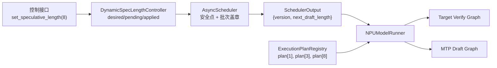

# vLLM / vLLM Ascend 动态投机长度第一阶段方案

> **修订状态：已由
> `20260623-120055-vllm-vllm-ascend-dynamic-speculative-length-step-policy-phase1-方案.md`
> 替代。** 新方案取消请求 cohort 和“等待全体请求安全点”的设计，采用多并发区间映射、
> step 级统一长度以及入口 draft/出口 draft 的流水语义。本文保留为前序分析记录。

> 生成时间：2026-06-23 01:00:10 CST  
> 分析基线：vLLM `0d2961229`；vllm-ascend `8afdf356`  
> 目标模型与硬件：DeepSeek V4 Flash + MTP；Ascend 910B3 / 910C  
> 方案状态：设计确认稿，尚未进入代码实现

## 1. 结论

第一阶段推荐采用“最大规格静态准备 + 批次计划动态选择”的实现：

1. 服务启动时声明有限候选投机长度，例如 `{1, 3, 8}`。
2. KV lookahead、输入张量、slot mapping、采样输出等容量按最大候选长度 `8` 一次性分配。
3. 为每个候选长度预建并预热 target verification 与 MTP draft 执行计划，包括 FULL ACL Graph。
4. 运行时不修改 `SpeculativeConfig`，而是由调度器为每个 `SchedulerOutput` 附加不可变的批次计划戳。
5. 当前批的 verification 长度始终由请求已经持有的实际 draft token 数决定；策略只决定本批结束后生成多少个 draft token。
6. 动态切换不增加 NPU 标量读取、CPU-NPU 同步、逐批阻塞 RPC、动态大内存分配或在线图捕获。

该方案可以保持异步调度、FULL graph、MC2、FlashComm、prefix cache 和已有 speculative acceptance 路径。稳态时，动态模式 MTP3 应与固定 MTP3 使用相同 shape、图键和通信路径；MTP8 同理。

## 2. 第一阶段范围

### 2.1 纳入范围

- vLLM V1 Engine。
- vllm-ascend V1 `NPUModelRunner`。
- DeepSeek V4 Flash 的 MTP 投机方式。
- Ascend 910B3 / 910C。
- 批次粒度动态投机长度。
- 无需重启服务的热切换。
- async scheduling。
- `FULL_DECODE_ONLY` 图模式。
- 候选长度启动期预声明。
- greedy 模式逐 token 精度一致。
- TP、EP 基本场景。
- DP 控制面一致性设计。
- 更新状态、指标、异常拒绝和长稳测试。

### 2.2 暂不作为首个生产承诺

- 任意整数投机长度的在线图捕获。
- 请求粒度投机长度。
- 运行中扩大最大投机长度。
- 第二阶段自动寻优算法。
- block verify 与 entropy verify。
- 随机采样在不同投机长度之间 bitwise RNG 序列一致。
- 未经专项验证的 PCP、DCP、PD 分离组合。

上述能力可进入测试矩阵或后续阶段，但不应阻塞第一阶段主线。

## 3. 需求语义

### 3.1 批次粒度

每个调度输出只有一个 `next_draft_length`。本批中所有参与 MTP draft 的请求使用相同的名义投机上限。

名义投机上限不等于每个请求必然产生的实际 draft 数。以下情况允许实际长度小于名义长度：

- 到达 EOS。
- 接近 `max_model_len`。
- structured output 语法裁剪。
- 请求本批只获得部分 token budget。
- proposer 自身跳过投机。

这些请求仍属于同一个批次计划，verification 使用各请求的实际 draft 列表。

### 3.2 切换语义

选择已确认的方案 A：

- 动态长度是调度批次属性，不是请求属性。
- 不允许同一个 target verification batch 同时包含名义 MTP3 和名义 MTP8 两个 cohort。
- 已运行请求和新请求在安全点后共同进入新长度。
- 如果无法形成安全点，更新保持 `PENDING`，推理继续使用旧长度。

### 3.3 3 → 8 的正确时序

| 调度批 | verification | 本批结束后 draft | 状态 |
|---|---:|---:|---|
| N | 实际上限 3 | 3 | `APPLIED(3, v1)` |
| N+1 | 实际上限 3 | 8 | `TRANSITION(3→8, v2)` |
| N+2 | 实际上限 8 | 8 | `APPLIED(8, v2)` |

过渡批 `verify3 / draft8` 是必要的。收到控制请求后立即把当前 verification 当成 8，会读取不存在的 draft token；先额外生成 8 个 draft 再验证，则会把切换成本提前注入旧批次。

## 4. 不可破坏的设计不变量

### 4.1 正确性不变量

1. `verify_length(req)` 等于 `len(scheduled_spec_decode_tokens[req])`，不能从当前策略变量推断。
2. `next_draft_length` 只控制本轮 target 完成后的 proposer 步数。
3. rejection sampling、bonus token、accepted-token correction 的算法和执行顺序不改变。
4. 旧的、已经发出的 `SchedulerOutput` 必须按它携带的原计划执行，不能读取新的全局可变长度。
5. placeholder 只表示尚未回填的 draft token；进入 embedding 前继续执行现有净化逻辑。

### 4.2 性能不变量

1. 稳态热路径不调用 `.item()` 或等价的 NPU 到 CPU 标量读取。
2. 稳态热路径不新增 scheduler 到 worker 的同步 RPC。
3. 稳态热路径不增加 `torch.npu.synchronize()`、stream wait 或 host barrier。
4. 运行时不捕获新图。
5. 运行时不重新分配 KV cache 或大尺寸 NPU tensor。
6. 相同候选长度必须命中与固定部署等价的 target 和 draft 图路径。
7. 原有 async accepted-token GPU/NPU 侧校正保持原样。

### 4.3 可靠性不变量

1. 更新版本单调递增且幂等。
2. 非候选长度、未预热图、版本不一致或 DP 准备失败时拒绝更新。
3. 更新失败不能中止正常推理，服务继续使用旧 `APPLIED` 计划。
4. 数据面无法证明计划一致时显式 fail-fast，不能静默产生错误 token。

## 5. 当前代码基础与差距

### 5.1 已具备的基础

- `vllm/v1/core/sched/scheduler.py` 已按 `scheduled_spec_decode_tokens` 中的实际列表长度调度 verification。
- `vllm/v1/spec_decode/metadata.py` 从实际 draft 数构造 speculative metadata。
- `vllm/v1/structured_output/utils.py` 已按每个请求的实际 speculative token 数推进语法状态。
- `vllm/v1/worker/gpu_input_batch.py` 已记录每请求上一轮实际 draft 长度。
- vllm-ascend 的 async speculative 路径已有 `valid_sampled_token_count_gpu` 与 `prev_num_draft_tokens`，可在设备侧完成 accepted-token 校正。
- 现有 buffer 结构大多可按最大长度分配，再使用有效前缀。

### 5.2 必须补齐的差距

1. `AsyncScheduler` 当前只创建一个 `[-1] * self.num_spec_tokens` placeholder 列表。
2. `CudagraphDispatcher` 当前只有一个 `uniform_decode_query_len`。
3. `BatchDescriptor` 没有显式记录 uniform query length。
4. vllm-ascend `_determine_batch_execution_and_padding` 以固定 `self.uniform_decode_query_len` 判断 FULL graph。
5. vllm-ascend MTP proposer 多处循环和 metadata 构造使用固定 `self.num_speculative_tokens`。
6. async draft tensor 使用 `prev_index * self.num_spec_tokens` 作为固定行步长，因此物理宽度不能随批次改变。
7. 部分 CP 路径以固定 `decode_threshold` 构造 `actual_seq_lengths_q`，较短动态长度可能产生错误元数据。
8. 多 DP/EP 参与者若在不同时间采用不同 proposer step 数，可能造成 collective 次数不一致。

## 6. 方案选择

### 6.1 方案一：运行时修改 `num_speculative_tokens`

不采用。

优点是代码表面改动少；缺点是该值同时承担资源上界、tensor stride、图 shape、调度占位符和 proposer 循环次数。热修改会产生陈旧状态、图失配和异步竞态。

### 6.2 方案二：始终按最大长度计算，再屏蔽多余 token

不采用。

它可以减少 shape 变化，但 MTP3 实际执行 MTP8 的 proposer 和通信开销，无法满足“动态 MTP3 与固定 MTP3 性能持平”。

### 6.3 方案三：候选执行计划注册表

采用。

最大长度只负责容量；实际执行长度由预建计划决定。候选数量控制在 3 至 5 个，可在图内存、启动时间和寻优粒度之间取得平衡。

## 7. 总体架构



控制面只改变 scheduler 的 CPU 状态。数据面通过已有 `SchedulerOutput` 通道获得不可变计划戳，因此消息顺序天然与调度输出一致，不需要第二条逐批控制 RPC。

## 8. 配置设计

建议在通用 speculative 配置中增加一个可选的启动期配置对象：

```python
@config
class DynamicSpeculativeLengthConfig:
    candidate_lengths: tuple[int, ...]
    initial_length: int
    strict_graph_mode: bool = True
    apply_timeout_s: float = 30.0
```

约束如下：

- `candidate_lengths` 严格递增、无重复、均大于 0。
- `initial_length` 必须属于候选集合。
- `num_speculative_tokens == max(candidate_lengths)`，继续作为资源容量上界。
- 未配置该对象时，所有现有固定长度逻辑和性能完全不变。
- 对当前 NPU TND/SFA/DSA 路径，`max(candidate_lengths) + 1 <= 16`；因此 MTP8 合法。

首期建议候选集合为 `{1, 3, 8}`，而不是连续的 1 至 8，以避免图数量、启动时间和图内存线性放大。

## 9. 运行时数据结构

### 9.1 批次计划戳

在 `SchedulerOutput` 增加可选字段：

```python
@dataclass(frozen=True)
class SpecDecodeBatchPlan:
    version: int
    next_draft_length: int


spec_decode_batch_plan: SpecDecodeBatchPlan | None = None
```

字段仅为 CPU 元数据。`version` 用于幂等、观测和陈旧输出检查；`next_draft_length` 直接选择 proposer 计划。

当前 verification 的实际长度仍从 `scheduled_spec_decode_tokens` 读取。若本批为 uniform decode，可由每请求实际 scheduled token 数确定 target graph 的 `uniform_query_len`。

### 9.2 执行计划

```python
@dataclass(frozen=True)
class SpecExecutionPlan:
    spec_length: int
    uniform_query_len: int
    target_graph_keys: frozenset[BatchDescriptor]
    draft_graph_keys: frozenset[BatchDescriptor]
```

运行期注册表为只读：

```python
plans: dict[int, SpecExecutionPlan]
```

计划不持有每批动态 tensor，只持有图键、长度常量和已分配 buffer 的视图规则。

### 9.3 控制状态

```text
DISABLED
APPLIED(length, version)
PENDING(old_length, new_length, version)
TRANSITION(old_length, new_length, version)
FAILED(old_length, requested_length, version, reason)
```

`FAILED` 是一次更新结果，不改变当前 `APPLIED` 计划。

## 10. 调度器设计

### 10.1 LengthController

`DynamicSpecLengthController` 由 EngineCore/Scheduler 持有，职责仅包括：

- 校验目标长度属于候选集合。
- 创建单调版本号。
- 保存 desired、pending、transition、applied 状态。
- 判断安全点。
- 生成本批 `SpecDecodeBatchPlan`。
- 输出状态与指标。

它不读取设备 tensor，也不直接调用 model runner。

### 10.2 批次安全点

更新从 `PENDING` 进入 `TRANSITION` 必须同时满足：

1. 当前没有更早版本的 scheduler output 等待提交。
2. 所有仍可能携带旧名义长度 draft 的 RUNNING decode 请求，本轮均可被纳入同一个过渡调度波次。
3. 本轮没有会把请求留在旧 speculative cohort 的 preemption、PP eligibility 或 token-budget 排除。
4. structured output 的异步 placeholder 状态可由现有逻辑完整回填。
5. 对需要 collective 一致性的并行组，所有参与者已对该版本完成 prepare。

不满足时继续使用旧长度。超时只使控制请求返回 `pending/timeout`，不应影响推理服务。

这一约束优先保证单批一致和长稳可靠。若后续压测证明高负载下安全点过少，第二版可增加“按 plan version 分 cohort 调度”，但不在首期引入该复杂度。

### 10.3 AsyncScheduler placeholder

启动时创建候选 placeholder bank：

```python
{
    1: [-1],
    3: [-1, -1, -1],
    8: [-1, -1, -1, -1, -1, -1, -1, -1],
}
```

`_update_after_schedule()` 按 `next_draft_length` 选择只读模板。不得在每批重新创建 list。

`request.num_output_placeholders` 仍按当前批实际 scheduled speculative token 数更新；下一轮 draft 的实际回填继续走 `update_draft_token_ids_in_output()`。

## 11. 图模式设计

### 11.1 通用图键

建议扩展 `BatchDescriptor`：

```python
uniform_query_len: int | None = None
```

原因是 `num_tokens`、`num_reqs` 和 `uniform` 不能清晰表达图对应的 speculative query 规格。显式长度也能避免后续 backend 根据可变全局字段解释同一个图键。

### 11.2 CudagraphDispatcher

将单值：

```python
self.uniform_decode_query_len
```

扩展为启动期候选集合，并让以下接口接收明确的 `uniform_query_len`：

- `_create_padded_batch_descriptor`
- `initialize_cudagraph_keys`
- `dispatch`
- capture descriptor 生成

固定长度未启用动态功能时，候选集合只有现有的 `1 + num_speculative_tokens`，行为保持不变。

### 11.3 target 与 draft 图

对于候选 `{1, 3, 8}`：

- target uniform query length 分别为 `{2, 4, 9}`。
- MTP proposer 分别预建 1、3、8 step 执行计划。
- 过渡批 `verify3/draft8` 使用 target plan 3 与 draft plan 8，不需要重新捕获组合图。

所有 dummy run、padding、attention metadata、graph replay key 都必须来自本批选定计划，不能读取运行期已变化的全局长度。

### 11.4 缺图处理

`strict_graph_mode=True` 时：

- 任一候选长度的 uniform steady-state 图启动预热失败，则服务启动失败。
- 运行期找不到应当存在的候选 uniform 图，则拒绝切换并保持旧计划。
- 禁止静默降级 eager，否则无法保证与固定长度策略性能持平。

EOS、structured output、部分 token budget 等导致的非 uniform 批次，继续采用相同固定长度基线原本使用的 PIECEWISE/eager 路径；这不属于候选图缺失。

## 12. NPUModelRunner 设计

### 12.1 最大容量与有效前缀

以下对象保持按最大候选长度分配：

- `_draft_token_ids`。
- sampler 输出 buffer。
- `prev_num_draft_tokens`。
- slot mapping。
- position、query_start_loc 等辅助 buffer。
- KV lookahead。

async draft tensor 的行步长继续使用最大长度：

```python
start = prev_index * max_spec_length
```

只改变每行的有效前缀长度，不能随批次缩短物理 row stride。

### 12.2 执行顺序

每批执行顺序：

1. 从 `scheduled_spec_decode_tokens` 构造当前 target verification 输入。
2. 根据实际 query shape 选择 target graph。
3. 保持现有 rejection sampling 与 accepted-token correction。
4. 从批次计划戳读取 `next_draft_length`。
5. 从只读注册表选择 MTP proposer plan。
6. 运行固定步数的 proposer，并把实际 draft 回填 scheduler output。

步骤 4 是普通 host metadata 读取，不触碰 NPU 状态。

### 12.3 MTP proposer

`vllm_ascend/spec_decode/llm_base_proposer.py` 中所有固定长度循环、metadata 切片和 graph wrapper 选择，需改为显式接收 `active_spec_length`。

禁止在 proposer 内部读取一个可热修改的全局 `num_speculative_tokens`。最大长度只用于容量和 stride。

## 13. Attention、CP 与通信兼容

### 13.1 Attention 分类

`decode_threshold` 可以继续保留为最大候选 query length，用于 decode/prefill 上界分类。实际序列长度必须来自本批 `query_start_loc` 或实际 query lens。

### 13.2 CP 风险修复

`vllm_ascend/attention/context_parallel/attention_cp.py` 当前在 MTP 路径存在：

```python
[self.decode_threshold * (i + 1) for i in range(num_decodes)]
```

动态较短长度下该假设不成立。应统一改为从实际 `query_start_loc` 构造 cumulative query lengths。

PCP 工具中存在 `.sum().item()`，首期若 PCP 未通过专项无同步验证，不声明生产支持。

### 13.3 MC2 / FlashComm

- workspace 与 capacity 继续按最大候选长度准备。
- 每批实际 token 数和 graph plan 决定通信 shape。
- 不新增通信初始化。
- 需要验证候选计划不会改变已有 MC2/FlashComm 选择条件。

### 13.4 DP / EP

`set_speculative_length` 通过已有 EngineCore utility 控制通道广播到所有相关 EngineCore。

采用 prepare/commit：

1. 所有参与者校验候选计划和图均已就绪。
2. 控制面创建同一版本。
3. 需要 collective 顺序一致的并行组在安全点提交。
4. 任一参与者失败则所有参与者保持旧版本。

切换时允许一次控制面 quiescent barrier；它不进入稳态逐批热路径。禁止不同 collective 参与者以不同 MTP step 数进入同一执行波次。

## 14. 控制接口

### 14.1 Python / Engine API

建议新增：

```python
async def set_speculative_length(
    self,
    length: int,
    *,
    wait: bool = False,
    timeout: float | None = None,
) -> DynamicSpecLengthStatus:
    ...

async def get_speculative_length_status(
    self,
) -> DynamicSpecLengthStatus:
    ...
```

状态对象：

```python
@dataclass(frozen=True)
class DynamicSpecLengthStatus:
    state: Literal["applied", "pending", "transition", "failed"]
    requested_length: int
    applied_length: int
    version: int
    candidate_lengths: tuple[int, ...]
    reason: str | None = None
```

### 14.2 外部管理接口

第一阶段核心能力以 Python/Engine utility API 为准。OpenAI server 的管理路由应作为薄适配层或独立 admin ASGI 扩展，不把 FastAPI 路由逻辑放入 NPU model runner。

建议接口：

```text
PUT /admin/speculative-length
GET /admin/speculative-length
```

外部接口不在推理热路径。

## 15. 精度保证

### 15.1 算法等价

动态功能不修改 target model logits，也不修改标准 speculative rejection sampling。不同长度只影响一次提出的候选 token 数。

在 greedy/temperature=0 条件下：

- 动态 MTP1 稳态与固定 MTP1 逐 token 一致。
- 动态 MTP3 稳态与固定 MTP3 逐 token 一致。
- 动态 MTP8 稳态与固定 MTP8 逐 token 一致。
- 切换边界输出与非投机 target baseline 一致。

### 15.2 随机采样

标准 rejection sampling 保证目标分布正确，但不同投机长度可能改变随机数消费顺序，因此不天然保证 bitwise 相同。

第一阶段精度验收以 greedy 严格一致为硬门禁；随机采样做分布与回归验证。若业务要求跨长度 bitwise 随机一致，需要额外设计基于输出位置的 counter-based RNG。

### 15.3 非标准 verify

block verify 和 entropy verify 会改变接受策略。第一阶段严格基线关闭这两项，后续单独验证。

## 16. 异常处理与长稳

### 16.1 Fail-closed 策略

| 异常 | 行为 |
|---|---|
| 请求长度不在候选集合 | 拒绝，旧计划继续 |
| 候选图缺失 | 拒绝，旧计划继续 |
| prepare 部分失败 | 全局取消更新 |
| 安全点超时 | 状态保持 pending/timeout，推理继续 |
| 陈旧 SchedulerOutput | 按自身版本戳执行 |
| 未知版本或计划戳损坏 | 当前批 fail-fast，输出明确错误 |
| NPU 执行错误 | 沿用现有 executor failure 处理，不尝试在线重捕图 |

### 16.2 生命周期

- update 请求幂等：重复请求当前 applied 长度直接返回 applied。
- 新请求进入当前 scheduler 计划，不保存独立请求级策略。
- abort、finish 和 preemption 必须清理该请求的旧 placeholder/draft 状态。
- prefix cache 与 KV connector 不保存动态长度；它们只保存 token/KV 事实。
- sleep/wake 后执行计划注册表和图必须仍然有效，或在 wake 阶段统一重建后才恢复服务。

### 16.3 观测指标

至少增加：

- `dynamic_spec_length_applied`。
- `dynamic_spec_length_requested_total{length,result}`。
- `dynamic_spec_length_transition_total{from,to,result}`。
- `dynamic_spec_length_pending_seconds`。
- `spec_graph_dispatch_total{verify_length,draft_length,mode}`。
- `spec_plan_mismatch_total`。

日志仅在控制事件、异常和低频状态变化时输出，不能逐批打印。

## 17. 性能验收

### 17.1 对照原则

必须使用相同模型、硬件、并行配置、请求集、上下文长度、输出长度、接受行为和并发：

- 动态模式当前 applied=3 对比固定 MTP3。
- 动态模式当前 applied=8 对比固定 MTP8。
- 不允许用动态 MTP3 对比固定 MTP8。

### 17.2 稳态门禁

建议首期门限：

- TPOT p50/p90 劣化不超过 1%。
- TPOT p99 劣化不超过 2%。
- throughput 劣化不超过 1%。
- FULL graph hit rate 不下降。
- NPU profiler 中无新增 host wait、device synchronize 或 D2H 标量同步。
- CPU profiler 中无逐批控制 RPC 和显著对象分配热点。

切换过渡批单独统计，不混入稳态等价判断。

### 17.3 图与内存门禁

- 启动时输出各候选 target/draft 图数量和内存占用。
- 切换后不得出现新 capture。
- 10,000 次切换后 NPU/host 内存达到平台，不持续增长。
- 候选 `{1,3,8}` 的启动时间和图内存需形成基线。

## 18. 测试设计

### 18.1 vLLM 通用单元测试

- 动态配置校验。
- controller 状态机与幂等版本。
- `SchedulerOutput` 序列化。
- AsyncScheduler placeholder bank。
- 3→8、8→1 过渡批。
- 无安全点时保持 pending。
- preemption、abort、空批、PP eligibility。
- structured output 实际 draft 缩短。
- multi-query-length graph key 注册与 dispatch。
- 未启用动态功能时固定路径回归。

### 18.2 vllm-ascend 单元测试

- plan registry 构建与缺图拒绝。
- NPU runner 保持最大 stride、使用有效前缀。
- proposer 按 1/3/8 执行准确 step 数。
- transition 使用 target plan 3 + draft plan 8。
- CP metadata 使用实际 query lengths。
- graph wrapper 不发生 key collision。
- placeholder 净化。

### 18.3 端到端精度

- DeepSeek V4 Flash greedy baseline。
- 固定 MTP1/3/8 与动态对应稳态逐 token、logprob 对比。
- `1→3→8→3→1` 连续切换。
- 全接受、全拒绝和混合接受。
- 短上下文、长上下文、接近最大上下文。
- EOS、stop string、structured output。
- prefix cache hit/miss。
- 抢占和请求取消。
- async scheduling 开/关对照。

### 18.4 并行和图模式

- TP、EP。
- DP prepare/commit 与失败回滚。
- FULL_DECODE_ONLY。
- graph hit 统计。
- MC2 / FlashComm。
- PCP/DCP 和 PD 作为专项准入测试。

### 18.5 长稳

- CI 24 小时。
- 发布前 72 小时。
- 至少 10,000 次长度切换。
- 混合并发 1/8/16/32。
- 混合上下文与接受长度。
- 无 crash、hang、错 token、在线捕图、内存持续增长。

## 19. 兼容与解耦

### 19.1 vLLM 通用层

只承担设备无关能力：

- 可选动态配置。
- controller 与状态类型。
- `SchedulerOutput` 计划戳。
- AsyncScheduler 批次安全点。
- 支持多 uniform query length 的通用图键。
- Engine utility API。

这些改动默认关闭，固定 speculative decode 不经过额外分支之外的实质工作。

### 19.2 vllm-ascend 插件层

只承担 NPU 相关能力：

- ACL Graph 计划。
- NPUModelRunner plan 选择。
- MTP proposer active length。
- Ascend attention/CP metadata。
- MC2/FlashComm 验证。

### 19.3 第二阶段策略接口

第一阶段手工调用 controller 设置长度。第二阶段自动寻优模块只需实现：

```python
class SpecLengthPolicy(Protocol):
    def choose_next_length(self, snapshot: BatchRuntimeSnapshot) -> int:
        ...
```

策略输出仍通过同一个 controller 和安全点生效。策略不能直接修改 scheduler、runner 或设备 tensor，从而避免第二阶段重新侵入第一阶段执行链路。

## 20. 预计代码落点

### 20.1 vLLM

- `vllm/config/speculative.py`
- `vllm/forward_context.py`
- `vllm/v1/cudagraph_dispatcher.py`
- `vllm/v1/core/sched/output.py`
- `vllm/v1/core/sched/scheduler.py`
- `vllm/v1/core/sched/async_scheduler.py`
- `vllm/v1/engine/core.py`
- `vllm/v1/engine/core_client.py`
- `vllm/v1/engine/async_llm.py`
- 对应 `tests/v1/core`、`tests/v1/cudagraph`、`tests/v1/e2e/spec_decode`

### 20.2 vllm-ascend

- `vllm_ascend/worker/model_runner_v1.py`
- `vllm_ascend/spec_decode/llm_base_proposer.py`
- `vllm_ascend/compilation/acl_graph.py`
- `vllm_ascend/patch/worker/patch_cudagraph.py`
- `vllm_ascend/attention/context_parallel/attention_cp.py`
- 必要的 attention backend metadata builder
- 对应 `tests/ut/spec_decode`、`tests/ut/compilation`、`tests/e2e/.../spec_decode`

精确修改范围应在实现计划中再次基于调用链确认，避免无关重构。

## 21. 实施顺序

1. vLLM 纯 CPU controller、配置、批次计划戳和调度单测。
2. 通用 multi-query-length graph key 与 dispatcher 单测。
3. vllm-ascend 只读 execution plan registry。
4. NPUModelRunner target graph 动态选择。
5. MTP proposer active draft length。
6. async scheduling 3→8 过渡。
7. CP metadata 修复。
8. Engine utility 与 DP prepare/commit。
9. greedy 精度、图命中和性能验证。
10. 长稳与兼容矩阵。

每一步都应保持未启用动态功能时的固定路径测试通过。

## 22. 风险与处置

| 风险 | 等级 | 处置 |
|---|---|---|
| FULL graph 仍绑定单一 query length | P0 | 图键显式包含 query length，候选全部预捕获 |
| async 陈旧 output 读取新全局状态 | P0 | 计划随 SchedulerOutput 不可变下发 |
| DP/EP proposer collective 次数不同 | P0 | prepare/commit + 并行组安全点 |
| CP 使用最大 decode threshold 伪造实际长度 | P0 | 改用 query_start_loc |
| 动态 MTP3 实际执行最大 MTP8 | P0 | proposer 独立候选执行计划 |
| 切换长期找不到安全点 | P1 | pending 超时不影响推理；后续评估 cohort 调度 |
| 候选图导致启动和内存膨胀 | P1 | 候选控制在 3–5 个，增加启动内存报告 |
| 随机采样输出不 bitwise 相同 | P1 | 明确分布契约；严格业务另做 counter RNG |
| 上游版本升级引发 patch 冲突 | P1 | 通用能力进入 vLLM，小范围 NPU 插件适配 |

## 23. 第一阶段完成定义

同时满足以下条件才算完成：

1. 服务无需重启即可在候选长度之间切换。
2. 同一调度批只有一个名义投机长度。
3. async scheduling 与 FULL_DECODE_ONLY 正常工作。
4. greedy 输出与相同固定长度及 target baseline 一致。
5. 动态稳态与相同固定长度达到性能门禁。
6. profiler 证明没有新增 CPU-NPU 同步阻塞。
7. 缺图、超时和 DP 失败均保持旧计划，服务不中断。
8. 长稳无 crash、hang、错 token、在线捕图和内存泄漏。
9. 固定 speculative decode 默认路径无功能和性能回归。
