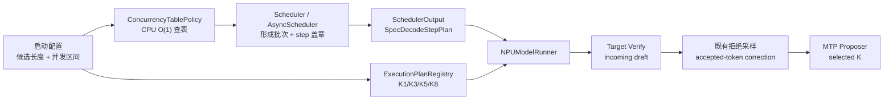

# vLLM / vLLM Ascend 动态投机长度第一阶段修订方案

> 生成时间：2026-06-23 12:00:55 CST  
> 分析基线：vLLM `0d2961229`；vllm-ascend `8afdf356`  
> 目标模型与硬件：DeepSeek V4 Flash + MTP；Ascend 910B3 / 910C  
> 方案状态：需求确认后的权威设计稿，尚未修改源码

## 1. 结论

第一阶段采用：

> **基于多并发区间映射的 step 级统一动态投机长度，使用有限多候选 MTP
> 执行计划，并支持无停服、无流水清空的切换。**

核心决策如下：

1. 投机长度是调度 step 属性，不是请求属性。
2. 同一个 step 的所有 decode 请求采用同一个策略长度。
3. 同一请求可在相邻 step 使用不同长度，不保存请求级长度或 cohort。
4. 启动时配置多组并发范围到 MTP 长度的映射，例如并发 1-4 使用 MTP8、
   5-8 使用 MTP5、9-16 使用 MTP3、17-64 使用 MTP1。
5. scheduler 在每个 step 形成批次后，按实际 decode 请求数做一次纯 CPU 查表，
   产生唯一 `selected_mtp_length`。
6. 当前 target verification 使用上一步已经存在的 draft；本 step proposer
   使用当前策略选择的长度为下一 step 生成 draft。
7. worker 只读取当前 `SchedulerOutput` 携带的不可变 step plan，不读取运行时可变
   的全局长度。
8. KV lookahead、tensor 物理宽度和 workspace 按最大候选长度静态准备；target/draft
   图按候选长度启动期预捕获，运行期只做索引与 replay。
9. 稳态 `dynamic(K)` 必须复用固定 MTP-K 的相同图、算子、拒绝采样、通信与异步
   流水路径，TPOT 在统计误差内持平。

## 2. 需求的精确定义

### 2.1 “同一批、同一 step、同一长度”

对调度 step `t`：

```text
B_t = 本 SchedulerOutput 中实际调度的 decode 请求集合
C_t = |B_t|
K_t = concurrency_policy(C_t)
```

要求：

- `B_t` 中所有请求共享同一个策略长度 `K_t`。
- 不允许同一 step 中部分请求 MTP1、部分请求 MTP3。
- 不因为请求上一 step 的长度不同而拆分 cohort。
- prefill 请求不参与 `C_t` 统计。
- dummy/padding 请求不参与 `C_t` 统计。
- 被队列等待、未进入当前 `SchedulerOutput` 的请求不参与 `C_t` 统计。

这里的统一长度是统一的计划上限。EOS、接近 `max_model_len`、grammar 裁剪或
proposer 无法继续时，单请求实际有效 draft token 数可以小于计划长度；这是固定
MTP 路径已有的正确性行为，不属于请求级动态投机。

### 2.2 多候选长度而非“双候选长度”

候选集合可以包含 2 个以上值，例如：

```text
candidate_lengths = {1, 3, 5, 8}
```

“入口长度/出口长度”只是流水时序中的两个字段，不表示系统只能支持两个候选值：

```text
incoming_draft_length:
    上一个 step 已经生成、当前 step 实际可用于 verification 的长度

selected_mtp_length:
    当前并发策略选择、当前 step proposer 为下一 step 生成的长度
```

### 2.3 切换时序

稳定 MTP3 切换到 MTP8：

| Step | 策略选择 | 当前 verify | 当前 proposer 输出 |
|---|---:|---:|---:|
| t | 3 | 3 | 3 |
| t+1 | 8 | 3 | 8 |
| t+2 | 8 | 8 | 8 |

稳定 MTP8 切换到 MTP3：

| Step | 策略选择 | 当前 verify | 当前 proposer 输出 |
|---|---:|---:|---:|
| t | 8 | 8 | 8 |
| t+1 | 3 | 最多截断为 3 | 3 |
| t+2 | 3 | 3 | 3 |

升档时不能凭空扩展上一步 draft，因此收益或代价从下一 step 完整体现。降档时可以
在 scheduler 构造 target 输入前统一截断已有 draft，使当前 verify 立即减少 token。

不允许为了强制入口和出口长度相同而：

- 清空投机流水；
- 插入额外 target 或 draft 前向；
- 等待所有活跃请求完成；
- 排空 async batch queue；
- 进行 CPU-NPU 同步。

## 3. 第一阶段策略

### 3.1 配置

```yaml
dynamic_speculative_length:
  enabled: true
  candidate_lengths: [1, 3, 5, 8]
  default_length: 1
  policy:
    type: concurrency_table
    rules:
      - min_concurrency: 1
        max_concurrency: 4
        speculative_length: 8
      - min_concurrency: 5
        max_concurrency: 8
        speculative_length: 5
      - min_concurrency: 9
        max_concurrency: 16
        speculative_length: 3
      - min_concurrency: 17
        max_concurrency: 64
        speculative_length: 1
```

校验规则：

1. 候选长度严格递增、无重复、均大于 0。
2. `num_speculative_tokens == max(candidate_lengths)`，继续表示容量上界。
3. 每条规则的长度必须属于候选集合。
4. 并发范围闭区间、边界明确、不能重叠。
5. 生产配置要求覆盖 `1..max_num_seqs`；若允许缺口，缺口必须显式使用
   `default_length`。
6. `default_length` 必须属于候选集合。
7. 配置加载后不可在数据面原地修改。

### 3.2 O(1) 策略查找

启动时将范围规则编译为只读表：

```python
length_by_concurrency: tuple[int, ...]
```

索引范围为 `0..max_num_seqs`。运行时选择：

```python
selected_length = length_by_concurrency[decode_concurrency]
```

这样热路径没有：

- 逐规则遍历；
- 字典构造；
- 新计划对象分配；
- 锁；
- RPC；
- NPU 状态读取。

每个候选长度对应的不可变 `SpecDecodeStepPlan` 也在启动时缓存，scheduler 只引用
缓存计划。

### 3.3 第一阶段不做的策略能力

- 不根据接受率、上下文长度或 TPOT 在线寻优。
- 不在首期加入迟滞、连续命中次数或机器学习策略。
- 不让 runner 自主决定长度。
- 不按请求设置长度。

接受率、上下文和实时性能反馈属于第二阶段。第一阶段保留统一策略接口，但生产默认
只实现确定性的 `ConcurrencyTablePolicy`。

## 4. 总体架构



组件边界：

- vLLM 通用层负责配置、策略、step plan、scheduler 盖章及通用图键。
- vllm-ascend 负责候选 NPU 执行计划、ACL Graph、active proposer 长度和 NPU
  attention metadata。
- 策略不直接调用 runner。
- runner 不读取 scheduler 的全局策略状态。
- 固定长度未启用动态功能时，不创建策略对象，不改变现有数据路径。

## 5. Step Plan

建议在 `SchedulerOutput` 增加：

```python
class SpecDecodeStepPlan(msgspec.Struct, frozen=True):
    policy_version: int
    selected_mtp_length: int
    decode_concurrency: int
```

`incoming_draft_length` 不要求重复序列化：

- uniform batch 从 `scheduled_spec_decode_tokens` 的实际长度推导；
- 非 uniform batch 按现有逐请求 draft 长度处理；
- 日志与指标可以记录推导后的 `verify_length`。

不变量：

1. 一个 `SchedulerOutput` 最多有一个 `SpecDecodeStepPlan`。
2. `selected_mtp_length` 属于启动候选集合。
3. 所有 model-parallel worker 收到相同 plan。
4. 已进入 async FIFO 的旧 `SchedulerOutput` 保持自己的 plan，不会被后续并发变化
   改写。
5. plan 只含 CPU 小整数，不持有 tensor、event、graph 或可变容器。

## 6. Scheduler 数据流

每个 schedule 调用：

1. 按 vLLM 现有 token budget、preemption、priority、PP eligibility 形成
   `SchedulerOutput`。
2. 统计其中真实 decode 请求数 `C_t`。
3. 从只读 LUT 选择 `K_t`。
4. 如果 `K_t` 小于已有 draft 长度，在输出中统一截断到 `K_t`；不能扩展 draft。
5. 附加缓存的 step plan。
6. AsyncScheduler 按 `K_t` 选择预建 placeholder 模板，表示本 step 将生成给下一
   step 的 draft。
7. output 进入现有异步 FIFO，不新增控制消息。

策略选择放在批次形成后，避免用队列长度冒充真实执行并发，也避免修改 vLLM 的准入
和 token-budget 算法。

## 7. Async Scheduling 兼容

### 7.1 不排空异步队列

队列可能同时存在：

```text
Output t:   selected K=3
Output t+1: selected K=8
```

只要 worker 按各 output 自身计划顺序执行，就不需要等待 `Output t` 完成后才允许
scheduler 产生 `Output t+1`。

禁止：

- worker 读取一个全局 `active_spec_length`；
- 策略变化时调用 queue drain；
- 在每次切换时做 host barrier；
- 覆盖已经生成的 output plan。

### 7.2 Placeholder

启动期创建候选模板：

```python
{
    1: [-1],
    3: [-1, -1, -1],
    5: [-1, -1, -1, -1, -1],
    8: [-1, -1, -1, -1, -1, -1, -1, -1],
}
```

模板只读复用，不逐批创建 list。当前 verify 的 placeholder/token count 与下一步
proposer 长度分开处理，不能把 `selected_mtp_length` 误写成当前实际 draft 数。

### 7.3 Accepted-token correction

保留现有设备侧：

- `valid_sampled_token_count_gpu`；
- `prev_num_draft_tokens`；
- async draft token 回填与 correction。

动态策略不能新增 `.item()`、`event.synchronize()` 或 `torch.npu.synchronize()`。
已有异步路径中不可避免的同步应保持次数和位置不变。

## 8. 图模式

### 8.1 资源容量

以下按最大候选长度一次性准备：

- KV lookahead；
- `_draft_token_ids` 物理 row stride；
- token、position、slot mapping 和 sampler buffer；
- attention metadata buffer；
- MC2/FlashComm workspace；
- proposer 最大 step buffer。

运行时只改变有效前缀和执行计划，不重新分配大 tensor。

### 8.2 Target 图

候选 `{1,3,5,8}` 对应 target uniform query length：

```text
{2,4,6,9}
```

通用 `BatchDescriptor` 必须包含：

```python
uniform_query_len: int | None
```

Ascend `GraphParamKey` 必须至少包含：

```python
@dataclass(frozen=True)
class GraphParamKey:
    num_tokens: int
    uniform_query_len: int | None
```

否则相同 `num_tokens`、不同 `(num_reqs, query_len)` 会碰撞。

### 8.3 Draft 图

MTP proposer 为每个候选长度准备独立执行计划：

```text
draft_plan[1]
draft_plan[3]
draft_plan[5]
draft_plan[8]
```

MTP3 必须只执行固定 MTP3 所需的 proposer 前向、metadata 切片和通信次数，禁止执行
MTP8 后屏蔽后五步。

### 8.4 组合图

如果 target verify 与 proposer 是两个独立 replay 单元，只需分别准备 N 组图。

如果某后端把二者捕获为一个整体，必须预捕获所有可达的：

```text
(incoming_verify_length, selected_mtp_length)
```

组合。运行时不允许因为组合缺失在线 capture 或静默退回 eager。

## 9. Ascend 执行路径

`NPUModelRunner` 每个 output：

1. 从实际 `scheduled_spec_decode_tokens` 构建 target 输入。
2. 推导当前 uniform query length，并选择 target graph。
3. 执行既有 target forward。
4. 执行既有 standard rejection sampling。
5. 执行既有 accepted-token correction。
6. 从 step plan 读取 `selected_mtp_length`。
7. 从只读 registry 选择 draft plan。
8. 运行准确的 proposer step 数。
9. 使用最大物理 stride、有效前缀回填下一 step draft。

step 6 只是读取 host metadata，不读取 NPU tensor。

## 10. 精度

动态功能不修改：

- target logits；
- MTP 模型权重；
- standard rejection sampling 公式；
- bonus token 逻辑；
- accepted-token correction 顺序；
- grammar、EOS 和 stop 判断。

Greedy 门禁：

1. 稳态 dynamic MTP-K 与 fixed MTP-K token ids 完全一致。
2. 动态切换序列与非投机 target baseline token ids 完全一致。
3. `1→3→5→8→3→1` 连续切换不丢 token、不重复 token。
4. 全接受、全拒绝和混合接受均通过。

随机采样保证目标分布正确，但不同 K 可能改变 RNG 消费顺序，因此第一阶段不承诺跨
长度 bitwise 一致。

block verify、entropy verify 和其他非标准接受优化第一阶段生产基线保持关闭；兼容
性测试通过后再单独准入，不能为了动态长度重写这些算法。

## 11. 性能等价

### 11.1 固定并发稳态

当并发范围稳定映射到 `K`：

```text
dynamic(C→K) vs fixed MTP-K(C)
```

必须一致：

- target token shape；
- target graph key；
- proposer forward 次数；
- draft graph；
- rejection sampler；
- attention backend；
- MC2/FlashComm 路径；
- async queue 深度与遮掩方式。

动态模式仅增加：

- 一次数组索引；
- 几个整数的 step plan 传递；
- 一个缓存计划引用。

这些操作均在 scheduler CPU 路径，不引入 NPU 等待。

### 11.2 收益来源

并发为 `B`、长度为 `K` 时，target verify 输入 token 行数约为：

```text
B × (K + 1)
```

降低 K 可以：

- 减少 MTP proposer 前向次数；
- 减少 proposer 通信和 metadata 工作；
- 减少 target verify 总 token；
- 降低大并发下图执行时间和显存带宽压力。

代价是一次 verify 可接受的最大 token 数下降。第一阶段只验证机制，第二阶段结合接受
长度和上下文规格寻找最优 K。

### 11.3 抖动

第一阶段采用“并发命中即选择”，不加迟滞。边界并发反复变化时，图可能在候选间交替。
图已预捕获时不会产生 capture 或同步，但可能因为流水滞后一拍而降低策略收益。

必须观测：

```text
spec_length_switch_ratio =
    selected_length_changed_steps / decode_steps
```

并增加 `8↔9`、`16↔17` 边界振荡测试。第一阶段不以防抖改变用户确认的即时策略。

## 12. 并行与通信

- 同一 model-parallel 执行组的所有 rank 必须接收同一 `SchedulerOutput` plan。
- TP/EP proposer collective 次数由该 plan 唯一决定。
- workspace 按最大长度准备，实际通信 shape 按 step plan。
- 不在每 step 新增 host collective 或控制面 barrier。
- 如果某种 DP+EP 拓扑允许多个独立 scheduler 共享同一 proposer collective，而它们
  可能选择不同 K，则第一阶段能力门禁必须拒绝该拓扑，不能冒险运行。
- PCP、DCP、PD 分离在无同步和精度专项验证前不列入首批生产准入。

## 13. 可靠性

启动期 fail-fast：

- 并发规则非法；
- 候选图未全部准备；
- graph key 冲突；
- backend 不支持 output 级不可变 plan；
- 并行拓扑无法保证 collective 次数一致。

运行期：

- policy LUT 不可变，无并发写；
- plan 不可变；
- 已排队 output 不受后续并发变化影响；
- abort/finish/preemption 沿用现有 draft 清理；
- 未知 plan 或缺图视为实现不变量破坏，记录明确错误，不在线修复或捕图；
- sleep/wake 后必须验证 registry 与图仍有效。

长稳门禁：

- 24 小时 CI soak，发布前 72 小时；
- 至少 10,000 次候选切换；
- 无 crash、hang、错 token、在线 capture；
- host/NPU 内存达到平台后不持续增长；
- 无逐 step 日志洪泛。

## 14. 可观测性

建议指标：

```text
dynamic_spec_selected_length{length}
dynamic_spec_policy_hit_total{min_concurrency,max_concurrency,length}
dynamic_spec_length_switch_total{from,to}
dynamic_spec_length_switch_ratio
dynamic_spec_step_total{verify_length,draft_length,graph_mode}
dynamic_spec_graph_dispatch_total{kind,length,result}
dynamic_spec_plan_mismatch_total
```

逐 step 指标使用 counter/histogram，不打印 info 日志。日志只记录启动配置、图准备
结果、能力拒绝和不变量错误。

## 15. API 与解耦

第一阶段默认由并发策略自动选择，不依赖人工 `set_length`。

策略接口：

```python
class SpecLengthPolicy(Protocol):
    def select(self, decode_concurrency: int) -> int:
        ...
```

首期实现：

```python
class ConcurrencyTableSpecLengthPolicy:
    ...
```

可选诊断接口只读取当前策略和最近一个 step：

```python
class DynamicSpecLengthSnapshot(msgspec.Struct, frozen=True):
    policy_version: int
    decode_concurrency: int
    selected_mtp_length: int
    candidate_lengths: tuple[int, ...]
```

若保留手工 override，只能作为测试/运维覆盖层：

```text
manual_override_length != None -> 使用 override
manual_override_length == None -> 使用 concurrency policy
```

override 仍在 scheduler step 边界生效，不修改 NPU 全局变量，不是第一阶段主要策略。

第二阶段可以新增接受长度、上下文长度和性能反馈策略，但继续输出一个
`selected_mtp_length`，不侵入 runner。

## 16. 测试与验收

### 16.1 CPU 单元测试

- 配置范围覆盖、重叠、缺口、非法候选。
- LUT 所有边界点。
- prefill 不计并发。
- waiting 请求不计并发。
- 同一 output 只有一个 selected length。
- 8→3 统一截断。
- 3→8 不扩展当前 draft、下一 step 使用 8。
- async queued output 计划不可变。
- 固定模式未启用时回归。

### 16.2 NPU 单元与集成测试

- 候选 execution registry。
- target/draft graph key 不碰撞。
- proposer 对 K=1/3/5/8 执行准确步数。
- 最大 stride、有效前缀正确。
- rejection sampling 输入使用实际 draft。
- CP metadata 使用实际 query length。
- FULL graph 命中，无运行期 capture。

### 16.3 精度矩阵

- DeepSeek V4 Flash + MTP。
- 910B3、910C。
- greedy。
- short/medium/long context。
- 全接受、全拒绝、混合接受。
- EOS、stop、grammar、prefix cache。
- preemption、abort。
- async scheduling 开/关。
- 候选序列 `1→3→5→8→3→1`。

### 16.4 性能矩阵

对每个候选 K 和映射并发 C：

```text
fixed MTP-K(C)
dynamic policy(C→K)
```

门禁：

- TPOT p50/p90 劣化不超过 1%；
- TPOT p99 劣化不超过 2%；
- throughput 劣化不超过 1%；
- graph hit rate 不下降；
- profiler 无新增 D2H scalar、device synchronize、host barrier；
- proposer forward 次数与 fixed K 一致。

切换 step 和边界振荡单独统计，不混入稳定区间等价性。

## 17. 第一阶段完成定义

同时满足以下条件：

1. 多组并发区间可映射到多个候选 MTP 长度。
2. 每个 step 所有 decode 请求共享一个策略长度。
3. 请求不绑定长度、不拆 cohort、不等待全体请求安全点。
4. 并发变化时无需重启服务即可切换。
5. async scheduling、FULL graph、standard rejection sampling 和通信快速路径保留。
6. fixed K 与 dynamic(C→K) 稳态精度一致、性能达到门禁。
7. 无新增 CPU-NPU 同步、逐 step RPC、在线 capture 或动态大内存分配。
8. 长稳无 crash、hang、错 token和内存持续增长。
9. 动态功能关闭时固定 speculative decode 路径无功能和性能回归。

## Counter-arguments

- 范围表只按并发选择 K，无法保证在不同接受率或上下文下始终最优。
- 即时切换在阈值附近可能降低收益，第二阶段可能仍需迟滞或成本模型。
- 多候选图会增加启动时间和图内存；候选过多可能不划算。
- 升档收益天然延后一 step，无法在不增加额外 draft 前向的情况下消除。

## Data gaps

- DeepSeek V4 Flash MTP 在 910B3/910C 上各候选 K 的真实 target/draft 分解耗时。
- FULL graph 是否在目标版本中独立捕获 target 和 proposer，还是需要组合图。
- DP+EP 目标部署拓扑是否存在跨独立 scheduler 的共享 proposer collective。
- block verify、entropy verify 与动态长度组合后的精度和性能。
- 各并发阈值的最终生产策略值，需要第二阶段实测寻优。
