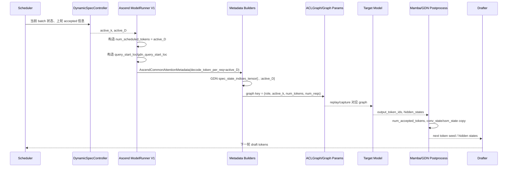

# vLLM/vLLM-Ascend 动态投机与 Hybrid GDN/Mamba State 适配设计

本文整理前序分析中关于 SGLang 动态投机机制、vLLM/vLLM-Ascend 在 Ascend NPU `model_runner_v1` 路径实现动态投机、以及 Qwen3.5 hybrid GDN/Mamba state 适配的关键结论。

重点覆盖三个问题：

1. 动态投机长度切换时，如何保证 graph 命中、异步调度收益不丢失、推理精度不被破坏。
2. hybrid attention/GDN state、Mamba state、conv_state、SSM state 在动态 `k` 下哪些变量必须改、在哪里赋值、在哪里使用。
3. full attention KV cache 在动态投机下是否需要额外处理。

## 1. 背景与目标

目标是在 vLLM/vLLM-Ascend 的 Ascend NPU 场景中，基于 `model_runner_v1` 入口实现类似 SGLang 的动态投机长度机制。

核心目标：

- `fixed_k=3` 动态框架与原静态 `num_speculative_tokens=3` 在相同 batch 下应命中同类 graph。
- `fixed_k=3` 动态框架输出与静态投机一致。
- 动态框架不新增 D2H 同步，不破坏 async scheduling 的收益。
- 当推理过程中发生 `mtp3 -> mtp1`、`mtp1 -> mtp3` 等动态切换时，graph、metadata、GDN/Mamba state 都保持一致。
- 支持策略扩展、投机头方式扩展、模型扩展，优先覆盖 MTP + Qwen3.5 hybrid GDN 模型。

术语约定：

- `active_k`：本轮实际投机草稿长度。
- `active_D = active_k + 1`：target verify 本轮每个 decode 请求实际 forward token 数，包含 1 个 bonus/target token 和 `active_k` 个 draft token。
- `max_k`：配置或能力允许的最大投机长度，只用于容量、buffer、graph capture 范围。
- `fixed_k=3`：动态框架选择器总是选择 `active_k=3`，用于与静态 `num_speculative_tokens=3` 做等价校验。

## 2. 历史分析脉络

前序分析分成几层展开：

1. SGLang 动态投机实现思路：把运行时投机长度作为 runtime state，而不是热路径修改全局 speculative config；graph 根据不同投机长度提前捕获或缓存。
2. vLLM/vLLM-Ascend 固定策略动态框架：先实现 `fixed_k=3` 动态框架，验证与静态投机完全等价，再扩展为真实动态策略。
3. async scheduling 兼容：动态 `k` 只作为 CPU 侧调度标量进入下一轮 metadata 构造，不新增 GPU 数据依赖，不新增同步等待。
4. attention metadata + ACLGraph 适配：`num_tokens` 不能单独作为 graph key，因为 `bs=4,k=3` 和 `bs=8,k=1` 都可能是 16 tokens，但 token layout 和 GDN state index 宽度完全不同。
5. Qwen3.5 hybrid GDN/Mamba state：动态投机最容易破坏精度的不是 full attention KV cache，而是 recurrent state，包括 `conv_state` 和 `ssm_state`。
6. MTP KV cache：Frozen-KV/Gemma4 MTP 这类实现读取 target KV pool，不追加 assistant-side KV；普通 draft/EAGLE/MTP 则可能有自己的 draft cache。vLLM/vLLM-Ascend 方案需要区分模型和投机头类型。

## 3. 总体结论

动态投机的核心不变量是：

```text
active_D = active_k + 1

query_start_loc
gdn_query_start_loc
decode_token_per_req
num_scheduled_tokens
num_decode_draft_tokens
spec_state_indices_tensor.shape[-1]
num_accepted_tokens upper bound
graph key

必须全部对应同一轮 active_D。
```

如果其中任意一个变量还停留在静态 `max_D=max_k+1`，就可能出现以下问题：

- GDN `causal_conv1d_update` 按错误窗口更新 `conv_state`。
- GDN SSM/recurrent kernel 从 rejected token 对应的 state slot 中读最终状态。
- Mamba align mode 的 state copy 目标 block 偏移错误。
- `mtp3 -> mtp1` 切换后，下一轮仍访问旧宽度 state index，污染推理状态。
- ACLGraph 或 AscendC conv1d graph 参数误命中，导致形状或 host args 与 runtime 不一致。

full attention KV cache 本体不需要额外 rollback。它的正确性由逻辑 `seq_lens / num_computed_tokens / block_table / slot_mapping` 控制。Rejected token 即使物理上写过 KV，只要逻辑长度不推进，后续不可见或被覆盖。但 full attention 的 metadata 和 graph key 仍然必须跟 active `k` 对齐。

## 4. 方案架构

建议把动态投机拆成四层：

1. `DynamicSpecController`
   - 负责选择本轮 `active_k`。
   - 固定策略阶段只返回 `fixed_k`。
   - 后续可扩展 acceptance-rate、latency-aware、per-request 或 per-batch 策略。

2. `DynamicSpecRuntimeState`
   - 当前 batch 的只读运行时状态。
   - 只包含 CPU 标量或小对象，不引入 GPU 同步。

3. `DynamicSpecMetadataAdapter`
   - 把 `active_D` 写入 runner、attention metadata、GDN metadata、graph key。
   - 规则是容量按 `max_k`，运行时 view/slice 按 `active_k`。

4. `DynamicSpecGraphDispatcher`
   - graph capture/replay key 带 `spec_k` 或 `decode_token_per_req`。
   - 不允许只按 `num_tokens` 命中。

参考 runtime state：

```python
@dataclass(frozen=True)
class DynamicSpecRuntimeState:
    verify_k: int
    max_k: int
    epoch: int = 0

    @property
    def active_D(self) -> int:
        return self.verify_k + 1

    @property
    def graph_spec_k(self) -> int:
        return self.verify_k
```

`max_k` 只用于：

- buffer 预分配。
- Mamba `num_speculative_blocks`。
- candidate graph capture sizes。
- drafter 最大输出容量。

`active_k` 用于：

- 本轮 draft token 数。
- 本轮 target verify token layout。
- GDN metadata。
- Mamba state copy 逻辑。
- graph dispatch key。

## 5. 执行时序



关键点：

- `active_k` 在本轮 target verify 前确定，且本轮内不可变。
- `num_accepted_tokens` 是本轮 verify 后的结果，作用于本轮 postprocess 和下一轮 preprocess。
- `mtp3 -> mtp1` 切换发生在 step 边界，不在同一个 target forward 内改变 metadata。

## 6. 需要适配的关键变量和代码位置

| 分类 | 变量 | 当前赋值位置 | 当前使用位置 | 修改代码参考 |
|---|---|---|---|---|
| 动态策略状态 | `active_k`, `active_D` | 当前没有独立 runtime state；静态值来自 [`model_runner_v1.py:600`](/Users/linyi/code/Documents/code/vllm-ascend/vllm_ascend/worker/model_runner_v1.py:600) | 所有后续 metadata、graph、draft/verify 都应使用 | 新增 `DynamicSpecRuntimeState`；不要热路径修改 `speculative_config.num_speculative_tokens` |
| target 每请求 token 数 | `decode_token_per_req` | [`model_runner_v1.py:600`](/Users/linyi/code/Documents/code/vllm-ascend/vllm_ascend/worker/model_runner_v1.py:600) 到 `:604` | 写入 common metadata 于 [`model_runner_v1.py:3129`](/Users/linyi/code/Documents/code/vllm-ascend/vllm_ascend/worker/model_runner_v1.py:3129)；MLA padding 使用于 [`mla_v1.py:626`](/Users/linyi/code/Documents/code/vllm-ascend/vllm_ascend/attention/mla_v1.py:626) | 构造期保留 `max_decode_token_per_req=max_k+1`；每轮传 `decode_token_per_req=active_D` |
| query 边界 | `query_start_loc`, `gdn_query_start_loc` | [`model_runner_v1.py:929`](/Users/linyi/code/Documents/code/vllm-ascend/vllm_ascend/worker/model_runner_v1.py:929) 到 `:940` | GDN builder 读 `common_attn_metadata.query_start_loc`，见 [`gdn_attn.py:224`](/Users/linyi/code/Documents/code/vllm/vllm/v1/attention/backends/gdn_attn.py:224) | `cu_num_tokens` 必须由 active `num_scheduled_tokens` 生成；GDN 继续使用未被 FIA padding 污染的 `gdn_query_start_loc` |
| FIA/graph padding | `uniform_decode_query_len` | 静态使用于 [`model_runner_v1.py:724`](/Users/linyi/code/Documents/code/vllm-ascend/vllm_ascend/worker/model_runner_v1.py:724) 和 `:732` | 判断 uniform decode padding | 改为局部 `runtime_decode_query_len=active_D`，或作为参数传入 `_pad_query_start_loc_for_fia` |
| spec 请求标记 | `num_decode_draft_tokens` | [`model_runner_v1.py:1296`](/Users/linyi/code/Documents/code/vllm-ascend/vllm_ascend/worker/model_runner_v1.py:1296) 到 `:1322` | GDN builder/patch 判断 spec 请求，见 [`gdn_attn.py:188`](/Users/linyi/code/Documents/code/vllm/vllm/v1/attention/backends/gdn_attn.py:188)、[`patch_gdn_attn.py:420`](/Users/linyi/code/Documents/code/vllm-ascend/vllm_ascend/patch/worker/patch_gdn_attn.py:420) | 每个 spec decode 请求填 `active_k`，非 spec/prefill 填 `-1`；确保 `len(draft_token_ids)==active_k` |
| accepted 数 | `num_accepted_tokens` | verify 后统计于 [`gpu_model_runner.py:1513`](/Users/linyi/code/Documents/code/vllm/vllm/v1/worker/gpu_model_runner.py:1513)；Ascend 同步旧值于 [`model_runner_v1.py:1017`](/Users/linyi/code/Documents/code/vllm-ascend/vllm_ascend/worker/model_runner_v1.py:1017) | GDN conv/SSM、Mamba postprocess 使用 | 加断言或保护：`1 <= num_accepted_tokens <= active_D`；async 路径沿用 GPU correction，不新增 D2H |
| GDN spec mask | `spec_sequence_masks_cpu` | [`gdn_attn.py:200`](/Users/linyi/code/Documents/code/vllm/vllm/v1/attention/backends/gdn_attn.py:200)；Ascend patch [`patch_gdn_attn.py:420`](/Users/linyi/code/Documents/code/vllm-ascend/vllm_ascend/patch/worker/patch_gdn_attn.py:420) | 拆分 spec/non-spec tokens | 逻辑无需改为 max_k 判断，只要 `num_decode_draft_tokens_cpu >= 0` 即可 |
| GDN state 索引 | `spec_state_indices_tensor` | 当前静态切片于 [`gdn_attn.py:266`](/Users/linyi/code/Documents/code/vllm/vllm/v1/attention/backends/gdn_attn.py:266) 和 `:287` | conv 用第 0 列；SSM 用全部列 | 把 `: self.num_spec + 1` 改为 `: active_D`；full graph buffer 按 max_D 申请，运行时按 active_D view |
| GDN token 索引 | `spec_token_indx`, `non_spec_token_indx` | [`gdn_attn.py:253`](/Users/linyi/code/Documents/code/vllm/vllm/v1/attention/backends/gdn_attn.py:253) 到 `:285` | GDN forward `index_select`，见 [`qwen_gdn_linear_attn.py:1334`](/Users/linyi/code/Documents/code/vllm/vllm/model_executor/layers/mamba/gdn/qwen_gdn_linear_attn.py:1334) | `spec_token_size = num_spec_decodes * active_D`，不能使用静态 `self.num_spec + 1` |
| GDN spec qsl | `spec_query_start_loc` | [`gdn_attn.py:273`](/Users/linyi/code/Documents/code/vllm/vllm/v1/attention/backends/gdn_attn.py:273) 或 `:294` 到 `:303` | conv/recurrent varlen 边界 | 上游 `query_start_loc` 是 active_D 时自然正确；混合 batch 分支也必须由 active query_lens 生成 |
| GDN conv 输入 | `conv_state_indices`, `max_query_len`, `num_accepted_tokens` | 由 GDN metadata 传入 | [`qwen_gdn_linear_attn.py:1344`](/Users/linyi/code/Documents/code/vllm/vllm/model_executor/layers/mamba/gdn/qwen_gdn_linear_attn.py:1344) 到 `:1356` | 算子不用改，保证 `spec_state_indices_tensor.size(-1)==active_D` |
| Ascend conv fallback | `spec_qsl_host`, `spec_ci_host`, `spec_nat_host` | [`patch_gdn_attn.py:651`](/Users/linyi/code/Documents/code/vllm-ascend/vllm_ascend/patch/worker/patch_gdn_attn.py:651) 到 `:680` | AscendC 调用于 [`ops/gdn.py:428`](/Users/linyi/code/Documents/code/vllm-ascend/vllm_ascend/ops/gdn.py:428) | host meta 继续从 active metadata 生成；graph 参数 key 需区分 active_k |
| GDN SSM 输入 | `actual_seq_lengths`, `ssm_state_indices`, `num_accepted_tokens` | Ascend 路径 [`ops/gdn.py:642`](/Users/linyi/code/Documents/code/vllm-ascend/vllm_ascend/ops/gdn.py:642) 到 `:660` | `npu_recurrent_gated_delta_rule` 使用 | `actual_seq_lengths` 必须对应 active_D；`ssm_state_indices.flatten()` 宽度必须是 active_D |
| Mamba block 状态 | `mamba_state_idx` | [`patch_mamba_utils.py:153`](/Users/linyi/code/Documents/code/vllm-ascend/vllm_ascend/patch/worker/patch_mamba_utils.py:153) 到 `:175` | preprocess/postprocess state copy | `num_scheduled_tokens` 必须是 active_D，不能是 max_D 或 graph padded token |
| Mamba postprocess 输入 | `num_scheduled_tokens`, `num_draft_tokens` | staged 于 [`mamba_utils.py:807`](/Users/linyi/code/Documents/code/vllm/vllm/v1/worker/mamba_utils.py:807) 到 `:837` | fused kernel 使用于 [`mamba_utils.py:75`](/Users/linyi/code/Documents/code/vllm/vllm/v1/worker/mamba_utils.py:75) 到 `:83` | `draft_np[i]=active_k`，`scheduled_np[i]=active_D`；这里错会直接污染 state |
| Mamba capacity | `num_speculative_blocks` | [`kv_cache_interface.py:607`](/Users/linyi/code/Documents/code/vllm/vllm/v1/kv_cache_interface.py:607) 到 `:636` | block table gather 于 [`utils.py:936`](/Users/linyi/code/Documents/code/vllm/vllm/v1/attention/backends/utils.py:936) | 保持 max_k 容量，不运行时缩小 |
| graph key | `BatchDescriptor`, `GraphParams` | graph cache key [`acl_graph.py:125`](/Users/linyi/code/Documents/code/vllm-ascend/vllm_ascend/compilation/acl_graph.py:125)，conv graph params [`acl_graph.py:319`](/Users/linyi/code/Documents/code/vllm-ascend/vllm_ascend/compilation/acl_graph.py:319) | replay/capture 命中 | 扩展 key：加入 `spec_k` 或 `decode_token_per_req`；`conv1d_params[num_actual_tokens]` 改为 `(num_actual_tokens, active_D)` |
| reorder decode 判断 | `decode_threshold` | full attention [`attention_v1.py:242`](/Users/linyi/code/Documents/code/vllm-ascend/vllm_ascend/attention/attention_v1.py:242)；MLA [`mla_v1.py:260`](/Users/linyi/code/Documents/code/vllm-ascend/vllm_ascend/attention/mla_v1.py:260) | `split_decodes_and_prefills` / reorder | 构造期保留 max 阈值；build/reorder 时用 active_D |

## 7. GDN/Mamba state 为什么必须特别处理

full attention KV cache 是按 token 位置持久化的 KV。Rejected token 的 KV 可以留在物理缓存里，只要逻辑长度不推进，后续不会被看见。

Mamba/GDN state 不同。它是 recurrent state，只保存“当前序列状态”，不是完整 token history。Spec decode target verify 会一次处理 `active_D` 个 token，但最终只能提交前 `num_accepted_tokens` 个 token。因此：

- `conv_state` 必须更新到 accepted 前缀之后的滑动窗口状态。
- `ssm_state` 必须更新到 accepted 前缀之后的 recurrent state。
- rejected token 对应的 state 不能成为下一轮初始 state。

如果 `active_k=1`，但 metadata 仍按 `max_k=3` 生成，则 GDN 会认为每个请求有 4 个 token：

```text
真实 active_D = 2: [bonus, draft1]
错误 max_D   = 4: [bonus, draft1, stale/pad, stale/pad]
```

这会导致：

- `causal_conv1d_update` 的 `max_query_len` 变成 4，窗口滑动过长。
- `ssm_state_indices_tensor` 多出两列，SSM 可能从错误 state slot 取最终状态。
- `num_accepted_tokens` 若没有被限制在 `1..active_D`，会索引到本轮不存在的 token。

## 8. 按算子拆解变量血缘

### 8.1 `causal_conv1d_update`

上游 vLLM 路径在 [`qwen_gdn_linear_attn.py:1344`](/Users/linyi/code/Documents/code/vllm/vllm/model_executor/layers/mamba/gdn/qwen_gdn_linear_attn.py:1344) 到 `:1356`：

```python
mixed_qkv_spec = causal_conv1d_update(
    mixed_qkv_spec,
    conv_state,
    conv_weights,
    self.conv1d.bias,
    self.activation,
    conv_state_indices=spec_state_indices_tensor[:, 0][:attn_metadata.num_spec_decodes],
    num_accepted_tokens=num_accepted_tokens,
    query_start_loc=spec_query_start_loc,
    max_query_len=spec_state_indices_tensor.size(-1),
)
```

变量来源：

- `spec_state_indices_tensor`：GDN builder 从 `block_table_tensor[spec_mask, :D]` 构造。
- `spec_query_start_loc`：GDN builder 从 active query lengths 构造。
- `num_accepted_tokens`：target verify 后由 `output_token_ids != -1` 统计。
- `max_query_len`：直接来自 `spec_state_indices_tensor.size(-1)`。

适配要点：

- `spec_state_indices_tensor.size(-1)` 必须等于 `active_D`。
- `num_accepted_tokens.max() <= active_D`。
- `spec_query_start_loc` 的 diff 必须等于本轮实际 token 数，不能包含 graph padding 的虚拟 token。

Ascend 自定义 conv 路径在 [`ops/gdn.py:428`](/Users/linyi/code/Documents/code/vllm-ascend/vllm_ascend/ops/gdn.py:428) 到 `:458` 构造 host 参数和 graph 参数。这里同样依赖 `spec_state_indices_tensor.size(-1)` 作为 `spec_q_per_seq`，因此 graph 参数也必须区分 active_D。

### 8.2 `fused_sigmoid_gating_delta_rule_update` / `npu_recurrent_gated_delta_rule`

上游 vLLM GDN recurrent path 在 [`qwen_gdn_linear_attn.py:1457`](/Users/linyi/code/Documents/code/vllm/vllm/model_executor/layers/mamba/gdn/qwen_gdn_linear_attn.py:1457) 到 `:1473`，核心输入是：

- `cu_seqlens=spec_query_start_loc[:num_spec_decodes+1]`
- `ssm_state_indices=spec_state_indices_tensor`
- `num_accepted_tokens=num_accepted_tokens`

Ascend 路径在 [`ops/gdn.py:650`](/Users/linyi/code/Documents/code/vllm-ascend/vllm_ascend/ops/gdn.py:650) 到 `:660` 调用：

```python
torch.ops._C_ascend.npu_recurrent_gated_delta_rule(
    ...
    actual_seq_lengths=actual_seq_lengths,
    ssm_state_indices=spec_state_indices_tensor.flatten(),
    num_accepted_tokens=num_accepted_tokens.to(torch.int32),
)
```

适配要点：

- `actual_seq_lengths` 从 active `spec_query_start_loc` 得到。
- `spec_state_indices_tensor.flatten()` 的二维语义必须是 `[num_spec_decodes, active_D]`。
- 不允许用 `[num_spec_decodes, max_D]` 的 tensor 截断逻辑长度后继续 flatten，否则 AscendC 算子会按错误 stride 解释 state index。

### 8.3 Mamba align `preprocess_mamba`

vLLM-Ascend patch 在 [`patch_mamba_utils.py:159`](/Users/linyi/code/Documents/code/vllm-ascend/vllm_ascend/patch/worker/patch_mamba_utils.py:159) 到 `:175`：

```python
num_scheduled_tokens = scheduler_output.num_scheduled_tokens[req_id]
num_blocks = cdiv(
    req_state.num_computed_tokens + num_scheduled_tokens,
    block_size,
) + num_speculative_blocks
curr_state_idx = num_blocks - 1 - num_speculative_blocks
```

这里的 `num_scheduled_tokens` 必须是 active_D。错误示例：

```text
block_size = 4
num_computed_tokens = 5
active_D = 2
max_D = 4

正确 curr_state_idx = cdiv(5 + 2, 4) - 1 = 1
错误 curr_state_idx = cdiv(5 + 4, 4) - 1 = 2
```

错误 state block 会使下一轮 GDN 从错误位置取初始 state，属于精度错误，不只是性能问题。

### 8.4 Mamba align `postprocess_mamba_align_gpu`

上游 fused GPU kernel 在 [`mamba_utils.py:75`](/Users/linyi/code/Documents/code/vllm/vllm/v1/worker/mamba_utils.py:75) 到 `:83`：

```python
num_accepted = tl.load(num_accepted_tokens_ptr + req_idx)
src_block_idx = tl.load(mamba_state_idx_ptr + req_idx)
num_scheduled = tl.load(num_scheduled_tokens_ptr + req_idx)
num_computed = tl.load(num_computed_tokens_ptr + req_idx)
num_draft = tl.load(num_draft_tokens_ptr + req_idx)

num_tokens_running_state = num_computed + num_scheduled - num_draft
new_num_computed = num_tokens_running_state + num_accepted - 1
```

变量 staging 位置在 [`mamba_utils.py:807`](/Users/linyi/code/Documents/code/vllm/vllm/v1/worker/mamba_utils.py:807) 到 `:837`。

适配要点：

- `num_scheduled=active_D`。
- `num_draft=active_k`。
- `num_accepted` 是 valid sampled token count，范围 `1..active_D`。

如果 `num_scheduled` 使用 max_D，而 `num_draft` 使用 active_k，则 `num_tokens_running_state` 会偏移；如果二者都用 max，则 rejected token 可能被当成上下文推进。

## 9. Graph 模式适配

必须修改 graph key。

当前 vLLM-Ascend `ACLGraphWrapper` 使用 `BatchDescriptor` 做 graph cache key，入口在 [`acl_graph.py:125`](/Users/linyi/code/Documents/code/vllm-ascend/vllm_ascend/compilation/acl_graph.py:125)。`GraphParams` 中 Ascend attention/conv1d 参数按 `num_tokens` 分桶，见 [`acl_graph.py:319`](/Users/linyi/code/Documents/code/vllm-ascend/vllm_ascend/compilation/acl_graph.py:319)。

风险示例：

```text
case A: bs=4, active_k=3, active_D=4, num_tokens=16
case B: bs=8, active_k=1, active_D=2, num_tokens=16

num_tokens 相同，但 query layout、GDN state index shape、conv1d host args 都不同。
```

建议：

```python
@dataclass(frozen=True)
class SpecGraphKey:
    role: Literal["target", "draft", "draft_prefill"]
    spec_k: int
    num_tokens: int
    num_reqs: int | None = None
```

或者扩展 `BatchDescriptor`：

```python
@dataclass(frozen=True)
class BatchDescriptor:
    num_tokens: int
    num_reqs: int | None = None
    spec_decode_query_per_req: int = 1
    spec_decode_verify_k: int = 0
```

AscendC GDN conv1d graph params 建议从：

```python
graph_params.conv1d_params[num_actual_tokens]
```

改成：

```python
graph_params.conv1d_params[(num_actual_tokens, active_D)]
```

否则只改 ACLGraph key 不够，GDN 内部 graph params 仍可能误复用。

## 10. Async scheduling 兼容性

动态投机不应新增同步点。判断依据：

- `active_k` 是调度侧 CPU 标量或策略输出，不依赖当前 step GPU tensor。
- `valid_sampled_token_count` 原本就存在异步 D2H/事件路径，见 [`model_runner_v1.py:1619`](/Users/linyi/code/Documents/code/vllm-ascend/vllm_ascend/worker/model_runner_v1.py:1619) 到 `:1639`。
- async spec decode 的 GPU correction 已有路径，见 [`spec_decode/utils.py:6`](/Users/linyi/code/Documents/code/vllm-ascend/vllm_ascend/spec_decode/utils.py:6) 到 `:31`。
- `num_accepted_tokens_event` 原本用于 hybrid/Mamba state，动态 `k` 不应额外 `synchronize()`。

需要避免的行为：

- 为了选择 active_k 从 GPU 拿 acceptance rate 做同步 `.cpu()` / `.item()`。
- 在 GDN metadata build 中读取 device tensor shape 之外的 GPU 内容。
- 为了 graph dispatch 读取 GPU 上的 `num_accepted_tokens`。

可接受的行为：

- 从 `scheduler_output.scheduled_spec_decode_tokens` 得到 `len(draft_token_ids)`。
- 从 CPU 侧 `num_decode_draft_tokens_cpu` 构造 mask。
- 复用已有 pinned memory + event 的 accepted count 路径。

## 11. MTP KV cache 处理补充

前序分析区分了两类 MTP：

1. 普通 draft/EAGLE/MTP：draft 可能有自己的 KV 或推进 draft positions。
2. Frozen-KV/Gemma4 MTP：draft 不拥有独立 KV pool，只读取 target KV cache。

SGLang Frozen-KV MTP 的关键参考：

- `sglang/python/sglang/srt/speculative/frozen_kv_mtp_worker_v2.py` 中说明 draft worker 读取 target KV cache，自己不拥有 KV pool。
- `sglang/python/sglang/srt/speculative/frozen_kv_mtp_utils.py` 中通过 context manager 把 draft backend 的 `token_to_kv_pool` 临时替换为 target pool，并设置 frozen KV positions。
- vLLM Gemma4 speculator 中 `advance_draft_positions=False`，表示 Q-only 读取 target K/V，不追加新 draft KV。

因此，“MTP 的 KV cache 用主模型 KV pool”不是指把 draft token 的 KV 临时写到主模型某层再丢弃，而是指 draft attention 读取 target 已提交 KV，draft 侧不追加 assistant-side KV。最终是否提交 token，仍由 target verify 决定。

这个点与 GDN/Mamba state 的区别是：

- Frozen-KV MTP 的 draft KV 不会污染，因为 draft 不写追加 KV。
- GDN/Mamba state 会在 target verify 中处理多个 token，必须显式按 accepted token 选择最终 state。

## 12. Full Attention KV Cache 是否需要特别修改

结论：KV cache 本体不需要特别修改，但 KV metadata 必须动态适配。

不需要特别修改的原因：

- full attention KV cache 保存每个 token 的 KV，而不是单一 recurrent state。
- rejected token 的 KV 即使写入物理 cache，只要 `num_computed_tokens/seq_lens` 没推进，后续 attention 不会读取到。
- 后续相同 slot 可被覆盖。

仍需动态适配的变量：

- `slot_mapping`：在 [`model_runner_v1.py:1255`](/Users/linyi/code/Documents/code/vllm-ascend/vllm_ascend/worker/model_runner_v1.py:1255) 到 `:1262` 计算，依赖 active query layout。
- `block_table_tensor`：graph padding 时不能误把 padding 行当真实请求。
- `seq_lens`：async spec decode 下 GPU corrected seq_lens 是权威值。
- `query_start_loc`：full attention、MLA、GDN 必须共享同一轮 active_D。

也就是说：

```text
KV cache data structure: 不改
KV metadata / slot mapping / graph key: 必须改
```

## 13. 固定策略验证标准

`fixed_k=3` 动态框架必须满足：

```text
active_k = 3
active_D = 4
decode_token_per_req = 4
query_start_loc = [0, 4, 8, 12, ...]
spec_state_indices_tensor.shape[-1] = 4
num_decode_draft_tokens[decode_req] = 3
graph key 带 spec_k=3
```

与静态 `num_speculative_tokens=3` 对比：

- 输出 token 完全一致。
- accepted token count 分布一致。
- target verify graph 命中同类 graph。
- GDN conv1d graph params 命中 `(num_actual_tokens, 4)`。
- 无新增 `.cpu()`、`.item()`、`synchronize()` 热路径。
- decode latency 在噪声范围内一致。

动态切换 `mtp3 -> mtp1` 验证：

```text
step t:
  active_k = 3
  active_D = 4
  verify 后 num_accepted_tokens in [1, 4]
  postprocess 把 state 固化到 accepted 前缀

step t+1:
  active_k = 1
  active_D = 2
  spec_state_indices_tensor.shape[-1] = 2
  spec_query_start_loc diff <= 2
  graph key = spec_k=1
```

上一轮未接受 token 对应的 state 可以残留在物理 block 中，但不能再被逻辑 state index 选中。

## 14. 开发阶段断言

建议在 debug 或开发开关下加入：

```python
assert common_attn_metadata.decode_token_per_req == active_k + 1
assert spec_state_indices_tensor.shape[-1] == active_k + 1
assert int(torch.diff(spec_query_start_loc).max()) <= active_k + 1
assert int(num_accepted_tokens.max()) <= active_k + 1
assert int(num_accepted_tokens.min()) >= 1
```

graph 侧：

```python
assert batch_desc.spec_decode_verify_k == active_k
assert conv1d_graph_key == (num_actual_tokens, active_k + 1)
```

Mamba postprocess staging：

```python
assert scheduled_np[i] == active_k + 1
assert draft_np[i] == active_k
```

## 15. 建议落地顺序

1. 固定策略动态框架
   - 新增 `DynamicSpecRuntimeState`。
   - 固定返回 `active_k=3`。
   - 保持 draft 输出长度与静态一致。

2. runner metadata 适配
   - `decode_token_per_req=active_D`。
   - `_pad_query_start_loc_for_fia` 使用 active_D。
   - `num_decode_draft_tokens` 写 active_k。

3. GDN metadata 适配
   - builder buffer 按 max_D。
   - 运行时切片按 active_D。
   - Ascend patch host meta 由 active metadata 生成。

4. graph key 适配
   - `BatchDescriptor` 或等价 graph key 加 `spec_k`。
   - `GraphParams` 中 GDN conv1d 参数按 `(num_actual_tokens, active_D)` 分桶。

5. Mamba state 校验
   - `preprocess_mamba` 和 `postprocess_mamba_align_gpu` 输入 active token 数。
   - block 边界 case 验证 state copy。

6. 动态策略扩展
   - 在 fixed_k 等价通过后，再接 acceptance-aware 策略。
   - 策略输入优先使用已有异步统计，避免新增同步。

## 16. 关键风险清单

- 只改 target forward 的 token 数，未改 GDN state index 宽度。
- 只改 ACLGraph key，未改 AscendC GDN `GraphParams` 分桶。
- `query_start_loc` 用 active_D，但 `decode_token_per_req` 仍是 max_D，导致 MLA/full attention padding 错。
- `num_scheduled_tokens` 用 max_D，Mamba `curr_state_idx` 偏移。
- `num_draft_tokens` 用 max_k，postprocess 误算 `num_tokens_running_state`。
- 策略为了选择 active_k 读取 GPU acceptance 结果并同步，导致 async scheduling 收益丢失。

## 17. 最终判断

当前方案在设计上可以满足：

- 完全兼容 async scheduling：active_k 是 CPU runtime decision，不新增 GPU 同步；accepted count 沿用已有异步路径。
- fixed_k 与静态投机等价：只要 active_D 贯穿 query layout、GDN metadata、graph key。
- 动态投机长度切换开销极低：切换只改变 metadata view 和 graph key，不重配大 buffer。
- 策略可扩展：`DynamicSpecController` 可插拔。
- 投机头可扩展：先支持 MTP，后续按 drafter 能力声明 `max_k/active_k`。
- 模型可扩展：full attention KV cache 本体无需改；hybrid/GDN/Mamba 需要严格处理 recurrent state。

最关键的实现原则仍然是：

```text
容量按 max_k。
运行时按 active_k。
graph key 带 active_k。
Mamba/GDN state 只提交 accepted 前缀。
```
