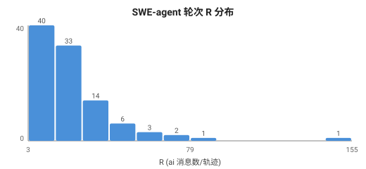
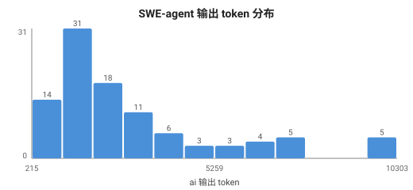

# Agentic Workload 样例实例化分析 — 报告

> 目的：拿真实 agentic 数据集 `nebius/SWE-agent-trajectories` 把「总体方案设计」跑一遍，验证 ① 方案是否完整 ② 输出长什么样、怎么用。
> 数据：HF datasets-server API 拉取 train 前 100 条真实轨迹（全集 80,036 条）。
> 脚本：`20260629-004700-swe-trajectory-workload-画像分析-脚本.py`（可复跑）。
> 可视化：`20260629-013000-workload-可视化生成-脚本.py` → `figures/`。
> 对照方案正本：`wiki/syntheses/20260629-100000-agentic-workload-analysis-总体方案设计-综合.md`。

---

## A. 分析过程：数据集关键信息与统计明细

> 这一节展示「得出结论的过程」——数据集长什么样、原始统计、分布可视化，而非只给结论。

### A.1 数据集关键信息

| 项 | 值 |
|---|---|
| 数据集 | `nebius/SWE-agent-trajectories`（80,036 轨迹，分析采样前 100）|
| 来源任务 | SWE-bench-extra + SWE-bench dev 的 GitHub issue |
| model | swe-agent-llama-70b ×95，llama-8b ×5 |
| 解决率 target | 17/100 = **17%**（真实 agent 成功率低）|
| exit_status | submitted 74，submitted(exit_context) 24，exit_context 2 → **24% 上下文超限截断** |

### A.2 轮次 R 统计明细
```
min=3  P50=18  mean=24.0  max=155  stdev=20.3
```
ASCII 分布（脚本真实输出）：
```
SWE 轮次 R 分布  (n=100, range [3,155])
[    3,   22) ████████████████████████████████████████ 61
[   22,   41) █████████████████ 26
[   41,   60) █████ 9
[   60,   79) █ 2
[   79,   98)  1
[  136,  155)  1   ← 长尾：155 轮的极端长会话
```
**读图**：61% 集中在 3-22 轮，但有长尾（max 155）。stdev 20.3 ≈ mean，说明轮次离散度高 → 价值逐出需按 session 个体的剩余轮次，不能用全局均值。

### A.3 可视化图（SVG，Obsidian/desktop 直接渲染）





> 图文件：`figures/fig1-swe-轮次R分布.svg`、`figures/fig2-swe-输出长度分布.svg`

---

## 0. 数据集结构 → 方案输入的映射（先对齐）

`nebius/SWE-agent-trajectories` 7 列，核心是 `trajectory`：一个 message 列表，每条含 `{role, text, system_prompt, cutoff_date, mask}`。**这正是 OpenAI chat `messages[]` 的离线形态**，所以方案 §3.1「OpenAI chat 可推断层」可直接实例化。

| 数据集字段 | 方案里的角色 | 实例化层级 |
|---|---|---|
| `trajectory[].role` (system/user/ai) | 轮次结构、段类型雏形 | `[推]` |
| `trajectory[].system_prompt` / 首条 system | 共享前缀主体 | `[推]` |
| `trajectory[].text` (ai 内 ``` 围栏) | thinking / tool_call 段切分 | `[推]`近似 |
| `target` (bool) / `exit_status` | 任务成败、被截断信号 | `[推]` |
| **缺：请求间时间戳** | 阻塞时长 β | `[报]` 必须上报 |

**SWE-agent 轨迹的真实语义**（走读样例确认）：
- `system` = 任务设定 + 工具定义（SETTING: You are an autonomous programmer...）→ 跨请求高度复用的前缀
- `ai` message = **thinking（"Let's run it to see..."）+ tool_call（` ```lexicon memset create...``` ` 命令）**
- `user` message = **工具执行返回**（Traceback、`Directory src not found`、`ls` 输出）+ 末尾稳定模板 `(Open file:...)(Current directory:...)bash-$`

---

## 1. 五张分布的真实数字（n=100）

### 元信息
- model：swe-agent-llama-70b ×95，llama-8b ×5
- target（解决率）：17%（83% 未解决）—— 真实 agent 成功率本就不高
- exit_status：submitted 74，submitted(exit_context) 24，exit_context 2 → **24% 因上下文超限被截断**（这本身是 KV/上下文压力的直接证据）

### 分布① 轮次 R `[推]`
```
P50=17.5  P90=44.2  P99=83.7  max=155  mean=24.0
单轮(≤2)占比=0%   长会话(≥10轮)占比=87%
```
**解读**：SWE code agent 是**极典型的长会话负载**——平均 24 轮，几乎没有单轮请求，87% 是 10 轮以上。→ 价值逐出 / 前缀 pin 的收益随 R 线性放大，这类负载是它们的主战场。

### 分布② 前缀复用率 ρ `[推]`
```
system token: P50=1218  P90=1218   占上下文比 mean=14%
system 模板近似种类数 ≈ 1
```
**解读**：system prompt 固定 1218 token，**全样本几乎同一个模板**（同一 agent 框架）。→ 前缀 pin 命中收益**直接且确定**：1218 token × 每轮复用 × 24 轮 = 大量可省的重复 prefill。这是方案里「最易落地、收益直接」判断的实证。

### 分布③ 阻塞代理 β —— **方案完整性的关键验证点**
```
✗ 离线轨迹无请求间时间戳 → 推不出真实工具阻塞时长
代理量：mean 工具调用轮 = 24（阻塞频次高）
```
**解读**：数据集**确实推不出 β**——这恰好印证方案的核心论断：`expected_idle_ms` 是「未来量」，离线 OpenAI 数据天然缺失，**必须 `[报]` agent 上报**。方案没有遗漏，反而被数据反向证实。

### 分布④ 输出段结构 `[推]`近似
```
thinking 段占 ai 输出 =73%   tool_call(命令)段 =27%
```
**解读**：ai 输出里 73% 是自然语言推理、27% 是结构化命令。→ tool_call 段结构化、accept rate 高，是 DSL 长 draft + 约束解码的收益区；thinking 段发散用短 draft。验证了「段类型先验切换投机长度」有实打实的作用面。

### 分布⑤ 负载聚类 `[推]`
```
长输出/重思考类(out_tok≥中位) n=50  mean R=35.8
短输出/多交互类             n=50  mean R=12.2
```
**解读**：单一 SWE 数据集内部就已分出两个亚型（深推理长会话 vs 快交互短会话），mean R 差 3 倍。→ 验证方案 §3.1「负载差异需 L1 归一化」假设成立；真实多应用混部时分化会更大。

### 附：上下文构成 `[报]`精确/此处近似
```
system 前缀 =14%   工具返回(user) =79%   ai 输出 =21%
```
**解读**：**工具返回占上下文 79%，是绝对主体**。→ 「段级 KV 语义压缩」（一次性工具返回可压缩/可丢）的潜力区被坐实：长会话里最大的 KV 占用来自历史工具输出，不是 system、不是 ai 生成。

---

## 2. 收益重估：真实 β/ρ/R 代回方案 §4

| 参数 | 实测值（SWE code agent）| 对优化的含义 |
|---|---|---|
| R 平均轮次 | **24** | 价值逐出/前缀 pin 收益随 R 放大 → 高 |
| ρ 前缀占比 | **14%**，模板单一 | pin 命中确定可省，收益直接 |
| 工具返回占比 | **79%** | 段级 KV 压缩潜力最大 |
| thinking:tool_call | **73:27** | DSL 段先验有作用面 |
| β 阻塞 | **数据集缺** | 需 `[报]` 上报后才能定阻塞换出收益 |
| 截断率 | **24% exit_context** | 上下文压力真实存在，KV 优化刚需 |

**本类负载的优化优先级排序（数据驱动，替代拍脑袋）**：
```
前缀 pin ≈ 价值逐出  >  段级 KV 压缩  >  段类型 DSL  >  阻塞换出(待 β)
   (ρ 确定)  (R=24 高)    (工具返回 79%)    (27% 结构化)    (无数据)
```

> 注意：这个排序**和方案 §4 的通用排序不同**——方案默认排序把阻塞换出放近期 P0，但 SWE code agent 这类负载里，阻塞换出因缺 β 数据反而要后置，前缀 pin/价值逐出/段级压缩因有强数据支撑而前置。**这正是 workload 分析的价值：让数据修正方案的先验排序。**

---

## 3. 方案完整性检验结论

| 检验项 | 结果 |
|---|---|
| OpenAI chat 结构能否实例化 `[推]` 层指标 | ✅ R/ρ/段结构/聚类全部跑出真实数字 |
| `[报]` 层（β/idle/dag）是否真的推不出 | ✅ β 确实缺失，印证「必须上报」非冗余 |
| 指标体系有无遗漏维度 | ✅ 三维信号 + 引擎效率基线均有对应数据落点 |
| 输出能否驱动决策 | ✅ 产出了数据驱动的优先级排序，且修正了通用排序 |
| 发现的方案盲点 | ⚠ 见下 |

**发现的盲点 / 方案待补**：
1. **multi-agent DAG 维度在本数据集为空**：SWE-agent 是单 agent 串行，无 fan-out/join。→ 「DAG 组完成调度」护城河需**另找 multi-agent 数据集**验证（如有 orchestrator 轨迹），不能用 SWE 数据支撑。
2. **token 估算用 char/4 粗估**：真实落地需接目标模型 tokenizer，当前数字是量级正确、绝对值待校准。
3. **段切分用 ``` 围栏近似**：SWE-agent 命令恰好用围栏，通用 agent（OpenAI tool_calls 字段）需改用 `finish_reason=tool_calls` + `tool_calls[]` 精确切分。

---

## 4. 输出怎么用（落地闭环）

1. **直接产物**：五张分布 + 优先级排序 → 喂给方案 §4，把「P0/P1/P2」从假设改成数据驱动。
2. **校准 `[报]` 诉求**：β 缺失被坐实 → 给 agent/Dynamo 上游提 `expected_idle_ms` 上报需求时，附本报告作证据（"离线数据确实推不出，不是我们没尽力"）。
3. **基线锚点**：24% 截断率、79% 工具返回占比 → 作为「段级 KV 压缩」上线前后的对照基线。
4. **可复跑**：换数据集（多 agent / 不同领域）重跑脚本，即可得该负载画像，横向对比验证「负载差异」假设。

---

## 附：复现命令

```bash
# 拉真实数据（前 100 行，约 7MB）
curl -sL "https://datasets-server.huggingface.co/rows?dataset=nebius%2FSWE-agent-trajectories&config=default&split=train&offset=0&length=100" -o swe_rows_100.json
# 跑画像
python3 20260629-004700-swe-trajectory-workload-画像分析-脚本.py swe_rows_100.json
```
