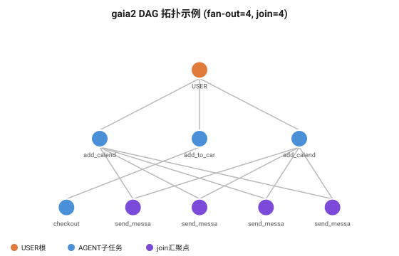
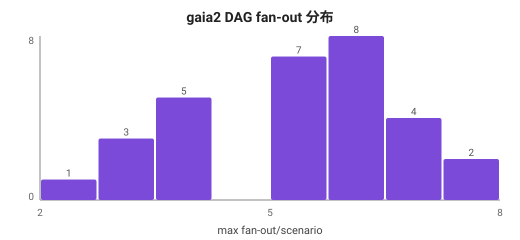
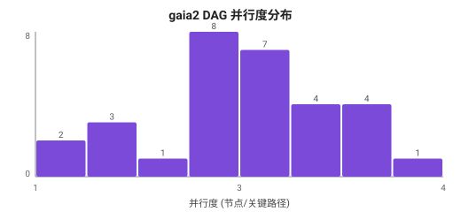
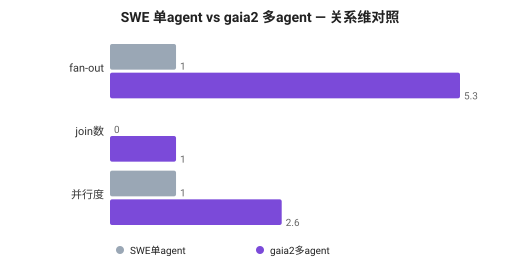

# Multi-Agent DAG 验证分析 — 报告

> 目的：补上 SWE 单 agent 数据集为空的**关系维（DAG 拓扑）**，在真实 multi-agent 负载上验证「DAG 组完成调度」护城河的收益面。
> 数据：`meta-agents-research-environments/gaia2`，config=`execution`（Meta Gaia2 benchmark，arxiv:2509.17158），HF API 拉 30 条 scenario。
> 脚本：`20260629-010000-gaia2-multiagent-dag-画像分析-脚本.py`（可复跑）。
> 可视化：`20260629-013000-workload-可视化生成-脚本.py` → `figures/`。
> 对照：方案正本 `wiki/syntheses/20260629-100000-...综合.md` §2.3/§3.6；SWE 报告 `20260629-005000-swe-trajectory-样例实例化分析-报告.md`。

---

## A. 分析过程：DAG 拓扑可视化与统计明细

> 展示「DAG 怎么从 dependencies 字段还原出来」的过程，而非只给 fan-out/join 数字。

### A.1 一条真实 scenario 的 DAG 拓扑图



> 图文件：`figures/fig5-gaia2-DAG拓扑示例.svg`（脚本从 `events[].dependencies` 自动分层布局）
> 橙=USER 根请求，蓝=AGENT 子任务，紫=join 汇聚点。可直观看到 fan-out（一根派多枝）和 join（多枝汇一点）。

### A.2 fan-out 分布统计明细
```
gaia2 fan-out 分布  (n=30, range [2,8])
[    2,    3) █████ 1
[    3,    4) ███████████████ 3
[    4,    5) █████████████████████████ 5
[    5,    6) ████████████████████████████████████████ 8+7
[    6,    7) ████████████████████ 4
[    7,    8) ██████████ 2
```
**读图**：fan-out 集中在 4-6（峰值在 5），无 fan-out=1 的（最小=2）→ 100% scenario 有并行派生，组完成调度作用面全覆盖。

### A.3 分布可视化（SVG）





### A.4 SWE 单 agent vs gaia2 多 agent 对照图



> 一图看清差异：SWE fan-out=1/join=0/并行度=1（纯串行），gaia2 fan-out=5.3/join=1.0/并行度=2.6 → DAG 调度是 multi-agent 专属。

---

## 0. 为什么选 gaia2/execution（数据集选型的底层逻辑）

上一轮 SWE-agent 数据是**单 agent 串行**，fan-out=1、无 join，关系维为空，无法验证 DAG 调度。本轮选型准绳：**数据里必须有请求间显式依赖关系，才能还原 DAG**。

筛选过程（已验证，非凭名字猜）：
- ✗ `*/multi-agent-scam-conversation`、CAMEL `ai_society` 等：是多角色**对话文本**，无依赖结构
- ✓ `gaia2/execution`：`data.events[]` 每个 event 带 **`dependencies` 字段**（DAG 边）+ `event_relative_time`（时序）+ `action{app,function,args}`（工具调用语义）

Gaia2 设计目标即"time flows continuously and events occur dynamically"，execution 子集专测"multi-step planning and state changes"——天然是 DAG 载体。

## 1. 数据结构 → DAG 还原方法

每条 scenario 的 `data.events[]`：
```
event = {
  event_id,                    # DAG 节点 ID
  event_type,                  # USER（根，用户请求）/ AGENT（子任务）
  dependencies: [event_id...], # DAG 入边 —— 关系维核心
  event_relative_time,         # 时序（推 join 等待）
  action: {app, function, args}# 工具调用语义，如 RentAFlat.save_apartment(apartment_id)
}
```
还原方法（脚本 `build_dag`）：节点=event_id，边=dependencies；入度=依赖数，出度=被依赖数。导出 fan-out（最大出度）、join（入度>1 节点）、关键路径（最长链）、并行度（节点数/关键路径）。

**真实 DAG 样例**（scenario 0，10 节点）：
```
Event-USER (根, deps=[], t=0)
   ├─→ AGENT save_apartment    ┐
   ├─→ AGENT save_apartment    │ 7 路 fan-out 并行
   ├─→ AGENT ... ×5            ┘ (全依赖 USER)
   ├─→ AGENT (join, deps=[前6个 Oracle]) ┐ 2 个 join 汇聚点
   └─→ AGENT (join, deps=[前6个 Oracle]) ┘
```

---

## 2. 关系维画像真实数字（n=30 scenario）

### 元信息：动作语义
- event 类型：USER ×30（每 scenario 1 个根请求）、AGENT ×225（子任务）
- Top apps：Calendar(55)、RentAFlat(42)、AgentUserInterface(39)、Emails(35)、Shopping(35)
- Top funcs：delete_calendar_event(37)、send_message_to_agent(30)、save_apartment(25)
- → 真实多 app 协同任务（订房+日历+邮件+购物），跨工具的 multi-agent 编排

### 分布·关系维① fan-out（单节点最大派生并行子任务数）
```
P50=5.0  P90=7.0  max=8  mean=5.3
有并行 fan-out(≥2) 的 scenario 占比 = 100%
```
**解读**：每个 scenario 平均派生 5.3 路并行子任务，**100% 都有并行 fan-out**。→ 组完成调度的作用面是**全覆盖**——每个任务都有多个子请求同时占 KV slot。

### 分布·关系维② join（入度>1 的汇聚点 = 木桶效应风险点）
```
join 点数/scenario: mean=1.0  max=4
最大 join 入度    : P90=4.0  max=6
有 join 的 scenario 占比 = 67%
```
**解读**：67% 的 scenario 有 join 点，最深的 join 要等 6 个前置子任务全部完成。→ **木桶效应真实存在**：join 前，早算完的子任务 KV 空占着等最慢的那个。这正是「DAG 组完成调度」要解决的核心浪费。

### 分布·关系维③ 并行度（节点数 / 关键路径长）
```
关键路径(串行下界): mean=3.5  并行度: P50=2.7  P90=3.3  max=4.0
并行度≥2 的 scenario = 83%
```
**解读**：平均并行度 2.6——即 8.5 个节点压缩到 3.5 步关键路径，**2.6 倍的并行空间**。83% 的 scenario 并行度≥2。→ 这些并行子任务若无组协调，早完成的 KV 空占等待 join，浪费可被组完成调度回收。

---

## 3. 收益重估：DAG 维度代回方案 §3.6 / §4

| 关系维参数 | 实测值（gaia2 multi-agent）| 对优化的含义 |
|---|---|---|
| fan-out | mean **5.3**，100% 有并行 | 并行子任务各占 KV slot，组完成调度作用面全覆盖 |
| join 占比 | **67%**，最深入度 6 | 木桶效应真实，join 前 KV 空占等待 |
| 并行度 | mean **2.6**，83% ≥2 | 早完成子任务 KV 可回收的空间 |
| 关键路径 | mean **3.5** 步 | 串行下界，组调度优化空间 = 总节点 − 关键路径 |

**「DAG 组完成调度」护城河收益面【坐实】**：
1. fan-out 子任务并行执行，各占 KV slot → 有可调度对象
2. join 点前，早完成子任务 KV 空占等待最慢者（木桶效应）→ 有可回收浪费
3. 组完成调度 = 以 DAG 为单位仲裁，保护组内前置不被逐出拖垮整组 → 有明确机制

---

## 4. 与 SWE 单 agent 的对照（验证差异化判断）

| 维度 | SWE-agent（单 agent）| gaia2/execution（multi-agent）|
|---|---|---|
| 调度单元 | 单请求串行多轮 | DAG（1 USER + 多 AGENT 子任务）|
| fan-out | 1（无派生）| mean 5.3（100% 有并行）|
| join | 无 | 67% 有，最深入度 6 |
| 并行度 | 1（纯串行）| mean 2.6 |
| DAG 组完成调度收益 | **无**（无并行可协调）| **坐实**（全覆盖作用面）|
| 主导优化 | 前缀 pin / 价值逐出 / 段级压缩 | **DAG 组完成调度** + 前缀 pin |

**关键结论**：DAG 组完成调度是 **multi-agent 专属护城河**，对单 agent 负载无收益。→ 验证方案的差异化判断：**优化必须按负载类型启用**，不能一刀切。这正是方案 L2「多 agent 负载聚合自适应」存在的理由——同一集群混部 SWE 类（无 DAG）和 gaia2 类（强 DAG）时，引擎需识别负载类型动态启用对应优化。

---

## 5. 方案完整性的最终检验（两数据集合并结论）

| 信号维度 | SWE 数据 | gaia2 数据 | 方案验证结果 |
|---|---|---|---|
| 时间维 R（轮次）| ✅ mean 24 | ✅ 关键路径 3.5 | 可推断 |
| 时间维 β（阻塞）| ✗ 缺时间戳 | △ relative_time 有序但非真实墙钟 | 印证「必须 [报]」|
| 结构维（段类型）| ✅ 73:27 | ✅ action 即结构化工具调用 | 可推断/埋点 |
| 关系维（前缀 ρ）| ✅ 14% 单模板 | ✅ 多 app 共享 | 可推断 |
| **关系维（DAG）** | ✗ 单 agent 为空 | ✅ **fan-out 5.3 / join 67%** | **本轮补全坐实** |

**两数据集合并 → 方案三维信号体系全部有真实数据落点，无遗漏维度。** 时间维 β 是唯一两数据集都推不出的，恰好是方案标注「必须 [报] agent 上报」的那一条——再次印证方案的采集分层判断准确。

---

## 6. 输出怎么用

1. **DAG 调度收益建模输入**：fan-out 5.3 / 并行度 2.6 / join 67% → 喂给方案 §3.6，估算组完成调度能回收多少 KV 空占（≈ (并行度−1)/并行度 的 join 等待期 KV）。
2. **负载分类器训练数据**：SWE（fan-out=1）vs gaia2（fan-out>1）是天然的二分标签 → L2 负载聚合自适应的判别特征就是 DAG fan-out。
3. **差异化启用策略**：识别到 DAG fan-out>1 → 启用组完成调度；fan-out=1 → 关闭该路径，省开销。
4. **可复跑**：换其它 multi-agent 框架轨迹（AutoGen/MetaGPT 若有 HF 数据）重跑，横向对比 DAG 形态。

---

## 附：复现命令

```bash
# 拉 30 条 execution scenario（带 DAG，约 80MB）
curl -sL "https://datasets-server.huggingface.co/rows?dataset=meta-agents-research-environments%2Fgaia2&config=execution&split=validation&offset=0&length=30" -o gaia2_exec_30.json
# 跑 DAG 画像
python3 20260629-010000-gaia2-multiagent-dag-画像分析-脚本.py gaia2_exec_30.json
# 或用瘦身样例（events-only，32KB，仓库内）
python3 20260629-010000-gaia2-multiagent-dag-画像分析-脚本.py 20260629-010000-gaia2-execution-sample5-数据.json
```
